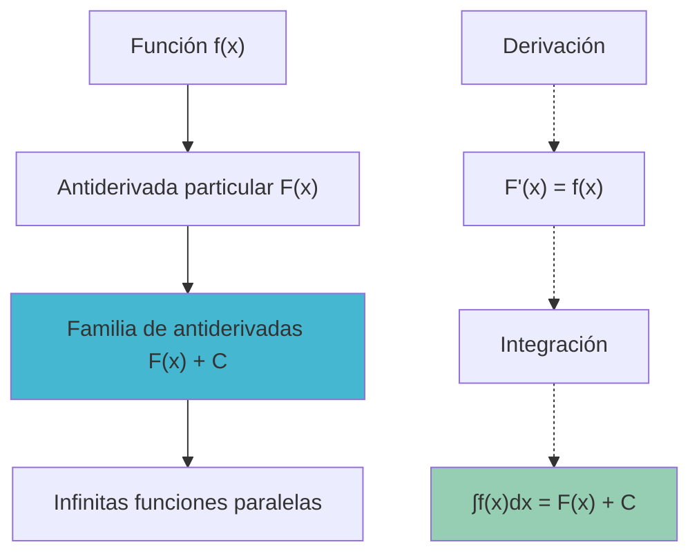
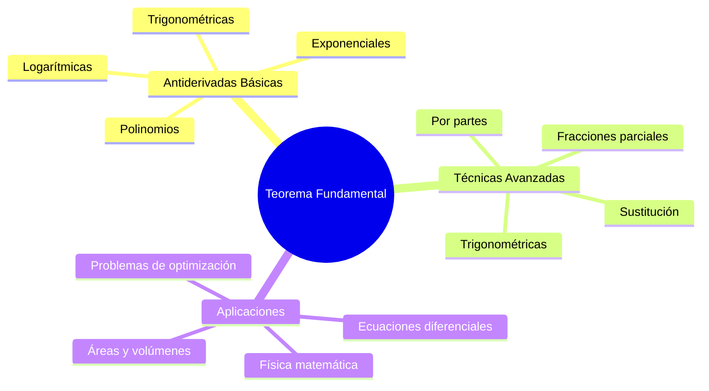
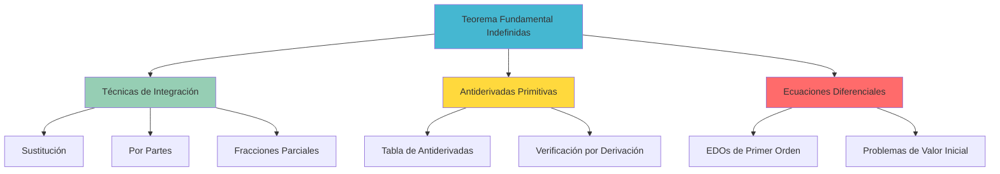

# 🌀 Teorema Fundamental del Cálculo para Integrales Indefinidas

> [!info] 💡 **La Conexión Fundamental**
> El Teorema Fundamental del Cálculo para integrales indefinidas establece que la integración y la derivación son operaciones inversas, proporcionando la base teórica para encontrar antiderivadas y resolver problemas de cálculo integral.

## 🎯 Definiciones Fundamentales

### 📐 Integral Indefinida (Antiderivada)

> [!tip] 🏆 **Definición**
> Una **integral indefinida** de una función $f(x)$ es una función $F(x)$ tal que:
> 
> $$F'(x) = f(x)$$
> 
> **Notación**: $\int f(x) dx = F(x) + C$
> 
> donde $C$ es la **constante de integración**.

### 🔍 Familia de Antiderivadas

> [!warning] 🎯 **Concepto Clave**
> Si $F(x)$ es una antiderivada de $f(x)$, entonces **todas** las antiderivadas de $f(x)$ tienen la forma:
> 
> $$G(x) = F(x) + C$$
> 
> donde $C$ es cualquier constante real.

## ⚡ Teorema Fundamental para Indefinidas

### 🏆 Enunciado Principal

> [!tip] 🎯 **Teorema Fundamental del Cálculo (Versión Indefinida)**
> Si $f(x)$ es continua en un intervalo, entonces:
> 
> 1. **Existencia**: Existe una antiderivada $F(x)$ de $f(x)$
> 2. **Unicidad**: Todas las antiderivadas difieren por una constante
> 3. **Relación inversa**: $\frac{d}{dx}\left[\int f(x) dx\right] = f(x)$

### 🔄 Operaciones Inversas

> [!info] ⚡ **Relaciones Fundamentales**
> 
> **Derivación de una integral**:
> $$\frac{d}{dx}\left[\int f(x) dx\right] = f(x)$$
> 
> **Integral de una derivada**:
> $$\int F'(x) dx = F(x) + C$$

#### 🧪 Verificación Práctica

> [!tip] 🔬 **Ejemplo**: Verificar que $\int 2x dx = x^2 + C$
> 
> **Verificación por derivación**:
> $$\frac{d}{dx}[x^2 + C] = 2x + 0 = 2x$$ ✓
> 
> **Conclusión**: La antiderivada es correcta.

## 📚 Tabla de Antiderivadas Fundamentales

### 🔢 Funciones Algebraicas

> [!info] 📊 **Antiderivadas Básicas**

| Función $f(x)$ | Antiderivada $\int f(x) dx$ | Restricciones |
|----------------|----------------------------|---------------|
| $k$ (constante) | $kx + C$ | - |
| $x^n$ | $\frac{x^{n+1}}{n+1} + C$ | $n \neq -1$ |
| $\frac{1}{x}$ | $\ln\|x\| + C$ | $x \neq 0$ |
| $e^x$ | $e^x + C$ | - |
| $a^x$ | $\frac{a^x}{\ln(a)} + C$ | $a > 0, a \neq 1$ |

### 🌊 Funciones Trigonométricas

| Función $f(x)$ | Antiderivada $\int f(x) dx$ |
|----------------|----------------------------|
| $\sin(x)$ | $-\cos(x) + C$ |
| $\cos(x)$ | $\sin(x) + C$ |
| $\sec^2(x)$ | $\tan(x) + C$ |
| $\csc^2(x)$ | $-\cot(x) + C$ |
| $\sec(x)\tan(x)$ | $\sec(x) + C$ |
| $\csc(x)\cot(x)$ | $-\csc(x) + C$ |

### 📐 Funciones Trigonométricas Inversas

| Función $f(x)$ | Antiderivada $\int f(x) dx$ | Dominio |
|----------------|----------------------------|---------|
| $\frac{1}{\sqrt{1-x^2}}$ | $\arcsin(x) + C$ | $\|x\| < 1$ |
| $\frac{1}{1+x^2}$ | $\arctan(x) + C$ | $x \in \mathbb{R}$ |
| $\frac{1}{\|x\|\sqrt{x^2-1}}$ | $\text{arcsec}(\|x\|) + C$ | $\|x\| > 1$ |

## 🎨 Propiedades de la Integral Indefinida

### 📊 Propiedades Algebraicas

> [!tip] 🔧 **Propiedades Fundamentales**

#### 1. Linealidad
$$\int [af(x) + bg(x)] dx = a\int f(x) dx + b\int g(x) dx$$

#### 2. Constante multiplicativa
$$\int cf(x) dx = c\int f(x) dx$$

#### 3. Suma y diferencia
$$\int [f(x) \pm g(x)] dx = \int f(x) dx \pm \int g(x) dx$$

### 🧪 Ejemplos de Propiedades

> [!tip] 🔬 **Ejemplo**: Calcular $\int (3x^2 - 2x + 5) dx$
> 
> **Aplicando linealidad**:
> $$\int (3x^2 - 2x + 5) dx = 3\int x^2 dx - 2\int x dx + 5\int 1 dx$$
> 
> **Evaluando cada integral**:
> $$= 3 \cdot \frac{x^3}{3} - 2 \cdot \frac{x^2}{2} + 5x + C$$
> $$= x^3 - x^2 + 5x + C$$
> 
> **Verificación**: $\frac{d}{dx}[x^3 - x^2 + 5x + C] = 3x^2 - 2x + 5$ ✓

## 🔧 Relación con Técnicas de Integración

### 🎯 Conexión con Métodos Avanzados

> [!warning] 🌐 **Visión General**
> El Teorema Fundamental es la base para todas las [[Técnicas de Integración]]:
> 
> - **Sustitución**: Cambio de variable para simplificar
> - **Por partes**: Para productos de funciones
> - **Fracciones parciales**: Para funciones racionales
> - **Sustituciones trigonométricas**: Para radicales

### 🧮 Estrategia de Reconocimiento

> [!info] 📋 **Algoritmo de Decisión**
> 
> 1. **¿Es una forma básica?** → Usar tabla de antiderivadas
> 2. **¿Es un producto?** → Considerar sustitución o por partes
> 3. **¿Es una fracción racional?** → Fracciones parciales
> 4. **¿Contiene radicales?** → Sustitución trigonométrica
> 5. **¿No encaja en ningún patrón?** → Métodos numéricos

## 🧪 Ejemplos Detallados

### 🔬 Ejemplo 1: Función Polinómica

> [!tip] 📈 **Calcular**: $\int (2x^3 - 5x^2 + 3x - 7) dx$
> 
> **Aplicando linealidad término por término**:
> $$\int (2x^3 - 5x^2 + 3x - 7) dx = 2\int x^3 dx - 5\int x^2 dx + 3\int x dx - 7\int 1 dx$$
> 
> **Usando la regla de potencias**:
> $$= 2 \cdot \frac{x^4}{4} - 5 \cdot \frac{x^3}{3} + 3 \cdot \frac{x^2}{2} - 7x + C$$
> 
> $$= \frac{x^4}{2} - \frac{5x^3}{3} + \frac{3x^2}{2} - 7x + C$$

### 🔬 Ejemplo 2: Función Exponencial y Trigonométrica

> [!tip] 🌊 **Calcular**: $\int (e^x + 2\sin(x) - 3\cos(x)) dx$
> 
> **Separando términos**:
> $$\int e^x dx + 2\int \sin(x) dx - 3\int \cos(x) dx$$
> 
> **Aplicando fórmulas básicas**:
> $$= e^x + 2(-\cos(x)) - 3\sin(x) + C$$
> $$= e^x - 2\cos(x) - 3\sin(x) + C$$

### 🔬 Ejemplo 3: Con Sustitución Simple

> [!tip] 🔄 **Calcular**: $\int 2x e^{x^2} dx$
> 
> **Reconocimiento**: La derivada de $x^2$ es $2x$
> 
> **Sustitución**: $u = x^2$, $du = 2x dx$
> $$\int 2x e^{x^2} dx = \int e^u du = e^u + C = e^{x^2} + C$$
> 
> **Verificación**: $\frac{d}{dx}[e^{x^2}] = e^{x^2} \cdot 2x$ ✓

## ⚠️ Errores Comunes y Precauciones

### 🔴 Errores Típicos

> [!warning] 🚨 **Errores Frecuentes**

#### Error 1: Olvidar la Constante de Integración
**Incorrecto**: $\int 2x dx = x^2$
**Correcto**: $\int 2x dx = x^2 + C$

#### Error 2: Regla de Potencias Mal Aplicada
**Incorrecto**: $\int x^{-1} dx = \frac{x^0}{0}$ (indefinido)
**Correcto**: $\int x^{-1} dx = \ln|x| + C$

#### Error 3: Linealidad Mal Entendida
**Incorrecto**: $\int f(x) \cdot g(x) dx = \int f(x) dx \cdot \int g(x) dx$
**Correcto**: La linealidad solo aplica a sumas y diferencias

#### Error 4: Dominios Ignorados
**Problema**: No considerar restricciones de dominio
**Ejemplo**: $\int \frac{1}{x} dx = \ln|x| + C$ requiere $x \neq 0$

### ✅ Lista de Verificación

> [!info] 📋 **Verificación de Resultados**
> 1. **Derivar la respuesta**: $\frac{d}{dx}[\text{resultado}] = \text{integrando}$
> 2. **Incluir constante**: Siempre agregar $+ C$
> 3. **Verificar dominio**: ¿Hay restricciones?
> 4. **Simplificar**: ¿Se puede expresar más claramente?

## 🧠 Método de Estudio Recomendado: "VIDA"

> [!tip] 🎓 **Mnemotecnia "VIDA" para Integrales Indefinidas**
> 
> ### 🔤 V - Verificar la forma
> - ¿Es una antiderivada básica?
> - ¿Reconozco algún patrón?
> - ¿Qué técnica podría aplicar?
> 
> ### 🔤 I - Identificar la técnica
> - **Directa**: Tabla de antiderivadas
> - **Sustitución**: $u = g(x)$, $du = g'(x)dx$
> - **Por partes**: $\int u dv = uv - \int v du$
> - **Fracciones**: Descomponer fracción racional
> 
> ### 🔤 D - Desarrollar la solución
> - Aplicar la técnica paso a paso
> - Mantener la constante $C$
> - Simplificar el resultado
> 
> ### 🔤 A - Asegurar la respuesta
> - **Derivar**: $\frac{d}{dx}[\text{respuesta}] = \text{integrando}$
> - **Dominio**: Verificar restricciones
> - **Forma**: ¿Es la más simple?

### 🎯 Aplicación del Método VIDA

> [!info] 🔬 **Ejemplo con VIDA**: $\int x \sqrt{x^2 + 1} dx$
> 
> **V - Verificar**: No es forma básica, pero veo que la derivada de $x^2 + 1$ es $2x$
> 
> **I - Identificar**: Sustitución $u = x^2 + 1$
> 
> **D - Desarrollar**: 
> - $u = x^2 + 1 \Rightarrow du = 2x dx \Rightarrow x dx = \frac{du}{2}$
> - $\int x \sqrt{x^2 + 1} dx = \int \sqrt{u} \cdot \frac{du}{2} = \frac{1}{2} \int u^{1/2} du$
> - $= \frac{1}{2} \cdot \frac{u^{3/2}}{3/2} + C = \frac{1}{3} u^{3/2} + C$
> - $= \frac{1}{3} (x^2 + 1)^{3/2} + C$
> 
> **A - Asegurar**:
> - Derivar: $\frac{d}{dx}\left[\frac{1}{3}(x^2+1)^{3/2}\right] = \frac{1}{3} \cdot \frac{3}{2}(x^2+1)^{1/2} \cdot 2x = x\sqrt{x^2+1}$ ✓

## 🌟 Aplicaciones y Conexiones

### 🔬 Ecuaciones Diferenciales

> [!info] ⚡ **Aplicación Directa**
> La integral indefinida es fundamental para resolver ecuaciones diferenciales de la forma:
> $$\frac{dy}{dx} = f(x)$$
> 
> **Solución**: $y = \int f(x) dx = F(x) + C$

#### 🧪 Ejemplo EDO

> [!tip] 🔬 **Resolver**: $\frac{dy}{dx} = 3x^2 - 2x + 1$ con $y(0) = 5$
> 
> **Integrar**: $y = \int (3x^2 - 2x + 1) dx = x^3 - x^2 + x + C$
> 
> **Condición inicial**: $y(0) = 5 \Rightarrow 0 - 0 + 0 + C = 5 \Rightarrow C = 5$
> 
> **Solución**: $y = x^3 - x^2 + x + 5$

### 🏔️ Conexión con Áreas

> [!warning] 🎯 **Relación Fundamental**
> La integral indefinida proporciona la función cuya derivada da el integrando, mientras que la integral definida calcula áreas:
> 
> $$\int_a^b f(x) dx = [F(x)]_a^b = F(b) - F(a)$$
> 
> donde $F(x) = \int f(x) dx$

## 🌐 Conexiones con el Sistema de Notas

---

## 📚 Referencias y Conexiones

### 🔗 Notas Relacionadas
- Tecnicas de integración - Métodos avanzados de antiderivación
- [[Antiderivadas (Primitivas)]] - Tabla completa de fórmulas básicas
- [[Teorema fundamental del cálculo]] - Versión para integrales definidas
- [[Ecuaciones Diferenciales Básicas]] - Aplicación principal
- [[Regla de la cadena]] - Fundamento para sustitución

### 📖 Para Profundizar
- [[Integración por Sustitución Avanzada]] - Técnicas sofisticadas
- [[Integración por Partes Iterada]] - Casos complejos
- [[Integrales Elípticas]] - Funciones no elementales
- [[Métodos Numéricos de Integración]] - Aproximaciones

### 🎯 Aplicaciones Especializadas
- [[Ecuaciones Diferenciales Ordinarias]] - Uso sistemático
- [[Física Matemática]] - Mecánica, electromagnetismo
- [[Análisis de Fourier]] - Series y transformadas
- [[Cálculo de Variaciones]] - Optimización funcional

### 🏷️ Tags
#matematicas/calculo/indefinidas
#teoremas/fundamentales #antiderivadas/teoria
#integracion/basica
#derivacion/inversa #ecuaciones/diferenciales
#tecnicas/integracion