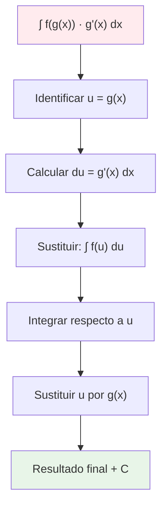
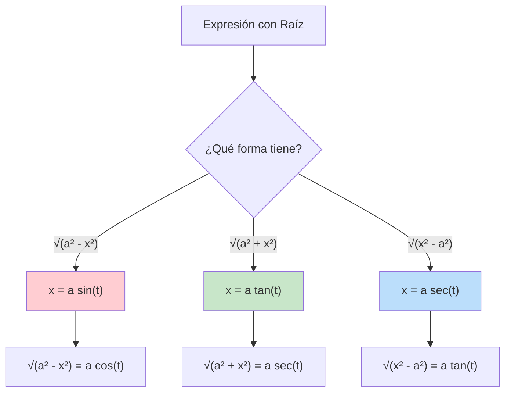
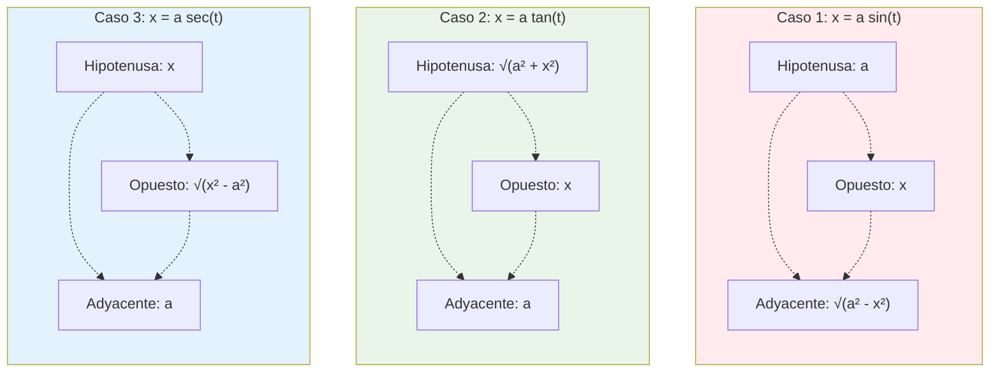

# 🔄 Cambio de Variable en Integrales

> [!tip] 💡 Concepto Clave El cambio de variable (sustitución) es una técnica fundamental que transforma una integral compleja en una más simple mediante la sustitución de una expresión por una nueva variable.

## 📋 Definición y Método

> [!info] 🎯 Método General Para resolver $\int f(g(x)) \cdot g'(x) , dx$, hacemos:
> 
> 1. **Identificar**: $u = g(x)$
> 2. **Derivar**: $du = g'(x) , dx$
> 3. **Sustituir**: $\int f(u) , du$
> 4. **Resolver**: Integrar respecto a $u$
> 5. **Regresar**: Sustituir $u$ por $g(x)$

```mermaid
flowchart TD
    A["∫ f(g(x)) · g'(x) dx"] --> B["Identificar u = g(x)"]
    B --> C["Calcular du = g'(x) dx"]
    C --> D["Sustituir: ∫ f(u) du"]
    D --> E["Integrar respecto a u"]
    E --> F["Sustituir u por g(x)"]
    F --> G["Resultado final + C"]
    
    style A fill:#ffebee
    style G fill:#e8f5e8
```

## 🧮 Casos Comunes

> [!example] 📊 Tipos Frecuentes
> 
> ### 1. Potencias con Derivada Presente
> 
> $\int (ax + b)^n , dx = \frac{(ax + b)^{n+1}}{a(n+1)} + C$
> 
> ### 2. Exponenciales
> 
> $\int e^{ax+b} , dx = \frac{e^{ax+b}}{a} + C$
> 
> ### 3. Logarítmicas
> 
> $\int \frac{f'(x)}{f(x)} , dx = \ln|f(x)| + C$

## 🎯 Ejemplos Resueltos

> [!example] 🔢 Ejemplo 1: Potencia **Resolver**: $\int 2x(x^2 + 1)^3 , dx$
> 
> **Solución**:
> 
> - $u = x^2 + 1$
> - $du = 2x , dx$
> - $\int u^3 , du = \frac{u^4}{4} + C = \frac{(x^2 + 1)^4}{4} + C$

> [!example] 🔢 Ejemplo 2: Exponencial **Resolver**: $\int 3x^2 e^{x^3} , dx$
> 
> **Solución**:
> 
> - $u = x^3$
> - $du = 3x^2 , dx$
> - $\int e^u , du = e^u + C = e^{x^3} + C$

> [!example] 🔢 Ejemplo 3: Logarítmica **Resolver**: $\int \frac{6x}{x^2 + 1} , dx$
> 
> **Solución**:
> 
> - $u = x^2 + 1$
> - $du = 2x , dx$, entonces $6x , dx = 3 , du$
> - $3\int \frac{1}{u} , du = 3\ln|u| + C = 3\ln(x^2 + 1) + C$

## ⚠️ Consideraciones Importantes

> [!warning] 🚨 Errores Comunes
> 
> - No olvidar el factor diferencial $dx$
> - Verificar que la derivada esté presente (o sea múltiplo)
> - No confundir los límites en integrales definidas
> - Recordar sustituir de vuelta la variable original

> [!tip] 💡 Estrategias
> 
> - Buscar funciones compuestas $f(g(x))$
> - Identificar si $g'(x)$ aparece como factor
> - Si no aparece exactamente, verificar si es múltiplo constante
> - Practicar el reconocimiento de patrones

## 🎲 Integrales Definidas

> [!info] 📐 Cambio de Límites Para $\int_a^b f(g(x)) \cdot g'(x) , dx$:
> 
> **Opción 1**: Cambiar límites
> 
> - $u_1 = g(a)$, $u_2 = g(b)$
> - $\int_{u_1}^{u_2} f(u) , du$
> 
> **Opción 2**: Resolver y evaluar normalmente

```mermaid
flowchart LR
    A["Límites originales: a, b"] --> B["u = g(x)"]
    B --> C["Nuevos límites: g(a), g(b)"]
    C --> D["∫ f(u) du entre nuevos límites"]
    
    style A fill:#e3f2fd
    style D fill:#e8f5e8
```

> [!example] 🔢 Ejemplo de Integral Definida **Resolver**: $\int_0^1 2x e^{x^2} , dx$
> 
> **Método 1** (Cambio de límites):
> 
> - $u = x^2$, $du = 2x , dx$
> - Cuando $x = 0$: $u = 0$
> - Cuando $x = 1$: $u = 1$
> - $\int_0^1 e^u , du = [e^u]_0^1 = e - 1$
> 
> **Método 2** (Evaluar al final):
> 
> - $\int 2x e^{x^2} , dx = e^{x^2} + C$
> - $[e^{x^2}]_0^1 = e^1 - e^0 = e - 1$

---

# 🌟 Cambio de Variable Especial - Sustituciones Trigonométricas

> [!tip] 💡 Concepto Clave Las sustituciones trigonométricas son cambios de variable especiales que utilizan identidades trigonométricas para simplificar integrales que contienen expresiones de la forma $\sqrt{a^2 - x^2}$, $\sqrt{a^2 + x^2}$, y $\sqrt{x^2 - a^2}$.

## 📐 Los Tres Casos Principales

> [!info] 🎯 Patrones de Sustitución
> 
> ### Caso 1: $\sqrt{a^2 - x^2}$
> 
> **Sustitución**: $x = a \sin(t)$
> 
> - $dx = a \cos(t) , dt$
> - $\sqrt{a^2 - x^2} = a \cos(t)$
> - **Triángulo**: hipotenusa = $a$, opuesto = $x$, adyacente = $\sqrt{a^2 - x^2}$
> 
> ### Caso 2: $\sqrt{a^2 + x^2}$
> 
> **Sustitución**: $x = a \tan(t)$
> 
> - $dx = a \sec^2(t) , dt$
> - $\sqrt{a^2 + x^2} = a \sec(t)$
> - **Triángulo**: hipotenusa = $\sqrt{a^2 + x^2}$, opuesto = $x$, adyacente = $a$
> 
> ### Caso 3: $\sqrt{x^2 - a^2}$
> 
> **Sustitución**: $x = a \sec(t)$
> 
> - $dx = a \sec(t) \tan(t) , dt$
> - $\sqrt{x^2 - a^2} = a \tan(t)$
> - **Triángulo**: hipotenusa = $x$, opuesto = $\sqrt{x^2 - a^2}$, adyacente = $a$

```mermaid
flowchart TD
    A["Expresión con Raíz"] --> B{"¿Qué forma tiene?"}
    B -->|"√(a² - x²)"| C["x = a sin(t)"]
    B -->|"√(a² + x²)"| D["x = a tan(t)"]  
    B -->|"√(x² - a²)"| E["x = a sec(t)"]
    
    C --> F["√(a² - x²) = a cos(t)"]
    D --> G["√(a² + x²) = a sec(t)"]
    E --> H["√(x² - a²) = a tan(t)"]
    
    style C fill:#ffcdd2
    style D fill:#c8e6c9
    style E fill:#bbdefb
```

## 🧮 Ejemplos Resueltos

> [!example] 🔢 Ejemplo 1: Caso $\sqrt{a^2 - x^2}$ **Resolver**: $\int \frac{dx}{\sqrt{4 - x^2}}$
> 
> **Solución**:
> 
> - $a = 2$, usar $x = 2\sin(t)$, $dx = 2\cos(t) , dt$
> - $\sqrt{4 - x^2} = \sqrt{4 - 4\sin^2(t)} = 2\cos(t)$
> - $\int \frac{2\cos(t) , dt}{2\cos(t)} = \int dt = t + C$
> - $t = \arcsin\left(\frac{x}{2}\right)$
> - **Resultado**: $\arcsin\left(\frac{x}{2}\right) + C$

> [!example] 🔢 Ejemplo 2: Caso $\sqrt{a^2 + x^2}$ **Resolver**: $\int \frac{dx}{x^2 + 9}$
> 
> **Solución**:
> 
> - $a = 3$, usar $x = 3\tan(t)$, $dx = 3\sec^2(t) , dt$
> - $x^2 + 9 = 9\tan^2(t) + 9 = 9\sec^2(t)$
> - $\int \frac{3\sec^2(t) , dt}{9\sec^2(t)} = \frac{1}{3}\int dt = \frac{t}{3} + C$
> - $t = \arctan\left(\frac{x}{3}\right)$
> - **Resultado**: $\frac{1}{3}\arctan\left(\frac{x}{3}\right) + C$

> [!example] 🔢 Ejemplo 3: Caso $\sqrt{x^2 - a^2}$ **Resolver**: $\int \frac{\sqrt{x^2 - 1}}{x} , dx$
> 
> **Solución**:
> 
> - $a = 1$, usar $x = \sec(t)$, $dx = \sec(t)\tan(t) , dt$
> - $\sqrt{x^2 - 1} = \tan(t)$
> - $\int \frac{\tan(t) \cdot \sec(t)\tan(t) , dt}{\sec(t)} = \int \tan^2(t) , dt$
> - $= \int (\sec^2(t) - 1) , dt = \tan(t) - t + C$
> - $= \sqrt{x^2 - 1} - \arccos\left(\frac{1}{x}\right) + C$

## 📊 Triángulos de Referencia

> [!info] 📐 Construcción de Triángulos Para regresar a la variable original, construir triángulos rectángulos según cada caso:

```mermaid
graph TD
    subgraph C1 ["Caso 1: x = a sin(t)"]
        direction TB
        A1["Hipotenusa: a"] 
        B1["Opuesto: x"]
        C1_1["Adyacente: √(a² - x²)"]
        A1 -.-> B1
        A1 -.-> C1_1
        B1 -.-> C1_1
    end
    
    subgraph C2 ["Caso 2: x = a tan(t)"]
        direction TB
        A2["Hipotenusa: √(a² + x²)"]
        B2["Opuesto: x"] 
        C2_1["Adyacente: a"]
        A2 -.-> B2
        A2 -.-> C2_1
        B2 -.-> C2_1
    end
    
    subgraph C3 ["Caso 3: x = a sec(t)"]
        direction TB
        A3["Hipotenusa: x"]
        B3["Opuesto: √(x² - a²)"]
        C3_1["Adyacente: a"]
        A3 -.-> B3
        A3 -.-> C3_1
        B3 -.-> C3_1
    end
    
    style C1 fill:#ffebee
    style C2 fill:#e8f5e8
    style C3 fill:#e3f2fd
```

## 🎯 Cuándo Usar Cada Sustitución

> [!warning] 🔍 Identificación de Patrones
> 
> ### Buscar en el denominador o bajo raíz:
> 
> - **$a^2 - x^2$** → Círculo, usar $\sin$
> - **$a^2 + x^2$** → Hipérbola, usar $\tan$
> - **$x^2 - a^2$** → Hipérbola, usar $\sec$
> 
> ### Completar cuadrados si es necesario:
> 
> $x^2 + bx + c = \left(x + \frac{b}{2}\right)^2 + \left(c - \frac{b^2}{4}\right)$

## 📚 Fórmulas de Referencia Rápida

> [!note] 🚀 Integrales Inmediatas con Sustituciones Trigonométricas
> 
> ### Tipo $\sqrt{a^2 - x^2}$:
> 
> - $\int \frac{dx}{\sqrt{a^2 - x^2}} = \arcsin\left(\frac{x}{a}\right) + C$
> - $\int \sqrt{a^2 - x^2} , dx = \frac{x}{2}\sqrt{a^2 - x^2} + \frac{a^2}{2}\arcsin\left(\frac{x}{a}\right) + C$
> 
> ### Tipo $\sqrt{a^2 + x^2}$:
> 
> - $\int \frac{dx}{a^2 + x^2} = \frac{1}{a}\arctan\left(\frac{x}{a}\right) + C$
> - $\int \frac{dx}{\sqrt{a^2 + x^2}} = \ln\left|x + \sqrt{a^2 + x^2}\right| + C$
> 
> ### Tipo $\sqrt{x^2 - a^2}$:
> 
> - $\int \frac{dx}{\sqrt{x^2 - a^2}} = \ln\left|x + \sqrt{x^2 - a^2}\right| + C$
> - $\int \frac{dx}{x^2 - a^2} = \frac{1}{2a}\ln\left|\frac{x-a}{x+a}\right| + C$

## 🔗 Referencias

> [!quote] 📚 Notas Relacionadas
> 
> - [[Antiderivadas (Primitivas)]] - Conceptos fundamentales
> - [[Teorema fundamental del cálculo]] - Base teórica
> - [[Integrales por Fracciones Parciales]] - Técnica complementaria
> - [[Integración por Partes]] - Siguiente técnica

## 📖 Notas Recomendadas

> [!note] 🎓 Para Profundizar
> 
> - **Cambios de Variable Trigonométricos** - Casos especiales
> - **Integrales Racionales** - Aplicaciones avanzadas
> - **Métodos de Integración** - Resumen general
> - **Ejercicios de Sustitución** - Práctica adicional

---

**Tags**: #calculo #integrales #sustitucion #cambio-variable #tecnicas-integracion #trigonometricas