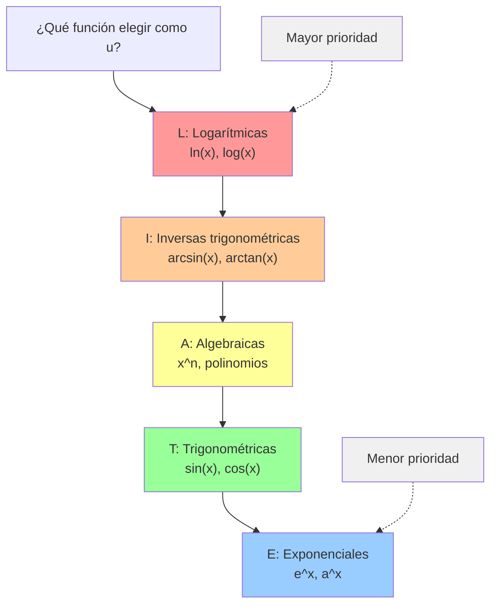
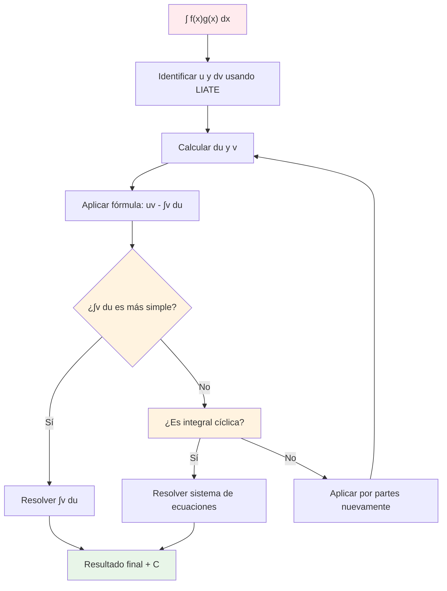
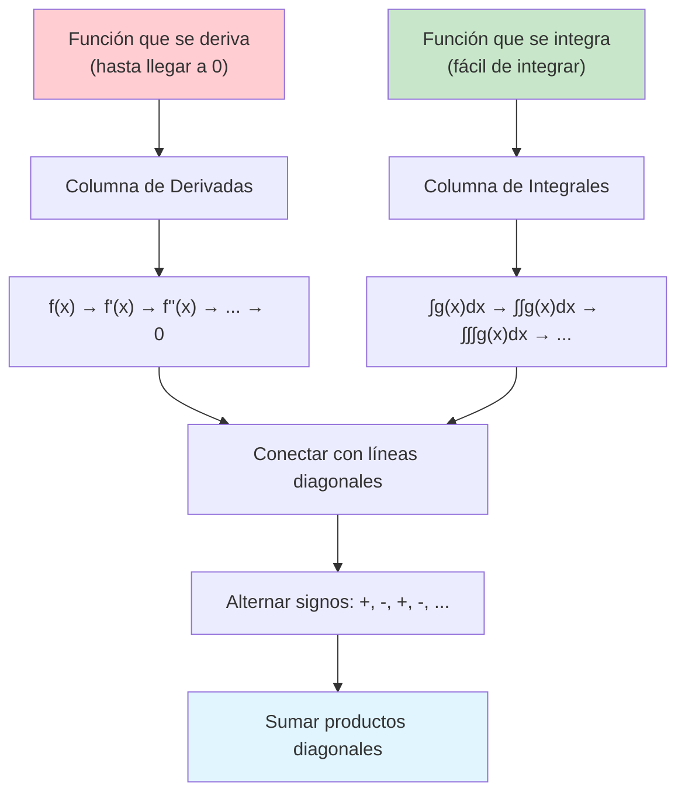
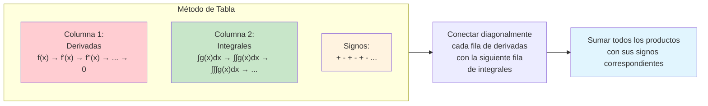

# 🔧 Integración por Partes

> [!tip] 💡 Concepto Clave La integración por partes es una técnica basada en la regla del producto para derivadas, utilizada cuando tenemos el producto de dos funciones que no se pueden integrar fácilmente por otros métodos.

## 📐 Fórmula Principal

> [!info] 🎯 Fórmula de Integración por Partes $$\int u , dv = uv - \int v , du$$
> 
> **Donde**:
> 
> - $u$ = función que se deriva fácilmente
> - $dv$ = función que se integra fácilmente
> - $du$ = derivada de $u$
> - $v$ = antiderivada de $dv$

## 🧠 Método para Recordar: "Un Día Vi Una Vaca Vestida de Uniforme"

> [!tip] 🐄 Mnemotecnia UDVIVU **U**n **D**ía **V**i **U**na **V**aca **V**estida de **U**niforme
> 
> $$\boxed{\int \mathbf{U} , d\mathbf{V} = \mathbf{U}\mathbf{V} - \int \mathbf{V} , d\mathbf{U}}$$
> 
> - **U** = primera función (u)
> - **D** = derivada (du)
> - **V** = antiderivada (v)
> - **I** = igual
> - **V** = primera función por antiderivada (uv)
> - **V** = menos
> - **U** = integral de antiderivada por derivada (∫v du)

## 🎯 Estrategia LIATE

> [!example] 📊 Orden de Prioridad para elegir 'u'
> 
> ### **L** - Logarítmicas
> 
> $\ln(x)$, $\log(x)$
> 
> ### **I** - Inversas trigonométricas
> 
> $\arcsin(x)$, $\arctan(x)$, $\arccos(x)$
> 
> ### **A** - Algebraicas
> 
> $x^n$, polinomios
> 
> ### **T** - Trigonométricas
> 
> $\sin(x)$, $\cos(x)$, $\tan(x)$
> 
> ### **E** - Exponenciales
> 
> $e^x$, $a^x$



## 🧮 Ejemplos Resueltos

> [!example] 🔢 Ejemplo 1: Polinomio × Exponencial **Resolver**: $\int x e^x , dx$
> 
> **Solución**:
> 
> - $u = x$ (algebraica), $dv = e^x , dx$
> - $du = dx$, $v = e^x$
> - $\int x e^x , dx = xe^x - \int e^x , dx = xe^x - e^x + C$
> - $= e^x(x-1) + C$

> [!example] 🔢 Ejemplo 2: Logaritmo **Resolver**: $\int x \ln(x) , dx$
> 
> **Solución**:
> 
> - $u = \ln(x)$ (logarítmica), $dv = x , dx$
> - $du = \frac{1}{x} , dx$, $v = \frac{x^2}{2}$
> - $\int x \ln(x) , dx = \frac{x^2}{2} \ln(x) - \int \frac{x^2}{2} \cdot \frac{1}{x} , dx$
> - $= \frac{x^2}{2} \ln(x) - \int \frac{x}{2} , dx$
> - $= \frac{x^2}{2} \ln(x) - \frac{x^2}{4} + C$

> [!example] 🔢 Ejemplo 3: Función Inversa Trigonométrica **Resolver**: $\int x \arctan(x) , dx$
> 
> **Solución**:
> 
> - $u = \arctan(x)$ (inversa trigonométrica), $dv = x , dx$
> - $du = \frac{1}{1+x^2} , dx$, $v = \frac{x^2}{2}$
> - $\int x \arctan(x) , dx = \frac{x^2}{2} \arctan(x) - \int \frac{x^2}{2(1+x^2)} , dx$
> - $= \frac{x^2}{2} \arctan(x) - \frac{1}{2}\int \frac{x^2}{1+x^2} , dx$
> - $= \frac{x^2}{2} \arctan(x) - \frac{1}{2}\int \left(1 - \frac{1}{1+x^2}\right) dx$
> - $= \frac{x^2}{2} \arctan(x) - \frac{x}{2} + \frac{1}{2}\arctan(x) + C$
> - $= \frac{x^2+1}{2} \arctan(x) - \frac{x}{2} + C$

## 🔄 Casos Especiales

> [!warning] 🚨 Integración por Partes Cíclicas Algunas integrales requieren aplicar la técnica **dos veces** y resolver un sistema:
> 
> **Ejemplo**: $\int e^x \sin(x) , dx$
> 
> **Primera aplicación**:
> 
> - $u = \sin(x)$, $dv = e^x , dx$
> - $du = \cos(x) , dx$, $v = e^x$
> - $\int e^x \sin(x) , dx = e^x \sin(x) - \int e^x \cos(x) , dx$
> 
> **Segunda aplicación** en $\int e^x \cos(x) , dx$:
> 
> - $u = \cos(x)$, $dv = e^x , dx$
> - $du = -\sin(x) , dx$, $v = e^x$
> - $\int e^x \cos(x) , dx = e^x \cos(x) + \int e^x \sin(x) , dx$
> 
> **Sustituyendo**: $$I = e^x \sin(x) - [e^x \cos(x) + I]$$ $$I = e^x \sin(x) - e^x \cos(x) - I$$ $$2I = e^x(\sin(x) - \cos(x))$$ $$I = \frac{e^x(\sin(x) - \cos(x))}{2} + C$$

## 📊 Método Paso a Paso



## 🎲 Integrales Definidas

> [!info] 📐 Fórmula para Integrales Definidas $$\int_a^b u , dv = \left[uv\right]_a^b - \int_a^b v , du$$

> [!example] 🔢 Ejemplo de Integral Definida **Resolver**: $\int_1^e x \ln(x) , dx$
> 
> **Solución**:
> 
> - $u = \ln(x)$, $dv = x , dx$
> - $du = \frac{1}{x} , dx$, $v = \frac{x^2}{2}$
> - $\int_1^e x \ln(x) , dx = \left[\frac{x^2}{2} \ln(x)\right]_1^e - \int_1^e \frac{x^2}{2} \cdot \frac{1}{x} , dx$
> - $= \left[\frac{x^2}{2} \ln(x)\right]_1^e - \int_1^e \frac{x}{2} , dx$
> - $= \left[\frac{x^2}{2} \ln(x)\right]_1^e - \left[\frac{x^2}{4}\right]_1^e$
> - $= \frac{e^2}{2} \ln(e) - \frac{1}{2} \ln(1) - \frac{e^2}{4} + \frac{1}{4}$
> - $= \frac{e^2}{2} - 0 - \frac{e^2}{4} + \frac{1}{4}$
> - $= \frac{e^2}{4} + \frac{1}{4} = \frac{e^2 + 1}{4}$

## ⚠️ Consideraciones Importantes

> [!warning] 🚨 Errores Comunes
> 
> - Elegir mal qué función debe ser $u$
> - No derivar correctamente o no integrar bien
> - Olvidar la constante de integración
> - No reconocer cuándo aplicar por partes múltiples veces
> - En integrales definidas, olvidar evaluar $[uv]_a^b$

> [!tip] 💡 Consejos Prácticos
> 
> - Si LIATE no funciona, intercambia $u$ y $dv$
> - Verifica tu respuesta derivando
> - Algunos casos requieren combinación con otras técnicas
> - Practica el reconocimiento de patrones
> - Para integrales cíclicas, mantén la integral original como variable

## 📋 Tabla de Referencia Rápida

> [!note] 🚀 Integrales Comunes por Partes
> 
> |Integral|u|dv|Resultado|
> |---|---|---|---|
> |$\int x e^x , dx$|$x$|$e^x , dx$|$e^x(x-1) + C$|
> |$\int x \sin(x) , dx$|$x$|$\sin(x) , dx$|$-x\cos(x) + \sin(x) + C$|
> |$\int x \cos(x) , dx$|$x$|$\cos(x) , dx$|$x\sin(x) + \cos(x) + C$|
> |$\int \ln(x) , dx$|$\ln(x)$|$dx$|$x\ln(x) - x + C$|
> |$\int x^n \ln(x) , dx$|$\ln(x)$|$x^n , dx$|$\frac{x^{n+1}}{n+1}\ln(x) - \frac{x^{n+1}}{(n+1)^2} + C$|

## 🔗 Referencias

> [!quote] 📚 Notas Relacionadas
> 
> - [[Cambio de Variable en Integrales]] - Técnica previa
> - [[Antiderivadas (Primitivas)]] - Conceptos base
> - [[Integrales Trigonométricas]] - Técnica siguiente
> - [[Integrales por Fracciones Parciales]] - Técnica complementaria

## 📖 Notas Recomendadas

> [!note] 🎓 Para Profundizar
> 
> - **Integración por Partes Repetida** - Casos especiales
> - **Combinación de Técnicas** - Métodos mixtos
> - **Integrales de Funciones Inversas** - Aplicaciones específicas
> - **Ejercicios de Integración por Partes** - Práctica intensiva

---

**Tags**: #calculo #integrales #por-partes #LIATE #tecnicas-integracion #udvivu

# 📊 Integración por Partes - Método de Tabla

> [!tip] 💡 Concepto Clave El método de tabla para integración por partes es una técnica visual y sistemática que organiza las derivadas e integrales en columnas, conectándolas con líneas diagonales para resolver la integral de manera más rápida y ordenada.

## 🎯 ¿Cuándo Usar el Método de Tabla?

> [!info] 🔍 Casos Ideales Este método es especialmente útil cuando:
> 
> - Una función se puede derivar hasta llegar a cero (polinomios)
> - La otra función se puede integrar fácilmente varias veces
> - Necesitas aplicar integración por partes múltiples veces
> - Quieres visualizar mejor el proceso

## 📋 Estructura de la Tabla

> [!example] 📊 Formato de la Tabla
> 
> |Signo|Derivadas (u)|Integrales (v)|
> |---|---|---|
> |+|$f(x)$|$\int g(x) , dx$|
> |-|$f'(x)$|$\int(\int g(x) , dx) , dx$|
> |+|$f''(x)$|$\int(\int(\int g(x) , dx) , dx) , dx$|
> |-|$f'''(x)$|...|
> |...|...|...|
> |±|$0$|...|



## 🧮 Ejemplos Paso a Paso

> [!example] 🔢 Ejemplo 1: Polinomio × Exponencial **Resolver**: $\int x^2 e^x , dx$
> 
> **Paso 1: Construir la tabla**
> 
> |Signo|Derivadas de $x^2$|Integrales de $e^x$|
> |---|---|---|
> |+|$x^2$|$e^x$|
> |-|$2x$|$e^x$|
> |+|$2$|$e^x$|
> |-|$0$|$e^x$|
> 
> **Paso 2: Conectar diagonalmente y aplicar signos**
> 
> ```
> +: x² × e^x
> -: 2x × e^x  
> +: 2 × e^x
> ```
> 
> **Resultado**: $x^2 e^x - 2x e^x + 2e^x + C = e^x(x^2 - 2x + 2) + C$

> [!example] 🔢 Ejemplo 2: Polinomio × Trigonométrica **Resolver**: $\int x^3 \sin(x) , dx$
> 
> **Paso 1: Construir la tabla**
> 
> |Signo|Derivadas de $x^3$|Integrales de $\sin(x)$|
> |---|---|---|
> |+|$x^3$|$-\cos(x)$|
> |-|$3x^2$|$-\sin(x)$|
> |+|$6x$|$\cos(x)$|
> |-|$6$|$\sin(x)$|
> |+|$0$|$-\cos(x)$|
> 
> **Paso 2: Aplicar la fórmula diagonal**
> 
> ```
> +: x³ × (-cos(x)) = -x³cos(x)
> -: 3x² × (-sin(x)) = +3x²sin(x)
> +: 6x × cos(x) = +6x cos(x)
> -: 6 × sin(x) = -6sin(x)
> ```
> 
> **Resultado**: $-x^3\cos(x) + 3x^2\sin(x) + 6x\cos(x) - 6\sin(x) + C$

> [!example] 🔢 Ejemplo 3: Polinomio × Logaritmo **Resolver**: $\int x^2 \ln(x) , dx$
> 
> **Paso 1: Construir la tabla**
> 
> |Signo|Derivadas de $\ln(x)$|Integrales de $x^2$|
> |---|---|---|
> |+|$\ln(x)$|$\frac{x^3}{3}$|
> |-|$\frac{1}{x}$|$\frac{x^4}{12}$|
> |+|$-\frac{1}{x^2}$|$\frac{x^5}{60}$|
> |-|$\frac{2}{x^3}$|$\frac{x^6}{360}$|
> |...|...|...|
> 
> **Nota**: Para logaritmos, la serie no termina, así que usamos el método tradicional.
> 
> **Mejor approach**:
> 
> - $u = \ln(x)$, $dv = x^2 , dx$
> - $du = \frac{1}{x} , dx$, $v = \frac{x^3}{3}$
> - $\int x^2 \ln(x) , dx = \frac{x^3}{3}\ln(x) - \frac{x^3}{9} + C$

## 📐 Representación Visual de la Tabla

> [!example] 📊 Estructura de Conexiones Diagonales
> 
> ```
> Signo | Derivadas    | Integrales
> ------|-------------|-------------
>   +   |   f(x)      |  ∫g(x)dx    \
>       |             |              \
>   -   |   f'(x)     |  ∫∫g(x)dx     \
>       |             |                \
>   +   |   f''(x)    |  ∫∫∫g(x)dx     \
>       |             |                 \
>   -   |   f'''(x)   |  ∫∫∫∫g(x)dx     \
>       |             |                  \
>  ...  |    ...      |     ...          \
>       |             |                   \
>   ±   |     0       |      ...          \
> ```
> 
> **Las líneas diagonales () conectan cada derivada con la integral de la fila siguiente**
> 
> **Resultado**: $\sum (\text{signo} \times \text{derivada} \times \text{integral siguiente})$



## ⚙️ Algoritmo del Método

> [!info] 🔧 Pasos del Algoritmo
> 
> 1. **Identificar funciones**: Una que se derive hasta 0, otra fácil de integrar
> 2. **Crear columnas**: Derivadas a la izquierda, integrales a la derecha
> 3. **Llenar la tabla**: Derivar hasta 0, integrar el mismo número de veces
> 4. **Asignar signos**: Alternar +, -, +, -, ...
> 5. **Conectar diagonalmente**: Cada derivada con la integral de la fila siguiente
> 6. **Sumar productos**: Multiplicar por el signo correspondiente

## 🎯 Ventajas del Método de Tabla

> [!success] ✅ Beneficios
> 
> - **Visualización clara** del proceso completo
> - **Menos errores** al organizar los pasos
> - **Más rápido** para polinomios de grado alto
> - **Fácil verificación** de cada paso
> - **Organización sistemática** de múltiples integraciones por partes

## ⚠️ Limitaciones y Consideraciones

> [!warning] 🚨 Cuándo NO usar el método de tabla
> 
> - **Funciones que no se anulan**: Como $\ln(x)$, $\arctan(x)$
> - **Integrales cíclicas**: Como $\int e^x \sin(x) , dx$
> - **Funciones difíciles de integrar**: Que se complican al integrar repetidamente
> - **Casos con una sola aplicación**: El método tradicional es más directo

> [!tip] 💡 Consejos para el Éxito
> 
> - Siempre verifica que una función se derive hasta cero
> - Mantén cuidado con los signos alternados
> - Practica con polinomios × exponenciales primero
> - Usa el método tradicional cuando la tabla se vuelve compleja

## 🔄 Comparación: Tabla vs. Método Tradicional

> [!example] 📊 Comparación con $\int x^2 e^x , dx$
> 
> ### Método Tradicional:
> 
> ```
> Primera aplicación: u = x², dv = eˣ dx
> Segunda aplicación: u = 2x, dv = eˣ dx  
> Tercera aplicación: u = 2, dv = eˣ dx
> ```
> 
> **3 aplicaciones separadas**
> 
> ### Método de Tabla:
> 
> ```
> Una sola tabla con todas las derivadas e integrales
> Conexiones diagonales automáticas
> Resultado directo
> ```
> 
> **1 proceso organizado**

## 🎲 Ejercicios Recomendados

> [!note] 🏋️ Para Practicar
> 
> **Nivel Básico:**
> 
> - $\int x e^x , dx$
> - $\int x^2 \cos(x) , dx$
> - $\int x^3 e^{2x} , dx$
> 
> **Nivel Intermedio:**
> 
> - $\int x^4 \sin(x) , dx$
> - $\int x^3 e^{-x} , dx$
> - $\int (x^2 + 1) \cos(2x) , dx$
> 
> **Nivel Avanzado:**
> 
> - $\int x^5 e^x , dx$
> - $\int (x^3 - 2x) \sin(3x) , dx$

---

**Tags**: #calculo #integrales #por-partes #tabla #metodo-visual #tecnicas-integracion #organizacion