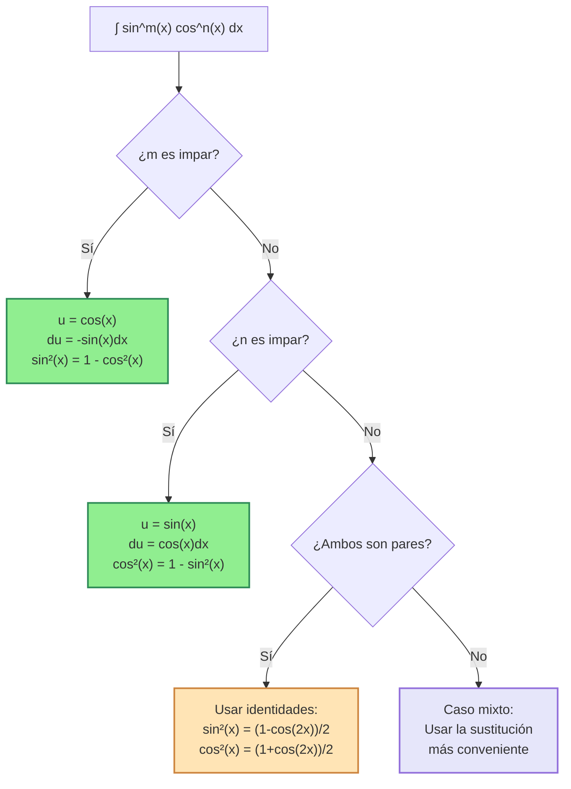
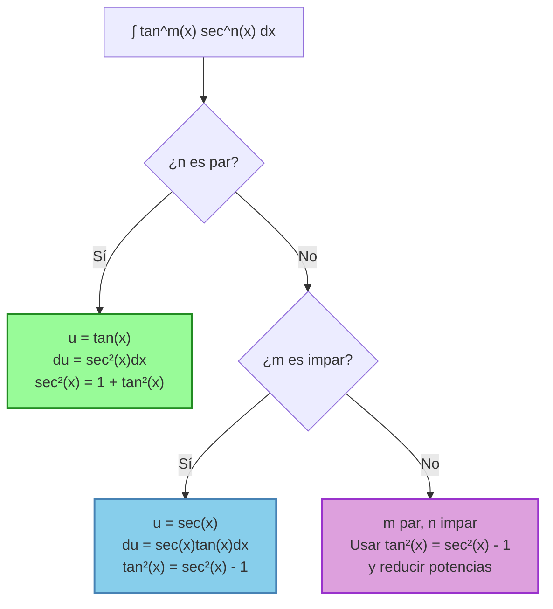
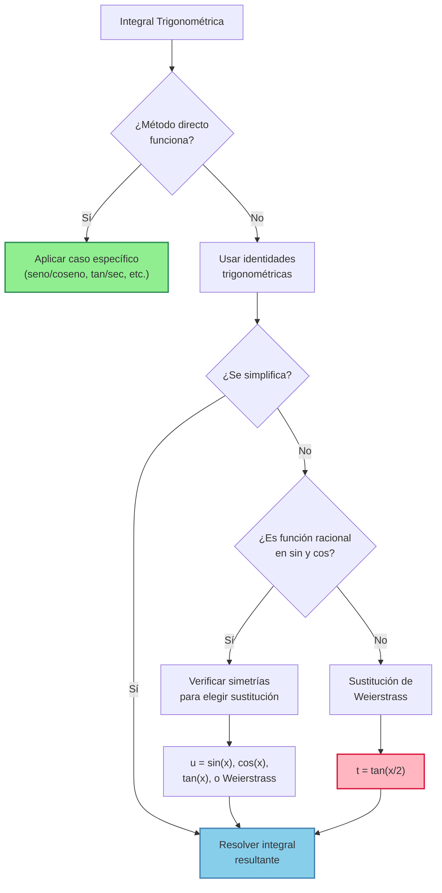

# 📐 Integrales Trigonométricas

> [!tip] 💡 Concepto Clave Las integrales trigonométricas involucran funciones trigonométricas y requieren técnicas específicas como identidades trigonométricas, sustituciones especiales y métodos de reducción. La clave está en reconocer patrones y elegir la estrategia correcta.

## 🎯 Casos Principales

### 1️⃣ Potencias de Seno y Coseno

> [!info] 📊 Casos para $\int \sin^m(x) \cos^n(x) , dx$
> 
> **Caso 1**: Si $m$ es impar → usar $u = \cos(x)$, $du = -\sin(x)dx$ **Caso 2**: Si $n$ es impar → usar $u = \sin(x)$, $du = \cos(x)dx$  
> **Caso 3**: Si ambos son pares → usar identidades de reducción de potencia **Caso 4**: Si ambos son impares → elegir la sustitución más conveniente

> [!example] 🔢 Ejemplo 1: Exponente Impar **Resolver**: $\int \sin^3(x) \cos^2(x) , dx$
> 
> **Solución**:
> 
> - $m = 3$ (impar) → usar $u = \cos(x)$, $du = -\sin(x)dx$
> - $\sin^3(x) = \sin^2(x) \cdot \sin(x) = (1-\cos^2(x))\sin(x)$
> - $\int \sin^3(x) \cos^2(x) , dx = \int (1-\cos^2(x))\cos^2(x)\sin(x) , dx$
> - $= \int (1-u^2)u^2(-du) = -\int (u^2 - u^4) , du$
> - $= -\left(\frac{u^3}{3} - \frac{u^5}{5}\right) + C = -\frac{\cos^3(x)}{3} + \frac{\cos^5(x)}{5} + C$

> [!example] 🔢 Ejemplo 2: Ambos Exponentes Pares **Resolver**: $\int \sin^2(x) \cos^2(x) , dx$
> 
> **Solución**:
> 
> - Usar identidades: $\sin^2(x) = \frac{1-\cos(2x)}{2}$, $\cos^2(x) = \frac{1+\cos(2x)}{2}$
> - $\sin^2(x)\cos^2(x) = \frac{1-\cos(2x)}{2} \cdot \frac{1+\cos(2x)}{2} = \frac{1-\cos^2(2x)}{4}$
> - $= \frac{1}{4} - \frac{\cos^2(2x)}{4} = \frac{1}{4} - \frac{1+\cos(4x)}{8} = \frac{1}{8} - \frac{\cos(4x)}{8}$
> - $\int \sin^2(x) \cos^2(x) , dx = \frac{x}{8} - \frac{\sin(4x)}{32} + C$

### 2️⃣ Potencias de Tangente y Secante

> [!info] 📊 Casos para $\int \tan^m(x) \sec^n(x) , dx$
> 
> **Caso 1**: Si $n$ es par → usar $u = \tan(x)$, $du = \sec^2(x)dx$ **Caso 2**: Si $m$ es impar y $n$ es impar → usar $u = \sec(x)$, $du = \sec(x)\tan(x)dx$ **Caso 3**: Si $m$ es par y $n$ es impar → usar $\tan^2(x) = \sec^2(x) - 1$ repetidamente **Caso 4**: Si $m$ es impar y $n$ es par → combinar métodos o usar reducción

> [!example] 🔢 Ejemplo 3: Secante Par **Resolver**: $\int \tan^3(x) \sec^4(x) , dx$
> 
> **Solución**:
> 
> - $n = 4$ (par) → usar $u = \tan(x)$, $du = \sec^2(x) dx$
> - $\sec^4(x) = \sec^2(x) \cdot \sec^2(x) = (1+\tan^2(x))\sec^2(x)$
> - $\int \tan^3(x)(1+\tan^2(x))\sec^2(x) , dx = \int u^3(1+u^2) , du$
> - $= \int (u^3 + u^5) , du = \frac{u^4}{4} + \frac{u^6}{6} + C$
> - $= \frac{\tan^4(x)}{4} + \frac{\tan^6(x)}{6} + C$

> [!example] 🔢 Ejemplo 4: Tangente Impar, Secante Impar **Resolver**: $\int \tan^3(x) \sec(x) , dx$
> 
> **Solución**:
> 
> - $m = 3$ (impar), $n = 1$ (impar) → usar $u = \sec(x)$, $du = \sec(x)\tan(x)dx$
> - $\tan^3(x) = \tan^2(x) \cdot \tan(x) = (\sec^2(x)-1)\tan(x)$
> - $\int (\sec^2(x)-1)\sec(x)\tan(x) , dx = \int (u^2-1) , du$
> - $= \frac{u^3}{3} - u + C = \frac{\sec^3(x)}{3} - \sec(x) + C$

### 3️⃣ Potencias de Cotangente y Cosecante

> [!info] 📊 Casos para $\int \cot^m(x) \csc^n(x) , dx$
> 
> Similar a tangente y secante, pero usando:
> 
> - $\cot^2(x) = \csc^2(x) - 1$
> - $d(\cot(x)) = -\csc^2(x)dx$
> - $d(\csc(x)) = -\csc(x)\cot(x)dx$

## 🔄 Identidades Trigonométricas Esenciales

> [!info] 🧮 Identidades de Reducción de Potencia
> 
> ### Identidades Básicas de Potencia
> 
> - $\sin^2(x) = \frac{1 - \cos(2x)}{2}$
> - $\cos^2(x) = \frac{1 + \cos(2x)}{2}$
> - $\tan^2(x) = \sec^2(x) - 1$
> - $\cot^2(x) = \csc^2(x) - 1$
> - $\sec^2(x) = 1 + \tan^2(x)$
> - $\csc^2(x) = 1 + \cot^2(x)$
> 
> ### Identidades de Potencias Superiores
> 
> - $\sin^3(x) = \frac{3\sin(x) - \sin(3x)}{4}$
> - $\cos^3(x) = \frac{3\cos(x) + \cos(3x)}{4}$
> - $\sin^4(x) = \frac{3 - 4\cos(2x) + \cos(4x)}{8}$
> - $\cos^4(x) = \frac{3 + 4\cos(2x) + \cos(4x)}{8}$
> 
> ### Identidades de Producto a Suma
> 
> - $\sin(A)\cos(B) = \frac{1}{2}[\sin(A+B) + \sin(A-B)]$
> - $\sin(A)\sin(B) = \frac{1}{2}[\cos(A-B) - \cos(A+B)]$
> - $\cos(A)\cos(B) = \frac{1}{2}[\cos(A+B) + \cos(A-B)]$
> 
> ### Identidades de Suma a Producto
> 
> - $\sin(A) + \sin(B) = 2\sin\left(\frac{A+B}{2}\right)\cos\left(\frac{A-B}{2}\right)$
> - $\cos(A) + \cos(B) = 2\cos\left(\frac{A+B}{2}\right)\cos\left(\frac{A-B}{2}\right)$

## 🎲 Productos de Funciones Trigonométricas

> [!example] 🔢 Ejemplo 5: Producto Seno-Coseno **Resolver**: $\int \sin(3x) \cos(5x) , dx$
> 
> **Solución**:
> 
> - Usar identidad: $\sin(A)\cos(B) = \frac{1}{2}[\sin(A+B) + \sin(A-B)]$
> - $\sin(3x)\cos(5x) = \frac{1}{2}[\sin(8x) + \sin(-2x)] = \frac{1}{2}[\sin(8x) - \sin(2x)]$
> - $\int \frac{1}{2}[\sin(8x) - \sin(2x)] , dx = \frac{1}{2}\left[-\frac{\cos(8x)}{8} + \frac{\cos(2x)}{2}\right] + C$
> - $= -\frac{\cos(8x)}{16} + \frac{\cos(2x)}{4} + C$

> [!example] 🔢 Ejemplo 6: Producto Seno-Seno **Resolver**: $\int \sin(2x) \sin(4x) , dx$
> 
> **Solución**:
> 
> - Usar identidad: $\sin(A)\sin(B) = \frac{1}{2}[\cos(A-B) - \cos(A+B)]$
> - $\sin(2x)\sin(4x) = \frac{1}{2}[\cos(-2x) - \cos(6x)] = \frac{1}{2}[\cos(2x) - \cos(6x)]$
> - $\int \frac{1}{2}[\cos(2x) - \cos(6x)] , dx = \frac{1}{2}\left[\frac{\sin(2x)}{2} - \frac{\sin(6x)}{6}\right] + C$
> - $= \frac{\sin(2x)}{4} - \frac{\sin(6x)}{12} + C$

## 🔄 Sustituciones Especiales

> [!warning] 🚨 Sustitución de Weierstrass Para casos difíciles donde otros métodos fallan:
> 
> ### Fórmula de Sustitución
> 
> $t = \tan\left(\frac{x}{2}\right)$
> 
> **Transformaciones**:
> 
> - $\sin(x) = \frac{2t}{1+t^2}$
> - $\cos(x) = \frac{1-t^2}{1+t^2}$
> - $\tan(x) = \frac{2t}{1-t^2}$
> - $dx = \frac{2}{1+t^2} dt$
> 
> **Cuándo usar**: Integrales racionales en funciones trigonométricas que no se resuelven por otros métodos.

> [!example] 🔢 Ejemplo 7: Sustitución de Weierstrass **Resolver**: $\int \frac{1}{2 + \cos(x)} , dx$
> 
> **Solución**:
> 
> - Sea $t = \tan\left(\frac{x}{2}\right)$, entonces $\cos(x) = \frac{1-t^2}{1+t^2}$ y $dx = \frac{2}{1+t^2} dt$
> - $\int \frac{1}{2 + \frac{1-t^2}{1+t^2}} \cdot \frac{2}{1+t^2} , dt = \int \frac{2}{2(1+t^2) + 1-t^2} , dt$
> - $= \int \frac{2}{2 + 2t^2 + 1 - t^2} , dt = \int \frac{2}{3 + t^2} , dt$
> - $= \frac{2}{\sqrt{3}} \arctan\left(\frac{t}{\sqrt{3}}\right) + C = \frac{2}{\sqrt{3}} \arctan\left(\frac{\tan(x/2)}{\sqrt{3}}\right) + C$

### Otras Sustituciones Útiles

> [!info] 📝 Sustituciones Adicionales
> 
> **Para $\int R(\sin(x), \cos(x)) dx$ donde $R$ es racional**:
> 
> 1. **Si $R(-\sin(x), \cos(x)) = -R(\sin(x), \cos(x))$** → usar $u = \cos(x)$
> 2. **Si $R(\sin(x), -\cos(x)) = -R(\sin(x), \cos(x))$** → usar $u = \sin(x)$
> 3. **Si $R(-\sin(x), -\cos(x)) = R(\sin(x), \cos(x))$** → usar $u = \tan(x)$
> 4. **En otros casos** → usar sustitución de Weierstrass

## 📊 Tabla Completa de Integrales Trigonométricas

> [!info] 📋 Integrales Fundamentales
> 
> |Función|Integral|
> |---|---|
> |$\sin(x)$|$-\cos(x) + C$|
> |$\cos(x)$|$\sin(x) + C$|
> |$\tan(x)$|$-\ln\|\cos(x)\| + C$ o $\ln\|\sec(x)\| + C$|
> |$\cot(x)$|$\ln\|\sin(x)\| + C$|
> |$\sec(x)$|$\ln\|\sec(x) + \tan(x)\| + C$|
> |$\csc(x)$|$-\ln\|\csc(x) + \cot(x)\| + C$|
> |$\sec^2(x)$|$\tan(x) + C$|
> |$\csc^2(x)$|$-\cot(x) + C$|
> |$\sec(x)\tan(x)$|$\sec(x) + C$|
> |$\csc(x)\cot(x)$|$-\csc(x) + C$|

> [!info] 📋 Integrales de Potencias Comunes
> 
> |Función|Integral|
> |---|---|
> |$\sin^2(x)$|$\frac{x}{2} - \frac{\sin(2x)}{4} + C$|
> |$\cos^2(x)$|$\frac{x}{2} + \frac{\sin(2x)}{4} + C$|
> |$\tan^2(x)$|$\tan(x) - x + C$|
> |$\sin^3(x)$|$-\cos(x) + \frac{\cos^3(x)}{3} + C$|
> |$\cos^3(x)$|$\sin(x) - \frac{\sin^3(x)}{3} + C$|

## 🔢 Fórmulas de Reducción

> [!info] 🔄 Fórmulas Recursivas
> 
> ### Para Potencias de Seno
> 
> $I_n = \int \sin^n(x) , dx = -\frac{1}{n}\sin^{n-1}(x)\cos(x) + \frac{n-1}{n}I_{n-2}$
> 
> ### Para Potencias de Coseno
> 
> $I_n = \int \cos^n(x) , dx = \frac{1}{n}\cos^{n-1}(x)\sin(x) + \frac{n-1}{n}I_{n-2}$
> 
> ### Para Potencias de Tangente
> 
> $I_n = \int \tan^n(x) , dx = \frac{\tan^{n-1}(x)}{n-1} - I_{n-2}$ (para $n \geq 2$)
> 
> ### Para Potencias de Secante
> 
> $I_n = \int \sec^n(x) , dx = \frac{\sec^{n-2}(x)\tan(x)}{n-1} + \frac{n-2}{n-1}I_{n-2}$ (para $n \geq 2$)

## ⚠️ Consideraciones Importantes y Errores Comunes

> [!warning] 🚨 Errores Frecuentes
> 
> ### Errores de Identificación
> 
> - **No reconocer el patrón correcto** para elegir la sustitución adecuada
> - **Confundir cuándo usar cada método** (exponente par vs impar)
> - **Aplicar mal las identidades trigonométricas**
> 
> ### Errores de Cálculo
> 
> - **Olvidar el signo negativo** en $du = -\sin(x)dx$ cuando $u = \cos(x)$
> - **No simplificar correctamente** las expresiones con identidades
> - **Errores en las identidades de producto a suma**
> - **No verificar el dominio** de las funciones involucradas
> 
> ### Errores de Verificación
> 
> - **No comprobar la respuesta** derivando el resultado
> - **Olvidar la constante de integración**
> - **No simplificar la respuesta final**

> [!tip] 💡 Estrategias de Éxito
> 
> ### Antes de Empezar
> 
> - **Identifica el tipo de integral** y elige el método apropiado
> - **Revisa si hay simplificaciones obvias** usando identidades básicas
> - **Considera si una sustitución u-substitution simple** podría funcionar
> 
> ### Durante el Proceso
> 
> - **Mantén un registro claro** de las sustituciones realizadas
> - **Simplifica en cada paso** para evitar expresiones complicadas
> - **Usa identidades trigonométricas** para reducir la complejidad
> 
> ### Verificación Final
> 
> - **Deriva tu respuesta** para verificar que obtienes el integrando original
> - **Revisa que el dominio** de tu respuesta sea consistente
> - **Simplifica la expresión final** tanto como sea posible

## 📝 Ejemplos Adicionales de Práctica

> [!example] 🔢 Ejemplo 8: Caso Mixto Complejo **Resolver**: $\int \sin^4(x) \cos^3(x) , dx$
> 
> **Análisis**: $m = 4$ (par), $n = 3$ (impar) → usar $u = \sin(x)$
> 
> **Solución**:
> 
> - $u = \sin(x)$, $du = \cos(x)dx$
> - $\cos^3(x) = \cos^2(x) \cdot \cos(x) = (1-\sin^2(x))\cos(x)$
> - $\int \sin^4(x)(1-\sin^2(x))\cos(x) , dx = \int u^4(1-u^2) , du$
> - $= \int (u^4 - u^6) , du = \frac{u^5}{5} - \frac{u^7}{7} + C$
> - $= \frac{\sin^5(x)}{5} - \frac{\sin^7(x)}{7} + C$

> [!example] 🔢 Ejemplo 9: Reducción de Potencia **Resolver**: $\int \cos^4(x) , dx$
> 
> **Solución usando identidades**:
> 
> - $\cos^4(x) = (\cos^2(x))^2 = \left(\frac{1+\cos(2x)}{2}\right)^2$
> - $= \frac{1 + 2\cos(2x) + \cos^2(2x)}{4} = \frac{1 + 2\cos(2x) + \frac{1+\cos(4x)}{2}}{4}$
> - $= \frac{3 + 4\cos(2x) + \cos(4x)}{8}$
> - $\int \cos^4(x) , dx = \frac{3x}{8} + \frac{\sin(2x)}{2} + \frac{\sin(4x)}{32} + C$

## 🔗 Conexiones y Extensiones

> [!info] 🌐 Temas Relacionados
> 
> ### Prerequisitos
> 
> - [[Identidades Trigonométricas]] - Fundamento esencial
> - **Carpeta Técnicas de Integración** - u-substitución, integración por partes
> - **Funciones Trigonométricas** - Definiciones y propiedades
> 
> ### Extensiones Naturales
> 
> - **Integrales de Funciones Hiperbólicas** - Análogos hiperbólicos
> - **Integrales Trigonométricas Definidas** - Aplicación con límites
> - **Series de Fourier** - Aplicaciones en análisis armónico
> - **Transformadas Trigonométricas** - Aplicaciones en ingeniería

## 🎯 Ejercicios Recomendados

> [!note] 📚 Para Practicar
> 
> ### Nivel Básico
> 
> 1. $\int \sin^2(x) , dx$
> 2. $\int \tan^2(x) , dx$
> 3. $\int \sec^2(x) \tan(x) , dx$
> 
> ### Nivel Intermedio
> 
> 4. $\int \sin^3(x) \cos^4(x) , dx$
> 5. $\int \tan^4(x) \sec^2(x) , dx$
> 6. $\int \sin(2x) \cos(3x) , dx$
> 
> ### Nivel Avanzado
> 
> 7. $\int \frac{1}{1 + \sin(x)} , dx$
> 8. $\int \tan^5(x) , dx$
> 9. $\int \sqrt{1 + \cos(x)} , dx$

---

**Tags**: #calculo #integrales #trigonometricas #identidades #sustitucion-weierstrass #tecnicas-integracion #formulas-reduccion #productos-trigonometricos