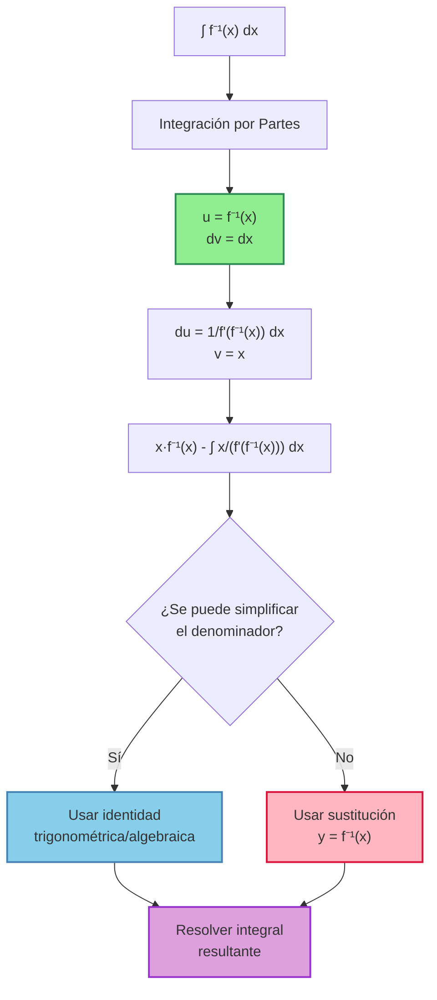
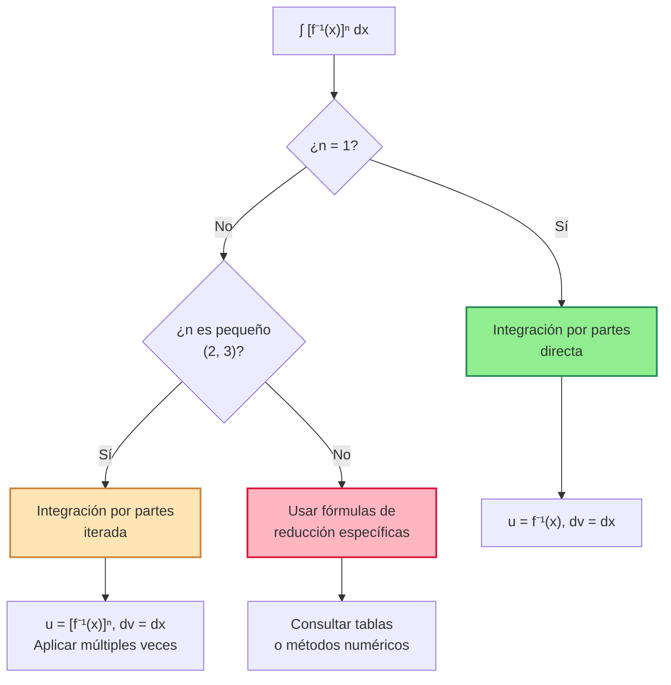
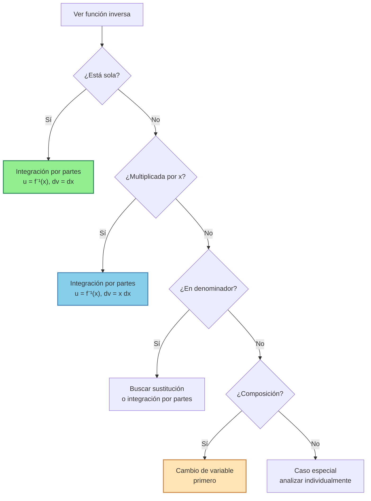

# 🔄 Integrales de Funciones Inversas

> [!tip] 💡 Concepto Clave Las integrales de funciones inversas requieren principalmente **integración por partes**, aprovechando la relación especial entre una función y su inversa. La clave está en reconocer patrones y usar las identidades adecuadas.

## 🎯 Estrategia General

### 🔑 Método Principal: Integración por Partes

> [!info] 📊 Patrón Estándar Para ∫ f⁻¹(x) dx, usar:
> 
> - **u = f⁻¹(x)** (función inversa)
> - **dv = dx** → **v = x**
> - **du = ?** (usar derivada de función inversa)
> - **Resultado**: x·f⁻¹(x) - ∫ x·(df⁻¹/dx) dx

## 📐 Funciones Trigonométricas Inversas

### 1️⃣ Arcoseno y Arcocoseno

> [!info] 🧮 Fórmulas Básicas **Derivadas clave**:
> 
> - $\frac{d}{dx}[\arcsin(x)] = \frac{1}{\sqrt{1-x^2}}$
> - $\frac{d}{dx}[\arccos(x)] = -\frac{1}{\sqrt{1-x^2}}$
> 
> **Identidad útil**: $\arcsin(x) + \arccos(x) = \frac{\pi}{2}$

> [!example] 🔢 Ejemplo 1: Integral de Arcoseno **Resolver**: $\int \arcsin(x) , dx$
> 
> **Solución**:
> 
> - **Integración por partes**: $u = \arcsin(x)$, $dv = dx$
> - $du = \frac{1}{\sqrt{1-x^2}} dx$, $v = x$
> - $\int \arcsin(x) , dx = x\arcsin(x) - \int \frac{x}{\sqrt{1-x^2}} , dx$
> - Para la segunda integral: $w = 1-x^2 \Rightarrow dw = -2x , dx$
> - $\int \frac{x}{\sqrt{1-x^2}} , dx = -\frac{1}{2} \int w^{-1/2} dw = -\sqrt{w} = -\sqrt{1-x^2}$
> - **Resultado**: $\int \arcsin(x) , dx = x\arcsin(x) + \sqrt{1-x^2} + C$

> [!example] 🔢 Ejemplo 2: Integral de Arcocoseno **Resolver**: $\int \arccos(x) , dx$
> 
> **Solución**:
> 
> - **Integración por partes**: $u = \arccos(x)$, $dv = dx$
> - $du = -\frac{1}{\sqrt{1-x^2}} dx$, $v = x$
> - $\int \arccos(x) , dx = x\arccos(x) + \int \frac{x}{\sqrt{1-x^2}} , dx$
> - La segunda integral es igual a $-\sqrt{1-x^2}$ (como en el ejemplo anterior)
> - **Resultado**: $\int \arccos(x) , dx = x\arccos(x) - \sqrt{1-x^2} + C$

### 2️⃣ Arcotangente y Arcocotangente

> [!info] 🧮 Fórmulas Básicas **Derivadas clave**:
> 
> - $\frac{d}{dx}[\arctan(x)] = \frac{1}{1+x^2}$
> - $\frac{d}{dx}[\text{arccot}(x)] = -\frac{1}{1+x^2}$
> 
> **Identidad útil**: $\arctan(x) + \text{arccot}(x) = \frac{\pi}{2}$

> [!example] 🔢 Ejemplo 3: Integral de Arcotangente **Resolver**: $\int \arctan(x) , dx$
> 
> **Solución**:
> 
> - **Integración por partes**: $u = \arctan(x)$, $dv = dx$
> - $du = \frac{1}{1+x^2} dx$, $v = x$
> - $\int \arctan(x) , dx = x\arctan(x) - \int \frac{x}{1+x^2} , dx$
> - Para la segunda integral: $w = 1+x^2 \Rightarrow dw = 2x , dx$
> - $\int \frac{x}{1+x^2} , dx = \frac{1}{2} \int \frac{1}{w} dw = \frac{1}{2}\ln|w| = \frac{1}{2}\ln(1+x^2)$
> - **Resultado**: $\int \arctan(x) , dx = x\arctan(x) - \frac{1}{2}\ln(1+x^2) + C$

### 3️⃣ Arcosecante y Arcocosecante

> [!info] 🧮 Fórmulas Básicas **Derivadas clave**:
> 
> - $\frac{d}{dx}[\text{arcsec}(x)] = \frac{1}{|x|\sqrt{x^2-1}}$ para $|x| > 1$
> - $\frac{d}{dx}[\text{arccsc}(x)] = -\frac{1}{|x|\sqrt{x^2-1}}$ para $|x| > 1$

> [!example] 🔢 Ejemplo 4: Integral de Arcosecante **Resolver**: $\int \text{arcsec}(x) , dx$ para $x > 1$
> 
> **Solución**:
> 
> - **Integración por partes**: $u = \text{arcsec}(x)$, $dv = dx$
> - $du = \frac{1}{x\sqrt{x^2-1}} dx$, $v = x$
> - $\int \text{arcsec}(x) , dx = x\text{arcsec}(x) - \int \frac{1}{\sqrt{x^2-1}} , dx$
> - La segunda integral es estándar: $\int \frac{1}{\sqrt{x^2-1}} , dx = \ln|x + \sqrt{x^2-1}|$
> - **Resultado**: $\int \text{arcsec}(x) , dx = x\text{arcsec}(x) - \ln|x + \sqrt{x^2-1}| + C$

## 🔢 Productos con Funciones Inversas

### Casos con x·f⁻¹(x)

> [!example] 🔢 Ejemplo 5: Producto con Variable **Resolver**: $\int x \arcsin(x) , dx$
> 
> **Solución**:
> 
> - **Integración por partes**: $u = \arcsin(x)$, $dv = x , dx$
> - $du = \frac{1}{\sqrt{1-x^2}} dx$, $v = \frac{x^2}{2}$
> - $\int x \arcsin(x) , dx = \frac{x^2}{2}\arcsin(x) - \int \frac{x^2}{2\sqrt{1-x^2}} , dx$
> - Para la segunda integral, usar $x^2 = 1-(1-x^2)$:
> - $\int \frac{x^2}{\sqrt{1-x^2}} , dx = \int \frac{1-(1-x^2)}{\sqrt{1-x^2}} , dx = \int \frac{1}{\sqrt{1-x^2}} , dx - \int \sqrt{1-x^2} , dx$
> - $= \arcsin(x) - \frac{1}{2}(x\sqrt{1-x^2} + \arcsin(x))$
> - $= \frac{1}{2}\arcsin(x) - \frac{x\sqrt{1-x^2}}{2}$
> - **Resultado**: $\int x \arcsin(x) , dx = \frac{x^2}{2}\arcsin(x) - \frac{1}{4}\arcsin(x) + \frac{x\sqrt{1-x^2}}{4} + C$

### Casos con Potencias

> [!example] 🔢 Ejemplo 6: Potencia de Arcotangente **Resolver**: $\int \arctan^2(x) , dx$
> 
> **Solución**:
> 
> - **Integración por partes**: $u = \arctan^2(x)$, $dv = dx$
> - $du = \frac{2\arctan(x)}{1+x^2} dx$, $v = x$
> - $\int \arctan^2(x) , dx = x\arctan^2(x) - 2\int \frac{x\arctan(x)}{1+x^2} , dx$
> - Para la segunda integral, usar integración por partes nuevamente:
> - $u_1 = \arctan(x)$, $dv_1 = \frac{x}{1+x^2} dx$
> - Después de resolver: $\int \frac{x\arctan(x)}{1+x^2} , dx = \frac{1}{2}\arctan(x)\ln(1+x^2) - \frac{x}{2} + \frac{1}{2}\arctan(x)$
> - **Resultado complejo**: Requiere múltiples aplicaciones de integración por partes

## 🔄 Identidades y Relaciones Útiles

> [!info] 🧮 Identidades Fundamentales
> 
> ### Relaciones Complementarias
> 
> - $\arcsin(x) + \arccos(x) = \frac{\pi}{2}$
> - $\arctan(x) + \text{arccot}(x) = \frac{\pi}{2}$
> - $\text{arcsec}(x) + \text{arccsc}(x) = \frac{\pi}{2}$ para $x > 0$
> 
> ### Identidades Trigonométricas para Inversas
> 
> - $\sin(\arcsin(x)) = x$
> - $\cos(\arcsin(x)) = \sqrt{1-x^2}$
> - $\tan(\arcsin(x)) = \frac{x}{\sqrt{1-x^2}}$
> - $\sin(\arccos(x)) = \sqrt{1-x^2}$
> - $\cos(\arctan(x)) = \frac{1}{\sqrt{1+x^2}}$
> - $\sin(\arctan(x)) = \frac{x}{\sqrt{1+x^2}}$
> 
> ### Relaciones de Conversión
> 
> - $\arcsin(x) = \arctan\left(\frac{x}{\sqrt{1-x^2}}\right)$
> - $\arccos(x) = \arctan\left(\frac{\sqrt{1-x^2}}{x}\right)$ para $x > 0$
> - $\text{arcsec}(x) = \arccos\left(\frac{1}{x}\right)$ para $|x| \geq 1$

## 📊 Tabla de Integrales de Funciones Inversas

> [!info] 📋 Resultados Fundamentales
> 
> |Función|Integral|
> |---|---|
> |$\arcsin(x)$|$x\arcsin(x) + \sqrt{1-x^2} + C$|
> |$\arccos(x)$|$x\arccos(x) - \sqrt{1-x^2} + C$|
> |$\arctan(x)$|$x\arctan(x) - \frac{1}{2}\ln(1+x^2) + C$|
> |$\text{arccot}(x)$|$x\text{arccot}(x) + \frac{1}{2}\ln(1+x^2) + C$|
> |$\text{arcsec}(x)$|$x\text{arcsec}(x) - \ln\|x + \sqrt{x^2-1}\| + C$|
> |$\text{arccsc}(x)$|$x\text{arccsc}(x) + \ln\|x + \sqrt{x^2-1}\| + C$|

> [!info] 📋 Integrales con Productos Simples
> 
> |Función|Integral|
> |---|---|
> |$x\arcsin(x)$|$\frac{x^2}{2}\arcsin(x) + \frac{\sqrt{1-x^2}(x^2-2)}{4} + C$|
> |$x\arctan(x)$|$\frac{x^2+1}{2}\arctan(x) - \frac{x}{2} + C$|
> |$\frac{\arcsin(x)}{x}$|No tiene forma cerrada elemental|
> |$\frac{\arctan(x)}{x}$|Serie infinita o integral especial|

## ⚠️ Consideraciones Especiales

> [!warning] 🚨 Dominios y Restricciones
> 
> ### Dominios de Funciones Inversas
> 
> - **arcsin(x), arccos(x)**: $x \in [-1, 1]$
> - **arctan(x), arccot(x)**: $x \in \mathbb{R}$
> - **arcsec(x), arccsc(x)**: $|x| \geq 1$
> 
> ### Rangos Principales
> 
> - **arcsin(x)**: $\left[-\frac{\pi}{2}, \frac{\pi}{2}\right]$
> - **arccos(x)**: $[0, \pi]$
> - **arctan(x)**: $\left(-\frac{\pi}{2}, \frac{\pi}{2}\right)$
> 
> ### Cuidados en la Integración
> 
> - **Verificar el dominio** antes de aplicar fórmulas
> - **Considerar el signo** en las derivadas con valor absoluto
> - **Simplificar usando identidades** antes de integrar cuando sea posible

> [!tip] 💡 Estrategias de Éxito
> 
> ### Preparación
> 
> - **Memorizar las derivadas** de todas las inversas
> - **Conocer las identidades básicas** para simplificación
> - **Identificar el patrón** antes de aplicar integración por partes
> 
> ### Durante la Resolución
> 
> - **Siempre usar u = función inversa** en integración por partes
> - **Buscar simplificaciones** usando identidades trigonométricas
> - **Verificar el dominio** de validez de la solución
> 
> ### Verificación
> 
> - **Derivar el resultado** para comprobar
> - **Verificar continuidad** en los puntos críticos del dominio
> - **Comprobar casos límite** cuando sea relevante

## 🔢 Casos Avanzados y Extensiones

### Composiciones con Otras Funciones

> [!example] 🔢 Ejemplo 7: Composición Compleja **Resolver**: $\int \arcsin\left(\frac{x}{a}\right) , dx$ donde $a > 0$
> 
> **Solución**:
> 
> - **Sustitución**: $u = \frac{x}{a} \Rightarrow x = au, dx = a , du$
> - $\int \arcsin\left(\frac{x}{a}\right) , dx = a\int \arcsin(u) , du$
> - Usar el resultado conocido: $\int \arcsin(u) , du = u\arcsin(u) + \sqrt{1-u^2} + C$
> - **Resultado**: $a\left[\frac{x}{a}\arcsin\left(\frac{x}{a}\right) + \sqrt{1-\frac{x^2}{a^2}}\right] + C$
> - $= x\arcsin\left(\frac{x}{a}\right) + \sqrt{a^2-x^2} + C$

### Integrales Definidas Especiales

> [!info] 🎯 Resultados Notables
> 
> **Integrales definidas útiles**:
> 
> - $\int_0^1 \arcsin(x) , dx = 1$
> - $\int_0^1 \arctan(x) , dx = \frac{\pi}{4} - \frac{\ln(2)}{2}$
> - $\int_{-1}^1 x\arcsin(x) , dx = 0$ (función impar)

## 🔗 Conexiones con Otros Temas

> [!quote] 📚 Notas Relacionadas
> 
> ### Prerequisitos
> 
> - [[Integración por Partes]] - Técnica fundamental para estas integrales
> - [[Identidades Trigonométricas]] - Necesarias para simplificaciones
> - [[Funciones Trigonométricas]] - Base para entender las inversas
> 
> ### Temas Relacionados
> 
> - [[Integrales Trigonométricas]] - Complemento natural
> - [[Cambio de Variable]] - Para casos con composiciones
> - [[Sustitución Trigonométrica]] - Conexión con √(a²±x²)
> 
> ### Aplicaciones
> 
> - **Cálculo de Áreas** - Especialmente con funciones periódicas
> - **Física Mathematical** - Problemas de oscilaciones y ondas
> - **Geometría Analítica** - Cálculo de longitudes de arco
> - **Probabilidad** - Distribuciones especiales

## 📝 Ejercicios Recomendados

> [!note] 🎓 Para Practicar
> 
> ### Nivel Básico
> 
> 1. $\int \arcsin(2x) , dx$
> 2. $\int \arctan(3x) , dx$
> 3. $\int x\arccos(x) , dx$
> 
> ### Nivel Intermedio
> 
> 4. $\int \arcsin^2(x) , dx$
> 5. $\int \frac{\arctan(x)}{x^2} , dx$
> 6. $\int \text{arcsec}(\sqrt{x}) , dx$
> 
> ### Nivel Avanzado
> 
> 7. $\int \arctan(x) \ln(x) , dx$
> 8. $\int \frac{\arcsin(x)}{\sqrt{1-x^2}} , dx$
> 9. $\int_0^{\pi/2} x \arcsin(\sin(x)) , dx$

## 🎯 Patrones de Reconocimiento

---

**Tags**: #calculo #integrales #funciones-inversas #integracion-por-partes #arcsin #arccos #arctan #arcsec #identidades-trigonometricas