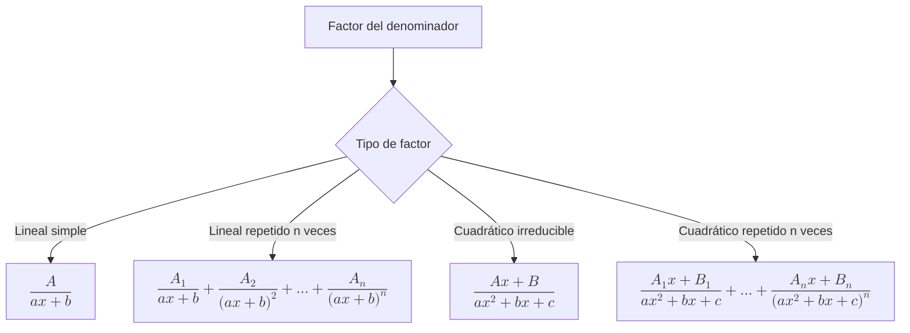

# 🧮 Integrales por Fracciones Parciales

## 📖 Introducción

> [!info] 💡 Concepto Clave La **integración por fracciones parciales** es una técnica fundamental para resolver integrales de funciones racionales. Consiste en descomponer una fracción compleja en suma de fracciones más simples que podemos integrar fácilmente.

> [!tip] 📌 ¿Cuándo usar este método?
> 
> - Cuando tenemos una función racional $\frac{P(x)}{Q(x)}$
> - El denominador $Q(x)$ es factorizable
> - Métodos como sustitución o integración por partes no son viables

---

## 🔤 Variables y Notación

> [!note] 📝 Elementos principales
> 
> - **$P(x)$**: Polinomio del numerador
> - **$Q(x)$**: Polinomio del denominador
> - **$\frac{P(x)}{Q(x)}$**: Función racional a integrar
> - **$A, B, C, ...$**: Constantes a determinar en la descomposición

> [!warning] ⚠️ Tipos de factores en el denominador
> 
> - 🔹 **Lineales distintos**: $(ax + b)$
> - ♻️ **Lineales repetidos**: $(ax + b)^n$
> - 🧩 **Cuadráticos irreducibles**: $ax^2 + bx + c$ donde $\Delta < 0$
> - 🔁 **Cuadráticos repetidos**: $(ax^2 + bx + c)^n$

---

## 🛠️ Procedimiento Paso a Paso

> [!tip] 🔎 **Paso 1: Verificación del grado**
> 
> **Si** $\text{grado}(P(x)) \geq \text{grado}(Q(x))$: $$\frac{P(x)}{Q(x)} = \text{Cociente}(x) + \frac{\text{Resto}(x)}{Q(x)}$$
> 
> **Si** $\text{grado}(P(x)) < \text{grado}(Q(x))$: ✅ Continuar al paso 2

> [!tip] 🧱 **Paso 2: Factorización del denominador**
> 
> Descomponer $Q(x)$ completamente:
> 
> - Encontrar raíces reales → factores lineales
> - Identificar factores cuadráticos irreducibles
> - Determinar multiplicidades

> [!tip] 🧮 **Paso 3: Establecer la descomposición**



> [!tip] 🧩 **Paso 4: Resolver para las constantes**
> 
> **Método 1 - Sustitución de raíces:**
> 
> - Multiplica ambos lados por $Q(x)$
> - Sustituye valores convenientes de $x$ (especialmente raíces)
> 
> **Método 2 - Igualación de coeficientes:**
> 
> - Expande el lado derecho
> - Iguala coeficientes de potencias semejantes

> [!tip] 🧘‍♂️ **Paso 5: Integración**
> 
> Integra cada fracción parcial usando fórmulas básicas:
> 
> - $\int \frac{1}{u} du = \ln|u| + C$
> - $\int \frac{1}{u^n} du = \frac{-1}{(n-1)u^{n-1}} + C$ (para $n > 1$)
> - $\int \frac{1}{u^2 + a^2} du = \frac{1}{a}\arctan\left(\frac{u}{a}\right) + C$

---

## 📊 Fundamento Teórico

> [!info] 🎓 Base matemática El **Teorema de Descomposición en Fracciones Parciales** establece que toda función racional propia puede expresarse de manera única como suma de fracciones parciales. Este resultado se basa en:
> 
> - La factorización única de polinomios sobre $\mathbb{R}[x]$
> - Propiedades algebraicas de los cuerpos
> - Teorema fundamental del álgebra


---

## 🔗 Conexiones Interdisciplinarias

> [!note] 🧩 **Álgebra y Análisis**
> 
> - **Factorización de polinomios**: Base fundamental del método
> - **Sistemas de ecuaciones lineales**: Para resolver constantes
> - **Integración básica**: Aplicación de fórmulas elementales

> [!note] 🔬 **Aplicaciones en Ingeniería**
> 
> - **Transformada de Laplace**: Inversión de transformadas racionales
> - **Análisis de circuitos**: Funciones de transferencia
> - **Teoría de control**: Análisis de estabilidad

---

## 💡 Ejemplo Detallado

> [!example] 🧪 **Problema**: Calcular $\int \frac{x+5}{x^2 + x - 2} dx$

> [!tip] 📝 **Solución paso a paso**
> 
> **1. Verificar grado:** ✅ Numerador grado 1 < Denominador grado 2
> 
> **2. Factorizar:** $x^2 + x - 2 = (x + 2)(x - 1)$
> 
> **3. Descomposición:** $$\frac{x+5}{(x+2)(x-1)} = \frac{A}{x+2} + \frac{B}{x-1}$$
> 
> **4. Resolver constantes:** $$x + 5 = A(x - 1) + B(x + 2)$$
> 
> - Para $x = 1$: $6 = 3B \Rightarrow B = 2$
> - Para $x = -2$: $3 = -3A \Rightarrow A = -1$
> 
> **5. Integrar:** $$\int \left(\frac{-1}{x+2} + \frac{2}{x-1}\right) dx = -\ln|x+2| + 2\ln|x-1| + C$$
> 
> **Forma compacta:** $\ln\left|\frac{(x-1)^2}{x+2}\right| + C$

> [!success] ✅ **Verificación** Podemos verificar derivando el resultado para obtener la función original.

---

## 📈 Visualización Gráfica

```mermaid
graph LR
    A["$$f(x) = \frac{x+5}{x^2+x-2}$$"] --> B["$$\frac{-1}{x+2}$$"]
    A --> C["$$\frac{2}{x-1}$$"]
    B --> D[Integral: $-\ln|x+2|$]
    C --> E[Integral: $2\ln|x-1|$]
    D --> F[Resultado Final]
    E --> F
    
    style A fill:#e1f5fe
    style F fill:#e8f5e8
```

> [!info] 📊 **Interpretación gráfica**
> 
> - La función original tiene asíntotas verticales en $x = -2$ y $x = 1$
> - Cada fracción parcial contribuye con un comportamiento específico
> - La suma reproduce exactamente la función original

---

## 🎯 Estrategias y Consejos

> [!tip] 💡 **Consejos prácticos**
> 
> - **Siempre verifica** que el grado del numerador sea menor
> - **Factoriza completamente** antes de establecer fracciones parciales
> - **Usa valores estratégicos** de $x$ para simplificar cálculos
> - **Verifica tu resultado** derivando la integral obtenida

> [!warning] ⚠️ **Errores comunes**
> 
> - Olvidar casos de factores repetidos
> - Confundir la forma de fracciones con cuadráticos irreducibles
> - Errores aritméticos al resolver el sistema de ecuaciones
> - No verificar la factorización del denominador

---

## 📚 Referencias

> [!quote] **Notas relacionadas**
> 
> - [[Integración por Sustitución]] - Método alternativo para ciertas funciones racionales
> - [[Integración por Partes]] - Complementa cuando hay productos
> - [[Factorización de Polinomios]] - Fundamento algebraico
> - [[Integrales Trigonométricas]] - Casos especiales de sustitución

---

## 🔍 Notas Recomendadas

> [!note] 📖 **Para profundizar**
> 
> - [[Teorema Fundamental del Álgebra]]
> - [[Sistemas de Ecuaciones Lineales]]
> - [[Transformada de Laplace]]
> - [[Funciones Racionales y sus Propiedades]]
> - [[Métodos de Integración - Resumen General]]

---

## 🏷️ Tags

#matemáticas #cálculo #integración #fracciones-parciales #funciones-racionales #métodos-integración #álgebra #análisis-matemático #universidad #ingeniería
