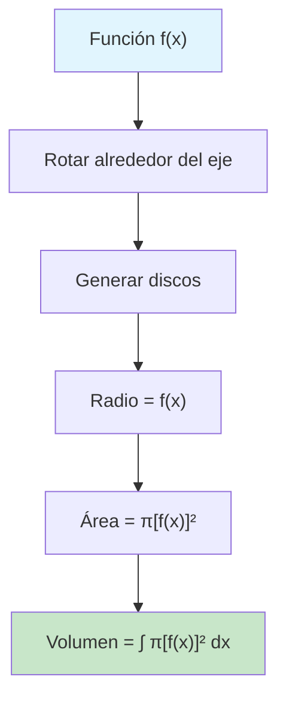
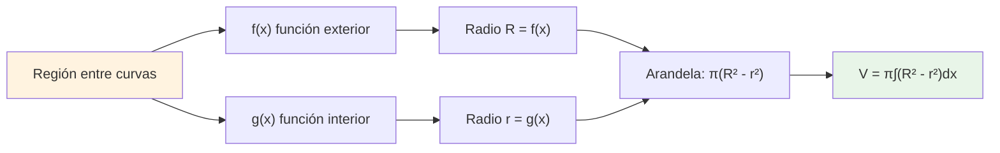
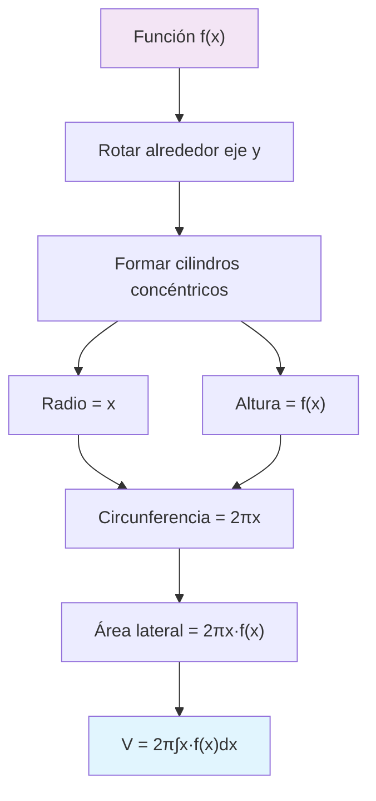

# Volúmenes de Sólidos de Revolución 🌪️

> [!info]+ **Definición Fundamental** Los **sólidos de revolución** son figuras tridimensionales generadas al rotar una región plana alrededor de un eje. El cálculo de sus volúmenes requiere técnicas específicas de integración que aprovechan la simetría rotacional.
> 
> 📐 **Concepto clave**: Cada método aprovecha una geometría específica (discos, arandelas, o cilindros) para aproximar el volumen total.

## Método del Disco 💿

> [!tip]+ **Fundamento del Método**
> 
> ### Principio Básico
> 
> Cuando una función $f(x) \geq 0$ se rota alrededor del eje $x$, genera discos perpendiculares al eje de rotación.
> 
> ### Fórmula General
> 
> $$V = \pi \int_a^b [f(x)]^2 , dx$$
> 
> ### Elementos del Disco
> 
> |Elemento|Descripción|Medida|
> |---|---|---|
> |🎯 Centro|En el eje de rotación|$(x, 0)$|
> |📏 Radio|Distancia de la función al eje|$f(x)$|
> |📐 Área|Área del disco circular|$\pi [f(x)]^2$|
> |📊 Grosor|Diferencial del eje|$dx$|

> [!example]+ **Ejemplo Práctico** **Problema**: Encontrar el volumen del sólido generado al rotar $f(x) = \sqrt{x}$ alrededor del eje $x$ en $[0, 4]$.
> 
> **Solución**: $$V = \pi \int_0^4 (\sqrt{x})^2 , dx = \pi \int_0^4 x , dx = \pi \left[\frac{x^2}{2}\right]_0^4 = 8\pi$$

## Método de las Arandelas 🍩

> [!warning]+ **Diferencia Clave con Discos** Las **arandelas** se forman cuando hay una cavidad interior en el sólido de revolución. Esto ocurre cuando rotamos una región entre dos funciones.

> [!info]+ **Configuración de Arandelas**
> 
> ### Cuando usar este método
> 
> - Rotación de una región entre dos curvas: $f(x) \geq g(x) \geq 0$
> - La región no toca el eje de rotación
> 
> ### Fórmula General
> 
> $$V = \pi \int_a^b \left([f(x)]^2 - [g(x)]^2\right) dx$$
> 
> ### Componentes
> 
> |Elemento|Valor|Significado|
> |---|---|---|
> |🔴 Radio exterior|$R = f(x)$|Función superior|
> |🔵 Radio interior|$r = g(x)$|Función inferior|
> |🍩 Área arandela|$\pi(R^2 - r^2)$|Diferencia de áreas|

> [!example]+ **Ejemplo de Arandelas** **Problema**: Volumen del sólido generado rotando la región entre $f(x) = x + 2$ y $g(x) = x^2$ alrededor del eje $x$ en $[-1, 2]$.
> 
> **Solución**: $$V = \pi \int_{-1}^2 \left[(x+2)^2 - (x^2)^2\right] dx$$ $$= \pi \int_{-1}^2 \left[x^2 + 4x + 4 - x^4\right] dx$$

## Método de las Capas Cilíndricas 🥤

> [!tip]+ **Cuándo es Más Eficiente** Este método es especialmente útil cuando:
> 
> - La rotación es alrededor del eje $y$
> - Es complicado expresar $x$ en función de $y$
> - La región tiene forma "vertical" natural

> [!info]+ **Fundamento del Método**
> 
> ### Visualización
> 
> Imaginamos **cilindros concéntricos** de grosor infinitesimal, como capas de una cebolla.
> 
> ### Fórmula General (rotación alrededor del eje y)
> 
> $$V = 2\pi \int_a^b x \cdot f(x) , dx$$
> 
> ### Componentes del Cilindro
> 
> |Elemento|Valor|Descripción|
> |---|---|---|
> |🎯 Radio|$x$|Distancia al eje y|
> |📏 Altura|$f(x)$|Altura de la función|
> |🔄 Circunferencia|$2\pi x$|Perímetro del cilindro|
> |📐 Área lateral|$2\pi x \cdot f(x)$|Superficie del cilindro|
> |📏 Grosor|$dx$|Diferencial|

> [!example]+ **Ejemplo de Capas Cilíndricas** **Problema**: Volumen del sólido generado rotando $f(x) = x^2$ alrededor del eje $y$ en $[0, 2]$.
> 
> **Solución**: $$V = 2\pi \int_0^2 x \cdot x^2 , dx = 2\pi \int_0^2 x^3 , dx$$ $$= 2\pi \left[\frac{x^4}{4}\right]_0^2 = 2\pi \cdot 4 = 8\pi$$

## Comparación de Métodos 📊

> [!info]+ **Tabla Comparativa**
> 
> |Aspecto|Disco 💿|Arandelas 🍩|Capas Cilíndricas 🥤|
> |---|---|---|---|
> |**Geometría**|Círculos sólidos|Círculos con agujero|Cilindros huecos|
> |**Rotación típica**|Eje x|Eje x|Eje y|
> |**Fórmula**|$\pi\int[f(x)]^2dx$|$\pi\int([f(x)]^2-[g(x)]^2)dx$|$2\pi\int x·f(x)dx$|
> |**Cuándo usar**|Una función, eje x|Entre dos funciones|Rotación eje y|
> |**Ventaja**|Más simple|Maneja cavidades|Evita inversión de función|

## Técnicas de Estudio 🎯

> [!tip]+ **Mnemotecnia para Recordar Fórmulas**
> 
> ### Regla "DCA" (Disco-Capas-Arandelas)
> 
> - 🥏 **D**isco: "**D**iámetro al cuadrado" → $\pi[f(x)]^2$
> - 🥤 **C**apas: "**C**ircunferencia por altura" → $2\pi x \cdot f(x)$
> - 🍩 **A**randelas: "**A**fuera menos adentro" → $\pi(R^2 - r^2)$
> 
> ### Estrategia de Visualización
> 
> 1. 👁️ **Visualiza** la región original
> 2. 🔄 **Rota** mentalmente alrededor del eje
> 3. 🔍 **Identifica** la forma geométrica resultante
> 4. 📐 **Aplica** la fórmula correspondiente

> [!warning]+ **Errores Comunes a Evitar**
> 
> - ❌ Olvidar el $\pi$ en métodos de disco y arandelas
> - ❌ Confundir radio interior y exterior en arandelas
> - ❌ No considerar el $2\pi$ en capas cilíndricas
> - ❌ Usar límites incorrectos de integración

## Referencias 📚

> [!quote]+ **Enlaces a Notas Relacionadas**
> 
> - [[Integrales Definidas]] - Base matemática fundamental
> - [[Aplicaciones de la Integral]] - Contexto más amplio
> - [[Métodos de Integración]] - Técnicas necesarias para resolver
> - [[Geometría Analítica]] - Para visualización espacial
> - [[Funciones y sus Gráficas]] - Interpretación de las regiones

## Notas Recomendadas para Complementar 📖

> [!info]+ **Prerrequisitos Esenciales**
> 
> - [[Cálculo Diferencial]] - Derivadas y funciones
> - [[Integrales Indefinidas]] - Antiderivadas básicas
> - [[Teorema Fundamental del Cálculo]] - Conexión derivada-integral
> - [[Área entre Curvas]] - Fundamentos de regiones
> 
> **Temas Complementarios**
> 
> - [[Coordenadas Polares]] - Para casos más complejos
> - [[Superficies de Revolución]] - Extensión natural
> - [[Momentos y Centros de Masa]] - Otras aplicaciones
> - [[Longitud de Arco]] - Medidas en curvas

---

**Tags**: #cálculo #integrales #volúmenes #sólidos-revolución #geometría #aplicaciones-integrales #métodos-integración #disco #arandelas #capas-cilíndricas #visualización-3d