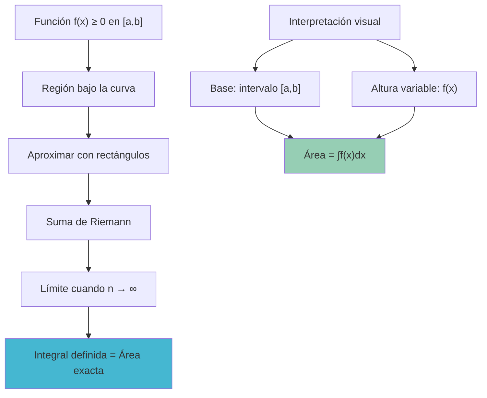
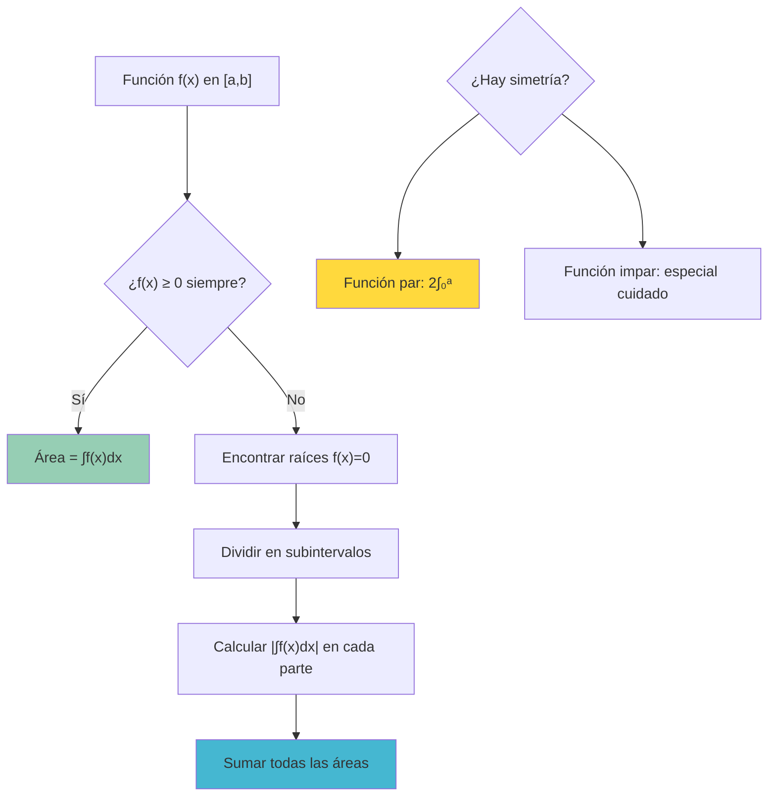

# 📐️ Área bajo la Curva

> [!info] 💡 **La Interpretación Geométrica Fundamental** El cálculo del área bajo una curva es la aplicación geométrica más importante de la integral definida, conectando el concepto abstracto de integración con la intuición visual del área.

## 🎯 Definición y Conceptos Básicos

### 📏 Área como Integral Definida

> [!tip] 🏆 **Definición Fundamental** Si $f(x) \geq 0$ es continua en $[a,b]$, entonces el **área bajo la curva** $y = f(x)$ desde $x = a$ hasta $x = b$ es:
> 
> $$\text{Área} = \int_a^b f(x) dx$$

### 🎨 Interpretación Geométrica



### 📋 Condiciones y Limitaciones

> [!warning]- ⚠️ **Condiciones Importantes**
> 
> - **Función no negativa**: $f(x) \geq 0$ en todo $[a,b]$
> - **Continuidad**: $f$ debe ser continua (o Riemann integrable)
> - **Límites finitos**: $a$ y $b$ son números reales finitos

## 📊 Casos Fundamentales

### 🟢 Caso 1: Función Siempre Positiva

> [!info]- 📈 **Caso Estándar** Cuando $f(x) \geq 0$ en $[a,b]$: $\text{Área} = \int_a^b f(x) dx$

#### 🧪 Ejemplo Básico

> [!tip]- 🔬 **Ejemplo**: Área bajo $f(x) = x^2$ de $x = 0$ a $x = 2$
> 
> **Verificación de positividad**: $x^2 \geq 0$ para todo $x$ ✓
> 
> **Cálculo**: $\text{Área} = \int_0^2 x^2 dx = \left[\frac{x^3}{3}\right]_0^2 = \frac{8}{3} - 0 = \frac{8}{3}$
> 
> **Interpretación**: La región entre la parábola $y = x^2$, el eje $x$, y las rectas $x = 0$, $x = 2$ tiene área $\frac{8}{3}$ unidades cuadradas.

### 🔴 Caso 2: Función Siempre Negativa

> [!warning]- 📉 **Área con Signo Negativo** Cuando $f(x) \leq 0$ en $[a,b]$:
> 
> - **Integral**: $\int_a^b f(x) dx < 0$ (área con signo)
> - **Área geométrica**: $\text{Área} = -\int_a^b f(x) dx = \int_a^b |f(x)| dx$

#### 🧪 Ejemplo con Función Negativa

> [!tip]- 🔬 **Ejemplo**: Área bajo $f(x) = x^2 - 4$ de $x = 1$ a $x = 3$
> 
> **Análisis**: $f(x) = x^2 - 4 < 0$ cuando $x^2 < 4$, es decir, cuando $|x| < 2$ En $[1,3]$: $f(1) = -3 < 0$ y $f(3) = 5 > 0$
> 
> **Encontrar donde $f(x) = 0$**: $x^2 - 4 = 0 \Rightarrow x = 2$
> 
> Este caso requiere dividir el intervalo (ver Caso 3).

### 🔄 Caso 3: Función que Cambia de Signo

> [!tip]- 🎯 **Método General** Cuando $f(x)$ cambia de signo en $[a,b]$:
> 
> 1. **Encontrar las raíces**: Resolver $f(x) = 0$
> 2. **Dividir el intervalo**: En subintervalos donde $f$ mantiene signo
> 3. **Calcular por separado**: Área = suma de valores absolutos de cada integral
> 
> $\text{Área Total} = \sum_{i} \left|\int_{x_{i-1}}^{x_i} f(x) dx\right|$

#### 🧪 Ejemplo Completo con Cambio de Signo

> [!tip]- 🔬 **Ejemplo**: Área bajo $f(x) = x^3 - x$ de $x = -2$ a $x = 2$
> 
> **Paso 1**: Encontrar raíces $x^3 - x = 0 \Rightarrow x(x^2 - 1) = 0 \Rightarrow x = 0, \pm 1$
> 
> **Paso 2**: Analizar signos en cada intervalo
> 
> - $[-2, -1]$: $f(-1.5) = -1.875 < 0$
> - $[-1, 0]$: $f(-0.5) = 0.375 > 0$
> - $[0, 1]$: $f(0.5) = -0.375 < 0$
> - $[1, 2]$: $f(1.5) = 1.875 > 0$
> 
> **Paso 3**: Calcular cada área $\text{Área} = \left|\int_{-2}^{-1} (x^3-x) dx\right| + \left|\int_{-1}^0 (x^3-x) dx\right| + \left|\int_0^1 (x^3-x) dx\right| + \left|\int_1^2 (x^3-x) dx\right|$
> 
> **Evaluando cada integral**: $\int (x^3 - x) dx = \frac{x^4}{4} - \frac{x^2}{2}$
> 
> - $\int_{-2}^{-1} (x^3-x) dx = \left[\frac{x^4}{4} - \frac{x^2}{2}\right]_{-2}^{-1} = \frac{1}{4} - \frac{1}{2} - (4 - 2) = -\frac{9}{4}$
> - $\int_{-1}^0 (x^3-x) dx = 0 - (-\frac{1}{4} + \frac{1}{2}) = \frac{1}{4}$
> - $\int_0^1 (x^3-x) dx = \frac{1}{4} - \frac{1}{2} - 0 = -\frac{1}{4}$
> - $\int_1^2 (x^3-x) dx = 4 - 2 - (\frac{1}{4} - \frac{1}{2}) = \frac{9}{4}$
> 
> **Área total**: $\frac{9}{4} + \frac{1}{4} + \frac{1}{4} + \frac{9}{4} = 5$

## 🎨 Técnicas de Cálculo

### ⚡ Método Directo

> [!info]- 🔧 **Para Funciones Simples**
> 
> 1. Verificar que $f(x) \geq 0$ en $[a,b]$
> 2. Encontrar antiderivada $F(x)$
> 3. Aplicar: $\text{Área} = F(b) - F(a)$

### 🔄 Método por Partes

> [!tip]- 🎯 **Para Funciones que Cambian de Signo**
> 
> 1. Encontrar raíces de $f(x) = 0$
> 2. Dividir $[a,b]$ en subintervalos
> 3. Calcular $|\int|$ en cada subintervalo
> 4. Sumar todos los resultados

### 🌊 Aprovechando Simetría

> [!info]- ⚡ **Funciones Pares e Impares**
> 
> **Función par**: $f(-x) = f(x)$
> 
> - Si $f(x) \geq 0$ en $[-a,a]$: $\text{Área} = 2\int_0^a f(x) dx$
> 
> **Función impar**: $f(-x) = -f(x)$
> 
> - Área total en $[-a,a]$ = 2 × (área donde $f(x) \geq 0$)

#### 🧪 Ejemplo con Simetría

> [!tip]- 🔬 **Ejemplo**: Área bajo $f(x) = 4 - x^2$ de $x = -2$ a $x = 2$
> 
> **Verificación**: $f(-x) = 4 - (-x)^2 = 4 - x^2 = f(x)$ (función par)
> 
> **Verificar positividad**: $f(x) = 4 - x^2 \geq 0 \Leftrightarrow x^2 \leq 4 \Leftrightarrow |x| \leq 2$ En $[-2,2]$: $f(x) \geq 0$ ✓
> 
> **Aplicar simetría**: $\text{Área} = 2\int_0^2 (4 - x^2) dx = 2\left[4x - \frac{x^3}{3}\right]_0^2 = 2\left(8 - \frac{8}{3}\right) = 2 \cdot \frac{16}{3} = \frac{32}{3}$

## 🧮 Aplicaciones con Diferentes Tipos de Funciones

### 📈 Funciones Polinómicas

> [!tip]- 📊 **Características**
> 
> - Fáciles de integrar
> - Pueden cambiar de signo múltiples veces
> - Útiles para encontrar patrones

#### 🧪 Ejemplo Polinómico

> [!info]- 🔬 **Área bajo** $f(x) = x^4 - 5x^2 + 4$ **en** $[-3, 3]$
> 
> **Factorización**: $x^4 - 5x^2 + 4 = (x^2 - 1)(x^2 - 4) = (x-1)(x+1)(x-2)(x+2)$
> 
> **Raíces**: $x = \pm 1, \pm 2$
> 
> **Análisis de signos**:
> 
> - $(-3, -2)$: $f(-2.5) > 0$
> - $(-2, -1)$: $f(-1.5) < 0$
> - $(-1, 1)$: $f(0) = 4 > 0$
> - $(1, 2)$: $f(1.5) < 0$
> - $(2, 3)$: $f(2.5) > 0$
> 
> Por simetría (función par), el área total es: $\text{Área} = 2\left[\int_0^1 4 dx + \left|\int_1^2 (x^4-5x^2+4) dx\right| + \int_2^3 (x^4-5x^2+4) dx\right]$

### 🌊 Funciones Trigonométricas

> [!warning]- 🔍 **Consideraciones Especiales**
> 
> - Oscilan entre valores positivos y negativos
> - Útil conocer período y fase
> - Aprovechar simetrías

#### 🧪 Ejemplo Trigonométrico

> [!tip]- 🔬 **Área bajo** $f(x) = \sin(x)$ **de** $x = 0$ **a** $x = 2\pi$
> 
> **Análisis**: $\sin(x) \geq 0$ en $[0, \pi]$ y $\sin(x) \leq 0$ en $[\pi, 2\pi]$
> 
> **Cálculo por partes**: $\text{Área} = \int_0^{\pi} \sin(x) dx + \left|\int_{\pi}^{2\pi} \sin(x) dx\right|$
> 
> $= [-\cos(x)]_0^{\pi} + \left|[-\cos(x)]_{\pi}^{2\pi}\right|$
> 
> $= (-\cos(\pi) + \cos(0)) + |(-\cos(2\pi) + \cos(\pi))|$
> 
> $= (1 + 1) + |-1 - 1| = 2 + 2 = 4$

### 📊 Funciones Exponenciales y Logarítmicas

#### 🧪 Ejemplo Exponencial

> [!tip]- 🔬 **Área bajo** $f(x) = e^{-x^2}$ **de** $x = -1$ **a** $x = 1$
> 
> **Análisis**: $e^{-x^2} > 0$ para todo $x$ ✓
> 
> **Problema**: Esta integral no tiene forma cerrada elemental
> 
> **Solución**: Se relaciona con la distribución normal $\int_{-1}^1 e^{-x^2} dx \approx 1.493$ (valor numérico)

## 🎯 Interpretaciones y Aplicaciones

### 🗛️ Aplicaciones Geométricas

> [!info]- 🎨 **Usos Geométricos**
> 
> - **Áreas de regiones irregulares**
> - **Diseño arquitectónico**
> - **Cálculo de superficies**

### ⚡ Aplicaciones Físicas

> [!tip]- 🔬 **Interpretaciones Físicas**
> 
> - **Desplazamiento**: Área bajo curva de velocidad
> - **Trabajo**: Área bajo curva de fuerza
> - **Carga eléctrica**: Área bajo curva de corriente

#### 🧪 Ejemplo Físico

> [!info]- 🚗 **Problema**: Un auto tiene velocidad $v(t) = 2t$ m/s durante los primeros 5 segundos. ¿Qué distancia recorre?
> 
> **Solución**: El desplazamiento es el área bajo la curva de velocidad $\text{Desplazamiento} = \int_0^5 2t , dt = [t^2]_0^5 = 25 \text{ metros}$

### 📊 Aplicaciones Probabilísticas

> [!warning]- 🎲 **Funciones de Densidad** En probabilidad, el área bajo una función de densidad $f(x)$ representa la probabilidad: $P(a \leq X \leq b) = \int_a^b f(x) dx$)$ representa la probabilidad: $$P(a \leq X \leq b) = \int_a^b f(x) dx$$

## ⚠️ Errores Comunes y Precauciones

### 🔴 Errores Típicos

> [!warning] 🚨 **Errores Frecuentes**
> 
>
> #### Error 1: Ignorar Cambios de Signo
> 
> **Problema**: Calcular $\int_a^b f(x) dx$ sin verificar si $f(x)$ cambia de signo
> 
> **Ejemplo**: $\int_{-1}^1 x dx = 0$ ≠ área bajo la curva (que sería $1$)
> 
> #### Error 2: Confundir Área con Integral
> 
> **Problema**: El área siempre es no negativa, la integral puede ser negativa
> 
> **Regla**: Área = $\int |f(x)| dx$, no necesariamente $\int f(x) dx$
> 
> #### Error 3: Límites de Integración Incorrectos
> 
> **Problema**: No identificar correctamente la región de interés
> 
> **Solución**: Siempre dibujar la región antes de calcular

### ✅ Lista de Verificación

> [!info] 📋 **Antes de Calcular**
> 
> 1. ¿La función es continua en el intervalo?
> 2. ¿La función cambia de signo?
> 3. ¿Los límites de integración son correctos?
> 4. ¿Se puede aprovechar alguna simetría?
> 5. ¿El resultado tiene sentido geométricamente?

## 🔧 Herramientas y Estrategias

### 🎯 Estrategia General



### 🧠 Técnicas de Visualización

> [!tip] 💡 **Ayudas Visuales**
> 
> 1. **Graficar la función**: Usar herramientas gráficas
> 2. **Identificar regiones**: Marcar donde $f(x) \geq 0$ y $f(x) < 0$
> 3. **Verificar resultados**: El área debe ser positiva
> 4. **Aproximaciones**: Usar reglas numéricas para verificar

## 🧠 Técnica de Estudio: Método GRAFO

> [!tip] 🎓 **Mnemotecnia GRAFO para Área bajo la Curva**
> 
> **G**raficar la función y la región **R**econocer si el área es positiva, negativa o mixta **A**plicar el Teorema Fundamental del Cálculo **F**ormular la integral definida $\int_a^b f(x)dx$ **O**btener el resultado y verificar

> [!success]- 📋 Desarrollo Detallado del Método GRAFO
> ### 
> 
> #### 📊 **G - Graficar**
> 
> - Hacer un **bosquejo** de $y = f(x)$ (no necesita ser perfecto, solo funcional)
> - Marcar claramente los **límites de integración** $x = a$ y $x = b$
> - **Sombrear la región** de interés bajo la curva
> - Identificar visualmente si hay **partes sobre y bajo el eje x**
> 
> #### 🔍 **R - Reconocer el Tipo de Área**
> 
> - **Área completamente positiva**: Si $f(x) \geq 0$ para todo $x \in [a,b]$
> - **Área completamente negativa**: Si $f(x) \leq 0$ para todo $x \in [a,b]$
> - **Área mixta**: Si $f(x)$ cambia de signo → necesitas dividir en subintervalos
> - **Puntos críticos**: Encontrar dónde $f(x) = 0$ si hay cambios de signo
> 
> #### ⚡ **A - Aplicar Teoremas Apropiados**
> 
> - **Caso estándar**: Usar Teorema Fundamental del Cálculo
> - **Área neta vs área total**:
>     - Área neta: $\int_a^b f(x)dx = F(b) - F(a)$
>     - Área total: $\int_a^b |f(x)|dx$ (siempre positiva)
> - **Si hay área mixta**: $\text{Área} = \sum \int |f(x)|dx$ en cada subintervalo
> 
> #### 📝 **F - Formular la Integral**
> 
> - Escribir la **integral definida** con límites correctos
> - Encontrar la **antiderivada** $F(x)$ tal que $F'(x) = f(x)$
> - Para área mixta: configurar **múltiples integrales** según los intervalos
> - Preparar la **evaluación** usando notación $[F(x)]_a^b$
> 
> #### ✅ **O - Obtener y Verificar**
> 
> - Calcular $F(b) - F(a)$ paso a paso
> - **Interpretación del resultado**:
>     - Si es positivo: área neta hacia arriba
>     - Si es negativo: área neta hacia abajo
>     - Para área geométrica: tomar valor absoluto si es necesario
> - **Verificación dimensional**: el resultado debe tener unidades de área
> 

### 🧪 Ejemplo Completo con GRAFO

> [!example]- 📈 **Problema**: Encontrar el área bajo $f(x) = x^2 - 4$ desde $x = 0$ hasta $x = 3$
> 
> **🎯 Aplicando GRAFO paso a paso:**
> 
> #### **G - Graficar**
> 
> ```
> Parábola y = x² - 4 que:
> - Abre hacia arriba (coeficiente positivo de x²)
> - Vértice en (0, -4)
> - Corta eje x en x = ±2
> - En [0,3]: negativa en [0,2], positiva en [2,3]
> ```
> 
> #### **R - Reconocer**
> 
> - **Área mixta** detectada ✓
> - Cambio de signo en $x = 2$ (donde $f(2) = 4 - 4 = 0$)
> - Subintervalos: $[0,2]$ (negativa) y $[2,3]$ (positiva)
> 
> #### **A - Aplicar**
> 
> - Necesitamos área total (geométrica), no área neta
> - Fórmula: $\text{Área} = \int_0^2 |x^2-4|dx + \int_2^3 |x^2-4|dx$
> - Como $x^2-4 < 0$ en $[0,2]$: $|x^2-4| = 4-x^2$
> - Como $x^2-4 > 0$ en $[2,3]$: $|x^2-4| = x^2-4$
> 
> #### **F - Formular**
> 
> $$\text{Área} = \int_0^2 (4-x^2)dx + \int_2^3 (x^2-4)dx$$
> 
> Antiderivadas:
> 
> - Para $(4-x^2)$: $4x - \frac{x^3}{3}$
> - Para $(x^2-4)$: $\frac{x^3}{3} - 4x$
> 
> #### **O - Obtener**
> 
> $$\text{Área} = \left[4x - \frac{x^3}{3}\right]_0^2 + \left[\frac{x^3}{3} - 4x\right]_2^3$$
> 
> $$= \left(8 - \frac{8}{3}\right) - (0) + \left(9 - 12\right) - \left(\frac{8}{3} - 8\right)$$
> 
> $$= \frac{16}{3} + (-3) - \left(-\frac{16}{3}\right) = \frac{16}{3} - 3 + \frac{16}{3} = \frac{32-9}{3} = \frac{23}{3}$$
> 
> **Verificación**: ✅ Resultado positivo y geométricamente sensato

---

## 📚 Referencias y Conexiones

> [!quote]- 🔗 Notas Relacionadas
> 
> - [[Integral de Riemann]] - Definición formal subyacente
> - [[Teorema fundamental del cálculo]] - Herramienta principal de evaluación
> - [[Propiedades de la Integral Definida]] - Herramientas para simplificar cálculos
> - [[Métodos de Integración Definida]] - Técnicas para evaluación

> [!NOTE]- 📖 Para Profundizar
> 
> 
> - [[Integrales Impropias]] - Áreas con límites infinitos
> - [[Integración Numérica]] - Métodos aproximados para casos complejos
> - [[Cálculo de Variaciones]] - Optimización de áreas
> - [[Geometría Diferencial]] - Generalización a superficies
> 
> ### 🎯 Aplicaciones Especializadas
> 
> - [[Trabajo y Energía con Integrales]] - Interpretación física
> - [[Probabilidad y Estadística]] - Funciones de densidad
> - [[Volúmenes de Revolución]] - Extensión tridimensional
> - [[Longitud de Arco]] - Otra aplicación geométrica

### 🏷️ Tags

#matematicas/calculo/geometria #integrales/aplicaciones #areas/calculo #geometria/analitica #interpretacion/visual #fisica/aplicaciones #fundamentos/geometricos