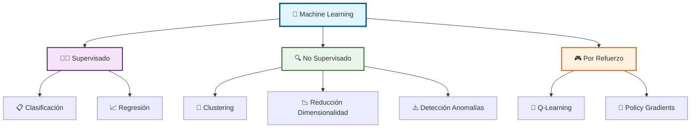
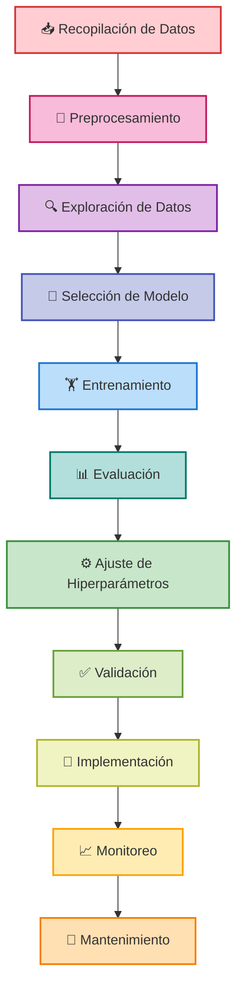
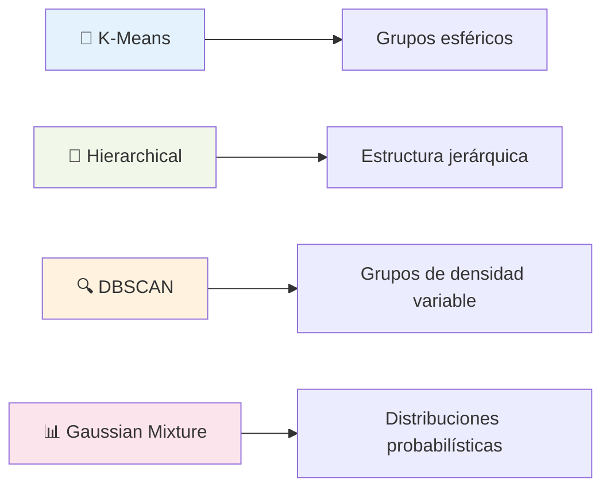
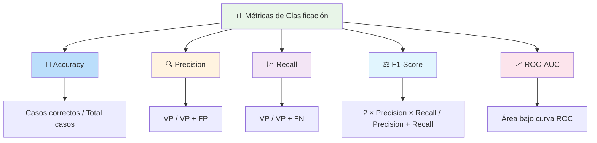

# Machine Learning - Aprendizaje Automático 🤖

[!quote]- Cita Inspiradora
> *"El aprendizaje automático no es magia; es tecnología. Pero aplicada correctamente, puede parecer mágica."* - Andrew Ng

> [!info]- ## ¿Qué es Machine Learning? 🧠
El Machine Learning (ML) o Aprendizaje Automático es una rama de la inteligencia artificial que permite a las computadoras aprender y tomar decisiones basadas en datos, sin ser programadas explícitamente para cada tarea específica.

### 🎯 Objetivos del Machine Learning
- 📊 Identificar patrones en grandes conjuntos de datos
- 🔮 Realizar predicciones precisas sobre datos futuros
- ⚡ Automatizar procesos de toma de decisiones
- 📈 Mejorar el rendimiento a través de la experiencia

### 🔍 Características Clave
- **Aprendizaje Automático**: Sin programación explícita
- **Basado en Datos**: Utiliza información histórica
- **Adaptativo**: Mejora con más datos
- **Escalable**: Maneja grandes volúmenes de información

> [!tip]- ## Tipos de Machine Learning 🔄


### 📊 Comparativa de Tipos

| Tipo | Descripción | Ejemplos de Algoritmos | Casos de Uso Comunes |
|------|-------------|------------------------|----------------------|
| **Supervisado** 👨‍🏫 | Aprende de datos etiquetados | Decision Trees, SVM, Neural Networks | Diagnóstico médico, Reconocimiento de voz, Spam detection |
| **No Supervisado** 🔍 | Encuentra patrones sin etiquetas | K-means, PCA, DBSCAN | Segmentación de clientes, Detección de fraudes, Análisis de mercado |
| **Por Refuerzo** 🎮 | Aprende mediante recompensas/castigos | Q-Learning, AlphaGo, Deep Q-Networks | Juegos, Robótica, Trading automático, Coches autónomos |

> [!warning]- ## Proceso Completo de Machine Learning 🔄


### 🛠️ Fases Detalladas del Proceso

#### 1. 📥 Recopilación de Datos
- **Fuentes**: APIs, bases de datos, sensores, web scraping
- **Calidad**: Datos completos, precisos y representativos
- **Volumen**: Suficiente para entrenar modelos robustos

#### 2. 🧹 Preprocesamiento
- **Limpieza**: Eliminar datos faltantes o erróneos
- **Transformación**: Normalización, codificación categórica
- **Feature Engineering**: Crear nuevas variables relevantes

#### 3. 🔍 Exploración de Datos (EDA)
- **Análisis estadístico**: Distribuciones, correlaciones
- **Visualización**: Gráficos, histogramas, scatter plots
- **Patrones**: Identificar tendencias y anomalías

#### 4. 🎯 Selección de Modelo
- **Tipo de problema**: Clasificación, regresión, clustering
- **Complejidad**: Lineal vs no lineal
- **Interpretabilidad**: Trade-off con precisión

> [!example]- ## Algoritmos Fundamentales por Categoría 🧮

### 🔄 Algoritmos de Clasificación
| Algoritmo | Ventajas | Desventajas | Mejor para |
|-----------|----------|-------------|------------|
| **Decision Trees** 🌳 | Fácil interpretación, no requiere preparación | Tendencia al overfitting | Datos categóricos, reglas de negocio |
| **Random Forest** 🌲🌲🌲 | Reduce overfitting, maneja datos faltantes | Menos interpretable | Datos mixtos, alta precisión |
| **SVM** ⚡ | Eficaz en alta dimensionalidad | Lento con datasets grandes | Clasificación de texto, imágenes |
| **Neural Networks** 🧠 | Aprende patrones complejos | Caja negra, requiere muchos datos | Reconocimiento de patrones |
| **Naive Bayes** 📊 | Rápido, funciona con pocos datos | Asume independencia de variables | Clasificación de texto |

### 📈 Algoritmos de Regresión
- **Linear Regression** 📏: Relaciones lineales simples
- **Polynomial Regression** 📐: Captura relaciones no lineales
- **Ridge/Lasso** 🎯: Incluye regularización para evitar overfitting
- **Support Vector Regression** ⚡: Versión de SVM para regresión

### 🔍 Algoritmos de Clustering


[!bug]- ## Desafíos y Problemas Comunes ⚠️

### 🚨 Problemas Principales

| Problema | 🔍 Descripción | 💡 Señales de Alerta | 🛠️ Soluciones |
|----------|----------------|---------------------|----------------|
| **Overfitting** 📈 | Memoriza datos de entrenamiento | Alta precisión en entrenamiento, baja en test | Cross-validation, regularización, más datos |
| **Underfitting** 📉 | Modelo demasiado simple | Baja precisión en entrenamiento y test | Modelos más complejos, más características |
| **Sesgo en Datos** ⚖️ | Datos no representativos | Resultados sesgados hacia grupos específicos | Muestreo diverso, auditorías regulares |
| **Dimensionalidad** 📊 | Demasiadas variables (curse of dimensionality) | Modelos lentos, overfitting | PCA, selección de características |
| **Desequilibrio de Clases** ⚖️ | Clases desproporcionadas | Precisión engañosa | SMOTE, cost-sensitive learning |

### 🛡️ Estrategias de Mitigación
- **📊 Cross-validation**: K-fold para evaluar generalización
- **🎯 Regularización**: L1/L2 para controlar complejidad
- **⚙️ Feature Engineering**: Crear características relevantes
- **🤝 Ensemble Methods**: Combinar múltiples modelos
- **📈 Learning Curves**: Monitorear progreso del entrenamiento

> [!success]- ## Métricas de Evaluación 📊

### 🎯 Métricas para Clasificación


### 📈 Métricas para Regresión
| Métrica | Fórmula | Interpretación |
|---------|---------|----------------|
| **MAE** 📏 | Mean Absolute Error | Error promedio absoluto |
| **MSE** 📐 | Mean Squared Error | Penaliza errores grandes |
| **RMSE** 📊 | Root MSE | En unidades originales |
| **R²** 🎯 | Coefficient of Determination | Porcentaje de varianza explicada |

[!question]- ## Técnica de Estudio Eficaz: Método CRISP-DM + Flashcards 🧠

### 🎯 Mnemotecnia: "**C**ada **R**eto **I**nteligente **S**e **P**uede **D**ominar **M**ejor"

#### 📚 Fases CRISP-DM:
1. **C**omprender el negocio (Business Understanding)
2. **R**ecopilar datos (Data Understanding)  
3. **I**ngeniarlos (Data Preparation)
4. **S**eleccionar modelo (Modeling)
5. **P**robar resultados (Evaluation)
6. **D**esplegar solución (Deployment)
7. **M**antener y mejorar (Maintenance)

### 🔄 Sistema de Repaso Espaciado
```mermaid
gantt
    title Cronograma de Estudio ML
    dateFormat X
    axisFormat %d
    
    section Conceptos Básicos
    Tipos de ML :done, day1, 1d
    Algoritmos Fundamentales :done, day3, 1d
    
    section Proceso
    CRISP-DM Completo :active, day7, 1d
    Métricas y Evaluación :day15, 1d
    
    section Aplicación
    Implementación Práctica :day21, 1d
    Casos de Estudio :day30, 1d
    
    section Revisión
    Repaso General :day45, 1d
```

### 🃏 Técnica de Flashcards Digitales
**Anverso**: Concepto o algoritmo
**Reverso**: Definición + Cuándo usar + Ejemplo

Ejemplo:
- **Anverso**: "Random Forest 🌲🌲🌲"
- **Reverso**: "Ensemble de árboles de decisión | Reduce overfitting | Usado en: clasificación con alta precisión"

[!quote]- ## Referencias y Conexiones 🔗

### 📖 Enlaces a Otras Notas
- ![[Fundamentos de Programación]] - Base para implementar algoritmos de ML
- ![[Métodos de Estudio]] - Para estructurar el aprendizaje de conceptos complejos
- ![[Análisis Costo-Beneficio]] - Evaluar viabilidad de proyectos de ML
- ![[Gestión de Proyectos]] - Manejar proyectos de ML efectivamente
- ![[Estadística y Probabilidad]] - Fundamento matemático del ML
- ![[Visualización de Datos]] - Comunicar resultados de modelos

[!note]- ## Prerrequisitos y Notas Recomendadas 📋

### 🧮 **Fundamentos Matemáticos (Esenciales)**
- ![[Cálculo de una Variable]] - Para entender optimización y gradientes
- ![[Estadística y Probabilidad]] - Base fundamental para ML
- ![[Álgebra Lineal]] - Operaciones matriciales y vectoriales
- ![[Estadística Descriptiva]] - Análisis exploratorio de datos

### 💻 **Programación (Requeridos)**
- ![[Variables y Tipos de Datos]] - Fundamentos de Python
- ![[Funciones]] - Modularización de código
- ![[Pandas]] - Manipulación de datos
- ![[NumPy]] - Cálculos numéricos
- ![[Matplotlib/Seaborn]] - Visualización

### 🎯 **Metodología y Proceso (Complementarios)**
- ![[Design Thinking]] - Enfoque centrado en problemas
- ![[Análisis de Datos]] - Exploración y visualización
- ![[Gestión de Calidad]] - Control de calidad en datos
- ![[Documentación de Procesos]] - Registro de experimentos

### 🔧 **Herramientas Técnicas (Opcionales pero Útiles)**
- ![[Git y GitHub]] - Control de versiones para proyectos
- ![[Bases de Datos]] - Almacenamiento y consulta de datos
- ![[APIs y Web Services]] - Integración de datos
- ![[Cloud Computing]] - Escalabilidad de modelos

[!abstract]- ## Recursos de Aprendizaje y Herramientas 🎓

### 📚 **Libros Fundamentales**
- "Hands-On Machine Learning" - Aurélien Géron (⭐⭐⭐⭐⭐)
- "Pattern Recognition and Machine Learning" - Christopher Bishop
- "The Elements of Statistical Learning" - Hastie, Tibshirani, Friedman
- "Python Machine Learning" - Sebastian Raschka

### 🌐 **Plataformas Online**
- **Coursera**: Machine Learning Course (Andrew Ng) - Clásico fundamental
- **edX**: MIT Introduction to Machine Learning
- **Kaggle Learn**: Cursos gratuitos + competencias
- **Fast.ai**: Enfoque práctico top-down

### 🛠️ **Stack Tecnológico Esencial**

#### 🐍 **Python Ecosystem**

```mermaid
graph LR
    A[🐍 Python] --> B[📊 Pandas]
    A --> C[🔢 NumPy]
    A --> D[📈 Matplotlib]
    A --> E[🤖 Scikit-learn]
    A --> F[🧠 TensorFlow]
    A --> G[🔥 PyTorch]
    A --> H[📊 Seaborn]
    
    style A fill:#306998
    style B fill:#150458
    style C fill:#013243
    style D fill:#11557c
    style E fill:#f7931e
    style F fill:#ff6f00
    style G fill:#ee4c2c
    style H fill:#3776ab
```


#### 📊 **Herramientas de Visualización**
- **Plotly**: Gráficos interactivos
- **Bokeh**: Visualizaciones web
- **Tableau**: Business Intelligence
- **Power BI**: Dashboards empresariales

### 🏆 **Competencias y Práctica**
- **Kaggle**: Competencias de datos
- **DrivenData**: Problemas de impacto social  
- **Analytics Vidhya**: Comunidad y competencias
- **Zindi**: Competencias africanas

---

**Tags:** #MachineLearning #InteligenciaArtificial #Algoritmos #DataScience #Programación #Estadística #Automatización #Tecnología #AprendizajeAutomático #IA #Python #ModelosPredictivos #BigData #DeepLearning #NeuralNetworks #Supervisado #NoSupervisado #Refuerzo #CRISPDM #Scikit-learn