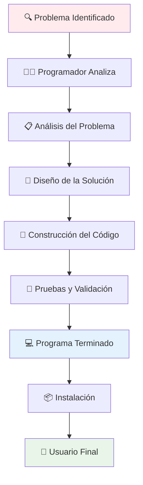
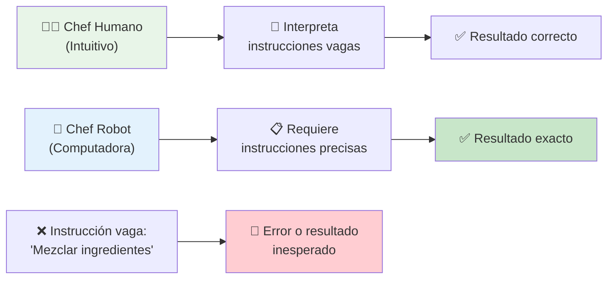
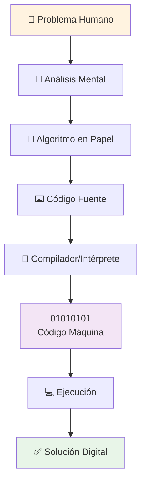

# Conceptos Fundamentales de Programación 💻

> [!info]+ **¿Qué es la Programación?** La **programación** es el proceso de proporcionar instrucciones claras y precisas a una computadora para que realice tareas específicas. Es el puente entre un problema del mundo real y una solución computacional.
> 
> 🎯 **Objetivo**: Traducir problemas humanos en soluciones digitales 🌍 **Aplicabilidad**: Arte, humanidades, ciencias sociales, ingeniería, medicina, y más ⚡ **Esencia**: Convertir ideas en realidad digital

## El Proceso de Resolución de Problemas 🔄

> [!tip]+ **Metodología del Programador**
> 
> ### 🎯 Flujo de Trabajo Completo
> 
> |Etapa|Descripción|Actor Principal|
> |---|---|---|
> |**1. 🔍 Problema**|Cliente identifica necesidad|👤 Cliente/Usuario|
> |**2. 👨‍💻 Análisis**|Comprensión profunda del problema|🧑‍💻 Programador|
> |**3. 🎨 Diseño**|Planificación de la solución|🧑‍💻 Programador|
> |**4. 🔧 Construcción**|Desarrollo del código|🧑‍💻 Programador|
> |**5. ✅ Solución**|Programa funcional|💻 Software|
> |**6. 🚀 Implementación**|Uso por parte del cliente|👤 Usuario Final|



## Fundamentos Teóricos 📚

> [!note]+ **Elementos Clave de la Programación**
> 
> ### 🧩 Componentes Fundamentales
> 
> **🔤 Código Fuente**
> 
> - Texto escrito por programadores
> - Sigue reglas gramaticales (sintaxis) del lenguaje
> - Legible por humanos
> 
> **🔄 Algoritmo**
> 
> - Secuencia finita y ordenada de pasos
> - Instrucciones bien definidas
> - Solución a un problema específico
> 
> **⚙️ Compilación/Interpretación**
> 
> - Traducción de código humano a código máquina
> - Proceso que permite la ejecución
> - Puente entre programador y computadora

## La Analogía del Chef Literal 👨‍🍳

> [!example]+ **Comprensión Imaginativa**
> 
> ### 🍳 La Metáfora Perfecta
> 
> Imagina que programar es como **escribir una receta para un chef extremadamente literal** que solo entiende instrucciones precisas:
> 
> #### ❌ Instrucción Vaga
> 
> ```
> "Mezclar ingredientes"
> ```
> 
> **Problema**: ¿Qué ingredientes? ¿Cómo mezclar? ¿Por cuánto tiempo?
> 
> #### ✅ Instrucción Precisa (Como código)
> 
> ```
> 1. Toma exactamente 200g de harina
> 2. Vierte 100ml de agua
> 3. Mezcla con cuchara de madera
> 4. Mueve en círculos por 30 segundos
> 5. Detente cuando la mezcla esté uniforme
> ```
> 
> **🎯 Lección**: La computadora, como ese chef, no adivina. Solo sigue tus pasos exactos.



## Del Problema a la Solución Digital 🔄

> [!success]+ **El Proceso de Traducción**
> 
> ### 🌉 Construyendo el Puente Digital
> 
> La programación actúa como **traductor universal** entre:
> 
> - 🧠 **Pensamiento humano** → Lógica estructurada
> - 📝 **Ideas abstractas** → Algoritmos concretos
> - 💭 **Problemas reales** → Soluciones digitales
> - 🎯 **Objetivos complejos** → Tareas automatizadas



## Beneficios y Habilidades Desarrolladas 🎯

> [!tip]+ **¿Por qué Aprender a Programar?**
> 
> ### 🧠 Desarrollo Mental
> 
> - **🔍 Pensamiento lógico**: Estructura mental para resolver problemas
> - **🧩 Descomposición**: Dividir problemas complejos en partes manejables
> - **🔄 Pensamiento algorítmico**: Secuencias ordenadas de solución
> - **🎯 Precisión**: Atención al detalle y exactitud
> 
> ### 🚀 Aplicaciones Prácticas
> 
> |Campo|Aplicación|Ejemplo Concreto|
> |---|---|---|
> |🎨 **Arte**|Arte generativo|Crear patrones y visualizaciones|
> |📊 **Ciencias**|Análisis de datos|Procesar experimentos|
> |💼 **Negocios**|Automatización|Reportes automáticos|
> |🏥 **Medicina**|Diagnóstico|Sistemas de ayuda médica|
> |📚 **Educación**|Herramientas|Plataformas de aprendizaje|

## Ambiente de Desarrollo 🛠️

> [!info]+ **Herramientas del Programador**
> 
> ### 🏗️ Ecosistema de Desarrollo
> 
> ```mermaid
> graph TD
>    A["👨‍💻 Programador"] --> B["🖥️ Ambiente de Desarrollo"]
>    
>    B --> C["📝 Editor de Código"]
>    B --> D["🔧 Compilador/Intérprete"]
>    
>    C --> E["📄 Código Fuente"]
>    E --> F["💻 Lenguaje de Programación"]
>    
>    D --> G["⚙️ Proceso de Compilación"]
>    G --> H["📦 Código Ejecutable"]
>    
>    H --> I["📲 Instalación"]
>    I --> J["👤 Usuario Final"]
>    
>    style A fill:#e3f2fd
>    style J fill:#e8f5e8
>    style H fill:#fff3e0
> ```

## Lenguajes de Programación 🌐

> [!note]+ **Del Humano a la Máquina**
> 
> ### 🔄 Proceso de Traducción
> 
> **Entrada**: Problema humano
> 
> ```
> 💭 "Quiero calcular el promedio de mis calificaciones"
> ```
> 
> **Proceso**: Instrucciones en lenguaje de programación
> 
> ```python
> # Python (Lenguaje de alto nivel)
> calificaciones = [85, 92, 78, 96, 88]
> promedio = sum(calificaciones) / len(calificaciones)
> print(f"Tu promedio es: {promedio}")
> ```
> 
> **Salida**: Código máquina (invisible al usuario)
> 
> ```
> 10001001
> 11110000  
> 10000001
> 00000111
> ```
> 
> **Resultado**: Solución digital funcional
> 
> ```
> Tu promedio es: 87.8
> ```

## Ejemplos de Aplicación Práctica 🎯

> [!example]+ **Casos de Uso Reales**
> 
> ### 🔧 Automatización de Tareas
> 
> **Problema**: Organizar cientos de fotos por fecha **Solución programática**:
> 
> ```python
> # Script Python para organizar archivos
> import os
> import shutil
> from datetime import datetime
> 
> # Organizar fotos por fecha automáticamente
> def organizar_fotos():
>    for archivo in os.listdir("fotos/"):
>        fecha = datetime.fromtimestamp(os.path.getctime(archivo))
>        carpeta = f"fotos_{fecha.year}_{fecha.month}"
>        if not os.path.exists(carpeta):
>            os.makedirs(carpeta)
>        shutil.move(archivo, carpeta)
> ```
> 
> **Beneficio**: De 3 horas manual a 3 segundos automático ⚡
> 
> ### 📊 Herramientas Personalizadas
> 
> **Problema**: Controlar gastos personales **Solución programática**:
> 
> ```python
> # Calculadora de presupuesto personal
> gastos = []
> ingresos = []
> 
> def agregar_gasto(cantidad, categoria):
>    gastos.append({"cantidad": cantidad, "categoria": categoria})
> 
> def calcular_balance():
>    total_ingresos = sum(ingresos)
>    total_gastos = sum([g["cantidad"] for g in gastos])
>    return total_ingresos - total_gastos
> ```

## Técnicas de Estudio Eficaces 🎓

> [!tip]+ **Metodología CÓDIGO para Aprender Programación**
> 
> ### 🔤 Mnemotecnia "CÓDIGO"
> 
> - **C**omenzar con problemas simples
> - **Ó**rden: seguir una secuencia lógica de aprendizaje
> - **D**ividir: descomponer problemas grandes
> - **I**terar: practicar constantemente
> - **G**rupo: aprender en comunidad
> - **O**rganizar: documentar tu progreso

> [!warning]+ **Errores Comunes de Principiantes**
> 
> - ❌ Querer resolver problemas complejos desde el inicio
> - ❌ No practicar la descomposición de problemas
> - ❌ Ignorar la importancia de la sintaxis precisa
> - ❌ No planificar antes de programar
> - ❌ Desanimarse por errores (son parte del proceso)

## Pensamiento Computacional 🧠

> [!success]+ **Las 4 Pilares del Pensamiento Computacional**
> 
> ### 🏛️ Fundamentos Mentales
> 
> |Pilar|Descripción|Ejemplo Cotidiano|
> |---|---|---|
> |🔍 **Descomposición**|Dividir problema grande en partes|Limpiar casa → habitación por habitación|
> |🎯 **Reconocimiento de Patrones**|Identificar similitudes|Todos los lunes hay tráfico|
> |🎨 **Abstracción**|Enfocarse en lo esencial|Mapa del metro (solo rutas importantes)|
> |📋 **Algoritmos**|Secuencia de pasos|Receta de cocina paso a paso|

## Referencias 📚

> [!quote]+ **Enlaces a Notas Relacionadas**
> 
> - [[Módulo 1.2 Introducción a Python]] - Primer lenguaje recomendado
> - [[Algoritmos y Estructuras de Datos]] - Fundamentos lógicos
> - [[Lógica de Programación]] - Pensamiento estructurado
> - [[Metodologías de Desarrollo]] - Procesos de creación de software
> - [[Resolución de Problemas]] - Técnicas de análisis
> - [[Herramientas de Desarrollo]] - IDEs y editores

## Notas Recomendadas para Complementar 📖

> [!info]+ **Ruta de Aprendizaje Progresiva**
> 
> ### 📋 Prerrequisitos Mentales
> 
> - [[Pensamiento Lógico]] - Base fundamental
> - [[Matemáticas Básicas]] - Operaciones y lógica
> - [[Resolución de Problemas]] - Metodologías de análisis
> 
> ### 🎯 Primeros Pasos Técnicos
> 
> - [[Módulo 2.1 Variables y Tipos de Datos]] - Almacenamiento de información
> - [[Módulo 4.1 Condicional]] - Decisiones y repeticiones
> - [[Módulo 3.1 Funciones]] - Modularización de código
> - [[Debugging]] - Encontrar y corregir errores
> 
> ### 🚀 Desarrollo Avanzado
> 
> - [[Estructuras de Datos]] - Organización eficiente
> - [[Algoritmos Fundamentales]] - Soluciones optimizadas
> - [[Programación Orientada a Objetos]] - Modelado del mundo real
> - [[Bases de Datos]] - Gestión de información

> [!success]+ **Proyecto Práctico: Tu Primer Programa**
> 
> ### 🎯 Organizador de Tareas Diarias
> 
> ```python
> # mi_organizador.py - Tu primer programa útil
> 
> print("=== 📋 Organizador de Tareas Diarias ===")
> 
> tareas = []
> 
> def agregar_tarea():
>    tarea = input("📝 Nueva tarea: ")
>    prioridad = input("⭐ Prioridad (alta/media/baja): ")
>    tareas.append({"tarea": tarea, "prioridad": prioridad, "completada": False})
>    print(f"✅ Tarea '{tarea}' agregada con prioridad {prioridad}")
> 
> def mostrar_tareas():
>    print("\n📋 TUS TAREAS:")
>    for i, tarea in enumerate(tareas, 1):
>        estado = "✅" if tarea["completada"] else "⏳"
>        print(f"{i}. {estado} {tarea['tarea']} (Prioridad: {tarea['prioridad']})")
> 
> # Uso del programa
> while True:
>    accion = input("\n¿Qué quieres hacer? (agregar/ver/salir): ")
>    
>    if accion == "agregar":
>        agregar_tarea()
>    elif accion == "ver":
>        mostrar_tareas()
>    elif accion == "salir":
>        print("👋 ¡Hasta luego! Programa creado por ti.")
>        break
> ```
> 
> **🎯 Aprendizajes**: Variables, listas, funciones, loops, interacción con usuario

---

**Tags**: #programación #fundamentos #algoritmos #pensamiento-computacional #resolución-problemas #desarrollo-software #lógica #automatización #código-fuente #lenguajes-programación