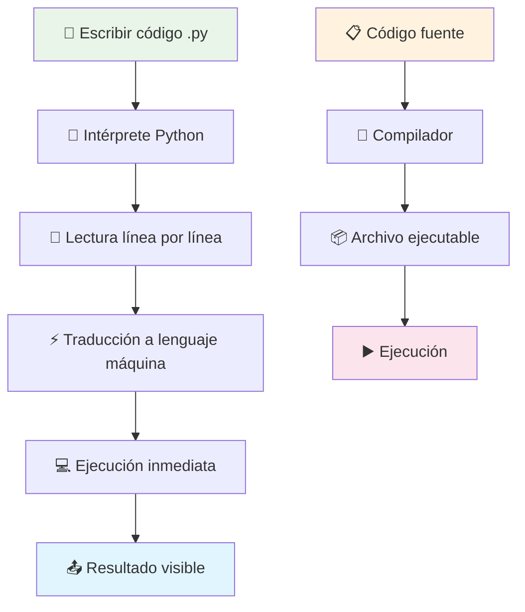
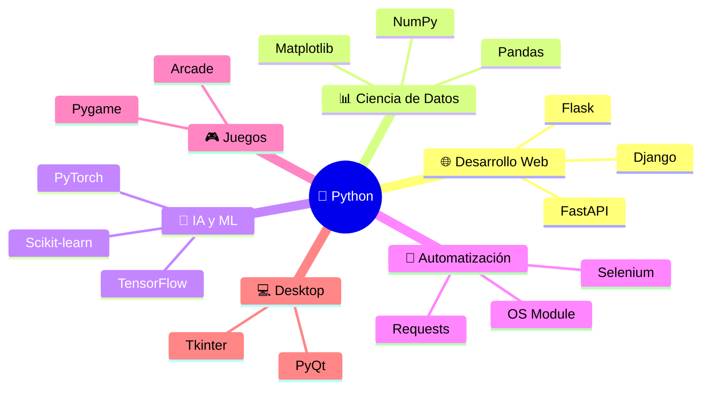

# Introducción a Python 🐍

> [!info]+ **¿Qué es Python?** **Python** es un lenguaje de programación de alto nivel, interpretado y de propósito general, ampliamente recomendado para iniciarse en la programación debido a su **sintaxis clara y legible** que se asemeja al lenguaje natural.
> 
> 🎯 **Filosofía**: "Simple es mejor que complejo" - El Zen de Python 📅 **Creado**: 1991 por Guido van Rossum 🌍 **Comunidad**: Una de las más grandes y activas en programación

## Características Fundamentales 🔍

> [!tip]+ **Lenguaje Interpretado vs Compilado**
> 
> ### 🔄 Proceso de Interpretación
> 
> Python es un **lenguaje interpretado**, lo que significa que:
> 
> - No requiere compilación previa
> - El código se ejecuta línea por línea en tiempo real
> - Permite experimentación y depuración inmediata
> 
> ### Comparación
> 
> |Aspecto|🐍 Interpretado (Python)|⚡ Compilado (C++)|
> |---|---|---|
> |**Proceso**|Intérprete → Ejecución directa|Compilador → Ejecutable → Ejecución|
> |**Velocidad desarrollo**|✅ Rápida|❌ Más lenta|
> |**Velocidad ejecución**|❌ Más lenta|✅ Más rápida|
> |**Portabilidad**|✅ Alta|❌ Limitada|
> |**Depuración**|✅ Inmediata|❌ Requiere recompilación|

## Primeros Pasos 🚀

> [!example]+ **Configuración Inicial**
> 
> ### 1. 📥 Instalación
> 
> ```bash
> # Descargar desde python.org
> python --version  # Verificar instalación
> ```
> 
> ### 2. 📝 Crear tu primer programa
> 
> ```python
> # mi_primer_programa.py
> print("¡Hola, mundo desde Python!")
> ```
> 
> ### 3. ▶️ Ejecutar el código
> 
> ```bash
> python mi_primer_programa.py
> ```



## Analogía del Traductor Simultáneo 🗣️

> [!note]+ **Comprensión Visual**
> 
> ### 🌟 La Metáfora Perfecta
> 
> Imagina Python como un **traductor simultáneo** entre tú y tu computadora:
> 
> - **🔄 Lenguaje Interpretado**: Como hablar frase por frase a un traductor
>     
> - Tú: "Imprime 'Hola'"
>     
> - Traductor (Python): Inmediatamente se lo dice a la computadora
>     
> - Computadora: "Hola"
>     
> - **📚 Lenguaje Compilado**: Como escribir un libro completo
>     
> - Escribes todo el documento
>     
> - Lo entregas al traductor para traducción completa
>     
> - Recibes el libro traducido para usar
>     

## Sintaxis Básica y Ejemplos 💻

> [!example]+ **Comandos Fundamentales**
> 
> ### 📢 Mostrar Información
> 
> ```python
> # Imprimir mensajes
> print("¡Hola, mundo desde Python!")
> print("Python es increíble")
> ```
> 
> ### 🏷️ Variables y Datos
> 
> ```python
> # Asignación de variables (dinámico)
> mi_nombre = "Carlos"
> mi_edad = 25
> mi_altura = 1.75
> 
> # Mostrar variables
> print(mi_nombre)
> print(f"Mi edad es {mi_edad} años")
> ```
> 
> ### 🧮 Operaciones Básicas
> 
> ```python
> # Matemáticas simples
> resultado = 2 + 3
> print(f"2 + 3 = {resultado}")
> 
> # Texto (strings)
> saludo = "Hola" + " " + "mundo"
> print(saludo)
> ```

## Ventajas y Aplicaciones 🌟

> [!success]+ **¿Por qué elegir Python?**
> 
> ### ✅ Ventajas Clave
> 
> - **🔤 Sintaxis clara**: Fácil de leer y escribir
> - **🚀 Aprendizaje rápido**: Curva de aprendizaje suave
> - **🌐 Multiplataforma**: Windows, Mac, Linux
> - **📚 Comunidad activa**: Abundante documentación y ayuda
> - **🔧 Versatilidad**: Desde web hasta IA
> 
> ### 🎯 Campos de Aplicación
> 
> |Campo|Descripción|Librerías Populares|
> |---|---|---|
> |🌐 **Web**|Sitios web y APIs|Django, Flask|
> |📊 **Datos**|Análisis y visualización|Pandas, Matplotlib|
> |🤖 **IA/ML**|Inteligencia artificial|TensorFlow, PyTorch|
> |🔧 **Automatización**|Scripts y tareas|Selenium, BeautifulSoup|
> |🎮 **Juegos**|Desarrollo de videojuegos|Pygame|



## Técnicas de Estudio Eficaces 🎓

> [!tip]+ **Método PRACTICA para Python**
> 
> ### 🔤 Mnemotecnia "PRACTICA"
> 
> - **P**rogramar diariamente (práctica constante)
> - **R**esolver problemas pequeños primero
> - **A**nalizar código de otros
> - **C**omenzar con proyectos simples
> - **T**ipos de datos: dominar strings, números, listas
> - **I**nteractuar con la comunidad
> - **C**comentar tu código siempre
> - **A**plicar lo aprendido en proyectos reales

> [!warning]+ **Errores Comunes de Principiantes**
> 
> - ❌ No practicar regularmente
> - ❌ Saltar fundamentos por ir a temas avanzados
> - ❌ No leer mensajes de error con atención
> - ❌ Copiar código sin entender
> - ❌ No usar nombres descriptivos para variables

## Comparación con Otros Lenguajes 📊

> [!info]+ **Python vs Otros Lenguajes para Principiantes**
> 
> |Lenguaje|🎯 Facilidad|⚡ Velocidad|🔧 Versatilidad|👥 Comunidad|
> |---|---|---|---|---|
> |**🐍 Python**|⭐⭐⭐⭐⭐|⭐⭐⭐|⭐⭐⭐⭐⭐|⭐⭐⭐⭐⭐|
> |**☕ Java**|⭐⭐⭐|⭐⭐⭐⭐|⭐⭐⭐⭐|⭐⭐⭐⭐|
> |**🔧 C++**|⭐⭐|⭐⭐⭐⭐⭐|⭐⭐⭐⭐|⭐⭐⭐|
> |**💎 JavaScript**|⭐⭐⭐⭐|⭐⭐⭐|⭐⭐⭐|⭐⭐⭐⭐|

## Referencias 📚

> [!quote]+ **Enlaces a Notas Relacionadas**
> 
> - [[Módulo 2.1 Variables y Tipos de Datos]] - Fundamentos de almacenamiento
> - [[Módulo 4.1 Condicional]] - If, loops, funciones
> - [[Módulo 3.1 Funciones]] - Modularización del código
> - [[Librerías Estándar]] - Herramientas incluidas
> - [[Entornos de Desarrollo]] - IDEs y editores
> - [[Debugging y Testing]] - Técnicas de depuración

## Notas Recomendadas para Complementar 📖

> [!info]+ **Ruta de Aprendizaje Sugerida**
> 
> ### 📋 Prerrequisitos
> 
> - [[Fundamentos de Programación]] - Conceptos básicos
> - [[Lógica de Programación]] - Pensamiento algorítmico
> - [[Sistemas Operativos Básicos]] - Manejo de terminal
> 
> ### 🎯 Siguientes Pasos
> 
> - [[Estructuras de Datos en Python]] - Listas, diccionarios, sets
> - [[Programación Orientada a Objetos]] - Classes y objetos
> - [[Manejo de Archivos]] - Lectura y escritura
> - [[APIs y Requests]] - Comunicación con servicios web
> - [[Bases de Datos con Python]] - SQLite, PostgreSQL

> [!success]+ **Proyecto Práctico Sugerido**
> 
> ### 🎯 Tu Primera Aplicación: Calculadora Personal
> 
> ```python
> # calculadora_simple.py
> print("=== Mi Primera Calculadora ===")
> numero1 = float(input("Primer número: "))
> numero2 = float(input("Segundo número: "))
> operacion = input("Operación (+, -, *, /): ")
> 
> if operacion == "+":
>    resultado = numero1 + numero2
> elif operacion == "-":
>    resultado = numero1 - numero2
> elif operacion == "*":
>    resultado = numero1 * numero2
> elif operacion == "/":
>    resultado = numero1 / numero2 if numero2 != 0 else "Error: División por cero"
> 
> print(f"Resultado: {resultado}")
> ```

---

**Tags**: #python #programación #lenguajes-interpretados #principiantes #sintaxis #desarrollo #código #aprendizaje #programación-básica #versatilidad