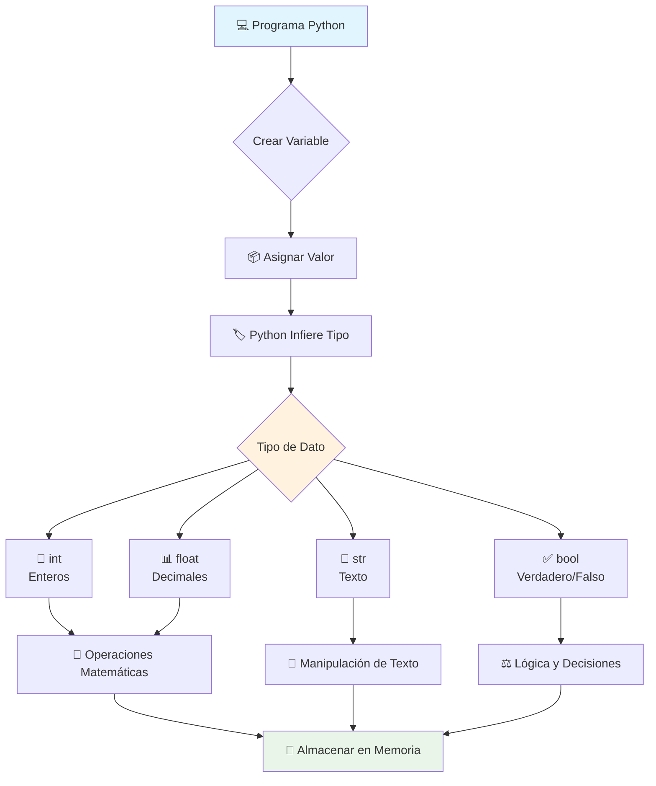

# Variables y Tipos de Datos en Python 📦🔢

> [!info] 📍 Contexto y Definición Las **variables** son los contenedores fundamentales de información en programación:
> 
> - 📦 **Variable**: Espacio reservado en memoria con un nombre identificativo
> - 🏷️ **Tipos de Datos**: Clasificación que define qué valores puede contener y qué operaciones permite
> - 🎯 **Tipado Dinámico**: Python determina automáticamente el tipo según el valor asignado
> - 🔄 **Mutabilidad**: Las variables pueden cambiar su valor y tipo durante la ejecución
> - 🧠 Base conceptual para todo programa - sin variables no hay datos que procesar

## 📦 Concepto de Variable

> [!tip] 💡 ¿Qué es una Variable?
> 
> Una variable es como una **caja etiquetada** en el almacén de memoria de tu computadora:
> 
> ```python
> # Sintaxis: nombre_variable = valor
> edad = 25                    # Caja "edad" contiene 25
> nombre = "Ana"               # Caja "nombre" contiene "Ana"  
> activo = True                # Caja "activo" contiene True
> ```
> 
> ### 🏷️ Reglas para Nombres de Variables
> 
> |✅ Permitido|❌ No Permitido|Ejemplo|
> |---|---|---|
> |Letras (a-z, A-Z)|Empezar con número|`mi_variable` ✅|
> |Números (0-9)|Espacios|`2variable` ❌|
> |Guión bajo (_)|Caracteres especiales|`mi variable` ❌|
> |Case sensitive|Palabras reservadas|`class` ❌|

## 🔢 Tipos de Datos Fundamentales

> [!success] 🎯 Los Cuatro Tipos Básicos
> 
> Python maneja cuatro tipos de datos primitivos principales:

### 🔢 Números Enteros (`int`)

> [!note] 🧮 Enteros - Números sin Decimales
> 
> |Característica|Descripción|Ejemplo|
> |---|---|---|
> |**Rango**|Ilimitado (limitado por memoria)|`42`, `-17`, `1000000`|
> |**Operaciones**|Aritméticas básicas|`+`, `-`, `*`, `//`, `%`, `**`|
> |**Uso común**|Contadores, índices, cantidades|`edad = 25`|
> 
> ```python
> # Ejemplos de enteros
> cantidad_productos = 150
> temperatura_celsius = -5  
> poblacion_mundial = 7800000000
> 
> print(type(cantidad_productos))  # <class 'int'>
> ```

### 🔢 Números Flotantes (`float`)

> [!note] 📊 Flotantes - Números con Decimales
> 
> |Característica|Descripción|Ejemplo|
> |---|---|---|
> |**Precisión**|~15-17 dígitos significativos|`3.14159`, `0.000001`|
> |**Notación**|Decimal y científica|`1.5`, `1.2e-4`|
> |**Uso común**|Precios, medidas, cálculos|`precio = 29.99`|
> 
> ```python
> # Ejemplos de flotantes
> pi = 3.14159
> precio_gasolina = 1.45
> velocidad_luz = 2.99792458e8  # Notación científica
> 
> print(type(pi))  # <class 'float'>
> ```

### 📝 Cadenas de Texto (`str`)

> [!note] 📜 Strings - Secuencias de Caracteres
> 
> |Delimitador|Uso|Ejemplo|
> |---|---|---|
> |`"..."`|Comillas dobles|`"Hola mundo"`|
> |`'...'`|Comillas simples|`'Python'`|
> |`"""..."""`|Triple comillas|`"""Texto multilínea"""`|
> |`r"..."`|Raw strings|`r"C:\Users\path"`|
> 
> ```python
> # Ejemplos de strings
> nombre = "María García"
> mensaje = 'Bienvenido a Python'
> direccion = r"C:\Users\Ana\Documents"
> 
> # Strings multilínea
> poema = """
> Roses are red,
> Violets are blue,
> Python is awesome,
> And so are you!
> """
> 
> print(type(nombre))  # <class 'str'>
> ```

### ✅ Valores Booleanos (`bool`)

> [!note] ⚖️ Booleanos - Verdadero o Falso
> 
> |Valor|Significado|Contexto|
> |---|---|---|
> |`True`|Verdadero|Condiciones cumplidas|
> |`False`|Falso|Condiciones no cumplidas|
> 
> ```python
> # Ejemplos de booleanos
> usuario_activo = True
> es_mayor_edad = False
> tiene_descuento = True
> 
> # Resultado de comparaciones
> es_igual = (5 == 5)     # True
> es_mayor = (3 > 7)      # False
> 
> print(type(usuario_activo))  # <class 'bool'>
> ```

## 🔄 Asignación y Reasignación

> [!example] 🔄 Manejo Dinámico de Variables
> 
> ### ➡️ Asignación Simple
> 
> ```python
> # Asignación inicial
> contador = 0              # int
> nombre = "Python"         # str
> precio = 99.99           # float
> disponible = True        # bool
> ```
> 
> ### 🔄 Reasignación de Valores
> 
> ```python
> # La variable puede cambiar de valor
> contador = 0         # Inicialmente 0
> contador = contador + 1   # Ahora es 1
> contador += 1        # Ahora es 2 (operador de asignación)
> ```
> 
> ### 🎭 Cambio de Tipo (Tipado Dinámico)
> 
> ```python
> variable_flexible = 42        # int
> print(type(variable_flexible))  # <class 'int'>
> 
> variable_flexible = "Python"  # Ahora es str
> print(type(variable_flexible))  # <class 'str'>
> 
> variable_flexible = 3.14      # Ahora es float
> print(type(variable_flexible))  # <class 'float'>
> ```

## 🎨 Analogías del Mundo Real

> [!tip] 🏢 El Almacén de Oficina
> 
> Imagina tu programa como una **oficina con archivadores**:
> 
> ### 📁 Variable = Archivador Etiquetado
> 
> ```
> 🗃️ [EDAD] ────────────────► 📄 25
> 🗃️ [NOMBRE] ──────────────► 📄 "Ana García"  
> 🗃️ [PRECIO] ──────────────► 📄 49.99
> 🗃️ [ACTIVO] ──────────────► 📄 True
> ```
> 
> ### 🔄 Cambio de Contenido
> 
> - **Reasignación**: Cambias el papel dentro del archivador
> - **Cambio de tipo**: Cambias de papel a foto, de número a texto
> - **Acceso**: Abres el archivador para leer su contenido
> 
> ### 🏷️ Sistema de Etiquetado
> 
> - **Nombres claros**: `edad_usuario` mejor que `x`
> - **Sin espacios**: `nombre_completo` no `nombre completo`
> - **Descriptivos**: `precio_producto` mejor que `p`

## 🛠️ Función `type()` - Inspector de Tipos

> [!success] 🔍 Identificando Tipos en Runtime
> 
> ```python
> # Función type() revela el tipo de dato
> print(type(42))          # <class 'int'>
> print(type(3.14))        # <class 'float'>
> print(type("Hola"))      # <class 'str'>
> print(type(True))        # <class 'bool'>
> 
> # Con variables
> mi_variable = 100
> print(f"Variable: {mi_variable}, Tipo: {type(mi_variable)}")
> ```
> 
> |Comando|Resultado|Uso|
> |---|---|---|
> |`type(variable)`|Tipo exacto|Debugging, validación|
> |`isinstance(var, int)`|True/False|Verificación de tipo|
> |`str(type(var))`|Nombre como string|Logging, mensajes|

## 🎯 Patrones de Uso Común

> [!example] 🚀 Casos Prácticos del Mundo Real
> 
> ### 🛒 Sistema de Tienda Online
> 
> ```python
> # Información del producto
> nombre_producto = "Laptop Gamer"      # str - descripción
> precio = 1299.99                      # float - dinero
> stock_disponible = 15                 # int - cantidad
> en_oferta = True                     # bool - estado
> 
> # Información del cliente  
> nombre_cliente = "Carlos Mendez"      # str - identificación
> edad_cliente = 28                    # int - datos demográficos
> es_cliente_premium = False           # bool - categoría
> descuento_aplicable = 0.1            # float - porcentaje
> ```
> 
> ### 🎮 Sistema de Juego
> 
> ```python
> # Estado del jugador
> nombre_jugador = "DragonSlayer2024"   # str - nickname
> puntuacion = 15750                   # int - puntaje
> vida_actual = 85.5                   # float - porcentaje de vida
> tiene_power_up = True                # bool - estado especial
> nivel_actual = 7                     # int - progreso
> tiempo_restante = 120.3              # float - segundos
> ```
> 
> ### 📊 Análisis de Datos Científicos
> 
> ```python
> # Mediciones experimentales
> temperatura_muestra = 23.7           # float - grados Celsius
> numero_observaciones = 1000          # int - cantidad de datos
> experimento_exitoso = True           # bool - resultado
> fecha_experimento = "2024-08-06"     # str - timestamp
> ph_solucion = 7.4                    # float - acidez
> concentracion_ppm = 150              # int - partes por millón
> ```

## ⚠️ Errores Comunes y Mejores Prácticas

> [!warning] 🚨 Peligros a Evitar
> 
> ### ❌ Errores Frecuentes
> 
> ```python
> # 1. Nombres reservados
> # class = "MiClase"      # ❌ 'class' es palabra reservada
> mi_clase = "MiClase"     # ✅ Correcto
> 
> # 2. Empezar con número
> # 2variable = 10         # ❌ SyntaxError
> variable2 = 10           # ✅ Correcto
> 
> # 3. Espacios en nombres
> # mi variable = 5        # ❌ SyntaxError  
> mi_variable = 5          # ✅ Correcto
> 
> # 4. Caracteres especiales
> # variable-especial = 1  # ❌ SyntaxError
> variable_especial = 1    # ✅ Correcto
> ```
> 
> ### ✅ Buenas Prácticas
> 
> ```python
> # 1. Nombres descriptivos
> x = 25              # ❌ Poco claro
> edad_usuario = 25   # ✅ Descriptivo
> 
> # 2. Convención snake_case
> nombreCompleto = "Ana"    # ❌ camelCase (no es pythónico)
> nombre_completo = "Ana"   # ✅ snake_case (recomendado)
> 
> # 3. Constantes en MAYÚSCULAS
> pi = 3.14159        # ❌ Variable que parece constante
> PI = 3.14159        # ✅ Constante clara
> 
> # 4. Inicialización clara
> contador           # ❌ Variable no inicializada
> contador = 0       # ✅ Valor inicial explícito
> ```

## 🔄 Conversión entre Tipos

> [!note] 🎭 Casting - Cambio de Disfraz
> 
> ```python
> # Conversiones automáticas (implícitas)
> resultado = 5 + 2.0    # int + float = float (7.0)
> 
> # Conversiones manuales (explícitas)
> numero_texto = "123"
> numero_entero = int(numero_texto)      # str → int
> numero_flotante = float(numero_entero)  # int → float
> texto_resultado = str(numero_flotante) # float → str
> 
> print(f"Texto: {numero_texto} (tipo: {type(numero_texto)})")
> print(f"Entero: {numero_entero} (tipo: {type(numero_entero)})")
> print(f"Flotante: {numero_flotante} (tipo: {type(numero_flotante)})")
> ```



---

## 📚 Referencias

> [!quote] 🔗 Enlaces a Otras Notas
> 
> - [[Operaciones y Casting Python]] - Conversión entre tipos
> - [[Entrada de Datos Python]] - input() y variables
> - [[Condicionales Python]] - Uso de booleanos
> - [[Formateo de Strings Python]] - Manipulación avanzada de texto
> - [[Funciones Python]] - Variables como parámetros
> - [[Scope y Alcance Python]] - Visibilidad de variables

## 🎯 Notas Recomendadas para Complementar

> [!info] 📋 Prerrequisitos y Temas Relacionados
> 
> ### 🔧 **Prerrequisitos**
> 
> - [[Instalación Python y IDE]]
> - [[Conceptos Básicos Programación]]
> - [[Sintaxis Básica Python]]
> - [[Comentarios en Python]]
> 
> ### 🔄 **Temas Relacionados**
> 
> - [[Listas y Tuplas Python]] - Estructuras de datos complejas
> - [[Diccionarios Python]] - Mapeo clave-valor
> - [[Constantes en Python]] - Valores inmutables
> - [[Debugging Python]] - type() para depuración
> - [[Memory Management Python]] - Gestión de memoria
> - [[Naming Conventions Python]] - Estilo pythónico

## 🧠 Técnica de Estudio: V.A.R.I.A.B.L.E

> [!tip] 🎯 Mnemotecnia para Dominar Variables
> 
> ### 📦 **V.A.R.I.A.B.L.E** (Conceptos Clave)
> 
> **V** - **Value**: Todo empieza asignando un valor  
> **A** - **Assignment**: Operador `=` para asignar  
> **R** - **Reassignment**: Se puede cambiar el valor  
> **I** - **Inference**: Python infiere el tipo automáticamente  
> **A** - **Access**: Se accede por el nombre de la variable  
> **B** - **Behavior**: Cada tipo tiene comportamientos únicos  
> **L** - **Lifetime**: Las variables viven mientras el programa corre  
> **E** - **Evolution**: Pueden cambiar de tipo dinámicamente
> 
> ### 🎭 Método de los "4 Personajes"
> 
> #### 🔢 **El Contador** (int)
> 
> - **Personalidad**: Exacto, sin decimales, matemático
> - **Frase**: "¡Solo números enteros, nada de medias tintas!"
> - **Casos**: `edad = 25`, `cantidad = 100`, `nivel = 7`
> 
> #### 📊 **El Preciso** (float)
> 
> - **Personalidad**: Detallista, exacto hasta el decimal
> - **Frase**: "La precisión es mi segundo nombre"
> - **Casos**: `precio = 19.99`, `temperatura = 36.5`, `pi = 3.14159`
> 
> #### 📝 **El Narrador** (str)
> 
> - **Personalidad**: Comunicativo, expresivo, entre comillas
> - **Frase**: "Las palabras son mi poder"
> - **Casos**: `nombre = "Ana"`, `mensaje = "Hola"`, `email = "user@mail.com"`
> 
> #### ⚖️ **El Decisor** (bool)
> 
> - **Personalidad**: Binario, solo ve blanco o negro
> - **Frase**: "¿Es verdad o mentira? No hay término medio"
> - **Casos**: `activo = True`, `mayor_edad = False`, `disponible = True`
> 
> ### 📚 Plan de Estudio de 14 Días
> 
> #### **Semana 1: Fundamentos (Días 1-7)**
> 
> - **Día 1**: Concepto de variable y asignación básica
> - **Día 2**: Tipos int y float, operaciones básicas
> - **Día 3**: Strings y métodos básicos
> - **Día 4**: Booleanos y lógica simple
> - **Día 5**: Función type() y verificación de tipos
> - **Día 6**: Reasignación y tipado dinámico
> - **Día 7**: Revisión y mini-proyecto integrador
> 
> #### **Semana 2: Aplicación (Días 8-14)**
> 
> - **Día 8**: Naming conventions y buenas prácticas
> - **Día 9**: Conversión entre tipos (casting básico)
> - **Día 10**: Casos de uso del mundo real
> - **Día 11**: Debugging con variables y type()
> - **Día 12**: Errores comunes y cómo evitarlos
> - **Día 13**: Proyecto: Sistema de inventario simple
> - **Día 14**: Evaluación final y preparación para temas avanzados
> 
> ### 🎲 Juego de Memoria: "Adivina el Tipo"
> 
> Práctica diaria (5 minutos):
> 
> ```python
> # Mira el valor y adivina el tipo ANTES de ejecutar
> mystery1 = 42        # ¿int, float, str, bool?
> mystery2 = "42"      # ¿int, float, str, bool?  
> mystery3 = 42.0      # ¿int, float, str, bool?
> mystery4 = True      # ¿int, float, str, bool?
> 
> # Después verifica con type()
> print(type(mystery1))  # <class 'int'>
> ```
> 
> ### 🔄 Técnica de Repaso: "Círculo de Tipos"
> 
> ```
>     📝 STRING
>      ↙️    ↘️
> ✅ BOOL ⟷ 🔢 INT  
>      ↖️    ↗️
>     📊 FLOAT
> ```
> 
> **Rotación diaria**: Enfócate en un tipo diferente cada día, completando el círculo cada 4 días.

---

**Tags:** #python #variables #tipos-datos #int #float #str #bool #asignacion #memoria #tipado-dinamico #casting #type #programacion #fundamental #sintaxis #buenas-practicas