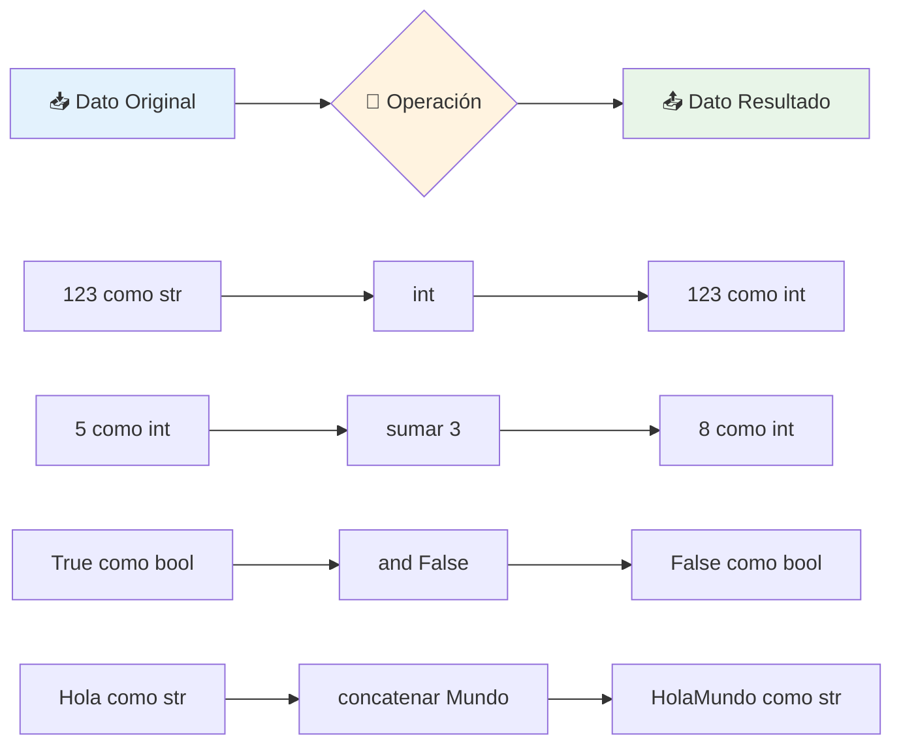

# Operaciones con Tipos de Datos en Python 🔄⚡

> [!info] 📍 Contexto y Definición Las **operaciones** son el núcleo dinámico de la programación - transforman datos estáticos en información útil:
> 
> - 🔄 **Conversión de tipos** (Casting) - Cambiar la naturaleza de los datos
> - 🧮 **Operaciones numéricas** - Cálculos matemáticos y lógicos
> - ⚖️ **Comparaciones booleanas** - Toma de decisiones
> - 📝 **Manipulación de strings** - Procesamiento de texto
> - 🎯 Base fundamental para construir cualquier lógica de programación

## 🔄 Conversión entre Tipos (Casting)

> [!tip] 🎭 Transformación de Datos
> 
> El **casting** permite cambiar el "disfraz" de los datos para usar sus capacidades específicas:
> 
> |Función|De → A|Comportamiento|Ejemplo|Resultado|
> |---|---|---|---|---|
> |`int()`|Cualquier → Entero|Trunca decimales|`int(19.99)`|`19`|
> |`float()`|Cualquier → Flotante|Añade decimales|`float(5)`|`5.0`|
> |`str()`|Cualquier → Texto|Representa como string|`str(25)`|`"25"`|
> |`bool()`|Cualquier → Booleano|Evalúa "veracidad"|`bool("")`|`False`|

### 🚨 Valores que se Convierten a `False`

> [!warning] ⚠️ Valores "Falsy" en Python
> 
> ```python
> # Estos valores se consideran False
> bool(0)         # False - Número cero
> bool("")        # False - String vacío
> bool([])        # False - Lista vacía
> bool({})        # False - Diccionario vacío  
> bool(None)      # False - Valor None
> 
> # TODO lo demás es True
> bool(1)         # True
> bool("Hola")    # True
> bool([1, 2])    # True
> ```

## 🧮 Operaciones Numéricas

> [!success] ⚡ Operadores Aritméticos
> 
> |Operador|Nombre|Ejemplo|Resultado|Tipo Resultado|
> |---|---|---|---|---|
> |`+`|Suma|`10 + 3`|`13`|Mismo tipo|
> |`-`|Resta|`10 - 3`|`7`|Mismo tipo|
> |`*`|Multiplicación|`10 * 3`|`30`|Mismo tipo|
> |`/`|División|`10 / 3`|`3.333...`|**Siempre float**|
> |`//`|División Entera|`10 // 3`|`3`|Tipo entero|
> |`%`|Módulo (Resto)|`10 % 3`|`1`|Mismo tipo|
> |`**`|Exponenciación|`10 ** 3`|`1000`|Puede cambiar tipo|

### 📐 Orden de Operaciones: P.E.M.D.A.S

> [!note] 🔢 Prioridad Matemática
> 
> ```python
> # Ejemplo de precedencia
> resultado = 2 + 3 * 4 ** 2 - 1
> #           2 + 3 * 16    - 1    (** primero)
> #           2 + 48        - 1    (* segundo)  
> #           50            - 1    (+ tercero)
> #           49                   (- último)
> 
> # Con paréntesis para claridad
> resultado = 2 + (3 * (4 ** 2)) - 1  # = 49
> ```
> 
> **P**aréntesis → **E**xponentes → **M**ultiplicación/**D**ivisión → **A**dición/**S**ustracción

## ⚖️ Operaciones Booleanas

> [!question] 🧠 Lógica y Comparaciones
> 
> ### 🔗 Operadores Lógicos
> 
> |Operador|Descripción|Ejemplo|Resultado|
> |---|---|---|---|
> |`and`|Ambos verdaderos|`True and False`|`False`|
> |`or`|Al menos uno verdadero|`True or False`|`True`|
> |`not`|Invierte el valor|`not True`|`False`|
> 
> ### 📊 Operadores de Comparación
> 
> |Operador|Descripción|Ejemplo|Resultado|
> |---|---|---|---|
> |`==`|Igual a|`5 == 5`|`True`|
> |`!=`|Diferente de|`5 != 3`|`True`|
> |`>`|Mayor que|`5 > 3`|`True`|
> |`<`|Menor que|`3 < 5`|`True`|
> |`>=`|Mayor o igual|`5 >= 5`|`True`|
> |`<=`|Menor o igual|`3 <= 5`|`True`|

### 🎯 Tabla de Verdad Completa

> [!tip] 📋 Referencia Rápida
> 
> |A|B|A and B|A or B|not A|
> |---|---|---|---|---|
> |`True`|`True`|`True`|`True`|`False`|
> |`True`|`False`|`False`|`True`|`False`|
> |`False`|`True`|`False`|`True`|`True`|
> |`False`|`False`|`False`|`False`|`True`|

## 📝 Operaciones con Strings

> [!example] 🎨 Manipulación de Texto
> 
> ### ➕ Operaciones Básicas
> 
> |Operación|Símbolo|Ejemplo|Resultado|
> |---|---|---|---|
> |**Concatenación**|`+`|`"Hola" + " Mundo"`|`"Hola Mundo"`|
> |**Repetición**|`*`|`"Ja" * 3`|`"JaJaJa"`|
> |**Pertenencia**|`in`|`"la" in "Hola"`|`True`|
> |**Longitud**|`len()`|`len("Python")`|`6`|
> |**Indexación**|`[i]`|`"Python"[0]`|`"P"`|

### 🛠️ Métodos de Transformación

> [!success] 🔧 Métodos Esenciales de String
> 
> |Método|Función|Ejemplo|Resultado|
> |---|---|---|---|
> |`upper()`|A MAYÚSCULAS|`"hola".upper()`|`"HOLA"`|
> |`lower()`|a minúsculas|`"HOLA".lower()`|`"hola"`|
> |`capitalize()`|Primera mayúscula|`"hola mundo".capitalize()`|`"Hola mundo"`|
> |`title()`|Título (cada palabra)|`"hola mundo".title()`|`"Hola Mundo"`|
> |`strip()`|Quita espacios|`" hola ".strip()`|`"hola"`|

### 🔍 Métodos de Búsqueda y División

> [!note] 📍 Localización y Separación
> 
> |Método|Propósito|Ejemplo|Resultado|
> |---|---|---|---|
> |`find(sub)`|Busca posición|`"Python".find("th")`|`2`|
> |`count(sub)`|Cuenta ocurrencias|`"banana".count("a")`|`3`|
> |`replace(old, new)`|Reemplaza texto|`"hola".replace("o", "0")`|`"h0la"`|
> |`split(sep)`|Divide en lista|`"a,b,c".split(",")`|`["a", "b", "c"]`|

## 🎨 Analogías Culinarias

> [!tip] 🍳 La Cocina de Datos
> 
> Imagina tus datos como **ingredientes** y las operaciones como **técnicas culinarias**:
> 
> ### 🥔 Casting = Preparación de Ingredientes
> 
> - **Pelar papas**: `int("5")` → Quitar la "cáscara" de string
> - **Triturar tomate**: `int(3.99)` → Eliminar partes no deseadas
> - **Derretir mantequilla**: `float(5)` → Cambiar consistencia
> 
> ### 🔥 Operaciones Numéricas = Cocción
> 
> - **Sumar ingredientes**: `2 papas + 3 zanahorias`
> - **Dividir porciones**: `pizza / 4 personas`
> - **Elevar temperatura**: `calor ** 2` (intensidad)
> 
> ### 🧂 Booleanos = Condimentos
> 
> - **Si hay sal Y pimienta**: `sal and pimienta`
> - **O papas O arroz**: `papas or arroz`
> - **NO muy salado**: `not muy_salado`
> 
> ### ✂️ Strings = Preparación de Texto
> 
> - **Cortar en pedazos**: `"a,b,c".split(",")`
> - **Quitar cáscaras**: `" texto ".strip()`
> - **Cambiar ingrediente**: `receta.replace("sal", "azúcar")`

## 🌊 Flujo de Transformación



## 💻 Ejemplos Prácticos del Mundo Real

> [!example] 🚀 Casos de Uso Avanzados
> 
> ### 💰 Calculadora de Propinas
> 
> ```python
> # Casting y operaciones numéricas
> cuenta_texto = input("Ingresa el total: $")  # "45.50"
> cuenta = float(cuenta_texto)                 # 45.5
> 
> porcentaje_propina = 18  # 18%
> propina = cuenta * (porcentaje_propina / 100)  # 8.19
> total = cuenta + propina                        # 53.69
> 
> print(f"Propina: ${propina:.2f}")
> print(f"Total: ${total:.2f}")
> ```
> 
> ### 📧 Validador de Email
> 
> ```python
> # Operaciones booleanas y strings
> email = "usuario@ejemplo.com"
> 
> # Validaciones básicas
> tiene_arroba = "@" in email
> tiene_punto = "." in email
> no_empieza_arroba = not email.startswith("@")
> no_termina_punto = not email.endswith(".")
> 
> # Validación completa
> es_valido = tiene_arroba and tiene_punto and no_empieza_arroba and no_termina_punto
> 
> if es_valido:
>     usuario, dominio = email.split("@")
>     print(f"Email válido - Usuario: {usuario}, Dominio: {dominio}")
> ```
> 
> ### 📝 Procesador de Texto
> 
> ```python
> # Métodos de string combinados
> texto_crudo = "  HOLA mundo, bienvenidos A python!  "
> 
> # Limpieza y normalización
> texto_limpio = texto_crudo.strip().lower()          # "hola mundo, bienvenidos a python!"
> texto_titulo = texto_limpio.title()                 # "Hola Mundo, Bienvenidos A Python!"
> texto_corregido = texto_titulo.replace("A", "a")    # "Hola Mundo, Bienvenidos a Python!"
> 
> # Análisis
> palabras = texto_limpio.split()                     # Lista de palabras
> num_palabras = len(palabras)                        # 5 palabras
> letras_a = texto_limpio.count("a")                  # 3 ocurrencias
> 
> print(f"Texto procesado: {texto_corregido}")
> print(f"Estadísticas: {num_palabras} palabras, {letras_a} letras 'a'")
> ```
> 
> ### 🎮 Sistema de Puntuación de Juego
> 
> ```python
> # Combinando todos los tipos de operaciones
> puntuacion_base = "1500"        # Del archivo de configuración
> bonus_texto = "250.5"           # Del sistema de bonificaciones
> multiplicador = 2               # Nivel de dificultad
> 
> # Conversiones
> puntuacion = int(puntuacion_base)       # 1500
> bonus = float(bonus_texto)              # 250.5
> 
> # Cálculos
> puntuacion_con_bonus = puntuacion + int(bonus)  # 1750
> puntuacion_final = puntuacion_con_bonus * multiplicador  # 3500
> 
> # Validaciones
> es_record = puntuacion_final > 3000
> es_puntuacion_perfecta = puntuacion_final >= 5000
> 
> # Mensaje dinámico
> if es_puntuacion_perfecta:
>     mensaje = "¡PUNTUACIÓN PERFECTA!"
> elif es_record:
>     mensaje = "¡Nuevo récord personal!"
> else:
>     mensaje = "Buen intento, sigue practicando"
> 
> print(f"Puntuación final: {puntuacion_final:,}")
> print(f"Estado: {mensaje}")
> ```

## 🔍 Casos Especiales y Errores Comunes

> [!warning] ⚠️ Peligros y Soluciones
> 
> ### 🚨 Errores de Casting
> 
> ```python
> # ❌ Problemático
> int("12.5")        # ValueError: invalid literal
> int("hola")        # ValueError: invalid literal  
> float("texto")     # ValueError: could not convert
> 
> # ✅ Solución segura
> def conversion_segura(valor, tipo_destino):
>     try:
>         if tipo_destino == int:
>             return int(float(valor))  # Convierte via float primero
>         elif tipo_destino == float:
>             return float(valor)
>         return str(valor)
>     except ValueError:
>         return None  # o valor por defecto
> ```
> 
> ### ⚡ División por Cero
> 
> ```python
> # ❌ Problemático  
> resultado = 10 / 0  # ZeroDivisionError
> 
> # ✅ Manejo seguro
> def division_segura(a, b):
>     if b == 0:
>         return float('inf') if a > 0 else float('-inf')
>     return a / b
> ```
> 
> ### 🔤 Comparación de Strings
> 
> ```python
> # ⚠️ Cuidado con mayúsculas
> "Python" == "python"     # False
> 
> # ✅ Comparación insensible a mayúsculas
> "Python".lower() == "python".lower()  # True
> ```

---

## 📚 Referencias

> [!quote] 🔗 Enlaces a Otras Notas
> 
> - [[Variables y Tipos Básicos Python]] - Fundamentos de datos
> - [[Condicionales If-Else Python]] - Uso de operadores booleanos
> - [[Bucles Python]] - Iteración con operaciones
> - [[Funciones Python]] - Operaciones reutilizables
> - [[Manejo de Errores Python]] - Try/except para casting
> - [[Métodos Avanzados Strings Python]] - Manipulación compleja de texto

## 🎯 Notas Recomendadas para Complementar

> [!info] 📋 Prerrequisitos y Temas Relacionados
> 
> ### 🔧 **Prerrequisitos**
> 
> - [[Instalación Python]]
> - [[Variables Básicas Python]]
> - [[Conceptos Básicos Programación]]
> - [[Tipos de Datos Primitivos]]
> 
> ### 🔄 **Temas Relacionados**
> 
> - [[Expresiones Regulares Python]] - Manipulación avanzada de strings
> - [[Matemáticas Python (math)]] - Operaciones numéricas complejas
> - [[Formateo de Strings Python]] - f-strings y formato avanzado
> - [[Validación de Datos Python]] - Uso práctico de casting y booleanos
> - [[Algoritmos de Búsqueda]] - Aplicaciones de comparaciones
> - [[Depuración Python]] - Debugging con operaciones

## 🧠 Técnica de Estudio: C.O.D.E Operations

> [!tip] 🎯 Mnemotecnia para Memorizar Operaciones
> 
> ### 🔄 **C.O.D.E** (Operaciones Principales)
> 
> **C** - **Cast**: Convertir tipos (`int()`, `float()`, `str()`, `bool()`)  
> **O** - **Operate**: Calcular números (`+`, `-`, `*`, `/`, `//`, `%`, `**`)  
> **D** - **Decide**: Comparar y evaluar (`==`, `!=`, `and`, `or`, `not`)  
> **E** - **Edit**: Manipular strings (`.upper()`, `.split()`, `.replace()`)
> 
> ### 🎭 Método de Asociación por Personajes
> 
> #### 🧙‍♂️ **El Mago Conversor** (Casting)
> 
> - 🪄 `int()`: "¡Abracadabra, número entero serás!"
> - ✨ `float()`: "¡Con decimales brillarás!"
> - 📜 `str()`: "¡En texto te transformarás!"
> - 🔮 `bool()`: "¡Verdadero o falso mostrarás!"
> 
> #### 🧮 **El Matemático Calculador** (Numeric Ops)
> 
> - ➕ Suma: "Uno más uno, dos son"
> - 🔢 División: "Reparte equitativamente"
> - 📐 Módulo: "El resto que queda"
> - 🚀 Potencia: "Al infinito y más allá"
> 
> #### ⚖️ **El Juez Comparador** (Boolean Ops)
> 
> - 👨‍⚖️ `==`: "¿Son iguales ante la ley?"
> - 🔍 `>`: "¿Quién es mayor?"
> - 🤝 `and`: "Ambos deben ser verdad"
> - 🌟 `or`: "Uno basta para brillar"
> 
> #### ✂️ **El Editor de Texto** (String Ops)
> 
> - 📝 `.upper()`: "¡GRITEMOS FUERTE!"
> - 🔍 `.find()`: "Búsqueda y captura"
> - ✂️ `.split()`: "Divide y vencerás"
> - 🔄 `.replace()`: "Cambia esto por aquello"
> 
> ### 📚 Plan de Estudio de 21 Días
> 
> #### **Semana 1: Fundamentos (Días 1-7)**
> 
> - **Día 1-2**: Casting básico y errores comunes
> - **Día 3-4**: Operaciones aritméticas y PEMDAS
> - **Día 5-6**: Comparaciones y lógica booleana
> - **Día 7**: Revisión y mini-proyecto integrador
> 
> #### **Semana 2: Strings y Aplicaciones (Días 8-14)**
> 
> - **Día 8-9**: Métodos básicos de strings
> - **Día 10-11**: Búsqueda y manipulación avanzada
> - **Día 12-13**: Casos de uso del mundo real
> - **Día 14**: Proyecto: Procesador de texto simple
> 
> #### **Semana 3: Integración y Maestría (Días 15-21)**
> 
> - **Día 15-16**: Combinar todos los tipos de operaciones
> - **Día 17-18**: Manejo de errores y casos especiales
> - **Día 19-20**: Optimización y mejores prácticas
> - **Día 21**: Proyecto final: Calculadora inteligente
> 
> ### 🔄 Técnica de Repaso: "El Círculo de Operaciones"
> 
> ```
>        🔄 CAST
>         ↙️    ↘️
>    🧮 CALC    📝 STRING
>         ↖️    ↗️  
>        ⚖️ COMPARE
> ```
> 
> **Cada día revisar un cuadrante**, completando el círculo cada 4 días.

---

**Tags:** #python #operaciones #tipos-datos #casting #aritmetica #booleanos #strings #conversion #matematicas #logica #comparacion #metodos #programacion #fundamental #sintaxis