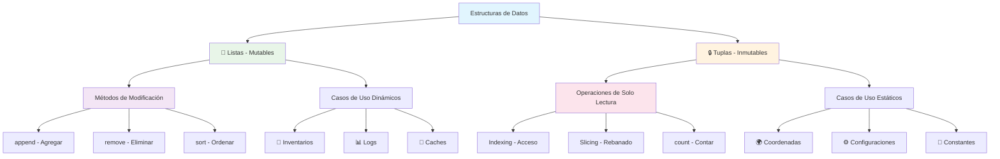

---

---
# Listas y Tuplas en Python 📋🔒

> [!info] 📍 Contexto y Definición Las **listas** y **tuplas** son estructuras de datos fundamentales en Python para almacenar colecciones ordenadas de elementos:
> 
> - 📝 **Listas**: Colecciones **mutables** (modificables) - `[1, 2, 3]`
> - 🔒 **Tuplas**: Colecciones **inmutables** (no modificables) - `(1, 2, 3)`
> - 🎯 Ambas permiten elementos de diferentes tipos de datos
> - 📊 Esenciales para organización y manipulación de datos

## 📝 Listas (Mutables)

> [!success] 🛠️ Creación y Sintaxis de Listas
> 
> |Tipo de Lista|Sintaxis|Ejemplo|
> |---|---|---|
> |**Vacía**|`[]`|`mi_lista = []`|
> |**Con elementos**|`[item1, item2, ...]`|`numeros = [1, 2, 3, 4, 5]`|
> |**Mixta**|`[tipo1, tipo2, ...]`|`mixta = [1, "hola", True, 3.14]`|
> |**Anidada**|`[[...], [...]]`|`matriz = [[1, 2], [3, 4]]`|

### 🎯 Acceso y Navegación

> [!tip] 🔍 Indexación y Slicing
> 
> ```python
> # Lista ejemplo
> frutas = ["🍎", "🍌", "🍒", "🥝", "🍇"]
> #         0     1     2     3     4
> #        -5    -4    -3    -2    -1
> ```
> 
> |Operación|Sintaxis|Resultado|Descripción|
> |---|---|---|---|
> |**Acceso directo**|`frutas[0]`|`"🍎"`|Primer elemento|
> |**Índice negativo**|`frutas[-1]`|`"🍇"`|Último elemento|
> |**Slicing básico**|`frutas[1:3]`|`["🍌", "🍒"]`|Del índice 1 al 2|
> |**Desde inicio**|`frutas[:3]`|`["🍎", "🍌", "🍒"]`|Primeros 3 elementos|
> |**Hasta final**|`frutas[2:]`|`["🍒", "🥝", "🍇"]`|Desde índice 2|
> |**Con paso**|`frutas[::2]`|`["🍎", "🍒", "🍇"]`|Cada 2 elementos|
> |**Invertir**|`frutas[::-1]`|`["🍇", "🥝", "🍒", "🍌", "🍎"]`|Lista inversa|

### ⚡ Modificación y Métodos

> [!warning] 🔧 Operaciones de Modificación
> 
> #### ➕ Añadir Elementos
> 
> |Método|Descripción|Ejemplo|Resultado|
> |---|---|---|---|
> |`append(x)`|Añade al final|`lista.append(6)`|`[1,2,3] → [1,2,3,6]`|
> |`insert(i,x)`|Inserta en posición|`lista.insert(1,'x')`|`[1,2,3] → [1,'x',2,3]`|
> |`extend(iter)`|Extiende con iterable|`lista.extend([4,5])`|`[1,2,3] → [1,2,3,4,5]`|
> 
> #### ❌ Eliminar Elementos
> 
> |Método|Descripción|Ejemplo|Comportamiento|
> |---|---|---|---|
> |`del lista[i]`|Elimina por índice|`del lista[0]`|Sin retorno|
> |`remove(x)`|Elimina primer valor x|`lista.remove('a')`|Error si no existe|
> |`pop(i)`|Elimina y retorna|`x = lista.pop(1)`|Retorna elemento|
> |`clear()`|Vacía lista|`lista.clear()`|`[] (lista vacía)`|
> 
> #### 🔄 Ordenamiento y Utilidades
> 
> |Método|Descripción|Modifica Original|Ejemplo|
> |---|---|---|---|
> |`sort()`|Ordena in-place|✅ Sí|`lista.sort()`|
> |`sorted(lista)`|Nueva lista ordenada|❌ No|`nueva = sorted(lista)`|
> |`reverse()`|Invierte in-place|✅ Sí|`lista.reverse()`|
> |`count(x)`|Cuenta ocurrencias|❌ No|`lista.count('a')`|
> |`index(x)`|Encuentra índice|❌ No|`lista.index('b')`|

## 🔒 Tuplas (Inmutables)

> [!note] 🏗️ Creación y Características de Tuplas
> 
> |Tipo de Tupla|Sintaxis|Ejemplo|Nota|
> |---|---|---|---|
> |**Vacía**|`()`|`tupla_vacia = ()`|Poco común|
> |**Un elemento**|`(item,)`|`una = (42,)`|⚠️ Coma obligatoria|
> |**Múltiples**|`(item1, item2, ...)`|`coordenadas = (10, 20)`|Más común|
> |**Sin paréntesis**|`item1, item2, ...`|`punto = 3, 4`|Válido pero menos claro|
> 
> ```python
> # Ejemplos de creación
> colores = ("rojo", "verde", "azul")
> coordenadas_3d = (10.5, -3.2, 15.0)
> persona = ("Ana", 25, "ingeniera", True)
> ```

### 🔍 Acceso y Operaciones Limitadas

> [!tip] 📖 Operaciones Disponibles en Tuplas
> 
> #### ✅ Operaciones Permitidas
> 
> |Operación|Sintaxis|Ejemplo|
> |---|---|---|
> |**Indexación**|`tupla[i]`|`colores[0] # "rojo"`|
> |**Slicing**|`tupla[i:j]`|`colores[1:] # ("verde", "azul")`|
> |**Longitud**|`len(tupla)`|`len(colores) # 3`|
> |**Pertenencia**|`x in tupla`|`"rojo" in colores # True`|
> |**Concatenación**|`tupla1 + tupla2`|`(1,2) + (3,4) # (1,2,3,4)`|
> |**Repetición**|`tupla * n`|`(1,2) * 3 # (1,2,1,2,1,2)`|
> 
> #### ❌ Operaciones NO Permitidas
> 
> ```python
> # Estos comandos generarán TypeError
> # tupla[0] = "nuevo_valor"    # ❌ No se puede modificar
> # tupla.append("item")        # ❌ No tiene método append
> # del tupla[0]                # ❌ No se puede eliminar elementos
> ```

## ⚖️ Comparación Lista vs Tupla

> [!question] 🤔 ¿Cuándo usar cada una?
> 
> ```mermaid
> graph TD
>     A[¿Necesitas modificar los datos?] --> B[SÍ - Usa LISTA]
>     A --> C[NO - Usa TUPLA]
>     B --> D[📝 Mutabilidad]
>     B --> E[🔧 Métodos de modificación]
>     B --> F[💾 Mayor consumo memoria]
>     C --> G[🔒 Inmutabilidad]
>     C --> H[⚡ Mejor rendimiento]
>     C --> I[🗝️ Puede ser clave en dict]
>     
>     style B fill:#e8f5e8
>     style C fill:#fff3e0
>     style D fill:#e3f2fd
>     style G fill:#fce4ec
> ```
> 
> |Característica|Lista `[]`|Tupla `()`|
> |---|---|---|
> |**Mutabilidad**|✅ Mutable|❌ Inmutable|
> |**Performance**|🐌 Más lenta|⚡ Más rápida|
> |**Memoria**|💾 Más consumo|🪶 Menos consumo|
> |**Métodos**|🛠️ Muchos métodos|📖 Pocos métodos|
> |**Uso como clave**|❌ No permitido|✅ Sí permitido|
> |**Casos de uso**|Datos dinámicos|Datos estáticos|

## 🎨 Analogías Visuales

> [!tip] 🚂 El Tren de Datos
> 
> ### 📝 Lista = Tren de Carga Modular
> 
> ```
> 🚂[🍎][🍌][🍒][🥝]🔗(+) ← Puedes agregar vagones
>    ↕️  ↕️  ↕️  ↕️       ← Puedes cambiar contenido
>    🗑️ 🗑️ 🗑️ 🗑️       ← Puedes eliminar vagones
> ```
> 
> ### 🔒 Tupla = Tren Blindado
> 
> ```
> 🚂[💎][🏆][⭐][🎖️]🔒 ← Sellado, no se puede modificar
>    👁️ 👁️ 👁️ 👁️       ← Solo puedes ver contenido
>    📍 📍 📍 📍       ← Posiciones fijas
> ```

## 💻 Ejemplos Prácticos Avanzados

> [!example] 🛠️ Código de Aplicación
> 
> ### 📋 Gestión de Inventario (Lista)
> 
> ```python
> # Inventario dinámico de una tienda
> inventario = ["manzanas", "peras", "plátanos"]
> 
> # Operaciones comunes
> inventario.append("naranjas")        # Nuevo producto
> inventario.remove("peras")           # Producto agotado
> inventario[0] = "manzanas rojas"     # Actualizar descripción
> 
> print(f"Inventario actual: {inventario}")
> print(f"Tenemos {len(inventario)} productos")
> ```
> 
> ### 🗺️ Coordenadas GPS (Tupla)
> 
> ```python
> # Ubicaciones fijas que no deben cambiar
> casa = (40.7128, -74.0060)          # Nueva York
> trabajo = (40.7589, -73.9851)       # Times Square
> escuela = (40.6892, -74.0445)       # Estatua de la Libertad
> 
> # Función que calcula distancia
> def calcular_distancia(punto1, punto2):
>     lat1, lon1 = punto1  # Desempaquetado de tupla
>     lat2, lon2 = punto2
>     # ... cálculo de distancia
>     return abs(lat1-lat2) + abs(lon1-lon2)  # Distancia Manhattan
> 
> distancia = calcular_distancia(casa, trabajo)
> ```
> 
> ### 🎯 Registro de Estudiantes (Lista de Tuplas)
> 
> ```python
> # Cada estudiante es una tupla (inmutable)
> # La lista permite agregar/quitar estudiantes
> estudiantes = [
>     ("Ana", 20, "Ingeniería"),
>     ("Carlos", 19, "Medicina"),
>     ("Elena", 21, "Arte")
> ]
> 
> # Agregar nuevo estudiante
> estudiantes.append(("Diego", 18, "Física"))
> 
> # Buscar estudiante por nombre
> for nombre, edad, carrera in estudiantes:
>     if nombre == "Ana":
>         print(f"{nombre} estudia {carrera}")
> ```
> 
> ### 🧮 Operaciones Matemáticas
> 
> ```python
> # Lista para cálculos dinámicos
> numeros = [1, 5, 3, 9, 2]
> numeros.sort()                    # [1, 2, 3, 5, 9]
> media = sum(numeros) / len(numeros)  # 4.0
> 
> # Tupla para constantes matemáticas
> CONSTANTES = (3.14159, 2.71828, 1.41421)  # π, e, √2
> PI, E, SQRT2 = CONSTANTES         # Desempaquetado
> 
> # Las constantes no se pueden modificar accidentalmente
> area = PI * (5 ** 2)  # π * r²
> ```

## 🔗 Casos de Uso Específicos

> [!success] 🎯 Cuándo Usar Cada Estructura
> 
> ### 📝 **Usar Listas Para:**
> 
> - 🛒 Carritos de compra (agregar/quitar productos)
> - 📊 Datos de sensores en tiempo real
> - 👥 Lista de contactos (modificable)
> - 🎵 Playlists de música (reordenable)
> - 📈 Resultados de experimentos (expandible)
> 
> ### 🔒 **Usar Tuplas Para:**
> 
> - 🌍 Coordenadas geográficas (latitud, longitud)
> - 🎨 Valores RGB de colores (rojo, verde, azul)
> - 👤 Información personal (nombre, edad, ID)
> - 📅 Fechas (año, mes, día)
> - 🎯 Configuraciones del sistema (inmutables)



---

## 📚 Referencias

> [!quote] 🔗 Enlaces a Otras Notas
> 
> - [[Módulo 2.1 Variables y Tipos de Datos]] - Fundamentos de tipos de datos
> - [[Módulo 4.3 Bucle While]] y [[Módulo 4.2 Iteradores for]] - Iteración sobre listas y tuplas
> - [[Módulo 5.1 Diccionarios]] - Estructura de datos clave-valor
> - [[Comprensiones de Lista Python]] - Creación avanzada de listas
> - [[Módulo 3.1 Funciones]] - Pasar listas y tuplas como parámetros
> - [[Algoritmos de Ordenamiento]] - Uso de sort() y sorted()

## 🎯 Notas Recomendadas para Complementar

> [!info] 📋 Prerrequisitos y Temas Relacionados
> 
> ### 🔧 **Prerrequisitos**
> 
> - [[Variables Básicas Python]]
> - [[Operadores Python]]
> - [[Strings y Indexación Python]]
> - [[Módulo 4.1 Condicional]]
> 
> ### 🔄 **Temas Relacionados**
> 
> - [[Sets en Python]] - Colecciones sin duplicados
> - [[Diccionarios Python]] - Mapeo clave-valor
> - [[Comprensiones Python]] - Sintaxis avanzada
> - [[Iteradores y Generadores]] - Procesamiento eficiente
> - [[Algoritmos de Búsqueda]] - Encontrar elementos
> - [[Programación Funcional Python]] - map(), filter(), reduce()

## 🧠 Técnica de Estudio: L.I.S.T.A.S vs T.U.P.L.A.S

> [!tip] 🎯 Mnemotecnia para Recordar Diferencias
> 
> ### 📝 **L.I.S.T.A.S** (Mutables)
> 
> **L** - **Libres**: Se pueden modificar libremente  
> **I** - **Insertables**: Método insert() disponible  
> **S** - **Sumables**: Método append() para agregar  
> **T** - **Transformables**: Método sort() cambia orden  
> **A** - **Alterables**: Elementos se pueden cambiar  
> **S** - **Suprimibles**: Método remove() elimina elementos
> 
> ### 🔒 **T.U.P.L.A.S** (Inmutables)
> 
> **T** - **Totalmente fijas**: No se pueden modificar  
> **U** - **Únicas**: Cada tupla es única e inmutable  
> **P** - **Permanentes**: Sus valores no cambian  
> **L** - **Ligeras**: Menor consumo de memoria  
> **A** - **Accesibles**: Solo lectura de elementos  
> **S** - **Seguras**: Protegidas contra cambios accidentales
> 
> ### 🔄 Método de Repaso Progresivo
> 
> #### **Semana 1: Fundamentos**
> 
> - **Día 1-2**: Crear y acceder a listas y tuplas
> - **Día 3-4**: Practicar indexación y slicing
> - **Día 5-7**: Métodos básicos de listas
> 
> #### **Semana 2: Aplicaciones**
> 
> - **Día 8-10**: Casos prácticos con listas mutables
> - **Día 11-13**: Casos prácticos con tuplas inmutables
> - **Día 14**: Proyecto combinando ambas estructuras
> 
> #### **Semana 3: Optimización**
> 
> - **Día 15-17**: Performance y eficiencia
> - **Día 18-20**: Patterns y mejores prácticas
> - **Día 21**: Evaluación y revisión completa

---

**Tags:** #python #listas #tuplas #estructuras-datos #mutabilidad #inmutabilidad #colecciones #indexación #slicing #métodos #arrays #secuencias #programación #básico #intermedio