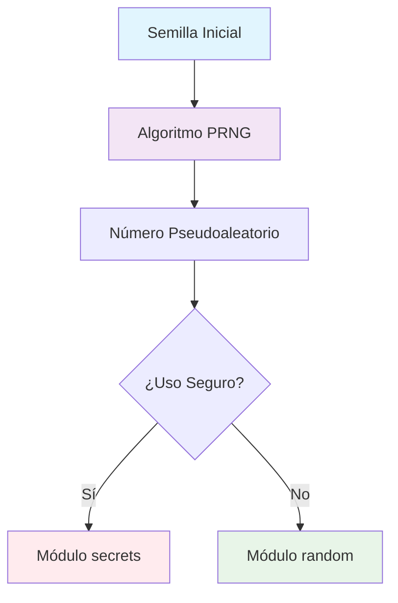
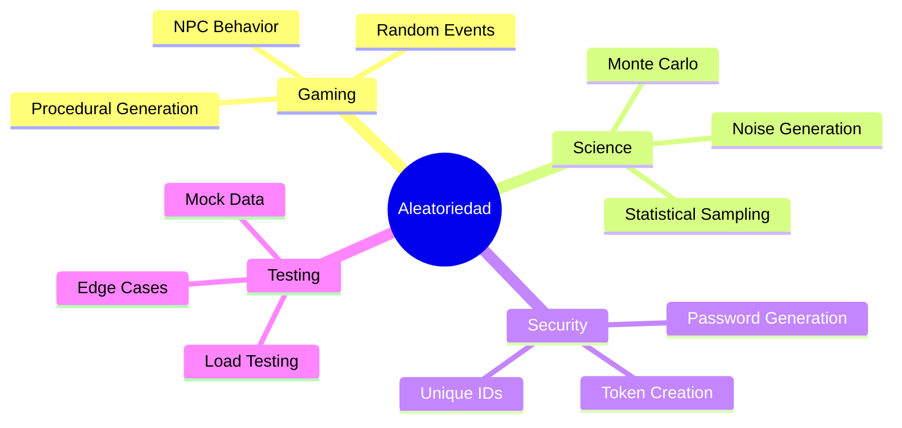

# Aleatoriedad en Python 🎲

> [!info] 📍 Contexto y Definición La **aleatoriedad** en Python introduce imprevisibilidad y variabilidad controlada en programas. Es esencial para:
> 
> - 🎮 Desarrollo de juegos y simulaciones
> - 🔐 Generación de contraseñas y datos únicos
> - 📊 Creación de datasets de prueba
> - 🧪 Simulaciones científicas y estadísticas

## 🔧 Procedimiento Básico

> [!tip] 💡 Importación del Módulo
> 
> ```python
> import random  # Siempre al inicio del script
> ```

### 1️⃣ Números Enteros Aleatorios

> [!success] 🎯 Funciones para Enteros
> 
> |Función|Descripción|Rango|Ejemplo|
> |---|---|---|---|
> |`random.randint(a, b)`|Entero inclusivo|`[a, b]`|`random.randint(1, 10)` → 1-10|
> |`random.randrange(start, stop, step)`|Entero con paso|`[start, stop)`|`random.randrange(0, 10, 2)` → 0,2,4,6,8|
> 
> ```python
> # Ejemplos prácticos
> dado = random.randint(1, 6)        # Simula un dado
> par = random.randrange(0, 10, 2)   # Solo números pares
> ```

### 2️⃣ Números Flotantes Aleatorios

> [!note] 🔢 Funciones para Flotantes
> 
> |Función|Descripción|Rango|Uso Común|
> |---|---|---|---|
> |`random.random()`|Flotante básico|`[0.0, 1.0)`|Probabilidades|
> |`random.uniform(a, b)`|Flotante personalizado|`[a, b]`|Simulaciones físicas|
> 
> ```python
> # Ejemplos de aplicación
> probabilidad = random.random()      # 0.0 ≤ x < 1.0
> temperatura = random.uniform(15.0, 35.0)  # Temp ambiente
> ```

### 3️⃣ Selecciones de Secuencias

> [!warning] ⚠️ Manipulación de Listas y Secuencias
> 
> |Función|Efecto|Modifica Original|Ejemplo|
> |---|---|---|---|
> |`random.choice(seq)`|Selecciona elemento|❌ No|`random.choice(['A','B','C'])`|
> |`random.shuffle(seq)`|Mezcla elementos|✅ Sí|`random.shuffle(mi_lista)`|
> 
> ```python
> # Casos de uso frecuentes
> opciones = ['rock', 'paper', 'scissors']
> jugada = random.choice(opciones)    # No modifica 'opciones'
> 
> playlist = ['song1', 'song2', 'song3']
> random.shuffle(playlist)            # Modifica 'playlist'
> ```

## 🧠 Fundamentos Teóricos

> [!question] 🤔 ¿Qué son los Números Pseudoaleatorios?
> 
> Los números "aleatorios" de Python son **pseudoaleatorios**:
> 
> - 🔄 Generados por algoritmos deterministas
> - 🌱 Usan una "semilla" inicial (_seed_)
> - 🎯 Suficientes para juegos y simulaciones
> - 🔒 Para criptografía usar `secrets` module



## 🎨 Analogía Visual

> [!tip] 🎰 La Máquina de Dados Digital
> 
> Imagina `random` como una máquina multifuncional:
> 
> |Función|Analogía|Resultado|
> |---|---|---|
> |`randint()`|🎲 Dado personalizable|Número entero exacto|
> |`random()`|🎯 Ruleta infinita|Punto entre 0 y 1|
> |`choice()`|🎒 Bolsa sorpresa|Elemento al azar|
> |`shuffle()`|🃏 Barajar cartas|Lista mezclada|

## 🔗 Aplicaciones y Relaciones

> [!success] 🚀 Casos de Uso Principales
> 
> ### 🎮 Gaming
> 
> - Generación de mapas procedurales
> - Sistemas de loot y recompensas
> - IA con comportamiento impredecible
> 
> ### 🔬 Simulaciones
> 
> - Modelos Monte Carlo
> - Simulación de fenómenos naturales
> - Testing con datos aleatorios
> 
> ### 🔐 Seguridad
> 
> - Generación de tokens temporales
> - Salts para hashing
> - IDs únicos



## 💻 Ejemplos Prácticos

> [!example] 🛠️ Código de Aplicación
> 
> ### 🎲 Juego de Adivinanzas
> 
> ```python
> import random
> 
> numero_secreto = random.randint(1, 100)
> print(f"¡Adivina el número entre 1 y 100!")
> # Usuario intenta adivinar...
> ```
> 
> ### 🪙 Simulador de Moneda
> 
> ```python
> def lanzar_moneda():
>     return random.choice(["Cara", "Cruz"])
> 
> resultado = lanzar_moneda()
> print(f"Resultado: {resultado}")
> ```
> 
> ### 🎵 Playlist Aleatoria
> 
> ```python
> canciones = ["Song A", "Song B", "Song C", "Song D"]
> print(f"Original: {canciones}")
> 
> random.shuffle(canciones)
> print(f"Mezclada: {canciones}")
> ```
> 
> ### 🔑 Generador de PIN
> 
> ```python
> def generar_pin():
>     return ''.join([str(random.randint(0, 9)) for _ in range(4)])
> 
> pin_seguro = generar_pin()
> print(f"PIN generado: {pin_seguro}")
> ```

---

## 📚 Referencias

> [!quote] 🔗 Enlaces a Otras Notas
> 
> - [[Módulos en Python]] - Importación y uso de librerías
> - [[Estructuras de Datos Python]] - Listas y tuplas para usar con random
> - [[Módulo 3.1 Funciones]] - Creación de funciones con aleatoriedad
> - [[Módulo Secrets Python]] - Aleatoriedad criptográficamente segura
> - [[Testing en Python]] - Uso de datos aleatorios para pruebas

## 🎯 Notas Recomendadas para Complementar

> [!info] 📋 Prerrequisitos y Temas Relacionados
> 
> ### 🔧 **Prerrequisitos**
> 
> - [[Módulo 2.1 Variables y Tipos de Datos]]
> - [[Módulo 2.3 Listas y Tuplas en Python]]
> - [[Importar Módulos Python]]
> - [[Funciones Básicas Python]]
> 
> ### 🔄 **Temas Relacionados**
> 
> - [[Algoritmos de Ordenamiento]] - Para entender shuffle
> - [[Estadística Básica]] - Para distribuciones
> - [[Criptografía Básica]] - Para entender diferencias con secrets
> - [[Game Development Python]] - Aplicaciones prácticas

## 🧠 Técnica de Estudio: Mnemotecnia R.A.N.D.O.M

> [!tip] 🎯 Método de Memorización
> 
> **R** - **Randint**: Enteros con Rango definido **A** - **Aleatoriedad**: No es verdadera (pseudoaleatoria)  
> **N** - **Numbers**: Flotantes con random() y uniform() **D** - **Decision**: choice() para elegir elementos **O** - **Order**: shuffle() cambia el orden original **M** - **Module**: Siempre importar al inicio
> 
> ### 🔄 Método de Repaso Espaciado
> 
> - **Día 1**: Leer y practicar conceptos básicos
> - **Día 3**: Implementar ejemplos prácticos
> - **Día 7**: Crear proyecto combinando todas las funciones
> - **Día 14**: Enseñar el concepto a otra persona
> - **Día 30**: Revisar y ampliar con casos avanzados

---

**Tags:** #python #random #aleatoriedad #módulos #programación #gaming #simulaciones #números #pseudoaleatorio #funciones #coding #básico