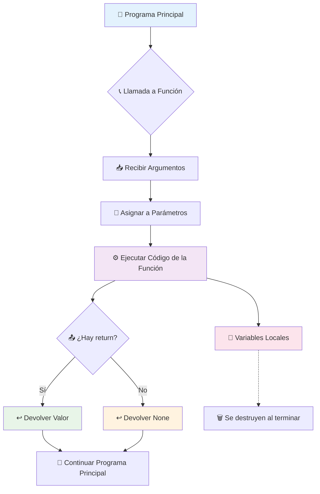

# 🏭 Funciones en Python

> [!info] 🎯 ¿Qué son las Funciones?
> Las funciones son bloques de código reutilizables diseñados para realizar una tarea específica. Son fundamentales para escribir código modular, organizado y eficiente. Permiten descomponer problemas complejos en partes más pequeñas y manejables, mejorando la legibilidad, facilitando la depuración y promoviendo la reutilización del código.

## 🏗️ Estructura Básica de una Función

### Crear una Función Simple

> [!tip] 📝 Sintaxis Fundamental
> ```python
> def nombre_funcion():
>     # Bloque de código de la función
>     print("Esto está dentro de la función.")
> 
> # Llamar/Invocar la función
> nombre_funcion()
> ```

> [!note] 🔧 Elementos Clave
> - **`def`**: Palabra clave para definir la función
> - **`nombre_funcion`**: Identificador único de la función
> - **`()`**: Paréntesis que pueden contener parámetros
> - **`:`**: Indica el inicio del bloque de código  
> - **Indentación**: El código de la función debe estar indentado

## 📥 Parámetros y Argumentos

### Funciones con Parámetros

> [!example] 🎯 Pasando Información
> ```python
> def saludar(nombre):
>     print(f"¡Hola, {nombre}!")
> 
> # Llamar con argumento
> saludar("Ana")  # "Ana" es el argumento para el parámetro 'nombre'
> ```

### Argumentos Posicionales vs Nombrados

> [!tip] 🎲 Formas de Pasar Argumentos
> 
> **Argumentos Posicionales** - El orden importa
> ```python
> def describir_persona(nombre, edad):
>     print(f"{nombre} tiene {edad} años.")
> 
> describir_persona("Luis", 30)  # Luis es nombre, 30 es edad
> ```
> 
> **Argumentos Nombrados** - El orden no importa
> ```python
> describir_persona(edad=30, nombre="Luis")
> ```
> 
> **Parámetros con Valores por Defecto**
> ```python
> def saludar_ciudad(nombre, ciudad="Mundo"):
>     print(f"Hola {nombre} desde {ciudad}.")
> 
> saludar_ciudad("María")          # Hola María desde Mundo.
> saludar_ciudad("Pedro", "Quito") # Hola Pedro desde Quito.
> ```

## 📤 Valores de Retorno

### La Sentencia `return`

> [!warning] ↩️ Devolviendo Resultados
> La sentencia `return` permite que una función envíe un valor de vuelta al código que la llamó. Si no hay `return` explícito, la función retorna `None`.
> 
> ```python
> def sumar(a, b):
>     resultado = a + b
>     return resultado  # Devuelve el valor
> 
> # Uso del valor retornado
> total = sumar(5, 3)  # 'total' ahora es 8
> print(f"El resultado es: {total}")
> ```

### Múltiples Valores de Retorno

> [!example] 📦 Retornando Varios Valores
> ```python
> def operaciones_basicas(a, b):
>     suma = a + b
>     resta = a - b
>     multiplicacion = a * b
>     division = a / b if b != 0 else "División por cero"
>     
>     return suma, resta, multiplicacion, division
> 
> # Desempaquetado de valores
> s, r, m, d = operaciones_basicas(10, 3)
> print(f"Suma: {s}, Resta: {r}, Mult: {m}, Div: {d}")
> ```

## 🌍 Alcance de Variables (Scope)

### Variables Locales vs Globales

> [!warning] 🎯 Conceptos de Alcance
> 
> **Variables Locales** - Existen solo dentro de la función
> ```python
> def mi_funcion():
>     variable_local = 10  # Solo existe aquí
>     print(variable_local)
> 
> mi_funcion()  # Imprime: 10
> # print(variable_local)  # ❌ Error: no existe fuera
> ```
> 
> **Variables Globales** - Accesibles desde cualquier parte
> ```python
> variable_global = 100  # Variable global
> 
> def mostrar_global():
>     print(variable_global)  # Puede leer la global
> 
> def modificar_global():
>     global variable_global  # Necesario para modificar
>     variable_global = 200
> 
> mostrar_global()      # 100
> modificar_global()
> mostrar_global()      # 200
> ```

## 📚 Documentación con Docstrings

### Documentando Funciones

> [!note] 📖 Buenas Prácticas de Documentación
> ```python
> def calcular_area_rectangulo(ancho, alto):
>     """
>     Calcula el área de un rectángulo.
>     
>     Parámetros:
>         ancho (int o float): El ancho del rectángulo.
>         alto (int o float): El alto del rectángulo.
>     
>     Retorna:
>         float: El área calculada del rectángulo.
>         str: Mensaje de error si las dimensiones son inválidas.
>     
>     Ejemplo:
>         >>> calcular_area_rectangulo(5, 4)
>         20
>     """
>     if ancho < 0 or alto < 0:
>         return "Las dimensiones deben ser positivas."
>     return ancho * alto
> 
> # Ver documentación
> help(calcular_area_rectangulo)
> ```

## 🏭 Analogía de la Mini-Fábrica

> [!info] 🎭 Visualización Conceptual
> Imagina una función como una **"mini-fábrica"** especializada:
> 
> - 🏗️ **`def`** es como construir la fábrica: le das un nombre y defines qué hace
> - 📦 **Parámetros** son las "materias primas" que entregas (ej: `sumar(a, b)`)
> - ⚙️ **Cuerpo** de la función es la maquinaria que procesa las materias primas
> - 📤 **`return`** es la "bandeja de salida": el producto final que te entrega
> - 🔧 **Variable local** es una herramienta que solo se usa dentro de esa fábrica
> - 🏢 **Variable global** es un recurso del almacén central, accesible por todas las fábricas
> - 📋 **Docstrings** son el manual de instrucciones de la fábrica

## 📊 Diagrama de Flujo de Ejecución



## 💻 Ejemplos Prácticos Completos

### Función Simple sin Parámetros

> [!example] 🎯 Caso Básico
> ```python
> def mostrar_mensaje():
>     print("¡Esta es mi primera función!")
>     print("Las funciones son geniales! 🚀")
> 
> # Llamar la función
> mostrar_mensaje()
> # Salida: 
> # ¡Esta es mi primera función!
> # Las funciones son geniales! 🚀
> ```

### Calculadora con Funciones

> [!example] 🧮 Sistema de Cálculos
> ```python
> def calculadora_avanzada():
>     """Sistema de calculadora con múltiples operaciones"""
>     
>     def sumar(a, b):
>         return a + b
>     
>     def restar(a, b):
>         return a - b
>     
>     def multiplicar(a, b):
>         return a * b
>     
>     def dividir(a, b):
>         if b == 0:
>             return "Error: División por cero"
>         return a / b
>     
>     def potencia(base, exponente):
>         return base ** exponente
>     
>     # Menú principal
>     while True:
>         print("\n🧮 CALCULADORA AVANZADA")
>         print("1. Sumar")
>         print("2. Restar") 
>         print("3. Multiplicar")
>         print("4. Dividir")
>         print("5. Potencia")
>         print("6. Salir")
>         
>         opcion = input("Seleccione una opción: ")
>         
>         if opcion == '6':
>             print("¡Hasta luego! 👋")
>             break
>         
>         if opcion in ['1', '2', '3', '4', '5']:
>             try:
>                 num1 = float(input("Primer número: "))
>                 num2 = float(input("Segundo número: "))
>                 
>                 if opcion == '1':
>                     resultado = sumar(num1, num2)
>                 elif opcion == '2':
>                     resultado = restar(num1, num2)
>                 elif opcion == '3':
>                     resultado = multiplicar(num1, num2)
>                 elif opcion == '4':
>                     resultado = dividir(num1, num2)
>                 elif opcion == '5':
>                     resultado = potencia(num1, num2)
>                 
>                 print(f"✅ Resultado: {resultado}")
>                 
>             except ValueError:
>                 print("❌ Error: Ingrese números válidos")
>         else:
>             print("❌ Opción no válida")
> 
> # Ejecutar calculadora
> calculadora_avanzada()
> ```

### Validador de Datos con Funciones

> [!example] 🔍 Sistema de Validación
> ```python
> def sistema_validacion():
>     """Sistema completo de validación usando funciones"""
>     
>     def validar_edad(edad_str):
>         """Valida que la edad sea un número válido"""
>         try:
>             edad = int(edad_str)
>             if 0 <= edad <= 150:
>                 return True, edad
>             else:
>                 return False, "La edad debe estar entre 0 y 150"
>         except ValueError:
>             return False, "La edad debe ser un número"
>     
>     def validar_email_simple(email):
>         """Validación básica de email"""
>         if "@" in email and "." in email:
>             return True, email.lower()
>         return False, "Formato de email inválido"
>     
>     def obtener_datos_usuario():
>         """Obtiene y valida datos del usuario"""
>         print("📝 REGISTRO DE USUARIO")
>         print("=" * 30)
>         
>         # Obtener nombre
>         while True:
>             nombre = input("Nombre: ").strip()
>             if nombre and len(nombre) >= 2:
>                 break
>             print("❌ El nombre debe tener al menos 2 caracteres")
>         
>         # Obtener edad
>         while True:
>             edad_input = input("Edad: ")
>             es_valida, resultado = validar_edad(edad_input)
>             if es_valida:
>                 edad = resultado
>                 break
>             print(f"❌ {resultado}")
>         
>         # Obtener email
>         while True:
>             email_input = input("Email: ")
>             es_valido, resultado = validar_email_simple(email_input)
>             if es_valido:
>                 email = resultado
>                 break
>             print(f"❌ {resultado}")
>         
>         return {
>             'nombre': nombre,
>             'edad': edad,
>             'email': email
>         }
>     
>     def mostrar_resumen(datos):
>         """Muestra resumen de datos registrados"""
>         print("\n✅ REGISTRO COMPLETADO")
>         print("=" * 30)
>         print(f"Nombre: {datos['nombre']}")
>         print(f"Edad: {datos['edad']} años")
>         print(f"Email: {datos['email']}")
>         
>         # Clasificar por edad
>         if datos['edad'] < 18:
>             categoria = "Menor de edad"
>         elif datos['edad'] < 65:
>             categoria = "Adulto" 
>         else:
>             categoria = "Adulto mayor"
>         
>         print(f"Categoría: {categoria}")
>     
>     # Ejecutar el sistema
>     try:
>         datos_usuario = obtener_datos_usuario()
>         mostrar_resumen(datos_usuario)
>         return datos_usuario
>     except KeyboardInterrupt:
>         print("\n❌ Proceso cancelado por el usuario")
>         return None
> 
> # Ejecutar sistema
> if __name__ == "__main__":
>     usuario = sistema_validacion()
> ```

### Ejemplo con Variables Locales y Globales

> [!example] 🌍 Manejo de Scope
> ```python
> # Variable global
> contador_global = 0
> mensaje_global = "Contador Global"
> 
> def mostrar_estado():
>     """Muestra el estado actual del contador"""
>     print(f"📊 {mensaje_global}: {contador_global}")
> 
> def incrementar_contador(cantidad=1):
>     """Incrementa el contador global"""
>     global contador_global
>     contador_local = cantidad * 2  # Variable local
>     contador_global += cantidad
>     
>     print(f"🔧 Incrementando en {cantidad}")
>     print(f"   Variable local (cantidad x2): {contador_local}")
>     print(f"   Nuevo valor global: {contador_global}")
> 
> def reiniciar_contador():
>     """Reinicia el contador a cero"""
>     global contador_global
>     valor_anterior = contador_global
>     contador_global = 0
>     print(f"🔄 Contador reiniciado desde {valor_anterior} a {contador_global}")
> 
> def demo_scope():
>     """Demostración del manejo de scope"""
>     print("🎯 DEMOSTRACIÓN DE VARIABLES LOCALES Y GLOBALES")
>     print("=" * 50)
>     
>     mostrar_estado()
>     
>     incrementar_contador(5)
>     mostrar_estado()
>     
>     incrementar_contador(10)
>     mostrar_estado()
>     
>     reiniciar_contador()
>     mostrar_estado()
>     
>     # Intentar acceder a variable local (comentado para evitar error)
>     # print(contador_local)  # ❌ Esto daría NameError
> 
> # Ejecutar demostración
> demo_scope()
> ```

---

## 📚 Referencias  

> [!quote] 🔗 Enlaces a Otras Notas
> - [[Módulo 2.1 Variables y Tipos de Datos]] - Scope y tipos de variables
> - [[Módulo 4.1 Condicional]] - Lógica dentro de funciones
> - [[Módulo 4.2 Iteradores for]] - Bucles en funciones
> - [[Módulo 4.3 Bucle While]] - Bucles de validación en funciones
> - [[Módulo 2.3 Listas y Tuplas en Python]] - Funciones que trabajan con listas
> - [[Funciones Built-in]] - Funciones predefinidas de Python

## 🎓 Notas Recomendadas

> [!note] 📖 Para Complementar tu Aprendizaje
> - [[Parámetros *args y **kwargs]] - Argumentos variables
> - [[Funciones Lambda]] - Funciones anónimas
> - [[Decoradores]] - Modificar comportamiento de funciones
> - [[Módulos y Paquetes]] - Organizar funciones en archivos
> - [[Programación Orientada a Objetos]] - Métodos como funciones de clase
> - [[Manejo de Excepciones]] - Control de errores en funciones
> - [[Testing y Debugging]] - Probar y depurar funciones

---

**Tags:** #python #funciones #def #return #parametros #argumentos #scope #variables-locales #variables-globales #docstrings #modularidad #reutilizacion #programacion-estructurada