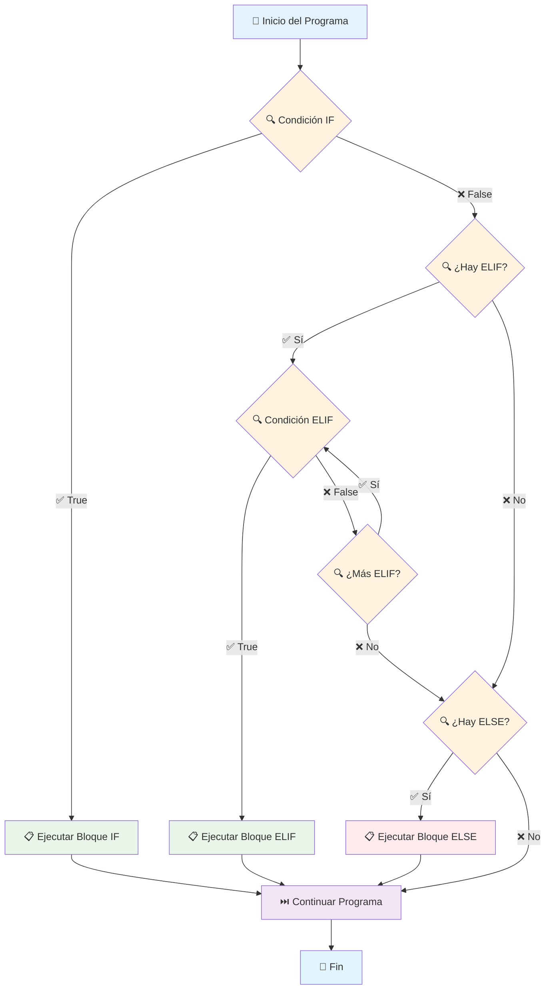

# 🔀 Estructuras de Control Condicionales

## 🎯 Introducción y Conceptos Fundamentales

>[!info] 💡 **¿Qué son las Estructuras Condicionales?**
>Las estructuras de control condicionales son herramientas fundamentales que permiten a un programa **tomar decisiones** y alterar el flujo de ejecución basándose en la evaluación de condiciones lógicas. En esencia, le dicen a tu programa: *"Si esto es cierto, haz esto; de lo contrario, haz aquello."* 🤔

>[!tip] ⚡ **Características Principales**
>- **Ramificación**: Permiten diferentes caminos de ejecución
>- **Evaluación booleana**: Trabajan con valores `True` y `False`
>- **Flujo no lineal**: El código no se ejecuta secuencialmente
>- **Toma de decisiones**: Hacen los programas "inteligentes" y reactivos
>- **Indentación crítica**: Python usa espacios para definir bloques de código

## 📝 Sintaxis y Estructuras Básicas

### 🔵 Declaración IF Simple

>[!note] 🏗️ **Estructura IF Básica**
>La estructura más simple que ejecuta código solo si la condición es `True`.
>
>```python
>if condicion:
>    # Este bloque se ejecuta si la condición es verdadera
>    print("La condición se cumplió.")
>```
>
>**Ejemplo práctico:**
>```python
>edad = 20
>if edad >= 18:
>    print("Eres mayor de edad.")
>```

### 🔵🔴 IF-ELSE: Plan A y Plan B

>[!note] 🔄 **Estructura IF-ELSE**
>Ejecuta un bloque si la condición es `True`, otro si es `False`.
>
>```python
>if condicion:
>    # Bloque si es True
>    print("La condición se cumplió.")
>else:
>    # Bloque si es False
>    print("La condición NO se cumplió.")
>```
>
>**Ejemplo práctico:**
>```python
>temperatura = 25
>if temperatura > 30:
>    print("Hace mucho calor.")
>else:
>    print("La temperatura es agradable.")
>```

### 🔵🟡🔴 IF-ELIF-ELSE: Múltiples Caminos

>[!tip] 🛤️ **Estructura Completa**
>`elif` es la abreviatura de "else if". Permite probar múltiples condiciones en secuencia.
>
>```python
>if condicion1:
>    # Bloque si condicion1 es True
>elif condicion2:
>    # Bloque si condicion1 fue False Y condicion2 es True
>elif condicion3:
>    # Bloque si condiciones anteriores fueron False Y condicion3 es True
>else:
>    # Bloque si todas las condiciones anteriores fueron False
>```
>
>**Ejemplo práctico:**
>```python
>puntuacion = 85
>if puntuacion >= 90:
>    print("Excelente ⭐")
>elif puntuacion >= 70:
>    print("Bueno 👍")
>elif puntuacion >= 50:
>    print("Aprobado ✅")
>else:
>    print("Necesita mejorar 📚")
>```

## 🔍 Operadores de Comparación y Lógicos

>[!info] ⚖️ **Operadores de Comparación**
>Se usan para comparar valores y devuelven `True` o `False`:
>
>| Operador | Significado | Ejemplo |
>|----------|-------------|---------|
>| `==` | Igual a | `5 == 5` → `True` |
>| `!=` | Diferente de | `5 != 3` → `True` |
>| `>` | Mayor que | `7 > 3` → `True` |
>| `<` | Menor que | `2 < 5` → `True` |
>| `>=` | Mayor o igual | `5 >= 5` → `True` |
>| `<=` | Menor o igual | `3 <= 4` → `True` |

>[!info] 🔗 **Operadores Lógicos**
>Combinan múltiples condiciones:
>
>| Operador | Función | Ejemplo |
>|----------|---------|---------|
>| `and` | `True` si **todas** son `True` | `True and True` → `True` |
>| `or` | `True` si **al menos una** es `True` | `True or False` → `True` |
>| `not` | Invierte el valor booleano | `not True` → `False` |
>
>**Ejemplos prácticos:**
>```python
># AND - Ambas condiciones deben ser verdaderas
>edad = 25
>tiene_licencia = True
>if edad >= 18 and tiene_licencia:
>    print("Puede conducir")
>
># OR - Al menos una condición debe ser verdadera
>es_fin_semana = True
>es_feriado = False
>if es_fin_semana or es_feriado:
>    print("¡Día libre!")
>
># NOT - Invierte la condición
>esta_lloviendo = False
>if not esta_lloviendo:
>    print("Buen día para salir")
>```

## ⚠️ Aspectos Críticos de Python

>[!warning] 📏 **La Indentación es Fundamental**
>En Python, la **indentación** (espacios al inicio de línea) define qué código pertenece a cada bloque condicional.
>
>```python
># ✅ Correcto - 4 espacios de indentación
>if edad >= 18:
>    print("Mayor de edad")
>    print("Puede votar")
>print("Este código siempre se ejecuta")
>
># ❌ Incorrecto - Falta indentación
>if edad >= 18:
>print("Mayor de edad")  # Error de sintaxis
>
># ❌ Incorrecto - Indentación inconsistente
>if edad >= 18:
>    print("Mayor de edad")
>  print("Puede votar")  # Error: solo 2 espacios
>```

>[!tip] 📐 **Buenas Prácticas de Indentación**
>- Usa **4 espacios** por nivel (estándar Python)
>- **Mantén consistencia** en todo el archivo
>- La mayoría de editores configuran Tab = 4 espacios
>- Todo el código del mismo nivel debe tener la misma indentación

## 🧠 Fundamentos Teóricos

>[!info] 🔬 **Conceptos Clave**
>
>**Ramificación del Flujo:**
>Las condicionales implementan **ramificación** en la lógica del programa, permitiendo que el flujo de ejecución "elija" diferentes caminos según los datos.
>
>**Evaluación de Expresiones Booleanas:**
>Cada condición se evalúa como una **expresión booleana** que resulta en `True` o `False`. Esta evaluación determina qué bloque de código se ejecuta.
>
>**Evaluación de Cortocircuito:**
>- `and`: Si la primera condición es `False`, no evalúa la segunda
>- `or`: Si la primera condición es `True`, no evalúa la segunda
>
>```python
># Ejemplo de cortocircuito
>x = 0
>if x != 0 and 10/x > 1:  # No causa error porque x != 0 es False
>    print("Esta línea no se ejecuta")
>```

## 🚦 Analogía Práctica

>[!example] 🚦 **El Semáforo Inteligente**
>Imagina que tu programa es una persona caminando por la ciudad:
>
>**🔵 IF Simple** = "Si el semáforo está en verde 🟢, cruza la calle"
>- Si no está verde, simplemente espera sin hacer nada
>
>**🔵🔴 IF-ELSE** = "Si está verde 🟢, cruza; si no, espera ⏳"
>- Siempre hay una acción definida para cualquier situación
>
>**🔵🟡🔴 IF-ELIF-ELSE** = Sistema completo:
>- "Si está verde 🟢 → cruza rápido"
>- "Si está amarillo 🟡 → prepárate para detenerte"  
>- "Si está rojo 🔴 → espera y revisa el tráfico"
>- Cada condición se revisa solo si las anteriores no se cumplieron

## 🔗 Conexiones con Otros Conceptos

>[!note] 🌐 **Relaciones Importantes**
>
>**Estructuras de Control:**
>- **[[Módulo 4.3 Bucle While]]**: Condicionales repetitivas
>- **[[Módulo 4.2 Iteradores for]]**: Condiciones de parada en bucles
>- **Funciones**: Validación de parámetros de entrada
>
>**Tipos de Datos:**
>- **[[Módulo 2.1 Variables y Tipos de Datos]]**: Comparación de diferentes tipos
>- **[[Módulo 2.2 Operaciones con Datos y Variables]]**: Operadores en condiciones
>
>**Aplicaciones Prácticas:**
>- **Validación de entrada de usuario**
>- **Manejo de errores y excepciones**
>- **Lógica de negocio en aplicaciones**
>- **Sistemas de autenticación y autorización**

## 📊 Visualización del Flujo de Control



## 💻 Ejemplos Prácticos Completos

>[!example] 🔢 **Verificador de Número Par/Impar**
>```python
>numero = 7
>
>if numero % 2 == 0:  # El operador % da el resto de la división
>    print(f"El número {numero} es par.")
>else:
>    print(f"El número {numero} es impar.")
>
># Salida: El número 7 es impar.
>```

>[!example] 🌅 **Determinador de Fase del Día**
>```python
>hora = 14  # Hora en formato 24h
>
>if hora < 6:
>    fase = "madrugada 🌙"
>elif hora < 12:
>    fase = "mañana ☀️"
>elif hora < 18:
>    fase = "tarde 🌤️"
>else:
>    fase = "noche 🌟"
>
>print(f"Son las {hora}:00, es de {fase}")
># Salida: Son las 14:00, es de tarde 🌤️
>```

>[!example] 🎫 **Sistema de Control de Acceso**
>```python
>edad_usuario = 17
>tiene_identificacion = True
>es_acompañado = False
>
>if edad_usuario >= 18 and tiene_identificacion:
>    print("✅ Acceso permitido - Mayor de edad con ID")
>elif edad_usuario >= 16 and es_acompañado:
>    print("✅ Acceso permitido - Menor acompañado")
>elif edad_usuario >= 18 and not tiene_identificacion:
>    print("❌ Acceso denegado - Falta identificación")
>else:
>    print("❌ Acceso denegado - Menor de edad sin acompañante")
>
># Salida: ❌ Acceso denegado - Menor de edad sin acompañante
>```

>[!example] 🎯 **Calculadora de Calificaciones Avanzada**
>```python
>puntuacion = 85
>asistencia = 90  # Porcentaje
>tareas_entregadas = 8
>total_tareas = 10
>
># Verificar requisitos mínimos
>if asistencia < 75:
>    print("❌ Reprobado por inasistencia")
>elif tareas_entregadas < 6:
>    print("❌ Reprobado por falta de tareas")
>else:
>    # Calcular calificación final
>    if puntuacion >= 90 and tareas_entregadas >= 9:
>        calificacion = "Excelente ⭐"
>        nota_numerica = "A+"
>    elif puntuacion >= 80 and tareas_entregadas >= 7:
>        calificacion = "Muy Bueno 🎉"
>        nota_numerica = "A"
>    elif puntuacion >= 70:
>        calificacion = "Bueno 👍"
>        nota_numerica = "B"
>    elif puntuacion >= 60:
>        calificacion = "Suficiente ✅"
>        nota_numerica = "C"
>    else:
>        calificacion = "Insuficiente 📚"
>        nota_numerica = "F"
>    
>    print(f"Calificación: {calificacion} ({nota_numerica})")
>    print(f"Puntuación: {puntuacion}/100")
>    print(f"Asistencia: {asistencia}%")
>    print(f"Tareas: {tareas_entregadas}/{total_tareas}")
>
># Salida: Muy Bueno 🎉 (A)
>```

## 🚀 Técnicas Avanzadas

>[!tip] 🎯 **Operador Ternario (Condicional Inline)**
>Python permite condicionales de una sola línea para casos simples:
>```python
># Sintaxis: valor_si_true if condicion else valor_si_false
>edad = 20
>mensaje = "Mayor de edad" if edad >= 18 else "Menor de edad"
>print(mensaje)  # Mayor de edad
>
># Útil para asignaciones rápidas
>precio_final = precio * 0.9 if es_estudiante else precio
>estado = "Activo" if usuario_logueado else "Inactivo"
>```

>[!tip] 🔗 **Condiciones Anidadas**
>```python
>puntuacion = 85
>es_estudiante_regular = True
>
>if puntuacion >= 70:
>    if es_estudiante_regular:
>        if puntuacion >= 90:
>            print("🏆 Beca de excelencia académica")
>        else:
>            print("📜 Certificado de aprovechamiento")
>    else:
>        print("✅ Aprobado como estudiante externo")
>else:
>    print("❌ No aprobado")
>```

>[!tip] 📝 **Validación de Entrada Múltiple**
>```python
>def validar_usuario(nombre, edad, email):
>    errores = []
>    
>    if not nombre or len(nombre) < 2:
>        errores.append("Nombre debe tener al menos 2 caracteres")
>    
>    if not (16 <= edad <= 100):
>        errores.append("Edad debe estar entre 16 y 100 años")
>    
>    if "@" not in email or "." not in email:
>        errores.append("Email debe tener formato válido")
>    
>    if errores:
>        print("❌ Errores encontrados:")
>        for error in errores:
>            print(f"  • {error}")
>        return False
>    else:
>        print("✅ Usuario válido")
>        return True
>
># Uso
>validar_usuario("Ana", 25, "ana@email.com")
>```

## 🔗 Referencias

>[!quote] **Notas Relacionadas**
>- [[Módulo 2.1 Variables y Tipos de Datos]] - Tipos que se pueden comparar
>- [[Módulo 2.2 Operaciones con Datos y Variables]] - Operadores usados en condiciones
>- [[Módulo 4.3 Bucle While]] - Condicionales repetitivas  
>- [[Módulo 4.2 Iteradores for]] - Uso de condicionales en bucles
>- [[Módulo 3.1 Funciones]] - Validación de parámetros y retorno condicional

## 📚 Notas Recomendadas para Estudio

>[!info] 📖 **Temas Complementarios**
>1. **[[Manejo de Errores con try, except, finally]]** - try/except como alternativa a if/else
>2. **[[Expresiones Regulares (Regex)]]** - Validación avanzada de patrones
>3. **[[Funciones Lambda]]** - Condicionales en funciones de una línea
>4. **[[Estructuras de Datos Avanzadas]]** - Uso de condicionales con listas/dict
>5. **[[Debugging y Testing]]** - Casos de prueba para lógica condicional
>6. **[[Algoritmos de Decisión]]** - Árboles de decisión y lógica compleja

---

**Tags:** #python #condicionales #if-else #elif #control-flujo #operadores-logicos #programacion-basica #toma-decisiones #indentacion #fundamentos