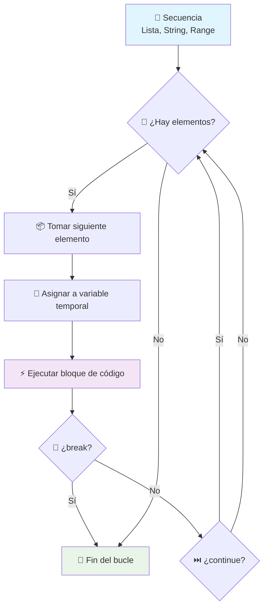

# 🔄 Iteradores 'for' en Python

> [!info] 📋 Contexto
> El bucle `for` es una estructura de control fundamental en Python que se utiliza para iterar sobre secuencias (listas, strings, tuplas, rangos) y ejecutar código repetitivo de manera eficiente. Es ideal cuando conoces el número de iteraciones o necesitas procesar cada elemento de una colección.

## 🏗️ Estructura y Sintaxis

### Sintaxis Básica

> [!tip] 💡 Fórmula Principal
> ```python
> for variable_temporal in secuencia:
>     # Bloque de código que se repetirá
>     # Este código se ejecuta para cada elemento
> ```

> [!note] 🔧 Elementos Clave
> - **`for`**: Palabra clave que inicia el bucle
> - **`variable_temporal`**: Variable que toma el valor de cada elemento
> - **`in`**: Conecta la variable con la secuencia
> - **`secuencia`**: Colección de elementos a recorrer
> - **`:`**: Indica el inicio del bloque indentado

## 🎯 Uso con range()

> [!tip] 📊 Variantes de range()
> 
> **`range(fin)`** - Desde 0 hasta fin-1
> ```python
> for i in range(5):  # 0, 1, 2, 3, 4
>     print(i)
> ```
> 
> **`range(inicio, fin)`** - Desde inicio hasta fin-1
> ```python
> for i in range(1, 6):  # 1, 2, 3, 4, 5
>     print(i)
> ```
> 
> **`range(inicio, fin, paso)`** - Con incremento personalizado
> ```python
> for i in range(0, 10, 2):  # 0, 2, 4, 6, 8
>     print(i)
> ```

## 📝 Iteración sobre Colecciones

### Con Listas

> [!example] 🛒 Ejemplo con Lista
> ```python
> lista_compras = ["Manzanas", "Pan", "Leche"]
> for producto in lista_compras:
>     print(producto)
> ```

### Con Strings

> [!example] 🔤 Ejemplo con Cadena
> ```python
> palabra = "Python"
> for letra in palabra:
>     print(letra)  # P, y, t, h, o, n
> ```

## ⚡ Control de Flujo

> [!warning] 🛑 Sentencias de Control
> 
> **`break`** - Termina completamente el bucle
> ```python
> for i in range(10):
>     if i == 5:
>         break  # Se detiene en 5
>     print(i)
> ```
> 
> **`continue`** - Salta a la siguiente iteración
> ```python
> for i in range(5):
>     if i == 2:
>         continue  # Omite el 2
>     print(i)  # 0, 1, 3, 4
> ```

## 🔢 enumerate() - Índice y Valor

> [!tip] 📍 Obtener Posición y Elemento
> ```python
> for indice, valor in enumerate(secuencia):
>     print(f"{indice}: {valor}")
> ```

## 🧠 Explicación Conceptual

> [!info] 🎭 Analogía del Repartidor
> Imagina el bucle `for` como un **repartidor** con una lista de tareas:
> 
> - 📦 La `variable_temporal` es cada paquete individual
> - 📋 La `secuencia` es la lista completa de entregas
> - 🚪 Cada iteración es visitar una dirección
> - 📞 `break` es recibir una llamada urgente para parar
> - ⏭️ `continue` es saltarse una casa y pasar a la siguiente

## 📊 Diagrama de Flujo



## 💻 Ejemplos Prácticos

### Saludar Lista de Nombres

> [!example] 👋 Saludos Personalizados
> ```python
> nombres = ["Ana", "Luis", "Sofía", "Pedro"]
> print("Saludos a todos:")
> for nombre in nombres:
>     print(f"¡Hola, {nombre}!")
> ```

### Contador Regresivo

> [!example] 🚀 Cuenta Regresiva
> ```python
> print("Cuenta regresiva:")
> for i in range(5, 0, -1):
>     print(i)
> print("¡Despegue!")
> ```

### Contador de Vocales

> [!example] 🔤 Análisis de Texto
> ```python
> frase = "Programacion en Python"
> vocales = "aeiouAEIOU"
> contador_vocales = 0
> 
> for caracter in frase:
>     if caracter == ' ':
>         continue
>     if caracter in vocales:
>         contador_vocales += 1
> 
> print(f"La frase tiene {contador_vocales} vocales.")
> ```

### Búsqueda con break

> [!example] 🔍 Búsqueda Eficiente
> ```python
> productos = ["Laptop", "Teclado", "Mouse", "Monitor"]
> item_buscado = "Mouse"
> 
> for producto in productos:
>     if producto == item_buscado:
>         print(f"¡{item_buscado} encontrado!")
>         break
> else:
>     print(f"{item_buscado} no encontrado.")
> ```

### Lista Numerada con enumerate

> [!example] 📋 Lista de Tareas
> ```python
> tareas = ["Estudiar Python", "Hacer ejercicio", "Comprar víveres"]
> print("Mis tareas pendientes:")
> 
> for indice, tarea in enumerate(tareas, 1):
>     print(f"{indice}. {tarea}")
> ```

---

## 📚 Referencias

> [!quote] 🔗 Enlaces Relacionados
> - [[Módulo 4.1 Condicional]] - Conceptos fundamentales
> - [[Módulo 2.3 Listas y Tuplas en Python]] - Trabajando con secuencias
> - [[Módulo 2.2 Operaciones con Datos y Variables]] - Procesamiento de texto
> - [[Funciones Built-in]] - range(), enumerate() y más

## 🎓 Notas Recomendadas

> [!note] 📖 Para Complementar tu Aprendizaje
> - [[Módulo 4.3 Bucle While]] - Bucles con condiciones
> - [[List Comprehensions]] - Sintaxis avanzada para listas
> - [[Iteradores y Generadores]] - Conceptos avanzados
> - [[Manejo de Errores con try, except, finally]] - Control de errores en bucles
> - [[Algoritmos de Búsqueda]] - Aplicaciones prácticas

---

**Tags:** #python #bucles #iteradores #control-flujo #programacion #fundamentos #loops #range #enumerate #break #continue