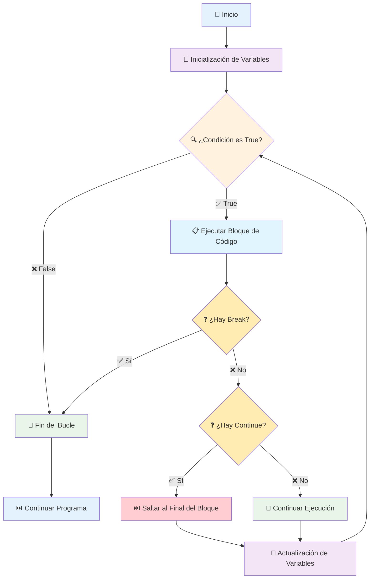

# 🔄 Bucle While en Python

## 🎯 Introducción y Conceptos Fundamentales

>[!info] 💡 **¿Qué es el Bucle While?**
>El bucle `while` es una estructura de control de flujo que permite **repetir un bloque de código mientras una condición sea verdadera** (`True`). A diferencia del bucle `for` que itera sobre secuencias finitas, el `while` es ideal cuando **no sabes de antemano cuántas veces** necesitas repetir el ciclo. 🔁

>[!tip] ⚡ **Características Principales**
>- **Repetición condicional**: Se ejecuta mientras la condición sea `True`
>- **Flexibilidad**: Número de iteraciones variable e impredecible
>- **Control dinámico**: La condición puede cambiar durante la ejecución
>- **Riesgo de bucle infinito**: Si la condición nunca se vuelve `False`
>- **Evaluación previa**: La condición se verifica antes de cada iteración

>[!warning] ⚠️ **Aspectos Críticos**
>- **Actualización obligatoria**: Dentro del bucle debe haber código que modifique la condición
>- **Bucles infinitos**: Si la condición nunca cambia a `False`, el programa se bloqueará
>- **Inicialización**: Las variables de la condición deben estar definidas antes del `while`

## 📝 Sintaxis y Estructura

>[!note] 🏗️ **Sintaxis Básica**
>```python
>while condicion:
>    # Bloque de código que se ejecutará
>    # mientras la 'condicion' sea True
>    
>    # ¡IMPORTANTE! Debe haber código que modifique
>    # la condición para evitar bucles infinitos
>```
>
>**Elementos clave:**
>- `while`: Palabra clave que inicia el bucle
>- `condicion`: Expresión booleana que se evalúa cada iteración
>- `:`: Indica el inicio del bloque de código indentado
>- **Bloque indentado**: Código que se repite en cada iteración
>- **Actualización**: Modificación de variables que afectan la condición

>[!example] 📊 **Estructura Visual**
>```python
># 1. Inicialización (antes del bucle)
>contador = 1
>
># 2. Condición (se evalúa cada vez)
>while contador <= 5:
>    # 3. Cuerpo del bucle (se ejecuta si condición es True)
>    print(f"Iteración {contador}")
>    
>    # 4. Actualización (cambia la condición)
>    contador += 1
>
># 5. Código después del bucle (se ejecuta cuando termina)
>print("Bucle terminado")
>```

## 🎮 Sentencias de Control

>[!tip] 🚦 **Break y Continue**
>
>**`break` - Salida Inmediata:**
>```python
>contador = 1
>while True:  # Bucle aparentemente infinito
>    print(f"Número: {contador}")
>    if contador == 3:
>        break  # Sale del bucle completamente
>    contador += 1
>
># Salida: 1, 2, 3 (luego termina)
>```
>
>**`continue` - Saltar Iteración:**
>```python
>contador = 0
>while contador < 5:
>    contador += 1
>    if contador == 3:
>        continue  # Salta el resto de esta iteración
>    print(f"Número: {contador}")
>
># Salida: 1, 2, 4, 5 (omite el 3)
>```

>[!info] 🔄 **Patrones Comunes de Control**
>
>**Bucle con Bandera (Flag):**
>```python
>continuar = True
>while continuar:
>    respuesta = input("¿Continuar? (s/n): ")
>    if respuesta.lower() == 'n':
>        continuar = False
>```
>
>**Bucle Infinito Controlado:**
>```python
>while True:
>    comando = input("Comando (quit para salir): ")
>    if comando == "quit":
>        break
>    # Procesar comando...
>```

## 🧠 Fundamentos Teóricos

>[!info] 🔬 **Funcionamiento Interno**
>
>**Ciclo de Evaluación:**
>1. **Evaluación**: Se verifica la condición antes de cada iteración
>2. **Ejecución**: Si es `True`, se ejecuta el bloque de código
>3. **Actualización**: El código debe modificar variables que afecten la condición
>4. **Re-evaluación**: Vuelve al paso 1
>5. **Terminación**: Cuando la condición es `False`, sale del bucle
>
>**Complejidad Temporal:**
>- **Mejor caso**: O(1) si la condición es falsa desde el inicio
>- **Caso promedio**: O(n) donde n es el número de iteraciones
>- **Peor caso**: O(∞) si hay un bucle infinito

>[!warning] 🔄 **Bucles Infinitos - Causas Comunes**
>```python
># ❌ INCORRECTO - Bucle infinito
>contador = 1
>while contador <= 5:
>    print(contador)
>    # ¡Falta incrementar contador!
>
># ❌ INCORRECTO - Condición nunca cambia
>numero = 10
>while numero > 0:
>    print("Procesando...")
>    # numero nunca se modifica
>
># ✅ CORRECTO - Condición se actualiza
>contador = 1
>while contador <= 5:
>    print(contador)
>    contador += 1  # Actualización crucial
>```

## 🚪 Analogía Práctica

>[!example] 🚪 **El Guardia de Seguridad**
>Imagina el bucle `while` como un **guardia de seguridad en una puerta**:
>
>**🔍 La Condición** = "Hay gente haciendo fila"
>- El guardia verifica constantemente si hay personas esperando
>
>**🚪 El Bloque de Código** = "Abrir la puerta para una persona"
>- Cada iteración, el guardia permite pasar a una persona
>
>**📉 La Actualización** = "La fila se reduce"
>- Con cada persona que pasa, hay menos gente en la fila
>
>**🏃 Break** = "Alarma de incendio"
>- El guardia abandona su puesto inmediatamente, sin importar la fila
>
>**⏭️ Continue** = "Persona sin pase"
>- El guardia salta a la siguiente persona sin dejarla pasar
>
>**⚠️ Bucle Infinito** = "La fila nunca se acaba"
>- Si constantemente llegan nuevas personas, el guardia nunca descansa

## 🔗 Conexiones con Otros Conceptos

>[!note] 🌐 **Relaciones Importantes**
>
>**Estructuras de Control:**
>- **[[Módulo 4.1 Condicional]]**: La condición del `while` usa lógica if/else
>- **[[Módulo 4.2 Iteradores for]]**: Comparación entre bucles definidos vs indefinidos
>- **[[Módulo 3.1 Funciones]]**: Bucles dentro de funciones para procesamiento repetitivo
>
>**Aplicaciones Prácticas:**
>- **Validación de entrada de usuario**
>- **Juegos y simulaciones**
>- **Procesamiento continuo de datos**
>- **Algoritmos iterativos y convergencia**
>- **Interfaces de menú y navegación**

## 📊 Visualización del Flujo de Control



## 💻 Ejemplos Prácticos Completos

>[!example] 🔢 **Contador Simple**
>```python
>contador = 1
>
>while contador <= 5:
>    print(f"Número: {contador}")
>    contador += 1  # Incremento crucial
>
>print("¡Fin del bucle!")
>
># Salida:
># Número: 1
># Número: 2  
># Número: 3
># Número: 4
># Número: 5
># ¡Fin del bucle!
>```

>[!example] 🔐 **Validación de Contraseña**
>```python
>clave_correcta = "python123"
>intentos = 0
>max_intentos = 3
>
>while intentos < max_intentos:
>    clave = input("Ingresa la contraseña: ")
>    intentos += 1
>    
>    if clave == clave_correcta:
>        print("✅ ¡Acceso concedido!")
>        break
>    else:
>        restantes = max_intentos - intentos
>        if restantes > 0:
>            print(f"❌ Contraseña incorrecta. Te quedan {restantes} intentos.")
>        else:
>            print("🚫 Máximo de intentos alcanzado. Acceso denegado.")
>
># Ejemplo de interacción:
># Ingresa la contraseña: abc123
># ❌ Contraseña incorrecta. Te quedan 2 intentos.
># Ingresa la contraseña: python123  
># ✅ ¡Acceso concedido!
>```

>[!example] 🎲 **Juego de Adivinanza**
>```python
>import random
>
>numero_secreto = random.randint(1, 100)
>intentos = 0
>adivinado = False
>
>print("🎯 ¡Adivina el número secreto entre 1 y 100!")
>print("Escribe 'quit' para rendirte.\n")
>
>while not adivinado:
>    entrada = input(f"Intento #{intentos + 1}: ")
>    
>    # Opción para rendirse
>    if entrada.lower() == 'quit':
>        print(f"😔 Te rendiste. El número era {numero_secreto}")
>        break
>    
>    try:
>        intento = int(entrada)
>        intentos += 1
>        
>        if intento == numero_secreto:
>            print(f"🎉 ¡Felicidades! Adivinaste en {intentos} intentos!")
>            adivinado = True
>        elif intento < numero_secreto:
>            print("📈 Demasiado bajo. Intenta más alto.")
>        else:
>            print("📉 Demasiado alto. Intenta más bajo.")
>            
>    except ValueError:
>        print("⚠️ Por favor, ingresa un número válido o 'quit'.")
>
>print("🏁 ¡Gracias por jugar!")
>```

>[!example] 📊 **Calculadora Interactiva**
>```python
>print("🧮 Calculadora Simple")
>print("Operaciones: +, -, *, /")
>print("Escribe 'salir' para terminar.\n")
>
>while True:
>    try:
>        # Obtener primer número
>        entrada1 = input("Primer número (o 'salir'): ")
>        if entrada1.lower() == 'salir':
>            break
>        num1 = float(entrada1)
>        
>        # Obtener operador
>        operador = input("Operador (+, -, *, /): ")
>        if operador not in ['+', '-', '*', '/']:
>            print("❌ Operador no válido")
>            continue
>        
>        # Obtener segundo número
>        num2 = float(input("Segundo número: "))
>        
>        # Realizar cálculo
>        if operador == '+':
>            resultado = num1 + num2
>        elif operador == '-':
>            resultado = num1 - num2
>        elif operador == '*':
>            resultado = num1 * num2
>        elif operador == '/':
>            if num2 == 0:
>                print("❌ Error: División por cero")
>                continue
>            resultado = num1 / num2
>        
>        print(f"✅ Resultado: {num1} {operador} {num2} = {resultado}\n")
>        
>    except ValueError:
>        print("❌ Error: Ingresa números válidos\n")
>
>print("👋 ¡Hasta luego!")
>```

## 🎯 Casos de Uso Comunes

>[!tip] 📋 **Patrones de Aplicación**
>
>**1. Validación de Entrada:**
>```python
>while True:
>    edad = input("Ingresa tu edad: ")
>    if edad.isdigit() and 0 <= int(edad) <= 120:
>        break
>    print("Edad inválida. Intenta de nuevo.")
>```
>
>**2. Menú de Opciones:**
>```python
>while True:
>    print("\n1. Opción A")
>    print("2. Opción B") 
>    print("3. Salir")
>    
>    opcion = input("Elige una opción: ")
>    if opcion == "3":
>        break
>    elif opcion in ["1", "2"]:
>        # Procesar opción...
>        pass
>    else:
>        print("Opción inválida")
>```
>
>**3. Procesamiento de Archivos:**
>```python
>with open("archivo.txt", "r") as file:
>    linea = file.readline()
>    while linea:
>        # Procesar línea
>        print(linea.strip())
>        linea = file.readline()
>```

## 🚀 Técnicas Avanzadas

>[!tip] ⚡ **While con Else**
>Python permite usar `else` con bucles `while`. El bloque `else` se ejecuta solo si el bucle termina naturalmente (no con `break`):
>
>```python
>contador = 1
>while contador <= 3:
>    print(f"Intento {contador}")
>    respuesta = input("¿Continuar? (s/n): ")
>    if respuesta.lower() == 'n':
>        break
>    contador += 1
>else:
>    print("✅ Bucle completado sin interrupciones")
>    
>print("🏁 Programa terminado")
>```

>[!tip] 🔄 **Bucles Anidados**
>```python
>fila = 1
>while fila <= 3:
>    columna = 1
>    while columna <= 3:
>        print(f"({fila},{columna})", end=" ")
>        columna += 1
>    print()  # Nueva línea después de cada fila
>    fila += 1
>
># Salida:
># (1,1) (1,2) (1,3)
># (2,1) (2,2) (2,3) 
># (3,1) (3,2) (3,3)
>```

>[!tip] 🎯 **Optimización y Eficiencia**
>```python
># ✅ Buena práctica - Minimizar evaluaciones costosas
>datos = obtener_datos_costosos()  # Solo una vez fuera del bucle
>indice = 0
>while indice < len(datos):
>    procesar(datos[indice])
>    indice += 1
>
># ❌ Evitar - Evaluación costosa en cada iteración
>indice = 0
>while indice < len(obtener_datos_costosos()):  # ¡Ineficiente!
>    # ...
>```

## 🔗 Referencias

>[!quote] **Notas Relacionadas**
>- [[Módulo 4.1 Condicional]] - Lógica booleana usada en condiciones while
>- [[Módulo 4.2 Iteradores for]] - Comparación entre tipos de bucles
>- [[Módulo 2.1 Variables y Tipos de Datos]] - Tipos de datos en condiciones
>- [[Módulo 3.1 Funciones]] - Uso de while dentro de funciones
>- [[Módulo 2.3 Listas y Tuplas en Python]] - Iteración sobre estructuras de datos

## 📚 Notas Recomendadas para Estudio

>[!info] 📖 **Temas Complementarios**
>1. **[[Manejo de Errores con try, except, finally]]** - Try/except en bucles para robustez
>2. **[[Recursión vs Iteración]]** - Cuándo usar while vs funciones recursivas
>3. **[[Algoritmos de Búsqueda]]** - While en búsqueda lineal y binaria
>4. **[[Procesamiento de Archivos]]** - Lectura línea por línea con while
>5. **[[Concurrencia y Threads]]** - Bucles infinitos en programación concurrente
>6. **[[Optimización de Código]]** - Eficiencia en bucles repetitivos

---

**Tags:** #python #bucle-while #estructuras-control #repeticion #iteracion #break-continue #bucles-infinitos #validacion-entrada #programacion-basica #fundamentos