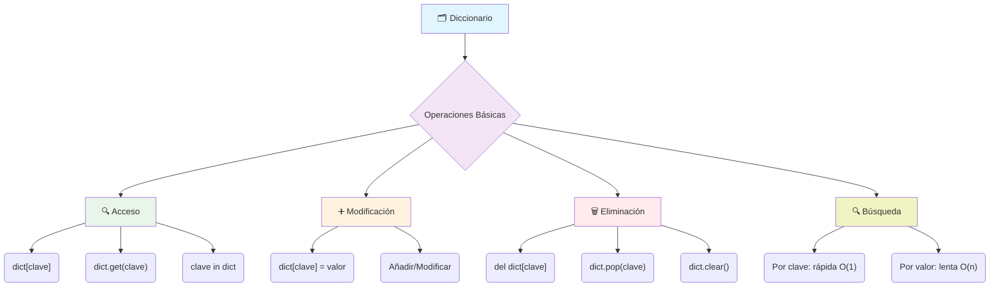

# 📖 Módulo 5.1: Diccionarios en Python

## 🎯 Introducción y Conceptos Fundamentales

> [!info] 💡 **¿Qué son los Diccionarios?** Los diccionarios en Python son estructuras de datos que almacenan información en **pares clave-valor**. Son como una agenda telefónica 📞 donde cada nombre (clave) tiene asociado un número (valor). Representan una de las herramientas más poderosas para organizar y acceder a datos de forma eficiente.

> [!tip] ✨ **Características Principales**
> 
> - **Mutables**: Puedes modificar, añadir o eliminar elementos después de su creación
> - **Claves únicas**: Cada clave debe ser única dentro del diccionario 🔑
> - **Acceso rápido**: Tiempo de acceso O(1) gracias a las tablas hash
> - **Orden preservado**: Desde Python 3.7+ mantienen el orden de inserción
> - **Flexibles**: Las claves deben ser inmutables, pero los valores pueden ser cualquier tipo de dato

## 📝 Sintaxis y Creación

> [!note] 🏗️ **Formas de Crear Diccionarios**
> 
> **Diccionario vacío:**
> 
> ```python
> mi_diccionario = {}
> # O también
> mi_diccionario = dict()
> ```
> 
> **Diccionario con datos iniciales:**
> 
> ```python
> persona = {
>    "nombre": "Ana",
>    "edad": 30,
>    "ciudad": "Madrid"
> }
> 
> productos = {
>    101: "Laptop",
>    102: "Mouse", 
>    103: "Teclado"
> }
> ```

## 🔍 Acceso y Manipulación de Elementos

> [!warning] ⚠️ **Acceso Directo vs Acceso Seguro**
> 
> **Acceso directo (puede generar KeyError):**
> 
> ```python
> persona = {"nombre": "Ana", "edad": 30}
> print(persona["nombre"])  # ✅ Funciona: Ana
> print(persona["telefono"])  # ❌ KeyError: clave no existe
> ```
> 
> **Acceso seguro con .get():**
> 
> ```python
> print(persona.get("nombre"))  # ✅ Ana
> print(persona.get("telefono"))  # ✅ None (sin error)
> print(persona.get("pais", "Desconocido"))  # ✅ Valor por defecto
> ```

> [!tip] ➕ **Añadir y Modificar Elementos**
> 
> ```python
> # Añadir nuevo elemento
> persona["telefono"] = "555-1234"
> 
> # Modificar elemento existente
> persona["edad"] = 31
> 
> # Resultado: {'nombre': 'Ana', 'edad': 31, 'telefono': '555-1234'}
> ```

> [!note] 🗑️ **Eliminar Elementos**
> 
> **Con `del` (eliminación permanente):**
> 
> ```python
> del persona["edad"]  # Elimina sin devolver valor
> ```
> 
> **Con `.pop()` (eliminación y recuperación):**
> 
> ```python
> edad_eliminada = persona.pop("edad")  # Elimina y devuelve el valor
> telefono = persona.pop("telefono", "No encontrado")  # Con valor por defecto
> ```
> 
> **Con `.clear()` (vaciar completamente):**
> 
> ```python
> persona.clear()  # Diccionario queda: {}
> ```

## 🔍 Búsqueda y Verificación

> [!tip] ⚡ **Búsqueda por Clave (Rápida - O(1))**
> 
> ```python
> contactos = {'Ana': '555-1234', 'Juan': '555-5678'}
> 
> # Verificar existencia
> if 'Ana' in contactos:
>    print(f"Teléfono de Ana: {contactos['Ana']}")
> 
> # Acceso seguro
> telefono = contactos.get('Carlos', 'No encontrado')
> ```

> [!warning] 🐌 **Búsqueda por Valor (Lenta - Requiere Iteración)**
> 
> ```python
> calificaciones = {'Matemáticas': 9.5, 'Historia': 7.0, 'Ciencias': 9.5}
> nota_buscada = 9.5
> materias_encontradas = []
> 
> for materia, nota in calificaciones.items():
>    if nota == nota_buscada:
>        materias_encontradas.append(materia)
>        
> print(f"Materias con nota {nota_buscada}: {materias_encontradas}")
> ```

## 🧠 Fundamentos Teóricos

> [!info] 🔬 **Implementación Interna** Los diccionarios utilizan **tablas hash (hash maps)** internamente:
> 
> - **Tiempo de acceso O(1)**: Búsqueda, inserción y eliminación casi instantáneas
> - **Función hash**: Convierte las claves en índices para acceso directo
> - **Claves inmutables**: Necesarias para mantener consistencia del hash
> - **Eficiencia de memoria**: Los objetos vista evitan copias innecesarias

## 🚌 Analogía Práctica

> [!example] 🚌 **El Autobús Escolar** Imagina un diccionario como un **autobús escolar**:
> 
> - **Diccionario** = El autobús completo 🚌
> - **Claves** = Números de asiento (únicos) 🪑
> - **Valores** = Estudiantes sentados 👦👧
> - **Acceso por clave** = Encontrar quién está en el asiento 5 (instantáneo)
> - **Búsqueda por valor** = Encontrar en qué asiento está Juan (hay que revisar uno por uno)
> - **Modificar** = Cambiar de estudiante en un asiento
> - **Eliminar** = Dejar un asiento vacío

## 📊 Visualización de Operaciones Básicas



## 💻 Ejemplos Prácticos

> [!example] 📚 **Agenda de Contactos**
> 
> ```python
> agenda = {}
> 
> # Añadir contactos
> agenda["Ana"] = "555-1234"
> agenda["Juan"] = "555-5678"
> agenda["María"] = "555-9012"
> 
> # Verificar si existe un contacto
> nombre = "Ana"
> if nombre in agenda:
>    print(f"Teléfono de {nombre}: {agenda[nombre]}")
> else:
>    print(f"{nombre} no está en la agenda")
> 
> # Modificar un contacto
> agenda["Ana"] = "555-9999"
> 
> # Eliminar un contacto
> contacto_eliminado = agenda.pop("Juan", "No encontrado")
> print(f"Contacto eliminado: {contacto_eliminado}")
> ```

> [!example] 🛒 **Inventario de Tienda**
> 
> ```python
> inventario = {
>    "manzanas": 50,
>    "naranjas": 35,
>    "bananas": 40,
>    "uvas": 25
> }
> 
> # Verificar stock de un producto
> producto = "manzanas"
> stock = inventario.get(producto, 0)
> print(f"Stock de {producto}: {stock} unidades")
> 
> # Actualizar stock después de una venta
> if "manzanas" in inventario:
>    inventario["manzanas"] -= 10  # Vendemos 10 manzanas
>    print(f"Nuevo stock de manzanas: {inventario['manzanas']}")
> 
> # Añadir nuevo producto
> inventario["peras"] = 30
> ```

> [!example] 🎓 **Sistema de Calificaciones**
> 
> ```python
> estudiante = {
>    "nombre": "Carlos",
>    "edad": 20,
>    "materias": {
>        "Matemáticas": 8.5,
>        "Historia": 7.0,
>        "Ciencias": 9.2
>    }
> }
> 
> # Acceder a información anidada
> print(f"Estudiante: {estudiante['nombre']}")
> print(f"Nota en Matemáticas: {estudiante['materias']['Matemáticas']}")
> 
> # Calcular promedio
> notas = list(estudiante['materias'].values())
> promedio = sum(notas) / len(notas)
> estudiante['promedio'] = round(promedio, 2)
> 
> print(f"Promedio: {estudiante['promedio']}")
> ```

## 🧠 Técnicas de Estudio y Memorización

> [!tip] 🎯 **Mnemotecnia para Diccionarios**
> 
> **DICCIONARIO = Datos Indexados Con Claves Únicamente Navegables Acceso Rápido Inmediato Optimizado**
> 
> - **D**atos: Almacenan información
> - **I**ndexados: Por claves únicas
> - **C**laves: Deben ser inmutables
> - **C**onsistentes: Orden preservado (Python 3.7+)
> - **U**niforme: Acceso O(1)
> - **N**avegables: Búsqueda eficiente
> - **A**cceso: Directo por clave
> - **R**ápido: Implementación hash
> - **I**nmediato: Sin iteración
> - **O**ptimizado: Eficiencia de memoria
> 
> **Método de Repaso Espaciado:**
> 
> - 📅 Día 1: Creación y acceso básico
> - 📅 Día 3: Manipulación y eliminación
> - 📅 Día 7: Búsqueda y verificación
> - 📅 Día 14: Repaso completo con ejercicios prácticos

## 🔗 Referencias

> [!quote] **Notas Relacionadas**
> 
> - [[Módulo 2.1 Variables y Tipos de Datos]] - Comprende qué tipos pueden ser claves
> - [[Módulo 2.3 Listas y Tuplas en Python]] - Comparación con estructuras ordenadas
> - [[Módulo 4.1 Condicional]] - Verificación de existencia de claves
> - [[Módulo 3.1 Funciones]] - Pasar diccionarios como argumentos
> - [[Módulo 5.2 Iterar Diccionarios]] - Siguiente tema del módulo

## 📚 Notas Recomendadas para Estudio

> [!info] 📖 **Temas Complementarios**
> 
> **Prerrequisitos:**
> 
> - [[Variables en Python]] - Conceptos básicos de variables
> - [[Tipos de Datos Básicos]] - String, int, float, bool
> - [[Operadores de Comparación]] - Para verificaciones
> 
> **Para Profundizar:**
> 
> - [[Módulo 5.2: Iteración de Diccionarios]] - Recorrer diccionarios
> - [[Collections Module]] - defaultdict, Counter, OrderedDict
> - [[JSON y APIs]] - Trabajo con datos web estructurados
> - [[Manejo de Errores]] - Try/except con KeyError
> - [[Programación Orientada a Objetos]] - Modelado con diccionarios

---

**Tags:** #python #diccionarios #estructuras-datos #hash-tables #modulo5 #programacion-basica #claves-valores #acceso-datos #busqueda #fundamentos