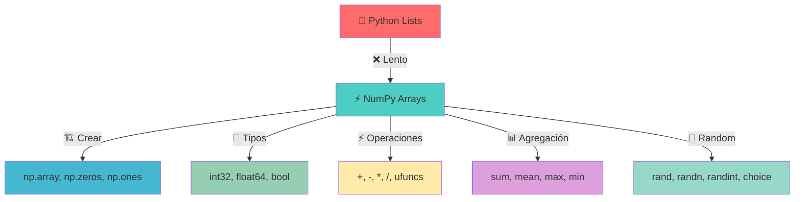

# Módulo 6.1: Introducción a NumPy

## 🎯 Objetivos de Aprendizaje

> [!tip] 🎯 Metas de la Clase
> 
> - ✅ Comprender qué es NumPy y su importancia
> - ✅ Crear y manipular arreglos `ndarray` eficientemente
> - ✅ Identificar y trabajar con tipos de datos de NumPy
> - ✅ Realizar operaciones matemáticas y lógicas
> - ✅ Utilizar funciones comunes de NumPy
> - ✅ Generar datos aleatorios con `numpy.random`

---

## 🔍 ¿Qué es NumPy?

> [!info] 📚 Definición Fundamental **NumPy** (Numerical Python) es la biblioteca fundamental para computación numérica en Python que proporciona:
> 
> - 🏗️ Objeto de arreglo N-dimensional de alto rendimiento (`ndarray`)
> - 🔗 Base para otras bibliotecas como SciPy, Pandas y scikit-learn
> - ⚡ Operaciones optimizadas implementadas en C

### 🚀 Ventajas sobre Listas de Python

> [!tip] 💡 ¿Por qué NumPy vs Listas?
> 
> |Aspecto|NumPy|Listas Python|
> |---|---|---|
> |⚡ **Velocidad**|Implementado en C, operaciones a nivel de bloque|Interpretado, elemento por elemento|
> |💾 **Memoria**|Almacenamiento contiguo, más eficiente|Referencias a objetos, fragmentado|
> |🔧 **Funcionalidad**|Amplia gama de funciones matemáticas optimizadas|Funcionalidad básica|
> |📝 **Sintaxis**|Código limpio, legible y vectorizado|Más verboso para operaciones numéricas|

### 🛠️ Instalación e Importación

> [!warning] ⚙️ Configuración Inicial
> 
> ```bash
> # Instalación
> pip install numpy
> ```
> 
> ```python
> # Importación (convención estándar)
> import numpy as np
> ```
> 
> **Nota:** Se usa `np` como alias por convención en la comunidad Python

---

## 🏗️ Creación y Tipos de Datos
# 🧩 ¿Qué es un Arreglo (Array) en NumPy?

> [!info] 🎯 **Definición Simple** Un **arreglo** (o _array_) en NumPy es como una **caja de herramientas súper organizada** 🧰 donde puedes guardar números de forma ordenada. Imagínalo como una **fila de casilleros numerados** donde cada casillero puede contener un número, y todos los números son del mismo tipo (todos enteros, o todos decimales).

> [!example] 📦 **Analogía Visual: La Caja de Huevos**
> 
> **Un arreglo es como una caja de huevos** 🥚:
> 
> - **Cada compartimento** = Una posición en el arreglo
> - **Cada huevo** = Un número que guardas
> - **Todos los huevos son del mismo tamaño** = Todos los números son del mismo tipo
> - **Están en orden fijo** = Puedes acceder por posición (índice)
> - **Sabes exactamente dónde está cada uno** = Acceso rápido y directo
> 
> ```python
> # Esto es como tener una caja con 5 compartimentos:
> # [🥚] [🥚] [🥚] [🥚] [🥚]
> #  10   20   30   40   50
> 
> mi_arreglo = np.array([10, 20, 30, 40, 50])
> ```

## 🔄 Arreglos vs Listas: ¿Cuál es la diferencia?

> [!tip] ⚖️ **Comparación Práctica**
> 
> **Lista de Python** (como un estante desordenado):
> 
> ```python
> mi_lista = [1, 2.5, "hola", True, [1,2,3]]  # ¡Puede tener cualquier cosa!
> # Es como un estante donde guardas: libro, zapato, taza, planta... 📚👟☕🌱
> ```
> 
> **Arreglo de NumPy** (como un archivero profesional):
> 
> ```python
> mi_arreglo = np.array([1, 2, 3, 4, 5])  # ¡Solo números del mismo tipo!
> # Es como un archivero donde SOLO guardas documentos del mismo tamaño 📁📄📄📄
> ```

> [!warning] 🚨 **¡Regla Importante!** Los arreglos de NumPy son **"quisquillosos"** - solo aceptan datos del mismo tipo. Si mezclas enteros con decimales, automáticamente convierte todo al tipo más "flexible":
> 
> ```python
> arreglo_mixto = np.array([1, 2, 3.5, 4])
> print(arreglo_mixto)  # [1.  2.  3.5 4. ] - ¡Todos se volvieron decimales!
> ```

## 🏗️ Tipos de Arreglos: 1D, 2D y más

> [!info] 📏 **Dimensiones: Como Cajas Dentro de Cajas**
> 
> **1D (Una dimensión) - La Fila Simple** 📏:
> 
> ```python
> # Como una fila de asientos en el cine:
> # [💺] [💺] [💺] [💺] [💺]
> arreglo_1d = np.array([1, 2, 3, 4, 5])
> ```
> 
> **2D (Dos dimensiones) - La Tabla** 📊:
> 
> ```python
> # Como una tabla de 3 filas x 3 columnas:
> #     Col1  Col2  Col3
> # F1  [1]   [2]   [3]
> # F2  [4]   [5]   [6]  
> # F3  [7]   [8]   [9]
> 
> arreglo_2d = np.array([[1, 2, 3],
>                       [4, 5, 6],
>                       [7, 8, 9]])
> ```
> 
> **3D (Tres dimensiones) - El Cubo** 🧊:
> 
> ```python
> # Como varias tablas apiladas (imagina un cubo Rubik)
> arreglo_3d = np.array([[[1, 2], [3, 4]], 
>                       [[5, 6], [7, 8]]])
> # Es como tener 2 pisos, cada piso tiene 2 filas, cada fila tiene 2 números
> ```

## 🎯 ¿Por qué Usar Arreglos en Lugar de Listas?

> [!tip] ⚡ **Ventajas de los Arreglos NumPy**
> 
> **1. Súper Rápidos** 🏎️:
> 
> ```python
> # Lista tradicional (lento)
> lista = [1, 2, 3, 4, 5]
> nueva_lista = []
> for numero in lista:
>    nueva_lista.append(numero * 2)  # Uno por uno... 😴
> 
> # Arreglo NumPy (súper rápido)
> arreglo = np.array([1, 2, 3, 4, 5])
> nuevo_arreglo = arreglo * 2  # ¡Todos de una vez! ⚡
> ```
> 
> **2. Operaciones Mágicas** ✨:
> 
> ```python
> # Con listas necesitas bucles:
> lista1 = [1, 2, 3]
> lista2 = [4, 5, 6]
> # lista1 + lista2 = [1, 2, 3, 4, 5, 6]  ¡Se juntan!
> 
> # Con arreglos es matemática:
> arr1 = np.array([1, 2, 3])
> arr2 = np.array([4, 5, 6])
> resultado = arr1 + arr2  # [5, 7, 9]  ¡Se suman posición por posición!
> ```
> 
> **3. Menos Memoria** 💾: Los arreglos ocupan menos espacio porque están optimizados para números.

## 🧠 Conceptos Clave para Recordar

> [!note] 🔑 **Los 5 Puntos Esenciales**
> 
> 1. **Homogéneo**: Todos los elementos deben ser del mismo tipo
> 2. **Indexado**: Puedes acceder a cualquier elemento por su posición
> 3. **Eficiente**: Operaciones matemáticas súper rápidas
> 4. **Estructurado**: Puede tener múltiples dimensiones (1D, 2D, 3D...)
> 5. **Fundamental**: Es la base de toda la computación científica en Python

> [!example] 🎮 **Ejemplo del Mundo Real: Videojuego** Imagina que estás programando un videojuego:
> 
> ```python
> # Posiciones de los enemigos en pantalla (coordenadas X, Y)
> enemigos = np.array([[100, 200],   # Enemigo 1: X=100, Y=200
>                     [150, 300],   # Enemigo 2: X=150, Y=300  
>                     [200, 100]])  # Enemigo 3: X=200, Y=100
> 
> # ¡Mover TODOS los enemigos 10 píxeles a la derecha de una vez!
> enemigos_movidos = enemigos + [10, 0]  # ¡Magia NumPy! ✨
> ```
> 
> Sin NumPy tendrías que hacer un bucle para cada enemigo... ¡qué lento! 🐌

## 🤔 Preguntas Frecuentes

> [!question] ❓ **"¿Es como una lista mejorada?"** ¡Exacto! Es como una lista de Python que fue al gimnasio 💪, aprendió matemáticas 🧮, y se volvió súper eficiente. Pero con la restricción de que solo puede guardar números del mismo tipo.

> [!question] ❓ **"¿Por qué se llama 'ndarray'?"** **ndarray** = **N-Dimensional Array** (Arreglo de N dimensiones)
> 
> - Puede ser 1D (como una línea) 📏
> - Puede ser 2D (como una tabla) 📊
> - Puede ser 3D (como un cubo) 🧊
> - O incluso más dimensiones... ¡tu mente puede explotar! 🤯

> [!question] ❓ **"¿Cuándo debo usar arreglos?"** Usa arreglos cuando:
> 
> - ✅ Trabajas solo con números
> - ✅ Quieres hacer operaciones matemáticas rápidas
> - ✅ Necesitas procesar muchos datos
> - ✅ Haces ciencia de datos, machine learning, o análisis numérico
### 📋 Métodos de Creación de Arreglos

> [!tip] 🔨 Creación desde Listas
> 
> ```python
> # Arreglo 1D
> lista = [1, 2, 3, 4, 5]
> arreglo = np.array(lista)
> print(arreglo)  # [1 2 3 4 5]
> 
> # Arreglo 2D (Matriz)
> matriz = np.array([[1, 2, 3], [4, 5, 6], [7, 8, 9]])
> ```

> [!info] 🏭 Funciones de Creación Especializadas
> 
> |Función|Descripción|Ejemplo|
> |---|---|---|
> |`np.zeros(shape)`|Arreglo lleno de ceros|`np.zeros(5)`|
> |`np.ones(shape)`|Arreglo lleno de unos|`np.ones((2, 3))`|
> |`np.arange(start, stop, step)`|Secuencia numérica|`np.arange(0, 10, 2)`|
> |`np.linspace(start, stop, num)`|Números espaciados uniformemente|`np.linspace(0, 1, 5)`|
> 
> ```python
> print(np.zeros(5))           # [0. 0. 0. 0. 0.]
> print(np.ones((2, 3)))       # [[1. 1. 1.] [1. 1. 1.]]
> print(np.arange(0, 10, 2))   # [0 2 4 6 8]
> print(np.linspace(0, 1, 5))  # [0.   0.25 0.5  0.75 1.  ]
> ```

### 🏷️ Atributos de Arreglos

> [!info] 📊 Propiedades Importantes
> 
> |Atributo|Descripción|Ejemplo|
> |---|---|---|
> |`.ndim`|Número de dimensiones|`arreglo.ndim`|
> |`.size`|Número total de elementos|`arreglo.size`|
> |`.dtype`|Tipo de dato de elementos|`arreglo.dtype`|

### 🏷️ Tipos de Datos (dtype)

> [!warning] 🔢 Tipos de Datos Comunes
> 
> **Enteros:** `int8`, `int16`, `int32`, `int64`  
> **Flotantes:** `float32`, `float64`  
> **Booleanos:** `bool`
> 
> ```python
> # Especificar tipo al crear
> arreglo_float = np.array([1, 2, 3], dtype=np.float64)
> print(arreglo_float.dtype)  # float64
> 
> # Cambiar tipo de dato
> arreglo_int = arreglo_float.astype(np.int32)
> print(arreglo_int.dtype)    # int32
> ```

---

## ⚡ Operadores y Funciones Principales

### 🔄 Operaciones Element-wise

> [!tip] 🧮 Operaciones Elemento por Elemento Los operadores estándar (`+`, `-`, `*`, `/`) se aplican a cada elemento:
> 
> ```python
> arr = np.array([1, 2, 3, 4])
> 
> # Operaciones con escalar
> print(arr + 5)    # [6 7 8 9]
> print(arr * 2)    # [2 4 6 8]
> 
> # Operaciones entre arreglos
> arr2 = np.array([10, 20, 30, 40])
> print(arr + arr2)  # [11 22 33 44]
> print(arr * arr2)  # [10 40 90 160]
> ```

> [!warning] ⚠️ Multiplicación de Matrices La multiplicación `*` es elemento por elemento, NO multiplicación de matrices.  
> Para multiplicación de matrices usar: `np.dot()` o el operador `@`

### 🔍 Operaciones Lógicas y Comparación

> [!info] 🔢 Comparaciones y Filtrado
> 
> ```python
> arr = np.array([1, 5, 2, 8])
> print(arr > 3)  # [False  True False  True]
> 
> # Indexación Booleana (filtrado)
> arr_filtrado = arr[arr > 3]
> print(arr_filtrado)  # [5 8]
> ```

### 🧮 Funciones Matemáticas Universales (ufuncs)

> [!tip] 📐 Funciones Matemáticas Se aplican a cada elemento del arreglo:
> 
> ```python
> arr = np.array([1, 4, 9, 16])
> print(np.sqrt(arr))  # [1. 2. 3. 4.]
> ```
> 
> **Funciones comunes:** `np.sqrt()`, `np.log()`, `np.sin()`, `np.exp()`

### 📊 Funciones de Agregación

> [!info] 📈 Resumen Estadístico
> 
> |Función|Descripción|
> |---|---|
> |`np.sum()`|Suma todos los elementos|
> |`np.mean()`|Calcula el promedio|
> |`np.max()`|Encuentra el valor máximo|
> |`np.min()`|Encuentra el valor mínimo|
> 
> ```python
> matriz = np.array([[1, 2, 3], [4, 5, 6]])
> print(np.sum(matriz))           # 21
> print(np.sum(matriz, axis=0))   # [5 7 9] (suma por columnas)
> print(np.sum(matriz, axis=1))   # [6 15] (suma por filas)
> ```

---

## 🎲 Generación de Números Aleatorios

> [!tip] 🔀 numpy.random - Funciones Principales
> 
> ### Distribución Uniforme
> 
> ```python
> # Entre 0 y 1
> print(np.random.rand(3))        # [0.5, 0.3, 0.8]
> print(np.random.rand(2, 2))     # Matriz 2x2
> ```
> 
> ### Distribución Normal
> 
> ```python
> # Media 0, desviación estándar 1
> print(np.random.randn(4))       # [-0.5, 1.2, -0.3, 0.8]
> ```
> 
> ### Enteros Aleatorios
> 
> ```python
> print(np.random.randint(1, 10, 5))      # [3, 7, 1, 9, 5]
> print(np.random.randint(1, 10, (2, 3))) # Matriz 2x3
> ```
> 
> ### Elección Aleatoria
> 
> ```python
> opciones = ['A', 'B', 'C', 'D']
> print(np.random.choice(opciones, size=3))  # ['B', 'A', 'C']
> ```

---

## 🧠 Técnicas de Estudio y Memorización

> [!tip] 🎯 Mnemotecnia para NumPy
> 
> **NUMPY = Numérico Universalmente Muy Práctico Y**
> 
> - **N**umérico: Para cálculos matemáticos
> - **U**niversalmente: Funciones que se aplican elemento por elemento
> - **M**uy: Muy rápido comparado con listas
> - **P**ráctico: Sintaxis simple y potente
> - **Y**: Y es la base de otras librerías
> 
> **Método de Repaso Espaciado:**
> 
> - 📅 Día 1: Crear arreglos y tipos de datos
> - 📅 Día 3: Operaciones y funciones matemáticas
> - 📅 Día 7: Números aleatorios y agregaciones
> - 📅 Día 14: Repaso completo con ejercicios



---

## 📚 Referencias y Enlaces

> [!quote] 🔗 Enlaces a Otras Notas
> 
> - [[Python Basics]] - Fundamentos de Python
> - [[Data Types]] - Tipos de datos en Python
> - [[Lists vs Arrays]] - Comparación detallada
> - [[Mathematical Operations]] - Operaciones matemáticas avanzadas

---

## 🎓 Notas Recomendadas para Complementar

> [!info] 📖 Prerrequisitos y Complementos
> 
> **Prerrequisitos:**
> 
> - [[Python Fundamentals]] - Sintaxis básica de Python
> - [[Python Lists]] - Manejo de listas en Python
> - [[Basic Math Operations]] - Operaciones matemáticas básicas
> 
> **Para Profundizar:**
> 
> - [[NumPy Advanced Indexing]] - Indexación avanzada
> - [[NumPy Broadcasting]] - Reglas de broadcasting
> - [[Pandas Introduction]] - Siguiente paso: análisis de datos
> - [[Matplotlib with NumPy]] - Visualización de datos
> - [[SciPy Overview]] - Computación científica avanzada

---

## 🏷️ Tags

#numpy #python #arrays #scientific-computing #data-analysis #mathematics #vectorization #performance #fp2025 #modulo6 #programming #fundamentals