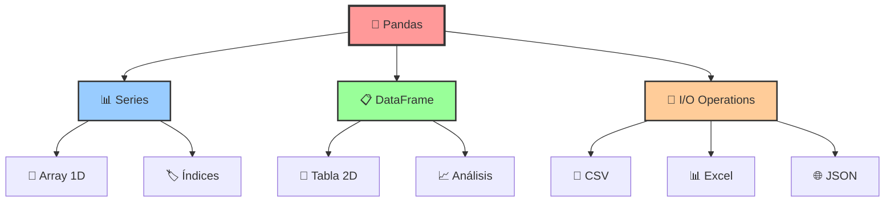
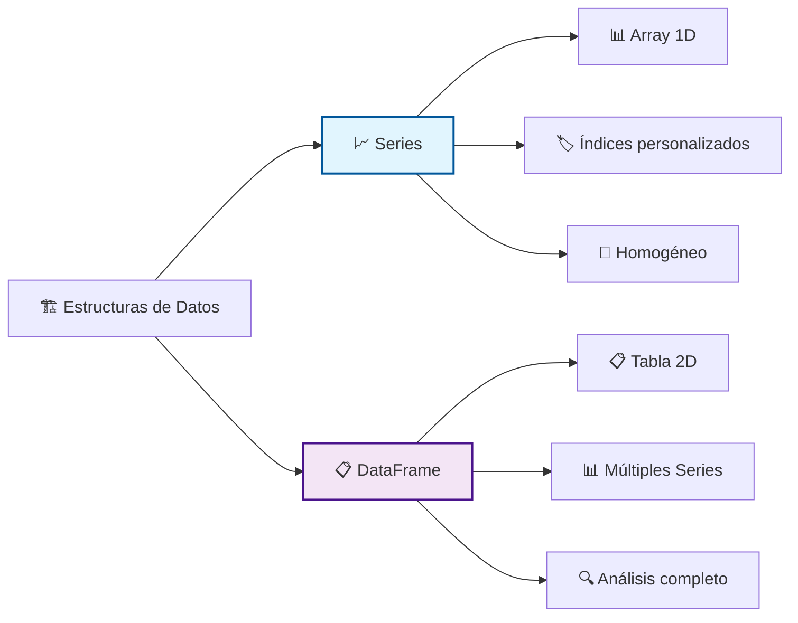
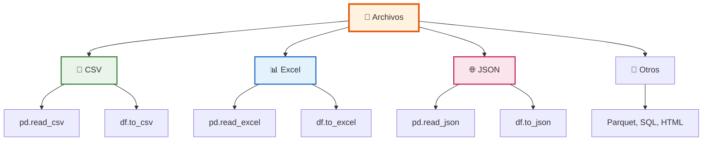
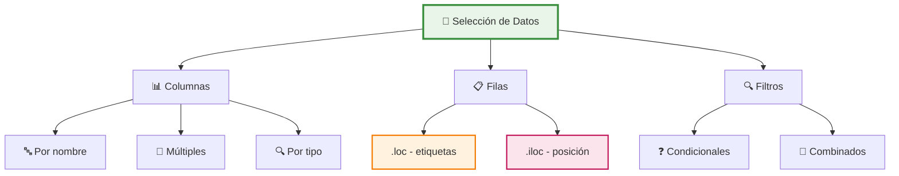

# Módulo 6.2: Introducción a Pandas

> [!quote] "Los datos son el nuevo petróleo, pero Pandas es la refinería que los transforma en conocimiento valioso." - Carlos Cedeño 🛢️→💎



## 📋 Objetivos del Módulo

> [!success]- **🎯 Metas de Aprendizaje** Al finalizar este módulo, serás capaz de:
> 
> - 🔍 **Comprender** qué es Pandas y su importancia en el ecosistema de datos
> - 🧱 **Dominar** las estructuras fundamentales: Series y DataFrame
> - 📂 **Manipular** archivos en múltiples formatos (CSV, Excel, JSON)
> - 🕵️ **Explorar** datasets para entender su estructura y contenido
> - 🎯 **Seleccionar** datos usando técnicas avanzadas de indexación
> - 🔍 **Filtrar** información con condiciones complejas

## 🐼 1. ¿Qué es Pandas?

> [!info]- **🌟 El Poder de Pandas** **Pandas** (Panel Data) es una biblioteca de código abierto que revoluciona el análisis de datos en Python. Inspirada en R y Excel, combina la simplicidad con el poder computacional de Python.
> 
> ### 🚀 ¿Por qué Pandas es tan popular?
> 
> |Característica|Descripción|Emoji|
> |---|---|---|
> |**Intuitivo**|Sintaxis clara que refleja el pensamiento analítico|🧠|
> |**Eficiente**|Optimizado para grandes volúmenes de datos|⚡|
> |**Versátil**|Compatible con 20+ formatos de archivo|🔄|
> |**Integrado**|Funciona perfectamente con NumPy, Matplotlib|🔗|
> |**Potente**|Operaciones complejas en pocas líneas|💪|

> [!tip]- **⚙️ Instalación y Configuración**
> 
> ```python
> # 📦 Instalación (ejecutar una sola vez)
> pip install pandas openpyxl xlrd
> 
> # 📚 Importación estándar
> import pandas as pd
> import numpy as np
> 
> # 🔧 Configuraciones útiles
> pd.set_option('display.max_columns', None)    # Mostrar todas las columnas
> pd.set_option('display.width', None)          # Ancho automático
> pd.set_option('display.max_colwidth', 100)    # Ancho máximo por columna
> 
> # ✅ Verificar versión
> print(f"Versión de Pandas: {pd.__version__}")
> ```

## 📊 2. Estructuras de Datos Fundamentales



> [!success]- **📈 Series: La Columna Inteligente** Una **Series** es un array unidimensional con etiquetas (índices). Es como una columna de Excel con superpoderes.
> 
> ### 🔑 Características Clave:
> 
> - **🎯 Homogénea**: Todos los elementos del mismo tipo
> - **🏷️ Indexada**: Cada valor tiene una etiqueta única
> - **🔀 Flexible**: Índice numérico, texto, fechas, etc.
> 
> ```python
> import pandas as pd
> 
> # 🍎 Crear Series desde lista
> frutas = pd.Series(['Manzana', 'Banana', 'Cereza', 'Durazno'])
> print("Series básica:")
> print(frutas)
> 
> # 💰 Series con índice personalizado
> precios = pd.Series([1.5, 0.8, 3.2, 2.1], 
>                   index=['Manzana', 'Banana', 'Cereza', 'Durazno'],
>                   name='Precios_USD')
> print("\nSeries con índice personalizado:")
> print(precios)
> ```
> 
> ### 🛠️ Operaciones Básicas:
> 
> ```python
> # 🎯 Acceso por índice
> print(f"Precio de Manzana: ${precios['Manzana']}")
> print(f"Primer elemento: ${precios.iloc[0]}")
> 
> # 🧮 Operaciones matemáticas
> precios_con_iva = precios * 1.12  # 12% de IVA
> print(f"Precios con IVA:\n{precios_con_iva}")
> 
> # 🔍 Filtrado
> frutas_caras = precios[precios > 2.0]
> print(f"Frutas caras (>$2):\n{frutas_caras}")
> 
> # 📊 Estadísticas
> print(f"Precio promedio: ${precios.mean():.2f}")
> print(f"Precio máximo: ${precios.max():.2f}")
> ```

> [!tip]- **📋 DataFrame: La Tabla de Datos Definitiva** El **DataFrame** es la estructura estrella de Pandas. Es una tabla bidimensional donde cada columna es una Series.
> 
> ### 🔍 Analogías para Entender DataFrame:
> 
> |Analogía|Descripción|Emoji|
> |---|---|---|
> |**Hoja de Excel**|Filas y columnas organizadas|📊|
> |**Base de datos**|Tabla con registros y campos|🗃️|
> |**Diccionario de listas**|Claves como columnas, valores como datos|📚|
> 
> ```python
> # 👥 Crear DataFrame desde diccionario
> datos_estudiantes = {
>    'Nombre': ['Ana García', 'Luis Pérez', 'Marta López', 'Juan Silva'],
>    'Edad': [20, 22, 19, 21],
>    'Ciudad': ['Quito', 'Guayaquil', 'Cuenca', 'Quito'],
>    'Carrera': ['Ingeniería', 'Medicina', 'Derecho', 'Ingeniería'],
>    'Promedio': [9.2, 8.7, 9.5, 8.9]
> }
> 
> df_estudiantes = pd.DataFrame(datos_estudiantes)
> print("DataFrame de estudiantes:")
> print(df_estudiantes)
> ```
> 
> ### 📏 Propiedades Esenciales:
> 
> ```python
> # 📐 Información estructural
> print(f"Dimensiones: {df_estudiantes.shape}")  # (filas, columnas)
> print(f"Columnas: {list(df_estudiantes.columns)}")
> print(f"Índice: {list(df_estudiantes.index)}")
> print(f"Tipos de datos:\n{df_estudiantes.dtypes}")
> 
> # ℹ️ Información general
> df_estudiantes.info()
> 
> # 📈 Estadísticas descriptivas
> print(df_estudiantes.describe())
> ```

> [!example]- **🎯 Múltiples Formas de Crear DataFrames**
> 
> ```python
> # 1️⃣ Desde diccionario de listas
> ventas_dict = {
>    'Producto': ['Laptop', 'Mouse', 'Teclado', 'Monitor'],
>    'Cantidad': [5, 20, 15, 8],
>    'Precio_Unitario': [800, 25, 45, 300]
> }
> df_ventas = pd.DataFrame(ventas_dict)
> 
> # 2️⃣ Desde lista de diccionarios
> empleados_list = [
>    {'nombre': 'Carlos', 'departamento': 'IT', 'salario': 3000},
>    {'nombre': 'María', 'departamento': 'Ventas', 'salario': 2800},
>    {'nombre': 'José', 'departamento': 'IT', 'salario': 3200}
> ]
> df_empleados = pd.DataFrame(empleados_list)
> 
> # 3️⃣ Desde array NumPy
> import numpy as np
> datos_random = np.random.randn(4, 3)
> df_random = pd.DataFrame(datos_random, 
>                        columns=['A', 'B', 'C'],
>                        index=['Fila1', 'Fila2', 'Fila3', 'Fila4'])
> 
> # 4️⃣ DataFrame vacío
> df_vacio = pd.DataFrame(columns=['Nombre', 'Edad', 'Ciudad'])
> ```

## 📁 3. Lectura y Escritura de Archivos



> [!success]- **📄 Lectura de Archivos CSV** Los archivos CSV son fundamentales en el análisis de datos. Pandas los maneja con elegancia.
> 
> ### 🔍 Lectura Básica:
> 
> ```python
> # 📂 Lectura simple
> df = pd.read_csv('datos_ventas.csv')
> 
> # ⚙️ Lectura con parámetros
> df = pd.read_csv('datos_ventas.csv',
>                 sep=',',           # Separador
>                 encoding='utf-8',  # Codificación
>                 index_col=0,       # Columna como índice
>                 header=0)          # Fila de encabezados
> 
> # 🔧 Para archivos problemáticos
> df = pd.read_csv('datos_sucios.csv',
>                 sep=';',                    # Separador ;
>                 decimal=',',                # Coma decimal
>                 thousands='.',              # Punto miles
>                 encoding='latin-1',         # Codificación
>                 na_values=['', 'N/A', 'NULL'])  # Valores nulos
> ```
> 
> ### 🎯 Parámetros Avanzados:
> 
> ```python
> # 📊 Leer columnas específicas
> df_parcial = pd.read_csv('datos_grandes.csv', 
>                        usecols=['Nombre', 'Edad', 'Salario'])
> 
> # 📏 Leer filas limitadas
> df_muestra = pd.read_csv('datos_grandes.csv', 
>                        nrows=1000,      # Primeras 1000 filas
>                        skiprows=5)      # Saltar 5 filas
> 
> # 🏷️ Especificar tipos
> tipos_datos = {
>    'ID': 'int64',
>    'Nombre': 'string',
>    'Activo': 'boolean'
> }
> df_tipado = pd.read_csv('empleados.csv', dtype=tipos_datos)
> ```

> [!tip]- **📊 Lectura de Archivos Excel** Excel sigue siendo omnipresente en el mundo empresarial.
> 
> ```python
> # 📋 Instalación necesaria
> # pip install openpyxl xlrd
> 
> # 📂 Lectura básica
> df = pd.read_excel('reporte_mensual.xlsx')
> 
> # 📑 Hoja específica
> df_ventas = pd.read_excel('reporte_anual.xlsx', sheet_name='Ventas_2024')
> 
> # 📚 Múltiples hojas
> diccionario_hojas = pd.read_excel('reporte_anual.xlsx', sheet_name=None)
> df_ventas = diccionario_hojas['Ventas_2024']
> df_gastos = diccionario_hojas['Gastos_2024']
> 
> # ⚙️ Parámetros avanzados
> df = pd.read_excel('reporte_complejo.xlsx',
>                  sheet_name='Datos',
>                  header=2,           # Encabezados en fila 3
>                  skiprows=[0, 1],    # Saltar filas 1 y 2
>                  usecols='A:E',      # Columnas A-E
>                  nrows=100)          # 100 filas
> ```

> [!example]- **🌐 JSON y Otros Formatos**
> 
> ```python
> # 🌐 JSON - Común con APIs
> df_usuarios = pd.read_json('usuarios_api.json')
> 
> # 🔄 JSON complejo
> df_normalizado = pd.json_normalize(data, record_path='usuarios')
> 
> # 📦 Otros formatos útiles
> df_pickle = pd.read_pickle('datos_procesados.pkl')     # Nativo Pandas
> df_parquet = pd.read_parquet('datos_grandes.parquet')  # Eficiente
> df_html = pd.read_html('https://example.com/tabla.html')[0]  # Tablas web
> 
> # 🗄️ Desde base de datos
> import sqlite3
> conn = sqlite3.connect('mi_base.db')
> df_sql = pd.read_sql_query('SELECT * FROM ventas WHERE año = 2024', conn)
> ```

> [!warning]- **💾 Escritura de Archivos**
> 
> ### 📄 Guardar en CSV:
> 
> ```python
> # 💾 Guardado básico
> df_estudiantes.to_csv('estudiantes_procesados.csv', index=False)
> 
> # ⚙️ Con parámetros específicos
> df_estudiantes.to_csv('estudiantes_especial.csv',
>                     index=False,           # Sin índice
>                     sep=';',               # Punto y coma
>                     encoding='utf-8',      # UTF-8
>                     decimal=',',           # Coma decimal
>                     float_format='%.2f')   # 2 decimales
> ```
> 
> ### 📊 Guardar en Excel:
> 
> ```python
> # 📋 Excel simple
> df_estudiantes.to_excel('estudiantes.xlsx', index=False)
> 
> # 📚 Excel múltiples hojas
> with pd.ExcelWriter('reporte_completo.xlsx') as writer:
>    df_estudiantes.to_excel(writer, sheet_name='Estudiantes', index=False)
>    df_ventas.to_excel(writer, sheet_name='Ventas', index=False)
>    df_empleados.to_excel(writer, sheet_name='Empleados', index=False)
> ```

## 🔍 4. Exploración de DataFrames

> [!info]- **🕵️ Comandos de Exploración Esenciales**
> 
> ```python
> # 🏗️ Crear dataset de ejemplo
> np.random.seed(42)
> datos_empleados = {
>    'ID': range(1, 101),
>    'Nombre': [f'Empleado_{i}' for i in range(1, 101)],
>    'Departamento': np.random.choice(['IT', 'Ventas', 'Marketing', 'RRHH'], 100),
>    'Salario': np.random.normal(50000, 15000, 100).round(2),
>    'Años_Experiencia': np.random.randint(0, 20, 100),
>    'Activo': np.random.choice([True, False], 100, p=[0.9, 0.1])
> }
> df_empresa = pd.DataFrame(datos_empleados)
> 
> # 📏 Información estructural
> print("=== INFORMACIÓN ESTRUCTURAL ===")
> print(f"Dimensiones: {df_empresa.shape}")
> print(f"Total de celdas: {df_empresa.size}")
> print(f"Memoria usada: {df_empresa.memory_usage(deep=True).sum() / 1024:.1f} KB")
> ```
> 
> ### 👀 Vista Rápida:
> 
> ```python
> # 🔝 Primeras filas
> print("Primeras 3 filas:")
> print(df_empresa.head(3))
> 
> # 🔚 Últimas filas
> print("Últimas 3 filas:")
> print(df_empresa.tail(3))
> 
> # 🎲 Muestra aleatoria
> print("Muestra aleatoria:")
> print(df_empresa.sample(5))
> 
> # ℹ️ Información detallada
> df_empresa.info()
> ```

> [!tip]- **📈 Análisis Estadístico Rápido**
> 
> ```python
> # 📊 Estadísticas descriptivas
> print("=== ESTADÍSTICAS DESCRIPTIVAS ===")
> print(df_empresa.describe())
> 
> # 🔤 Incluyendo categóricas
> print("Estadísticas completas:")
> print(df_empresa.describe(include='all'))
> 
> # 📋 Análisis categórico
> print("=== ANÁLISIS CATEGÓRICO ===")
> for col in ['Departamento', 'Activo']:
>    print(f"\nDistribución de {col}:")
>    conteos = df_empresa[col].value_counts()
>    porcentajes = df_empresa[col].value_counts(normalize=True) * 100
>    
>    for valor, conteo, pct in zip(conteos.index, conteos.values, porcentajes.values):
>        print(f"  {valor}: {conteo} ({pct:.1f}%)")
> ```

> [!success]- **⚠️ Diagnóstico de Calidad de Datos**
> 
> ```python
> def diagnostico_completo(df):
>    """
>    🔍 Función para diagnóstico completo de un DataFrame
>    """
>    print("🔍 DIAGNÓSTICO COMPLETO DEL DATASET")
>    print("=" * 50)
>    
>    # 📊 Información básica
>    print(f"📊 Dimensiones: {df.shape[0]:,} filas × {df.shape[1]} columnas")
>    print(f"💾 Memoria: {df.memory_usage(deep=True).sum() / 1024**2:.1f} MB")
>    
>    # 🕳️ Valores nulos
>    nulos = df.isnull().sum()
>    if nulos.sum() > 0:
>        print(f"\n⚠️  VALORES NULOS DETECTADOS:")
>        for col, count in nulos[nulos > 0].items():
>            pct = (count / len(df)) * 100
>            print(f"   {col}: {count:,} ({pct:.1f}%)")
>    else:
>        print(f"\n✅ Sin valores nulos")
>    
>    # 🔄 Duplicados
>    duplicados = df.duplicated().sum()
>    if duplicados > 0:
>        print(f"\n⚠️  DUPLICADOS: {duplicados:,} filas ({(duplicados/len(df)*100):.1f}%)")
>    else:
>        print(f"\n✅ Sin duplicados")
>    
>    return df.shape, nulos.sum(), duplicados
> 
> # 🚀 Aplicar diagnóstico
> diagnostico_completo(df_empresa)
> ```

## 🎯 5. Selección de Datos



> [!success]- **📊 Selección de Columnas**
> 
> ```python
> # 1️⃣ Una sola columna (devuelve Series)
> nombres = df_empresa['Nombre']
> print(f"Tipo: {type(nombres)}")
> 
> # 2️⃣ Múltiples columnas (devuelve DataFrame)
> info_basica = df_empresa[['Nombre', 'Departamento', 'Salario']]
> print(f"Columnas seleccionadas: {list(info_basica.columns)}")
> 
> # 3️⃣ Por tipo de datos
> columnas_numericas = df_empresa.select_dtypes(include=[np.number]).columns
> df_numerico = df_empresa[columnas_numericas]
> 
> # 4️⃣ Selección dinámica
> columnas_interes = ['Nombre', 'Salario', 'Años_Experiencia']
> columnas_disponibles = [col for col in columnas_interes if col in df_empresa.columns]
> df_filtrado = df_empresa[columnas_disponibles]
> ```

> [!tip]- **🎯 Selección de Filas: loc vs iloc**
> 
> ### 🔑 Diferencia Clave:
> 
> |Método|Descripción|Tipo|Rango|
> |---|---|---|---|
> |**`.loc`**|Por etiquetas/nombres|🏷️ Labels|Inclusivo|
> |**`.iloc`**|Por posición numérica|🔢 Position|Exclusivo|
> 
> ```python
> # 🏗️ Crear ejemplo con índice personalizado
> df_ejemplo = df_empresa.set_index('ID').head(10)
> 
> # === 🏷️ USANDO .loc (etiquetas) ===
> print("=== EJEMPLOS CON .loc ===")
> 
> # Por etiqueta de índice
> empleado_5 = df_ejemplo.loc[5]
> print(f"Empleado ID 5: {empleado_5['Nombre']}")
> 
> # Rango INCLUSIVO
> empleados_3_a_7 = df_ejemplo.loc[3:7]  # Incluye 3,4,5,6,7
> print(f"IDs 3-7: {len(empleados_3_a_7)} empleados")
> 
> # Filas y columnas específicas
> datos_especificos = df_ejemplo.loc[2:5, ['Nombre', 'Salario']]
> 
> # === 🔢 USANDO .iloc (posición) ===
> print("=== EJEMPLOS CON .iloc ===")
> 
> # Por posición
> primera_fila = df_ejemplo.iloc[0]  # Primera fila
> print(f"Primera fila: ID {primera_fila.name}")
> 
> # Rango EXCLUSIVO
> primeras_3 = df_ejemplo.iloc[0:3]  # Posiciones 0,1,2
> print(f"Primeras 3 filas: {len(primeras_3)} empleados")
> 
> # Última fila
> ultima_fila = df_ejemplo.iloc[-1]
> print(f"Última fila: ID {ultima_fila.name}")
> ```

## 🔍 6. Filtrado Condicional

> [!example]- **🔍 Filtros Básicos**
> 
> ```python
> # 💰 Filtros simples
> salarios_altos = df_empresa[df_empresa['Salario'] > 60000]
> print(f"Empleados con salario > $60,000: {len(salarios_altos)}")
> 
> # 🏢 Filtros con texto
> departamento_it = df_empresa[df_empresa['Departamento'] == 'IT']
> print(f"Empleados en IT: {len(departamento_it)}")
> 
> # ✅ Filtros booleanos
> empleados_activos = df_empresa[df_empresa['Activo'] == True]
> print(f"Empleados activos: {len(empleados_activos)}")
> 
> # 🌱 Empleados junior
> juniors = df_empresa.loc[df_empresa['Años_Experiencia'] < 5]
> print(f"Empleados junior (< 5 años): {len(juniors)}")
> ```

> [!tip]- **🔗 Filtros Combinados: Y, O, No**
> 
> ### 🧮 Operadores Lógicos:
> 
> |Operador|Símbolo|Descripción|Emoji|
> |---|---|---|---|
> |**Y (AND)**|`&`|Ambas condiciones verdaderas|✅|
> |**O (OR)**|`\|`|Al menos una verdadera|🔄|
> |**NO (NOT)**|`~`|Negación|❌|
> 
> ```python
> # ✅ Operador Y (&)
> it_seniors = df_empresa[
>    (df_empresa['Departamento'] == 'IT') & 
>    (df_empresa['Años_Experiencia'] >= 10)
> ]
> print(f"IT Seniors: {len(it_seniors)}")
> 
> # 🔄 Operador O (|)
> altos_o_expertos = df_empresa[
>    (df_empresa['Salario'] > 70000) | 
>    (df_empresa['Años_Experiencia'] > 15)
> ]
> print(f"Salario alto O mucha experiencia: {len(altos_o_expertos)}")
> 
> # ❌ Operador NO (~)
> no_it = df_empresa[~(df_empresa['Departamento'] == 'IT')]
> print(f"No IT: {len(no_it)}")
> 
> # 🎯 Filtro complejo
> perfil_especifico = df_empresa[
>    (df_empresa['Salario'].between(40000, 60000)) &
>    (df_empresa['Años_Experiencia'] >= 3) &
>    (df_empresa['Activo'] == True) &
>    (df_empresa['Departamento'].isin(['Ventas', 'Marketing']))
> ]
> print(f"Perfil específico: {len(perfil_especifico)}")
> ```

> [!success]- **🎯 Métodos Avanzados de Filtrado**
> 
> ```python
> # 📋 Usando .isin() para múltiples valores
> departamentos_objetivo = ['IT', 'Ventas']
> empleados_objetivo = df_empresa[
>    df_empresa['Departamento'].isin(departamentos_objetivo)
> ]
> print(f"IT y Ventas: {len(empleados_objetivo)}")
> 
> # 🔢 IDs específicos
> ids_interes = [1, 5, 10, 15, 20]
> empleados_especificos = df_empresa[
>    df_empresa['ID'].isin(ids_interes)
> ]
> 
> # 📊 Usando query() (alternativa elegante)
> resultado_query = df_empresa.query(
>    'Salario > 50000 and Departamento == "IT" and Activo == True'
> )
> print(f"Query result: {len(resultado_query)}")
> 
> # 🔍 Filtros con strings
> nombres_con_a = df_empresa[df_empresa['Nombre'].str.contains('a', case=False)]
> print(f"Nombres con 'a': {len(nombres_con_a)}")
> ```

## 🧠 Técnica de Estudio: Método PANDAS

> [!note]- **🎓 Mnemotecnia PANDAS** Para recordar los pasos del análisis de datos con Pandas:
> 
> **P** - **Preparar**: Importar pandas y configurar el entorno **A** - **Abrir**: Leer los archivos de datos (CSV, Excel, JSON) **N** - **Navegar**: Explorar el DataFrame (head, info, describe) **D** - **Detectar**: Identificar problemas (nulos, duplicados, tipos) **A** - **Analizar**: Aplicar filtros y selecciones **S** - **Salvar**: Guardar los resultados procesados
> 
> ### 🔄 Método de Repaso Espaciado:
> 
> - **Día 1**: Conceptos básicos (Series, DataFrame)
> - **Día 3**: Lectura de archivos y exploración
> - **Día 7**: Selección y filtrado avanzado
> - **Día 14**: Proyecto práctico completo
> - **Día 30**: Revisión general y casos complejos

## 🛠️ Ejercicios Prácticos

> [!example]- **🚀 Ejercicio 1: Análisis de Ventas**
> 
> ```python
> # 📊 Crear dataset de ventas
> import pandas as pd
> import numpy as np
> 
> ventas_data = {
>    'fecha': pd.date_range('2024-01-01', periods=100, freq='D'),
>    'producto': np.random.choice(['Laptop', 'Mouse', 'Teclado', 'Monitor'], 100),
>    'vendedor': np.random.choice(['Ana', 'Luis', 'María', 'Carlos'], 100),
>    'cantidad': np.random.randint(1, 10, 100),
>    'precio_unitario': np.random.choice([25, 45, 800, 300], 100),
>    'region': np.random.choice(['Norte', 'Sur', 'Este', 'Oeste'], 100)
> }
> 
> df_ventas = pd.DataFrame(ventas_data)
> df_ventas['total'] = df_ventas['cantidad'] * df_ventas['precio_unitario']
> 
> # ✅ Tareas:
> # 1. Explorar el dataset
> # 2. Encontrar las 5 ventas más altas
> # 3. Ventas por vendedor
> # 4. Productos más vendidos por región
> ```

> [!example]- **🎯 Ejercicio 2: Análisis Estudiantil**
> 
> ```python
> # 🎓 Dataset de estudiantes
> estudiantes_data = {
>    'nombre': [f'Estudiante_{i}' for i in range(1, 51)],
>    'edad': np.random.randint(18, 25, 50),
>    'carrera': np.random.choice(['Ingeniería', 'Medicina', 'Derecho', 'Economía'], 50),
>    'semestre': np.random.randint(1, 10, 50),
>    'promedio': np.random.normal(8.0, 1.5, 50).round(2),
>    'ciudad': np.random.choice(['Quito', 'Guayaquil', 'Cuenca', 'Ambato'], 50),
>    'beca': np.random.choice([True, False], 50, p=[0.3, 0.7])
> }
> 
> df_estudiantes = pd.DataFrame(estudiantes_data)
> 
> # ✅ Tareas:
> # 1. Estudiantes con beca y promedio > 8.5
> # 2. Distribución por carrera y ciudad
> # 3. Estudiantes de último semestre por carrera
> # 4. Análisis estadístico por carrera
> ```

## 🔗 Referencias y Conexiones

> [!quote]- **📚 Referencias a Otras Notas**
> 
> - [[Módulo 6.1 Introducción a NumPy]] - Base matemática para Pandas
> - [[Módulo 5.1 Diccionarios]] - Estructura similar a DataFrames
> - [[Módulo 2.3 Listas y Tuplas en Python]] - Fundamentos de estructuras de datos
> - [[Funciones Built-in]] - Funciones que complementan Pandas
> - [[Manejo de Errores con try, except, finally]] - Para lectura robusta de archivos

> [!info]- **🎯 Notas Recomendadas**
> 
> ### 📋 Prerrequisitos:
> 
> - Conocimiento básico de Python
> - Manejo de listas y diccionarios
> - Conceptos de programación orientada a objetos
> 
> ### 🚀 Próximos Pasos:
> 
> - Visualización de datos con Matplotlib
> - Análisis estadístico avanzado
> - Machine Learning con scikit-learn
> - Manipulación avanzada de datos

## 📊 Comparativa: Pandas vs Otras Herramientas

> [!tip]- **⚖️ Pandas vs Competidores**
> 
> |Herramienta|Fortalezas|Debilidades|Caso de Uso|
> |---|---|---|---|
> |**🐼 Pandas**|Versatilidad, ecosistema Python|Memoria limitada|Análisis general|
> |**📊 Excel**|Interfaz visual, familiar|Escalabilidad limitada|Análisis básico|
> |**🔍 SQL**|Grandes datos, velocidad|Curva aprendizaje|Bases de datos|
> |**📈 R**|Estadística avanzada|Sintaxis compleja|Investigación|
> |**⚡ Spark**|Big Data, distribución|Complejidad setup|Datos masivos|

## 🎨 Proyecto Final: Dashboard de Datos

> [!success]- **🏆 Proyecto Integrador**
> 
> ```python
> # 🎯 Crear un análisis completo de datos empresariales
> import pandas as pd
> import numpy as np
> from datetime import datetime, timedelta
> 
> class AnalizadorEmpresarial:
>    def __init__(self):
>        self.df = None
>        
>    def generar_datos_muestra(self, n_empleados=200):
>        """🏭 Generar dataset empresarial realista"""
>        np.random.seed(42)
>        
>        datos = {
>            'id_empleado': range(1, n_empleados + 1),
>            'nombre': [f'Empleado_{i}' for i in range(1, n_empleados + 1)],
>            'departamento': np.random.choice(
>                ['IT', 'Ventas', 'Marketing', 'RRHH', 'Finanzas'], 
>                n_empleados, 
>                p=[0.3, 0.25, 0.15, 0.15, 0.15]
>            ),
>            'cargo': np.random.choice(
>                ['Junior', 'Senior', 'Lead', 'Manager'], 
>                n_empleados,
>                p=[0.4, 0.35, 0.15, 0.1]
>            ),
>            'salario': np.random.normal(50000, 20000, n_empleados).round(2),
>            'años_experiencia': np.random.randint(0, 20, n_empleados),
>            'fecha_ingreso': [
>                datetime.now() - timedelta(days=np.random.randint(30, 3650))
>                for _ in range(n_empleados)
>            ],
>            'activo': np.random.choice([True, False], n_empleados, p=[0.95, 0.05]),
>            'satisfaccion': np.random.randint(1, 11, n_empleados),
>            'ciudad': np.random.choice(
>                ['Quito', 'Guayaquil', 'Cuenca', 'Ambato'], 
>                n_empleados
>            )
>        }
>        
>        self.df = pd.DataFrame(datos)
>        return self.df
>    
>    def diagnostico_completo(self):
>        """🔍 Análisis completo del dataset"""
>        print("🏢 REPORTE EMPRESARIAL COMPLETO")
>        print("=" * 60)
>        
>        # Información básica
>        print(f"👥 Total empleados: {len(self.df):,}")
>        print(f"🏢 Departamentos: {self.df['departamento'].nunique()}")
>        print(f"🌍 Ciudades: {self.df['ciudad'].nunique()}")
>        
>        # Análisis salarial
>        print(f"\n💰 ANÁLISIS SALARIAL:")
>        print(f"Salario promedio: ${self.df['salario'].mean():,.2f}")
>        print(f"Salario mediano: ${self.df['salario'].median():,.2f}")
>        print(f"Rango salarial: ${self.df['salario'].min():,.2f} - ${self.df['salario'].max():,.2f}")
>        
>        # Por departamento
>        print(f"\n🏢 POR DEPARTAMENTO:")
>        dept_stats = self.df.groupby('departamento').agg({
>            'salario': ['mean', 'count'],
>            'satisfaccion': 'mean'
>        }).round(2)
>        print(dept_stats)
>        
>        return dept_stats
>    
>    def empleados_destacados(self):
>        """🌟 Identificar empleados destacados"""
>        # Criterios: Alta satisfacción, buen salario, experiencia
>        destacados = self.df[
>            (self.df['satisfaccion'] >= 8) &
>            (self.df['años_experiencia'] >= 5) &
>            (self.df['salario'] > self.df['salario'].quantile(0.75))
>        ].sort_values('satisfaccion', ascending=False)
>        
>        print(f"🌟 EMPLEADOS DESTACADOS ({len(destacados)}):")
>        for _, emp in destacados.head(10).iterrows():
>            print(f"• {emp['nombre']} - {emp['departamento']} - "
>                  f"Satisfacción: {emp['satisfaccion']}/10")
>        
>        return destacados
> 
> # 🚀 Usar el analizador
> analizador = AnalizadorEmpresarial()
> df_empresa = analizador.generar_datos_muestra(300)
> analizador.diagnostico_completo()
> analizador.empleados_destacados()
> ```

## 🎯 Casos de Uso Reales

> [!example]- **🌟 Aplicaciones en el Mundo Real**
> 
> ### 🏪 **Retail y E-commerce**
> 
> ```python
> # Análisis de comportamiento del cliente
> analisis_clientes = df_ventas.groupby('cliente_id').agg({
>    'total_compra': ['sum', 'mean', 'count'],
>    'fecha_compra': ['min', 'max']
> })
> ```
> 
> ### 🏥 **Salud y Medicina**
> 
> ```python
> # Análisis de datos médicos
> pacientes_riesgo = df_pacientes[
>    (df_pacientes['presion_sistolica'] > 140) |
>    (df_pacientes['colesterol'] > 240)
> ]
> ```
> 
> ### 📊 **Finanzas**
> 
> ```python
> # Análisis de riesgo crediticio
> clientes_alto_riesgo = df_creditos[
>    (df_creditos['ingresos'] < 30000) &
>    (df_creditos['deuda_actual'] > df_creditos['ingresos'] * 0.4)
> ]
> ```
> 
> ### 🎓 **Educación**
> 
> ```python
> # Análisis de rendimiento académico
> estudiantes_en_riesgo = df_estudiantes[
>    (df_estudiantes['promedio'] < 7.0) &
>    (df_estudiantes['asistencia'] < 0.8)
> ]
> ```

## 🔧 Consejos y Mejores Prácticas

> [!warning]- **⚠️ Errores Comunes y Cómo Evitarlos**
> 
> ### 🚨 **Top 5 Errores de Principiantes**
> 
> |Error|Problema|Solución|Código|
> |---|---|---|---|
> |**🔗 Chained Indexing**|`df['A'][0] = valor`|Usar .loc|`df.loc[0, 'A'] = valor`|
> |**🧠 Copia vs Vista**|Modificar sin copy()|Usar .copy()|`df_nuevo = df.copy()`|
> |**📊 Tipos de Datos**|No verificar dtypes|Siempre revisar|`df.dtypes`|
> |**🕳️ Valores Nulos**|Ignorar NaN|Manejar explícitamente|`df.fillna()` o `df.dropna()`|
> |**⚡ Rendimiento**|Loops innecesarios|Usar vectorización|Métodos de pandas|
> 
> ### ✅ **Mejores Prácticas**
> 
> ```python
> # ✅ HACER
> df_limpio = df.copy()  # Trabajar con copias
> df.dtypes  # Verificar tipos de datos
> df.memory_usage(deep=True)  # Monitorear memoria
> 
> # ❌ EVITAR
> for i in range(len(df)):  # Loops lentos
>    df.iloc[i, 0] = valor
> ```

## 🚀 Recursos Adicionales

> [!info]- **📚 Para Profundizar**
> 
> ### 🔗 **Enlaces Útiles**
> 
> - [Documentación Oficial de Pandas](https://pandas.pydata.org/docs/)
> - [Pandas Cheat Sheet](https://pandas.pydata.org/Pandas_Cheat_Sheet.pdf)
> - [10 Minutes to Pandas](https://pandas.pydata.org/docs/user_guide/10min.html)
> 
> ### 📖 **Libros Recomendados**
> 
> - "Python for Data Analysis" - Wes McKinney
> - "Hands-On Data Analysis with Pandas" - Stefanie Molin
> - "Data Science from Scratch" - Joel Grus
> 
> ### 🎥 **Cursos Online**
> 
> - DataCamp: Pandas Fundamentals
> - Coursera: Data Analysis with Python
> - edX: Introduction to Data Science

## 🏁 Resumen Ejecutivo

> [!abstract]- **📋 Puntos Clave del Módulo**
> 
> ### 🎯 **Conceptos Esenciales Dominados**
> 
> - ✅ **Pandas**: La herramienta fundamental para análisis de datos
> - ✅ **Series**: Arrays 1D con índices personalizados
> - ✅ **DataFrame**: Tablas 2D para análisis completo
> - ✅ **I/O Operations**: Lectura/escritura de múltiples formatos
> - ✅ **Exploración**: Técnicas para conocer tus datos
> - ✅ **Selección**: .loc vs .iloc para acceso preciso
> - ✅ **Filtrado**: Consultas condicionales complejas
> 
> ### 🚀 **Próximos Pasos**
> 
> 1. **Práctica diaria** con datasets reales
> 2. **Combinar** con visualización (Matplotlib/Seaborn)
> 3. **Integrar** con Machine Learning (scikit-learn)
> 4. **Explorar** funciones avanzadas (groupby, pivot, merge)

---

#pandas #dataanalysis #python #datastructures #csv #excel #json #dataexploration #filtering #indexing #datascience #programming #fundamentals