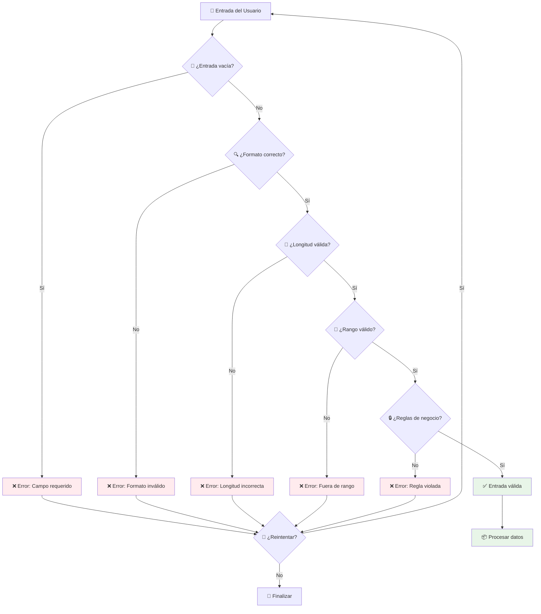

# ✅ Validación de Entradas de Usuario

> [!info] 🛡️ ¿Por qué Validar Entradas?
> La validación de entradas es crucial para crear programas robustos y seguros. Permite verificar que los datos ingresados por el usuario cumplan con los requisitos esperados antes de procesarlos, evitando errores, fallos del programa y comportamientos inesperados. Es una práctica fundamental en el desarrollo de software profesional.

## 🔍 Métodos de Validación Built-in

### Validación de Tipos Numéricos

> [!tip] 🔢 Métodos para Números
> 
> **`isdigit()`** - Solo dígitos (0-9)
> ```python
> "123".isdigit()     # True
> "12.5".isdigit()    # False (contiene punto)
> "-123".isdigit()    # False (contiene signo)
> "abc".isdigit()     # False
> ```
> 
> **`isnumeric()`** - Caracteres numéricos (incluye Unicode)
> ```python
> "123".isnumeric()   # True
> "½".isnumeric()     # True (fracción Unicode)
> "Ⅴ".isnumeric()     # True (número romano Unicode)
> "12.5".isnumeric()  # False
> ```
> 
> **`isdecimal()`** - Solo dígitos decimales (0-9)
> ```python
> "123".isdecimal()   # True
> "½".isdecimal()     # False
> "12.5".isdecimal()  # False
> ```

### Validación de Texto y Caracteres

> [!tip] 📝 Métodos para Strings
> 
> **`isalpha()`** - Solo letras
> ```python
> "Python".isalpha()     # True
> "Hello123".isalpha()   # False
> "Hola-mundo".isalpha() # False (contiene guión)
> ```
> 
> **`isalnum()`** - Letras y números
> ```python
> "Python3".isalnum()    # True
> "Usuario123".isalnum() # True
> "test@email".isalnum() # False (contiene @)
> ```
> 
> **`isspace()`** - Solo espacios en blanco
> ```python
> "   ".isspace()        # True
> "\t\n ".isspace()      # True
> "a b".isspace()        # False
> ```
> 
> **`islower()`** / **`isupper()`** - Caso de letras
> ```python
> "python".islower()     # True
> "PYTHON".isupper()     # True
> "Python".islower()     # False
> ```

## 🎯 Funciones de Validación Personalizadas

### Validación de Números con Manejo de Errores

> [!example] 🔧 Funciones Robustas
> ```python
> def validar_entero(entrada):
>     """Valida si una entrada es un número entero válido"""
>     entrada = entrada.strip()  # Eliminar espacios
>     
>     # Verificar si está vacío
>     if not entrada:
>         return False, "La entrada no puede estar vacía"
>     
>     # Verificar signo negativo
>     if entrada.startswith('-'):
>         return entrada[1:].isdigit(), "Debe ser un número entero válido"
>     
>     return entrada.isdigit(), "Debe ser un número entero válido"
> 
> def validar_decimal(entrada):
>     """Valida si una entrada es un número decimal válido"""
>     try:
>         float(entrada)
>         return True, "Válido"
>     except ValueError:
>         return False, "Debe ser un número decimal válido"
> 
> def obtener_entero_seguro(mensaje, min_val=None, max_val=None):
>     """Solicita un entero al usuario con validación completa"""
>     while True:
>         entrada = input(mensaje)
>         es_valido, error = validar_entero(entrada)
>         
>         if not es_valido:
>             print(f"❌ Error: {error}")
>             continue
>         
>         numero = int(entrada)
>         
>         # Validar rango si se especifica
>         if min_val is not None and numero < min_val:
>             print(f"❌ El número debe ser mayor o igual a {min_val}")
>             continue
>         
>         if max_val is not None and numero > max_val:
>             print(f"❌ El número debe ser menor o igual a {max_val}")
>             continue
>         
>         return numero
> ```

### Validación de Formatos Específicos

> [!example] 📋 Formatos Comunes
> ```python
> import re
> 
> def validar_email(email):
>     """Valida formato básico de email"""
>     patron = r'^[a-zA-Z0-9._%+-]+@[a-zA-Z0-9.-]+\.[a-zA-Z]{2,}$'
>     return re.match(patron, email) is not None
> 
> def validar_telefono(telefono):
>     """Valida formato de teléfono (ej: +593-99-123-4567)"""
>     # Eliminar espacios y guiones
>     telefono_limpio = telefono.replace(' ', '').replace('-', '')
>     
>     # Verificar si empieza con + y el resto son dígitos
>     if telefono_limpio.startswith('+'):
>         return telefono_limpio[1:].isdigit() and len(telefono_limpio) >= 10
>     
>     # O si son solo dígitos
>     return telefono_limpio.isdigit() and len(telefono_limpio) >= 9
> 
> def validar_cedula_ecuador(cedula):
>     """Valida cédula ecuatoriana (10 dígitos)"""
>     if not cedula.isdigit() or len(cedula) != 10:
>         return False
>     
>     # Verificar provincia (primeros 2 dígitos)
>     provincia = int(cedula[:2])
>     if provincia < 1 or provincia > 24:
>         return False
>     
>     # Algoritmo de verificación simplificado
>     coeficientes = [2, 1, 2, 1, 2, 1, 2, 1, 2]
>     suma = 0
>     
>     for i in range(9):
>         digito = int(cedula[i]) * coeficientes[i]
>         if digito > 9:
>             digito -= 9
>         suma += digito
>     
>     digito_verificador = (10 - (suma % 10)) % 10
>     return digito_verificador == int(cedula[9])
> 
> def validar_contrasena(contrasena):
>     """Valida fortaleza de contraseña"""
>     if len(contrasena) < 8:
>         return False, "Debe tener al menos 8 caracteres"
>     
>     if not any(c.isupper() for c in contrasena):
>         return False, "Debe contener al menos una mayúscula"
>     
>     if not any(c.islower() for c in contrasena):
>         return False, "Debe contener al menos una minúscula"
>     
>     if not any(c.isdigit() for c in contrasena):
>         return False, "Debe contener al menos un número"
>     
>     if not any(c in "!@#$%^&*()_+-=[]{}|;:,.<>?" for c in contrasena):
>         return False, "Debe contener al menos un carácter especial"
>     
>     return True, "Contraseña válida"
> ```

## 🔄 Bucles de Validación Inteligentes

### Sistema de Validación con Reintentos

> [!warning] 🔁 Bucles de Validación
> ```python
> def obtener_entrada_valida(mensaje, validador, max_intentos=3):
>     """Sistema genérico de validación con límite de intentos"""
>     intentos = 0
>     
>     while intentos < max_intentos:
>         entrada = input(f"{mensaje} (Intento {intentos + 1}/{max_intentos}): ")
>         
>         es_valido, mensaje_error = validador(entrada)
>         
>         if es_valido:
>             return entrada
>         
>         print(f"❌ {mensaje_error}")
>         intentos += 1
>     
>     print(f"⚠️ Se agotaron los intentos. Usando valor por defecto.")
>     return None
> 
> def validador_edad(entrada):
>     """Validador específico para edad"""
>     if not entrada.isdigit():
>         return False, "La edad debe ser un número"
>     
>     edad = int(entrada)
>     if edad < 0 or edad > 150:
>         return False, "La edad debe estar entre 0 y 150 años"
>     
>     return True, "Edad válida"
> 
> # Uso del sistema
> edad = obtener_entrada_valida(
>     "Ingrese su edad", 
>     validador_edad, 
>     max_intentos=3
> )
> ```

### Menú de Opciones con Validación

> [!example] 📋 Sistema de Menús
> ```python
> def mostrar_menu_con_validacion():
>     """Menú interactivo con validación robusta"""
>     opciones = {
>         '1': 'Ver perfil',
>         '2': 'Configuraciones',
>         '3': 'Ayuda',
>         '4': 'Salir'
>     }
>     
>     while True:
>         print("\n" + "="*30)
>         print("🏠 MENÚ PRINCIPAL")
>         print("="*30)
>         
>         for clave, descripcion in opciones.items():
>             print(f"{clave}. {descripcion}")
>         
>         print("="*30)
>         
>         opcion = input("Seleccione una opción: ").strip()
>         
>         # Validación
>         if not opcion:
>             print("❌ Debe ingresar una opción")
>             continue
>         
>         if opcion not in opciones:
>             print(f"❌ Opción '{opcion}' no válida. Opciones disponibles: {', '.join(opciones.keys())}")
>             continue
>         
>         # Procesar opción válida
>         print(f"✅ Seleccionó: {opciones[opcion]}")
>         
>         if opcion == '4':
>             print("👋 ¡Hasta luego!")
>             break
>         
>         # Aquí iría la lógica de cada opción
>         input("Presione Enter para continuar...")
> ```

## 📊 Diagrama de Flujo de Validación



## 💻 Sistema Completo de Registro

> [!example] 🎓 Caso Práctico Integral
> ```python
> class ValidadorRegistro:
>     @staticmethod
>     def obtener_datos_usuario():
>         """Sistema completo de registro con validación"""
>         print("🎯 SISTEMA DE REGISTRO")
>         print("="*40)
>         
>         # Obtener nombre
>         while True:
>             nombre = input("📝 Nombre completo: ").strip()
>             if not nombre:
>                 print("❌ El nombre no puede estar vacío")
>                 continue
>             if not all(c.isalpha() or c.isspace() for c in nombre):
>                 print("❌ El nombre solo puede contener letras y espacios")
>                 continue
>             if len(nombre) < 2:
>                 print("❌ El nombre debe tener al menos 2 caracteres")
>                 continue
>             break
>         
>         # Obtener edad
>         edad = obtener_entero_seguro("🎂 Edad: ", min_val=0, max_val=150)
>         
>         # Obtener email
>         while True:
>             email = input("📧 Email: ").strip()
>             if validar_email(email):
>                 break
>             print("❌ Formato de email inválido")
>         
>         # Obtener teléfono
>         while True:
>             telefono = input("📱 Teléfono: ").strip()
>             if validar_telefono(telefono):
>                 break
>             print("❌ Formato de teléfono inválido")
>         
>         # Obtener contraseña
>         while True:
>             contrasena = input("🔐 Contraseña: ")
>             es_valida, mensaje = validar_contrasena(contrasena)
>             if es_valida:
>                 break
>             print(f"❌ {mensaje}")
>         
>         # Confirmar datos
>         print("\n" + "="*40)
>         print("📋 RESUMEN DE DATOS:")
>         print(f"Nombre: {nombre}")
>         print(f"Edad: {edad}")
>         print(f"Email: {email}")
>         print(f"Teléfono: {telefono}")
>         print("="*40)
>         
>         confirmacion = input("¿Los datos son correctos? (s/n): ").lower()
>         if confirmacion in ['s', 'si', 'sí', 'yes', 'y']:
>             print("✅ Registro completado exitosamente!")
>             return {
>                 'nombre': nombre,
>                 'edad': edad,
>                 'email': email,
>                 'telefono': telefono
>             }
>         else:
>             print("❌ Registro cancelado")
>             return None
> 
> # Ejecutar el sistema
> if __name__ == "__main__":
>     usuario = ValidadorRegistro.obtener_datos_usuario()
>     if usuario:
>         print(f"Bienvenido/a, {usuario['nombre']}! 🎉")
> ```

## 🛡️ Mejores Prácticas

> [!warning] ⚠️ Consejos de Seguridad
> 
> **1. Nunca confíes en la entrada del usuario**
> - Siempre valida antes de procesar
> - Usa listas blancas en lugar de listas negras
> 
> **2. Proporciona mensajes de error claros**
> ```python
> # ❌ Malo
> print("Error")
> 
> # ✅ Bueno  
> print("❌ La edad debe ser un número entre 0 y 150")
> ```
> 
> **3. Limita los intentos de entrada**
> ```python
> intentos = 0
> max_intentos = 3
> while intentos < max_intentos:
>     # lógica de validación
>     intentos += 1
> ```
> 
> **4. Sanitiza las entradas**
> ```python
> entrada = entrada.strip().lower()  # Limpiar espacios y normalizar
> ```

---

## 📚 Referencias

> [!quote] 🔗 Enlaces a Otras Notas
> - [[Funciones Built-in]] - Métodos isdigit(), isalpha(), etc.
> - [[Módulo 4.2 Iteradores for]] - Bucles para validación repetitiva
> - [[Módulo 4.1 Condicional]] - Lógica de validación
> - [[Módulo 3.1 Funciones]] - Crear validadores personalizados
> - [[Módulo 2.1 Variables y Tipos de Datos]] - Conversiones seguras
> - [[Módulo 4.3 Bucle While]] - Bucles de validación hasta condición

## 🎓 Notas Recomendadas

> [!note] 📖 Para Complementar tu Aprendizaje
> - [[Manejo de Errores con try, except, finally]] - try/except para validación robusta
> - [[Expresiones Regulares (Regex)]] - Validación de patrones complejos
> - [[Módulos datetime]] - Validación de fechas
> - [[Seguridad en Python]] - Buenas prácticas de seguridad
> - [[Testing y Debugging]] - Probar funciones de validación
> - [[Interfaces de Usuario]] - Validación en aplicaciones GUI

---

**Tags:** #python #validacion #entrada-usuario #seguridad #robustez #input #isdigit #formato #verificacion #buenas-practicas #error-handling #user-experience