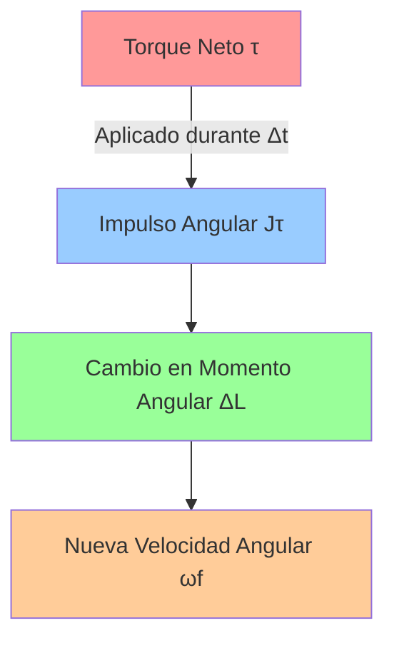
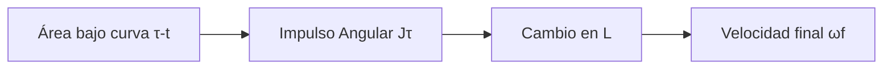

# 🌟 Conservación del Momento Angular

> [!abstract] 📋 Resumen El **momento angular** ($\vec{L}$) es el equivalente rotacional del momento lineal, describiendo la "inercia de rotación" de un objeto. Su principio de conservación establece que si el torque externo neto es cero, el momento angular total del sistema permanece constante. Es una de las leyes fundamentales de la física junto con la conservación de energía y momentum lineal.

---

## 🔍 Contexto y Definición

> [!info] 💡 Concepto Fundamental El **momento angular** es la cantidad de movimiento rotacional de un sistema. Al igual que el momentum lineal describe la tendencia de un objeto a mantener su movimiento rectilíneo, el momento angular describe la tendencia a mantener su movimiento rotacional.

> [!note] 🎯 Principio de Conservación **Si el torque externo neto sobre un sistema es cero, el momento angular total del sistema se mantiene constante.**
> 
> Esta ley explica fenómenos desde patinadores de hielo hasta el movimiento de planetas.

---

> [!note] 📊 Variables Fundamentales
> 
> |Variable|Símbolo|Unidades|Descripción|
> |---|---|---|---|
> |Momento Angular|$\vec{L}$|$\text{kg·m}^2/\text{s}$ o $\text{J·s}$|Magnitud vectorial rotacional|
> |Momento de Inercia|$I$|$\text{kg·m}^2$|Resistencia al cambio rotacional|
> |Velocidad Angular|$\omega$|$\text{rad/s}$|Rapidez de rotación|
> |Torque Neto|$\sum \tau$|$\text{N·m}$|Causa del cambio angular|
> |Momento Angular (partícula)|$\vec{L} = \vec{r} \times \vec{p}$|$\text{kg·m}^2/\text{s}$|Producto vectorial posición-momentum|

---

## ⚖️ Ecuaciones Fundamentales

> [!note] 🔧 Fórmulas Clave
> 
> ### Momento Angular de un Cuerpo Rígido
> 
> $$L = I\omega$$
> 
> ### Segunda Ley de Newton (Rotacional)
> 
> $$\sum \vec{\tau}_{ext} = \frac{d\vec{L}}{dt}$$
> 
> ### Principio de Conservación
> 
> **Condición:** $\sum \vec{\tau}_{ext} = 0$
> 
> $$L_{inicial} = L_{final}$$ $$I_{inicial}\omega_{inicial} = I_{final}\omega_{final}$$

> [!warning] ⚠️ Condición Crítica La conservación del momento angular **solo** se cumple cuando el torque externo neto es **cero**. Los torques internos siempre se cancelan por la Tercera Ley de Newton.

---

## 🔄 Mecanismo de Conservación

> [!info] 🎯 Proceso de Conservación
> 
> ```mermaid
> flowchart TD
>    A[🌟 Sistema Rotacional] --> B{🔍 ¿Torque externo neto = 0?}
>    B -->|Sí| C[✅ Momento Angular se Conserva]
>    B -->|No| D[❌ Momento Angular cambia]
>    C --> E[📐 L_inicial = L_final]
>    D --> F[⚖️ Aplicar Segunda Ley Newton]
>    E --> G[🔄 I₁ω₁ = I₂ω₂]
>    F --> H[📈 τ = dL/dt]
>    
>    style A fill:#e1f5fe
>    style C fill:#c8e6c9
>    style D fill:#ffcdd2
>    style G fill:#fff3e0
> ```

---

## 🎭 Ejemplos Clásicos

> [!example] ⛸️ Ejemplo 1: Patinador de Hielo
> 
> **📋 Situación:** Un patinador gira con los brazos extendidos y luego los junta al cuerpo.
> 
> **🔧 Análisis:**
> 
> - **Estado inicial:** Brazos extendidos → $I_1$ grande, $\omega_1$ moderada
> - **Estado final:** Brazos juntos → $I_2$ pequeña, $\omega_2$ grande
> 
> **⚖️ Aplicación de conservación:** $$I_1\omega_1 = I_2\omega_2$$ $$\omega_2 = \frac{I_1}{I_2}\omega_1$$
> 
> **📊 Resultado:** Como $I_2 < I_1$, entonces $\omega_2 > \omega_1$ (gira más rápido)

> [!example] 🏊 Ejemplo 2: Clavadista en Tirabuzón
> 
> **📋 Situación:** Un clavadista realiza múltiples giros cambiando su posición corporal.
> 
> **🔧 Secuencia:**
> 
> 1. **Salto:** Brazos y piernas extendidos → $I$ grande, $\omega$ pequeña
> 2. **Encogimiento:** Posición fetal → $I$ pequeña, $\omega$ grande (giros rápidos)
> 3. **Entrada:** Extensión corporal → $I$ grande, $\omega$ pequeña (se detiene)
> 
> **📊 Ventaja:** Control preciso de la velocidad de rotación sin torques externos

> [!example] 🌍 Ejemplo 3: Sistema Tierra-Luna
> 
> **📋 Situación:** La Tierra rota sobre su eje y orbita alrededor del Sol.
> 
> **🔧 Conservación:**
> 
> - **Rotación diaria:** Momento angular constante (días de 24 horas)
> - **Órbita anual:** Momento angular orbital constante
> - **Sistema Sol-Tierra:** Torque externo neto ≈ 0
> 
> **📊 Implicación:** Estabilidad a largo plazo del sistema solar

---

## 📈 Análisis Gráfico

> [!info] 📊 Gráfica: Momento Angular vs Tiempo
> 
> ```mermaid
> graph LR
>    A[📈 Gráfica L vs t] --> B{Forma de la curva}
>    B -->|Línea horizontal| C[✅ τ = 0, L conservado]
>    B -->|Pendiente constante| D[⚖️ τ constante]
>    B -->|Curva| E[📈 τ variable]
>    
>    style C fill:#c8e6c9
>    style D fill:#fff3e0
>    style E fill:#ffcdd2
> ```
> 
> **Interpretación:** La pendiente de $L$ vs $t$ representa el torque neto externo.

---

## 🔗 Analogías con Dinámica Lineal

> [!summary] ⚖️ Comparación: Lineal vs Rotacional
> 
> |Aspecto|**Movimiento Lineal**|**Movimiento Rotacional**|
> |---|---|---|
> |**Cantidad de movimiento**|Momentum $p = mv$|Momento angular $L = I\omega$|
> |**Segunda Ley**|$F = \frac{dp}{dt}$|$\tau = \frac{dL}{dt}$|
> |**Conservación**|Si $\sum F_{ext} = 0$ entonces $p$ = constante|Si $\sum \tau_{ext} = 0$ entonces $L$ = constante|
> |**Inercia**|Masa $m$|Momento de inercia $I$|
> |**Velocidad**|Velocidad $v$|Velocidad angular $\omega$|
> |**Impulso**|$J = F\Delta t = \Delta p$|$J_{angular} = \tau\Delta t = \Delta L$|

> [!tip] 🎯 Paralelismo Conceptual Todo concepto en dinámica lineal tiene su análogo rotacional. Esta analogía facilita enormemente el aprendizaje y aplicación de ambos tipos de movimiento.

---

## 💫 Aplicaciones y Fenómenos

> [!note] 🌟 Fenómenos Naturales
> 
> ### 🌪️ **Huracanes y Tornados**
> 
> - Conservación del momento angular explica por qué se intensifican al contraerse
> - Radio menor → velocidad angular mayor
> 
> ### 🪐 **Formación de Planetas**
> 
> - Colapso gravitacional de nubes de gas
> - Conservación explica la rotación planetaria
> 
> ### 🚁 **Helicópteros**
> 
> - Rotor principal y rotor de cola
> - Compensación del momento angular para estabilidad

> [!note] 🏃 Aplicaciones Deportivas
> 
> ### ⛸️ **Patinaje Artístico**
> 
> - Control de velocidad de giro
> - Cambio de momento de inercia corporal
> 
> ### 🤸 **Gimnasia**
> 
> - Saltos con giros múltiples
> - Posición del cuerpo determina velocidad angular
> 
> ### 🏈 **Deportes con Balón**
> 
> - Efecto spin en pelotas
> - Estabilidad giroscópica en vuelo

---

## 🧮 Problemas Tipo

> [!example] 🔧 Ejercicio 1: Volante que se Detiene
> 
> **📋 Problema:** Un volante con momento de inercia $I$ gira con velocidad angular $\omega$. Una fricción produce torque constante $\tau$ que lo detiene en tiempo $t$. Encontrar el torque de fricción.
> 
> **🔧 Solución:**
> 
> - **Teorema impulso-momento angular:** $\tau\Delta t = \Delta L$
> - **Cambio de momento angular:** $\Delta L = L_{final} - L_{inicial} = 0 - I\omega = -I\omega$
> - **Torque de fricción:** $\tau = \frac{\Delta L}{\Delta t} = \frac{-I\omega}{t}$
> 
> **📊 Resultado:** $\tau = -\frac{I\omega}{t}$ (negativo indica oposición al movimiento)

> [!example] 🎯 Ejercicio 2: Cambio de Momento de Inercia
> 
> **📋 Problema:** Un sistema rotatorio cambia su momento de inercia de $I_1$ a $I_2$. Si inicialmente rota con $\omega_1$, encontrar la velocidad angular final $\omega_2$ y el cambio de energía.
> 
> **🔧 Solución:**
> 
> - **Conservación momento angular:** $I_1\omega_1 = I_2\omega_2$
> - **Velocidad final:** $\omega_2 = \frac{I_1}{I_2}\omega_1$
> - **Energía inicial:** $E_1 = \frac{1}{2}I_1\omega_1^2$
> - **Energía final:** $E_2 = \frac{1}{2}I_2\omega_2^2 = \frac{1}{2}I_2\left(\frac{I_1}{I_2}\omega_1\right)^2 = \frac{I_1^2\omega_1^2}{2I_2}$
> 
> **📊 Cambio de energía:** $\Delta E = E_2 - E_1 = \frac{I_1\omega_1^2}{2}\left(\frac{I_1}{I_2} - 1\right)$

---

## 🔗 Conexiones Conceptuales

> [!info] 🌐 Red de Conceptos
> 
> ```mermaid
> mindmap
>  root((🌟 Conservación Momento Angular))
>    🔄 Dinámica Rotacional
>      Momento de Inercia
>      Velocidad Angular  
>      Torque
>      Segunda Ley Newton
>    ➡️ Dinámica Lineal
>      Momentum Lineal
>      Conservación Momentum
>      Impulso
>      Analogías
>    ⚡ Energía
>      Energía Cinética Rotacional
>      No se conserva energía
>      Trabajo realizado
>    🌍 Aplicaciones
>      Patinaje artístico
>      Clavados
>      Astronomía
>      Giroscopios
> ```

> [!tip] 🎯 Estrategias de Resolución
> 
> 1. **Identifica** si hay torques externos netos
> 2. **Aplica** conservación si $\sum \tau_{ext} = 0$
> 3. **Calcula** momentos de inercia inicial y final
> 4. **Resuelve** usando $I_1\omega_1 = I_2\omega_2$
> 5. **Verifica** que el resultado tenga sentido físico

---

## 📚 Referencias y Enlaces

> [!quote] 🔗 Links a Otras Notas
> 
> - > [[Dinámica Rotacional]] - Torque y momento de inercia
>     
> - > [[Física Mecanica/Notas antiguas/Dinámica Rotacional/Momento de Inercia]] - Cálculo para diferentes formas
>     
> - > [[Segunda Ley de Newton Rotacional]] - Fundamento teórico
>     
> - > [[Conservación del Momentum Lineal]] - Analogía lineal
>     
> - > [[Energía Cinética Rotacional]] - Relación energética
>     
> - > [[Giroscopios]] - Aplicación práctica
>     
> - > [[Impulso Angular]] - Cambio de momento angular
>     
> - > [[Dinámica de Sistemas]] - Sistemas multipartícula
>     
> - > [[Mecánica Celeste]] - Aplicaciones astronómicas
>     

> [!quote] 📖 Material de Referencia
> 
> - > Tutorial: S27 Conservación momento angular.pdf
>     
> - > Libro de texto: Capítulo de Conservación en Mecánica
>     
> - > Videos demostrativos: Experimentos de patinador
>     
> - > Problemas resueltos: Colección de ejercicios tipo
>     

---

> [!note] 🏷️ Tags #física #mecánica #dinámica #rotación #momento-angular #conservación #torque #patinador #giroscopio #astronomía #segunda-ley-newton #impulso-angular #energía-rotacional

## Principio del Impulso Angular y Momento Angular 🔄

> [!info] 📖 Definición Fundamental El **Principio del Impulso Angular y Momento Angular** es el equivalente rotacional del teorema del impulso lineal. Establece que el impulso angular neto que actúa sobre un objeto rígido es igual al cambio en su momento angular.

### Variables y Magnitudes 📊

> [!tip] 🔢 Variables Principales
> 
> - **Impulso Angular** ($\vec{J}_\tau$): $\text{N} \cdot \text{m} \cdot \text{s}$ o $\text{kg} \cdot \text{m}^2/\text{s}$ (vectorial)
> - **Momento de torsión neto** ($\sum \vec{\tau}_{ext}$): $\text{N} \cdot \text{m}$
> - **Intervalo de tiempo** ($\Delta t$): segundos (s)
> - **Momento Angular** ($\vec{L}$): $\text{kg} \cdot \text{m}^2/\text{s}$
> - **Momento de Inercia** ($I$): $\text{kg} \cdot \text{m}^2$
> - **Velocidad angular** ($\omega$): $\text{rad/s}$

### Ecuaciones Fundamentales ⚖️

> [!warning] 🔶 Fórmulas Clave
> 
> **Principio del Impulso Angular (torque constante):** $$\sum \vec{\tau}_{ext} \Delta t = \Delta \vec{L}$$
> 
> **Torque variable:** $$\vec{J}_\tau = \int_{t_i}^{t_f} \sum \vec{\tau}_{ext}(t) ,dt$$
> 
> **Cambio en momento angular:** $$\Delta \vec{L} = \vec{L}_{final} - \vec{L}_{inicial} = I\omega_{final} - I\omega_{inicial}$$

### Marco Teórico 🧠

> [!info] 💡 Fundamento Conceptual El impulso angular es la **"causa"** de un cambio en el momento angular. Esta relación surge de la formulación integral de la Segunda Ley de Newton para rotación:
> 
> - Si $\vec{F} = \frac{d\vec{p}}{dt}$ (lineal)
> - Entonces $\vec{\tau} = \frac{d\vec{L}}{dt}$ (rotacional)
> 
> Al integrar: $\int \vec{\tau} dt = \Delta \vec{L}$



### Aplicaciones Prácticas 🔧

> [!tip] 🛠️ Ejemplos del Mundo Real
> 
> **🚗 Arranque de Motor:**
> 
> - Motor aplica torque → Impulso angular → Rueda acelera desde reposo
> 
> **🛑 Sistema de Frenado:**
> 
> - Frenos generan torque opuesto → Impulso angular negativo → Rueda se detiene
> 
> **⚙️ Volante de Inercia:**
> 
> - Almacena energía mediante momento angular → Control preciso de liberación

### Análisis Gráfico 📈

> [!info] 📊 Interpretación Visual **Gráfica Torque vs. Tiempo ($\tau$ vs. $t$):**
> 
> - El **área bajo la curva** = Impulso Angular Total
> - Útil para torques variables en el tiempo
> - Aplicación directa en motores eléctricos



### Ejemplos Resueltos 📝

> [!warning] 💪 Ejercicio 1: Volante que se Detiene **Datos:** $I = 0.5 \text{ kg⋅m}^2$, $\omega_i = 100 \text{ rad/s}$, $\tau_{fricción} = -10 \text{ N⋅m}$
> 
> **Solución:** $$\tau\Delta t = \Delta L = 0 - I\omega_i$$ $$\Delta t = \frac{-I\omega_i}{\tau} = \frac{-(0.5)(100)}{-10} = 5 \text{ s}$$

> [!tip] 🚀 Ejercicio 2: Aceleración de Disco **Datos:** $\tau = 20 \text{ N⋅m}$, $I = 2 \text{ kg⋅m}^2$, $\Delta t = 3 \text{ s}$, $\omega_i = 0$
> 
> **Solución:** $$\tau\Delta t = I\omega_f - 0$$ $$\omega_f = \frac{\tau\Delta t}{I} = \frac{(20)(3)}{2} = 30 \text{ rad/s}$$

### Conexiones Conceptuales 🔗

> [!info] 🌐 Relaciones Interdisciplinarias
> 
> **Con Dinámica Lineal:**
> 
> - Análogo a $\vec{F}\Delta t = \Delta \vec{p}$
> - Misma estructura matemática
> 
> **Con Dinámica Rotacional:**
> 
> - Deriva de $\sum \tau = I\alpha$
> - Base para problemas de aceleración angular
> 
> **Con Energía:**
> 
> - Complementa análisis energético rotacional
> - Útil cuando se conocen tiempos de aplicación

### Síntesis Clave 🎯

> [!warning] ⭐ Puntos Esenciales
> 
> - **Ecuación:** $\sum \tau \Delta t = \Delta L$
> - **Concepto:** Impulso angular → Cambio en momento angular
> - **Analogía:** Equivalente rotacional del impulso lineal
> - **Gráfica:** Área bajo $\tau$ vs. $t$ = impulso angular
> - **Aplicación:** Problemas con torques en intervalos de tiempo

---

## Referencias 📚

> [!quote] 🔗 Enlaces a Otras Notas
> 
> - [[Conservación del Momentum Angular]]
> - [[Dinámica Rotacional]]
> - [[Momento de Inercia]]
> - [[Torque y Equilibrio Rotacional]]
> - [[Impulso y Momentum Lineal]]

---

**Tags:** #física #mecánica #rotación #momentum-angular #impulso-angular #dinámica-rotacional #torque