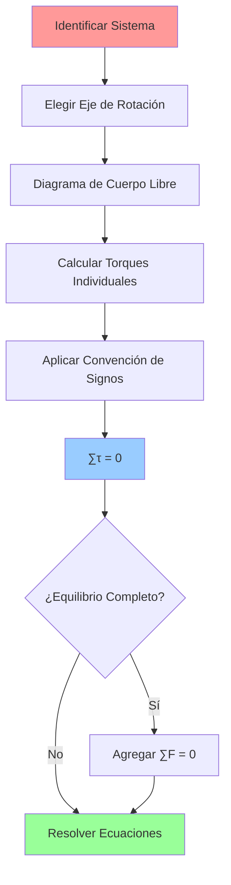
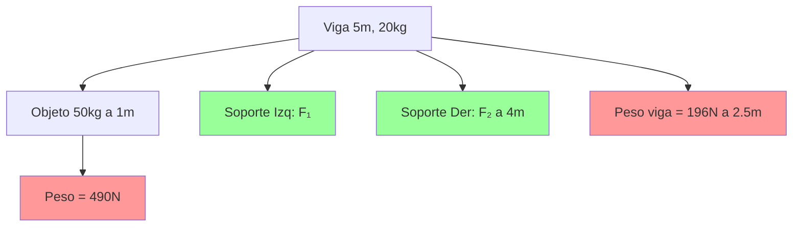

# 🔧 Momento de Torsión (Torque)

> [!info] 🎯 Definición Fundamental El momento de torsión o torque ($\vec{\tau}$) es el **equivalente rotacional de la fuerza**. Es una medida de qué tan eficazmente una fuerza puede causar o cambiar el movimiento de rotación de un objeto. Para producir torque, la fuerza debe aplicarse a cierta distancia del eje de rotación y con la dirección adecuada.

---

## 🔧 Variables y Magnitudes

> [!tip] 📏 Magnitudes Principales
> 
> - **Momento de Torsión** ($\vec{\tau}$): Magnitud vectorial en N⋅m
> - **Fuerza aplicada** ($\vec{F}$): Vector fuerza en Newtons [N]
> - **Brazo de palanca** ($\vec{r}$): Distancia vectorial desde el eje al punto de aplicación [m]
> - **Ángulo** ($\theta$): Ángulo entre el vector posición y la fuerza [radianes o grados]
> - **Momento de Inercia** ($I$): Resistencia rotacional en kg⋅m²
> - **Aceleración angular** ($\alpha$): Cambio de velocidad angular en rad/s²

---

## 🧮 Fórmulas Fundamentales

> [!note] 📐 Ecuaciones Clave
> 
> ### Definición Vectorial
> 
> $$\vec{\tau} = \vec{r} \times \vec{F}$$
> 
> ### Magnitud del Torque
> 
> $$\tau = rF\sin\theta$$ donde:
> 
> - $r$ = distancia del eje al punto de aplicación
> - $F$ = magnitud de la fuerza
> - $\theta$ = ángulo entre $\vec{r}$ y $\vec{F}$
> 
> ### Segunda Ley de Newton Rotacional
> 
> $$\sum \tau = I\alpha$$
> 
> ### Casos Especiales
> 
> - **Fuerza perpendicular** ($\theta = 90°$): $\tau = rF$
> - **Fuerza paralela** ($\theta = 0°$ o $180°$): $\tau = 0$

---

## 🎓 Marco Teórico

> [!abstract] 🧠 Factores Determinantes del Torque
> 
> **1. Magnitud de la Fuerza ($F$)**: Mayor fuerza → mayor torque (relación directa)
> 
> **2. Brazo de Palanca ($r$)**: Mayor distancia del eje → mayor torque (relación directa)
> 
> **3. Dirección de la Fuerza ($\sin\theta$)**:
> 
> - **Máximo torque**: $\theta = 90°$ (fuerza perpendicular)
> - **Torque nulo**: $\theta = 0°$ o $180°$ (fuerza radial)
> 
> **Principio Clave**: El torque es máximo cuando la fuerza se aplica perpendicularmente al brazo de palanca y a la mayor distancia posible del eje de rotación.

---

## 🔗 Diagrama Conceptual

> [!abstract] 📊 Mapa de Relaciones
> 
> ```mermaid
> graph TD
>    A[Fuerza Aplicada F] --> B[Torque: tau = r × F]
>    C[Brazo de Palanca r] --> B
>    D[Ángulo theta] --> B
>    
>    B --> E[tau = rF sin theta]
>    
>    F[Casos Especiales] --> G[theta = 90°: tau = rF]
>    F --> H[theta = 0°/180°: tau = 0]
>    
>    B --> I[Segunda Ley Rotacional]
>    I --> J[Suma tau = I alpha]
>    J --> K[Aceleración Angular alpha]
>    
>    L[Momento de Inercia I] --> J
>    
>    B --> M[Trabajo Rotacional]
>    M --> N[W = tau Delta theta]
>    
>    B --> O[Potencia Rotacional]
>    O --> P[P = tau omega]
> ```

---

## 🌍 Aplicaciones Prácticas

> [!example] 🎯 Casos de Estudio
> 
> ### 🔧 Llave de Tuercas
> 
> - **Principio**: Llave más larga → mayor brazo de palanca → mayor torque
> - **Aplicación**: Misma fuerza produce más torque con herramienta más larga
> - **Ventaja mecánica**: Facilita aflojar tuercas apretadas
> 
> ### 🚪 Apertura de Puertas
> 
> - **Zona efectiva**: Empujar en el extremo opuesto a las bisagras
> - **Zona inefectiva**: Empujar cerca de las bisagras requiere mucha más fuerza
> - **Razón**: Mayor brazo de palanca en el extremo de la puerta
> 
> ### ⚖️ Balanza de Brazos
> 
> - **Equilibrio**: $\tau_1 = \tau_2$ → $r_1F_1 = r_2F_2$
> - **Aplicación**: Determinar masas desconocidas
> - **Principio**: Momentos opuestos se cancelan en equilibrio

---

## 🔄 Metodología de Análisis

> [!info] 🛠️ Flujo de Resolución
> 
> ```mermaid
> flowchart TD
>    A[Identificar el Sistema] --> B[Ubicar Eje de Rotación]
>    B --> C[Identificar Fuerzas Aplicadas]
>    C --> D[Medir Brazos de Palanca r]
>    D --> E[Determinar Ángulos theta]
>    
>    E --> F{¿Múltiples Fuerzas?}
>    F -->|Una Fuerza| G[Calcular: tau = rF sin theta]
>    F -->|Varias Fuerzas| H[Calcular: Suma de torques]
>    
>    G --> I[Resultado Final]
>    H --> I
>    
>    I --> J{¿Análisis Dinámico?}
>    J -->|Sí| K[Aplicar: Suma tau = I alpha]
>    J -->|No| L[Análisis de Equilibrio]
>    
>    K --> M[Encontrar alpha o I]
>    L --> N[Suma tau = 0]
> ```

---

## 📊 Ejercicios Resueltos

> [!warning] 🧮 Problema 1: Torque con Llave **Enunciado**: Una persona aplica una fuerza de 50 N a 0.5 m de la tuerca, perpendicularmente al brazo de la llave. ¿Cuál es el torque?
> 
> > [!success] ✅ Solución **Datos**: $F = 50\text{ N}$, $r = 0.5\text{ m}$, $\theta = 90°$
> > 
> > **Fórmula**: $\tau = rF\sin\theta$
> > 
> > **Cálculo**: $$\tau = (0.5\text{ m})(50\text{ N})\sin(90°) = (0.5)(50)(1) = 25\text{ N⋅m}$$

> [!warning] 🧮 Problema 2: Torque Máximo y Mínimo en Puerta **Enunciado**: Una fuerza de 10 N se aplica a una puerta a 0.8 m de las bisagras. Determinar el torque máximo y mínimo posible.
> 
> > [!success] ✅ Solución **Datos**: $F = 10\text{ N}$, $r = 0.8\text{ m}$
> > 
> > **Torque Máximo** ($\theta = 90°$): $$\tau_{máx} = rF\sin(90°) = (0.8)(10)(1) = 8\text{ N⋅m}$$
> > 
> > **Torque Mínimo** ($\theta = 0°$ o $180°$): $$\tau_{mín} = rF\sin(0°) = (0.8)(10)(0) = 0\text{ N⋅m}$$

---

## 📈 Análisis de Dirección

> [!tip] 🧭 Regla de la Mano Derecha
> 
> **Para determinar la dirección del vector torque:**
> 
> 1. **Apuntar dedos**: En dirección del vector $\vec{r}$
> 2. **Doblar dedos**: Hacia la dirección del vector $\vec{F}$
> 3. **Pulgar apunta**: En dirección del torque $\vec{\tau}$
> 
> **Convención de Signos:**
> 
> - **Positivo (+)**: Rotación antihoraria
> - **Negativo (-)**: Rotación horaria

---

## 🔗 Conexiones Temáticas

> [!note] 🌐 Relaciones Conceptuales
> 
> ### [[Dinámica Rotacional]]
> 
> - **Segunda Ley**: $\sum \tau = I\alpha$ (ecuación fundamental)
> - El torque es la **causa** de la aceleración angular
> 
> ### [[Momento de Inercia]]
> 
> - **Resistencia rotacional**: Relaciona torque con aceleración angular
> - **Ecuación conjunta**: Mayor $I$ requiere mayor $\tau$ para misma $\alpha$
> 
> ### [[Trabajo y Energía Rotacional]]
> 
> - **Trabajo rotacional**: $W = \tau \Delta\theta$
> - **Potencia rotacional**: $P = \tau \omega$
> 
> ### [[Equilibrio Rotacional]]
> 
> - **Condición**: $\sum \tau = 0$ (torques se cancelan)
> - **Aplicación**: Balanzas, palancas, estructuras
> 
> ### [[Momento Angular]]
> 
> - **Relación temporal**: $\tau = \frac{dL}{dt}$ (torque cambia momento angular)
> - **Conservación**: Sin torque externo → $L$ constante

---

## ⚖️ Condiciones de Equilibrio

> [!abstract] 🎯 Equilibrio Rotacional
> 
> **Para que un objeto esté en equilibrio rotacional:**
> 
> $\sum \tau = 0$
> 
> **Implicaciones:**
> 
> - Suma de torques horarios = Suma de torques antihorarios
> - No hay aceleración angular (alpha = 0)
> - Velocidad angular constante (puede ser cero)
> 
> **Aplicaciones:**
> 
> - Diseño de balanzas
> - Análisis de estructuras
> - Sistemas de palancas

---

## 📝 Síntesis Clave

> [!summary] 🎯 Puntos Esenciales
> 
> - **Definición**: Equivalente rotacional de la fuerza
> - **Fórmula base**: $\tau = rF\sin\theta$
> - **Factores**: Magnitud de fuerza, brazo de palanca y ángulo
> - **Máximo torque**: Fuerza perpendicular a mayor distancia
> - **Segunda Ley**: $\sum \tau = I\alpha$ (fundamental en rotación)

---

## 📚 Referencias y Enlaces

> [!quote]  🏷️ Sistema de Organización
> 
> 
> 
> ### 🔗 Notas Relacionadas
> 
> - [[Momento de Inercia]]
> - [[Momento Angular]]
> - [[Equilibrio Rotacional]]
> - [[Trabajo y Energía Rotacional]]
> - [[Palancas y Máquinas Simples]]
> - [[Producto Vectorial]]
> 
> ### 📖 Temas Avanzados
> 
> - [[Giroscopios y Precesión]]
> - [[Torque en Sistemas de Múltiples Cuerpos]]
> - [[Análisis de Estructuras]]
> - [[Máquinas Rotativas]]t
## Tags

#fisica #mecanica #torque #momento-torsion #dinamica-roacional #equilibrio

## Equilibrio Rotacional ⚖️

> [!info] 🎯 Definición Fundamental El **equilibrio rotacional** es la condición que se cumple cuando un objeto rígido no tiene aceleración angular, es decir, está en reposo rotacional o gira a una velocidad angular constante. Esta condición es esencial para el diseño estructural y la estabilidad de sistemas mecánicos.

### Variables Clave 📊

> [!tip] 🔢 Magnitudes Principales
> 
> - **Momento de torsión neto** ($\sum \vec{\tau}$): Suma de todos los torques - $\text{N} \cdot \text{m}$
> - **Fuerza externa** ($\vec{F}$): Cualquier fuerza que actúe sobre el objeto
> - **Brazo de palanca** ($\vec{r}$): Distancia perpendicular desde el eje hasta la línea de acción de la fuerza

### Condición de Equilibrio 🎯

> [!warning] ⚖️ Ecuación Fundamental $$\sum \vec{\tau}_{ext} = 0$$
> 
> **Interpretación:** La suma de todos los torques externos debe ser cero para mantener equilibrio rotacional.

### Marco Teórico 🧠

> [!info] 💡 Fundamento Físico La condición surge directamente de la **Segunda Ley de Newton para rotación**: $$\sum \tau = I\alpha$$
> 
> Si $\alpha = 0$ (sin aceleración angular) → $\sum \tau = 0$
> 
> **Importante:** No significa ausencia de torques individuales, sino que se **cancelan mutuamente**.

### Metodología de Resolución 🔧

> [!tip] 📋 Procedimiento Sistemático
> 
> **1. Establecer punto de referencia** 🎯
> 
> - Elegir eje de rotación estratégicamente
> - Sugerencia: ubicar donde actúe una fuerza desconocida
> 
> **2. Diagrama de cuerpo libre** 📐
> 
> - Identificar todas las fuerzas externas
> - Marcar puntos de aplicación
> 
> **3. Calcular torques individuales** ⚙️
> 
> - Para cada fuerza: $\tau = rF\sin\theta$
> - Aplicar convención de signos
> 
> **4. Aplicar condición de equilibrio** ⚖️
> 
> - $\sum \tau = 0$
> 
> **5. Equilibrio completo** (si necesario) 🔄
> 
> - Agregar: $\sum \vec{F}_{ext} = 0$



### Convención de Signos 🔄

> [!warning] ➕➖ Regla de Signos
> 
> - **Antihorario (⟲):** Torque **POSITIVO** (+)
> - **Horario (⟳):** Torque **NEGATIVO** (-)
> 
> **Consistencia es clave:** Mantener la misma convención durante todo el problema.

### Aplicaciones Prácticas 🏗️

> [!tip] 🌍 Ejemplos del Mundo Real
> 
> **⚖️ Balanza de Brazos:**
> 
> - Objetos diferentes pueden equilibrarse
> - Principio: $m_1 g r_1 = m_2 g r_2$
> 
> **🌉 Puente Levadizo:**
> 
> - Cables equilibran peso del puente
> - Control preciso de posición
> 
> **🏗️ Estructuras:**
> 
> - Vigas, grúas, torres
> - Base del diseño estructural

### Ejemplo Resuelto 📝

> [!warning] 💪 Viga en Equilibrio **Problema:** Viga de 5m, 20kg, apoyada en extremo izquierdo y a 1m del extremo derecho. Objeto de 50kg a 1m del extremo izquierdo.
> 
> **Datos:**
> 
> - Longitud viga: L = 5m
> - Masa viga: m₁ = 20kg
> - Masa objeto: m₂ = 50kg
> - Posición objeto: 1m del extremo izquierdo
> - Soporte derecho: 1m del extremo derecho (4m del izquierdo)
> 
> **Solución (eje en soporte izquierdo):**
> 
> **Torques:**
> 
> - Soporte izquierdo: $\tau_1 = 0$ (r = 0)
> - Peso objeto: $\tau_2 = +(50)(9.8)(1) = +490 \text{ N⋅m}$
> - Peso viga: $\tau_3 = +(20)(9.8)(2.5) = +490 \text{ N⋅m}$
> - Soporte derecho: $\tau_4 = -F_2(4)$
> 
> **Equilibrio rotacional:** $$490 + 490 - 4F_2 = 0$$ $$F_2 = 245 \text{ N}$$
> 
> **Equilibrio traslacional:** $$F_1 + 245 - 490 - 196 = 0$$ $$F_1 = 441 \text{ N}$$



### Conexiones Conceptuales 🔗

> [!info] 🌐 Relaciones Interdisciplinarias
> 
> **Con Momento de Torsión:**
> 
> - Aplicación práctica del concepto de torque
> - Caso especial donde torques se anulan
> 
> **Con Dinámica Rotacional:**
> 
> - Caso particular donde α = 0
> - Base para problemas más complejos
> 
> **Con Estática:**
> 
> - Fundamento junto con equilibrio traslacional
> - Base del análisis estructural

### Puntos Clave de Diseño 🎯

> [!tip] ⭐ Consideraciones Prácticas
> 
> - **Elección de eje:** Punto estratégico simplifica cálculos
> - **Diagrama claro:** Visualización correcta es fundamental
> - **Signos consistentes:** Evita errores en cálculos
> - **Verificación:** Comprobar con equilibrio traslacional
> - **Aplicación real:** Base del diseño estructural seguro

### Síntesis Esencial 🎯

> [!warning] 📌 Conceptos Fundamentales
> 
> - **Condición:** $\sum \tau_{ext} = 0$
> - **Significado:** Sin rotación o rotación uniforme
> - **Aplicación:** Estática y diseño estructural
> - **Método:** Eje estratégico + suma de torques = 0
> - **Complemento:** Equilibrio traslacional para estabilidad total

---

## Referencias 📚

> [!quote] 🔗 Enlaces a Otras Notas
> 
> - [[Momento de Torsión]]
> - [[Dinámica Rotacional]]
> - [[Estática]]
> - [[Fuerzas y Equilibrio]]
> - [[Diagramas de Cuerpo Libre]]
> - [[Centro de Masa]]

---

**Tags:** #física #mecánica #estática #equilibrio-rotacional #momento-torsión #torque #estructuras #diseño-mecánico