# 🧲 Interacciones y Fuerzas Par (Acción-Reacción)

## 📚 Contexto

> [!info] **Principio Fundamental**: Las fuerzas son el resultado de **interacciones** entre objetos y nunca ocurren de forma aislada.

Este concepto es la base de la **Tercera Ley de Newton**, estableciendo que toda fuerza viene acompañada de una fuerza opuesta de igual magnitud. Es crucial para entender que las fuerzas siempre aparecen en pares y actúan sobre objetos diferentes. 

### 🌟 Importancia Conceptual

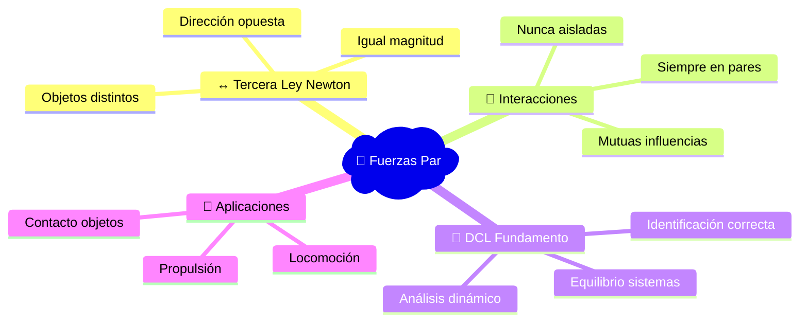

---

## ⚙️ Variables del Sistema

|Variable|Símbolo|Unidad|Descripción|
|---|---|---|---|
|Fuerza|$F$|N|Interacción entre dos objetos|
|Peso|$W$|N|Fuerza gravitatoria ($W = mg$)|
|Normal|$N$|N|Perpendicular al contacto|
|Tensión|$T$|N|Transmitida por cuerdas/cables|
|Fricción Estática|$f_s$|N|Oposición al movimiento inminente|
|Fricción Cinética|$f_k$|N|Oposición al movimiento activo|
|Subíndices|$F_{A/B}$|-|Fuerza de A sobre B|

### 🔤 Notación de Subíndices

**Interpretación**: $F_{A/B}$ = "Fuerza que A ejerce sobre B"

---

## 🛠️ Procedimiento para Identificar Pares

### 📋 Metodología Paso a Paso

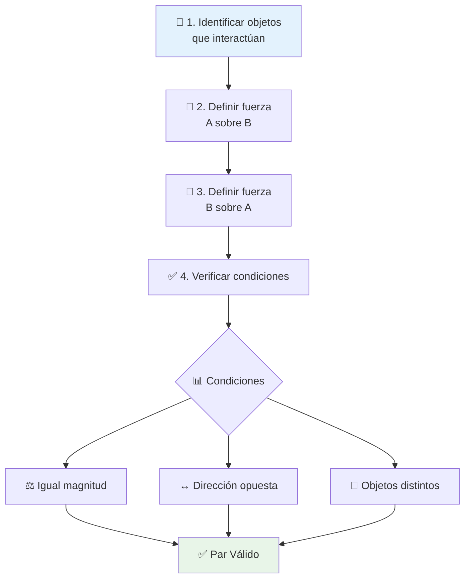

### 🧮 Expresión Matemática Fundamental

$$\vec{F}_{A/B} = -\vec{F}_{B/A}$$

**Interpretación**:

- **Magnitud**: Magnitudes iguales F_A/B = F_B/A
- **Dirección**: Exactamente opuestas
- **Objetos**: A y B son diferentes

---

## 📖 Explicación Teórica

### 🎯 Concepto Central

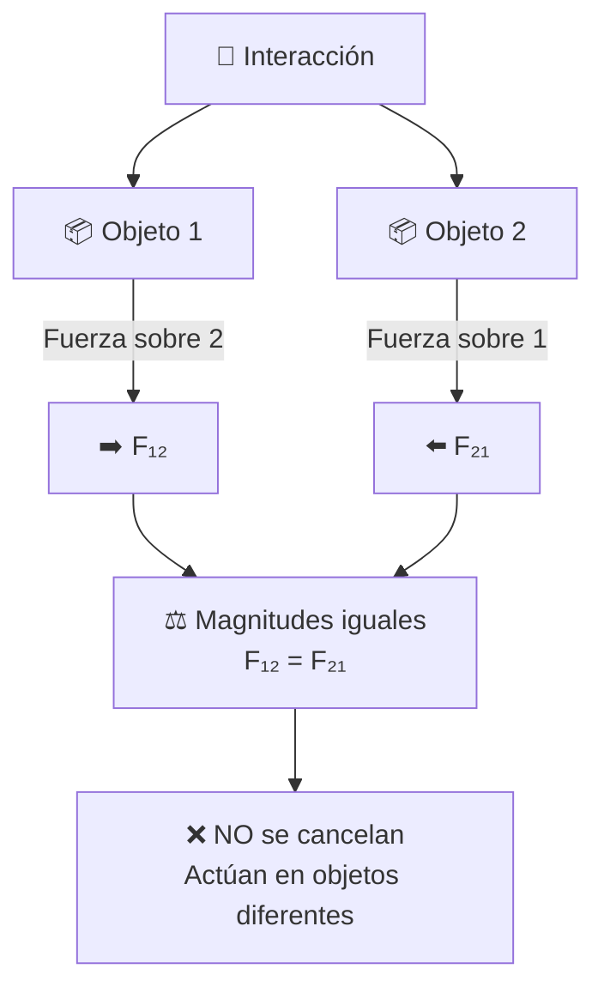

### 🧠 Conceptos Clave
>[!tip] Ten en cuenta las pregunta: 
**💡 ¿Por qué no se cancelan?**
>
>- Las fuerzas del par actúan sobre **objetos diferentes**
>- Para cancelarse, deberían actuar sobre el **mismo objeto**
>- Cada objeto experimenta solo "su" fuerza del par

**🎯 Aplicación en DCL**:

- Cada DCL muestra fuerzas sobre **un solo objeto**
- Los pares acción-reacción aparecen en **DCL diferentes**
- Esto permite el análisis independiente de cada objeto

---

## 🔬 Aplicaciones Prácticas

### 🚶 Ejemplos Cotidianos

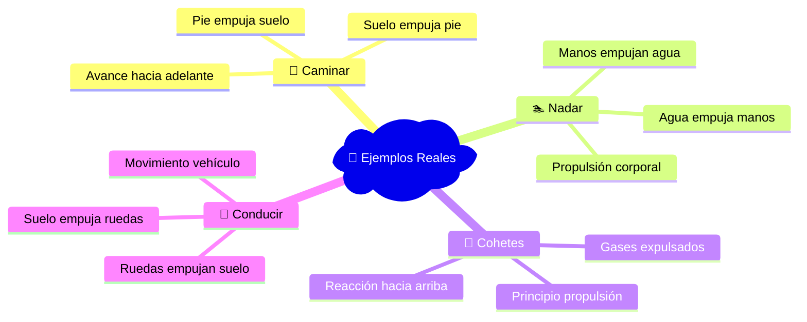

### 🔍 Análisis Detallado: Caminar

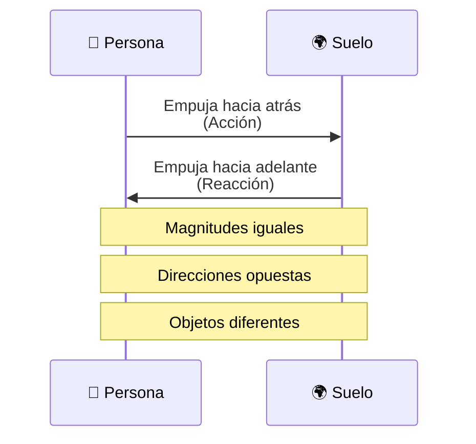

**🎯 Resultado**: La persona avanza gracias a la reacción del suelo

---

## 🔗 Relaciones con Otros Temas

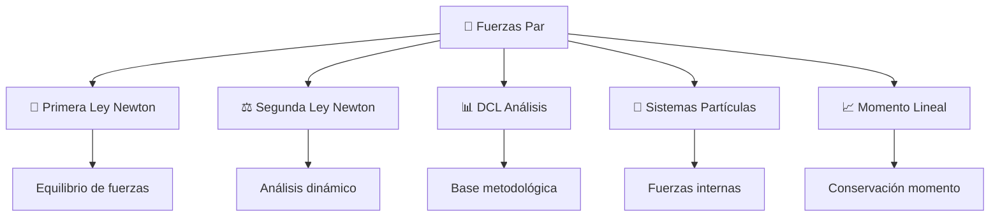

---

## 🗺️ Visualización: Pares Acción-Reacción

### 📐 Sistema Completo con Múltiples Interacciones

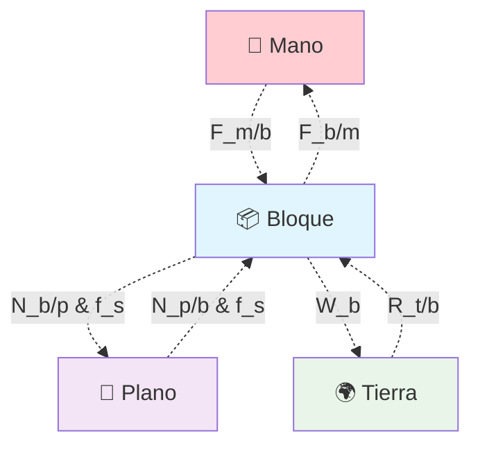

**🔍 Análisis de Pares**:

- **Mano-Bloque**: $\vec{F}_{m/b} \leftrightarrow \vec{F}_{b/m}$
- **Bloque-Plano**: $\vec{N}_{b/p} \leftrightarrow \vec{N}_{p/b}$ y $\vec{f}_{b/p} \leftrightarrow \vec{f}_{p/b}$
- **Bloque-Tierra**: $\vec{W}_b \leftrightarrow \vec{R}_{t/b}$

---

## 📊 Diagramas de Cuerpo Libre (DCL)

### 🎯 Principios para DCL Correctos

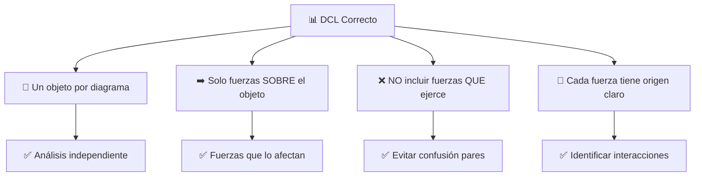

### 📐 Ejemplo: DCL del Bloque

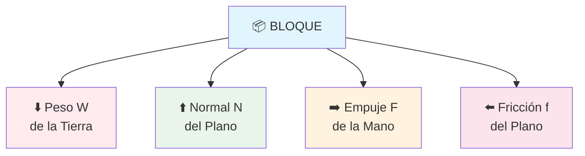

---

## 🧪 Ejemplos de Aplicación Detallados

### 🔗 Ejemplo 1: Cadena Suspendida

#### 📊 Análisis por Eslabones

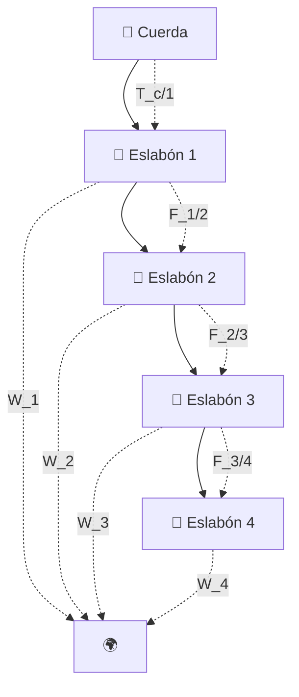

|Eslabón|Fuerzas que Recibe|Par de Reacción|
|---|---|---|
|**1**|• Tensión cuerda ↑ • Peso Tierra ↓ • Fuerza eslabón 2 ↓|• $T_{1/c}$ ↓ • $R_{1/t}$ ↑ • $F_{1/2}$ ↑|
|**2**|• Fuerza eslabón 1 ↑ • Peso Tierra ↓ • Fuerza eslabón 3 ↓|• $F_{2/1}$ ↓ • $R_{2/t}$ ↑ • $F_{2/3}$ ↑|
|**3**|• Fuerza eslabón 2 ↑ • Peso Tierra ↓ • Fuerza eslabón 4 ↓|• $F_{3/2}$ ↓ • $R_{3/t}$ ↑ • $F_{3/4}$ ↑|
|**4**|• Fuerza eslabón 3 ↑ • Peso Tierra ↓|• $F_{4/3}$ ↓ • $R_{4/t}$ ↑|

### 🔺 Ejemplo 2: Bloque en Plano Inclinado

#### 🎯 Identificación de Interacciones

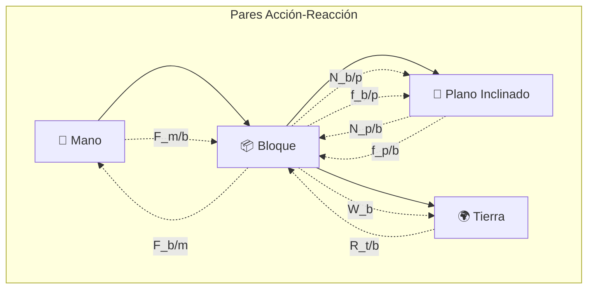

**📋 Resumen de Interacciones**:

- **Bloque ↔ Mano**: Empuje mutuo
- **Bloque ↔ Plano**: Normal y fricción mutuas
- **Bloque ↔ Tierra**: Peso y reacción gravitatoria

### 📉 Ejemplo 3: DCL en Movimiento Temporal

#### ⏱️ Instante 1: Empujón Inicial

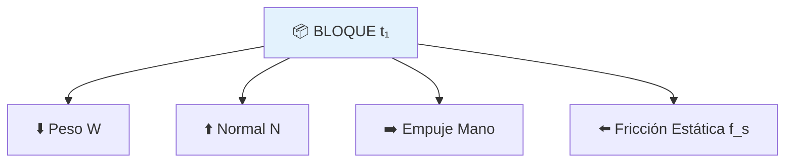

**Estado**: En reposo, fuerzas equilibradas

#### 🔁 Instante 2: Deslizamiento

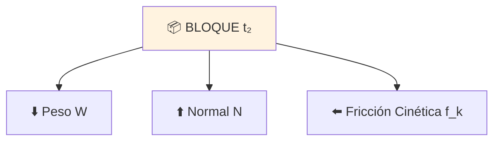

**Estado**: Acelerando, fricción cinética activa

#### 🛑 Instante 3: En Reposo Final

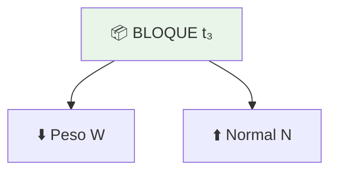

**Estado**: Equilibrio, solo peso y normal

**🔍 Análisis Temporal**:

- **t₁**: Fricción estática equilibra empuje
- **t₂**: Fricción cinética menor que empuje → aceleración
- **t₃**: Sin fuerzas horizontales → equilibrio vertical

---

## 💡 Consejos y Errores Comunes

### ✅ Buenas Prácticas

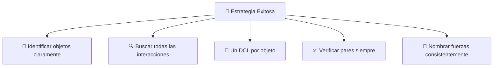

### ❌ Errores Frecuentes

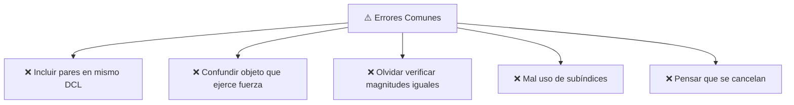

---

## 🧠 Síntesis de Conceptos Clave
>[!tip]
> **🔑 Regla de Oro**: Por cada fuerza que identifiques, busca inmediatamente su par de reacción en el otro objeto.

### 🌟 Puntos Esenciales para Recordar:
>[!success] Aprendimos: 
>1. **🧲 Naturaleza dual**: Las fuerzas siempre aparecen en pares
>2. **👥 Objetos diferentes**: Cada fuerza del par actúa sobre un objeto distinto
>3. **⚖️ Magnitudes iguales**: $|\vec{F}_{A/B}| = |\vec{F}_{B/A}|$
>4. **↔️ Direcciones opuestas**: $\vec{F}_{A/B} = -\vec{F}_{B/A}$
>5. **❌ No se cancelan**: Actúan sobre objetos diferentes
>6. **📐 DCL independientes**: Cada objeto tiene su propio diagrama

---

## 🔗 Enlaces y Referencias

- [[Leyes de Newton]]
- [[Fuerzas y Diagramas de Cuerpo Libre]]
- [[Sistemas de Partículas]]
- [[Momentum Lineal y Su Conservación]]

---

## 📌 Resumen Ejecutivo
>[!success] Tener en cuenta: 
Las **Fuerzas Par (Acción-Reacción)** establecen que:
>
>- 🧲 **Toda fuerza tiene su par**: $\vec{F}_{A/B} = -\vec{F}_{B/A}$
>- 👥 **Actúan en objetos diferentes**: No se cancelan entre sí
>- 📐 **Base de los DCL**: Permiten análisis independiente de cada objeto
>- 🎯 **Clave metodológica**: Identificar interacciones antes que fuerzas
>
>**🌟 Principio fundamental**: Las fuerzas son manifestaciones de interacciones mutuas entre objetos.