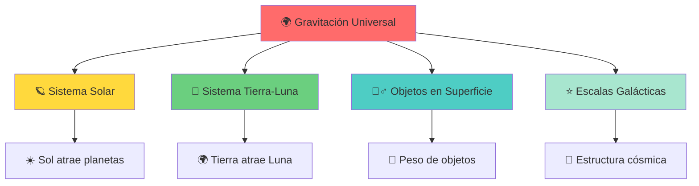
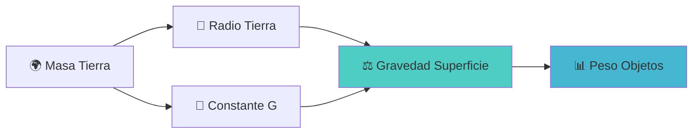
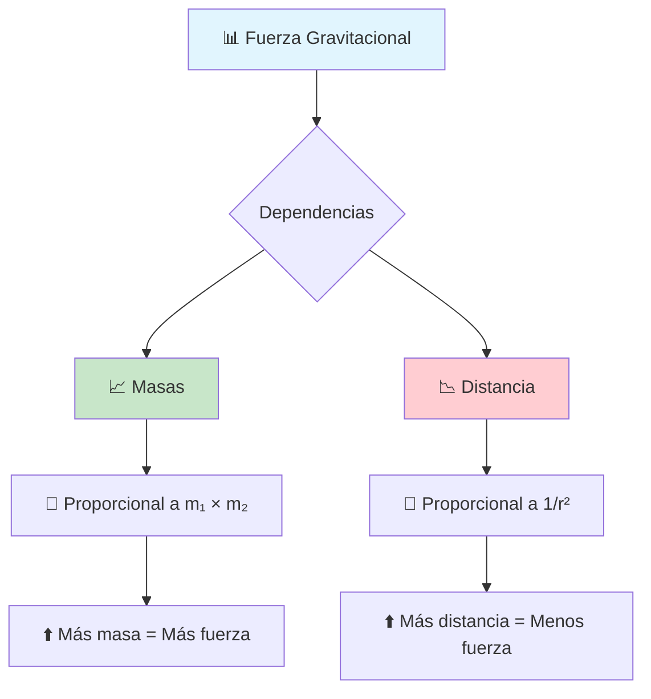
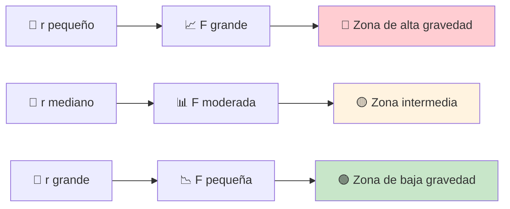
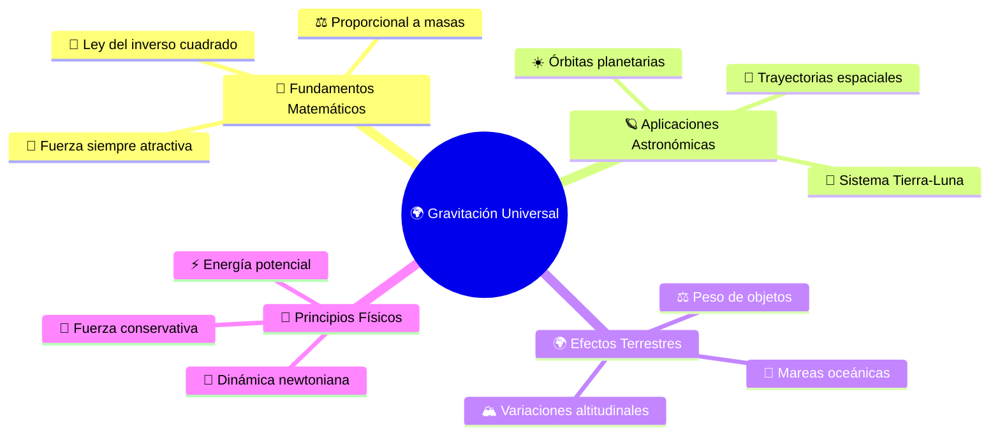
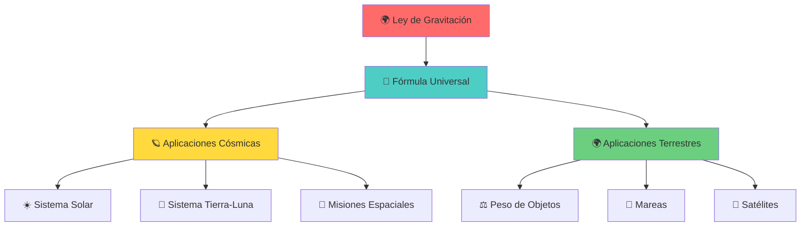

# 🌍 Ley de la Gravitación Universal

## 🎯 Contexto Fundamental

> [!info] La Fuerza que Gobierna el Universo La **Ley de la Gravitación Universal** de Newton describe la **fuerza de atracción mutua** entre dos objetos debido a sus masas. Es la fuerza fundamental que:
> 
> - 🪐 **Mantiene planetas en órbita** alrededor del Sol
> - 🌙 **Sostiene la Luna** en su trayectoria terrestre
> - 🏃‍♂️ **Nos mantiene pegados** al suelo
> - ⭐ **Rige el cosmos** entero a gran escala

> [!abstract] Principio Universal Esta ley se aplica a **todas las masas** en el universo, desde partículas microscópicas hasta galaxias enteras, siendo una de las **cuatro fuerzas fundamentales** de la naturaleza.

---

## 📊 Variables y Constantes

> [!tip] Magnitudes Fundamentales
> 
> |Variable|Símbolo|Valor/Unidad|Descripción|
> |---|---|---|---|
> |Fuerza gravitacional|$\vec{F}_g$|N|Siempre atractiva 🧲|
> |Constante gravitacional|$G$|$6.674 \times 10^{-11} \frac{\text{N} \cdot \text{m}^2}{\text{kg}^2}$|Constante universal 🌌|
> |Masas|$m_1, m_2$|kg|Masas de los objetos interactuantes ⚖️|
> |Distancia|$r$|m|Entre centros de masa 📏|
> |Aceleración gravitacional|$g$|$9.8 \text{ m/s}^2$|En superficie terrestre 🌍|

> [!warning] Punto Importante La distancia $r$ se mide entre los **centros de masa** de los objetos, no entre sus superficies. Para objetos esféricos, esto simplifica considerablemente los cálculos.

---

## 🧮 Fórmulas Fundamentales

### 🌌 Ley Principal

> [!important] Fórmula de Newton $$F_g = G \frac{m_1 m_2}{r^2}$$
> 
> **Características de la fuerza:**
> 
> - 📍 **Dirección**: A lo largo de la línea que une los centros de masa
> - 🧲 **Sentido**: Siempre atractiva (nunca repulsiva)
> - 📈 **Dependencia**: Proporcional al producto de masas
> - 📉 **Dependencia**: Inversamente proporcional al cuadrado de la distancia

### 🌍 Aceleración Gravitacional

> [!note] Gravedad Terrestre **A nivel de superficie** ($h = 0$): $$g = G \frac{M_{Tierra}}{R_{Tierra}^2}$$
> 
> **A una altura** $h$: $$g(h) = G \frac{M_{Tierra}}{(R_{Tierra} + h)^2}$$
> 
> **Peso de un objeto**: $$W = mg$$

---

## 🔬 Explicación Teórica

### 📐 Naturaleza de la Fuerza

> [!abstract] Características Fundamentales La **fuerza gravitacional** posee propiedades únicas:
> 
> **🔄 Ley del inverso del cuadrado:**
> 
> - Si duplicas la distancia → la fuerza se reduce a **1/4**
> - Si triplicas la distancia → la fuerza se reduce a **1/9**
> - Es una relación **no lineal** muy pronunciada
> 
> **🧲 Siempre atractiva:**
> 
> - No existe "antimateria gravitacional"
> - Todas las masas se atraen mutuamente
> - La fuerza actúa instantáneamente a cualquier distancia

### 📈 Dependencia de Variables

---

## 🌍 Aplicaciones Prácticas

### 🪐 Órbitas Planetarias

> [!example] Sistema Solar **Mecanismo orbital:**
> 
> - La gravedad del Sol proporciona la **fuerza centrípeta** ⭕
> - Los planetas se mantienen en **órbitas elípticas** 🥚
> - **Velocidad orbital** equilibra la atracción gravitacional
> 
> **Relación clave:** $$F_{gravitacional} = F_{centrípeta}$$ $$G\frac{M_{Sol}m_{planeta}}{r^2} = \frac{m_{planeta}v^2}{r}$$

### ⚖️ El Peso

> [!tip] Peso vs. Masa **Diferencia conceptual:**
> 
> - **Masa**: Cantidad de materia (invariante) 🧱
> - **Peso**: Fuerza gravitacional (variable) ⚖️
> 
> **En la Tierra**: $W = mg = 9.8m$ N **En la Luna**: $W = 0.16mg$ (gravedad lunar ≈ 1/6 terrestre) **En el espacio**: $W \approx 0$ (pero $m$ sigue igual)

### 🚀 Astronautas en Órbita

> [!info] "Ingravidez" Aparente Los astronautas **no flotan porque la gravedad sea cero**:
> 
> - La gravedad actúa normalmente sobre ellos 🌍
> - Están en **caída libre constante** alrededor de la Tierra 🔄
> - Su velocidad orbital equilibra la atracción gravitacional ⚖️
> - Experimentan **microgravedad**, no ausencia de gravedad

---

## 📈 Análisis Gráfico

### 📊 Fuerza vs. Distancia

> [!note] Gráfica $F_g$ vs. $r$ La relación $F_g \propto \frac{1}{r^2}$ produce una **curva hiperbólica**:
> 
> - 📈 **Cerca del objeto**: Fuerza muy intensa
> - 📉 **Lejos del objeto**: Fuerza decrece rápidamente
> - ♾️ **Nunca llega a cero**: Alcance infinito (teóricamente)

---

## 🧪 Ejemplo Detallado

### ☀️ Fuerza Sol-Tierra

> [!example] Cálculo Cósmico **Problema**: Calcular la fuerza gravitacional entre el Sol y la Tierra
> 
> **Datos conocidos:**
> 
> - Masa del Sol: $M_{☀️} = 1.989 \times 10^{30}$ kg
> - Masa de la Tierra: $M_{🌍} = 5.972 \times 10^{24}$ kg
> - Distancia promedio: $r = 1.496 \times 10^{11}$ m (1 UA)
> - Constante: $G = 6.674 \times 10^{-11} \frac{\text{N} \cdot \text{m}^2}{\text{kg}^2}$

> [!note] Desarrollo del Cálculo **Aplicando la fórmula:** $$F_g = G \frac{M_{☀️} \times M_{🌍}}{r^2}$$
> 
> **Sustituyendo valores:** $$F_g = (6.674 \times 10^{-11}) \frac{(1.989 \times 10^{30})(5.972 \times 10^{24})}{(1.496 \times 10^{11})^2}$$
> 
> **Resultado:** $$F_g \approx 3.54 \times 10^{22} \text{ N}$$
> 
> **Interpretación**: ¡Una fuerza **gigantesca** que mantiene la Tierra en órbita! 🌍💫

---

## 🔗 Conexiones Conceptuales

> [!success] Relaciones Clave
> 
> - **🎯 Dinámica**: Base para la segunda ley de Newton ($\sum F = ma$)
> - **💫 Energía Potencial**: Fuerza conservativa con $U_g = -G\frac{m_1m_2}{r}$
> - **🔄 Movimiento Circular**: Proporciona fuerza centrípeta en órbitas
> - **⭐ Astrofísica**: Explica estructura y evolución del universo

---

## 💡 Síntesis Conceptual

> [!abstract] Puntos Esenciales
> 
> ### 🌌 **Universalidad**
> 
> - Se aplica a **todas las masas** del universo
> - **Misma ley** para objetos microscópicos y galácticos
> - **Alcance infinito** (aunque decrece con distancia)
> 
> ### 🧮 **Matemáticas**
> 
> - **Ley simple**: $F_g = G \frac{m_1 m_2}{r^2}$
> - **Dependencia no lineal** con la distancia
> - **Constante universal** $G$ en toda la naturaleza
> 
> ### 🎯 **Aplicaciones**
> 
> - **Peso** y gravedad terrestre
> - **Órbitas** planetarias y satelitales
> - **Mareas** y efectos astronómicos

---

## 🔗 Referencias y Enlaces

> [!abstract] Notas Relacionadas
> 
> ### 📚 Conceptos Fundamentales
> 
> - [[Leyes de Newton]] - Marco dinámico general
> - [[Principios de Conservación de la Energía]] - Naturaleza de la gravedad
> - `[[Principio de Superposición]]` - Múltiples masas
> 

>[!question] Para Profundizar
> 
> ### 🔬 Temas Avanzados
> 
> - `[[Relatividad General]]` - Teoría moderna de gravedad
> - `[[Problema de N-Cuerpos]]` - Sistemas gravitacionales complejos
> - `[[Ondas Gravitacionales]]` - Perturbaciones del espaciotiempo
> - `[[Materia Oscura]]` - Efectos gravitacionales anómalos
> 
> ### 🧪 Aspectos Experimentales
> 
> - `[[Experimento de Cavendish]]` - Medición histórica de G
> - `[[Balance de Torsión]]` - Técnicas de medición precisa
> - `[[Gravimetría]]` - Medición de variaciones locales
> - `[[Geodesia]]` - Aplicaciones en ciencias de la Tierra
> 
> ### 📊 Métodos Computacionales
> 
> - `[[Simulaciones N-Cuerpos]]` - Modelado numérico
> - `[[Métodos de Perturbación]]` - Aproximaciones analíticas
> - `[[Integración Numérica]]` - Solución de ecuaciones de movimiento