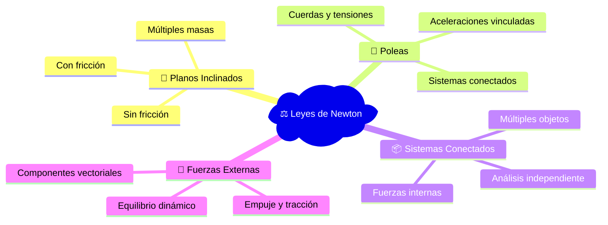
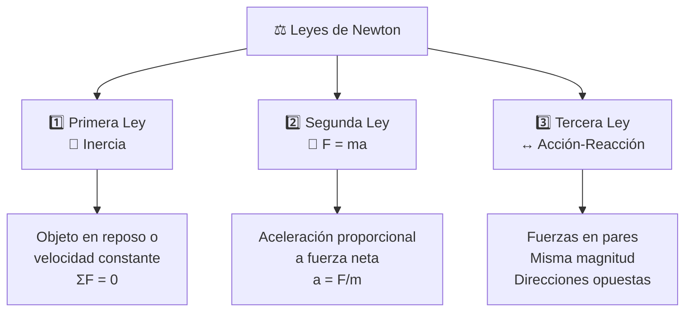
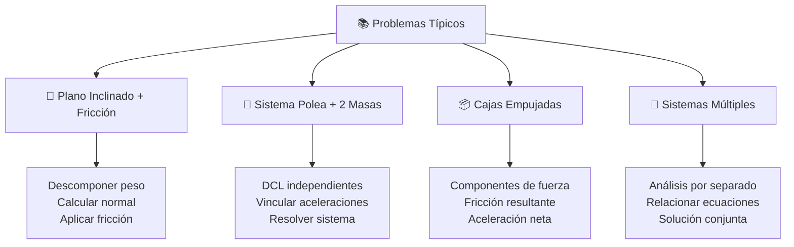
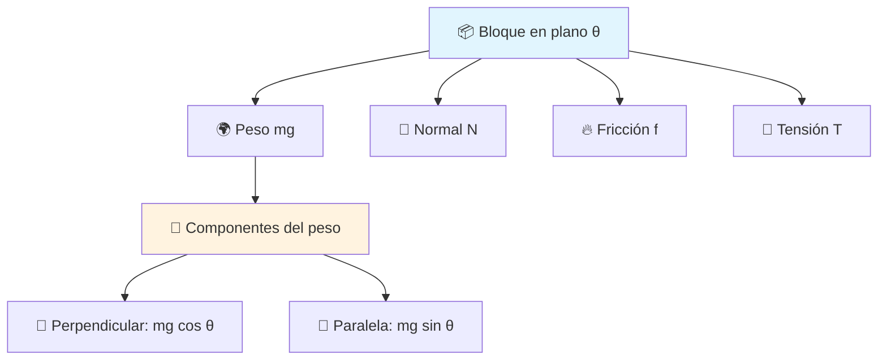
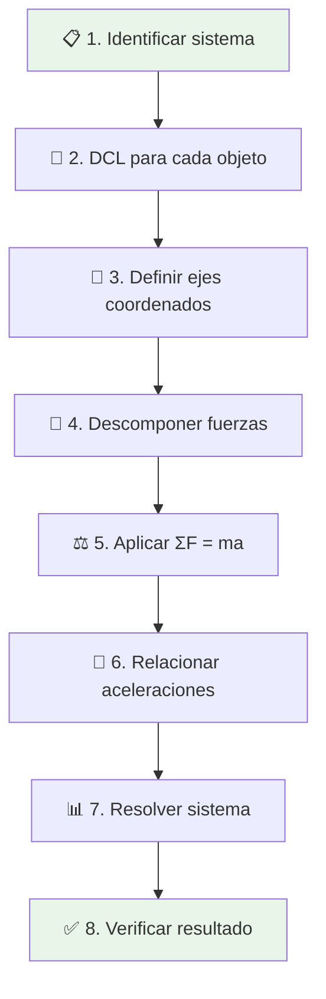
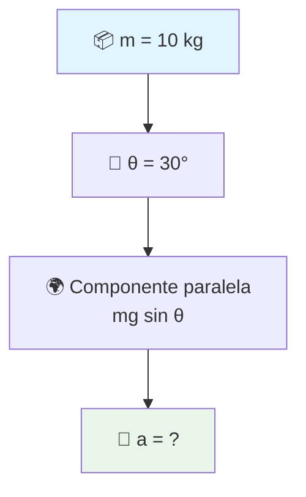
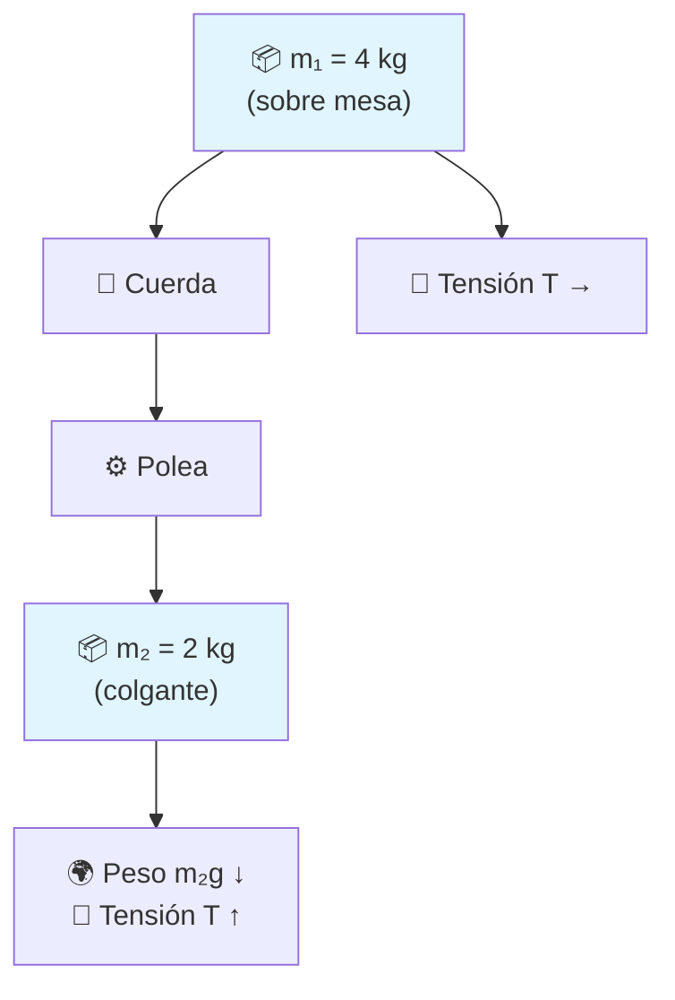
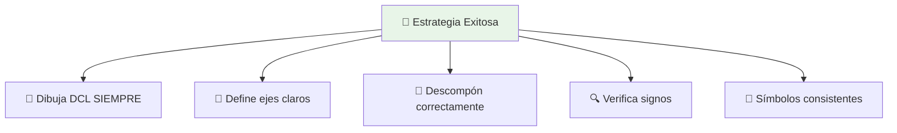
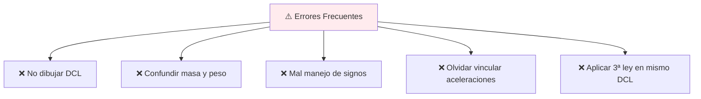
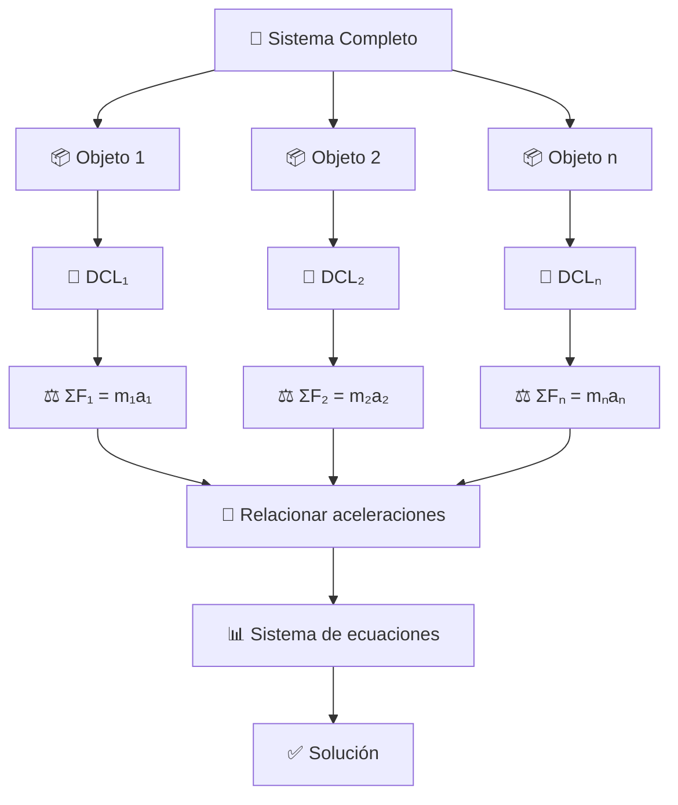

# ⚖️ Tutorial S10: Leyes de Newton

## 🧠 Contexto
>[!info] Empecemos con un: 
> **Enfoque Principal**: Aplicación de las tres leyes de Newton para analizar el movimiento de sistemas complejos.

Este tutorial aborda situaciones donde es necesario aplicar las **tres leyes de Newton** de manera integrada para resolver problemas de dinámica. Se enfoca principalmente en sistemas con múltiples objetos, fuerzas complejas y diferentes superficies.

### 🎯 Sistemas de Estudio

---

## 📌 Variables del Sistema

|Variable|Símbolo|Unidad|Descripción|
|---|---|---|---|
|Masa|$m$|kg|Cantidad de materia|
|Aceleración|$a$|m/s²|Cambio de velocidad|
|Gravedad|$g$|9.8 m/s²|Aceleración gravitacional|
|Fuerza Normal|$N$|N|Perpendicular a superficie|
|Fricción|$f$|N|Oposición al movimiento|
|Tensión|$T$|N|Fuerza en cuerdas/cables|
|Peso|$W$|N|$W = mg$|
|Coeficiente fricción|$\mu$|-|Estático ($\mu_s$) o cinético ($\mu_k$)|

---

## 📐 Formulación General

### ⚖️ Segunda Ley de Newton - Forma Vectorial

$$\sum \vec{F} = m \vec{a}$$

### 🧮 Descomposición por Ejes

#### 📏 Eje X (Horizontal)

$$\sum F_x = m a_x$$

#### 📏 Eje Y (Vertical)

$$\sum F_y = m a_y$$

### 🔥 Fuerza de Fricción

$$f = \mu N$$

**Donde**:

- $\mu_s$: Coeficiente de fricción estática (objeto en reposo)
- $\mu_k$: Coeficiente de fricción cinética (objeto en movimiento)

### 🎯 Las Tres Leyes Fundamentales

---

## 🧪 Aplicación Práctica

### 🎯 Tipos de Problemas Característicos

---

## 🎯 Metodología de Diagramas de Cuerpo Libre (DCL)

### 📐 Ejemplo: Bloque en Plano Inclinado

### 🧮 Ecuaciones Asociadas

#### 📏 Componentes del Peso

- **Perpendicular al plano**: $W_{\perp} = mg \cos(\theta)$
- **Paralela al plano**: $W_{\parallel} = mg \sin(\theta)$

#### ⚖️ Equilibrio Perpendicular

$$N = mg \cos(\theta)$$

#### 🚀 Ecuación de Movimiento (Paralela)

$$ma = mg \sin(\theta) - f - T$$

---

## 📌 Estrategia de Resolución

---

## 🧠 Ejemplos de Aplicación

### 🚗 Ejemplo 1: Fuerza Resultante Simple

**🎯 Problema**: Bloque de 5 kg empujado con 30 N en superficie sin fricción.

**🔧 Solución**: $$F = ma \Rightarrow a = \frac{F}{m} = \frac{30}{5} = 6 \text{ m/s}^2$$

**✅ Resultado**: $a = 6 \text{ m/s}^2$

---

### 🧱 Ejemplo 2: Plano Inclinado Sin Fricción

**🎯 Problema**: Bloque 10 kg en plano inclinado 30°, sin fricción.

**🔧 Solución**:

1. **Componente paralela del peso**: $$W_{\parallel} = mg \sin(\theta) = 10 \times 9.8 \times \sin(30°) = 49 \text{ N}$$
    
2. **Segunda ley de Newton**: $$a = \frac{F}{m} = \frac{49}{10} = 4.9 \text{ m/s}^2$$
    

**✅ Resultado**: $a = 4.9 \text{ m/s}^2$

---

### 🧲 Ejemplo 3: Sistema de Masas Conectadas

**🎯 Problema**: Dos bloques conectados por cuerda y polea. $m_1 = 4$ kg (horizontal), $m_2 = 2$ kg (colgante).

**🔧 Análisis por DCL**:

#### 📦 Para $m_1$ (horizontal):

$$T = m_1 a \quad \text{...(1)}$$

#### 📦 Para $m_2$ (vertical):

$$m_2 g - T = m_2 a \quad \text{...(2)}$$

**🧮 Resolución del sistema**: Sustituyendo (1) en (2): $$m_2 g - m_1 a = m_2 a$$ $$m_2 g = a(m_1 + m_2)$$ $$a = \frac{m_2 g}{m_1 + m_2} = \frac{2 \times 9.8}{4 + 2} = 3.27 \text{ m/s}^2$$

**✅ Resultado**: $a = 3.27 \text{ m/s}^2$

**🔗 Tensión en la cuerda**: $$T = m_1 a = 4 \times 3.27 = 13.08 \text{ N}$$

---

## 💡 Recomendaciones Clave

### ✅ Buenas Prácticas

- **📐 DCL primero**: Nunca apliques fórmulas sin dibujar el diagrama
- **📏 Ejes coherentes**: Define x, y de manera consistente para todo el problema
- **🧮 Descomposición**: En planos inclinados, descompón peso correctamente
- **🔍 Signos**: Revisa dirección de aceleración antes de asignar signos
- **📝 Consistencia**: Usa los mismos símbolos en todo el desarrollo

### ❌ Errores Comunes a Evitar

---

## 🧠 Conceptos Fundamentales para Recordar

### 🎯 Principios Clave

> **🔑 Regla de Oro**: Las Leyes de Newton se aplican a cada objeto por separado.

#### 📋 Puntos Esenciales:

- **🎯 Análisis independiente**: Cada objeto tiene su propio DCL y ecuaciones
- **↔️ Tercera ley**: No se aplica dentro del mismo DCL, sino entre objetos
- **🔗 Sistemas múltiples**: Analiza cada cuerpo por separado, luego relaciona
- **⚖️ Equilibrio**: $\sum F = 0$ para objetos en reposo o velocidad constante
- **🚀 Aceleración**: Siempre en dirección de la fuerza neta

### 🌟 Jerarquía de Análisis

---

## 🔗 Conexiones con Otros Temas

- [[Trabajo y Energía]]
- [[Principios de Conservación de la Energía]]
- [[Fuerzas y Diagramas de Cuerpo Libre]]
- [[Cinemática Traslacional]]

---

## 📌 Resumen Ejecutivo
>[!success] Recapitulando los conceptos.
Las **Leyes de Newton** proporcionan el framework fundamental para el análisis dinámico:
>
>- **1️⃣ Primera Ley**: Inercia → $\sum F = 0$ para equilibrio
>- **2️⃣ Segunda Ley**: Dinámica → $\sum F = ma$ para aceleración
>- **3️⃣ Tercera Ley**: Acción-reacción → Fuerzas en pares
>
>**🎯 Metodología clave**: DCL → Descomponer → Aplicar → Relacionar → Resolver
>
>¿Listo para aplicar lo aprendido? 💪✨
