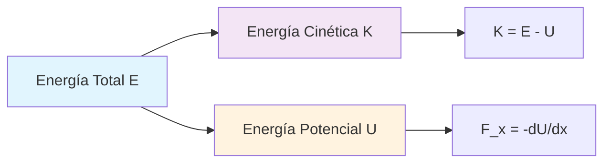
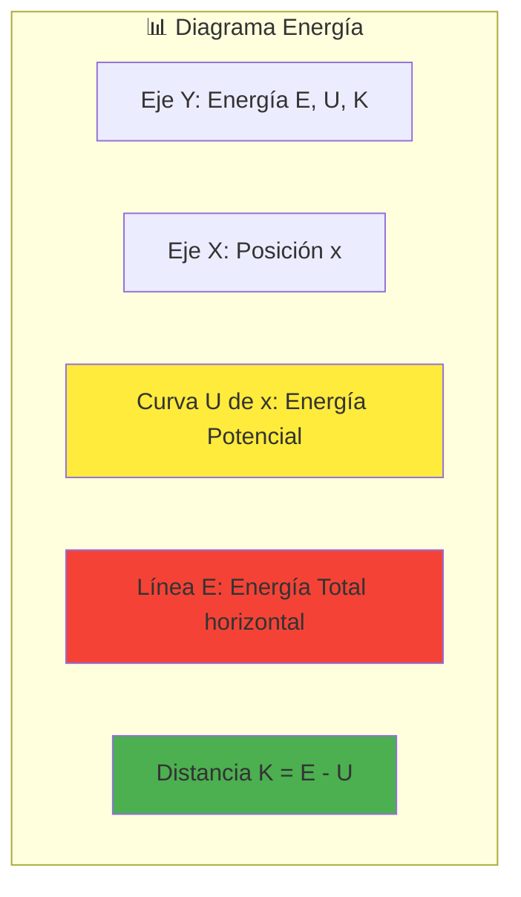
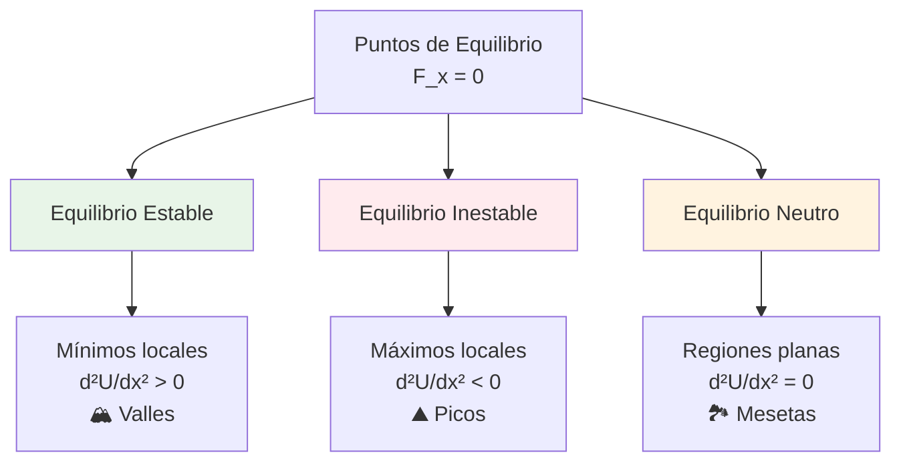
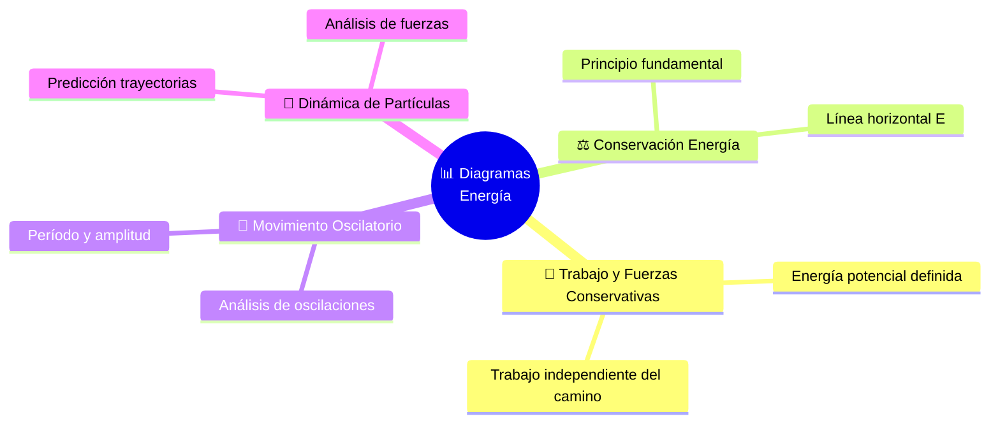

# 📊 Diagramas de Energía

## 🧠 Contexto Fundamental

> [!info] 📖 Definición Los **diagramas de energía** son herramientas gráficas que permiten analizar el movimiento de un objeto en sistemas donde solo actúan **fuerzas conservativas**. Al graficar la energía potencial en función de la posición, podemos determinar de manera intuitiva el movimiento, energía cinética, puntos de retorno y posiciones de equilibrio.

>[!success] **Aplicaciones principales:**
>- 🎯 Análisis de movimiento oscilatorio
>- 🚀 Predicción de trayectorias
>- ⚖️ Identificación de puntos de equilibrio
>- 🔄 Estudio de sistemas conservativos

---

## 📊 Variables y Magnitudes Físicas

### 🔢 Variables Fundamentales

>[!tip] Variables Fundamentales
>| Símbolo | Magnitud | Unidad SI | Descripción |
>|---------|----------|-----------|-------------|
>| U | Energía Potencial | J (Joule) | Energía almacenada en el sistema |
>| E | Energía Total | J | Suma constante: E = K + U |
>| K | Energía Cinética | J | Energía de movimiento |
>| x | Posición | m | Coordenada espacial |
>| F_x | Fuerza | N | Fuerza en dirección x |

### ⚡ Relaciones Energéticas

---

## 🧮 Fórmulas Fundamentales

### 📐 Ecuaciones Clave

> [!note] 📝 Conservación de Energía Mecánica **Energía total mecánica:** $$E = K + U = \text{constante}$$

> [!tip] 💡 Energía Cinética desde el Diagrama **Energía cinética:** $$K = E - U$$ _La energía cinética es la distancia vertical entre la línea de energía total y la curva de energía potencial_

> [!warning] ⚠️ Relación Fuerza-Potencial **Fuerza conservativa:** $$F_x = -\frac{dU}{dx}$$ _La fuerza es el **negativo** de la pendiente de la curva de energía potencial_

---

## 📈 Interpretación del Diagrama

### 🎨 Elementos Visuales

### 🔍 Regiones de Movimiento

> [!info] 📖 Condición de Movimiento El objeto **solo puede moverse** en regiones donde: $$E \geq U(x)$$
> 
> **Razón:** La energía cinética no puede ser negativa: $K = E - U ≥ 0$

---

## 🎯 Puntos Críticos del Sistema

### 🔄 Puntos de Retorno

> [!tip] 💡 Identificación de Puntos de Retorno **Definición:** Puntos donde $E = U(x)$
> 
> **Características:**
> 
> - Energía cinética = 0 ($K = 0$)
> - Velocidad = 0 ($v = 0$)
> - El objeto **invierte** su dirección de movimiento

### ⚖️ Puntos de Equilibrio

#### 🏔️ Equilibrio Estable

> [!success] ✅ Características
> 
> - Ubicación: **Mínimos** de U(x)
> - Comportamiento: Fuerza restauradora
> - Si se desplaza → regresa al equilibrio
> - Ejemplo: Pelota en el fondo de un valle

#### ⛰️ Equilibrio Inestable

> [!danger] 🚨 Características
> 
> - Ubicación: **Máximos** de U(x)
> - Comportamiento: Fuerza expulsora
> - Si se desplaza → se aleja del equilibrio
> - Ejemplo: Pelota en la cima de una colina

#### 🏞️ Equilibrio Neutro

> [!note] 📝 Características
> 
> - Ubicación: **Regiones planas** de U(x)
> - Comportamiento: Sin fuerza neta
> - Si se desplaza → permanece en nueva posición
> - Ejemplo: Pelota en superficie horizontal

---

## 🔗 Conexiones Conceptuales

---

## 🧪 Ejemplos Prácticos Resueltos

### 📈 Ejercicio 1: Identificación de Equilibrios

> [!example] 🔍 Análisis de Gráfica U(x) **Problema:** Dada una gráfica de U(x), identificar puntos de equilibrio
> 
> **Método:**
> 
> 1. Localizar puntos donde `dU/dx = 0`
> 2. Clasificar según la segunda derivada:
>     - $d²U/dx² > 0$ → Estable 🏔️
>     - $d²U/dx² < 0$ → Inestable ⛰️
>     - $d²U/dx² = 0$ → Neutro 🏞️

### 🎯 Ejercicio 2: Análisis de Movimiento

> [!example] 🔍 Puntos de Retorno y Fuerza **Dado:** Gráfica U(x) con línea de energía total E
> 
> **Encontrar:**
> 
> - **Puntos de retorno:** Intersecciones $E = U(x)$
> - **Dirección de fuerza:** $F_x = -dU/dx$
>     - Pendiente negativa → Fuerza positiva (→)
>     - Pendiente positiva → Fuerza negativa (←)

### 🚀 Ejercicio 3: Predicción de Trayectoria

> [!example] 🔍 Movimiento de Partícula **Análisis para energía total específica:**
> 
> **Resultados:**
> 
> - **Velocidad máxima:** En puntos más bajos de U(x)
> - **Velocidad cero:** En puntos de retorno
> - **Región permitida:** Donde E ≥ U(x)
> - **Tipo de movimiento:** Oscilatorio entre puntos de retorno

---

## 💡Tips y Trucos

> [!tip] 💡 Consejos Prácticos **🎯 Análisis Sistemático:**
> 
> - Siempre identifica primero los puntos de equilibrio
> - Dibuja la línea de energía total antes de analizar
> - La energía cinética es proporcional al "espacio libre" entre $E$ y $U(x)$
> 
> **✅ Hacer:**
> 
> - Verificar que $E ≥ U$ en toda la región de movimiento
> - Usar la pendiente para determinar dirección de fuerzas
> - Relacionar valles con movimiento oscilatorio
> 
> **❌ Evitar:**
> 
> - Confundir puntos de equilibrio con puntos de retorno
> - Olvidar el signo negativo en $F_x = -dU/dx$
> - Ignorar las restricciones energéticas del movimiento

---

## 🔄 Relación con Otros Temas

> [!quote] 📝 Vínculos Conceptuales
> 
> - [[Trabajo y Energía]] - Fundamento teórico
> - [[Principios de Conservación de la Energía]] - Condición de aplicabilidad
> - [[Leyes de Newton]] - Aplicación práctica

---

## 📋 Síntesis de Información

> [!summary] 📋 Puntos Clave **🎨 Elementos del Diagrama:**
> 
> - Gráfica de U(x) vs. x
> - Línea horizontal de energía total E
> 
> **⚡ Relaciones Fundamentales:**
> 
> - Fuerza: $F_x = -dU/dx$` (negativo de la pendiente)
> - Energía cinética: $K = E - U$ (distancia vertical)
> 
> **🎯 Características del Movimiento:**
> 
> - Movimiento limitado a regiones donde $E ≥ U$
> - Puntos de retorno donde $E = U$
> - Equilibrio estable en valles, inestable en picos

