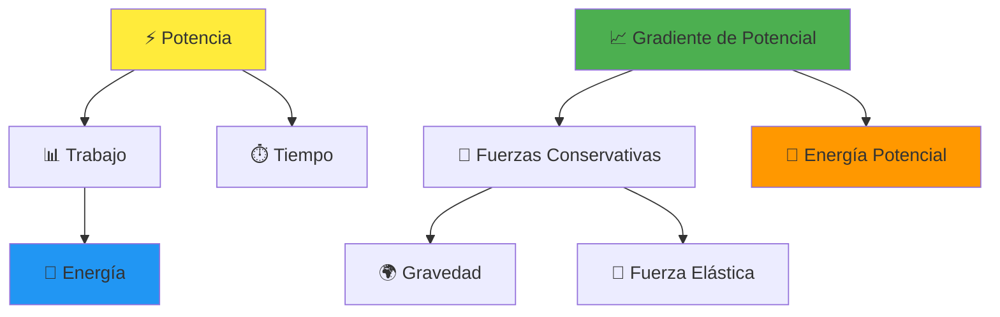
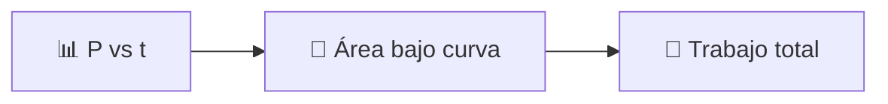
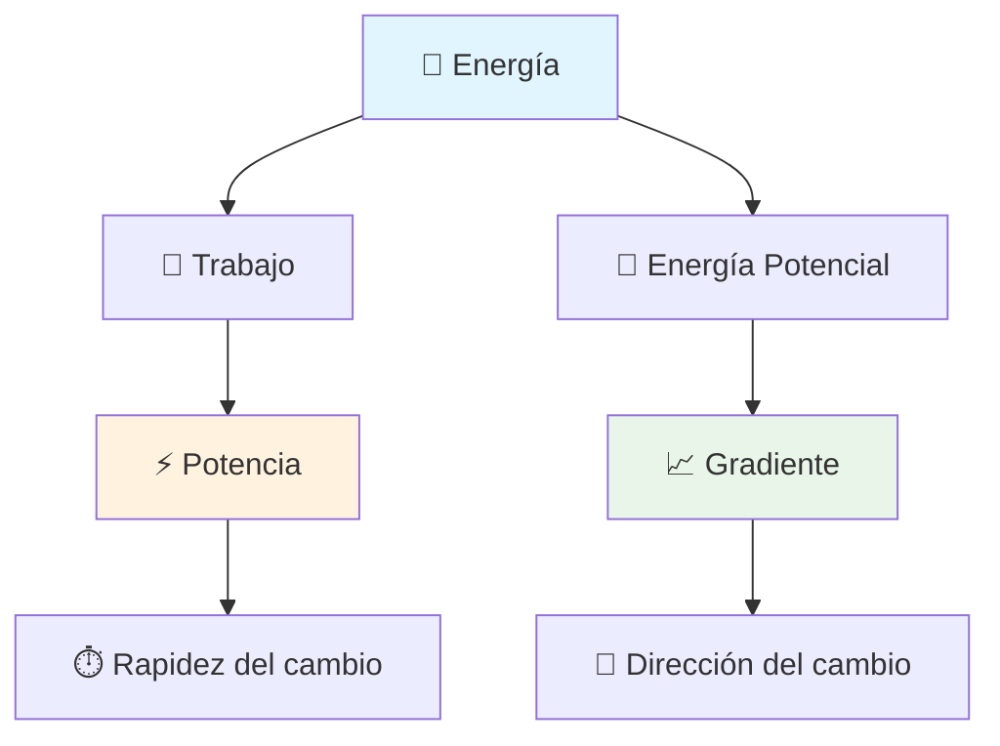

# ⚡ Potencia y Gradiente de Potencial

## 🎯 Contexto

> [!info] Conceptos Fundamentales Estos conceptos amplían nuestra comprensión del **trabajo** y la **energía**:
> 
> - La **potencia** ⚡ introduce la dimensión temporal al trabajo
> - El **gradiente de potencial** 📈 conecta la fuerza (vectorial) con la energía potencial (escalar)
> - Proporcionan una comprensión más profunda de las **fuerzas conservativas**

---

## 📊 Variables y Unidades

> [!tip] Variables Principales
> 
> |Variable|Símbolo|Unidad|Descripción|
> |---|---|---|---|
> |Potencia|$P$|Vatios (W)|$1 \text{ W} = 1 \text{ J/s}$|
> |Trabajo|$W$|Julios (J)|Energía transferida|
> |Tiempo|$\Delta t$|segundos (s)|Intervalo temporal|
> |Fuerza|$\vec{F}$|Newtons (N)|Magnitud vectorial|
> |Velocidad|$\vec{v}$|m/s|Magnitud vectorial|
> |Energía Potencial|$U$|Julios (J)|Magnitud escalar|
> |Posición|$x$|metros (m)|Coordenada espacial|
> |Gradiente|$\nabla$|-|Operador vectorial|

---

## 🧮 Fórmulas Fundamentales

### ⚡ Potencia

> [!note] Fórmulas de Potencia **Potencia promedio:** $$P_{promedio} = \frac{\Delta W}{\Delta t}$$
> 
> **Potencia instantánea:** $$P = \frac{dW}{dt}$$
> 
> **Potencia en términos de fuerza y velocidad:** $$P = \vec{F} \cdot \vec{v} = Fv\cos\theta$$

### 📈 Gradiente de Potencial

> [!important] Relación Fuerza-Energía Potencial **Componentes del gradiente:** $$F_x = -\frac{dU}{dx} \quad F_y = -\frac{dU}{dy} \quad F_z = -\frac{dU}{dz}$$
> 
> **Notación vectorial:** $$\vec{F} = -\nabla U$$
> 
> donde $\nabla$ es el **operador gradiente** 🎯

---

## 🔬 Explicación Teórica

### ⚡ Potencia

> [!info] Concepto de Potencia
> 
> - **Definición**: Tasa a la que se realiza trabajo o se transfiere energía
> - **Importancia**: Una máquina es más potente si realiza el mismo trabajo en menos tiempo
> - **Interpretación física**: La potencia instantánea es el producto punto de $\vec{F}$ y $\vec{v}$

### 📊 Gradiente de Potencial

> [!warning] Principio del Gradiente
> 
> - La fuerza conservativa **siempre** apunta hacia donde $U$ disminuye más rápidamente
> - Los objetos se mueven naturalmente desde **alta** energía potencial hacia **baja** energía potencial
> - Formaliza el comportamiento intuitivo: "las cosas caen hacia abajo" 🍎

---

## 🌍 Aplicaciones Prácticas

### ⚡ Ejemplo de Potencia

> [!example] Elevador **Situación**: Comparar dos elevadores
> 
> - Elevador A: sube 10 personas en **30 segundos** ⚡
> - Elevador B: sube 10 personas en **60 segundos** 🐌
> 
> **Resultado**: Ambos realizan el mismo **trabajo**, pero el Elevador A tiene **mayor potencia**

### 📈 Ejemplo de Gradiente

> [!example] Diagrama de Energía Potencial En un gráfico $U$ vs. $x$:
> 
> - Pendiente descendente → $\frac{dU}{dx} < 0$ → $F_x > 0$ (fuerza hacia la derecha) ➡️
> - El objeto se mueve hacia donde la energía potencial es menor

---

## 🔗 Conexiones con Otros Temas

> [!tip] Relaciones Clave
> 
> - **Trabajo y Energía**: La potencia es la rapidez del cambio energético
> - **Fuerzas Conservativas**: Solo se aplica el gradiente a fuerzas como gravedad y elástica
> - **Conexión temporal**: Potencia describe **cuán rápido**, gradiente describe **cómo**

---

## 📈 Interpretación Gráfica

### 📊 Gráfica Potencia vs. Tiempo

> [!note] Gráfica $P$ vs. $t$
> 
> - **Área bajo la curva** = Trabajo realizado
> - Potencia constante → Rectángulo
> - Potencia variable → Área irregular

### 📉 Gráfica Energía Potencial vs. Posición

> [!warning] Gráfica $U$ vs. $x$
> 
> - **Pendiente** = $-F_x$ (negativo de la fuerza)
> - **Pendiente = 0** → Punto de equilibrio ⚖️
> - **Pendiente negativa** → Fuerza positiva ➡️

---

## 🧪 Ejemplos de Aplicación

### ⚡ Motor Levantando Peso

> [!example] Cálculo de Potencia **Datos**:
> 
> - Masa: $m = 100$ kg
> - Altura: $h = 10$ m
> - Tiempo: $t = 5$ s
> 
> **Solución**:
> 
> 1. Trabajo: $W = mgh = 100 \times 9.8 \times 10 = 9800$ J
> 2. Potencia: $P = \frac{W}{t} = \frac{9800}{5} = 1960$ W

### 🔄 Resorte y Ley de Hooke

> [!example] Gradiente en Resorte **Energía potencial elástica**: $U = \frac{1}{2}kx^2$
> 
> **Aplicando gradiente**: $$F_x = -\frac{dU}{dx} = -\frac{d}{dx}\left(\frac{1}{2}kx^2\right) = -kx$$
> 
> **Resultado**: ✅ Confirma la **Ley de Hooke**

---

## 💡 Síntesis Final

> [!success] Conceptos Clave
> 
> - **Potencia**: $P = \frac{W}{\Delta t} = \vec{F} \cdot \vec{v}$ ⚡
> - **Gradiente**: $\vec{F} = -\nabla U$ (fuerza apunta hacia donde $U$ disminuye) 📈
> - **Conexión**: Potencia describe la **velocidad** del cambio energético, gradiente describe el **mecanismo** del cambio

## 🔗 Referencias y Enlaces

> [!quote]  Notas Relacionadas
> 
> ### 📚 Temas Fundamentales
> 
> - [[Trabajo y Energía]] - Conceptos base para entender potencia
> - [[Principios de Conservación de la Energía]] - Fundamento del gradiente de potencial
> - [[Principio de energía]] - Tipos de energía mecánica
