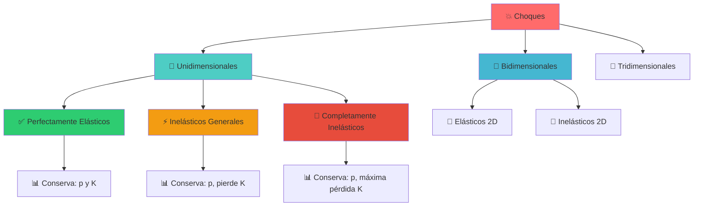
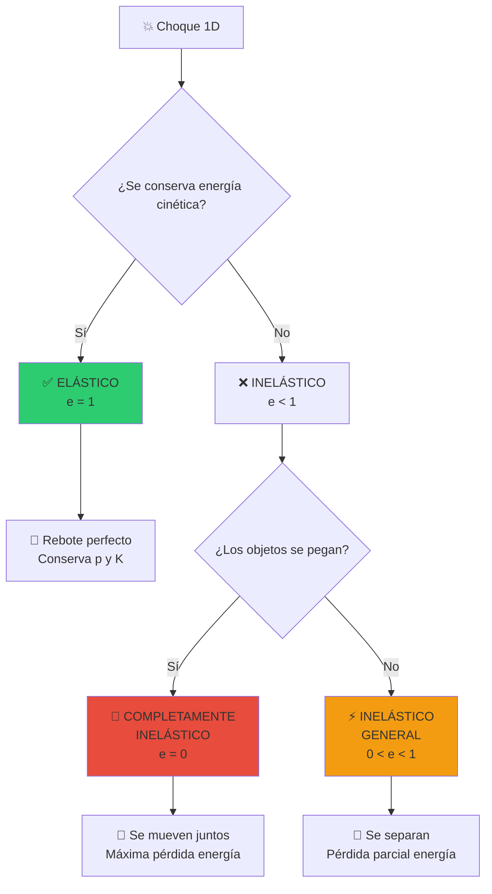
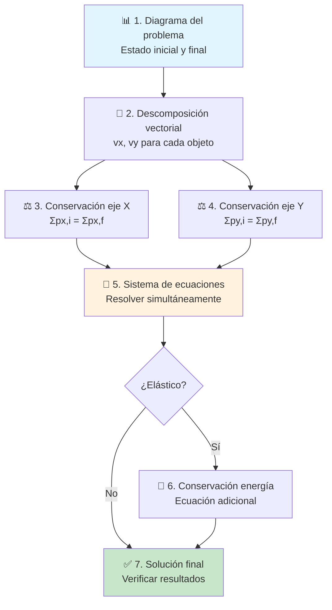
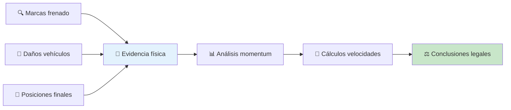
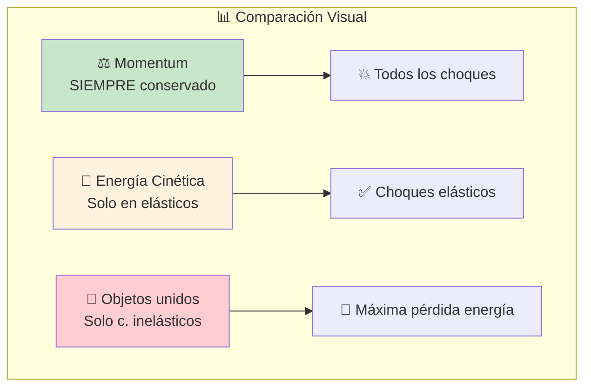

# 💥 Choques

## 🎯 Contexto Fundamental

> [!info] 📖 Definición General Un **choque** es una interacción entre dos o más objetos en la que se intercambian momentum y posiblemente energía en un tiempo muy corto. Los choques son eventos fundamentales en mecánica que permiten aplicar los principios de conservación de manera directa y observable.

> [!important] 🔬 Características Distintivas
> 
> - ⏱️ **Duración extremadamente corta**: Las fuerzas actúan durante intervalos de tiempo mínimos
> - 💪 **Fuerzas intensas**: Magnitudes muy grandes durante la interacción
> - ⚖️ **Conservación del momentum**: Principio fundamental que siempre se mantiene
> - 🔋 **Energía variable**: Puede conservarse, perderse o transformarse según el tipo

---

## 📊 Variables Fundamentales

> [!tip] 🔢 Magnitudes en Choques
> 
> |Variable|Símbolo|Unidad|Tipo|Descripción|
> |---|---|---|---|---|
> |Momento lineal|p⃗|kg·m/s|Vectorial|Cantidad de movimiento|
> |Masa|m|kg|Escalar|Invariante durante choque|
> |Velocidad|v⃗|m/s|Vectorial|Antes y después del choque|
> |Energía cinética|K|J|Escalar|Puede conservarse o perderse|
> |Coeficiente restitución|e|-|Escalar|Caracteriza el tipo de choque|
> |Impulso|J⃗|N·s|Vectorial|Cambio de momentum|

### 🎯 Nomenclatura Estándar

> [!note] 📝 Convención de Subíndices
> 
> - **i**: Estado inicial (antes del choque)
> - **f**: Estado final (después del choque)
> - **1, 2**: Objetos participantes
> - **x, y**: Componentes en ejes cartesianos

---

# 📏 Choques Unidimensionales

## 🎯 Fundamentos 1D

> [!info] 🔍 Características Especiales Un **choque unidimensional** ocurre cuando todos los objetos se mueven a lo largo de una **única línea recta**. Es el caso más simple de analizar y proporciona la base conceptual para entender situaciones más complejas.
> 
> **Ventajas del análisis 1D:**
> 
> - 🔢 **Análisis escalar**: Sin necesidad de descomposición vectorial
> - ➕➖ **Signos simples**: Direcciones representadas por signos
> - 🧮 **Matemáticas directas**: Ecuaciones algebraicas lineales

## 🧮 Principios Fundamentales

### ⚖️ Conservación Universal del Momentum

> [!important] 🏛️ Ley Fundamental **En TODOS los tipos de choques:** $$p_{inicial} = p_{final}$$ $$m_1v_{1,i} + m_2v_{2,i} = m_1v_{1,f} + m_2v_{2,f}$$
> 
> _Esta ley se cumple independientemente del tipo de choque_

### 🔋 Conservación Condicional de Energía

> [!warning] ⚠️ Solo en Choques Elásticos $$K_{inicial} = K_{final}$$ $$\frac{1}{2}m_1v_{1,i}^2 + \frac{1}{2}m_2v_{2,i}^2 = \frac{1}{2}m_1v_{1,f}^2 + \frac{1}{2}m_2v_{2,f}^2$$

### 📊 Coeficiente de Restitución

> [!tip] 💡 Clasificador Universal $$e = \frac{v_{2,f} - v_{1,f}}{v_{1,i} - v_{2,i}} = \frac{\text{velocidad relativa separación}}{\text{velocidad relativa aproximación}}$$
> 
> **Interpretación del coeficiente:**
> 
> - **e = 1**: Perfectamente elástico ✅
> - **e = 0**: Completamente inelástico 🔗
> - **0 < e < 1**: Inelástico general ⚡

## 🔬 Clasificación de Choques 1D

### ✅ Choque Perfectamente Elástico

> [!success] 🎾 Características
> 
> - **Conserva**: Momentum Y energía cinética
> - **Objetos**: Se separan después del choque
> - **Ejemplos**: Bolas de billar ideales, colisiones atómicas
> - **Coeficiente**: e = 1

**Fórmulas para velocidades finales:** $$v_{1f} = \frac{(m_1-m_2)v_{1i} + 2m_2v_{2i}}{m_1+m_2}$$ $$v_{2f} = \frac{(m_2-m_1)v_{2i} + 2m_1v_{1i}}{m_1+m_2}$$

### 🔗 Choque Completamente Inelástico

> [!danger] 🚂 Características
> 
> - **Conserva**: Solo momentum
> - **Objetos**: Se pegan y se mueven juntos
> - **Pérdida**: Máxima energía cinética posible
> - **Coeficiente**: e = 0

**Fórmula para velocidad final:** $$v_f = \frac{m_1v_{1i} + m_2v_{2i}}{m_1 + m_2}$$

### ⚡ Choque Inelástico General

> [!warning] 🏈 Características
> 
> - **Conserva**: Solo momentum
> - **Objetos**: Se separan con velocidades diferentes
> - **Pérdida**: Energía cinética parcial
> - **Coeficiente**: 0 < e < 1

---

## 🧪 Ejercicio Resuelto 1D

### 🎱 Problema: Bolas de Billar

> [!example] 🔍 Choque Elástico Clásico **Situación**: Una bola de billar de 0.2 kg se mueve a 3 m/s y choca elásticamente con otra bola idéntica en reposo.
> 
> **Datos:**
> 
> - m₁ = m₂ = 0.2 kg
> - v₁ᵢ = 3 m/s, v₂ᵢ = 0 m/s
> - Choque perfectamente elástico
> 
> **Encontrar:** Velocidades finales de ambas bolas

**Solución:**

> [!success] ✅ Método Sistemático
> 
> **1. Conservación del momentum:** $$m_1v_{1i} + m_2v_{2i} = m_1v_{1f} + m_2v_{2f}$$ $$0.2 \times 3 + 0.2 \times 0 = 0.2v_{1f} + 0.2v_{2f}$$ $$0.6 = 0.2(v_{1f} + v_{2f})$$ $$v_{1f} + v_{2f} = 3 \quad \text{(Ecuación 1)}$$
> 
> **2. Conservación de energía:** $$\frac{1}{2}m_1v_{1i}^2 + \frac{1}{2}m_2v_{2i}^2 = \frac{1}{2}m_1v_{1f}^2 + \frac{1}{2}m_2v_{2f}^2$$ $$\frac{1}{2}(0.2)(3)^2 = \frac{1}{2}(0.2)(v_{1f}^2 + v_{2f}^2)$$ $$v_{1f}^2 + v_{2f}^2 = 9 \quad \text{(Ecuación 2)}$$
> 
> **3. Resolver el sistema:**
> 
> - De (1): v₂f = 3 - v₁f
> - Sustituyendo en (2): v₁f² + (3 - v₁f)² = 9
> - Desarrollando: 2v₁f² - 6v₁f = 0
> - Factorizando: v₁f(2v₁f - 6) = 0
> 
> **4. Soluciones:**
> 
> - v₁f = 0 m/s (la primera bola para)
> - v₂f = 3 m/s (la segunda adquiere toda la velocidad)

> [!note] 📝 Interpretación Física **Caso especial de masas iguales:** En choques elásticos entre objetos de **masas iguales**, donde uno está inicialmente en reposo:
> 
> - El objeto en movimiento **se detiene completamente**
> - El objeto en reposo **adquiere toda la velocidad inicial**
> - Es una **transferencia total** de momentum y energía

---

# 📐 Choques Bidimensionales

## 🎯 Complejidad Dimensional

> [!info] 🔍 Características 2D Un **choque bidimensional** ocurre cuando la interacción no se limita a una línea recta. Las velocidades tienen componentes en múltiples ejes, requiriendo análisis vectorial completo y consideraciones geométricas adicionales.
> 
> **Complejidades adicionales:**
> 
> - 📐 **Análisis vectorial completo**: Descomposición en componentes
> - 🧮 **Sistema de ecuaciones ampliado**: Una ecuación por cada eje
> - 🎯 **Ángulos críticos**: Direcciones de entrada y salida importantes
> - 🔄 **Conservación independiente**: Por cada componente espacial

## 🧮 Ecuaciones Vectoriales

### ⚖️ Conservación por Componentes

> [!important] 🎯 Aplicación Independiente por Eje
> 
> **Componente X:** $$m_1v_{1x,i} + m_2v_{2x,i} = m_1v_{1x,f} + m_2v_{2x,f}$$
> 
> **Componente Y:** $$m_1v_{1y,i} + m_2v_{2y,i} = m_1v_{1y,f} + m_2v_{2y,f}$$
> 
> **Componente Z (si aplica):** $$m_1v_{1z,i} + m_2v_{2z,i} = m_1v_{1z,f} + m_2v_{2z,f}$$

### 🔋 Conservación de Energía 2D

> [!note] 📐 Para Choques Elásticos $$\frac{1}{2}m_1|\vec{v}_{1,i}|^2 + \frac{1}{2}m_2|\vec{v}_{2,i}|^2 = \frac{1}{2}m_1|\vec{v}_{1,f}|^2 + \frac{1}{2}m_2|\vec{v}_{2,f}|^2$$
> 
> **Donde la magnitud vectorial es:** $$|\vec{v}|^2 = v_x^2 + v_y^2 + v_z^2$$

## 🛠️ Metodología de Resolución 2D

> [!tip] 💡 Estrategia de Resolución
> 
> **Pasos sistemáticos:**
> 
> 1. 📊 **Dibujar** la situación antes y después con vectores
> 2. 📐 **Descomponer** todas las velocidades en componentes
> 3. ⚖️ **Aplicar** conservación del momentum en cada eje
> 4. 🔋 **Añadir** conservación de energía si es elástico
> 5. 🧮 **Resolver** el sistema de ecuaciones resultante
> 6. ✅ **Verificar** que los resultados tengan sentido físico

---

## 🧪 Ejercicio Resuelto 2D

### 🎱 Problema: Colisión en Mesa de Billar

> [!example] 🔍 Choque Bidimensional Realista **Situación**: Una bola de billar de 0.5 kg se mueve a 4 m/s en dirección +x y choca con otra bola de 0.5 kg en reposo. Después del choque, la primera bola se mueve a 2 m/s formando un ángulo de 45° con el eje x.
> 
> **Datos:**
> 
> - m₁ = m₂ = 0.5 kg
> - v₁ᵢ = 4 m/s (dirección +x)
> - v₂ᵢ = 0 m/s (en reposo)
> - v₁f = 2 m/s a 45°
> 
> **Encontrar:** Velocidad y dirección de la segunda bola después del choque

**Solución:**

> [!success] ✅ Análisis Paso a Paso
> 
> **1. Descomposición de velocidades iniciales:**
> 
> - v₁ₓᵢ = 4 m/s, v₁ᵧᵢ = 0 m/s
> - v₂ₓᵢ = 0 m/s, v₂ᵧᵢ = 0 m/s
> 
> **2. Descomposición de velocidad final conocida:**
> 
> - v₁ₓf = 2 cos(45°) = 2 × 0.707 = 1.414 m/s
> - v₁ᵧf = 2 sin(45°) = 2 × 0.707 = 1.414 m/s
> 
> **3. Conservación del momentum en eje X:** $$m_1v_{1x,i} + m_2v_{2x,i} = m_1v_{1x,f} + m_2v_{2x,f}$$ $$0.5 \times 4 + 0.5 \times 0 = 0.5 \times 1.414 + 0.5 \times v_{2x,f}$$ $$2 = 0.707 + 0.5v_{2x,f}$$ $$v_{2x,f} = 2.586 \text{ m/s}$$
> 
> **4. Conservación del momentum en eje Y:** $$m_1v_{1y,i} + m_2v_{2y,i} = m_1v_{1y,f} + m_2v_{2y,f}$$ $$0.5 \times 0 + 0.5 \times 0 = 0.5 \times 1.414 + 0.5 \times v_{2y,f}$$ $$0 = 0.707 + 0.5v_{2y,f}$$ $$v_{2y,f} = -1.414 \text{ m/s}$$
> 
> **5. Magnitud y dirección de la velocidad final:** $$|\vec{v}_{2f}| = \sqrt{v_{2x,f}^2 + v_{2y,f}^2} = \sqrt{(2.586)^2 + (-1.414)^2} = 2.95 \text{ m/s}$$ $$\theta = \arctan\left(\frac{v_{2y,f}}{v_{2x,f}}\right) = \arctan\left(\frac{-1.414}{2.586}\right) = -28.7°$$

> [!note] 📝 Interpretación del Resultado
> 
> - **Magnitud**: La segunda bola se mueve a 2.95 m/s
> - **Dirección**: 28.7° por debajo del eje x positivo
> - **Signo negativo**: Indica movimiento hacia abajo (eje -y)
> - **Verificación**: El momentum total se conserva en ambas direcciones

---

## 🔗 Aplicaciones Prácticas

### 🚗 Accidentes Automovilísticos

> [!warning] 🚨 Análisis Forense **Aplicación en investigación de accidentes:**
> 
> - 📊 **Reconstrucción**: Usar marcas de frenado y daños
> - 🎯 **Velocidades**: Calcular velocidades antes del impacto
> - 📐 **Ángulos**: Determinar direcciones de movimiento
> - ⚖️ **Responsabilidades**: Asignar culpabilidades basadas en física

### ⚽ Aplicaciones Deportivas

> [!tip] 🏀 Optimización de Técnica **Deportes con pelotas y proyectiles:**
> 
> - ⚾ **Béisbol**: Ángulo óptimo del bat para máxima distancia
> - 🏀 **Básquetbol**: Rebotes controlados en el tablero
> - ⚽ **Fútbol**: Efectos de rotación y ángulos de golpeo
> - 🎾 **Tenis**: Estrategias de devolución según el spin

### 🔬 Física de Partículas

> [!info] ⚛️ Colisiones Subatómicas **Experimentos en aceleradores:**
> 
> - 💥 **Detección**: Identificar partículas por sus trayectorias
> - 📊 **Conservación**: Verificar leyes fundamentales
> - 🆕 **Descubrimientos**: Encontrar nuevas partículas
> - ⚡ **Energías**: Analizar transferencias energéticas extremas

---

## 📊 Comparación de Tipos de Choques

> [!abstract] 📋 Tabla Comparativa Completa
> 
> |Tipo|Conserva Momentum|Conserva Energía|Coeficiente e|Estado Final|Ejemplos|
> |---|---|---|---|---|---|
> |**✅ Elástico**|✅ Sí|✅ Sí|e = 1|Se separan|🎱 Billar, ⚛️ Átomos|
> |**⚡ Inelástico**|✅ Sí|❌ No|0 < e < 1|Se separan|🏈 Deportes, 🚗 Colisiones|
> |**🔗 C. Inelástico**|✅ Sí|❌ No|e = 0|Se pegan|🚂 Vagones, 🎯 Proyectiles|

---

## 💡 Estrategias Avanzadas

> [!tip] 🎯 Técnicas de Resolución Avanzadas
> 
> **Para problemas complejos:**
> 
> 1. 🎨 **Visualización**: Crear diagramas detallados antes/después
> 2. 📐 **Sistemas coordenados**: Elegir ejes que simplifiquen cálculos
> 3. 🔄 **Simetría**: Aprovechar simetrías del problema cuando existan
> 4. 🧮 **Software**: Usar herramientas computacionales para casos complejos
> 5. 📏 **Aproximaciones**: Identificar cuándo usar modelos simplificados

> [!success] ✅ Verificaciones Importantes
> 
> - **Unidades**: Todas las magnitudes deben ser consistentes
> - **Sentido físico**: Los resultados deben ser razonables
> - **Límites**: Comprobar casos extremos (masas muy diferentes)
> - **Conservación**: Verificar que se cumplan todas las leyes aplicables

> [!warning] ❌ Errores Frecuentes
> 
> - Confundir tipos de choques y sus propiedades
> - Olvidar descomponer vectores en problemas 2D/3D
> - No verificar si la energía se conserva antes de asumirlo
> - Usar fórmulas incorrectas para el tipo de choque
> - Ignorar la importancia de los signos en 1D

---

## 🔗 Referencias y Enlaces

> [!quote] 📚 Notas Relacionadas
> 
> ### Conceptos Fundamentales
> 
> - [[Impulso Lineal]] - Cambio de momentum durante choques
> - [[Momentum Lineal y Su Conservación]] - Principio fundamental aplicado
> - [[Leyes de Newton]] - Base teórica de las interacciones
> 
> ### Aplicaciones Directas
> 
> - [[Trabajo y Energía]] - Análisis energético de choques
> - [[Centro de Masa]] - Para sistemas de múltiples partículas
> - [[Dinámica de Sistemas]] - Extensión a muchas partículas
> 
> ### Conceptos Relacionados
> 
> - [[Momento Angular]] - Choques con rotación
> - [[Oscilaciones]] - Choques en sistemas vibratorios
> - [[Ondas]] - Choques elásticos y transmisión de energía
> 
> ### Aplicaciones Avanzadas
> 
> - [[Mecánica de Fluidos]] - Choques en medios continuos
> - [[Relatividad Especial]] - Choques a altas velocidades
> - [[Física de Partículas]] - Colisiones subatómicas
> - [[Astrofísica]] - Colisiones planetarias y estelares
> 
> ### Temas Complementarios
> 
> - [[Análisis Forense]] - Reconstrucción de accidentes
> - [[Biomecánica]] - Choques en sistemas biológicos
> - [[Ingeniería de Seguridad]] - Diseño de sistemas de protección

---

## 📋 Síntesis Integral

> [!summary] 📊 Conceptos Esenciales
> 
> **💥 Definición y Naturaleza:**
> 
> - Interacciones de corta duración con fuerzas intensas
> - Aplicación directa de principios de conservación
> - Clasificación según conservación de energía cinética
> 
> **⚖️ Principios Universales:**
> 
> - **Momentum**: SIEMPRE se conserva (si sistema aislado)
> - **Energía**: Se conserva SOLO en choques elásticos
> - **Coeficiente de restitución**: Caracteriza el tipo de choque
> 
> **📐 Dimensionalidad:**
> 
> - **1D**: Análisis escalar con signos direccionales
> - **2D/3D**: Análisis vectorial por componentes independientes
> - **Complejidad**: Aumenta con dimensiones adicionales
> 
> **🔬 Clasificación Principal:**
> 
> - **✅ Elásticos**: Conservan momentum y energía (e = 1)
> - **⚡ Inelásticos**: Conservan solo momentum (0 < e < 1)
> - **🔗 C. Inelásticos**: Conservan momentum, máxima pérdida energía (e = 0)
> 
> **🛠️ Aplicaciones Clave:**
> 
> - Análisis de accidentes y seguridad vehicular
> - Optimización de técnicas deportivas
> - Investigación en física de partículas
> - Diseño de sistemas de protección

---

_Tags: #física #mecánica #choques #colisiones #momentum #conservación #dinámica #impulso_

