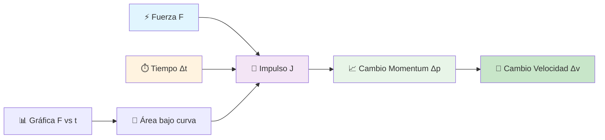
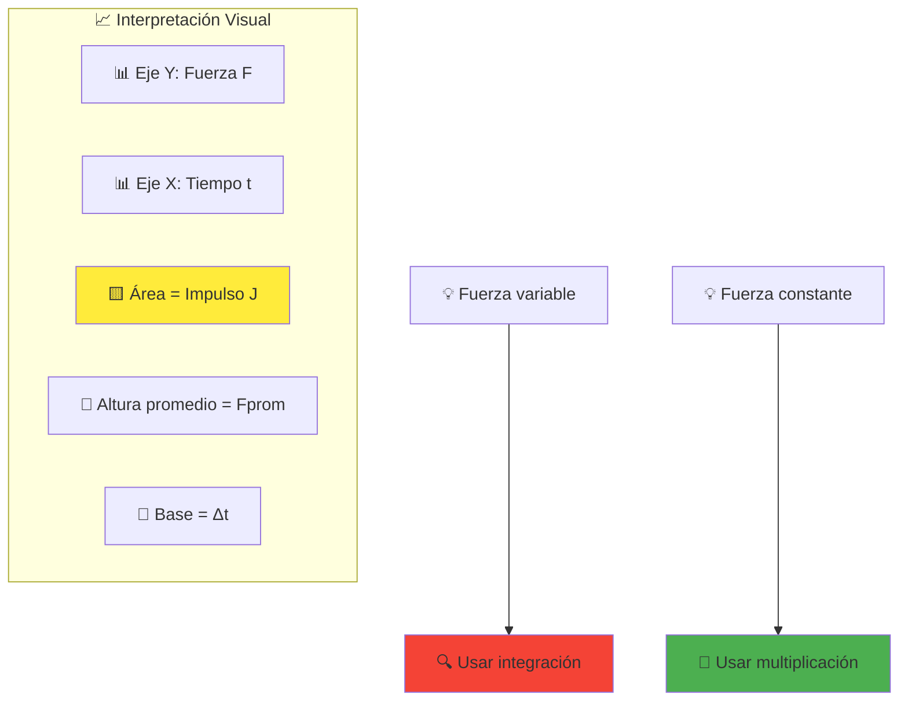
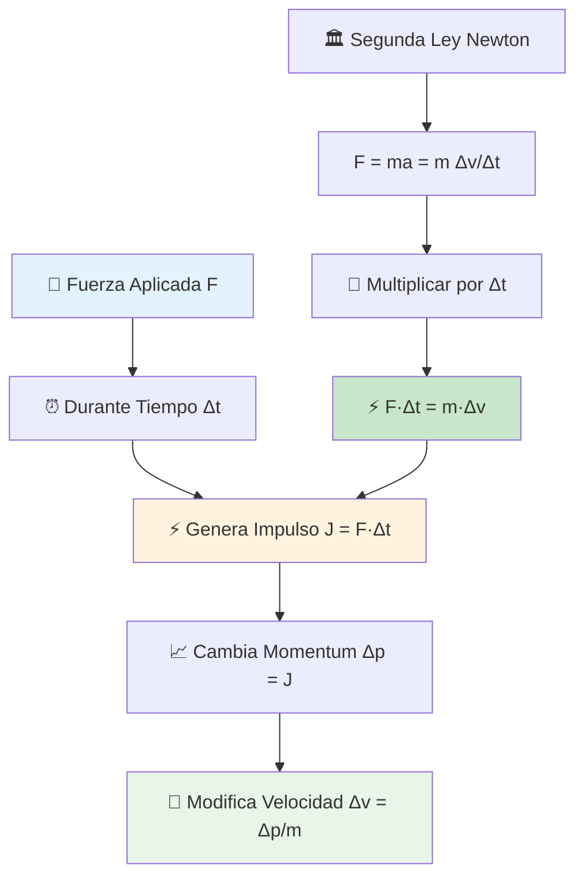
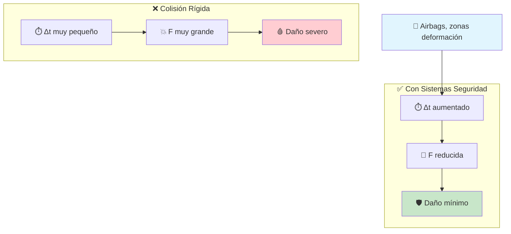

# ⚡ Impulso

## 🧠 Contexto Fundamental

> [!info] 📖 Definición Principal El **impulso** es una magnitud física vectorial que describe el **efecto acumulado** de una fuerza sobre un objeto durante un intervalo de tiempo específico. Está directamente relacionado con el cambio en el momento lineal del objeto y es fundamental para analizar colisiones y eventos de corta duración.

> [!example] 🎯 Aplicaciones Clave
> 
> - 🚗 **Sistemas de seguridad**: Airbags y zonas de deformación
> - ⚾ **Deportes**: Técnicas de golpeo y recepción
> - 🛡️ **Protección contra impactos**: Cascos y armaduras
> - 🚀 **Propulsión**: Motores de cohetes

---

## 📊 Variables y Magnitudes

> [!tip] 🔢 Tabla de Variables
> 
> |Símbolo|Magnitud|Unidad SI|Unidad Alt.|Tipo|Descripción|
> |---|---|---|---|---|---|
> |**J⃗**|Impulso|N·s|kg·m/s|Vectorial|Efecto acumulado de fuerza|
> |**F⃗**|Fuerza|N|kg·m/s²|Vectorial|Agente de cambio|
> |**Δt**|Tiempo|s|-|Escalar|Duración de aplicación|
> |**p⃗**|Momentum|kg·m/s|N·s|Vectorial|Cantidad de movimiento|
> |**m**|Masa|kg|-|Escalar|Inercia del objeto|
> |**v⃗**|Velocidad|m/s|-|Vectorial|Rapidez y dirección|

### 🔗 Relaciones Conceptuales

---

## 🧮 Fórmulas Fundamentales

### 📐 Definición Básica

> [!note] 📝 Impulso para Fuerza Constante $$\vec{J} = \vec{F}_{promedio} \cdot \Delta t$$
> 
> **Para fuerza constante o fuerza promedio durante el intervalo**

### 🔄 Impulso para Fuerza Variable

> [!warning] ⚠️ Integración Necesaria $$\vec{J} = \int_{t_i}^{t_f} \vec{F}(t) , dt$$
> 
> **El impulso es el área bajo la curva F vs t**

### ⚖️ Teorema Impulso-Momentum

> [!important] 🎯 Relación Fundamental $$\vec{J}_{neto} = \Delta \vec{p} = \vec{p}_{final} - \vec{p}_{inicial}$$ $$\vec{J}_{neto} = m(\vec{v}_f - \vec{v}_i)$$
> 
> **El impulso neto es igual al cambio en el momentum lineal**

---

## 📈 Interpretación Gráfica

### 📊 Análisis de Gráfica Fuerza vs Tiempo

> [!example] 🔍 Casos Prácticos
> 
> **Fuerza Constante:**
> 
> - Área = Rectángulo
> - J = F × Δt
> 
> **Fuerza Variable:**
> 
> - Área bajo curva
> - J = ∫F(t)dt
> 
> **Fuerza de Impacto:**
> 
> - Pico alto, tiempo corto
> - Útil para análisis de colisiones

---

## 🔄 Principios Físicos Fundamentales

### 🎯 Teorema Impulso-Momentum Explicado

> [!info] 🔗 Conexión con Newton El teorema de impulso es una **reformulación integral** de la Segunda Ley:
> 
> - **Forma diferencial**: F = dp/dt
> - **Forma integral**: J = ∫F dt = Δp
> - **Equivalencia**: Ambas describen el mismo fenómeno físico

---

## 🛠️ Aplicaciones Prácticas

### 🚗 Sistemas de Seguridad Vehicular

> [!tip] 💡 Principio de Protección **Estrategia fundamental**: Aumentar Δt para reducir F
> 
> **Razonamiento:**
> 
> - Impulso fijo: J = Δp (cambio inevitable en colisión)
> - Fuerza reducida: F = J/Δt (↑tiempo → ↓fuerza)
> - Resultado: Menor daño a ocupantes

### ⚾ Aplicaciones Deportivas

> [!example] 🎾 Técnica de Recepción **Atrapar una pelota correctamente:**
> 
> 1. **Extensión**: Llevar el guante hacia la pelota
> 2. **Cesión**: "Ceder" al impacto (aumentar Δt)
> 3. **Resultado**: Reducir fuerza sobre la mano
> 
> **Principio**: Mismo impulso, menor fuerza máxima

---

## 🧪 Ejercicios Resueltos

### 📝 Problema 1: Impulso con Fuerza Constante

> [!example] 🔍 Ejercicio Básico **Datos:**
> 
> - Masa: m = 2 kg
> - Velocidad inicial: v₁ = 3 m/s
> - Fuerza aplicada: F = 10 N (misma dirección)
> - Tiempo de aplicación: Δt = 4 s
> 
> **Encontrar:** Impulso y velocidad final

**Solución:**

> [!success] ✅ Paso a Paso
> 
> **1. Calcular impulso:** $$J = F \cdot \Delta t = 10 \text{ N} \times 4 \text{ s} = 40 \text{ N·s}$$
> 
> **2. Aplicar teorema impulso-momentum:** $$J = m(v_f - v_i)$$ $$40 = 2(v_f - 3)$$ $$20 = v_f - 3$$ $$v_f = 23 \text{ m/s}$$

### 🎾 Problema 2: Detención por Impulso

> [!example] 🔍 Pelota de Tenis **Datos:**
> 
> - Pelota: m = 0.05 kg
> - Velocidad inicial: v₁ = 30 m/s
> - Impulso de frenado: J = -1.5 N·s
> 
> **Encontrar:** Velocidad final

**Solución:**

> [!success] ✅ Aplicación Directa $$J = m(v_f - v_i)$$ $$-1.5 = 0.05(v_f - 30)$$ $$-30 = v_f - 30$$ $$v_f = 0 \text{ m/s}$$
> 
> **Interpretación:** El impulso negativo detiene completamente la pelota.

---

## 💡 Estrategias y Tips

> [!tip] 🎯 Metodología de Resolución
> 
> **Pasos Sistemáticos:**
> 
> 1. 🔍 Identificar sistema y fuerzas externas
> 2. ⏰ Determinar intervalo temporal relevante
> 3. ➕ Calcular impulso total (suma vectorial)
> 4. ⚖️ Aplicar teorema impulso-momentum
> 5. ✅ Verificar unidades y sentido físico

> [!warning] ❌ Errores Comunes
> 
> - Confundir impulso con trabajo (J ≠ W)
> - Ignorar el carácter vectorial
> - Olvidar considerar todas las fuerzas externas
> - Mezclar sistemas de referencia

> [!success] ✅ Buenas Prácticas
> 
> - Usar gráficas F vs t para fuerzas variables
> - Considerar siempre la dirección
> - Verificar consistencia de unidades
> - Aplicar conservación cuando sea relevante

---

## 🔗 Comparaciones Importantes

### ⚖️ Impulso vs Trabajo

> [!warning] ⚠️ Diferencias Fundamentales
> 
> |Aspecto|Impulso (J⃗)|Trabajo (W)|
> |---|---|---|
> |**Definición**|F⃗ · Δt|F⃗ · Δr⃗|
> |**Unidades**|N·s|J (N·m)|
> |**Relaciona con**|Cambio momentum|Cambio energía|
> |**Teorema**|J = Δp|W = ΔK|
> |**Carácter**|Vectorial|Escalar|
> |**Dependencia**|Tiempo|Desplazamiento|

---

## 🔗 Referencias y Enlaces

> [!quote] 📚 Notas Relacionadas
> 
> ### Conceptos Fundamentales
> 
> - [[Leyes de Newton]] - Base teórica del impulso
> - [[Momentum Lineal y Su Conservación]] - Magnitud que cambia por impulso
> - [[Trabajo y Energía]] - Concepto análogo pero diferente
> 
> ### Aplicaciones Directas
> 
> - [[Choques Uni-Bidimensionales]] - Aplicación práctica principal
> - [[Centro de Masa]] - Para sistemas de partículas
> - [[Dinámica Rotacional]] - Extensión al momentum angular
> 
> ### Temas Avanzados
> 
> - [[Mecánica Lagrangiana]] - Formulación generalizada
> - [[Relatividad Especial]] - Impulso a altas velocidades
> - [[Mecánica de Fluidos]] - Impulso en medios continuos

---

## 📋 Resumen Ejecutivo

> [!summary] 📊 Puntos Clave
> 
> **⚡ Definición Central:**
> 
> - Impulso = Efecto acumulado de fuerza en tiempo
> - J⃗ = F⃗_promedio · Δt (fuerza constante)
> - J⃗ = ∫F⃗(t)dt (fuerza variable)
> 
> **🎯 Teorema Fundamental:**
> 
> - Impulso neto = Cambio de momentum
> - J⃗_neto = Δp⃗ = m(v⃗_f - v⃗_i)
> 
> **📈 Interpretación Gráfica:**
> 
> - Área bajo curva F vs t
> - Especialmente útil para fuerzas de impacto
> 
> **🛠️ Aplicaciones Principales:**
> 
> - Análisis de colisiones y choques
> - Diseño de sistemas de protección
> - Optimización de técnicas deportivas

---

_Tags: #física #mecánica #impulso #momentum #dinámica #choques

