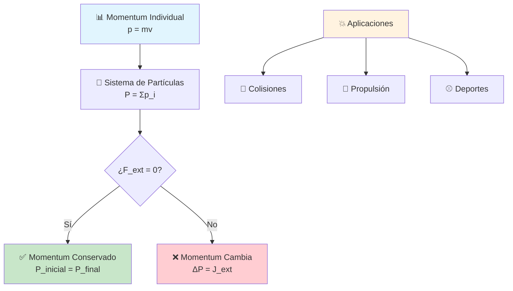
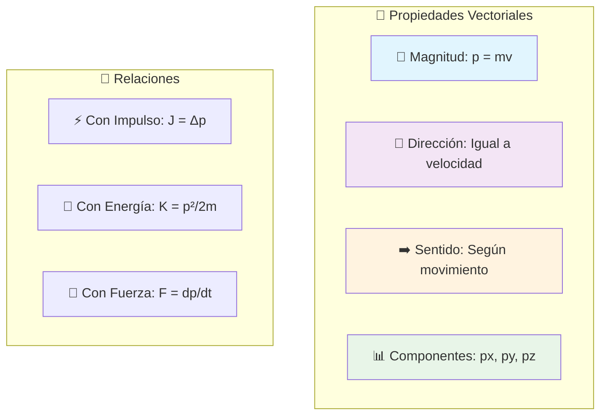
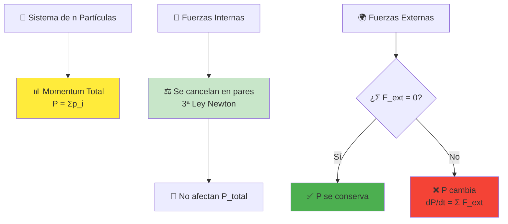
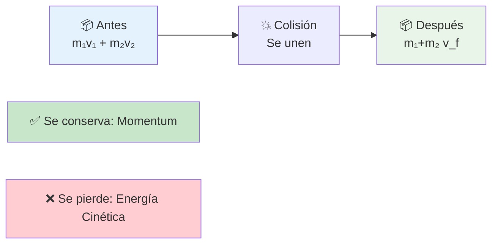
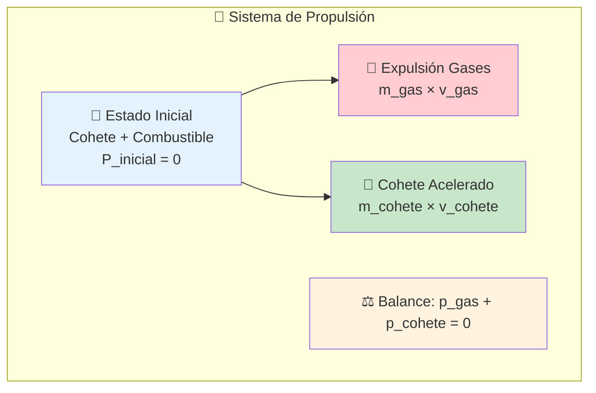
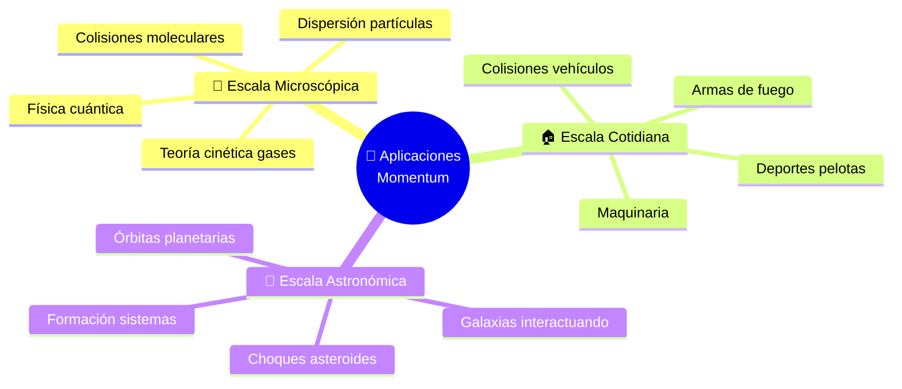
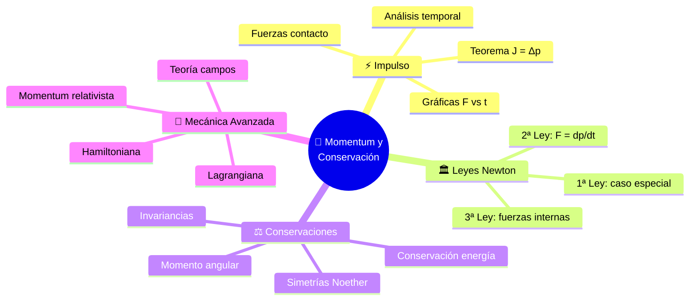

# 🎯 Momentum Lineal y su Conservación

## 🧠 Contexto Fundamental

> [!info] 📖 Definición General El **momentum lineal** (o cantidad de movimiento) es una propiedad vectorial fundamental que describe la "inercia en movimiento" de un objeto. Representa la tendencia de un cuerpo en movimiento a mantener su estado de movimiento, siendo directamente proporcional tanto a su masa como a su velocidad.

> [!important] 🏛️ Principio de Conservación El **principio de conservación del momentum** es una de las leyes de conservación más fundamentales de la física, aplicable desde partículas subatómicas hasta sistemas galácticos. Es esencial para analizar colisiones, explosiones y cualquier interacción entre cuerpos.

---

# 📐 PARTE I: Momentum Lineal

## 📊 Variables y Definiciones

> [!tip] 🔢 Tabla de Variables Fundamentales
> 
> |Símbolo|Magnitud|Unidad SI|Tipo|Descripción|
> |---|---|---|---|---|
> |**p⃗**|Momentum lineal|kg·m/s|Vectorial|Cantidad de movimiento|
> |**m**|Masa|kg|Escalar|Medida de inercia|
> |**v⃗**|Velocidad|m/s|Vectorial|Rapidez y dirección|
> |**F⃗**|Fuerza|N|Vectorial|Agente de cambio|
> |**J⃗**|Impulso|N·s|Vectorial|Cambio de momentum|
> |**K**|Energía cinética|J|Escalar|Energía de movimiento|

## 🧮 Fórmula Fundamental

### 📐 Definición Básica

> [!note] 📝 Momentum de una Partícula $$\vec{p} = m\vec{v}$$
> 
> **Características principales:**
> 
> - **Magnitud**: |p| = mv (para velocidades no relativistas)
> - **Dirección**: Idéntica a la velocidad
> - **Dependencia**: Directamente proporcional a masa y velocidad

## 🎯 Propiedades del Momentum

### 📈 Análisis Vectorial

> [!example] 🔍 Análisis en 2D **Para un objeto moviéndose en el plano:**
> 
> - **Componente x**: px = mvx
> - **Componente y**: py = mvy
> - **Magnitud total**: |p| = √(px² + py²)
> - **Ángulo**: θ = arctan(py/px)

### 🔄 Relaciones con Otras Magnitudes

> [!info] 🔗 Conexiones Fundamentales
> 
> **Con la energía cinética:** $$K = \frac{p^2}{2m} = \frac{mv^2}{2}$$
> 
> **Con la fuerza (Segunda Ley de Newton):** $$\vec{F} = \frac{d\vec{p}}{dt} = m\frac{d\vec{v}}{dt} = m\vec{a}$$

---

# ⚖️ PARTE II: Conservación del Momentum

## 🏛️ Principio Fundamental

### 📐 Enunciado de la Ley

> [!warning] ⚠️ Ley de Conservación del Momentum **Condición necesaria:** La fuerza externa neta sobre el sistema debe ser **cero**: $$\sum \vec{F}_{ext} = 0$$
> 
> **Consecuencia directa:** El momentum total del sistema se **conserva**: $$\vec{P}_{inicial} = \vec{P}_{final}$$
> 
> **Para sistema de n partículas:** $$\sum_{i=1}^{n} \vec{p}_{i,inicial} = \sum_{i=1}^{n} \vec{p}_{i,final}$$

## 🔍 Sistema de Partículas

### 🎯 Análisis de Fuerzas

> [!info] 📖 Fuerzas Internas vs Externas
> 
> **🔄 Fuerzas internas:**
> 
> - Actúan entre partículas del sistema
> - Se cancelan por la Tercera Ley de Newton
> - **No cambian** el momentum total del sistema
> 
> **🌍 Fuerzas externas:**
> 
> - Actúan desde fuera del sistema
> - **Pueden cambiar** el momentum total
> - Su suma vectorial determina si se conserva

## 🎯 Condiciones de Aplicación

### ✅ Cuándo se Conserva el Momentum

> [!success] ✅ Sistemas Aplicables
> 
> **🔒 Sistemas completamente aislados:**
> 
> - Sin fuerzas externas (ΣF_ext = 0)
> - Colisiones en tiempo muy corto
> - Explosiones internas
> - Sistemas en el espacio profundo
> 
> **⚖️ Sistemas con fuerzas externas despreciables:**
> 
> - Colisiones rápidas (gravedad despreciable en tiempo corto)
> - Superficies sin fricción
> - Fuerzas externas << fuerzas internas durante la interacción

### ❌ Limitaciones del Principio

> [!warning] ⚠️ Cuándo NO se Conserva
> 
> **Presencia de fuerzas externas significativas:**
> 
> - 🌍 Gravedad no compensada
> - 🔥 Fricción considerable
> - ⚡ Fuerzas electromagnéticas externas
> - 💨 Resistencia del aire importante
> - 🌊 Fuerzas de fluidos

---

## 🛠️ Aplicaciones Fundamentales

### 💥 Tipos de Colisiones

#### 🔗 Colisión Perfectamente Inelástica

> [!example] 🔍 Fórmula para Choque Inelástico **Objetos que se unen tras la colisión:** $$m_1\vec{v}_{1i} + m_2\vec{v}_{2i} = (m_1 + m_2)\vec{v}_f$$
> 
> **Velocidad final del sistema:** $$\vec{v}_f = \frac{m_1\vec{v}_{1i} + m_2\vec{v}_{2i}}{m_1 + m_2}$$

#### ⚾ Colisión Perfectamente Elástica

> [!tip] 💡 Doble Conservación **Se conservan ambas magnitudes:**
> 
> - **Momentum**: m₁v₁ᵢ + m₂v₂ᵢ = m₁v₁f + m₂v₂f
> - **Energía cinética**: ½m₁v₁ᵢ² + ½m₂v₂ᵢ² = ½m₁v₁f² + ½m₂v₂f²
> 
> **Velocidades finales (caso 1D):** $$v_{1f} = \frac{(m_1-m_2)v_{1i} + 2m_2v_{2i}}{m_1+m_2}$$ $$v_{2f} = \frac{(m_2-m_1)v_{2i} + 2m_1v_{1i}}{m_1+m_2}$$

### 🚀 Explosiones y Retroceso

> [!example] 🔍 Principio de Retroceso **Sistema inicialmente en reposo:** $$\vec{P}_{inicial} = 0$$ $$\vec{P}_{final} = \sum m_i\vec{v}_i = 0$$
> 
> **Aplicaciones prácticas:**
> 
> - 🔫 Disparos de armas de fuego
> - 🚀 Propulsión de cohetes
> - ⚛️ Fisión nuclear
> - 🌟 Desintegración radiactiva

---

## 📊 Análisis Gráfico

### 📈 Interpretación de Gráficas

#### 🎯 Momentum vs Velocidad (masa constante)

> [!info] 📊 Relación Lineal **Características del gráfico:**
> 
> - **Pendiente** = masa del objeto (m)
> - **Línea recta** que pasa por el origen
> - **Proporcionalidad directa** entre p y v

#### ⏱️ Momentum vs Tiempo

> [!tip] 💡 Interpretación de la Pendiente **Significado físico:** $$\frac{dp}{dt} = F_{neta}$$
> 
> **Casos especiales:**
> 
> - **Pendiente = 0**: Momentum constante → F_neta = 0
> - **Pendiente > 0**: Fuerza neta en dirección positiva
> - **Pendiente < 0**: Fuerza neta en dirección negativa

---

## 🧪 Ejercicios Resueltos

### 🚂 Problema 1: Colisión Tren-Vagón

> [!example] 🔍 Choque Perfectamente Inelástico **Datos:**
> 
> - Tren: m₁ = 10,000 kg, v₁ᵢ = 2.5 m/s
> - Vagón: m₂ = 5,000 kg, v₂ᵢ = 0 m/s (en reposo)
> - Después del choque se acoplan
> 
> **Encontrar:** Velocidad final del sistema acoplado

**Solución:**

> [!success] ✅ Paso a Paso
> 
> **1. Aplicar conservación del momentum:** $$m_1v_{1i} + m_2v_{2i} = (m_1 + m_2)v_f$$
> 
> **2. Sustituir valores conocidos:** $$10,000 \times 2.5 + 5,000 \times 0 = (10,000 + 5,000)v_f$$ $$25,000 = 15,000 \times v_f$$
> 
> **3. Resolver para velocidad final:** $$v_f = \frac{25,000}{15,000} = 1.67 \text{ m/s}$$

> [!note] 📝 Análisis Energético **Energía cinética inicial:** $$K_i = \frac{1}{2}(10,000)(2.5)^2 = 31,250 \text{ J}$$
> 
> **Energía cinética final:** $$K_f = \frac{1}{2}(15,000)(1.67)^2 = 20,917 \text{ J}$$
> 
> **Energía perdida:** $$\Delta K = 31,250 - 20,917 = 10,333 \text{ J}$$
> 
> _Esta energía se convierte en calor, sonido y deformación_

### 🧊 Problema 2: Hombre en Hielo

> [!example] 🔍 Sistema con Momentum Inicial Cero **Datos:**
> 
> - Hombre: m₁ = 80 kg, inicialmente en reposo
> - Pelota: m₂ = 0.2 kg, lanzada a v₂f = 10 m/s
> - Superficie sin fricción (sistema aislado)
> 
> **Encontrar:** Velocidad del hombre tras lanzar la pelota

**Solución:**

> [!success] ✅ Aplicación del Principio
> 
> **1. Momentum inicial del sistema:** $$P_{inicial} = 0 \text{ (ambos en reposo)}$$
> 
> **2. Conservación del momentum:** $$P_{inicial} = P_{final}$$ $$0 = m_1v_{1f} + m_2v_{2f}$$
> 
> **3. Despejar velocidad del hombre:** $$v_{1f} = -\frac{m_2v_{2f}}{m_1} = -\frac{0.2 \times 10}{80} = -0.025 \text{ m/s}$$

> [!tip] 💡 Interpretación Física
> 
> - **Signo negativo**: Movimiento en dirección opuesta a la pelota
> - **Magnitud pequeña**: Gran diferencia de masas → pequeña velocidad del objeto pesado
> - **Principio general**: En explosiones, objetos ligeros adquieren mayor velocidad

---

## 🔄 Casos Especiales

### ⚖️ Centro de Masa y Momentum

> [!info] 📖 Relación Fundamental **Momentum del sistema completo:** $$\vec{P}_{total} = M_{total}\vec{v}_{CM}$$
> 
> **Donde:**
> 
> - M_total = Σmᵢ (masa total del sistema)
> - v⃗_CM es la velocidad del centro de masa
> 
> **Implicación importante:** Si se conserva el momentum → El centro de masa se mueve con velocidad constante

### 🌌 Momentum en Diferentes Escalas

---

## 💡 Estrategias y Tips Avanzados

> [!tip] 🎯 Metodología Sistemática
> 
> **Pasos de resolución:**
> 
> 1. 🔍 **Definir el sistema** y sus límites claramente
> 2. 🌍 **Identificar fuerzas externas** significativas
> 3. ✅ **Verificar condiciones** de conservación
> 4. 📊 **Aplicar conservación** por componentes (x, y, z)
> 5. 🧮 **Resolver sistema** de ecuaciones
> 6. ✅ **Verificar resultados** física y matemáticamente

> [!success] ✅ Estrategias Efectivas
> 
> - **Diagramas**: Usar esquemas de antes/después para visualizar
> - **Componentes**: Separar en x, y, z para casos multidimensionales
> - **Unidades**: Verificar consistencia en todos los cálculos
> - **Casos límite**: Comprobar con masas muy diferentes o velocidades extremas
> - **Simetría**: Aprovechar simetrías del problema cuando existan

> [!warning] ❌ Errores Frecuentes
> 
> - Confundir momentum con energía cinética
> - Olvidar el carácter **vectorial** del momentum
> - No verificar si el sistema está **realmente aislado**
> - Mezclar diferentes **marcos de referencia**
> - Ignorar componentes en direcciones perpendiculares

---

## 🔗 Conexiones Conceptuales

---

## 🔗 Referencias y Enlaces

> [!quote] 📚 Notas Relacionadas
> 
> ### Conceptos Fundamentales
> 
> - [[Impulso Lineal]] - Cambio de momentum por fuerzas externas
> - [[Leyes de Newton]] - F = dp/dt como formulación general
> - [[Trabajo y Energía]] - Complemento energético al análisis dinámico
> 
> ### Aplicaciones Directas
> 
> - [[Choques Uni-Bidimensionales]] - Aplicación práctica principal del principio
> - [[Centro de Masa]] - Movimiento del punto representativo del sistema
> - [[Dinámica de Sistemas]] - Análisis de múltiples partículas
> 
> ### Conceptos Relacionados
> 
> - [[Momento Angular]] - Análogo rotacional del Momentum lineal
> - [[Principios de Conservación de la Energía]] - Principio complementario
> - [[Dinámica de Fluidos]] - Momentum en medios continuos
> 
> ### Temas Avanzados
> 
> - [[Mecánica Lagrangiana]] - Formulación generalizada
> - [[Relatividad Especial]] - Momentum a altas velocidades
> - [[Mecánica Cuántica]] - Momentum en escala microscópica
> - [[Teoría de Campos]] - Momentum en sistemas continuos

---

## 📋 Síntesis Integral

> [!summary] 📊 Conceptos Esenciales
> 
> **🎯 Momentum Lineal:**
> 
> - **Definición**: p⃗ = mv⃗ (inercia en movimiento)
> - **Naturaleza**: Magnitud vectorial fundamental
> - **Significado**: Describe la cantidad de movimiento de un objeto
> 
> **⚖️ Principio de Conservación:**
> 
> - **Condición**: Σ F⃗_ext = 0 (sistema aislado)
> - **Enunciado**: P⃗_inicial = P⃗_final
> - **Aplicabilidad**: Universal, desde partículas hasta galaxias
> 
> **🔗 Relaciones Fundamentales:**
> 
> - **Con impulso**: J⃗ = Δp⃗ (teorema impulso-momentum)
> - **Con fuerzas**: F⃗ = dp⃗/dt (Segunda Ley de Newton)
> - **Con energía**: K = p²/(2m) (relación energía-momentum)
> 
> **🛠️ Aplicaciones Principales:**
> 
> - Análisis de colisiones (elásticas e inelásticas)
> - Sistemas de propulsión y retroceso
> - Explosiones y fragmentaciones
> - Interacciones en física de partículas

---

_Tags: #física #mecánica #momentum #conservación #dinámica #colisiones #sistemas_

