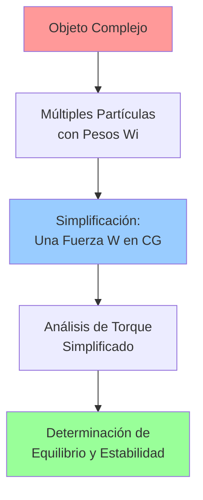
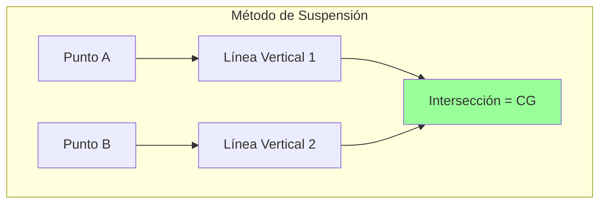
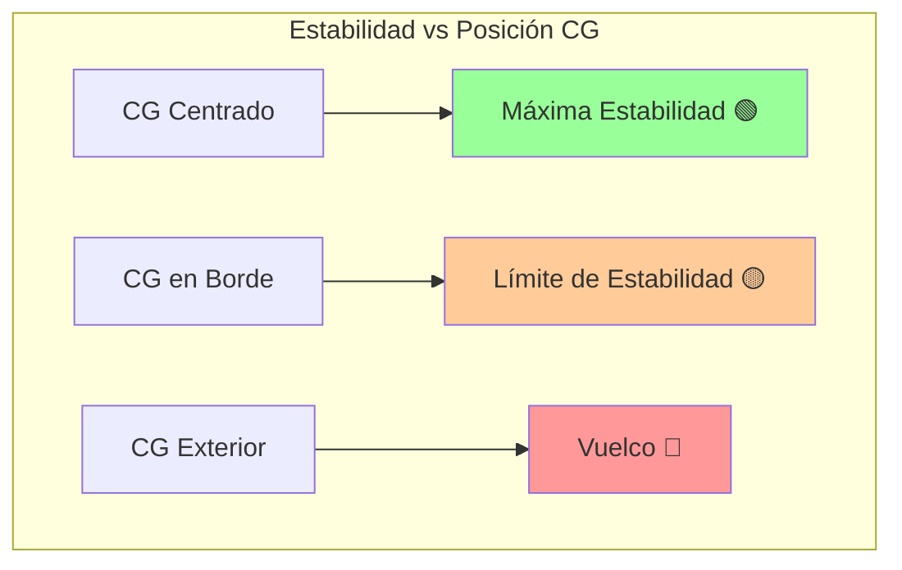

## Centro de Gravedad (CG) 🎯

> [!info] 📍 Definición Fundamental El **centro de gravedad** es el punto imaginario donde se puede considerar que actúa la fuerza total de la gravedad sobre un objeto o sistema. Para campos gravitatorios uniformes, es equivalente al **centro de masa** y es crucial para el análisis de equilibrio y estabilidad.

### Variables Clave 📊

> [!tip] 🔢 Magnitudes Principales
> 
> - **Vector posición del CG** ($\vec{r}_{CG}$): Ubicación del centro de gravedad
> - **Vector posición de partícula** ($\vec{r}_i$): Ubicación de cada partícula componente
> - **Masa total** ($M$): Suma de todas las masas del sistema
> - **Masa individual** ($m_i$): Masa de cada partícula
> - **Peso total** ($\vec{W} = M\vec{g}$): Fuerza gravitatoria sobre el objeto
> - **Peso individual** ($\vec{W}_i = m_i\vec{g}$): Fuerza gravitatoria sobre cada partícula

### Ecuaciones Fundamentales ⚖️

> [!warning] 🔶 Fórmulas Clave
> 
> **Para sistema de partículas discretas:** $$\vec{r}_{CG} = \frac{\sum m_i \vec{r}_i}{\sum m_i} = \frac{m_1\vec{r}_1 + m_2\vec{r}_2 + \dots}{M}$$
> 
> **Componentes cartesianas:** $$x_{CG} = \frac{\sum m_ix_i}{M}, \quad y_{CG} = \frac{\sum m_iy_i}{M}, \quad z_{CG} = \frac{\sum m_iz_i}{M}$$
> 
> **Para objetos continuos:** $$x_{CG} = \frac{1}{M}\int x ,dm, \quad y_{CG} = \frac{1}{M}\int y ,dm, \quad z_{CG} = \frac{1}{M}\int z ,dm$$

### Marco Teórico 🧠

> [!info] 💡 Concepto Fundamental El CG es el punto donde podemos **concentrar todo el peso** del objeto para simplificar análisis de torque. Esto transforma un sistema complejo de fuerzas distribuidas en una **sola fuerza resultante**.
> 
> **Principio clave:** Si la línea de acción del peso pasa por el punto de apoyo, el torque gravitatorio neto es **cero**.

### Métodos de Localización 🔍

> [!tip] 🛠️ Técnicas Prácticas
> 
> **🎣 Método de Suspensión:**
> 
> 1. Colgar objeto desde punto A
> 2. Marcar línea vertical (plomada)
> 3. Colgar desde punto B diferente
> 4. Marcar segunda línea vertical
> 5. **Intersección = Centro de Gravedad**
> 
> **📏 Método de Balance:**
> 
> - Encontrar punto donde objeto se equilibra
> - Útil para formas regulares

### Relación con Estabilidad 🏗️

> [!warning] ⚖️ Criterios de Estabilidad
> 
> **🟢 Equilibrio Estable:**
> 
> - CG dentro de la base de apoyo
> - Línea de acción del peso pasa por la base
> 
> **🔴 Vuelco Inminente:**
> 
> - CG en el borde de la base de apoyo
> - Línea de acción tangente al borde
> 
> **⚫ Vuelco:**
> 
> - CG fuera de la base de apoyo
> - Línea de acción pasa fuera de la base

### Aplicaciones Prácticas 🌍

> [!tip] 🚗 Ejemplos del Mundo Real
> 
> **🚛 Diseño Automotriz:**
> 
> - CG bajo → Mayor estabilidad
> - Reduce riesgo de vuelco en curvas
> 
> **🏗️ Construcción:**
> 
> - Torres: CG dentro de la base
> - Grúas: Contrapesos para equilibrar CG
> 
> **🤸 Biomecánica:**
> 
> - Postura humana: CG sobre pies
> - Deportes: Control del CG para balance

### Análisis de Casos 📝

> [!warning] 📐 Ejemplo: Mesa de Tres Patas **Problema:** ¿Cuándo será estable una mesa triangular?
> 
> **Solución:**
> 
> - Mesa estable si CG del sistema (mesa + objetos) está dentro del triángulo formado por las tres patas
> - Si se coloca objeto pesado cerca del borde, CG se desplaza
> - Límite de estabilidad: CG en el perímetro del triángulo
> 
> **Aplicación práctica:** Distribución de peso en mesas, sillas, estructuras

> [!tip] 🚶 Ejemplo: Equilibrio Humano **Situación:** Persona inclinándose
> 
> **Análisis:**
> 
> - Al inclinarse, CG se desplaza horizontalmente
> - Para no caer: CG debe permanecer sobre base de apoyo (pies)
> - Compensación: mover otras partes del cuerpo
> 
> **Aplicación:** Análisis de postura, rehabilitación, deportes

### Conexiones Conceptuales 🔗

> [!info] 🌐 Relaciones Interdisciplinarias
> 
> **Con Momento de Torsión:**
> 
> - CG es el punto de aplicación del peso
> - Simplifica cálculo de torque gravitatorio
> 
> **Con Equilibrio:**
> 
> - Posición del CG determina condiciones de equilibrio
> - Base para análisis de estabilidad
> 
> **Con Dinámica:**
> 
> - En rotación: CG se mueve en línea recta
> - Separación de traslación y rotación

### Consideraciones de Diseño 🎯

> [!tip] 🏗️ Principios de Ingeniería
> 
> - **Para estabilidad:** CG lo más bajo posible
> - **Para maniobrabilidad:** Balance entre estabilidad y agilidad
> - **Para eficiencia:** Distribución óptima de masa
> - **Para seguridad:** Márgenes de estabilidad adecuados

### Propiedades Importantes 📋

> [!info] ⭐ Características del CG
> 
> - **Único:** Cada objeto tiene un solo CG
> - **Puede estar fuera del objeto:** En formas cóncavas (ej: herradura)
> - **Se mueve con el objeto:** Mantiene posición relativa
> - **Independiente de orientación:** No cambia al rotar el objeto
> - **Equivalente al CM:** En campos gravitatorios uniformes

### Síntesis Esencial 🎯

> [!warning] 📌 Puntos Clave
> 
> - **Definición:** Punto donde actúa efectivamente todo el peso
> - **Cálculo:** Promedio ponderado de posiciones de masa
> - **Estabilidad:** CG dentro de base de apoyo = estable
> - **Aplicación:** Fundamental en diseño y análisis estructural
> - **Equivalencia:** CG ≈ CM en campos gravitatorios uniformes

---

## Referencias 📚

> [!quote] 🔗 Enlaces a Otras Notas
> 
> - [[Equilibrio: Estático, Estable e Inestable]]
> - [[Centro de Masa]]
> - [[Momento de Torsión]]
> - [[Estática]]
> - [[Dinámica Rotacional]]
> - [[Diseño Estructural]]

---

**Tags:** #física #mecánica #centro-gravedad #equilibrio #estabilidad #estática #diseño-estructural #biomecánica