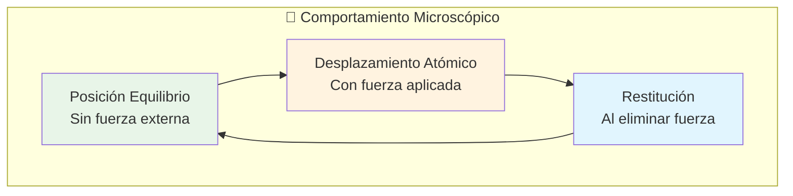
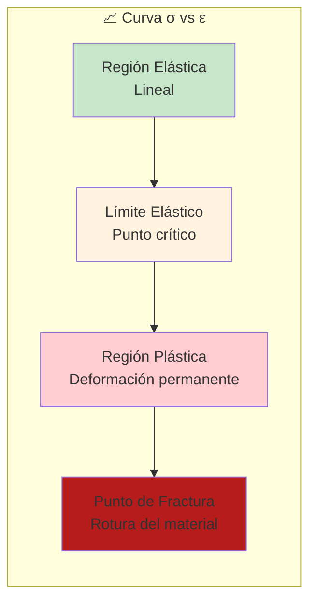
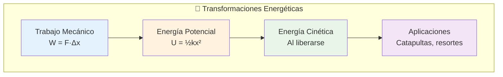
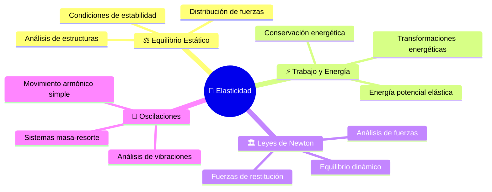

# 🔧 Elasticidad

## 🧠 Contexto Fundamental

> [!info] 📖 Definición de Elasticidad La **elasticidad** es la propiedad fundamental que tienen los cuerpos para **deformarse** bajo la acción de una fuerza externa y, posteriormente, **recuperar su forma original** cuando la fuerza se elimina. Este comportamiento diferencia a los materiales reales de los cuerpos rígidos ideales estudiados en mecánica clásica.

> [!note] 📝 Transición Conceptual Mientras que la **dinámica** y el **equilibrio** tratan a los objetos como cuerpos rígidos perfectos, la **elasticidad** reconoce que todos los materiales reales poseen cierta capacidad de deformación. La rigidez se convierte así en una propiedad intrínseca y cuantificable de cada material específico.

**Importancia en la física y ingeniería:**

- 🏗️ Diseño estructural y arquitectónico
- 🔩 Análisis de componentes mecánicos
- 🌉 Construcción de puentes y edificaciones
- ⚙️ Desarrollo de sistemas de suspensión

---

## 📊 Variables y Magnitudes Físicas

### 🔢 Variables Fundamentales

> [!tip] 💡 Sistema de Variables Elásticas
> 
> |Símbolo|Magnitud|Unidad SI|Definición Física|
> |---|---|---|---|
> |**σ**|Tensión (Esfuerzo)|Pa (N/m²)|Fuerza por unidad de área|
> |**ε**|Deformación|Adimensional|Cambio relativo de longitud|
> |**E**|Módulo de Young|Pa (N/m²)|Rigidez del material|
> |**F**|Fuerza aplicada|N|Carga externa|
> |**A**|Área transversal|m²|Sección del objeto|
> |**L₀**|Longitud original|m|Dimensión inicial|
> |**ΔL**|Cambio de longitud|m|Deformación absoluta|

### 🎯 Parámetros Característicos

> [!warning] ⚠️ Límites Críticos del Material **Límite elástico:** Tensión máxima que permite recuperación total de la forma original
> 
> **Resistencia a la rotura:** Tensión máxima que puede soportar el material antes de fracturarse
> 
> **Región de seguridad:** Zona de trabajo por debajo del límite elástico para aplicaciones prácticas

---

## 🧮 Fórmulas y Relaciones Fundamentales

### 📐 Definiciones Básicas

> [!note] 📝 Tensión (Esfuerzo) **Tensión normal:** $$\sigma = \frac{F}{A}$$
> 
> **Interpretación:** Representa la intensidad de la fuerza distribuida sobre el área de contacto. Una misma fuerza produce mayor tensión en áreas menores.

> [!note] 📝 Deformación Unitaria **Deformación relativa:** $$\epsilon = \frac{\Delta L}{L_0}$$
> 
> **Interpretación:** Mide qué fracción de su longitud original se ha deformado el objeto. Es independiente del tamaño absoluto del cuerpo.

### ⚖️ Ley de Hooke

> [!tip] 💡 Ley Fundamental de la Elasticidad **Relación tensión-deformación:** $$\sigma = E \cdot \epsilon$$
> 
> **Forma expandida:** $$\frac{F}{A} = E \cdot \frac{\Delta L}{L_0}$$
> 
> **Validez:** Solo aplicable dentro del rango elástico del material

> [!example] 🔍 Ley de Hooke para Resortes **Caso particular para resortes:** $$F = k \cdot x$$
> 
> Donde:
> 
> - `k` = constante elástica del resorte
> - `x` = deformación desde la posición de equilibrio
> 
> **Relación con el Módulo de Young:** $$k = \frac{EA}{L_0}$$

---

## 📈 Comportamiento de Materiales

### 🔍 Fundamentos Microscópicos

> [!info] 📖 Origen Atómico de la Elasticidad **Mecanismo fundamental:**
> 
> - Los átomos ocupan posiciones de equilibrio en la estructura cristalina
> - Las fuerzas externas desplazan átomos de sus posiciones estables
> - Las fuerzas interatómicas actúan como "resortes microscópicos"
> - En el rango elástico, las fuerzas de restitución restauran la configuración original

### 📊 Interpretación del Módulo de Young

> [!tip] 💡 Significado del Módulo de Young **Rigidez del material:**
> 
> - **E alto** (ej: acero, diamante) → Material muy rígido, poca deformación
> - **E bajo** (ej: caucho, polímeros) → Material flexible, alta deformación
> 
> **Ejemplos comparativos:**
> 
> - Acero: E ≈ 200 GPa
> - Aluminio: E ≈ 70 GPa
> - Madera: E ≈ 10 GPa
> - Caucho: E ≈ 0.01 GPa

---

## 📈 Análisis Gráfico: Curva Tensión-Deformación

### 🎯 Regiones Características

> [!success] ✅ Región Elástica (Lineal) **Características:**
> 
> - Relación lineal perfecta entre σ y ε
> - Se cumple exactamente la Ley de Hooke
> - La pendiente de la recta = Módulo de Young (E)
> - Deformación completamente reversible
> - Zona de trabajo segura para aplicaciones

> [!warning] ⚠️ Límite Elástico **Punto crítico de transición:**
> 
> - Máxima tensión para deformación completamente reversible
> - Más allá de este punto: deformación parcialmente permanente
> - Criterio de diseño: trabajar por debajo de este límite
> - Varía significativamente entre materiales

> [!danger] 🚨 Región Plástica **Deformación permanente:**
> 
> - La Ley de Hooke ya no es válida
> - Parte de la deformación persiste al eliminar la carga
> - Comportamiento no lineal y complejo
> - Puede preceder a la fractura del material

> [!danger] 🚨 Punto de Fractura **Falla catastrófica del material:**
> 
> - Tensión máxima que puede soportar el material
> - Rotura completa e irreversible
> - Pérdida total de capacidad de carga
> - Debe evitarse absolutamente en diseño

---

## 🛠️ Aplicaciones Prácticas

### 🏗️ Ingeniería Civil y Estructural

> [!example] 🔍 Aplicaciones en Construcción **Análisis estructural:**
> 
> - **Vigas:** Cálculo de deflexión bajo cargas
> - **Columnas:** Verificación de pandeo por compresión
> - **Cimientos:** Distribución de esfuerzos en el suelo
> - **Puentes:** Análisis de cargas dinámicas y estáticas
> 
> **Criterios de diseño:**
> 
> - Factor de seguridad: trabajar al 50-70% del límite elástico
> - Consideración de cargas dinámicas y fatiga
> - Análisis de deformaciones máximas admisibles

### ⚙️ Ingeniería Mecánica

> [!tip] 💡 Sistemas Mecánicos **Resortes y amortiguadores:**
> 
> - **Suspensión vehicular:** Control de vibraciones
> - **Sistemas de válvulas:** Retorno automático a posición
> - **Instrumentos de medición:** Báscula, dinamómetros
> 
> **Tensores y cables:**
> 
> - **Puentes colgantes:** Distribución de cargas por tensión
> - **Grúas:** Capacidad de elevación según resistencia del cable
> - **Líneas de transmisión:** Tensión vs temperatura

### 🔧 Ejemplo Práctico Resuelto

> [!example] 🔍 Cálculo de Deformación en Cable de Acero **Datos del problema:**
> 
> - Cable de acero: L₀ = 20 m, diámetro = 1 cm
> - Carga suspendida: m = 1000 kg
> - Módulo de Young del acero: E = 200 × 10⁹ Pa
> 
> **Encontrar:** Elongación del cable (ΔL)

**Solución paso a paso:**

1. **Calcular el área transversal:** $$A = \pi r^2 = \pi (0.005 \text{ m})^2 = 7.85 \times 10^{-5} \text{ m}^2$$
    
2. **Determinar la fuerza aplicada:** $$F = mg = 1000 \times 9.8 = 9800 \text{ N}$$
    
3. **Calcular la tensión:** $$\sigma = \frac{F}{A} = \frac{9800}{7.85 \times 10^{-5}} = 1.25 \times 10^8 \text{ Pa}$$
    
4. **Aplicar la Ley de Hooke:** $$\epsilon = \frac{\sigma}{E} = \frac{1.25 \times 10^8}{200 \times 10^9} = 6.25 \times 10^{-4}$$
    
5. **Calcular la elongación:** $$\Delta L = \epsilon \times L_0 = 6.25 \times 10^{-4} \times 20 = 0.0125 \text{ m} = 1.25 \text{ cm}$$
    

> [!note] 📝 Interpretación del Resultado El cable se estira apenas 1.25 cm bajo una carga de 1 tonelada, demostrando la alta rigidez del acero. Esta pequeña deformación es completamente reversible y está muy por debajo del límite elástico del material.

---

## ⚡ Energía Potencial Elástica

### 🔋 Almacenamiento de Energía

> [!info] 📖 Energía en Sistemas Elásticos **Concepto fundamental:** El trabajo realizado para deformar un objeto elástico se **almacena** como energía potencial elástica, que puede liberarse cuando el objeto recupera su forma original.

> [!tip] 💡 Energía Potencial Elástica **Para un resorte ideal:** $$U_{elástica} = \frac{1}{2}kx^2$$
> 
> **Para deformación general:** $$U = \frac{1}{2} \sigma \epsilon V$$
> 
> Donde V es el volumen del material deformado.

---

## 🔗 Conexiones Conceptuales

### 🎯 Interrelaciones Fundamentales

> [!note] 📝 Vínculos con Otros Conceptos **Con Equilibrio Estático:**
> 
> - Las fuerzas elásticas deben equilibrarse con cargas externas
> - Análisis de estructuras considera deformaciones reales
> 
> **Con Trabajo y Energía:**
> 
> - La deformación elástica almacena energía potencial
> - Principio de conservación energética en sistemas elásticos
> 
> **Con Oscilaciones:**
> 
> - Los resortes son la base del movimiento armónico simple
> - Frecuencia de oscilación depende de la constante elástica

---

## 💡 Tips y Estrategias de Resolución

> [!tip] 💡 Metodología Sistemática **🎯 Pasos para Problemas de Elasticidad:**
> 
> 1. **Identificar el tipo de deformación** (tracción, compresión, torsión)
> 2. **Definir las dimensiones relevantes** (longitud, área, volumen)
> 3. **Determinar las fuerzas aplicadas** y su distribución
> 4. **Verificar que se mantiene en rango elástico**
> 5. **Aplicar la Ley de Hooke apropiada**
> 6. **Interpretar físicamente los resultados**
> 
> **✅ Estrategias Efectivas:**
> 
> - **Diagramas de cuerpo libre** incluyendo fuerzas elásticas
> - **Verificación dimensional** de todas las ecuaciones
> - **Comparación con casos límite** conocidos
> - **Consideración de factores de seguridad** en aplicaciones

> [!warning] ⚠️ Errores Comunes a Evitar **❌ Conceptuales:**
> 
> - Confundir tensión (σ) con fuerza (F)
> - Olvidar que la deformación (ε) es adimensional
> - Asumir comportamiento elástico fuera del límite
> - Ignorar la direccionalidad en problemas 2D/3D
> 
> **❌ Matemáticos:**
> 
> - Errores en el cálculo del área transversal
> - Confusión entre longitud total y cambio de longitud
> - Unidades inconsistentes (especialmente en el Módulo de Young)

---

## 📚 Referencias y Conexiones

> [!quote] 🔗 Vínculos con Otros Temas de Mecánica
> 
> - [[Equilibrio Estático]] - Análisis de fuerzas en estructuras deformables
> - [[Trabajo y Energía]] - Energía potencial elástica y transformaciones
> - [[Oscilaciones]] - Sistemas masa-resorte y movimiento armónico
> - [[Fuerzas y DCL]] - Fuerzas de restitución elástica
> - [[Segunda Ley de Newton]] - Análisis dinámico de sistemas elásticos

> [!quote] 🔗 Aplicaciones Avanzadas
> 
> - [[Mecánica de Materiales]] - Análisis de esfuerzos complejos
> - [[Dinámica Estructural]] - Vibraciones en sistemas elásticos
> - [[Mecánica de Fracturas]] - Límites de resistencia de materiales
> - [[Análisis por Elementos Finitos]] - Modelado computacional

---

## 📋 Síntesis Integral

> [!summary] 📋 Conceptos Clave de Elasticidad **🔧 Fundamentos:**
> 
> - **Elasticidad:** Capacidad de deformación reversible de materiales
> - **Ley de Hooke:** σ = Eε (relación lineal tensión-deformación)
> - **Módulo de Young:** Medida de rigidez intrínseca del material
> 
> **📊 Análisis Gráfico:**
> 
> - **Curva σ-ε:** Comportamiento completo del material
> - **Región elástica:** Zona de trabajo segura y reversible
> - **Límites críticos:** Elástico y de fractura
> 
> **🛠️ Aplicaciones:**
> 
> - **Ingeniería:** Diseño de estructuras y componentes
> - **Energía:** Almacenamiento en sistemas elásticos
> - **Análisis:** Predicción de deformaciones y fallas

**Fuente:** S32 Elasticidad.pdf

---

## 🏷️ Tags

#mecánica #elasticidad #materiales #ley-de-hooke #modulo-young #tensión #deformación #ingeniería #estructuras #resortes #energia-potencial

---

_Última actualización: Propiedades elásticas de materiales y aplicaciones en ingeniería_