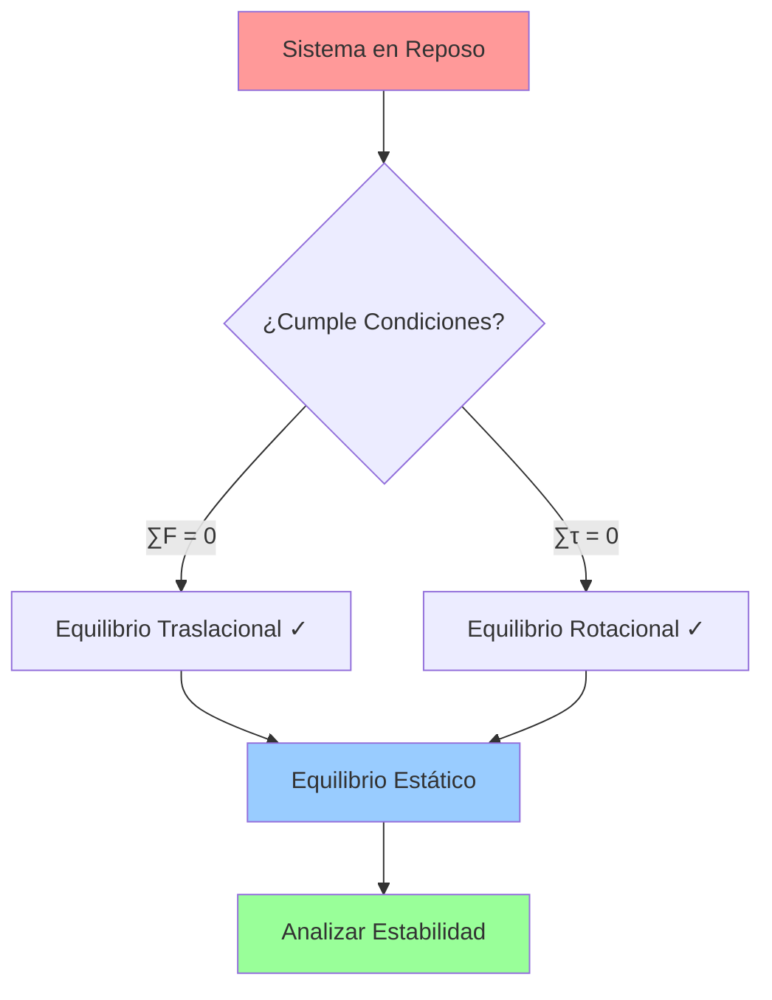
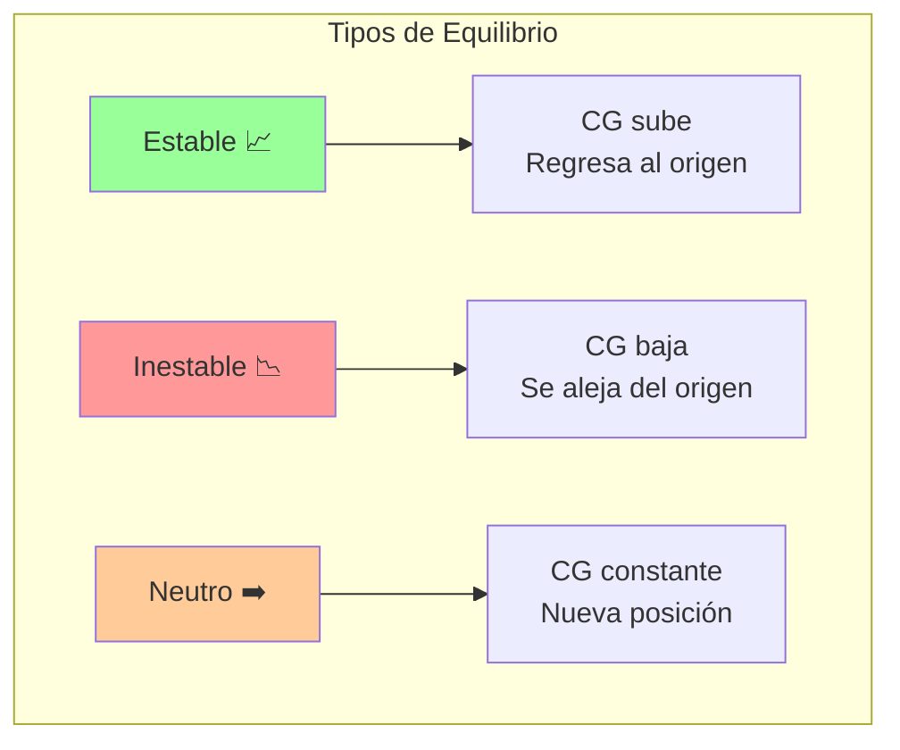
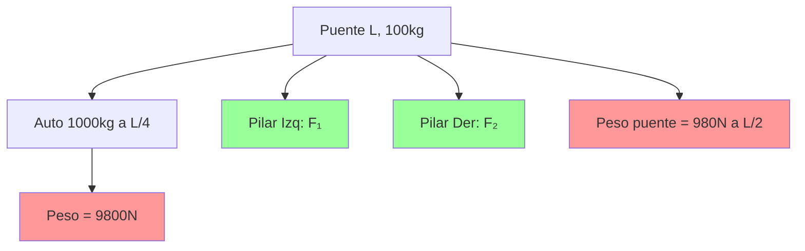

## Equilibrio: Estático, Estable e Inestable ⚖️

> [!info] 🎯 Concepto Fundamental El **equilibrio** describe el estado de un objeto sin cambios en su movimiento. El **equilibrio estático** es la condición básica (reposo), mientras que **estable**, **inestable** y **neutro** describen cómo responde el sistema ante perturbaciones.

### Diferencia Conceptual Clave 🧠

> [!warning] 🔍 Distinción Importante
> 
> - **Equilibrio Estático:** Es una **condición** (objeto en reposo)
> - **Equilibrio Estable/Inestable/Neutro:** Son **características** de esa condición
> 
> **Analogía:** El equilibrio estático es como "estar parado", mientras que estable/inestable describe "qué tan fácil es mantenerse parado"

### Variables Fundamentales 📊

> [!tip] 🔢 Magnitudes Clave
> 
> - **Fuerzas externas** ($\sum \vec{F}_{ext}$): Suma vectorial de todas las fuerzas
> - **Torque neto** ($\sum \vec{\tau}_{ext}$): Suma de todos los torques externos
> - **Centro de gravedad (CG)**: Punto donde actúa efectivamente la gravedad
> - **Posición de equilibrio**: Configuración sin movimiento ni rotación

## Equilibrio Estático 🛑

> [!warning] ⚖️ Condiciones Fundamentales **1. Equilibrio Traslacional:** $$\sum \vec{F}_{ext} = 0$$
> 
> **2. Equilibrio Rotacional:** $$\sum \vec{\tau}_{ext} = 0$$
> 
> **Ambas condiciones deben cumplirse simultáneamente**

### Metodología de Análisis 🔧

> [!tip] 📋 Procedimiento Sistemático
> 
> 1. **Diagrama de cuerpo libre** 📐
> 2. **Sistema de coordenadas y eje de rotación** 🎯
> 3. **Aplicar condiciones de equilibrio** ⚖️
> 4. **Resolver ecuaciones** 🔢

## Tipos de Estabilidad 🎢

### Equilibrio Estable 📈

> [!tip] ✅ Características
> 
> - **Comportamiento:** Objeto vuelve a posición original tras perturbación
> - **Centro de gravedad:** **SUBE** cuando se perturba
> - **Ejemplo:** Pelota en el fondo de un cuenco
> - **Aplicación:** Diseño de vehículos (CG bajo)

### Equilibrio Inestable 📉

> [!warning] ⚠️ Características
> 
> - **Comportamiento:** Objeto se aleja de posición original tras perturbación
> - **Centro de gravedad:** **BAJA** cuando se perturba
> - **Ejemplo:** Pelota en la cima de un cuenco invertido
> - **Aplicación:** Pararse en un solo pie

### Equilibrio Neutro ➡️

> [!info] ⚪ Características
> 
> - **Comportamiento:** Objeto permanece en nueva posición tras perturbación
> - **Centro de gravedad:** **SE MANTIENE** a la misma altura
> - **Ejemplo:** Pelota sobre superficie plana
> - **Aplicación:** Ruedas sobre terreno horizontal

### Análisis Energético 🔋

> [!info] ⚡ Perspectiva Energética
> 
> - **Estable:** Mínimo de energía potencial (valle) 📊
> - **Inestable:** Máximo de energía potencial (cima) 📊
> - **Neutro:** Energía potencial constante (meseta) 📊

### Aplicaciones Prácticas 🌍

> [!tip] 🚗 Ejemplos del Mundo Real
> 
> **🏗️ Equilibrio Estático:**
> 
> - Escalera apoyada en pared
> - Fuerzas de fricción, normal y peso se equilibran
> 
> **🚙 Equilibrio Estable:**
> 
> - Diseño automotriz: CG bajo previene volcaduras
> - Arquitectura: Bases anchas para estabilidad
> 
> **🤸 Equilibrio Inestable:**
> 
> - Acrobacias: mantener CG sobre base de apoyo
> - Torres altas: requieren control activo

### Ejemplo Resuelto 📝

> [!warning] 🌉 Puente con Vehículo **Problema:** Puente uniforme de 100kg sostenido por dos pilares. Auto de 1000kg se estaciona a 1/4 de la longitud del puente.
> 
> **Datos:**
> 
> - Masa puente: m₁ = 100kg
> - Masa auto: m₂ = 1000kg
> - Posición auto: L/4 desde el pilar izquierdo
> - Longitud puente: L
> 
> **Solución (eje en pilar izquierdo):**
> 
> **Equilibrio Rotacional:** $$\sum \tau = 0$$ $$m_1 g \frac{L}{2} + m_2 g \frac{L}{4} - F_2 L = 0$$ $$100 \times 9.8 \times \frac{L}{2} + 1000 \times 9.8 \times \frac{L}{4} = F_2 L$$ $$F_2 = \frac{490L + 2450L}{L} = 2940 \text{ N}$$
> 
> **Equilibrio Traslacional:** $$F_1 + F_2 = m_1 g + m_2 g$$ $$F_1 = (100 + 1000) \times 9.8 - 2940 = 7840 \text{ N}$$

### Conexiones Conceptuales 🔗

> [!info] 🌐 Relaciones Interdisciplinarias
> 
> **Con Centro de Gravedad:**
> 
> - Posición del CG determina tipo de estabilidad
> - CG dentro de base de apoyo → estable
> 
> **Con Energía Potencial:**
> 
> - Estable = mínimo energético
> - Inestable = máximo energético
> - Neutro = energía constante
> 
> **Con Dinámica:**
> 
> - Equilibrio estático como caso límite (α = 0, a = 0)
> - Base para análisis de perturbaciones

### Criterios de Diseño 🎯

> [!tip] 🏗️ Consideraciones Prácticas
> 
> - **Para estabilidad:** CG bajo y base amplia
> - **Control de perturbaciones:** Sistemas de retroalimentación
> - **Seguridad estructural:** Márgenes de estabilidad
> - **Eficiencia:** Balance entre estabilidad y funcionalidad

### Síntesis Esencial 🎯

> [!warning] 📌 Puntos Clave
> 
> - **Estático:** Condición básica ($\sum F = 0$, $\sum \tau = 0$)
> - **Estable:** Vuelve al origen (CG sube)
> - **Inestable:** Se aleja del origen (CG baja)
> - **Neutro:** Nueva posición (CG constante)
> - **Aplicación:** Fundamental en ingeniería y diseño

---

## Referencias 📚

> [!quote] 🔗 Enlaces a Otras Notas
> 
> - [[Centro de Gravedad y Centro de Masa]]
> - [[Equilibrio Rotacional]]
> - [[Dinámica Rotacional]]
> - [[Energía Potencial]]
> - [[Estática]]
> - [[Fuerzas y Torques]]

---

**Tags:** #física #mecánica #equilibrio #estática #estabilidad #centro-gravedad #diseño-estructural #ingeniería