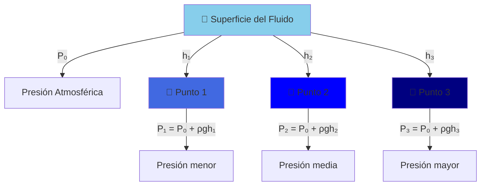

# Presión y Densidad 🌊

> [!info] 📚 **Conceptos Fundamentales** La **presión** y **densidad** son conceptos fundamentales en hidrostática que nos permiten comprender el comportamiento de los fluidos en reposo. Estos conceptos son la base para entender fenómenos como la flotación, la presión atmosférica y el funcionamiento de sistemas hidráulicos.

## Densidad (ρ)

> [!tip] 🎯 **Definición** La **densidad** es la cantidad de masa contenida en una unidad de volumen de una sustancia.
> 
> ### Fórmula:
> 
> $$\rho = \frac{m}{V}$$
> 
> Donde:
> 
> - ρ (rho) = densidad (kg/m³)
> - m = masa (kg)
> - V = volumen (m³)

> [!example] 📊 **Densidades Comunes**
> 
> |Sustancia|Densidad (kg/m³)|Densidad (g/cm³)|
> |---|---|---|
> |Aire|1.2|0.0012|
> |Agua|1000|1.0|
> |Hielo|917|0.917|
> |Aluminio|2700|2.7|
> |Hierro|7874|7.874|
> |Mercurio|13534|13.534|

# Relación Fundamental: Masa-Densidad-Volumen

> [!important]+ Ecuación Fundamental de la Densidad 📐
> 
> ### Definición Básica
> 
> La **masa de un objeto** está directamente relacionada con su densidad y volumen mediante la ecuación fundamental:
> 
> **m = ρ × V**
> 
> Donde:
> 
> - **m** = masa del objeto (kg)
> - **ρ** = densidad del material (kg/m³)
> - **V** = volumen ocupado por el objeto (m³)
> 
> ### Formas Derivadas
> 
> ```
> Densidad:    ρ = m/V
> Volumen:     V = m/ρ
> Masa:        m = ρ × V
> ```

> [!example]- Aplicación Práctica 🧮
> 
> ### Ejemplo Rápido
> 
> **Un bloque de aluminio (ρ = 2700 kg/m³) tiene un volumen de 0.5 m³**
> 
> **Cálculo de masa:**
> 
> ```
> m = ρ × V = 2700 kg/m³ × 0.5 m³ = 1350 kg
> ```
> 
> ### Utilidad en Hidrostática
> 
> Esta relación es **fundamental** para:
> 
> - 🌊 Calcular fuerzas de flotación
> - ⚖️ Determinar peso aparente vs peso real
> - 🚢 Analizar condiciones de flotación
> - 📏 Resolver problemas de equilibrio en fluidos

> [!tip]- Conexión con Otros Conceptos 🔗
> 
> ### En Problemas de Flotación
> 
> - **Peso real**: W = mg = (ρ_objeto × V) × g
> - **Fuerza de flotación**: F_f = ρ_fluido × V_sumergido × g
> - **Condición de flotación**: ρ_objeto × V_objeto = ρ_fluido × V_sumergido
> 
> ### Recordatorio Clave
> 
> > **La masa NO cambia** con el entorno, pero el **peso aparente sí** debido a la flotación.
## Presión (P)

> [!tip] 🎯 **Definición** La **presión** es la fuerza normal ejercida por unidad de área sobre una superficie.
> 
> ### Fórmula:
> 
> $$P = \frac{F}{A}$$
> 
> Donde:
> 
> - P = presión (Pa = N/m²)
> - F = fuerza (N)
> - A = área (m²)

> [!info] 📏 **Unidades de Presión**
> 
> - **Pascal (Pa)**: Unidad del SI
> - **Atmósfera (atm)**: 1 atm = 101,325 Pa
> - **Torr**: 1 Torr = 133.322 Pa
> - **mmHg**: 1 mmHg = 1 Torr
> - **Bar**: 1 bar = 100,000 Pa

## Presión Hidrostática 💧

> [!warning] ⚠️ **Concepto Clave** La **presión hidrostática** es la presión ejercida por un fluido en reposo debido a su peso.
> 
> ### Fórmula de la Presión Hidrostática:
> 
> $$P = P_0 + \rho g h$$
> 
> Donde:
> 
> - P = presión total a profundidad h
> - P₀ = presión en la superficie
> - ρ = densidad del fluido
> - g = aceleración gravitacional (9.8 m/s²)
> - h = profundidad



## Principios Fundamentales 🏗️

> [!note] 📐 **Principio de Pascal** La presión aplicada a un fluido confinado se transmite uniformemente en todas las direcciones.
> 
> **Aplicación**: Sistemas hidráulicos, frenos de automóviles, prensas hidráulicas.

> [!note] 🌍 **Presión Atmosférica**
> 
> - **Valor estándar**: 101,325 Pa = 1 atm
> - **Variación con altura**: Disminuye exponencialmente
> - **Medición**: Barómetro de mercurio o aneroide

## Relación entre Presión y Densidad 🔗


> [!example] 🧮 **Ejemplo Práctico** **Problema**: Calcular la presión en el fondo de una piscina de 3 m de profundidad.
> 
> **Datos**:
> 
> - h = 3 m
> - ρ(agua) = 1000 kg/m³
> - g = 9.8 m/s²
> - P₀ = 101,325 Pa
> 
> **Solución**: P = P₀ + ρgh = 101,325 + (1000)(9.8)(3) = 101,325 + 29,400 = **130,725 Pa**

## Técnica de Estudio: Mnemotecnia 🧠

> [!success] 💡 **Reglas Mnemotécnicas**
> 
> ### Para recordar las fórmulas:
> 
> - **"Densidad = Masa/Volumen"** → **"DeMa/Vo"** (De-Ma-Vo)
> - **"Presión = Fuerza/Área"** → **"PreFuA"** (Pre-Fu-A)
> - **"A mayor profundidad, mayor presión"** → **"ProFundo = PreSión"**
> 
> ### Para unidades:
> 
> - **Pascal**: **"Pa"**scal para **Pa**presión
> - **kg/m³**: **K**ilo**G**ramos por **M**etro **C**úbico (KG-MC)

## Método de Estudio: Mapas Conceptuales 📝

> [!tip] 📊 **Estrategia de Aprendizaje**
> 
> 1. **Crear analogías**: Presión como "peso del agua encima"
> 2. **Usar ejemplos cotidianos**: Buceo, montañismo, jeringas
> 3. **Práctica progresiva**: Comenzar con problemas simples
> 4. **Visualización**: Dibujar diagramas de presión vs profundidad

## Referencias 📚

> [!quote] 🔗 **Enlaces a Otras Notas**
> 
> - [[Principio de Arquímedes]] - Flotación y empuje
> - [[Ecuación de Continuidad]] - Conservación de masa en fluidos
> - [[Principio de Bernoulli]] - Energía en fluidos en movimiento
> - [[Tensión Superficial]] - Efectos de superficie en líquidos
> - [[Viscosidad]] - Resistencia interna de fluidos

## Notas Recomendadas 📖

> [!info] 🎓 **Prerrequisitos y Complementos**
> 
> ### Prerrequisitos:
> 
> - [[Vectores y Escalares]] - Base matemática
> - [[Leyes de Newton]] - Conceptos de fuerza
> - [[Sistema Internacional de Unidades]] - Unidades y conversiones
> 
> ### Temas Complementarios:
> 
> - [[Manómetros y Barómetros]] - Instrumentos de medición
> - [[Teorema de los Vasos Comunicantes]] - Aplicaciones de presión hidrostática
> - [[Prensa Hidráulica]] - Aplicaciones del principio de Pascal

---

**Tags**: #física #hidrostática #presión #densidad #fluidos #mecánica #pascal #arquímedes #hidrodinámica #estudio