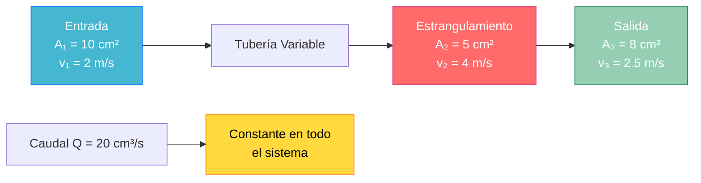

# Ecuación de Continuidad y Bernoulli 🌊

> [!info]+ Fundamentos de la Hidrodinámica La **hidrodinámica** estudia el comportamiento de los fluidos en movimiento. Dos principios fundamentales rigen este comportamiento:
> 
> 1. **Ecuación de Continuidad** - Conservación de la masa
> 2. **Ecuación de Bernoulli** - Conservación de la energía
> 
> 💧 Estos principios explican fenómenos desde el vuelo de aviones hasta el funcionamiento de tuberías

## Ecuación de Continuidad

> [!tip]+ Principio de Conservación de Masa
> 
> ### 🔄 Enunciado
> 
> En un fluido incompresible que circula por un conducto cerrado, el producto del área de la sección transversal por la velocidad del fluido permanece constante.
> 
> ### ⚖️ Fórmula Fundamental
> 
> $$A_1 \cdot v_1 = A_2 \cdot v_2 = \text{constante}$$
> 
> **Donde:**
> 
> - $A$: Área de la sección transversal (m²)
> - $v$: Velocidad del fluido (m/s)
> - Subíndices 1, 2: Diferentes puntos del conducto

> [!note]+ Interpretación Física
> 
> ### 📊 Relación Área-Velocidad
> 
> |Sección|Área|Velocidad|Caudal|
> |---|---|---|---|
> |**Ancha**|↑ Grande|↓ Lenta|Constante|
> |**Estrecha**|↓ Pequeña|↑ Rápida|Constante|
> 
> **Caudal volumétrico**: $Q = A \cdot v$ (m³/s)

## Diagrama de Continuidad



## Ecuación de Bernoulli

> [!abstract]+ Principio de Conservación de Energía
> 
> ### 🎯 Enunciado Completo
> 
> Para un fluido ideal (incompresible, no viscoso) en flujo estacionario, la energía total por unidad de volumen permanece constante a lo largo de cualquier línea de corriente.
> 
> ### 🧮 Ecuación General
> 
> $$P_1 + \frac{1}{2}\rho v_1^2 + \rho g h_1 = P_2 + \frac{1}{2}\rho v_2^2 + \rho g h_2$$
> 
> ### 📋 Componentes de la Energía
> 
> |Término|Nombre|Interpretación|Unidades|
> |---|---|---|---|
> |$P$|**Presión estática**|Energía de presión|Pa (N/m²)|
> |$\frac{1}{2}\rho v^2$|**Presión dinámica**|Energía cinética|Pa|
> |$\rho g h$|**Presión hidrostática**|Energía potencial|Pa|

> [!warning]+ Condiciones de Validez
> 
> - ⚠️ **Fluido incompresible**: $\rho$ = constante
> - ⚠️ **Flujo no viscoso**: Sin fricción interna
> - ⚠️ **Flujo estacionario**: Propiedades constantes en el tiempo
> - ⚠️ **Sin trabajo externo**: No hay bombas o turbinas

## Aplicaciones de Bernoulli

> [!example]+ Casos Prácticos Fundamentales
> 
> ### ✈️ Sustentación Aerodinámica
> 
> **Perfil alar:**
> 
> - **Superficie superior**: Aire más rápido → Presión menor
> - **Superficie inferior**: Aire más lento → Presión mayor
> - **Resultado**: Fuerza neta hacia arriba (sustentación)
> 
> $$\Delta P = \frac{1}{2}\rho(v_{superior}^2 - v_{inferior}^2)$$
> 
> ### 🚰 Tubo de Venturi
> 
> |Sección|Área|Velocidad|Presión|
> |---|---|---|---|
> |**Entrada**|Grande|Baja|Alta|
> |**Garganta**|Pequeña|Alta|Baja|
> |**Salida**|Grande|Baja|Alta|

## Análisis Energético Completo

> [!note]+ Transformación de Energías
> 
> ### 🔄 Balance Energético
> 
> ```mermaid
> flowchart TD
>     A[Energía Total del Fluido] --> B[Energía de Presión<br/>P]
>     A --> C[Energía Cinética<br/>½ρv²]
>     A --> D[Energía Potencial<br/>ρgh]
>     
>     B --> E[Intercambio<br/>Energético]
>     C --> E
>     D --> E
>     
>     E --> F[Conservación:<br/>E₁ = E₂]
>     
>     style A fill:#4ecdc4,stroke:#20c997,color:#fff
>     style E fill:#ffd93d,stroke:#fd7e14,color:#000
>     style F fill:#96ceb4,stroke:#198754,color:#fff
> ```

> [!tip]+ Formas Alternativas de Bernoulli
> 
> ### 📏 Diferentes Expresiones
> 
> **Por unidad de peso (Altura de carga):** $$\frac{P_1}{\rho g} + \frac{v_1^2}{2g} + h_1 = \frac{P_2}{\rho g} + \frac{v_2^2}{2g} + h_2$$
> 
> **Para flujo horizontal ($h_1 = h_2$):** $$P_1 + \frac{1}{2}\rho v_1^2 = P_2 + \frac{1}{2}\rho v_2^2$$

## Problemas Resueltos

> [!example]+ Problema 1: Manguera de Jardín
> 
> ### 🏡 Cálculo de Velocidad
> 
> **Datos:**
> 
> - Diámetro de manguera: $d_1 = 2$ cm
> - Diámetro de boquilla: $d_2 = 0.5$ cm
> - Velocidad en manguera: $v_1 = 1$ m/s
> 
> **Solución usando Continuidad:** $$A_1 v_1 = A_2 v_2$$ $$\pi r_1^2 v_1 = \pi r_2^2 v_2$$ $$v_2 = v_1 \left(\frac{r_1}{r_2}\right)^2 = 1 \times \left(\frac{1}{0.25}\right)^2 = 16 \text{ m/s}$$

> [!example]+ Problema 2: Tanque con Orificio
> 
> ### 🪣 Teorema de Torricelli
> 
> **Datos:**
> 
> - Altura del líquido: $h = 2$ m
> - Orificio a la base del tanque
> - Presión atmosférica en superficie y orificio
> 
> **Aplicando Bernoulli (superficie-orificio):** $$P_{atm} + 0 + \rho gh = P_{atm} + \frac{1}{2}\rho v^2 + 0$$
> 
> **Velocidad de salida:** $$v = \sqrt{2gh} = \sqrt{2 \times 9.8 \times 2} = 6.26 \text{ m/s}$$

## Instrumentos de Medición

> [!abstract]+ Dispositivos Basados en Bernoulli
> 
> ### 🔧 Aplicaciones Técnicas
> 
> |Instrumento|Principio|Medición|Ecuación|
> |---|---|---|---|
> |**Tubo Pitot**|Presión dinámica|Velocidad|$v = \sqrt{\frac{2\Delta P}{\rho}}$|
> |**Venturímetro**|Diferencia de presión|Caudal|$Q = A\sqrt{\frac{2\Delta P}{\rho}}$|
> |**Placa orificio**|Contracción de flujo|Caudal|$Q = C_d A\sqrt{\frac{2\Delta P}{\rho}}$|

## Limitaciones y Flujos Reales

> [!warning]+ Desviaciones del Modelo Ideal
> 
> ### ⚡ Efectos de la Viscosidad
> 
> **Pérdidas por fricción:** $$P_1 + \frac{1}{2}\rho v_1^2 + \rho gh_1 = P_2 + \frac{1}{2}\rho v_2^2 + \rho gh_2 + h_f$$
> 
> Donde $h_f$ representa las pérdidas de carga por fricción.
> 
> ### 🌪️ Efectos de Turbulencia
> 
> - **Flujo laminar**: Re < 2300 (Bernoulli más preciso)
> - **Flujo turbulento**: Re > 4000 (Correcciones necesarias)
> - **Número de Reynolds**: $Re = \frac{\rho v D}{\mu}$

## Técnicas de Estudio

> [!tip]+ Mnemotecnia BERNOULLI
> 
> ### 🧠 Regla de Memorización
> 
> - **B**alance de energías siempre
> - **E**nergía cinética + potencial + presión
> - **R**elación inversa: área pequeña → velocidad grande
> - **N**o viscoso el fluido ideal
> - **O**nda de presión se conserva
> - **U**niforme la densidad
> - **L**ínea de corriente considerada
> - **L**ey de conservación aplicada
> - **I**ncompresible el fluido

> [!study]+ Estrategia de Resolución: Método PASOS
> 
> ### 📝 Protocolo de Análisis
> 
> 1. **P**untos: Identifica puntos de análisis (1 y 2)
> 2. **A**reas: Calcula áreas de sección si es necesario
> 3. **S**istema: Dibuja esquema con alturas y presiones
> 4. **O**peraciones: Aplica ecuaciones (continuidad + Bernoulli)
> 5. **S**olución: Verifica unidades y coherencia física

## Experimentos Demostrativos

> [!experiment]+ Demostraciones Clásicas
> 
> ### 🧪 Laboratorio Virtual
> 
> |Experimento|Material|Observación|Principio|
> |---|---|---|---|
> |**Efecto Magnus**|Pelota girando|Trayectoria curva|Diferencia de velocidades|
> |**Atomizador**|Botella con tubos|Aspiración de líquido|Presión reducida por velocidad|
> |**Chimenea natural**|Aire caliente|Tiro ascendente|Diferencia de densidades|

## Aplicaciones Avanzadas

> [!success]+ Ingeniería Moderna
> 
> ### 🚀 Tecnologías Actuales
> 
> **Aeronáutica:**
> 
> - Diseño de perfiles aerodinámicos
> - Cálculo de sustentación y resistencia
> - Sistemas de ventilación de cabina
> 
> **Ingeniería Civil:**
> 
> - Diseño de sistemas de distribución de agua
> - Cálculo de pérdidas en tuberías
> - Diseño de vertederos y canales
> 
> **Medicina:**
> 
> - Flujo sanguíneo en arterias
> - Diseño de equipos de respiración asistida
> - Nebulizadores y atomizadores médicos

## Referencias y Conexiones

> [!quote]+ Enlaces a Otras Notas
> 
> - [[El Principio de Arquímedes y Flotación 1]]
> - [[El Principio de Pascal]]
> - [[Viscosidad y Número de Reynolds]]
> - [[Flujo Laminar y Ecuación de Poiseuille]]
> - [[Pérdidas de Carga en Tuberías]]

## Notas Complementarias Recomendadas

> [!info]+ Prerrequisitos
> 
> - [[Conceptos de Presión]]
> - [[Energía Cinética y Potencial]]
> - [[Densidad y Caudal]]
> - [[Ecuación de Continuidad]]
> - [[El medidor de Venturi]]

> [!success]+ Para Profundizar
> 
> - [[Flujo Turbulento vs Laminar]]
> - [[Pérdidas por Fricción]]
> - [[Bombas y Turbinas Hidráulicas]]
> - [[Mecánica de Fluidos Computacional]]
> - [[Aerodinámica Avanzada]]

---

**Tags**: #fisica #mecanica #hidrodinamica #bernoulli #continuidad #fluidos #energia #presion #velocidad #caudal #aplicaciones