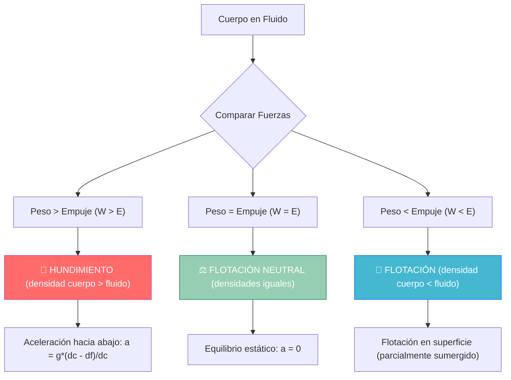

# Principio de Arquímedes y Flotación ⚓

> [!info]+ Definición Fundamental **El Principio de Arquímedes** establece que todo cuerpo sumergido total o parcialmente en un fluido experimenta una fuerza vertical ascendente (empuje hidrostático) igual al peso del fluido desalojado por dicho cuerpo.
> 
> 🧪 **Enunciado**: "Todo cuerpo sumergido en un fluido recibe un empuje vertical y hacia arriba igual al peso de fluido desalojado"
> 
> ### ⚖️ Fórmula Fundamental
> 
> $E = \rho_f \cdot g \cdot V$
> 
> - **E**: Empuje hidrostático (N)
> - **$\rho_f$**: Densidad del fluido (kg/m³)
> - **g**: Aceleración gravitatoria (9.8 m/s²)
> - **V**: Volumen desalojado (m³)

## Fundamentos Teóricos

> [!tip]+ Conceptos Clave del Empuje
> 
> ### 🎯 Características del Empuje
> 
> |Propiedad|Descripción|Valor|
> |---|---|---|
> |**Dirección**|Vertical hacia arriba|↑|
> |**Magnitud**|Peso del fluido desalojado|E = ρf·g·V|
> |**Punto de aplicación**|Centro de carena|Geométrico|
> |**Naturaleza**|Fuerza de presión resultante|Hidrostática|
> 
> ### 🌊 Centro de Carena vs Centro de Gravedad
> 
> - **Centro de carena**: Centro geométrico del volumen sumergido
> - **Centro de gravedad**: Centro de masa del objeto
> - **Estabilidad**: Depende de la posición relativa entre ambos centros

> [!warning]+ Condiciones de Aplicación
> 
> - ⚠️ **Fluido en reposo**: Sin corrientes significativas
> - ⚠️ **Densidad uniforme**: Del fluido circundante
> - ⚠️ **Campo gravitatorio**: Uniforme en la región
> - ⚠️ **Equilibrio hidrostático**: Presiones balanceadas

## Estados de Flotación

> [!example]+ Análisis de Equilibrio
> 
> ### 🏊 Condiciones de Flotación
> 
> Aquí se explica el concepto de flotación.




## Ecuaciones Fundamentales

> [!note]+ Análisis Matemático Completo
> 
> ### 📐 Equilibrio de Fuerzas
> 
> **Para un cuerpo totalmente sumergido:** $\Sigma F = W - E = mg - \rho_f \cdot g \cdot V$
> 
> **Para flotación en equilibrio:** $W = E$ $mg = \rho_f \cdot g \cdot V_{sumergido}$ $\rho_c \cdot V_c \cdot g = \rho_f \cdot g \cdot V_{sumergido}$
> 
> **Fracción sumergida:** $\frac{V_{sumergido}}{V_{total}} = \frac{\rho_c}{\rho_f}$

> [!abstract]+ Densidades Relativas
> 
> ### 🔍 Tabla de Densidades Comunes
> 
> |Material|Densidad (kg/m³)|En agua|Estado|
> |---|---|---|---|
> |**Corcho**|240|0.24|🔼 Flota|
> |**Madera**|600|0.60|🔼 Flota|
> |**Agua**|1000|1.00|⚖️ Neutro|
> |**Aluminio**|2700|2.70|🔽 Hunde|
> |**Hierro**|7870|7.87|🔽 Hunde|
> |**Mercurio**|13600|13.60|🔽 Hunde|

## Aplicaciones Prácticas

> [!example]+ Casos Reales
> 
> ### 🚢 Principio de los Barcos
> 
> **¿Por qué flota un barco de acero?**
> 
> |Factor|Explicación|Fórmula|
> |---|---|---|
> |**Forma**|Casco hueco desplaza gran volumen|$V \uparrow$|
> |**Densidad aparente**|$\rho_{aparente} = \frac{m_{total}}{V_{casco}}$|$\rho_{ap} < \rho_{agua}$|
> |**Línea de flotación**|Marca el nivel de equilibrio|$V_{sumergido}$|
> 
> ### 🎈 Globos Aerostáticos
> 
> $\text{Empuje del aire} = \rho_{aire} \cdot g \cdot V_{globo}$ $\text{Peso total} = (m_{globo} + m_{carga} + m_{aire caliente})$ $\text{Flotación: } \rho_{aire} > \rho_{aire caliente}$

## Estabilidad en Flotación

> [!tip]+ Análisis de Estabilidad
> 
> ### ⚓ Tipos de Equilibrio
> 
> ```mermaid
> graph LR
>     A[Equilibrio de Flotación] --> B[Estable]
>     A --> C[Inestable]  
>     A --> D[Indiferente]
>     
>     B --> B1[Centro de carena<br/>por encima del<br/>centro de gravedad]
>     C --> C1[Centro de carena<br/>por debajo del<br/>centro de gravedad]
>     D --> D1[Centros<br/>coincidentes]
>     
>     style B fill:#96ceb4,stroke:#198754,color:#fff
>     style C fill:#ff6b6b,stroke:#d63384,color:#fff
>     style D fill:#ffd93d,stroke:#fd7e14,color:#fff
> ```

## Problemas Cuantitativos

> [!example]+ Problema Resuelto: Iceberg
> 
> ### 🧊 Cálculo de Fracción Sumergida
> 
> **Datos**:
> 
> - Densidad del hielo: ρhielo = 917 kg/m³
> - Densidad del agua marina: ρmar = 1025 kg/m³
> - Volumen total del iceberg: V = 1000 m³
> 
> **Solución**: $\text{En equilibrio: } W = E$ $\rho_{hielo} \cdot g \cdot V = \rho_{mar} \cdot g \cdot V_{sumergido}$
> 
> **Fracción sumergida:** $\frac{V_{sumergido}}{V} = \frac{\rho_{hielo}}{\rho_{mar}} = \frac{917}{1025} = 0.895$
> 
> **Resultado**: 89.5% sumergido, 10.5% visible

> [!example]+ Problema Resuelto: Densimetría
> 
> ### ⚗️ Medición de Densidades
> 
> **Método del peso aparente**: $\text{Peso real en aire: } W = mg$ $\text{Peso aparente en fluido: } W_{ap} = W - E = W - \rho_f \cdot g \cdot V$
> 
> **Densidad del objeto:** $\rho_{objeto} = \frac{W}{W - W_{ap}} \times \rho_{fluido}$

## Técnicas de Estudio

> [!tip]+ Mnemotecnia Arquímedes
> 
> ### 🧠 Regla "EUREKA"
> 
> - **E**mpuje hacia arriba siempre
> - **U**niforme la densidad del fluido
> - **R**esultante de presiones
> - **E**quilibrio determina flotación
> - **K**ilogramo de fluido desalojado
> - **A**plicado en centro de carena

> [!study]+ Método Visual: Diagrama de Fuerzas
> 
> ### 📊 Estrategia de Resolución
> 
> 1. **Dibuja el diagrama**: Identifica peso (↓) y empuje (↑)
> 2. **Calcula volúmenes**: Sumergido vs total
> 3. **Aplica equilibrio**: ΣF = 0 para flotación
> 4. **Verifica unidades**: Todas las densidades en kg/m³

## Experimentos Demostrativos

> [!experiment]+ Laboratorio Virtual
> 
> ### 🔬 Experiencias Clásicas
> 
> |Experimento|Material|Observación|Principio|
> |---|---|---|---|
> |**Huevo en agua salada**|Huevo, sal|Flota con más sal|Densidad relativa|
> |**Plastilina vs barquito**|Plastilina|Forma importa|Volumen desalojado|
> |**Balanza hidrostática**|Báscula, agua|Peso aparente|E = W - Wap|

## Referencias y Conexiones

> [!quote]+ Enlaces a Otras Notas
> 
> - [[El Principio de Pascal]]
> - [[Presión Hidrostática]]
> - [[Densidad y Peso Específico]]
> - [[Equilibrio de Fluidos]]
> - [[Hidrostática - Ecuación Fundamental]]

## Notas Complementarias Recomendadas

> [!info]+ Prerrequisitos
> 
> - [[Conceptos de Densidad]]
> - [[Fuerzas y Equilibrio]]
> - [[Presión en Fluidos]]
> - [[Centro de Masa]]

> [!success]+ Para Profundizar
> 
> - [[Estabilidad Naval]]
> - [[Metacentro y Estabilidad]]
> - [[Hidrodinámica Avanzada]]
> - [[Flotación de Cuerpos Irregulares]]
> - [[Tensión Superficial]]

---

**Tags**: #fisica #mecanica #hidrostatica #arquimedes #flotacion #empuje #densidad #equilibrio #fluidos #estabilidad