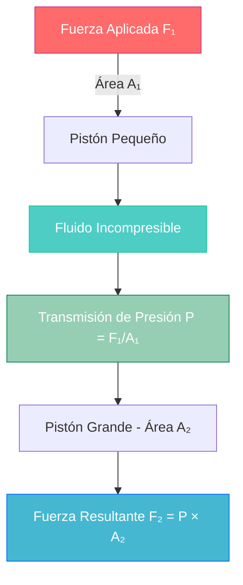

# Principio de Pascal 🔧

> [!info]+ Definición Fundamental **El Principio de Pascal** establece que la presión aplicada a un fluido confinado se transmite íntegramente y en todas las direcciones a través del fluido, ejerciendo la misma fuerza por unidad de área sobre las paredes del recipiente que lo contiene.
> 
> 📖 **Enunciado**: "La presión ejercida sobre un fluido incompresible y en equilibrio dentro de un recipiente de paredes indeformables se transmite con igual intensidad en todas las direcciones y en todos los puntos del fluido"

## Fundamentos Teóricos

> [!tip]+ Conceptos Clave
> 
> ### 🧮 Fórmula Matemática
> 
> 
> $P₁ = P₂ = P₃ = ... = Pₙ$
> 
> 
> Donde P representa la presión en cualquier punto del fluido.
> 
> ### ⚖️ Relación de Fuerzas
> 
> 
> $$F₁/A₁ = F₂/A₂$$
>
> 
> - F₁, F₂: Fuerzas aplicadas
> - A₁, A₂: Áreas de aplicación

> [!warning]+ Condiciones de Validez
> 
> - ⚠️ **Fluido incompresible**: Densidad constante
> - ⚠️ **Equilibrio hidrostático**: Sin movimiento del fluido
> - ⚠️ **Recipiente indeformable**: Paredes rígidas
> - ⚠️ **Fluido en contacto**: Comunicación directa entre puntos

## Aplicaciones Principales

> [!example]+ Sistemas Hidráulicos
> 
> ### 🚗 Frenos Hidráulicos
> 
> |Componente|Función|Área (cm²)|
> |---|---|---|
> |Pedal|Entrada de fuerza|2-5|
> |Cilindro maestro|Transmisión|1-3|
> |Cilindros de rueda|Multiplicación|10-20|
> 
> **Ventaja mecánica**: $V_M = A₂/A₁$
> 
> ### 🏗️ Prensas Hidráulicas
> 
> - **Multiplicación de fuerza**: $F₂ = F₁ × (A₂/A₁)$
> - **Conservación de trabajo**: $W₁ = W₂$
> - **Desplazamiento inverso**: $d₁/d₂ = A₂/A₁$

## Diagrama del Principio



## Análisis Físico Profundo

> [!note]+ Demostración Matemática
> 
> ### 📐 Equilibrio de Presiones
> 
> En un fluido en equilibrio hidrostático:
> 
> ```
> ∇P = ρg
> ```
> 
> Para un fluido horizontal (sin diferencias de altura):
> 
> ```
> ∂P/∂x = ∂P/∂y = 0
> ```
> 
> Por tanto: **P = constante** en toda dirección horizontal

> [!abstract]+ Principio de Conservación
> 
> ### 🔄 Conservación de la Energía
> 
> |Magnitud|Pistón 1|Pistón 2|Relación|
> |---|---|---|---|
> |Fuerza|F₁|F₂ = F₁(A₂/A₁)|Multiplicada|
> |Desplazamiento|d₁|d₂ = d₁(A₁/A₂)|Reducido|
> |Trabajo|W₁ = F₁d₁|W₂ = F₂d₂|W₁ = W₂|

## Ejemplos Cuantitativos

> [!example]+ Problema Resuelto
> 
> ### 🔢 Cálculo de Prensa Hidráulica
> 
> **Datos**:
> 
> - Área del pistón pequeño: A₁ = 5 cm²
> - Área del pistón grande: A₂ = 100 cm²
> - Fuerza aplicada: F₁ = 50 N
> 
> **Solución**:
> 
> ```
> Presión transmitida: P = F₁/A₁ = 50 N / 5 cm² = 10 N/cm²
> Fuerza resultante: F₂ = P × A₂ = 10 N/cm² × 100 cm² = 1000 N
> Ventaja mecánica: VM = F₂/F₁ = 1000/50 = 20
> ```

## Técnicas de Estudio

> [!tip]+ Mnemotecnia Pascal
> 
> ### 🧠 Regla Mnemotécnica: "PRESIÓN"
> 
> - **P**resión se conserva
> - **R**ecipiente indeformable
> - **E**quilibrio hidrostático
> - **S**istema comunicado
> - **I**ncompresible el fluido
> - **Ó**mnidireccional la transmisión
> - **N**o hay pérdidas

> [!study]+ Método de Estudio: Casos Prácticos
> 
> ### 📚 Estrategia 3-2-1
> 
> 1. **3 Aplicaciones**: Identifica frenos, prensas, gatos hidráulicos
> 2. **2 Fórmulas clave**: P₁=P₂ y F₁/A₁=F₂/A₂
> 3. **1 Condición crítica**: Fluido incompresible

## Referencias y Conexiones

> [!quote]+ Enlaces a Otras Notas
> 
> - [[Hidrostática - Fundamentos]]
> - [[Presión en Fluidos]]
> - [[Ecuación Fundamental de la Hidrostática]]
> - [[Densidad y Peso Específico]]
> - [[El Principio de Arquímedes y Flotación]]

## Notas Complementarias Recomendadas

> [!info]+ Prerrequisitos
> 
> - [[Conceptos de Presión]]
> - [[Propiedades de los Fluidos]]
> - [[Estática de Fluidos]]
> - [[Unidades de Presión]]

> [!success]+ Para Profundizar
> 
> - [[Hidrodinámica - Ecuación de Bernoulli]]
> - [[Aplicaciones Industriales de Pascal]]
> - [[Sistemas Oleohidráulicos]]
> - [[Transmisión de Potencia Hidráulica]]

---

**Tags**: #fisica #mecanica #hidrostatica #pascal #presion #fluidos #aplicaciones #hidraulica #principios #estudio