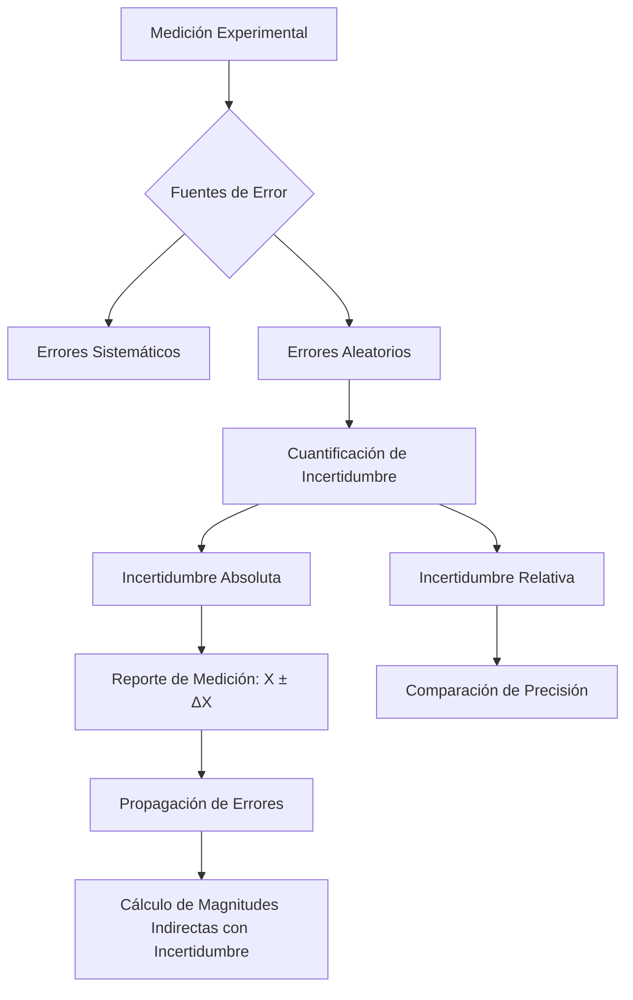
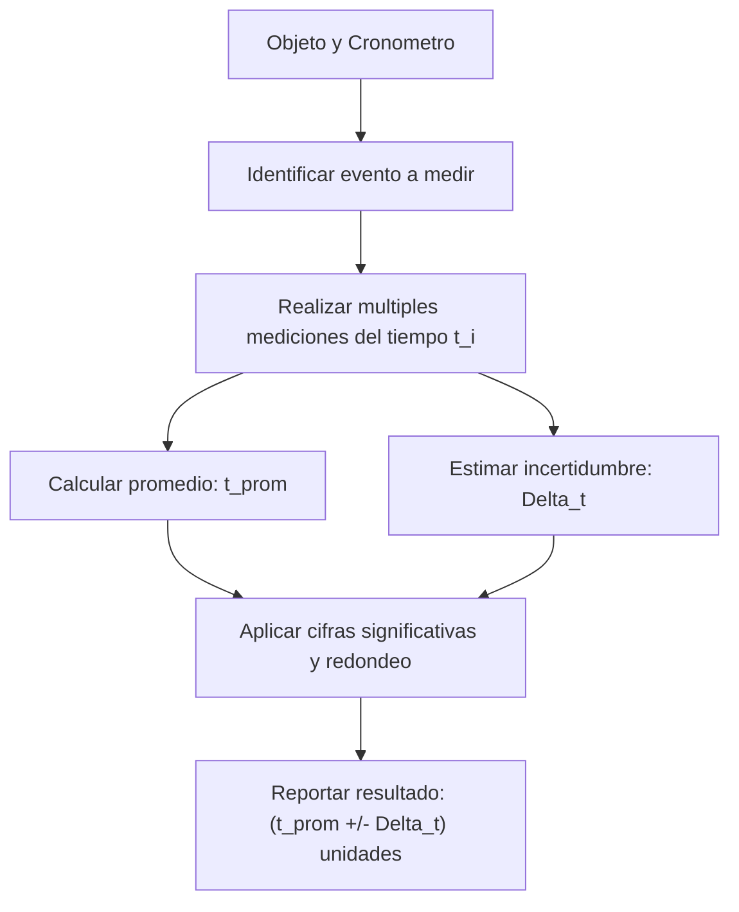
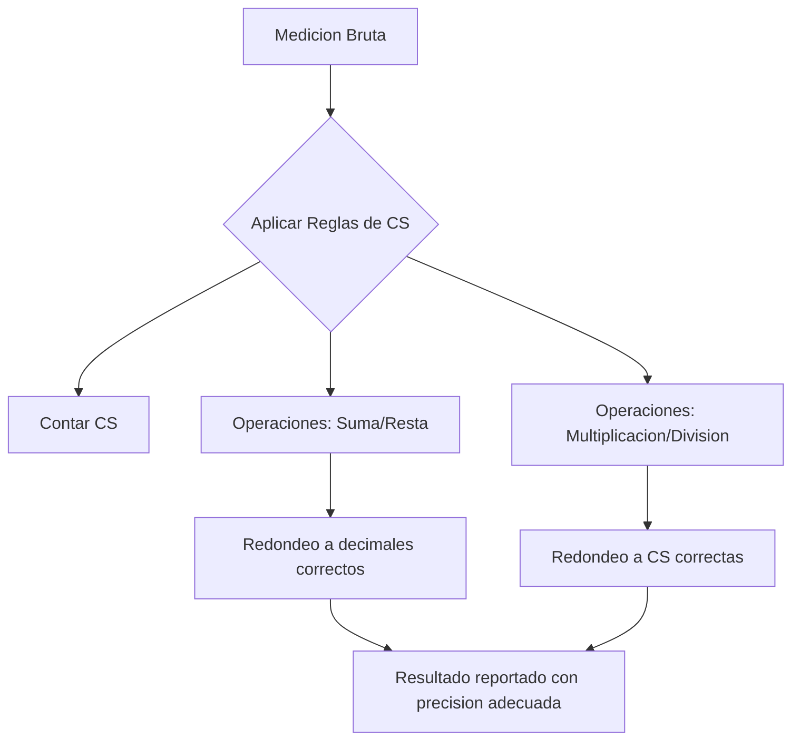
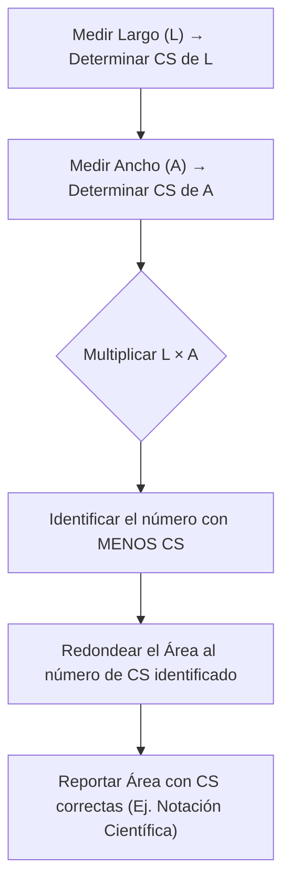
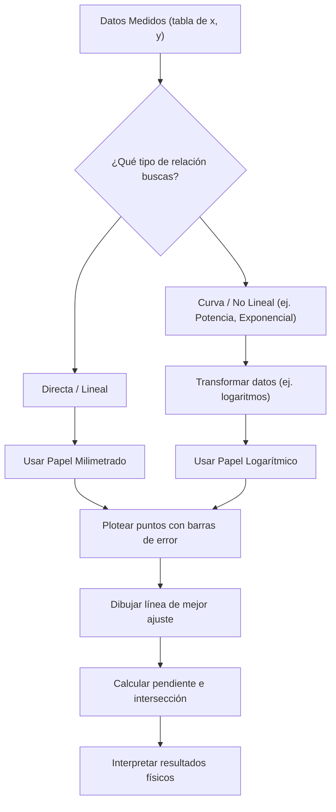
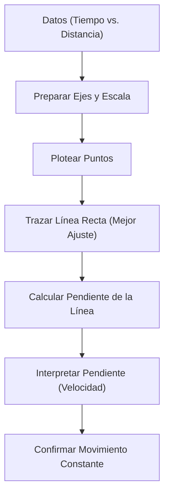

# Prácticas de Laboratorio de Física Mecánica - Visión General

## Tema General 1: Medición y Errores

### 1.1 Contexto
En el laboratorio de Física, cada experimento se basa en la obtención de datos cuantitativos. La medición es el primer paso fundamental, pero ninguna medición es perfecta. Es crucial entender cómo se realizan las mediciones, cómo se cuantifican sus incertidumbres y cómo estas afectan los resultados finales. La correcta manipulación y reporte de las mediciones y sus errores son la base para el análisis experimental.

### 1.2 Variables Comunes
- **Magnitud medida ($X$)**: El valor obtenido de una propiedad física (ej. longitud, masa, tiempo).
- **Incertidumbre Absoluta ($\Delta X$)**: El rango de dispersión probable del valor medido, expresado en las mismas unidades que la magnitud.
- **Incertidumbre Relativa ($\delta X$)**: La relación entre la incertidumbre absoluta y la magnitud medida, a menudo expresada como porcentaje ($\delta X = \frac{\Delta X}{|X|} \times 100\%$).
- **Instrumentos de Medición**: Herramientas utilizadas para cuantificar las magnitudes (ej. reglas, vernieres, balanzas, cronómetros).

### 1.3 Fórmulas/Procedimiento
#### a. Cálculo de Incertidumbre Relativa:
$$ \delta X = \frac{\Delta X}{|X|} $$
#### b. Medición Directa:
- Se obtiene el valor $X$ directamente del instrumento.
- La incertidumbre $\Delta X$ suele estar relacionada con la precisión del instrumento (ej. la mitad de la división más pequeña o la resolución del aparato).
#### c. Medición Indirecta (Propagación de Errores):
- Si $Z = f(X, Y)$, la incertidumbre $\Delta Z$ se calcula a partir de $\Delta X$ y $\Delta Y$ usando reglas de propagación de errores.
    - Para Suma/Resta ($Z = X \pm Y$): $\Delta Z = \Delta X + \Delta Y$ (para el peor caso) o $\Delta Z = \sqrt{(\Delta X)^2 + (\Delta Y)^2}$ (si los errores son aleatorios e independientes).
    - Para Multiplicación/División ($Z = X \cdot Y$ o $Z = X/Y$): $\frac{\Delta Z}{|Z|} = \frac{\Delta X}{|X|} + \frac{\Delta Y}{|Y|}$ (para el peor caso) o $\frac{\Delta Z}{|Z|} = \sqrt{(\frac{\Delta X}{|X|})^2 + (\frac{\Delta Y}{|Y|})^2}$.

### 1.4 Explicación Teórica
Toda medición experimental está sujeta a errores. Estos errores se clasifican principalmente en:
- **Errores Sistemáticos**: Errores predecibles y constantes que suelen deberse a fallas en el instrumento, el método o la técnica. Pueden ser corregidos.
- **Errores Aleatorios**: Errores impredecibles que varían en magnitud y dirección, generalmente causados por fluctuaciones incontrolables. Reducen la precisión y se cuantifican con la incertidumbre.
La incertidumbre es una cuantificación de la confianza que tenemos en una medición. Una medición se reporta como $X \pm \Delta X$ unidades.

### 1.5 Explicación Práctica
En el laboratorio, la medición directa implica leer el valor directamente de la escala del instrumento. La incertidumbre se estima considerando la resolución del instrumento y posibles factores externos. Para mediciones indirectas (ej. calcular la densidad a partir de masa y volumen), se aplican las reglas de propagación de errores para asegurar que la incertidumbre del resultado final refleje las incertidumbres de las mediciones iniciales. Es vital realizar varias mediciones para promediar y reducir el impacto de errores aleatorios.

### 1.6 Relación con Otros Temas
Este tema es transversal a **todas** las prácticas de laboratorio. Es la base para:
- El cálculo de **cifras significativas** adecuadas en los resultados.
- La **graficación de datos** y la inclusión de barras de error.
- El **análisis estadístico** de datos experimentales.
- La **validación de modelos teóricos** comparando los resultados experimentales (con sus incertidumbres) con las predicciones.

### 1.7 Gráficas

### 1.8 Ejemplo de aplicación: Medición del Tiempo de Caída de un Objeto

#### Contexto
En muchas prácticas de física, la medición del tiempo es fundamental. Ya sea el tiempo que tarda un objeto en caer, un péndulo en oscilar, o un carrito en recorrer una distancia. Comprender cómo medir el tiempo con un cronómetro y cómo reportar esa medición con su incertidumbre y cifras significativas correctas es un pilar básico del laboratorio.

#### Variables Comunes
- **Tiempo ($t$)**: La magnitud física que se está midiendo.
- **Incertidumbre del tiempo ($\Delta t$)**: El margen de error asociado con la medición del tiempo, determinado por la precisión del cronómetro y la reacción humana.
- **Número de mediciones ($N$)**: Cantidad de veces que se repite la medición.
- **Tiempo promedio ($\bar{t}$)**: El valor más representativo obtenido de múltiples mediciones.

#### Fórmulas/Procedimiento

##### Paso 1: Configuración de la Medición
1.  **Identificar el evento a medir**: Por ejemplo, el tiempo que tarda una pelota en caer desde una altura específica.
2.  **Seleccionar el instrumento de medición**: Un cronómetro digital.
3.  **Determinar la incertidumbre del instrumento**: Un cronómetro digital suele tener una resolución de $0.01 \, \text{s}$ o $0.001 \, \text{s}$. Sin embargo, la mayor fuente de incertidumbre en mediciones de tiempo manuales es el **tiempo de reacción humano**, que se estima en aproximadamente $\pm 0.1 \, \text{s}$ a $\pm 0.2 \, \text{s}$. Para este ejemplo, usaremos $\pm 0.1 \, \text{s}$ como incertidumbre del *proceso de medición* por cronómetro manual.

##### Paso 2: Realizar las Mediciones
1.  **Repetir la medición varias veces ($N \ge 5$)**: Para reducir el impacto de los errores aleatorios (como la variabilidad en el tiempo de reacción), es crucial tomar múltiples lecturas.
    * Ejemplo de mediciones del tiempo de caída:
        * $t_1 = 1.25 \, \text{s}$
        * $t_2 = 1.18 \, \text{s}$
        * $t_3 = 1.30 \, \text{s}$
        * $t_4 = 1.22 \, \text{s}$
        * $t_5 = 1.27 \, \text{s}$

##### Paso 3: Calcular el Promedio y la Incertidumbre
1.  **Calcular el valor promedio ($\bar{t}$)** de las mediciones:
    $$ \bar{t} = \frac{\sum t_i}{N} $$
    * Ejemplo: $\bar{t} = (1.25 + 1.18 + 1.30 + 1.22 + 1.27) / 5 = 6.22 / 5 = 1.244 \, \text{s}$
2.  **Determinar la incertidumbre absoluta del promedio ($\Delta t$)**:
    * Para una serie de mediciones repetidas, la incertidumbre se puede estimar de varias maneras, pero una forma sencilla y conservadora (para fines introductorios) es tomar la mayor diferencia entre el valor promedio y cualquiera de las mediciones, o simplemente usar la incertidumbre del instrumento o del proceso si es dominante.
    * Una forma más formal es usar la desviación estándar de la muestra o la **desviación estándar de la media ($\sigma_{\bar{t}}$)**:
        $$ \sigma_{\bar{t}} = \frac{\sigma_t}{\sqrt{N}} $$
        donde $\sigma_t$ es la desviación estándar de las mediciones individuales.
    * Para nuestro ejemplo sencillo, usaremos una estimación basada en el rango o simplemente la incertidumbre dominante del proceso. Si el cronómetro tiene $\pm 0.01 \, \text{s}$ pero el tiempo de reacción es $\pm 0.1 \, \text{s}$, la incertidumbre dominante es el tiempo de reacción.
    * **Método Simplificado para este ejemplo**: Se toma la mitad del rango de los valores o una estimación conservadora basada en la variabilidad y la incertidumbre del cronómetro. Aquí, considerando la variabilidad de las lecturas, y que el tiempo de reacción es significativo, podemos estimar $\Delta t \approx 0.05 \, \text{s}$ (la mitad del tiempo de reacción típica de $\pm 0.1 \, \text{s}$ si la lectura es 'redondeada' a la décima más cercana por el ojo humano). O, de forma más rigurosa, calcular la desviación estándar de la media.
        * Rango de datos: $1.30 - 1.18 = 0.12 \, \text{s}$. Una estimación simple del error podría ser $\pm (0.12/2) = \pm 0.06 \, \text{s}$.
        * Si queremos ser más realistas con la incertidumbre de un cronómetro manual, podríamos considerar la incertidumbre de un cronómetro de 0.01 s como la resolución, pero la incertidumbre por el operador de $\pm 0.1 \, \text{s}$. La incertidumbre resultante sería la más grande o una combinación cuadrática. Para simplificar, asumiremos que nuestra incertidumbre del proceso es $\pm 0.05 \, \text{s}$ (redondeando una estimación de la desviación estándar o la mitad del tiempo de reacción).

##### Paso 4: Aplicar Cifras Significativas y Redondeo
1.  **Determinar las cifras significativas para el valor promedio ($\bar{t}$)** y su incertidumbre ($\Delta t$).
    * La incertidumbre $\Delta t$ debe tener generalmente **una cifra significativa**, o a veces dos si la primera es un 1 o 2.
        * Si $\Delta t = 0.05 \, \text{s}$ (1 CS).
    * El valor promedio $\bar{t}$ debe redondearse a la misma posición decimal que la incertidumbre.
        * Nuestro promedio es $1.244 \, \text{s}$. Si la incertidumbre es a la centésima (0.05 s), el promedio también debe ir a la centésima.
        * Redondeando $1.244$ a la centésima más cercana, obtenemos $1.24 \, \text{s}$.
2.  **Reportar el resultado final**:
    $$ \text{Tiempo de caída} = (1.24 \pm 0.05) \, \text{s} $$

#### Explicación Teórica
Incluso las mediciones más simples no son exactas. Siempre hay un grado de incertidumbre. Al medir el tiempo con un cronómetro manual, la principal fuente de incertidumbre no es la resolución del cronómetro en sí (que puede ser de milisegundos), sino el tiempo de reacción humana al iniciar y detenerlo. Repetir las mediciones y promediarlas ayuda a mitigar el efecto de los errores aleatorios. La incertidumbre reportada refleja el rango de valores dentro del cual se espera que se encuentre el "verdadero" valor de la medición. Las cifras significativas nos aseguran que no reportamos una precisión que no tenemos.

#### Explicación Práctica
Imagina que estás en el laboratorio midiendo el tiempo que tarda una canica en caer desde la mesa al suelo. Usas un cronómetro.

* **Paso 1**: Tomas 5 mediciones: 1.25 s, 1.18 s, 1.30 s, 1.22 s, 1.27 s. Observas que tus lecturas varían un poco debido a tu tiempo de reacción.
* **Paso 2**: Calculas el promedio: $(1.25 + 1.18 + 1.30 + 1.22 + 1.27) / 5 = 1.244 \, \text{s}$.
* **Paso 3**: Decides que, debido a tu tiempo de reacción, la incertidumbre de cada medición es aproximadamente $\pm 0.1 \, \text{s}$. Al promediar, y viendo la dispersión de tus datos, estimas que la incertidumbre de tu promedio es $\pm 0.05 \, \text{s}$.
* **Paso 4**: Redondeas tu incertidumbre a una cifra significativa, $0.05 \, \text{s}$. Luego, redondeas tu promedio a la misma posición decimal (centésimas): $1.244 \, \text{s}$ se convierte en $1.24 \, \text{s}$.
* **Paso 5**: Reportas tu resultado final como: **Tiempo de caída = $(1.24 \pm 0.05) \, \text{s}$**. Esto significa que estás razonablemente seguro de que el tiempo de caída real está entre $1.19 \, \text{s}$ y $1.29 \, \text{s}$.

#### Relación con Otros Temas
-   **Medición y Errores**: Es la base de todo. Este ejemplo ilustra la diferencia entre la resolución del instrumento y la incertidumbre real de la medición debida a factores humanos o ambientales.
-   **Cifras Significativas y Redondeo**: La forma en que reportamos el tiempo y su incertidumbre es una aplicación directa de estas reglas.
-   **Análisis Estadístico Básico**: El uso del promedio de múltiples mediciones es una forma simple de análisis estadístico para mejorar la precisión.
-   **Movimiento en Caída Libre**: En una práctica real, este tiempo se usaría para calcular la aceleración de la gravedad ($g = \frac{2h}{t^2}$), lo que requeriría propagación de errores para $h$ y $t$.

#### Gráficas
Este ejemplo, al ser una única medición de un valor promedio, no se presta a una gráfica de datos $(x,y)$ como la anterior. Sin embargo, podríamos visualizar el proceso de medición:

## Tema General 2: Cifras Significativas y Redondeo

### 2.1 Contexto
Las cifras significativas y el redondeo son normas esenciales para comunicar la precisión de los resultados de las mediciones y cálculos en el laboratorio. Indican qué tan confiables son los dígitos de un número y evitan reportar una precisión falsa.

### 2.2 Variables Comunes
- **Número medido/calculado**: El valor numérico obtenido en el experimento.
- **Cifras Significativas (CS)**: Los dígitos que aportan al valor de la magnitud y su precisión.
- **Posición decimal**: Relevante para las reglas de redondeo.

### 2.3 Fórmulas/Procedimiento

#### a. Reglas para identificar Cifras Significativas:
- Todos los dígitos no cero son significativos (ej., 123 tiene 3 CS).
- Ceros entre dígitos no cero son significativos (ej., 1005 tiene 4 CS).
- Ceros al inicio de un número (a la izquierda del primer no cero) no son significativos (ej., 0.0025 tiene 2 CS).
- Ceros al final de un número (a la derecha) son significativos si hay un punto decimal (ej., 12.00 tiene 4 CS; 1200 podría tener 2, 3 o 4 CS dependiendo del contexto, por lo que se prefiere notación científica).

#### b. Reglas para Operaciones:
- **Suma y Resta**: El resultado debe tener el mismo número de decimales que el número con menos decimales.
- **Multiplicación y División**: El resultado debe tener el mismo número de cifras significativas que el número con la menor cantidad de cifras significativas.

#### c. Reglas de Redondeo:
- Si el primer dígito a eliminar es 5 o más, el último dígito retenido se redondea hacia arriba.
- Si el primer dígito a eliminar es menos de 5, el último dígito retenido permanece igual.
- (Regla del 5 par/impar para más exactitud: si el dígito a redondear es 5 y le sigue un cero o nada, se redondea al número par más cercano).

### 2.4 Explicación Teórica
Las cifras significativas reflejan la precisión de las mediciones originales. Es un error reportar más dígitos de los que la medición original permite, ya que esto implicaría una precisión que no se tiene. El redondeo es el proceso de ajustar un número para que contenga solo las cifras significativas apropiadas, eliminando los dígitos menos significativos.

### 2.5 Explicación Práctica
Cuando se toman lecturas en el laboratorio, se registran los dígitos que el instrumento permite con certeza, más un estimado. Al realizar cálculos con estos valores, se aplican las reglas de cifras significativas para el resultado final. Por ejemplo, si se divide una masa (3.2 g, 2 CS) por un volumen (1.56 cm³, 3 CS), el resultado de la densidad debe reportarse con 2 cifras significativas. El redondeo se aplica al final del cálculo para presentar el resultado con la precisión adecuada.

### 2.6 Relación con Otros Temas
- Directamente relacionado con la **Incertidumbre de Mediciones**: La cantidad de cifras significativas de un valor suele estar ligada a su incertidumbre.
- Fundamental para el **Reporte de Resultados** en cualquier experimento de física.
- Influye en la **interpretación de gráficas** y la precisión de parámetros obtenidos de ellas (ej. pendiente).

### 2.7 Gráficas

### 2.8 Ejemplo de aplicación: Cálculo Sencillo de un Área de un Rectángulo (Cifras Significativas)

#### Contexto
Cuando medimos las dimensiones de algo (como el largo y el ancho de una hoja de papel) con una regla, estas mediciones no son infinitamente exactas. Queremos calcular el área de esa hoja, pero el resultado de nuestra área no puede ser más "preciso" que la medición menos precisa que usamos. Este ejemplo te mostrará cómo asegurarte de que tu respuesta de área tenga la cantidad correcta de cifras significativas.

#### Variables Comunes
-   **Largo ($L$)**: La medida de un lado más largo del rectángulo.
-   **Ancho ($A$)**: La medida del lado más corto del rectángulo.
-   **Área ($\text{Área}$)**: El espacio que ocupa la superficie del rectángulo, calculado como $L \times A$.

#### Fórmulas/Procedimiento

##### Paso 1: Realizar las Mediciones
1.  **Mide el Largo ($L$)**: Usa una regla para medir el largo de la hoja.
    * Ejemplo: Mides $L = 15.2 \, \text{cm}$.
    * **Cifras Significativas de $L$**: Como el "2" es el último dígito medido y el "1" y "5" son seguros, $15.2 \, \text{cm}$ tiene **3 CS**.

2.  **Mide el Ancho ($A$)**: Usa la misma regla para medir el ancho de la hoja.
    * Ejemplo: Mides $A = 8.1 \, \text{cm}$.
    * **Cifras Significativas de $A$**: De manera similar, $8.1 \, \text{cm}$ tiene **2 CS**.

##### Paso 2: Calcular el Área y Aplicar la Regla de Cifras Significativas (Multiplicación)
1.  **Calcula el Área**: $\text{Área} = L \times A$
    * $\text{Área} = 15.2 \, \text{cm} \times 8.1 \, \text{cm} = 123.12 \, \text{cm}^2$ (este es el resultado de la calculadora).

2.  **Aplica la regla de cifras significativas para multiplicación**:
    * La regla dice: El resultado debe tener el mismo número de cifras significativas que el número (de tus mediciones) con la *menor* cantidad de cifras significativas.
    * Largo ($L$) = $15.2 \, \text{cm}$ (tiene 3 CS)
    * Ancho ($A$) = $8.1 \, \text{cm}$ (tiene 2 CS)
    * El número con menos CS es $A$ con **2 CS**.
    * Por lo tanto, tu resultado final del área debe redondearse a 2 CS.

3.  **Redondea el resultado**:
    * Tienes $123.12 \, \text{cm}^2$. Si lo redondeas a 2 CS, necesitas que los primeros dos dígitos sean significativos.
    * Los primeros dos dígitos son '1' y '2'. El siguiente dígito es '3' (que es menor que 5), por lo que el '2' no se redondea hacia arriba.
    * Sin embargo, para mantener el orden de magnitud (que sea aproximadamente 120), necesitas usar notación científica o un cero como marcador de posición. Lo más simple es redondear a la decena más cercana para mantener las 2 CS y el valor general.
    * $123.12 \, \text{cm}^2$ redondeado a 2 CS es $\mathbf{120 \, \text{cm}^2}$. (Aquí, el cero al final no es significativo porque no hay punto decimal. Para ser más explícito, usaríamos $1.2 \times 10^2 \, \text{cm}^2$).
    * **Reportar el resultado final (más común en este contexto): Área = $1.2 \times 10^2 \, \text{cm}^2$ (2 CS)**, o si se permite un cero no significativo al final: $\mathbf{120 \, \text{cm}^2}$ (asumiendo que el cero no es significativo, indicando que el '2' es la última CS).

#### Explicación Teórica
Este ejemplo nos enseña que la "calidad" de nuestro resultado (su precisión) está limitada por la medición menos precisa que usamos. Si mides un lado con mucha precisión y otro con poca, tu área total solo será tan precisa como la medición "peor". Usar las cifras significativas nos ayuda a no engañarnos pensando que nuestro resultado es más exacto de lo que realmente es.

#### Explicación Práctica
Imagina que un amigo mide una mesa con una cinta métrica muy vieja. El largo es 152.3 cm (4 CS), pero el ancho lo mide con una regla escolar y solo obtiene 8.1 cm (2 CS). Si él multiplica los números de la calculadora (152.3 * 8.1 = 1233.63), y reporta "1233.63 cm²", está cometiendo un error. Está implicando una precisión que no tiene, porque su medición de 8.1 cm es mucho menos precisa. Al aplicar la regla, él debería redondear su resultado a solo 2 CS, quizás reportando el área como "1.2 x 10^3 cm²" (o "1200 cm²" si el contexto permite el cero no significativo). Así, su respuesta refleja la limitación de su medición más "gruesa".

#### Relación con Otros Temas
-   **Medición y Errores**: Este ejemplo es una aplicación directa de cómo la precisión de tus instrumentos (y tus mediciones) afecta la precisión de tus cálculos.
-   **Notación Científica**: A veces, para mostrar claramente las cifras significativas cuando hay ceros al final, es útil usar notación científica (ej. $1.2 \times 10^2 \, \text{cm}^2$).

#### Gráficas
Para este ejemplo específico de cálculo de área, no se genera una gráfica de datos como tal. Es una aplicación directa de las reglas de cálculo.

## Tema General 3: Graficación de Datos

### 3.1 Contexto
Graficar datos es como dibujar un mapa de tus experimentos. Te permite ver si hay una relación entre las cosas que mediste y entender cómo se comportan los fenómenos físicos. Es clave para interpretar tus resultados en el laboratorio.

### 3.2 Variables Comunes
-   **Variable Independiente ($x$)**: Es lo que tú controlas o cambias en el experimento (ej. el tiempo que dejas caer un objeto, la fuerza que aplicas). Va en el eje horizontal de la gráfica.
-   **Variable Dependiente ($y$)**: Es lo que observas o mides como resultado de tus cambios (ej. la distancia que cae el objeto, la aceleración que produce la fuerza). Va en el eje vertical de la gráfica.
-   **Escala**: Es cómo distribuyes los números en cada eje para que tus datos se vean bien y llenen la gráfica.
-   **Barras de Error**: Son pequeñas líneas que dibujas en cada punto de tu gráfica para mostrar qué tan precisa o incierta es esa medición.

### 3.3 Fórmulas/Procedimiento
#### a. Cómo elegir ejes y escala:
-   Asegúrate de que la gráfica ocupe la mayor parte del espacio.
-   Usa divisiones fáciles de leer (como de 1 en 1, 2 en 2, o 5 en 5).
-   ¡No olvides ponerle nombre a cada eje y sus unidades (ej. "Tiempo (s)", "Posición (m)")!
#### b. Tipos de papel para graficar:
-   **Papel milimetrado**: Es el más común. Úsalo cuando esperes una línea recta al graficar tus datos directamente.
-   **Papel logarítmico (Log-Log o Semi-Log)**:
    -   **Log-Log**: Útil si tus datos siguen una relación de potencia (ej. $y = ax^n$). Si graficas el logaritmo de $y$ contra el logaritmo de $x$, obtendrás una línea recta.
    -   **Semi-Log (log-lin)**: Útil para relaciones exponenciales (ej. $y = Ae^{Bx}$). Si graficas el logaritmo de $y$ contra $x$, obtendrás una línea recta.
#### c. Cómo incluir las incertidumbres:
-   Dibuja barras de error en cada punto. Son como pequeñas "cruces" que indican el rango de error de tu medición en $x$ y en $y$.
-   La **línea que mejor se ajusta** (que puede ser una línea recta) debe pasar lo más cerca posible de la mayoría de los puntos y, si es posible, cortar las barras de error.

### 3.4 Explicación Teórica
Las gráficas nos ayudan a ver rápidamente los patrones en nuestros datos. En lugar de mirar una tabla de números, un dibujo te muestra si algo aumenta, disminuye, o si hay una curva. Las barras de error son importantes porque nos recuerdan que nuestras mediciones no son perfectas; nos dicen cuánto "margen de error" tiene cada punto. Esto es clave para dibujar la "mejor" línea a través de los puntos y entender lo que esa línea nos dice.

### 3.5 Explicación Práctica
Imagina que mides la posición de un carrito en diferentes momentos. Pones el tiempo en el eje horizontal y la posición en el eje vertical. Dibujas cada punto y añades las barras de error para mostrar la precisión de tus mediciones. Luego, si los puntos parecen formar una línea recta, dibujas esa línea. La inclinación de esa línea (la pendiente) podría decirte la velocidad del carrito. Si los puntos formaran una curva, podrías intentar graficarlos en papel logarítmico para ver si se "enderezan" y revelan otra relación.

### 3.6 Relación con Otros Temas
-   Es la forma principal de **analizar tus datos** después de medirlos.
-   Está muy ligado a la **regresión lineal** (encontrar la mejor línea recta para tus datos) y al ajuste de otras curvas.
-   Las **incertidumbres de tus mediciones** son fundamental para dibujar las barras de error.
-   Te permite **confirmar leyes físicas**; por ejemplo, si la teoría dice que algo debe ser una línea recta, y tu gráfica lo es, ¡bingo!

### 3.7 Gráficas

### 3.8 Ejemplo de aplicación: Medición de la Distancia recorrida por un Carrito a Velocidad Constante

#### Contexto
Imagina que queremos entender cómo se mueve un carrito de juguete que avanza siempre a la misma velocidad (velocidad constante). Para esto, mediremos la distancia que recorre el carrito en diferentes momentos. La gráfica nos ayudará a ver esta relación de forma clara y a entender si el movimiento es realmente a velocidad constante.

---

#### Variables Comunes
- **Tiempo (t)**: El tiempo que el carrito ha estado en movimiento. Esta es nuestra variable independiente (lo que nosotros controlamos y va en el eje horizontal).
- **Distancia (d)**: La distancia que el carrito ha recorrido desde el inicio. Esta es nuestra variable dependiente (lo que medimos y va en el eje vertical).

---

#### Fórmulas / Procedimiento

##### Paso 1: Recolectar Datos
- Pon el carrito en un punto de partida y enciende un cronómetro.
- Marca y mide la distancia que recorre el carrito en diferentes intervalos de tiempo.

**Ejemplo de Datos Recolectados:**

| Tiempo (t) (s) | Distancia (d) (m) |
|----------------|-------------------|
| 0.0            | 0.0               |
| 1.0            | 0.5               |
| 2.0            | 1.0               |
| 3.0            | 1.5               |
| 4.0            | 2.0               |

---

##### Paso 2: Preparar la Gráfica
- Eje horizontal: Tiempo (t).
- Eje vertical: Distancia (d).
- Escala: Acomoda los puntos para que sean legibles (ej. cada 0.5 m).
- Etiquetas: "Tiempo (s)" y "Distancia (m)".

---

##### Paso 3: Plotear los Puntos y Barras de Error
- Marca los puntos en el gráfico.
- Si existieran incertidumbres en las mediciones, añade barras de error.
- Para este ejemplo asumimos mediciones perfectas.

---

##### Paso 4: Trazar la Línea de Mejor Ajuste
- Dibuja una línea recta que se acerque lo más posible a todos los puntos.
- Si el movimiento es a velocidad constante, la línea debe ser recta y pasar por el origen.

---

##### Paso 5: Interpretar la Gráfica
**Calcular la pendiente**:
$$
\text{pendiente} = \frac{\Delta d}{\Delta t} = \frac{2.0\ \text{m} - 0.0\ \text{m}}{4.0\ \text{s} - 0.0\ \text{s}} = \frac{2.0\ \text{m}}{4.0\ \text{s}} = 0.5\ \text{m/s}
$$

**Significado**: La pendiente representa la **velocidad constante** del carrito.

#### Explicación Teórica
Cuando la distancia es directamente proporcional al tiempo (doble tiempo, doble distancia), la gráfica de distancia vs. tiempo es una línea recta que pasa por el origen. La pendiente de esa línea representa la **velocidad** del objeto. Si la pendiente es constante, la velocidad también lo es.

---

#### Explicación Práctica
Un estudiante que realiza este experimento verá una **línea recta al graficar los datos**, confirmando visualmente el movimiento constante. Al calcular la pendiente, determina numéricamente la velocidad. Esto hace que interpretar el experimento sea más fácil que solo ver una tabla de datos.

---

#### Relación con Otros Temas
- **Movimiento Rectilíneo Uniforme (MRU)**: La gráfica distancia vs. tiempo es lineal.
- **Análisis de Pendientes**: Aquí representa velocidad, en otros contextos puede representar aceleración, constante elástica, etc.
- **Predicción**: La línea permite **interpolar** o **extrapolar** valores.

---

#### Gráfica de Flujo del Procedimiento

