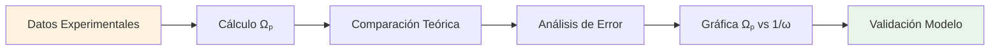

# 🌀 Práctica de Laboratorio: Giroscopio

## 📋 Información General

> [!info] 📌 **Definición** Un giroscopio es un dispositivo mecánico que utiliza la conservación del momento angular para mantener su orientación en el espacio. En esta práctica utilizamos un **giroscopio de tres ejes** que consta de un disco de giro y un eje que pasa por el centro del disco.

> [!tip] 🎯 **Objetivos de la Práctica**
> 
> - **Comprobar experimentalmente el fenómeno de precesión**
> - Calcular el momento de inercia del disco del giroscopio experimentalmente
> - Presentar la relación entre la velocidad angular de precesión y la velocidad de giro del disco
> - Evidenciar el fenómeno rotacional de precesión (análogo al movimiento traslacional de la segunda ley de Newton)
> - Establecer la relación: $\Omega = \frac{\tau_m}{L} \rightarrow \Omega = \frac{wr}{I_G\omega_G}$

## 🔬 Marco Teórico

### Principios Fundamentales

> [!warning] ⚠️ **Conceptos Clave** **Momento Angular (L)**: $\vec{L} = I\vec{\omega}$
> 
> - I = momento de inercia
> - ω = velocidad angular
> 
> **Precesión**: Movimiento del eje de rotación alrededor de otro eje
> 
> **Nutación**: Oscilación del eje de precesión

### Ecuaciones Principales

> [!note] 📐 **Fórmulas Fundamentales**
> 
> **Relación Momento-Torque:** $\vec{\tau_m} = \frac{d\vec{L}}{dt}$
> 
> **Velocidad de Precesión:** $\Omega = \frac{\tau_m}{L} = \frac{wr}{I_G\omega_G}$
> 
> Donde:
> 
> - Ω = velocidad angular de precesión
> - τₘ = torque neto aplicado
> - L = momento angular del disco
> - w = peso de la masa colgante (mg)
> - r = distancia del punto de apoyo a la ranura
> - I_G = momento de inercia del giroscopio
> - ω_G = velocidad angular de giro del disco

```mermaid
flowchart TD
    A[Disco Giratorio ωG] --> B[Momento Angular L = IGωG]
    B --> C[Torque Aplicado τ = mgr]
    C --> D[Precesión Ω = τ/L]
    D --> E[Semicircunferencia π rad]
    E --> F[Tiempo de Precesión T]
    F --> G[Velocidad Precesión Ω = π/T]
    
    H[Mediciones] --> I[Tiempo Giro Inicial]
    H --> J[Tiempo Precesión ½ vuelta]
    H --> K[Tiempo Giro Final]
    
    I --> L[ωG inicial = 2π/Ti]
    K --> M[ωG final = 2π/Tf]
    L --> N[ωG promedio]
    M --> N
    
    G --> O[Momento Inercia IG = mgr/(Ω·ωG)]
    N --> O
    
    style A fill:#e1f5fe
    style D fill:#f3e5f5
    style O fill:#e8f5e8
    style H fill:#fff3e0
```

## 🛠️ Materiales y Equipos

> [!tip] 📦 **Lista de Materiales del Laboratorio**
> 
> - **Giroscopio de tres ejes** (con disco de giro y eje central)
> - **Barrera de luz con contador** (precisión: ±0.001 s)
> - **Contrapeso** (para equilibrio del sistema)
> - **Regla** (para medición de distancias)
> - **Cronómetro digital** (precisión: ±0.01 s)
> - **Dos soportes** como referencias
> - **Masa colgante**: 10.00 ± 0.01 gramos
> - **Portamasas** para colocar la masa

## 📝 Procedimiento Experimental

### Parte 1: Configuración del Sistema

> [!info] 🔧 **Preparación Inicial**
> 
> 1. **Medir la distancia r** con regla entre el punto de apoyo del giroscopio y la ranura del extremo opuesto al disco donde se colocará el portamasas
> 2. **Fijar el contrapeso** para lograr un ángulo de 90° con el eje del disco (equilibrio horizontal)
> 3. **Colocar los soportes de referencia** en cada extremo del eje del disco, asegurando que estén colineales con el eje

### Parte 2: Ejecución del Experimento

> [!warning] ⚠️ **Procedimiento Detallado**
> 
> 1. **Aplicar torque** en la periferia del disco para hacerlo girar sobre su eje
> 2. **Sostener el punto de apoyo** con la mano mientras el disco gira y el eje está en equilibrio
> 3. **Retirar cuidadosamente la mano** del apoyo
> 4. **Medir inmediatamente** el tiempo de giro inicial usando la barrera de luz con contador
> 5. **Colocar la masa de 10g** en el portamasas en la ranura del extremo opuesto
> 6. **Iniciar cronómetro** cuando comience la precesión
> 7. **Registrar tiempo** cuando complete la semicircunferencia (de referencia 1 a referencia 2)
> 8. **Retirar cuidadosamente** el portamasas con la masa
> 9. **Medir tiempo de giro final** con la barrera de luz
> 10. **Repetir** todo el proceso 5 veces más para obtener 6 observaciones totales

### Parte 3: Mediciones y Datos

> [!note] 📊 **Tabla de Datos Experimentales**
> 
> **Distancia medida**: r = 26.5 ± 0.05 cm **Masa colgante**: m = 10.00 ± 0.01 g
> 
> |Obs.|Tiempo Giro Inicial (s)|Tiempo Giro Final (s)|Tiempo Precesión ½ vuelta (s)|
> |---|---|---|---|
> |1|0.265 ± 0.001|0.246 ± 0.001|30.50 ± 0.01|
> |2||||
> |3||||
> |4||||
> |5||||
> |6||||

## 📈 Análisis de Resultados

### Cálculos Requeridos

> [!tip] 🧮 **Análisis Cuantitativo**
> 
> **1. Velocidad angular de giro del disco:** $\omega_G = \frac{2\pi}{T_{giro}} \text{ (rad/s)}$
> 
> **2. Velocidad angular de precesión:** $\Omega = \frac{\pi}{T_{precesión}} \text{ (rad/s)} \text{ [para media vuelta]}$
> 
> **3. Momento de inercia experimental:** $I_G = \frac{mgr}{\Omega \cdot \omega_G}$
> 
> **4. Promedio de velocidades de giro:** $\omega_{G,promedio} = \frac{\omega_{inicial} + \omega_{final}}{2}$
> 
> **5. Incertidumbres:**
> 
> - Tiempos barrera de luz: ±0.001 s
> - Tiempos cronómetro: ±0.01 s
> - Distancia: ±0.05 cm
> - Masa: ±0.01 g



## 🔍 Fenómenos Observados

> [!info] 👁️ **Observaciones del Experimento**
> 
> - **Equilibrio inicial**: El contrapeso mantiene el eje horizontal a 90° antes del experimento
> - **Precesión controlada**: Al colocar la masa de 10g, el giroscopio describe una semicircunferencia entre las referencias
> - **Movimiento uniforme**: La precesión ocurre a velocidad angular constante durante la media vuelta
> - **Desaceleración del disco**: El tiempo de giro final es mayor que el inicial debido a la fricción
> - **Estabilidad del sistema**: El eje mantiene su orientación durante todo el movimiento de precesión

## ⚠️ Fuentes de Error

> [!warning] 📏 **Errores Experimentales Identificados**
> 
> - **Precisión de instrumentos**:
>     - Barrera de luz: ±0.001 s
>     - Cronómetro digital: ±0.01 s
>     - Regla: ±0.05 cm
>     - Balanza: ±0.01 g
> - **Fricción en el punto de apoyo**: Reduce gradualmente la velocidad de giro
> - **Resistencia del aire**: Afecta tanto el giro como la precesión
> - **Vibraciónes del sistema**: Pueden influir en las mediciones de tiempo
> - **Error humano**: En la sincronización del cronómetro y retirada de la masa
> - **Desequilibrio del disco**: Posible descentramiento del centro de masa
> - **Pérdidas de energía**: Durante la precesión por disipación

## 🎓 Técnica Mnemotécnica

> [!tip] 🧠 **Método GIROL para recordar conceptos**
> 
> - **G**irar: El disco debe girar para funcionar
> - **I**nercia: Momento de inercia determina comportamiento
> - **R**esistir: Resiste cambios en orientación
> - **O**rientar: Mantiene orientación en el espacio
> - **L**ibrar: Se libra de la gravedad mediante precesión

### Regla Mnemotécnica para la Fórmula

> [!note] 💭 **"MaGDa Invita Omega"** $$\Omega_p = \frac{mgd}{I\omega}$$
> 
> - **Ma**: masa (m)
> - **G**: gravedad (g)
> - **Da**: distancia (d)
> - **I**: inercia (I)
> - **Omega**: velocidad angular (ω)

## 🏆 Aplicaciones Prácticas

> [!info] 🌐 **Usos del Giroscopio**
> 
> - **Navegación**: Brújulas giroscópicas en barcos y aviones
> - **Estabilización**: Sistemas de control en vehículos
> - **Instrumentos**: Horizonte artificial en aviación
> - **Entretenimiento**: Juguetes y demostraciones
> - **Tecnología**: Sensores en smartphones y drones

## 📚 Referencias

> [!quote] 🔗 **Enlaces a Otras Notas**
> 
> - [[Momento Angular y Conservación]]
> - [[Rotación de Cuerpos Rígidos]]
> - [[Torque y Equilibrio Rotacional]]
> - [[Sistemas de Referencia Inerciales]]
> - [[Aplicaciones de la Mecánica Rotacional]]

## 📖 Notas Recomendadas

> [!tip] 📋 **Para Complementar el Estudio**
> 
> - [[Principio de Conservación del Momento Angular]]
> - [[Movimiento de Precesión en Trompos]]
> - [[Efectos Giroscópicos en Ingeniería]]
> - [[Historia y Desarrollo del Giroscopio]]
> - [[Giroscopios Ópticos y Cuánticos]]
> - [[Navegación Inercial]]

---

**Tags:** #física #laboratorio #giroscopio #momento-angular #precesión #rotación #mecánica #experimento #conservación #torque