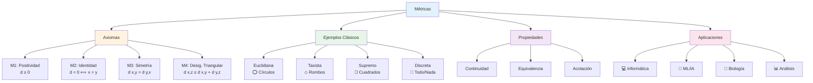

# 📏 Métricas

## 🎯 Fundamentos de Métricas

> [!info]- 💡 Introducción a las Métricas Las **métricas** (también llamadas funciones de distancia) son herramientas matemáticas que permiten cuantificar la "distancia" o "separación" entre elementos de un conjunto. Son la base formal para conceptos intuitivos como proximidad, convergencia y continuidad.
> 
> **Analogías útiles:**
> 
> - **Geometría:** Como medir distancias entre puntos en un mapa
> - **Física:** Como calcular la separación entre partículas
> - **Vida cotidiana:** Como determinar qué tan lejos está un lugar de otro
> 
> **Importancia histórica:**
> 
> - **Euclides (300 a.C.):** Geometría y distancia euclidiana clásica
> - **Fréchet (1906):** Formalización de espacios métricos
> - **Hausdorff (1914):** Desarrollo de la topología métrica
> - **Banach (1922):** Espacios métricos completos

### 📐 Definición Formal de Métrica

> [!note]- 🌟 Definición Rigurosa
> 
> **Definición:** Sea X un conjunto no vacío. Una **métrica** (o **distancia**) sobre X es una función:
> 
> $$d: X \times X \rightarrow \mathbb{R}$$
> 
> que satisface las siguientes propiedades para todo $x, y, z \in X$:
> 
> **M1. Positividad:** $$d(x, y) \geq 0$$ La distancia nunca es negativa.
> 
> **M2. Identidad de los indiscernibles:** $$d(x, y) = 0 \iff x = y$$ La distancia es cero si y solo si los puntos son idénticos.
> 
> **M3. Simetría:** $$d(x, y) = d(y, x)$$ La distancia de x a y es igual a la distancia de y a x.
> 
> **M4. Desigualdad triangular:** $$d(x, z) \leq d(x, y) + d(y, z)$$ La distancia directa nunca supera el camino indirecto.
> 
> **Notación:** El par $(X, d)$ se llama **espacio métrico**.

### 🔍 Interpretación de los Axiomas

> [!tip]- 🎯 Significado Intuitivo de cada Axioma
> 
> **M1 - Positividad:**
> 
> - Las distancias son cantidades no negativas
> - Ejemplo: No tiene sentido decir "la distancia es -5 metros"
> - Consecuencia: $d(x, y) \in [0, +\infty)$
> 
> **M2 - Identidad:**
> 
> - Dos puntos diferentes siempre están separados
> - Solo un punto tiene distancia cero consigo mismo
> - Ejemplo: Si dos ciudades están a distancia 0, son la misma ciudad
> 
> **M3 - Simetría:**
> 
> - No importa el orden al medir
> - Ir de A a B es igual (en distancia) que ir de B a A
> - Ejemplo: La distancia de Quito a Guayaquil = distancia de Guayaquil a Quito
> 
> **M4 - Desigualdad Triangular:**
> 
> - El camino directo es el más corto (o igual)
> - "Un rodeo nunca es más corto que la ruta directa"
> - Ejemplo: Viajar de A a C directamente ≤ viajar de A a B y luego de B a C

## 📊 Ejemplos Fundamentales de Métricas

### 🌐 Métrica Euclidiana

> [!example]- 📏 La Métrica Más Natural
> 
> **En $\mathbb{R}$ (recta real):** $$d_E(x, y) = |x - y|$$
> 
> **En $\mathbb{R}^2$ (plano):** $$d_E((x_1, y_1), (x_2, y_2)) = \sqrt{(x_2 - x_1)^2 + (y_2 - y_1)^2}$$
> 
> **En $\mathbb{R}^n$ (espacio n-dimensional):** $$d_E(\mathbf{x}, \mathbf{y}) = \sqrt{\sum_{i=1}^{n}(y_i - x_i)^2}$$
> 
> **Características:**
> 
> - Es la "distancia usual" que corresponde al teorema de Pitágoras
> - Mide la línea recta más corta entre dos puntos
> - Induce la topología estándar en $\mathbb{R}^n$
> 
> **Ejemplos prácticos:**
> 
> - En $\mathbb{R}$: $d_E(3, 7) = |3 - 7| = 4$
> - En $\mathbb{R}^2$: $d_E((0, 0), (3, 4)) = \sqrt{9 + 16} = 5$
> - En $\mathbb{R}^3$: $d_E((1, 2, 3), (4, 6, 8)) = \sqrt{9 + 16 + 25} = \sqrt{50}$

### 🏙️ Métrica del Taxista (Manhattan)

> [!example]- 🚕 Distancia en Cuadrículas
> 
> **Definición en $\mathbb{R}^n$:** $$d_1(\mathbf{x}, \mathbf{y}) = \sum_{i=1}^{n}|y_i - x_i|$$
> 
> **En $\mathbb{R}^2$:** $$d_1((x_1, y_1), (x_2, y_2)) = |x_2 - x_1| + |y_2 - y_1|$$
> 
> **Origen del nombre:**
> 
> - Representa cómo un taxi se mueve en una ciudad con cuadrícula
> - No puede ir en línea recta, debe seguir calles
> - También llamada "norma L¹" o "distancia de Manhattan"
> 
> **Ejemplos:**
> 
> - $d_1((0, 0), (3, 4)) = 3 + 4 = 7$
> - $d_1((1, 2), (4, 6)) = 3 + 4 = 7$
> - Comparar con euclidiana: $d_E((0, 0), (3, 4)) = 5$
> 
> **Propiedad importante:** $$d_1(\mathbf{x}, \mathbf{y}) \geq d_E(\mathbf{x}, \mathbf{y})$$ La distancia del taxista siempre es mayor o igual a la euclidiana.

### ♾️ Métrica del Supremo (Chebyshev)

> [!example]- 🎯 Máxima Diferencia Coordenada
> 
> **Definición en $\mathbb{R}^n$:** $$d_\infty(\mathbf{x}, \mathbf{y}) = \max_{1 \leq i \leq n}|y_i - x_i|$$
> 
> **En $\mathbb{R}^2$:** $$d_\infty((x_1, y_1), (x_2, y_2)) = \max{|x_2 - x_1|, |y_2 - y_1|}$$
> 
> **Interpretación:**
> 
> - Toma la máxima diferencia entre coordenadas
> - "Distancia de movimiento de rey en ajedrez"
> - También llamada "norma del supremo" o "norma infinito"
> 
> **Ejemplos:**
> 
> - $d_\infty((0, 0), (3, 4)) = \max{3, 4} = 4$
> - $d_\infty((1, 5, 2), (4, 7, 8)) = \max{3, 2, 6} = 6$
> 
> **Relación con otras métricas:** $$d_\infty(\mathbf{x}, \mathbf{y}) \leq d_E(\mathbf{x}, \mathbf{y}) \leq d_1(\mathbf{x}, \mathbf{y})$$

### 🎲 Métrica Discreta

> [!example]- 🔢 Todo o Nada
> 
> **Definición en cualquier conjunto X:** $$d_D(x, y) = \begin{cases} 0 & \text{si } x = y \ 1 & \text{si } x \neq y \end{cases}$$
> 
> **Características:**
> 
> - La métrica más simple posible
> - Solo distingue entre "igual" y "diferente"
> - Funciona en **cualquier** conjunto no vacío
> 
> **Verificación de axiomas:**
> 
> - ✅ M1-M3: Obvias por definición
> - ✅ M4: Si $x \neq z$, entonces $1 = d(x, z) \leq d(x, y) + d(y, z)$
>     - Caso 1: Si $x = y$ o $y = z$, entonces $d(x, y) + d(y, z) = 1$
>     - Caso 2: Si $x \neq y$ y $y \neq z$, entonces $d(x, y) + d(y, z) = 2 \geq 1$
> 
> **Ejemplos:**
> 
> - En $\mathbb{N}$: $d_D(5, 5) = 0$, $d_D(5, 7) = 1$
> - En cualquier conjunto de palabras: $d_D(\text{"gato"}, \text{"perro"}) = 1$
> 
> **Propiedad interesante:**
> 
> - Toda bola abierta de radio $r < 1$ contiene solo un punto
> - Toda bola abierta de radio $r \geq 1$ es todo el espacio

### 🔤 Métrica en Espacios de Funciones

> [!example]- 📈 Distancia entre Funciones
> 
> **En $C([a, b])$ (funciones continuas en $[a, b]$):**
> 
> **Métrica del supremo:** $$d_\infty(f, g) = \sup_{x \in [a, b]}|f(x) - g(x)|$$
> 
> **Interpretación:**
> 
> - Máxima separación vertical entre las gráficas
> - "Peor caso" de diferencia entre funciones
> 
> **Métrica L²:** $$d_2(f, g) = \sqrt{\int_a^b |f(x) - g(x)|^2 , dx}$$
> 
> **Interpretación:**
> 
> - Promedio (cuadrático) de las diferencias
> - Común en análisis de Fourier y estadística
> 
> **Ejemplo:** Sean $f(x) = x$ y $g(x) = x^2$ en $[0, 1]$:
> 
> - $d_\infty(f, g) = \sup_{x \in [0,1]}|x - x^2| = \frac{1}{4}$ (en $x = \frac{1}{2}$)
> - $d_2(f, g) = \sqrt{\int_0^1 (x - x^2)^2 , dx}$

## 🔗 Métricas Equivalentes

### 📏 Definición de Equivalencia

> [!note]- 🔄 Métricas que Generan la Misma Topología
> 
> **Definición:** Dos métricas $d_1$ y $d_2$ en un conjunto X son **equivalentes** si inducen la misma topología. Es decir, tienen los mismos conjuntos abiertos.
> 
> **Criterio práctico:** $d_1$ y $d_2$ son equivalentes si existen constantes $c_1, c_2 > 0$ tales que: $$c_1 \cdot d_1(x, y) \leq d_2(x, y) \leq c_2 \cdot d_1(x, y)$$ para todo $x, y \in X$.
> 
> **Consecuencias:**
> 
> - Mismas sucesiones convergentes
> - Mismos puntos de acumulación
> - Mismos conjuntos compactos
> - Mismos conjuntos conexos

### 🎯 Ejemplos de Equivalencia

> [!example]- ⚖️ Métricas Equivalentes en $\mathbb{R}^n$
> 
> **Teorema fundamental:** En $\mathbb{R}^n$, todas las normas (y sus métricas asociadas) son equivalentes.
> 
> **Ejemplo concreto en $\mathbb{R}^2$:**
> 
> Para todo $(x, y) \in \mathbb{R}^2$: $$d_\infty(x, y) \leq d_E(x, y) \leq d_1(x, y) \leq 2 \cdot d_\infty(x, y)$$
> 
> **Demostración de desigualdades:** Sean $x = (x_1, x_2)$, $y = (y_1, y_2)$:
> 
> 1. $d_\infty \leq d_E$: $$\max{|x_1 - y_1|, |x_2 - y_2|} \leq \sqrt{(x_1 - y_1)^2 + (x_2 - y_2)^2}$$
>     
> 2. $d_E \leq d_1$: $$\sqrt{a^2 + b^2} \leq |a| + |b|$$ (por desigualdad triangular en $\mathbb{R}^2$)
>     
> 3. $d_1 \leq 2 \cdot d_\infty$: $$|x_1 - y_1| + |x_2 - y_2| \leq 2\max{|x_1 - y_1|, |x_2 - y_2|}$$
>     
> 
> **Consecuencia importante:** Una sucesión converge en una de estas métricas si y solo si converge en las otras.

## 🎨 Visualización de Bolas Métricas

> [!tip]- 🔵 Formas de Bolas en Diferentes Métricas
> 
> **Definición:** La **bola abierta** de centro $x_0$ y radio $r > 0$ es: $$B_d(x_0, r) = {x \in X : d(x, x_0) < r}$$
> 
> **En $\mathbb{R}^2$ con centro en el origen:**
> 
> **Métrica Euclidiana ($d_E$):**
> 
> - Forma: **Círculo**
> - Ecuación: $x^2 + y^2 < r^2$
> - Aspecto: ⭕ Redondo, isotrópico
> 
> **Métrica del Taxista ($d_1$):**
> 
> - Forma: **Rombo** (cuadrado rotado 45°)
> - Ecuación: $|x| + |y| < r$
> - Aspecto: ◇ Diagonal en ejes
> 
> **Métrica del Supremo ($d_\infty$):**
> 
> - Forma: **Cuadrado** alineado con ejes
> - Ecuación: $\max{|x|, |y|} < r$
> - Aspecto: ◻️ Bordes paralelos a ejes
> 
> **Métrica Discreta ($d_D$):**
> 
> - Si $r \leq 1$: Solo el centro
> - Si $r > 1$: Todo el espacio
> - Aspecto: 🎯 "Todo o nada"

## 🧮 Propiedades Avanzadas

### 🔄 Continuidad de la Métrica

> [!note]- 📐 La Métrica como Función Continua
> 
> **Teorema:** En un espacio métrico $(X, d)$, la función distancia $$d: X \times X \rightarrow \mathbb{R}$$ es continua (cuando $X \times X$ tiene la topología producto).
> 
> **Consecuencia:** Si $x_n \to x$ y $y_n \to y$, entonces: $$d(x_n, y_n) \to d(x, y)$$
> 
> **Demostración sketch:** Por desigualdad triangular: $$|d(x_n, y_n) - d(x, y)| \leq d(x_n, x) + d(y_n, y) \to 0$$

### 📊 Métricas Acotadas

> [!tip]- 🎯 Transformar Métricas en Acotadas
> 
> **Teorema:** Si $d$ es una métrica en X, entonces $$d'(x, y) = \frac{d(x, y)}{1 + d(x, y)}$$ también es una métrica en X, y además $d'(x, y) < 1$ para todo $x, y$.
> 
> **Verificación de axiomas:**
> 
> - M1-M2: Obvias (heredadas de $d$)
> - M3: Clara por simetría de $d$
> - M4: Requiere demostración con desigualdad triangular
> 
> **Propiedad clave:** $d$ y $d'$ son **equivalentes** (generan la misma topología)
> 
> **Aplicación:** Permite trabajar con espacios métricos acotados sin perder propiedades topológicas.

## 💻 Aplicaciones en Diferentes Áreas

### 🖥️ Ciencias de la Computación

> [!example]- 💾 Métricas en Programación y Datos
> 
> **Distancia de Hamming:**
> 
> - Número de posiciones donde dos strings difieren
> - Aplicación: Detección de errores en códigos
> - Ejemplo: $d_H(\text{"casa"}, \text{"caza"}) = 1$
> 
> **Distancia de Levenshtein (edición):**
> 
> - Mínimo número de operaciones (insertar/borrar/reemplazar)
> - Aplicación: Correctores ortográficos, diff de archivos
> - Ejemplo: $d_L(\text{"kitten"}, \text{"sitting"}) = 3$
> 
> **Distancia de Jaccard:**
> 
> - Para conjuntos: $d_J(A, B) = 1 - \frac{|A \cap B|}{|A \cup B|}$
> - Aplicación: Similaridad de documentos, recomendaciones

### 🧬 Bioinformática

> [!example]- 🔬 Métricas en Secuencias Biológicas
> 
> **Distancia filogenética:**
> 
> - Mide diferencias evolutivas entre especies
> - Basada en comparación de ADN/proteínas
> 
> **Métricas de alineamiento:**
> 
> - Cuantifican similitud entre secuencias genéticas
> - Usan matrices de sustitución (BLOSUM, PAM)

### 🌐 Aprendizaje Automático

> [!example]- 🤖 Métricas en ML e IA
> 
> **K-Nearest Neighbors (KNN):**
> 
> - Clasificación basada en distancia euclidiana o Manhattan
> - Elige métrica según naturaleza de datos
> 
> **Clustering (K-means):**
> 
> - Agrupa datos minimizando distancias intra-cluster
> - Típicamente usa distancia euclidiana
> 
> **Redes Neuronales:**
> 
> - Funciones de pérdida como métricas
> - Optimización por descenso de gradiente

## 🔗 Conexiones con el Sistema de Notas

> [!quote]- 🌐 Enlaces Conceptuales
> 
> **Requisitos previos:**
> 
> - [[Conjuntos]] - Definición de dominio de la métrica
> - [[Funciones]] - La métrica como función especial
> - [[Números Reales]] - Codominio de las métricas
> 
> **Conceptos relacionados:**
> 
> - [[00.2 Puntos de Acumulación]] - Dependen de la métrica elegida
> - [[Topología]] - Las métricas inducen topologías
> - [[Sucesiones]] - Convergencia definida con métricas
> 
> **Aplicaciones directas:**
> 
> - [[Continuidad]] - Definición épsilon-delta con métricas
> - [[Espacios Completos]] - Sucesiones de Cauchy
> - [[Compacidad]] - Caracterización en espacios métricos
> 
> **Temas avanzados:**
> 
> - [[Espacios de Banach]] - Métricas inducidas por normas
> - [[Espacios de Hilbert]] - Con producto interno
> - [[Topología General]] - Generalización sin métricas

## 🧪 Ejercicios Progresivos

> [!example]- 💪 Práctica con Métricas
> 
> **Nivel 1 - Cálculos básicos:** 🟢
> 
> 1. Calcular en $\mathbb{R}^2$ las distancias $d_E$, $d_1$ y $d_\infty$ entre:
>     - $(0, 0)$ y $(3, 4)$
>     - $(1, 2)$ y $(4, 6)$
>     - $(-1, -1)$ y $(2, 3)$
> 2. Verificar los axiomas de métrica para $d(x, y) = |x - y|$ en $\mathbb{R}$
> 
> **Nivel 2 - Verificación de axiomas:** 🟡
> 
> 3. Probar que $d(x, y) = \frac{|x - y|}{1 + |x - y|}$ es métrica en $\mathbb{R}$
>     
> 4. Demostrar que la métrica discreta satisface la desigualdad triangular
>     
> 5. Verificar si $d(x, y) = (x - y)^2$ es métrica en $\mathbb{R}$ (spoiler: no lo es)
>     
> 
> **Nivel 3 - Análisis avanzado:** 🔴
> 
> 6. Demostrar que en $\mathbb{R}^2$: $d_\infty \leq d_E \leq \sqrt{2} \cdot d_\infty$
>     
> 7. Probar que $d_1$ y $d_E$ son métricas equivalentes en $\mathbb{R}^n$
>     
> 8. En el espacio de funciones continuas $C([0, 1])$, determinar si $$d(f, g) = \int_0^1 |f(x) - g(x)| dx$$ es una métrica.
>     

## 📚 Resumen Visual

---

**Tags:** #métricas #espacios-métricos #distancia #topología #análisis-real #geometría #normas #convergencia #continuidad #university #advanced-mathematics #functional-analysis