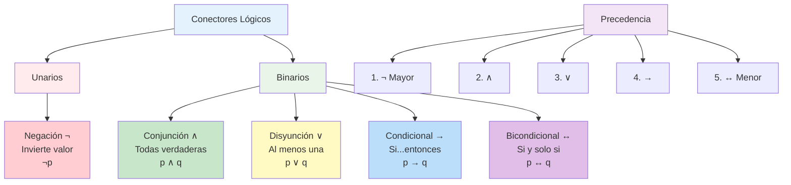

# 🔗 Conectores Lógicos

## 🎯 Fundamentos de los Conectores

> [!info]- 💡 Introducción a los Operadores Lógicos Los **conectores lógicos** (también llamados operadores lógicos o conectivas) son símbolos que permiten combinar proposiciones simples para formar proposiciones compuestas. Son el "pegamento" que une ideas lógicas y determina cómo el valor de verdad de una proposición compuesta depende de sus componentes.
> 
> **Analogías útiles:**
> 
> - **Matemática:** Como +, -, ×, ÷ operan sobre números
> - **Química:** Como enlaces que unen átomos en moléculas
> - **Programación:** Como operadores booleanos (AND, OR, NOT)
> 
> **Importancia histórica:**
> 
> - **Aristóteles (384-322 a.C.):** Lógica silogística básica
> - **George Boole (1854):** Álgebra de la lógica
> - **Gottlob Frege (1879):** Notación moderna
> - **Bertrand Russell (1903):** Formalización completa

### 🔢 Los Cinco Conectores Principales

> [!note]- 🌟 Lista Completa de Conectores Fundamentales
> 
> |Conector|Símbolo|Nombre|Lenguaje Natural|
> |---|---|---|---|
> |**Negación**|¬|NOT|no, no es cierto que|
> |**Conjunción**|∧|AND|y, pero, además|
> |**Disyunción**|∨|OR|o, o bien|
> |**Condicional**|→|IF-THEN|si...entonces, implica|
> |**Bicondicional**|↔|IF AND ONLY IF|si y solo si, equivale|
> 
> **Características generales:**
> 
> - Son **funciones de verdad:** el resultado depende solo de los valores de las proposiciones componentes
> - Son **composicionales:** se pueden combinar para formar estructuras complejas
> - Tienen **precedencia definida:** orden de evaluación establecido

## ❌ Negación (¬, NOT)

### 📝 Definición y Propiedades

> [!example]- 🔴 Conector Unario: Negación
> 
> **Definición:** La negación de una proposición p (simbolizada como ¬p) es verdadera cuando p es falsa, y falsa cuando p es verdadera.
> 
> **Tabla de verdad:**
> 
> |p|¬p|
> |---|---|
> |V|F|
> |F|V|
> 
> **Características especiales:**
> 
> - **Único conector unario** (opera sobre una sola proposición)
> - **Invierte el valor de verdad**
> - **Mayor precedencia** que otros conectores
> 
> **Formas en lenguaje natural:**
> 
> - "No llueve" (¬p donde p: "llueve")
> - "No es cierto que María sea médica" (¬p donde p: "María es médica")
> - "Es falso que 2 + 2 = 5" (¬p donde p: "2 + 2 = 5")

### 🔍 Análisis Detallado de la Negación

> [!tip]- 🎯 Aspectos Importantes de la Negación
> 
> **1. Posición de la negación:**
> 
> - **Negación externa:** ¬(p ∧ q) = "No es cierto que (p y q)"
> - **Negación interna:** (¬p) ∧ q = "(No p) y q"
> 
> **2. Doble negación:**
> 
> - ¬(¬p) ≡ p (equivalencia lógica fundamental)
> - "No es cierto que no llueva" = "Llueve"
> 
> **3. Negación de cuantificadores:**
> 
> - ¬(∀x P(x)) ≡ ∃x ¬P(x)
> - "No todos los estudiantes estudian" = "Algunos estudiantes no estudian"
> 
> **4. Negación implícita:**
> 
> - "Juan es soltero" vs "Juan no está casado"
> - Conceptos que implican negación natural

### ✅ Ejemplos Prácticos de Negación

> [!example]- 💪 Casos de Aplicación
> 
> **Matemáticas:**
> 
> - p: "5 es par" → ¬p: "5 no es par" (¬p es verdadera)
> - q: "π es racional" → ¬q: "π no es racional" (¬q es verdadera)
> 
> **Programación:**
> 
> ```python
> activo = True
> inactivo = not activo  # inactivo = False
> ```
> 
> **Vida cotidiana:**
> 
> - p: "Hoy es domingo" → ¬p: "Hoy no es domingo"
> - q: "Está lloviendo" → ¬q: "No está lloviendo"
> 
> **Casos complejos:**
> 
> - p ∧ q: "Juan estudia y trabaja"
> - ¬(p ∧ q): "No es cierto que Juan estudie y trabaje"
> - (¬p) ∨ (¬q): "Juan no estudia o Juan no trabaja"

## ∧ Conjunción (AND)

### 📝 Definición y Propiedades

> [!success]- 🟢 Conector Binario: Conjunción
> 
> **Definición:** La conjunción de dos proposiciones p y q (simbolizada como p ∧ q) es verdadera únicamente cuando ambas proposiciones son verdaderas.
> 
> **Tabla de verdad:**
> 
> |p|q|p ∧ q|
> |---|---|---|
> |V|V|V|
> |V|F|F|
> |F|V|F|
> |F|F|F|
> 
> **Regla mnemónica:** "Todas verdaderas o nada"
> 
> **Formas en lenguaje natural:**
> 
> - "Juan estudia **y** María trabaja"
> - "Llueve **pero** hace calor" (pero = y)
> - "Es inteligente **además de** trabajador"
> - "Tanto estudia **como** trabaja"

### 🔧 Propiedades de la Conjunción

> [!note]- 📐 Propiedades Algebraicas
> 
> **1. Conmutatividad:**
> 
> - p ∧ q ≡ q ∧ p
> - "Juan estudia y María trabaja" ≡ "María trabaja y Juan estudia"
> 
> **2. Asociatividad:**
> 
> - (p ∧ q) ∧ r ≡ p ∧ (q ∧ r)
> - Se puede escribir como p ∧ q ∧ r sin ambigüedad
> 
> **3. Idempotencia:**
> 
> - p ∧ p ≡ p
> - "Juan estudia y Juan estudia" ≡ "Juan estudia"
> 
> **4. Elemento neutro:**
> 
> - p ∧ V ≡ p (V = proposición siempre verdadera)
> 
> **5. Elemento absorbente:**
> 
> - p ∧ F ≡ F (F = proposición siempre falsa)
> 
> **6. Distributividad:**
> 
> - p ∧ (q ∨ r) ≡ (p ∧ q) ∨ (p ∧ r)

### ✅ Ejemplos de Conjunción

> [!example]- 🔗 Aplicaciones Prácticas
> 
> **Condiciones múltiples:**
> 
> - "Para aprobar necesitas: estudiar **y** asistir a clases **y** hacer tareas"
> - p: "estudiar", q: "asistir", r: "hacer tareas"
> - Forma: p ∧ q ∧ r (todas deben cumplirse)
> 
> **Programación:**
> 
> ```python
> if (edad >= 18) and (tiene_licencia == True):
>     print("Puede conducir")
> ```
> 
> **Matemáticas:**
> 
> - "x > 5 **y** x < 10" (5 < x < 10)
> - "n es par **y** n > 0" (números pares positivos)
> 
> **Análisis crítico:**
> 
> - "Llueve **y** no llueve" → Siempre falsa (contradicción)
> - "2 es par **y** 2 es primo" → Verdadera (ambas son ciertas)

## ∨ Disyunción (OR)

### 📝 Definición y Propiedades

> [!warning]- 🟡 Conector Binario: Disyunción
> 
> **Definición:** La disyunción de dos proposiciones p y q (simbolizada como p ∨ q) es falsa únicamente cuando ambas proposiciones son falsas.
> 
> **Tabla de verdad:**
> 
> |p|q|p ∨ q|
> |---|---|---|
> |V|V|V|
> |V|F|V|
> |F|V|V|
> |F|F|F|
> 
> **Regla mnemónica:** "Al menos una verdadera"
> 
> **Formas en lenguaje natural:**
> 
> - "Vamos al cine **o** nos quedamos en casa"
> - "El examen es el lunes **o bien** es el martes"
> - "Estudias **o** no apruebas"

### 🔍 Disyunción Inclusiva vs Exclusiva

> [!tip]- ⚡ Tipos de Disyunción
> 
> **Disyunción Inclusiva (∨):**
> 
> - **Definición:** "p o q o ambos"
> - **Uso estándar:** Es la disyunción lógica por defecto
> - **Ejemplo:** "Puedes pagar con tarjeta o efectivo" (permite ambos)
> 
> **Disyunción Exclusiva (⊕ o XOR):**
> 
> - **Definición:** "p o q, pero no ambos"
> - **Tabla de verdad:**
> 
> |p|q|p ⊕ q|
> |---|---|---|
> |V|V|F|
> |V|F|V|
> |F|V|V|
> |F|F|F|
> 
> - **Ejemplo:** "El semáforo está en rojo o verde" (no ambos)
> 
> **Expresión de XOR con conectores básicos:** p ⊕ q ≡ (p ∨ q) ∧ ¬(p ∧ q)

### 🔧 Propiedades de la Disyunción

> [!note]- 📐 Propiedades Algebraicas
> 
> **1. Conmutatividad:**
> 
> - p ∨ q ≡ q ∨ p
> 
> **2. Asociatividad:**
> 
> - (p ∨ q) ∨ r ≡ p ∨ (q ∨ r)
> 
> **3. Idempotencia:**
> 
> - p ∨ p ≡ p
> 
> **4. Elemento neutro:**
> 
> - p ∨ F ≡ p
> 
> **5. Elemento absorbente:**
> 
> - p ∨ V ≡ V
> 
> **6. Distributividad:**
> 
> - p ∨ (q ∧ r) ≡ (p ∨ q) ∧ (p ∨ r)

### ✅ Ejemplos de Disyunción

> [!example]- 🌈 Casos Prácticos
> 
> **Opciones alternativas:**
> 
> - "Para llegar puedes ir en bus **o** en taxi **o** caminando"
> - p: "bus", q: "taxi", r: "caminando"
> - Forma: p ∨ q ∨ r
> 
> **Condiciones de acceso:**
> 
> - "Puedes entrar si eres estudiante **o** profesor"
> - Solo necesitas cumplir una condición
> 
> **Programación:**
> 
> ```python
> if (es_fin_de_semana) or (es_feriado):
>     print("No hay clases")
> ```
> 
> **Matemáticas:**
> 
> - "x < 0 **o** x > 10" (fuera del intervalo [0, 10])
> - "n es primo **o** n es compuesto" (para n > 1, siempre verdadera)

## → Condicional (IF-THEN)

### 📝 Definición y Propiedades

> [!info]- 🔵 Conector Binario: Implicación
> 
> **Definición:** El condicional p → q (leído "si p entonces q") es falso únicamente cuando p es verdadero y q es falso.
> 
> **Tabla de verdad:**
> 
> |p|q|p → q|
> |---|---|---|
> |V|V|V|
> |V|F|F|
> |F|V|V|
> |F|F|V|
> 
> **Interpretación clave:** Una promesa solo se rompe cuando la condición se cumple pero la conclusión no.
> 
> **Terminología:**
> 
> - **p:** antecedente, hipótesis, condición suficiente
> - **q:** consecuente, conclusión, condición necesaria
> 
> **Formas en lenguaje natural:**
> 
> - "**Si** estudias, **entonces** aprobarás"
> - "Estudiar **implica** aprobar"
> - "**Cuando** llueve, las calles se mojan"
> - "**Dado que** es fin de semana, no hay clases"

### 🤔 Casos Contraintuitivos del Condicional

> [!warning]- ⚠️ Aspectos No Obvios
> 
> **1. Antecedente falso → Condicional verdadero:**
> 
> - "Si 2 + 2 = 5, entonces soy millonario" → **Verdadero**
> - **Razón:** No se puede falsificar una promesa cuya condición nunca se cumple
> 
> **2. No implica relación causal:**
> 
> - "Si París está en Francia, entonces 2 + 2 = 4" → **Verdadero**
> - **Razón:** Solo importa la estructura lógica, no la conexión real
> 
> **3. Diferencia con el lenguaje cotidiano:**
> 
> - Cotidiano: "Si llueve, llevaré paraguas" (implica intención)
> - Lógico: Solo evalúa la estructura de verdad
> 
> **4. Casos límite:**
> 
> - p → p siempre es verdadero (tautología)
> - F → q siempre es verdadero (ex falso quodlibet)
> - p → V siempre es verdadero

### 🔄 Variantes del Condicional

> [!note]- 🔀 Formas Relacionadas
> 
> **Dado p → q, se definen:**
> 
> **1. Recíproca:** q → p
> 
> - Original: "Si llueve, entonces las calles se mojan"
> - Recíproca: "Si las calles se mojan, entonces llueve"
> - **NO son equivalentes**
> 
> **2. Contraria:** ¬p → ¬q
> 
> - Contraria: "Si no llueve, entonces las calles no se mojan"
> - **NO es equivalente al original**
> 
> **3. Contrarecíproca:** ¬q → ¬p
> 
> - Contrarecíproca: "Si las calles no se mojan, entonces no llueve"
> - **SÍ es equivalente:** p → q ≡ ¬q → ¬p
> 
> **Tabla de equivalencias:**
> 
> |Original|Recíproca|Contraria|Contrarecíproca|
> |---|---|---|---|
> |p → q|q → p|¬p → ¬q|¬q → ¬p|
> |Verdadera|?|?|Verdadera|

### ✅ Ejemplos del Condicional

> [!example]- 🎯 Aplicaciones del Condicional
> 
> **Matemáticas:**
> 
> - "Si n es divisible por 4, entonces n es par"
> - p: "n es divisible por 4", q: "n es par"
> - Siempre verdadero (todo múltiplo de 4 es par)
> 
> **Programación:**
> 
> ```python
> if temperatura > 30:
>     encender_aire_acondicionado()
> ```
> 
> **Reglas y leyes:**
> 
> - "Si conduces sin licencia, entonces recibirás una multa"
> - "Si no pagas impuestos, entonces tendrás problemas legales"
> 
> **Definiciones matemáticas:**
> 
> - "Un número es primo si y solo si tiene exactamente dos divisores"
> - Esto es un bicondicional (próximo conector)

## ↔ Bicondicional (IF AND ONLY IF)

### 📝 Definición y Propiedades

> [!success]- 🟣 Conector Binario: Equivalencia
> 
> **Definición:** El bicondicional p ↔ q (leído "p si y solo si q") es verdadero cuando p y q tienen el mismo valor de verdad.
> 
> **Tabla de verdad:**
> 
> |p|q|p ↔ q|
> |---|---|---|
> |V|V|V|
> |V|F|F|
> |F|V|F|
> |F|F|V|
> 
> **Equivalencia fundamental:** p ↔ q ≡ (p → q) ∧ (q → p)
> 
> **Interpretación:** "p es condición necesaria y suficiente para q"
> 
> **Formas en lenguaje natural:**
> 
> - "Aprobarás **si y solo si** estudias"
> - "Un número es par **si y solamente si** es divisible por 2"
> - "p **equivale a** q"
> - "p **es lo mismo que** q"

### 🔍 Análisis del Bicondicional

> [!tip]- 🎯 Características Especiales
> 
> **1. Doble implicación:**
> 
> - p ↔ q significa: p → q Y q → p
> - Ambas direcciones deben cumplirse
> 
> **2. Equivalencia lógica:**
> 
> - Cuando p ↔ q es verdadero, p y q son lógicamente equivalentes
> - Se pueden sustituir uno por otro en contextos lógicos
> 
> **3. Simetría:**
> 
> - p ↔ q ≡ q ↔ p (propiedad conmutativa)
> 
> **4. Transitividad:**
> 
> - Si p ↔ q y q ↔ r, entonces p ↔ r
> 
> **5. Reflexividad:**
> 
> - p ↔ p siempre es verdadero (tautología)

### 🔧 Propiedades del Bicondicional

> [!note]- 📐 Propiedades Algebraicas
> 
> **1. Conmutatividad:**
> 
> - p ↔ q ≡ q ↔ p
> 
> **2. Asociatividad:**
> 
> - (p ↔ q) ↔ r ≡ p ↔ (q ↔ r)
> 
> **3. Distributividad respecto a sí mismo:**
> 
> - p ↔ (q ↔ r) ≡ (p ↔ q) ↔ r
> 
> **4. Relación con otros conectores:**
> 
> - p ↔ q ≡ (p ∧ q) ∨ (¬p ∧ ¬q)
> - p ↔ q ≡ ¬(p ⊕ q) [negación de XOR]

### ✅ Ejemplos del Bicondicional

> [!example]- 🔄 Casos de Equivalencia
> 
> **Definiciones matemáticas:**
> 
> - "Un triángulo es equilátero **si y solo si** todos sus lados son iguales"
> - "Un número es par **si y solo si** es divisible por 2"
> - "Una función es continua **si y solo si** cumple la definición épsilon-delta"
> 
> **Programación:**
> 
> ```python
> # Un número es positivo si y solo si es mayor que cero
> es_positivo = (numero > 0)
> ```
> 
> **Lógica proposicional:**
> 
> - "La proposición p es verdadera **si y solo si** ¬p es falsa"
> - "p ∧ q es verdadera **si y solo si** tanto p como q son verdaderas"
> 
> **Vida cotidiana:**
> 
> - "Pasas el curso **si y solo si** tu promedio es ≥ 7"
> - "Está lloviendo **si y solo si** las calles se están mojando" (idealizado)

## 📊 Jerarquía y Precedencia de Conectores

### 🔢 Orden de Evaluación

> [!warning]- ⚠️ Precedencia de Operadores
> 
> **Orden de precedencia (mayor a menor):**
> 
> 1. **¬** (negación) - **mayor precedencia**
> 2. **∧** (conjunción)
> 3. **∨** (disyunción)
> 4. **→** (condicional)
> 5. **↔** (bicondicional) - **menor precedencia**
> 
> **Reglas de aplicación:**
> 
> - Los operadores de mayor precedencia se evalúan primero
> - Usar paréntesis para cambiar el orden o clarificar
> - En caso de igual precedencia: asociatividad izquierda
> 
> **Ejemplos:**
> 
> - ¬p ∧ q se interpreta como (¬p) ∧ q
> - p ∧ q ∨ r se interpreta como (p ∧ q) ∨ r
> - p → q ∧ r se interpreta como p → (q ∧ r)
> - p ∧ q → r ∧ s se interpreta como (p ∧ q) → (r ∧ s)

### 🎯 Uso de Paréntesis

> [!tip]- 📝 Claridad en la Notación
> 
> **Casos donde son necesarios:**
> 
> - Para cambiar precedencia: (p ∨ q) ∧ r vs p ∨ (q ∧ r)
> - Para agrupar negaciones: ¬(p ∧ q) vs (¬p) ∧ q
> - En estructuras complejas: (p → q) ↔ (¬q → ¬p)
> 
> **Buenas prácticas:**
> 
> - Usar paréntesis para claridad, incluso cuando no son técnicamente necesarios
> - Agrupar lógicamente las ideas relacionadas
> - Evitar anidamientos excesivos sin paréntesis
> 
> **Ejemplos de clarificación:**
> 
> - Ambiguo: p ∧ q ∨ r ∧ s
> - Claro: (p ∧ q) ∨ (r ∧ s) o p ∧ (q ∨ r) ∧ s

## 🧮 Tabla Resumen de Conectores

> [!example]- 📋 Compendio Completo
> 
> |Conector|Símbolo|Estructura|Verdadero cuando...|Falso cuando...|
> |---|---|---|---|---|
> |**Negación**|¬p|Unario|p es falso|p es verdadero|
> |**Conjunción**|p ∧ q|Binario|ambos son verdaderos|al menos uno es falso|
> |**Disyunción**|p ∨ q|Binario|al menos uno es verdadero|ambos son falsos|
> |**Condicional**|p → q|Binario|p falso o q verdadero|p verdadero y q falso|
> |**Bicondicional**|p ↔ q|Binario|tienen mismo valor|tienen valores diferentes|
> 
> **Memoria:**
> 
> - Conjunción: "todas o ninguna"
> - Disyunción: "al menos una"
> - Condicional: "promesa rota solo cuando antecedente cumplido y consecuente no"
> - Bicondicional: "mismo valor de verdad"

## 🎨 Diagrama de Conectores



## 🧪 Ejercicios de Aplicación

> [!example]- 💪 Práctica Progresiva con Conectores
> 
> **Nivel 1 - Identificación:** 🟢
> 
> Identificar el conector principal en cada expresión:
> 
> 1. ¬(p ∧ q) → **¬** (negación)
> 2. (p ∨ q) ∧ r → **∧** (conjunción)
> 3. p → (q ↔ r) → **→** (condicional)
> 4. ¬p ∨ ¬q → **∨** (disyunción)
> 5. (p → q) ↔ (¬q → ¬p) → **↔** (bicondicional)
> 
> **Nivel 2 - Traducción:** 🟡
> 
> Convertir a forma simbólica:
> 
> 6. "Si estudias y practicas, entonces aprobarás"
>     - p: "estudias", q: "practicas", r: "aprobarás"
>     - Forma: (p ∧ q) → r
> 7. "No es cierto que llueva o haga sol"
>     - p: "llueve", q: "hace sol"
>     - Forma: ¬(p ∨ q)
> 8. "Aprobarás si y solo si estudias o tienes suerte"
>     - p: "aprobarás", q: "estudias", r: "tienes suerte"
>     - Forma: p ↔ (q ∨ r)
> 
> **Nivel 3 - Análisis complejo:** 🔴
> 
> 9. "Si no llueve, entonces iremos al parque, pero si llueve y hace frío, nos quedaremos en casa"
>     - p: "llueve", q: "iremos al parque", r: "hace frío", s: "nos quedaremos en casa"
>     - Forma: (¬p → q) ∧ ((p ∧ r) → s)
> 10. "Estudiar es necesario y suficiente para aprobar, a menos que el examen sea muy difícil"
>     - p: "estudiar", q: "aprobar", r: "examen es muy difícil"
>     - Forma: (p ↔ q) ∧ ¬r

## 🌐 Aplicaciones Especializadas

### 💻 En Programación

> [!success]- 🔧 Operadores Booleanos
> 
> **Correspondencia directa:**
> 
> ```python
> # Negación
> not condicion
> 
> # Conjunción
> condicion1 and condicion2
> 
> # Disyunción
> condicion1 or condicion2
> 
> # Condicional (implementado con if-else)
> if condicion:
>     accion()
> 
> # XOR (disyunción exclusiva)
> condicion1 ^ condicion2  # en Python
> ```
> 
> **Evaluación perezosa:**
> 
> - `and`: si el primer operando es falso, no evalúa el segundo
> - `or`: si el primer operando es verdadero, no evalúa el segundo
> 
> **Aplicaciones prácticas:**
> 
> - **Validación:** `(edad >= 18) and (tiene_licencia)`
> - **Control de flujo:** `if (usuario) and (contraseña_correcta):`
> - **Filtros:** `filter(lambda x: (x > 0) and (x % 2 == 0), numeros)`

### 🗄️ En Bases de Datos

> [!note]- 🔍 Consultas SQL
> 
> **Operadores WHERE:**
> 
> ```sql
> -- Conjunción
> SELECT * FROM estudiantes 
> WHERE edad >= 18 AND ciudad = 'Guayaquil';
> 
> -- Disyunción
> SELECT * FROM productos 
> WHERE categoria = 'electrónicos' OR precio < 100;
> 
> -- Negación
> SELECT * FROM clientes 
> WHERE NOT (estado = 'inactivo');
> 
> -- Combinaciones complejas
> SELECT * FROM pedidos 
> WHERE (fecha >= '2023-01-01' AND total > 500) 
>    OR (cliente_vip = TRUE);
> ```

### 🏗️ En Circuitos Digitales

> [!info]- ⚡ Puertas Lógicas
> 
> **Correspondencia física:**
> 
> - **NOT:** Puerta inversora
> - **AND:** Puerta Y (todas las entradas deben ser 1)
> - **OR:** Puerta O (al menos una entrada debe ser 1)
> - **XOR:** Puerta O-exclusiva
> 
> **Diseño de circuitos:**
> 
> - Los conectores lógicos se implementan como puertas físicas
> - Combinaciones complejas forman circuitos integrados
> - Base de procesadores y sistemas digitales

## 🔗 Conexiones con el Sistema de Notas

> [!quote]- 🌐 Enlaces Conceptuales
> 
> **Prerequisites (Prerrequisitos):**
> 
> - [[01.1 - Proposiciones]] - Conceptos básicos necesarios
> - [[01.2 Clasificación de Proposiciones]] - Diferencia entre simples y compuestas
> 
> **Aplicaciones directas:**
> 
> - [[01.4 Tablas de Verdad]] - Análisis sistemático de cada conector
> - [[01.5 Equivalencias Lógicas]] - Transformaciones usando conectores
> - [[01.3 - Clases de Proposiciones]] - Tautologías y contradicciones
> 
> **Construcción de argumentos:**
> 
> - [[01.6 Argumentos y Validez]] - Uso en razonamientos válidos
> - [[01.7 - Demostraciones]] - Herramientas de prueba formal
> - [[01.8 Inferencias Clásicas]] - Modus Ponens, Modus Tollens
> 
> **Temas avanzados:**
> 
> - [[Álgebra Booleana]] - Formalización algebraica
> - [[Lógica de Predicados]] - Extensión con cuantificadores
> - [[Teoría de la Computación]] - Implementación en sistemas
> 
> **Aplicaciones interdisciplinarias:**
> 
> - [[Programación Lógica]] - Paradigmas basados en lógica
> - [[Inteligencia Artificial]] - Sistemas de razonamiento
> - [[Bases de Datos Relacionales]] - Consultas y optimización

## 💡 Consejos de Estudio y Memorización

> [!tip]- 🧠 Estrategias de Aprendizaje
> 
> **Para memorizar tablas de verdad:**
> 
> 1. **Negación:** "Lo contrario"
> 2. **Conjunción:** "Todas verdaderas o falla"
> 3. **Disyunción:** "Al menos una verdadera"
> 4. **Condicional:** "Solo falla cuando promesa se rompe"
> 5. **Bicondicional:** "Mismos valores"
> 
> **Frases mnemotécnicas:**
> 
> - **NCDCB:** "Necesito Cinco Dedos Como Base"
> - **Precedencia:** "Niega Con Verdad, O Declara Bienes"
> 
> **Práctica recomendada:**
> 
> - Traducir frases diarias al lenguaje lógico
> - Practicar con ejemplos de programación
> - Construir tablas de verdad paso a paso

---

**Tags:** #conectores-lógicos #operadores-lógicos #negación #conjunción #disyunción #condicional #bicondicional #tablas-de-verdad #precedencia-operadores #lógica-booleana #programación #bases-de-datos #circuitos-digitales #university #discrete-mathematics #formal-logic