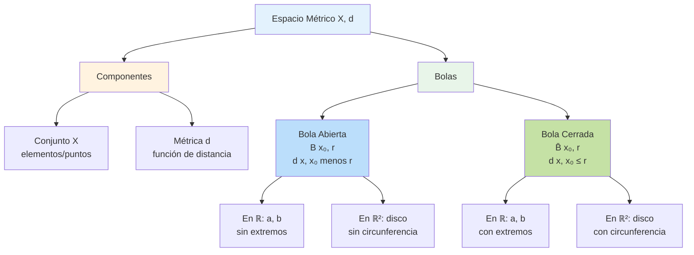

# 🎯 Métricas en Matemáticas

## 🌟 ¿Qué es una Métrica?

> [!info]- Definición **Una métrica (o función de distancia) es una función que define una noción de "distancia" entre elementos de un conjunto. Formaliza matemáticamente el concepto intuitivo de qué tan "lejos" o "cerca" están dos puntos.**
> 
> **Puntos clave:**
> 
> - **Función:** d: X × X → ℝ (de pares de puntos a números reales)
> - **Propósito:** Medir distancia entre elementos de un conjunto
> - **Generalización:** Extiende el concepto de distancia euclidiana
> - **Base fundamental:** Para definir espacios métricos
> - **Aplicaciones:** Geometría, análisis, topología, ciencias aplicadas
> - Permite hablar de **convergencia, continuidad y límites**
> - No todas las "distancias" intuitivas son métricas válidas

### 📖 Contexto Histórico

> [!note]- Desarrollo del Concepto de Métrica
> 
> **Geometría clásica (300 AC - 1600 DC):**
> 
> - **Euclides:** Distancia en el plano y espacio tridimensional
> - **Postulados geométricos:** Axiomas sobre distancia y rectas
> - Distancia como concepto geométrico concreto
> - No había formalización algebraica
> 
> **Geometría analítica (1637 - 1800):**
> 
> - **René Descartes (1637):** Coordenadas cartesianas
> - **Distancia euclidiana:** √[(x₂-x₁)² + (y₂-y₁)²]
> - Álgebra aplicada a la geometría
> - Primer paso hacia formalización
> 
> **Análisis matemático (1800 - 1900):**
> 
> - **Cauchy, Weierstrass:** Rigor en el cálculo
> - Necesidad de formalizar "cercanía" y convergencia
> - **Bolzano:** Primeros trabajos sobre espacios abstractos
> 
> **Espacios métricos modernos (1906 - presente):**
> 
> - **Maurice Fréchet (1906):** Define formalmente espacios métricos
> - **Felix Hausdorff (1914):** Desarrolla topología de espacios métricos
> - **Stefan Banach (1920s):** Espacios normados y métricos
> - **Generalización:** Métricas en espacios abstractos infinito-dimensionales
> - **Aplicaciones modernas:** Machine learning, bioinformática, redes
> - **Topología:** Las métricas generan topologías

---

## 📐 Definición Formal de Métrica

### 🔑 Axiomas de una Métrica

> [!important]- Propiedades Fundamentales
> 
> **Definición:**
> 
> Sea X un conjunto no vacío. Una función d: X × X → ℝ es una **métrica** si satisface los siguientes axiomas para todos x, y, z ∈ X:
> 
> **1. No negatividad:**
> 
> ```
> d(x, y) ≥ 0
> 
> La distancia nunca es negativa.
> Interpretación: No existe "distancia negativa"
> ```
> 
> **2. Identidad de indiscernibles (o separación):**
> 
> ```
> d(x, y) = 0 ⟺ x = y
> 
> La distancia es cero si y solo si los puntos son iguales.
> Interpretación: Dos puntos distintos siempre tienen distancia positiva
> ```
> 
> **3. Simetría:**
> 
> ```
> d(x, y) = d(y, x)
> 
> La distancia de x a y es igual a la distancia de y a x.
> Interpretación: La distancia no depende del orden
> ```
> 
> **4. Desigualdad triangular:**
> 
> ```
> d(x, z) ≤ d(x, y) + d(y, z)
> 
> La distancia directa nunca es mayor que un camino indirecto.
> Interpretación: El camino más corto es la línea recta
> ```
> 
> **Notación:**
> 
> ```
> • (X, d) denota un espacio métrico
> • X es el conjunto subyacente
> • d es la métrica sobre X
> ```

> [!example]- Verificación de Axiomas
> 
> **Ejemplo: Métrica euclidiana en ℝ**
> 
> ```
> Sea d(x, y) = |x - y| en ℝ
> 
> Axioma 1 (No negatividad):
> |x - y| ≥ 0 para todo x, y ∈ ℝ ✓
> 
> Axioma 2 (Identidad):
> |x - y| = 0 ⟺ x - y = 0 ⟺ x = y ✓
> 
> Axioma 3 (Simetría):
> |x - y| = |-(y - x)| = |y - x| ✓
> 
> Axioma 4 (Desigualdad triangular):
> |x - z| ≤ |x - y| + |y - z| ✓
> (Desigualdad triangular para valor absoluto)
> 
> Por lo tanto, d es una métrica válida.
> ```

---

## 📊 Ejemplos Clásicos de Métricas

### 1️⃣ Métrica Euclidiana

> [!important]- Distancia Euclidiana en ℝⁿ
> 
> **Definición:**
> 
> ```
> En ℝⁿ, la métrica euclidiana es:
> 
> d₂(x, y) = √[∑ᵢ₌₁ⁿ (xᵢ - yᵢ)²]
> 
> donde x = (x₁, x₂, ..., xₙ) y y = (y₁, y₂, ..., yₙ)
> ```
> 
> **Casos particulares:**
> 
> ```
> En ℝ (recta real):
> d(x, y) = |x - y|
> 
> En ℝ² (plano):
> d(x, y) = √[(x₁ - y₁)² + (x₂ - y₂)²]
> 
> En ℝ³ (espacio tridimensional):
> d(x, y) = √[(x₁ - y₁)² + (x₂ - y₂)² + (x₃ - y₃)²]
> ```
> 
> **Propiedades:**
> 
> ```
> • La métrica más "natural" e intuitiva
> • Corresponde a la distancia geométrica usual
> • Invariante bajo rotaciones y traslaciones
> • Induce la topología usual de ℝⁿ
> • Proviene de un producto interno: d(x,y) = ||x - y||₂
> ```

> [!example]- Ejemplos Numéricos
> 
> **En ℝ:**
> 
> ```
> d(3, 7) = |3 - 7| = |-4| = 4
> d(-2, 5) = |-2 - 5| = |-7| = 7
> d(π, π) = 0
> ```
> 
> **En ℝ²:**
> 
> ```
> Sean A = (1, 2) y B = (4, 6)
> 
> d(A, B) = √[(4-1)² + (6-2)²]
>         = √[3² + 4²]
>         = √[9 + 16]
>         = √25
>         = 5
> ```
> 
> **En ℝ³:**
> 
> ```
> Sean P = (1, 0, 0) y Q = (0, 1, 1)
> 
> d(P, Q) = √[(0-1)² + (1-0)² + (1-0)²]
>         = √[1 + 1 + 1]
>         = √3
>         ≈ 1.732
> ```

### 2️⃣ Métrica del Taxi (Manhattan)

> [!important]- Métrica de la Suma (d₁)
> 
> **Definición:**
> 
> ```
> En ℝⁿ, la métrica del taxi (o Manhattan, o l¹) es:
> 
> d₁(x, y) = ∑ᵢ₌₁ⁿ |xᵢ - yᵢ|
> 
> Suma de las diferencias absolutas en cada coordenada.
> ```
> 
> **Origen del nombre:**
> 
> ```
> • "Taxi" o "Manhattan": En una ciudad con calles en cuadrícula,
>   un taxi no puede ir en línea recta, debe seguir las calles
> • Distancia = suma de bloques recorridos horizontal + vertical
> • También llamada "norma l¹" o "distancia de Minkowski con p=1"
> ```
> 
> **En ℝ²:**
> 
> ```
> d₁((x₁, y₁), (x₂, y₂)) = |x₁ - x₂| + |y₁ - y₂|
> 
> Ejemplo visual:
> Para ir de (0,0) a (3,2):
> • Distancia euclidiana: √13 ≈ 3.606
> • Distancia del taxi: 3 + 2 = 5
> ```

> [!example]- Ejemplos de Métrica del Taxi
> 
> **En ℝ²:**
> 
> ```
> d₁((1, 2), (4, 6)) = |4-1| + |6-2|
>                     = 3 + 4
>                     = 7
> 
> Comparación con euclidiana:
> d₂((1, 2), (4, 6)) = 5
> d₁((1, 2), (4, 6)) = 7
> 
> La distancia del taxi siempre es mayor o igual
> ```
> 
> **En ℝ³:**
> 
> ```
> d₁((1, 0, 2), (3, 1, 5)) = |3-1| + |1-0| + |5-2|
>                           = 2 + 1 + 3
>                           = 6
> ```
> 
> **Aplicaciones:**
> 
> ```
> • Navegación urbana (GPS)
> • Procesamiento de imágenes
> • Machine learning (distancia L1)
> • Optimización robusta
> ```

### 3️⃣ Métrica del Máximo (Chebyshev)

> [!important]- Métrica del Supremo (d∞)
> 
> **Definición:**
> 
> ```
> En ℝⁿ, la métrica del máximo (o Chebyshev, o l∞) es:
> 
> d∞(x, y) = max{|xᵢ - yᵢ| : i = 1, ..., n}
> 
> El máximo de las diferencias absolutas en cada coordenada.
> ```
> 
> **Interpretación:**
> 
> ```
> • Mide la "peor" diferencia coordenada por coordenada
> • En ℝ², genera "bolas" cuadradas (no circulares)
> • Útil cuando el peor caso es lo que importa
> • También llamada "norma infinito" o "norma del supremo"
> ```
> 
> **En ℝ²:**
> 
> ```
> d∞((x₁, y₁), (x₂, y₂)) = max{|x₁ - x₂|, |y₁ - y₂|}
> 
> Ejemplo:
> d∞((1, 2), (4, 6)) = max{|4-1|, |6-2|}
>                     = max{3, 4}
>                     = 4
> ```

> [!example]- Comparación de las Tres Métricas
> 
> **Mismo ejemplo con las tres métricas:**
> 
> ```
> Puntos: A = (1, 2) y B = (4, 6)
> 
> Métrica euclidiana (d₂):
> d₂(A, B) = √[(4-1)² + (6-2)²] = √25 = 5
> 
> Métrica del taxi (d₁):
> d₁(A, B) = |4-1| + |6-2| = 3 + 4 = 7
> 
> Métrica del máximo (d∞):
> d∞(A, B) = max{|4-1|, |6-2|} = max{3, 4} = 4
> 
> Relación:
> d∞(x, y) ≤ d₂(x, y) ≤ d₁(x, y)
> 4 ≤ 5 ≤ 7 ✓
> ```
> 
> **Visualización de bolas unitarias en ℝ²:**
> 
> ```
> B₂(0, 1) = {x : d₂(x, 0) ≤ 1} → Círculo
> B₁(0, 1) = {x : d₁(x, 0) ≤ 1} → Diamante (cuadrado rotado)
> B∞(0, 1) = {x : d∞(x, 0) ≤ 1} → Cuadrado
> 
> Todas son válidas, pero generan "formas" diferentes
> ```

### 4️⃣ Métrica Discreta

> [!important]- Métrica Trivial
> 
> **Definición:**
> 
> ```
> Sea X cualquier conjunto no vacío. La métrica discreta es:
> 
> d(x, y) = { 0  si x = y
>           { 1  si x ≠ y
> 
> También llamada "métrica trivial" o "métrica 0-1"
> ```
> 
> **Propiedades:**
> 
> ```
> • Todos los puntos distintos están a distancia 1
> • Es una métrica válida (verifica los 4 axiomas)
> • Genera la topología discreta
> • Todo subconjunto es abierto y cerrado
> • Útil para ejemplos y contraejemplos
> ```
> 
> **Verificación de axiomas:**
> 
> ```
> 1. No negatividad: d(x,y) ∈ {0,1} ≥ 0 ✓
> 
> 2. Identidad: d(x,y) = 0 ⟺ x = y (por definición) ✓
> 
> 3. Simetría: d(x,y) = d(y,x) (obvio por casos) ✓
> 
> 4. Desigualdad triangular:
>    Si x = z: d(x,z) = 0 ≤ d(x,y) + d(y,z) ✓
>    Si x ≠ z: d(x,z) = 1 ≤ d(x,y) + d(y,z)
>              Como al menos uno de d(x,y) o d(y,z) es 1,
>              la suma es ≥ 1 ✓
> ```

> [!example]- Ejemplos de Métrica Discreta
> 
> **En cualquier conjunto:**
> 
> ```
> X = {a, b, c}
> 
> d(a, a) = 0
> d(a, b) = 1
> d(b, c) = 1
> d(a, c) = 1
> d(b, b) = 0
> d(c, c) = 0
> 
> Todos los puntos distintos equidistan (distancia 1)
> ```
> 
> **En ℝ con métrica discreta:**
> 
> ```
> d(π, π) = 0
> d(2, 3) = 1
> d(0, 1000000) = 1
> 
> ¡La distancia entre 2 y 3 es igual que entre 0 y un millón!
> ```

### 5️⃣ Métrica en Espacios de Funciones

> [!important]- Métrica del Supremo en C([a,b])
> 
> **Definición:**
> 
> ```
> Sea C([a,b]) el espacio de funciones continuas en [a,b].
> La métrica del supremo es:
> 
> d∞(f, g) = sup{|f(x) - g(x)| : x ∈ [a,b]}
>          = max{|f(x) - g(x)| : x ∈ [a,b]}
> 
> (El máximo existe porque f - g es continua en compacto)
> ```
> 
> **Interpretación:**
> 
> ```
> • Mide la "máxima separación vertical" entre dos funciones
> • Corresponde a la "norma infinito" o "norma uniforme"
> • Induce convergencia uniforme
> • Fundamental en análisis funcional
> ```
> 
> **Otras métricas en espacios de funciones:**
> 
> ```
> Métrica L¹:
> d₁(f, g) = ∫ₐᵇ |f(x) - g(x)| dx
> 
> Métrica L² (euclidiana):
> d₂(f, g) = √[∫ₐᵇ |f(x) - g(x)|² dx]
> ```

---

## 🔄 Conceptos Relacionados

### 🎯 Bolas Abiertas y Cerradas

> [!important]- Bolas en Espacios Métricos
> 
> **Bola abierta:**
> 
> ```
> Sea (X, d) un espacio métrico, x₀ ∈ X y r > 0.
> 
> B(x₀, r) = Bᵣ(x₀) = {x ∈ X : d(x, x₀) < r}
> 
> El conjunto de todos los puntos a distancia estrictamente menor que r de x₀.
> ```
> 
> **Bola cerrada:**
> 
> ```
> B̄(x₀, r) = {x ∈ X : d(x, x₀) ≤ r}
> 
> El conjunto de todos los puntos a distancia menor o igual que r de x₀.
> ```
> 
> **Esfera:**
> 
> ```
> S(x₀, r) = {x ∈ X : d(x, x₀) = r}
> 
> El conjunto de puntos a distancia exactamente r de x₀.
> ```
> 
> **Propiedades:**
> 
> ```
> • B̄(x₀, r) = B(x₀, r) ∪ S(x₀, r)
> • En general: B̄(x₀, r) ≠ clausura de B(x₀, r)
>   (aunque en ℝⁿ con métrica euclidiana sí se cumple)
> • Las bolas abiertas son conjuntos abiertos
> • Las bolas cerradas son conjuntos cerrados
> ```

> [!example]- Ejemplos de Bolas
> 
> **En ℝ con métrica euclidiana:**
> 
> ```
> B(0, 1) = {x ∈ ℝ : |x| < 1} = (-1, 1) (intervalo abierto)
> B̄(0, 1) = {x ∈ ℝ : |x| ≤ 1} = [-1, 1] (intervalo cerrado)
> S(0, 1) = {-1, 1} (dos puntos)
> ```
> 
> **En ℝ² con métrica euclidiana:**
> 
> ```
> B(0, 1) = {(x,y) : x² + y² < 1} (disco abierto)
> B̄(0, 1) = {(x,y) : x² + y² ≤ 1} (disco cerrado)
> S(0, 1) = {(x,y) : x² + y² = 1} (circunferencia)
> ```
> 
> **En ℝ² con métrica del taxi:**
> 
> ```
> B₁((0,0), 1) = {(x,y) : |x| + |y| < 1}
> 
> Forma: Diamante (cuadrado rotado 45°)
> Vértices en: (1,0), (0,1), (-1,0), (0,-1)
> ```
> 
> **En espacio discreto:**
> 
> ```
> B(x₀, 1) = {x₀} (solo el punto central)
> B(x₀, 2) = X (todo el espacio)
> ```

### 🔗 Conexión con Espacios Métricos

> [!quote]- Enlace a Espacios Métricos
> 
> **[[Espacios Métricos]]**
> 
> ```
> Una métrica DEFINE un espacio métrico:
> 
> • Espacio métrico = (X, d)
> • X es un conjunto (cualquiera)
> • d es una métrica sobre X
> 
> La métrica permite:
> ✓ Definir convergencia de sucesiones
> ✓ Definir continuidad de funciones
> ✓ Definir conjuntos abiertos y cerrados
> ✓ Estudiar completitud del espacio
> ✓ Definir compacidad
> ✓ Hacer topología
> 
> Conceptos clave en espacios métricos:
> • Sucesiones convergentes
> • Sucesiones de Cauchy
> • Completitud
> • Compacidad
> • Conexidad
> • Separabilidad
> ```
> 
> **Teoremas fundamentales:**
> 
> ```
> • Toda métrica induce una topología
> • No toda topología proviene de una métrica
> • Espacios metrizables vs no metrizables
> • Teorema de metrización de Urysohn
> ```

### 🎯 Puntos de Acumulación

> [!quote]- Enlace a Puntos de Acumulación
> 
> **[[Puntos de Acumulación]]**
> 
> ```
> Las métricas permiten definir puntos de acumulación:
> 
> Definición:
> x₀ es punto de acumulación de A ⊆ X si:
> 
> Para todo r > 0: B(x₀, r) ∩ (A \ {x₀}) ≠ ∅
> 
> Es decir, toda bola alrededor de x₀ contiene
> puntos de A distintos de x₀.
> 
> Equivalentemente:
> • Existe una sucesión (xₙ) en A \ {x₀} con xₙ → x₀
> • x₀ está "arbitrariamente cerca" de puntos de A
> ```
> 
> **Relación con la métrica:**
> 
> ```
> La métrica determina:
> • Qué significa "estar cerca" (d(x,y) pequeña)
> • Qué significa "converger" (d(xₙ, x) → 0)
> • Cuáles son los puntos de acumulación
> 
> Diferentes métricas → diferentes puntos de acumulación
> 
> Ejemplo:
> En ℝ con métrica discreta:
> • Ningún conjunto tiene puntos de acumulación
>   (excepto posiblemente en sí mismos)
> • Todo punto está "aislado"
> ```
> 
> **Conceptos relacionados:**
> 
> ```
> • Punto adherente
> • Punto interior
> • Punto frontera
> • Punto aislado
> • Clausura de un conjunto
> • Derivado de un conjunto
> ```

---

## ⚠️ Errores Comunes y Malentendidos

> [!warning]- Misconceptions Frecuentes
> 
> **1. "Toda función de distancia es una métrica"**
> 
> ```
> ✗ FALSO
> 
> Contraejemplo:
> d(x, y) = (x - y)² en ℝ NO es métrica
> 
> Viola desigualdad triangular:
> d(0, 2) = 4
> d(0, 1) + d(1, 2) = 1 + 1 = 2
> 4 > 2, así que d(0,2) > d(0,1) + d(1,2) ✗
> 
> Debe verificarse los 4 axiomas
> ```
> 
> **2. "La métrica euclidiana es la única natural"**
> 
> ```
> ✗ FALSO
> 
> • Depende del contexto y aplicación
> • En ciudades: métrica del taxi es más natural
> • En informática: métrica de Hamming (bits diferentes)
> • En grafos: distancia en el grafo
> • En probabilidad: distancia de Wasserstein
> 
> No hay una métrica "correcta" universal
> ```
> 
> **3. "d(x,y) = 0 implica x = y"**
> 
> ```
> ✓ CIERTO para métricas
> ✗ FALSO para pseudométricas
> 
> Una pseudométrica permite d(x,y) = 0 con x ≠ y
> (viola axioma 2)
> 
> Ejemplo de pseudométrica en ℝ²:
> d((x₁,y₁), (x₂,y₂)) = |x₁ - x₂|
> (ignora la segunda coordenada)
> d((1,2), (1,5)) = 0 pero (1,2) ≠ (1,5)
> ```
> 
> **4. "Bola cerrada = clausura de bola abierta"**
> 
> ```
> ✓ CIERTO en ℝⁿ con métrica euclidiana
> ✗ FALSO en general
> 
> Contraejemplo (métrica discreta):
> B(x₀, 1) = {x₀}
> B̄(x₀, 1) = {x₀}
> 
> Pero B(x₀, 0.5) = {x₀} también
> Y clausura(B(x₀, 0.5)) = {x₀}
> 
> En espacios generales, puede no cumplirse
> ```
> 
> **5. "Todas las métricas dan la misma topología"**
> 
> ```
> ✗ FALSO
> 
> • Métricas diferentes pueden dar topologías diferentes
> • Métricas "equivalentes" dan la misma topología
> 
> Ejemplo:
> En ℝⁿ, las métricas d₁, d₂, d∞ son equivalentes
> (inducen la misma topología)
> 
> Pero la métrica discreta induce topología diferente
> ```

---

## 🎯 Ejercicios

> [!example]- Ejercicio 1: Verificar Axiomas
> 
> **Instrucciones:** Determina si las siguientes funciones son métricas.
> 
> ```
> 1. d(x, y) = |x - y|² en ℝ
> 
> 2. d(x, y) = min{|x - y|, 1} en ℝ
> 
> 3. d(x, y) = |x² - y²| en ℝ
> 
> 4. d((x₁,y₁), (x₂,y₂)) = |x₁ - x₂| + 2|y₁ - y₂| en ℝ²
> ```
> 
> **Respuestas:**
> 
> ```
> 1. NO es métrica
>    Viola desigualdad triangular:
>    d(0,2) = 4 pero d(0,1) + d(1,2) = 1 + 1 = 2
>    4 > 2 ✗
> 
> 2. SÍ es métrica
>    • d(x,y) ≥ 0 ✓
>    • d(x,y) = 0 ⟺ x = y ✓
>    • d(x,y) = d(y,x) ✓
>    • Desigualdad triangular: Se verifica (ejercicio) ✓
>    (Llamada "métrica acotada" o "truncada")
> 
> 3. NO es métrica
>    Viola identidad: d(1, -1) = |1 - 1| = 0 pero 1 ≠ -1 ✗
> 
> 4. SÍ es métrica
>    Es una "métrica ponderada" (weighted metric)
>    Todos los axiomas se verifican ✓
> ```

> [!example]- Ejercicio 2: Calcular Distancias
> 
> **Instrucciones:** Calcula las distancias indicadas.
> 
> ```
> Sean A = (2, 1) y B = (5, 5) en ℝ²
> 
> 1. d₂(A, B) = ? (euclidiana)
> 2. d₁(A, B) = ? (taxi)
> 3. d∞(A, B) = ? (máximo)
> ```
> 
> **Respuestas:**
> 
> ```
> 4. d₂(A, B) = √[(5-2)² + (5-1)²]
>              = √[3² + 4²]
>              = √[9 + 16]
>              = √25 = 5
> 
> 5. d₁(A, B) = |5-2| + |5-1|
>              = 3 + 4
>              = 7
> 
> 6. d∞(A, B) = max{|5-2|, |5-1|}
>              = max{3, 4}
>              = 4
> 
> Observación: d∞ ≤ d₂ ≤ d₁
>              4 ≤ 5 ≤ 7 ✓
> ```

> [!example]- Ejercicio 3: Bolas en Diferentes Métricas
> 
> **Instrucciones:** Describe las bolas unitarias en ℝ² con centro en el origen.
> 
> ```
> 7. B₂(0, 1) con métrica euclidiana
> 8. B₁(0, 1) con métrica del taxi
> 9. B∞(0, 1) con métrica del máximo
> ```
> 
> **Respuestas:**
> 
> ```
> 10. B₂(0, 1) = {(x,y) : x² + y² < 1}
>    Forma: Círculo (disco abierto)
>    Radio: 1
>    Incluye puntos como: (0.5, 0.5), (0, 0.9), etc.
> 
> 11. B₁(0, 1) = {(x,y) : |x| + |y| < 1}
>    Forma: Diamante (cuadrado rotado 45°)
>    Vértices aproximados: (1,0), (0,1), (-1,0), (0,-1)
>    Ecuación de los lados: x + y = 1, x - y = 1, etc.
> 
> 12. B∞(0, 1) = {(x,y) : max{|x|, |y|} < 1}
>    Forma: Cuadrado
>    Vértices: (1,1), (1,-1), (-1,1), (-1,-1)
>    Equivalente a: {(x,y) : |x| < 1 y |y| < 1}
> 
> Visualización:
>      B∞ (cuadrado) contiene B₂ (círculo)
>      B₂ (círculo) contiene B₁ (diamante) en su interior
> ```

> [!example]- Ejercicio 4: Métrica Discreta
> 
> **Instrucciones:** En X = {a, b, c, d} con métrica discreta d.
> 
> ```
> 13. ¿Cuál es B(a, 0.5)?
> 14. ¿Cuál es B(a, 1)?
> 15. ¿Cuál es B̄(a, 1)?
> 16. ¿Tiene el conjunto {a} puntos de acumulación?
> ```
> 
> **Respuestas:**
> 
> ```
> 17. B(a, 0.5) = {x ∈ X : d(x, a) < 0.5}
>               = {a}
>    (Solo a está a distancia 0 < 0.5 de a)
> 
> 18. B(a, 1) = {x ∈ X : d(x, a) < 1}
>             = {a}
>    (Otros puntos están a distancia exactamente 1)
> 
> 19. B̄(a, 1) = {x ∈ X : d(x, a) ≤ 1}
>             = {a, b, c, d} = X
>    (Todos los puntos están a distancia ≤ 1)
> 
> 20. NO, {a} no tiene puntos de acumulación
>    B(a, 0.5) ∩ ({a} \ {a}) = B(a, 0.5) ∩ ∅ = ∅
>    Ninguna bola alrededor de otro punto intersecta {a}
>    
>    En métrica discreta, todo punto está "aislado"
> ```

---

## 💡 Propiedades Avanzadas

> [!tip]- Métricas Equivalentes
> 
> **Definición:**
> 
> ```
> Dos métricas d₁ y d₂ sobre X son equivalentes si inducen
> la misma topología, es decir:
> 
> Todo conjunto abierto en (X, d₁) es abierto en (X, d₂)
> y viceversa.
> 
> Equivalentemente:
> Existen constantes C₁, C₂ > 0 tales que para todo x, y ∈ X:
> 
> C₁ · d₁(x, y) ≤ d₂(x, y) ≤ C₂ · d₁(x, y)
> ```
> 
> **Ejemplo en ℝⁿ:**
> 
> ```
> Las métricas d₁, d₂, d∞ son equivalentes:
> 
> d∞(x, y) ≤ d₂(x, y) ≤ √n · d∞(x, y)
> d∞(x, y) ≤ d₁(x, y) ≤ n · d∞(x, y)
> 
> Por lo tanto:
> • Inducen la misma topología
> • Una sucesión converge en una ⟺ converge en todas
> • Los mismos conjuntos son abiertos/cerrados
> ```
> 
> **Importancia:**
> 
> ```
> Métricas equivalentes:
> ✓ Mismos conjuntos abiertos y cerrados
> ✓ Mismas funciones continuas
> ✓ Mismos límites de sucesiones
> ✓ Misma noción de compacidad
> 
> Pero pueden tener:
> ✗ Diferentes valores numéricos de distancia
> ✗ Diferentes formas de bolas
> ✗ Diferentes tasas de convergencia
> ```

> [!tip]- Completitud
> 
> **Sucesión de Cauchy:**
> 
> ```
> Una sucesión (xₙ) en (X, d) es de Cauchy si:
> 
> ∀ε > 0, ∃N ∈ ℕ : ∀m,n ≥ N, d(xₘ, xₙ) < ε
> 
> Interpretación: Los términos se acercan entre sí
> ```
> 
> **Espacio métrico completo:**
> 
> ```
> (X, d) es completo si:
> 
> Toda sucesión de Cauchy en X converge a un punto de X
> 
> Ejemplos:
> • ℝ con métrica euclidiana es completo
> • ℚ con métrica euclidiana NO es completo
> • Todo espacio métrico compacto es completo
> • C([a,b]) con métrica del supremo es completo
> ```
> 
> **Teorema de completación:**
> 
> ```
> Todo espacio métrico (X, d) se puede "completar":
> 
> Existe un espacio métrico completo (X̂, d̂) tal que:
> • X es subespacio denso de X̂
> • d̂ extiende d
> 
> Ejemplo: ℝ es la completación de ℚ
> ```

> [!tip]- Isometrías
> 
> **Definición:**
> 
> ```
> Sean (X, dₓ) y (Y, dᵧ) espacios métricos.
> Una función f: X → Y es una isometría si:
> 
> dᵧ(f(x₁), f(x₂)) = dₓ(x₁, x₂) para todo x₁, x₂ ∈ X
> 
> Es decir: f preserva distancias exactamente
> ```
> 
> **Propiedades:**
> 
> ```
> Si f es isometría:
> • f es inyectiva (uno-a-uno)
> • f es continua
> • f⁻¹: f(X) → X es isometría
> • f preserva bolas, diámetros, límites
> 
> Si f es isometría sobreyectiva:
> • f es biyección
> • X y Y son "isométricos" (esencialmente idénticos)
> • Se escribe: X ≅ Y
> ```
> 
> **Ejemplos:**
> 
> ```
> • Rotaciones en ℝⁿ son isometrías
> • Traslaciones en ℝⁿ son isometrías
> • Reflexiones son isometrías
> • f(x) = x + 1 es isometría de (ℝ,|·|) en sí mismo
> ```

---

## 🌍 Aplicaciones de las Métricas

> [!success]- Aplicaciones en Diferentes Áreas
> 
> **1. Análisis de datos y Machine Learning:**
> 
> ```
> • Distancia euclidiana: clustering (k-means)
> • Distancia de Manhattan: regresión robusta
> • Distancia de Hamming: clasificación binaria
> • Distancia de Mahalanobis: detección de outliers
> • Distancia coseno: similitud de documentos
> • Distancia de Wasserstein: comparación de distribuciones
> ```
> 
> **2. Procesamiento de imágenes:**
> 
> ```
> • Métricas L1, L2: diferencia entre imágenes
> • Distancia de Hausdorff: comparación de formas
> • Earth Mover's Distance: histogramas de color
> • SSIM (Structural Similarity Index): calidad de imagen
> ```
> 
> **3. Bioinformática:**
> 
> ```
> • Distancia de Hamming: secuencias de DNA
> • Distancia de Levenshtein: alineamiento de secuencias
> • Distancia filogenética: árboles evolutivos
> • Métrica de edición: comparación de proteínas
> ```
> 
> **4. Teoría de grafos:**
> 
> ```
> • Distancia en grafos: longitud del camino más corto
> • Métrica de camino: redes de transporte
> • Distancia de edición de grafos: química
> • Centralidad: importancia de nodos
> ```
> 
> **5. Física y ingeniería:**
> 
> ```
> • Espacio-tiempo: métrica de Minkowski
> • Relatividad general: métricas curvas
> • Mecánica cuántica: métrica de Fubini-Study
> • Procesamiento de señales: distancia espectral
> ```
> 
> **6. Economía y finanzas:**
> 
> ```
> • Distancia de activos financieros
> • Medidas de riesgo
> • Teoría de portafolios
> • Análisis de series temporales
> ```

---

## 🔗 Referencias y Conexiones

> [!quote]- Enlaces Conceptuales
> 
> **Conceptos fundamentales:**
> 
> **[[Espacios Métricos]]**
> 
> ```
> Conexión directa: Una métrica DEFINE un espacio métrico
> 
> (X, d) es un espacio métrico donde:
> • X = conjunto (espacio)
> • d = métrica
> 
> Los espacios métricos permiten:
> • Hacer topología con métricas
> • Estudiar convergencia
> • Definir continuidad
> • Analizar completitud
> • Estudiar compacidad
> ```
> 
> **[[Puntos de Acumulación]]**
> 
> ```
> Conexión: La métrica determina qué puntos se "acumulan"
> 
> • x₀ es punto de acumulación de A si:
>   Toda bola B(x₀, r) intersecta A \ {x₀}
> 
> • La definición depende crucialmente de la métrica
> • Diferentes métricas → diferentes puntos de acumulación
> 
> Ejemplo:
> En ℝ con métrica usual: 0 es acumulación de (0,1)
> En ℝ con métrica discreta: (0,1) no tiene acumulación
> ```
> 
> **[[Topología]]**
> 
> ```
> • Toda métrica induce una topología
> • Conjuntos abiertos: uniones de bolas abiertas
> • No toda topología es metrizable
> • Espacios metrizables: topología de espacio métrico
> ```
> 
> **[[Normas]]**
> 
> ```
> • En espacios vectoriales, normas inducen métricas
> • d(x, y) = ||x - y||
> • Toda norma es métrica
> • No toda métrica proviene de una norma
> ```
> 
> **[[Convergencia de Sucesiones]]**
> 
> ```
> • xₙ → x si d(xₙ, x) → 0
> • La métrica define la noción de límite
> • Sucesiones de Cauchy
> • Completitud
> ```
> 
> **[[Continuidad]]**
> 
> ```
> • f: X → Y continua si preserva límites
> • Definición ε-δ usa métricas
> • Continuidad uniforme
> • Lipschitz-continuidad
> ```
> 
> **Conceptos avanzados:**
> 
> **[[Compacidad]]**
> 
> ```
> • Espacios métricos compactos
> • Teorema de Heine-Borel
> • Compacidad secuencial
> • Total acotación
> ```
> 
> **[[Espacios de Banach]]**
> 
> ```
> • Espacios normados completos
> • La norma induce métrica
> • Teoremas de punto fijo
> • Análisis funcional
> ```
> 
> **[[Geometría Diferencial]]**
> 
> ```
> • Métricas riemannianas
> • Tensores métricos
> • Geodésicas
> • Curvatura
> ```

---

## 📖 GLOSARIO - GLOSSARY

> [!note]- Vocabulario Esencial (Español ↔ English)
> 
> ### Términos básicos:
> 
> ```
> Métrica = Metric
> Distancia = Distance
> Espacio métrico = Metric space
> Función de distancia = Distance function
> Axiomas = Axioms
> Desigualdad triangular = Triangle inequality
> Simetría = Symmetry
> No negatividad = Non-negativity
> ```
> 
> ### Tipos de métricas:
> 
> ```
> Métrica euclidiana = Euclidean metric
> Métrica del taxi = Taxi/Manhattan metric
> Métrica del máximo = Maximum/Chebyshev metric
> Métrica discreta = Discrete metric
> Métrica del supremo = Supremum metric
> Pseudométrica = Pseudometric
> Semimétrica = Semimetric
> Ultramétrica = Ultrametric
> ```
> 
> ### Conceptos relacionados:
> 
> ```
> Bola abierta = Open ball
> Bola cerrada = Closed ball
> Esfera = Sphere
> Radio = Radius
> Centro = Center
> Diámetro = Diameter
> Acotado = Bounded
> Isometría = Isometry
> ```
> 
> ### Propiedades:
> 
> ```
> Completo = Complete
> Compacto = Compact
> Conexo = Connected
> Separable = Separable
> Convergente = Convergent
> Sucesión de Cauchy = Cauchy sequence
> Punto de acumulación = Accumulation point
> Punto adherente = Adherent point
> ```
> 
> ### Topología:
> 
> ```
> Conjunto abierto = Open set
> Conjunto cerrado = Closed set
> Clausura = Closure
> Interior = Interior
> Frontera = Boundary
> Denso = Dense
> Vecindad = Neighborhood
> Base = Basis
> ```

---

## 📚 Referencias Bibliográficas

> [!info]- Libros y Recursos Recomendados
> 
> **Textos clásicos:**
> 
> ```
> 1. Rudin, W. (1976). Principles of Mathematical Analysis
>    • Capítulo 2: Topología básica
>    • Tratamiento riguroso y completo
>    • Nivel: Avanzado
> 
> 2. Munkres, J. (2000). Topology
>    • Parte I: Espacios métricos
>    • Muy clara y pedagógica
>    • Nivel: Intermedio-Avanzado
> 
> 3. Sutherland, W. (1975). Introduction to Metric and Topological Spaces
>    • Enfoque en espacios métricos
>    • Muchos ejemplos
>    • Nivel: Intermedio
> 
> 4. Copson, E. (1968). Metric Spaces
>    • Corto y conciso
>    • Buen primer contacto
>    • Nivel: Introductorio
> ```
> 
> **Recursos en español:**
> 
> ```
> 1. Gamelin, T. & Greene, R. (1999). Introducción al Análisis Real
>    • Capítulos sobre espacios métricos
>    • En español
> 
> 2. Apostol, T. (1976). Análisis Matemático
>    • Clásico traducido
>    • Muy completo
> ```
> 
> **Recursos online:**
> 
> ```
> • MIT OpenCourseWare: 18.100C Real Analysis
> • Khan Academy: Multivariable calculus
> • 3Blue1Brown: Videos sobre distancias (YouTube)
> • ProofWiki: Definiciones y demostraciones formales
> ```

---

## 🎓 Notas Adicionales

> [!tip]- Consejos para el Estudio
> 
> **Para entender métricas:**
> 
> ```
> 1. Visualiza primero en ℝ y ℝ²
>    • Dibuja bolas en diferentes métricas
>    • Compara formas geométricas
> 
> 2. Verifica SIEMPRE los 4 axiomas
>    • No asumas que algo es métrica
>    • La desigualdad triangular es la más difícil
> 
> 3. Trabaja ejemplos concretos
>    • Calcula distancias explícitamente
>    • Compara diferentes métricas en mismo espacio
> 
> 4. Conecta con topología
>    • Las métricas inducen topologías
>    • Entiende cómo métricas → conjuntos abiertos
> 
> 5. Practica con ejercicios variados
>    • Espacios finitos (métrica discreta)
>    • Espacios de funciones
>    • Espacios de sucesiones
> ```
> 
> **Errores comunes al aprender:**
> 
> ```
> ✗ Pensar que solo existe la métrica euclidiana
> ✓ Entender que hay infinitas métricas posibles
> 
> ✗ No verificar desigualdad triangular
> ✓ Siempre verificar los 4 axiomas
> 
> ✗ Confundir métrica con norma
> ✓ Norma → métrica, pero no al revés
> 
> ✗ Asumir que todas las métricas son equivalentes
> ✓ Verificar equivalencia caso por caso
> ```

---

**Tags:** #matemáticas #análisis #topología #espacios-métricos #distancia #geometría #análisis-funcional #metric-spaces #punto-acumulación #convergencia

---

# 🌐 Espacios Métricos

## 🎯 ¿Qué es un Espacio Métrico?

> [!info]- 💡 Introducción Intuitiva Un **espacio métrico** es simplemente un conjunto de elementos donde podemos medir "distancias" entre ellos de manera consistente. Es la formalización matemática de la idea intuitiva de "qué tan lejos está algo de otra cosa".
> 
> **Analogías útiles:**
> 
> - **Mapa de una ciudad:** Puedes medir distancias entre cualquier par de lugares
> - **Red social:** Puedes medir "cercanía" entre personas (número de conexiones)
> - **Colores:** Puedes medir qué tan diferentes son dos colores
> 
> **La idea central:** Tener una manera precisa de hablar sobre "proximidad" entre elementos.

### 📐 Definición Formal

> [!note]- 🌟 Concepto Fundamental
> 
> **Definición:** Un **espacio métrico** es un par $(X, d)$ donde:
> 
> - $X$ es un conjunto no vacío (el **espacio**)
> - $d: X \times X \rightarrow \mathbb{R}$ es una **métrica** o **función de distancia**
> 
> La métrica $d$ debe satisfacer cuatro propiedades para todo $x, y, z \in X$:
> 
> **M1. No negatividad:** $$d(x, y) \geq 0$$ "Las distancias nunca son negativas"
> 
> **M2. Identidad:** $$d(x, y) = 0 \iff x = y$$ "La distancia es cero solo si los puntos son iguales"
> 
> **M3. Simetría:** $$d(x, y) = d(y, x)$$ "La distancia de A a B es igual a la de B a A"
> 
> **M4. Desigualdad triangular:** $$d(x, z) \leq d(x, y) + d(y, z)$$ "El camino directo nunca es más largo que un rodeo"

### 🔍 Interpretación Simple

> [!tip]- 💭 ¿Qué significa todo esto?
> 
> **En lenguaje cotidiano:**
> 
> Un espacio métrico es como un "universo matemático" donde:
> 
> - Los elementos son "puntos"
> - Puedes medir la distancia entre cualquier par de puntos
> - Esas distancias se comportan como esperarías en el mundo real
> 
> **Ejemplos cotidianos:**
> 
> - La ciudad donde vives (puntos = lugares, distancia = kilómetros)
> - Un grupo de personas (puntos = personas, distancia = diferencia de edad)
> - Palabras en un diccionario (puntos = palabras, distancia = número de letras diferentes)

## 🎨 Ejemplos Básicos de Espacios Métricos

### 📏 La Recta Real

> [!example]- 🔢 El Ejemplo Más Simple
> 
> **Espacio:** $(\mathbb{R}, d_E)$
> 
> **Métrica (distancia usual):** $$d_E(x, y) = |x - y|$$
> 
> **Interpretación:** La distancia es simplemente "cuánto hay que moverse" de un número a otro.
> 
> **Ejemplos concretos:**
> 
> - $d_E(3, 7) = |3 - 7| = 4$
> - $d_E(-2, 5) = |-2 - 5| = 7$
> - $d_E(4, 4) = |4 - 4| = 0$
> 
> **Visualización:** En una línea numérica, es literalmente la longitud del segmento entre dos puntos.

### 🗺️ El Plano

> [!example]- 🌍 Espacio Bidimensional
> 
> **Espacio:** $(\mathbb{R}^2, d_E)$
> 
> **Métrica euclidiana (distancia "en línea recta"):** $$d_E((x_1, y_1), (x_2, y_2)) = \sqrt{(x_2 - x_1)^2 + (y_2 - y_1)^2}$$
> 
> **Interpretación:** Es el Teorema de Pitágoras - la distancia en línea recta entre dos puntos.
> 
> **Ejemplos concretos:**
> 
> - $d_E((0, 0), (3, 4)) = \sqrt{9 + 16} = 5$
> - $d_E((1, 2), (4, 6)) = \sqrt{9 + 16} = 5$
> 
> **Visualización:** Como medir con una regla directamente de un punto a otro en un mapa.

### 🏙️ Distancia en Ciudades

> [!example]- 🚕 Métrica del Taxista
> 
> **Espacio:** $(\mathbb{R}^2, d_1)$
> 
> **Métrica Manhattan:** $$d_1((x_1, y_1), (x_2, y_2)) = |x_2 - x_1| + |y_2 - y_1|$$
> 
> **Interpretación:** Cómo se mueve un taxi en una ciudad con cuadrícula - solo puede ir horizontal o verticalmente.
> 
> **Ejemplos concretos:**
> 
> - $d_1((0, 0), (3, 4)) = 3 + 4 = 7$
> - $d_1((1, 2), (4, 6)) = 3 + 4 = 7$
> 
> **Comparación:**
> 
> - Distancia euclidiana de $(0,0)$ a $(3,4)$: 5 unidades
> - Distancia del taxista: 7 unidades (más larga porque no puede ir en diagonal)

### 🎲 Todo o Nada

> [!example]- 🔢 Métrica Discreta
> 
> **Espacio:** Cualquier conjunto $X$ con la métrica discreta
> 
> **Métrica discreta:** $$d_D(x, y) = \begin{cases} 0 & \text{si } x = y \ 1 & \text{si } x \neq y \end{cases}$$
> 
> **Interpretación:** Solo importa si dos elementos son iguales o diferentes, no "qué tan diferentes".
> 
> **Ejemplos concretos:**
> 
> - En $\mathbb{N}$: $d_D(5, 5) = 0$ pero $d_D(5, 6) = 1$ y también $d_D(5, 1000) = 1$
> - En palabras: $d_D(\text{"gato"}, \text{"gato"}) = 0$ pero $d_D(\text{"gato"}, \text{"perro"}) = 1$
> 
> **Característica especial:** Todos los elementos diferentes están a la misma distancia entre sí.

## 🔵 Bolas Abiertas y Cerradas

### 📐 Bola Abierta

> [!note]- ⭕ Definición de Bola Abierta
> 
> **Definición:** Sea $(X, d)$ un espacio métrico, $x_0 \in X$ un punto, y $r > 0$ un número real positivo.
> 
> La **bola abierta** con centro $x_0$ y radio $r$ es: $$B(x_0, r) = {x \in X : d(x, x_0) < r}$$
> 
> **En palabras:** Todos los puntos que están a distancia **estrictamente menor** que $r$ del centro.
> 
> **Nota clave:** La palabra "abierta" significa que NO incluimos los puntos que están exactamente a distancia $r$.
> 
> **Componentes:**
> 
> - $x_0$ = **centro** de la bola
> - $r$ = **radio** de la bola
> - $d$ = métrica que usamos para medir

### 🎯 Bola Cerrada

> [!note]- 🔵 Definición de Bola Cerrada
> 
> **Definición:** Sea $(X, d)$ un espacio métrico, $x_0 \in X$ un punto, y $r > 0$ un número real positivo.
> 
> La **bola cerrada** con centro $x_0$ y radio $r$ es: $$\overline{B}(x_0, r) = {x \in X : d(x, x_0) \leq r}$$
> 
> **En palabras:** Todos los puntos que están a distancia **menor o igual** que $r$ del centro.
> 
> **Nota clave:** La palabra "cerrada" significa que SÍ incluimos los puntos que están exactamente a distancia $r$.
> 
> **Diferencia con bola abierta:**
> 
> - Bola abierta: $d(x, x_0) < r$ (sin igualdad)
> - Bola cerrada: $d(x, x_0) \leq r$ (con igualdad)

### 🎨 Visualización: Diferencia entre Abierta y Cerrada

> [!tip]- 👁️ ¿Cómo se ven?
> 
> **En la recta real $(\mathbb{R}, d_E)$ con centro $x_0$ y radio $r$:**
> 
> **Bola abierta:** $$B(x_0, r) = (x_0 - r, x_0 + r)$$
> 
> - Es un intervalo abierto
> - NO incluye los extremos
> - Ejemplo: $B(0, 2) = (-2, 2)$ → NO incluye $-2$ ni $2$
> 
> **Bola cerrada:** $$\overline{B}(x_0, r) = [x_0 - r, x_0 + r]$$
> 
> - Es un intervalo cerrado
> - SÍ incluye los extremos
> - Ejemplo: $\overline{B}(0, 2) = [-2, 2]$ → SÍ incluye $-2$ y $2$
> 
> **Relación:** $$B(x_0, r) \subseteq \overline{B}(x_0, r)$$ La bola cerrada contiene a la bola abierta más su "borde".

## 🎨 Ejemplos Visuales de Bolas

### 📏 En la Recta Real

> [!example]- 🔢 $(\mathbb{R}, d_E)$
> 
> **Bola abierta $B(5, 2)$:** $$B(5, 2) = {x \in \mathbb{R} : |x - 5| < 2}$$ $$= {x \in \mathbb{R} : -2 < x - 5 < 2}$$ $$= {x \in \mathbb{R} : 3 < x < 7}$$ $$= (3, 7)$$
> 
> **Visualización:**
> 
> ```
> ───────○═══════════════════○───────
>        3                   7
>        ↑       radio=2     ↑
>        NO          5       NO
>      incluido  (centro)  incluido
> ```
> 
> **Bola cerrada $\overline{B}(5, 2)$:** $$\overline{B}(5, 2) = [3, 7]$$
> 
> **Visualización:**
> 
> ```
> ───────●═══════════════════●───────
>        3                   7
>        ↑       radio=2     ↑
>        SÍ          5       SÍ
>      incluido  (centro)  incluido
> ```

### 🗺️ En el Plano Euclidiano

> [!example]- 🌍 $(\mathbb{R}^2, d_E)$
> 
> **Bola abierta $B((0,0), 1)$:** $$B((0,0), 1) = {(x, y) \in \mathbb{R}^2 : \sqrt{x^2 + y^2} < 1}$$ $$= {(x, y) \in \mathbb{R}^2 : x^2 + y^2 < 1}$$
> 
> **Forma geométrica:** Disco circular (interior del círculo)
> 
> - NO incluye la circunferencia
> - Radio: 1
> - Centro: origen $(0, 0)$
> 
> **Visualización:**
> 
> ```
>         y
>         ↑
>         │     ╱─────╲
>         │   ╱    ●    ╲
>         │  │   (0,0)   │
>     ────┼──┼───────────┼──→ x
>         │  │           │
>         │   ╲         ╱
>         │     ╲─────╱
>         │    (sin borde)
> ```
> 
> **Bola cerrada $\overline{B}((0,0), 1)$:** $$\overline{B}((0,0), 1) = {(x, y) \in \mathbb{R}^2 : x^2 + y^2 \leq 1}$$
> 
> **Forma geométrica:** Disco circular (círculo + interior)
> 
> - SÍ incluye la circunferencia
> - Radio: 1
> - Centro: origen $(0, 0)$
> 
> **Visualización:**
> 
> ```
>         y
>         ↑
>         │     ●─────●
>         │   ●    ●    ●
>         │  ●   (0,0)   ●
>     ────┼──●───────────●──→ x
>         │  ●           ●
>         │   ●         ●
>         │     ●─────●
>         │   (con borde)
> ```

### 🏙️ En la Métrica del Taxista

> [!example]- 🚕 $(\mathbb{R}^2, d_1)$
> 
> **Bola abierta $B((0,0), 2)$ con métrica Manhattan:** $$B((0,0), 2) = {(x, y) : |x| + |y| < 2}$$
> 
> **Forma geométrica:** Rombo (cuadrado rotado 45°)
> 
> **Visualización:**
> 
> ```
>         y
>         ↑
>       2 │      ╱╲
>         │     ╱  ╲
>       1 │    ╱ ● ╲
>         │   ╱(0,0)╲
>     ────┼──╱────────╲──→ x
>       -2│-1    1    2
>         │   ╲      ╱
>         │    ╲    ╱
>         │     ╲  ╱
>         │      ╲╱
> ```
> 
> **Puntos extremos (NO incluidos en bola abierta):**
> 
> - $(2, 0)$: distancia $= |2| + |0| = 2$
> - $(0, 2)$: distancia $= |0| + |2| = 2$
> - $(-2, 0)$: distancia $= |-2| + |0| = 2$
> - $(0, -2)$: distancia $= |0| + |-2| = 2$
> 
> **Puntos intermedios (SÍ incluidos):**
> 
> - $(1, 0)$: distancia $= 1 < 2$ ✓
> - $(1, 0.5)$: distancia $= 1.5 < 2$ ✓
> - $(0.5, 1)$: distancia $= 1.5 < 2$ ✓

### 🎲 En la Métrica Discreta

> [!example]- 🔢 $(X, d_D)$
> 
> Sea $X$ cualquier conjunto con métrica discreta y $x_0 \in X$.
> 
> **Caso 1: Radio $r \leq 1$**
> 
> **Bola abierta $B(x_0, 1)$:** $$B(x_0, 1) = {x \in X : d_D(x, x_0) < 1}$$ Como $d_D$ solo toma valores $0$ o $1$, y necesitamos $< 1$: $$B(x_0, 1) = {x_0}$$ Solo el centro está en la bola.
> 
> **Bola cerrada $\overline{B}(x_0, 1)$:** $$\overline{B}(x_0, 1) = {x \in X : d_D(x, x_0) \leq 1}$$ Ahora incluimos distancias $= 1$: $$\overline{B}(x_0, 1) = X$$ ¡Todo el espacio!
> 
> **Caso 2: Radio $r > 1$**
> 
> **Tanto bola abierta como cerrada:** $$B(x_0, r) = \overline{B}(x_0, r) = X$$ Todo el espacio, porque todas las distancias son $\leq 1 < r$.
> 
> **Conclusión peculiar:** En métrica discreta, las bolas son muy diferentes a nuestra intuición geométrica.

## 🎯 ¿Para Qué Sirven las Bolas?

> [!tip]- 💡 Importancia de las Bolas
> 
> **1. Definir cercanía:** Las bolas formalizan "estar cerca de un punto".
> 
> - "$x$ está cerca de $x_0$" = "$x \in B(x_0, r)$ para algún $r$ pequeño"
> 
> **2. Definir conceptos topológicos:**
> 
> - **Conjunto abierto:** Contiene una bola alrededor de cada uno de sus puntos
> - **Punto interior:** Está en el interior si hay una bola a su alrededor
> - **Convergencia:** $x_n \to x$ significa que eventualmente $x_n \in B(x, \varepsilon)$ para todo $\varepsilon > 0$
> 
> **3. Aplicaciones prácticas:**
> 
> - **Búsqueda por proximidad:** Encontrar todos los elementos a distancia $< r$ de un punto
> - **Clustering:** Agrupar puntos que están "cerca"
> - **Filtrado:** Mantener solo puntos dentro de cierto radio
> 
> **4. Visualización geométrica:** Las bolas nos dan una intuición geométrica en espacios abstractos.

## 📊 Comparación Visual de Bolas en Diferentes Métricas

> [!example]- 🎨 Misma Posición y Radio, Diferentes Formas
> 
> Todas con centro en $(0, 0)$ y radio $r = 1$ en $\mathbb{R}^2$:
> 
> **Métrica Euclidiana ($d_E$):**
> 
> ```
>       ╱─────╲
>     ╱    ●    ╲
>    │   (0,0)   │
>    │           │
>     ╲         ╱
>       ╲─────╱
>     CÍRCULO
> ```
> 
> **Métrica del Taxista ($d_1$):**
> 
> ```
>        ╱╲
>       ╱  ╲
>      ╱ ● ╲
>     ╱(0,0)╲
>     ────────
>     ╲      ╱
>      ╲    ╱
>       ╲  ╱
>        ╲╱
>     ROMBO
> ```
> 
> **Métrica del Supremo ($d_\infty$):**
> 
> ```
>     ┌────────┐
>     │        │
>     │   ●    │
>     │ (0,0)  │
>     │        │
>     └────────┘
>     CUADRADO
> ```
> 
> **Observación importante:** La misma "bola de radio 1" tiene diferentes formas dependiendo de cómo medimos distancias.

## 🔗 Conexiones con el Sistema de Notas

> [!quote]- 🌐 Enlaces Conceptuales
> 
> **Prerequisitos:**
> 
> - [[01 - Métricas y Espacios Métricos]] - Definición de función de distancia
> - [[Conjuntos]] - Teoría básica de conjuntos
> - [[Funciones]] - Concepto de función
> 
> **Temas relacionados:**
> 
> - [[02 - Puntos de Acumulación]] - Usa bolas para definir proximidad
> - [[Topología]] - Las bolas generan la topología
> - [[Convergencia]] - Definida usando bolas
> 
> **Aplicaciones:**
> 
> - [[Continuidad]] - Definición con bolas (ε-δ)
> - [[Algoritmos de Búsqueda]] - Búsqueda por proximidad
> - [[Clustering]] - Agrupamiento por distancia

## 🧪 Ejercicios Simples

> [!example]- 💪 Práctica Básica
> 
> **Ejercicio 1:** En $(\mathbb{R}, d_E)$, describir explícitamente:
> 
> - $B(3, 2)$
> - $\overline{B}(3, 2)$
> - ¿Cuál es la diferencia?
> 
> **Solución:**
> 
> - $B(3, 2) = (1, 5)$ (intervalo abierto, sin extremos)
> - $\overline{B}(3, 2) = [1, 5]$ (intervalo cerrado, con extremos)
> - Diferencia: Los puntos $1$ y $5$ están en la cerrada pero no en la abierta
> 
> **Ejercicio 2:** En $(\mathbb{R}^2, d_E)$, ¿el punto $(3, 4)$ está en $B((0, 0), 5)$?
> 
> **Solución:**
> 
> - Distancia: $d_E((0,0), (3,4)) = \sqrt{9 + 16} = 5$
> - Como $5 \not< 5$, entonces $(3, 4) \notin B((0, 0), 5)$
> - Pero SÍ está en $\overline{B}((0, 0), 5)$ porque $5 \leq 5$
> 
> **Ejercicio 3:** En $(X, d_D)$ con $X = {a, b, c, d}$ y $x_0 = a$:
> 
> - ¿Qué elementos tiene $B(a, 0.5)$?
> - ¿Y $B(a, 1)$?
> - ¿Y $\overline{B}(a, 1)$?
> 
> **Solución:**
> 
> - $B(a, 0.5) = {a}$ (solo $d_D(a, a) = 0 < 0.5$)
> - $B(a, 1) = {a}$ (solo $d_D(a, a) = 0 < 1$, los demás tienen distancia $1$)
> - $\overline{B}(a, 1) = {a, b, c, d} = X$ (todos tienen distancia $\leq 1$)

## 📚 Resumen Visual



---

**Tags:** #espacios-métricos #bolas #bola-abierta #bola-cerrada #métrica #distancia #topología-básica #análisis-real #university #mathematics #conceptos-fundamentales