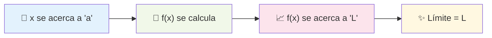
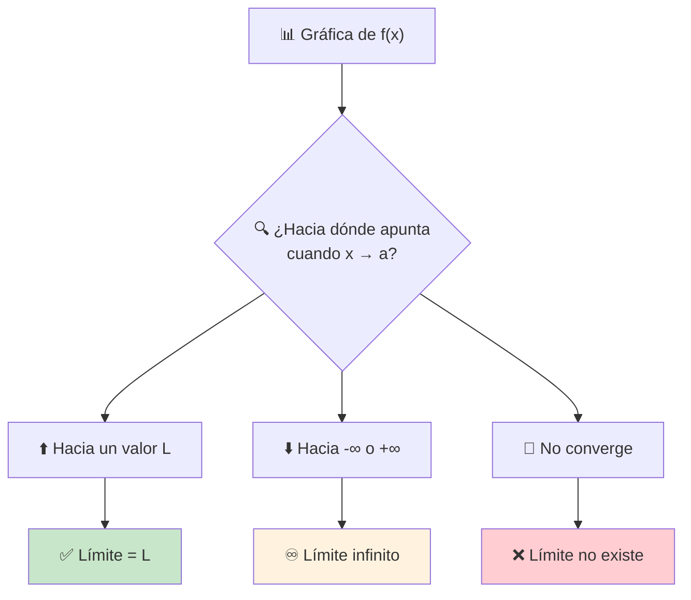
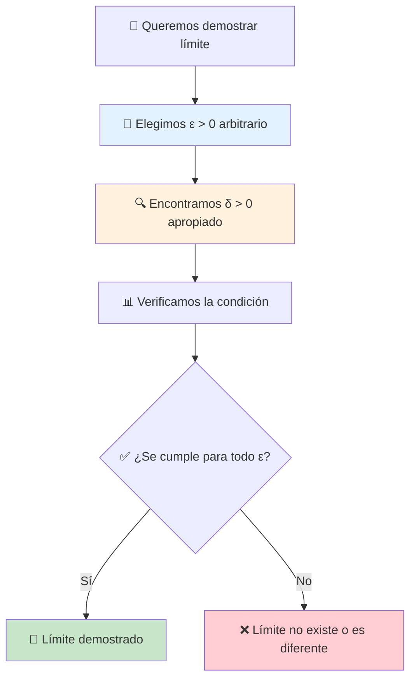
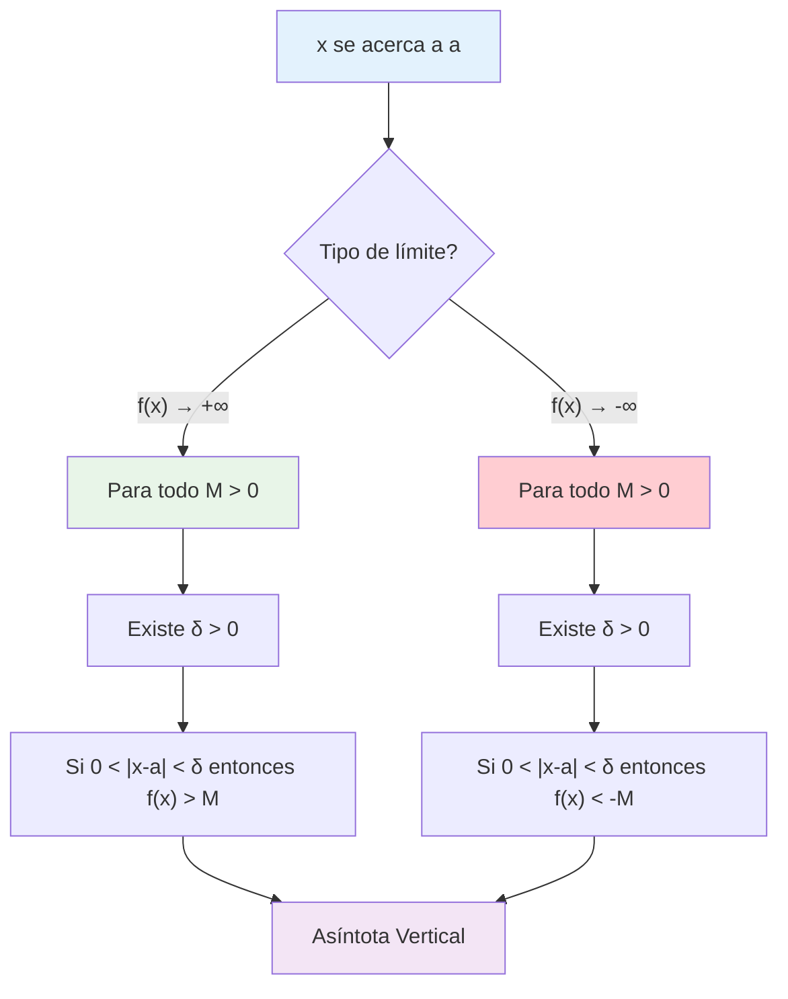
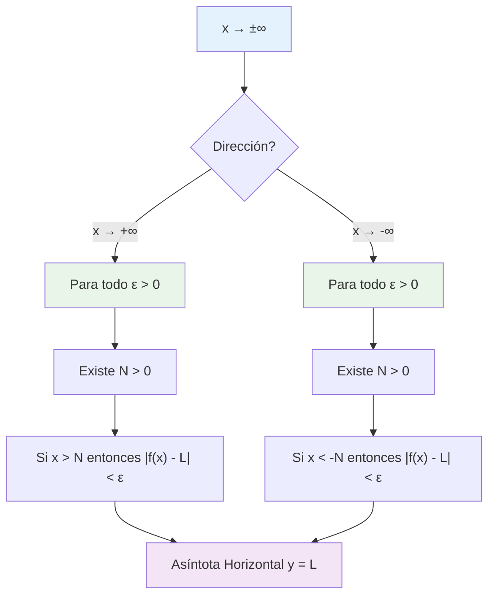

# Concepto Intuitivo de Límite 🤔

> [!tip] 🎯 Idea Central Un **límite** describe hacia dónde se dirige una función cuando la variable independiente se acerca a un valor específico, **sin necesariamente llegar a ese valor**. Es como observar hacia dónde camina una persona, no necesariamente dónde está parada.

## ¿Qué es un Límite? 🔍

> [!info] 🌟 Definición Intuitiva Decimos que el **límite de $f(x)$ cuando $x$ se acerca a $a$ es $L$** si:
> 
> Los valores de $f(x)$ se acercan arbitrariamente a $L$ cuando $x$ toma valores cada vez más cercanos a $a$ (pero diferentes de $a$).
> 
> **Notación:** $$\lim_{x \to a} f(x) = L$$



> [!example] 🌈 Ejemplo Visual Simple Considera $f(x) = 2x + 1$ y queremos $\lim_{x \to 3} f(x)$
> 
> |$x$ acercándose a 3|$f(x) = 2x + 1$|
> |---|---|
> |$x = 2.9$|$f(2.9) = 6.8$|
> |$x = 2.99$|$f(2.99) = 6.98$|
> |$x = 2.999$|$f(2.999) = 6.998$|
> |$x = 3.001$|$f(3.001) = 7.002$|
> |$x = 3.01$|$f(3.01) = 7.02$|
> |$x = 3.1$|$f(3.1) = 7.2$|
> 
> 🎯 **Observación:** Conforme $x$ se acerca a 3, $f(x)$ se acerca a 7
> 
> Por tanto: $\lim_{x \to 3} (2x + 1) = 7$ ✨

## Conceptos Clave para Entender Límites 🗝️

> [!warning] ⚠️ Misconcepciones Importantes
> 
> ### 🚫 Lo que NO es un límite:
> 
> - **NO necesitamos** que $f(a)$ exista
> - **NO importa** el valor de $f(a)$ si existe
> - **NO necesitamos** que $x$ llegue exactamente a $a$
> 
> ### ✅ Lo que SÍ importa:
> 
> - **SÍ importa** hacia dónde tienden los valores de $f(x)$
> - **SÍ necesitamos** que $x$ se acerque a $a$
> - **SÍ debe existir** un valor específico al que se acercan $f(x)$

> [!example] 🎪 Ejemplo con Función Discontinua Sea $g(x) = \begin{cases} x^2 & \text{si } x \neq 2 \ 10 & \text{si } x = 2 \end{cases}$
> 
> Para $\lim_{x \to 2} g(x)$:
> 
> |$x$ cerca de 2|$g(x)$|
> |---|---|
> |$x = 1.9$|$g(1.9) = 3.61$|
> |$x = 1.99$|$g(1.99) = 3.9601$|
> |$x = 2.01$|$g(2.01) = 4.0401$|
> |$x = 2.1$|$g(2.1) = 4.41$|
> 
> 🎯 **Resultado:** $\lim_{x \to 2} g(x) = 4$
> 
> 📝 **Nota:** ¡Aunque $g(2) = 10$, el límite es 4! 🤯

## Interpretación Gráfica 📊

> [!info] 📈 Lectura Visual de Límites En una gráfica, el límite se ve como:
> 
> - 👀 **Observamos** hacia dónde "apunta" la función cuando nos acercamos al punto
> - 🎯 **No importa** si hay un "hueco" o "salto" en ese punto exacto
> - ✨ **Importa** la "tendencia" o "dirección" de la función



## Situaciones Comunes 🎭

> [!note] 📚 Casos Típicos de Límites
> 
> ### 1️⃣ **Función Continua** 🌊
> 
> $\lim_{x \to a} f(x) = f(a)$
> 
> - La función no tiene "interrupciones"
> - El límite coincide con el valor de la función
> 
> ### 2️⃣ **Función con Hueco** 🕳️
> 
> $\lim_{x \to a} f(x) = L$, pero $f(a)$ no existe
> 
> - Hay un "punto faltante" en la gráfica
> - El límite existe pero la función no está definida ahí
> 
> ### 3️⃣ **Función con Salto** 📈📉
> 
> $\lim_{x \to a} f(x)$ no existe
> 
> - La función "salta" de un valor a otro
> - Los límites laterales son diferentes
> 
> ### 4️⃣ **Límite Infinito** ♾️
> 
> $\lim_{x \to a} f(x) = \pm\infty$
> 
> - La función crece sin límite
> - Hay una asíntota vertical

## Aproximación por Valores 🎯

> [!tip] 🔢 Estrategia de Tablas de Valores Para encontrar un límite intuitivamente:
> 
> 1. **📊 Crear tabla:** Valores de $x$ acercándose a $a$ por ambos lados
> 2. **🧮 Calcular:** Los valores correspondientes de $f(x)$
> 3. **👀 Observar:** Hacia qué valor tienden $f(x)$
> 4. **🎯 Concluir:** Ese es el límite (si existe)

> [!example] 🧪 Ejemplo Práctico: $\lim_{x \to 0} \frac{\sin x}{x}$
> 
> |$x$|$\frac{\sin x}{x}$|
> |---|---|
> |$-0.1$|$0.998334...$|
> |$-0.01$|$0.999983...$|
> |$-0.001$|$0.999999...$|
> |$0.001$|$0.999999...$|
> |$0.01$|$0.999983...$|
> |$0.1$|$0.998334...$|
> 
> 🎯 **Conclusión:** $\lim_{x \to 0} \frac{\sin x}{x} = 1$ ✨
> 
> 📝 **Nota:** Este es un límite fundamental muy importante!

## Lenguaje Matemático 🗣️

> [!info] 📝 Frases Equivalentes Todas estas expresiones significan lo mismo:
> 
> - "$\lim_{x \to a} f(x) = L$"
> - "El límite de $f(x)$ cuando $x$ tiende a $a$ es $L$"
> - "Cuando $x$ se acerca a $a$, $f(x)$ se acerca a $L$"
> - "$f(x)$ tiende a $L$ cuando $x$ tiende a $a$"
> - "$f(x) \to L$ cuando $x \to a$"

## Técnica de Estudio: Mnemotecnia "CERCA" 🧠

> [!tip] 🎓 Para Recordar el Concepto de Límite
> 
> **C**ercanos: Los valores de $x$ están cerca de $a$ **E**xacto: No necesita llegar exactamente a $a$  
> **R**esultado: Los $f(x)$ se acercan a un resultado $L$ **C**onvergencia: Los valores deben converger a $L$ **A**proximación: Es sobre aproximarse, no sobre llegar

## Errores Comunes ⚠️

> [!warning] 🚨 Trampas Frecuentes
> 
> ### ❌ Error 1: Confundir límite con valor de función
> 
> **Incorrecto:** "Si $f(2) = 5$, entonces $\lim_{x \to 2} f(x) = 5$" **Correcto:** El límite puede ser diferente al valor de la función
> 
> ### ❌ Error 2: Pensar que el límite requiere que la función esté definida
> 
> **Incorrecto:** "No puedo hallar el límite si la función no existe en ese punto" **Correcto:** El límite puede existir aunque la función no esté definida ahí
> 
> ### ❌ Error 3: Usar solo un lado para aproximarse
> 
> **Incorrecto:** Solo mirar valores desde la derecha o desde la izquierda **Correcto:** Verificar ambos lados para asegurar que convergen al mismo valor

## Referencias 📚

> [!quote] 🔗 Notas Relacionadas
> 
> - [[02 - Límites Laterales]] - Extensión del concepto
> - [[03 - Límites en Gráficas]] - Interpretación visual detallada
> - [[01 - Continuidad y Límites]] - Relación entre límites y continuidad
> - [[01 - Concepto y Definición Formal del Límite]] - Formalización rigurosa

## Notas Recomendadas 💡

> [!note] 📖 Para Profundizar
> 
> - [[01 - Propiedades y Teoremas de los Límites]] - Casos simples
> - [[01 - Propiedades y Teoremas de los Límites]] - Propiedades y leyes
> - [[01 - Formas Indeterminadas]] - Casos más complejos
> - Carpeta Aplicaciones de Límites - Usos en ciencias e ingeniería

---

**Tags:** #calculo #limites #concepto-intuitivo #fundamentos #aproximacion #convergencia #matematicas #definicion-basica #interpretacion-grafica #ejemplos

# Definición Épsilon-Delta 🔬

> [!tip] 🎯 Concepto Central La **definición épsilon-delta** es la formalización matemática rigurosa del concepto de límite. Es como establecer las "reglas del juego" de manera precisa: podemos acercarnos tanto como queramos al límite, siempre que nos acerquemos lo suficiente al punto de interés.

## La Definición Formal 📐

> [!info] 🔬 Definición Rigurosa de Límite **Decimos que** $\lim_{x \to a} f(x) = L$ **si y solo si:**
> 
> Para todo $\varepsilon > 0$, existe un $\delta > 0$ tal que:
> 
> $$\text{Si } 0 < |x - a| < \delta \text{, entonces } |f(x) - L| < \varepsilon$$
> 
> **En otras palabras:** No importa qué tan pequeño sea $\varepsilon$ (qué tan cerca queremos estar del límite), siempre podemos encontrar un $\delta$ (qué tan cerca debemos estar del punto) que garantice esa precisión.



## Interpretación Geométrica 📊

> [!example] 🎨 Visualización Gráfica **La definición épsilon-delta se traduce en:**
> 
> - **📏 Banda horizontal:** $L - \varepsilon < f(x) < L + \varepsilon$
> - **📏 Banda vertical:** $a - \delta < x < a + \delta$ (excluyendo $x = a$)
> - **🎯 Condición:** Toda la función en la banda vertical debe quedar dentro de la banda horizontal
> 
> |Elemento|Significado Geométrico|Representación|
> |---|---|---|
> |$\varepsilon$|Mitad del ancho de la banda horizontal|$\pm \varepsilon$ alrededor de $L$|
> |$\delta$|Mitad del ancho de la banda vertical|$\pm \delta$ alrededor de $a$|
> |$\|f(x) - L\|$|Distancia vertical entre $f(x)$ y $L$|Altura desde la función al límite|
> |$\|x - a\|$|Distancia horizontal entre $x$ y $a$|Distancia desde $x$ al punto de interés|

> [!note] 🖼️ Interpretación Visual
> 
> ```mermaid
> graph LR
>    A["🎯 Punto (a,L)"] --> B["📏 Banda ε alrededor de L"]
>    A --> C["📏 Banda δ alrededor de a"]
>    B --> D["✅ f(x) debe quedar dentro"]
>    C --> E["🔍 Para toda x en esta banda"]
>    D --> F["🎉 Definición satisfecha"]
>    E --> F
>    
>    style F fill:#c8e6c9
>    style B fill:#e8f5e8
>    style C fill:#fff3e0
> ```

## Análisis de los Componentes 🔍

> [!info] 🧮 Disección de la Definición
> 
> ### 📏 Épsilon ($\varepsilon$) - La Tolerancia
> 
> - **🎯 Representa:** Qué tan cerca queremos que $f(x)$ esté de $L$
> - **📊 Controla:** La precisión vertical (en el eje $y$)
> - **🔢 Rango:** Cualquier número positivo, por pequeño que sea
> - **💭 Interpretación:** "Margen de error" permitido
> 
> ### 📏 Delta ($\delta$) - La Respuesta
> 
> - **🎯 Representa:** Qué tan cerca de $a$ debe estar $x$
> - **📊 Controla:** El rango horizontal (en el eje $x$)
> - **🔗 Dependencia:** Generalmente depende de $\varepsilon$: $\delta = \delta(\varepsilon)$
> - **💭 Interpretación:** "Radio de acción" alrededor de $a$

> [!warning] ⚠️ Condiciones Importantes
> 
> ### 🚫 Exclusiones Críticas
> 
> - **$0 < |x - a|$:** Excluimos $x = a$ (no nos importa $f(a)$)
> - **$x \neq a$:** La función puede no estar definida en $a$
> - **$\varepsilon > 0$:** Solo consideramos tolerancias positivas
> - **$\delta > 0$:** Solo consideramos rangos positivos

## Estrategia de Demostración 🎯

> [!tip] 📝 Método Sistemático para Demostraciones
> 
> ### **Paso 1: Configuración Inicial** 🎬
> 
> - Sea $\varepsilon > 0$ arbitrario (dado)
> - Queremos encontrar $\delta > 0$ tal que la implicación se cumpla
> 
> ### **Paso 2: Análisis Algebraico** 🧮
> 
> - Partimos de $|f(x) - L| < \varepsilon$
> - Manipulamos algebraicamente para obtener una condición en $|x - a|$
> - Identificamos qué $\delta$ funcionará
> 
> ### **Paso 3: Elección de Delta** 🎯
> 
> - Elegimos $\delta$ basado en el análisis anterior
> - A menudo $\delta = \min{\text{valor}_1, \text{valor}_2, ...}$
> 
> ### **Paso 4: Verificación** ✅
> 
> - Asumimos $0 < |x - a| < \delta$
> - Demostramos que esto implica $|f(x) - L| < \varepsilon$

## Ejemplos Fundamentales 📚

### Ejemplo 1: Función Lineal 📈

> [!example] 🎯 Demostrar que $\lim_{x \to 3} (2x + 1) = 7$
> 
> **Configuración:**
> 
> - Queremos probar: $\lim_{x \to 3} (2x + 1) = 7$
> - Sea $\varepsilon > 0$ arbitrario
> 
> **Análisis:** $|f(x) - L| = |(2x + 1) - 7| = |2x - 6| = 2|x - 3|$
> 
> **Queremos:** $2|x - 3| < \varepsilon$ **Esto significa:** $|x - 3| < \frac{\varepsilon}{2}$
> 
> **Elección de Delta:** Elegimos $\delta = \frac{\varepsilon}{2}$
> 
> **Verificación:** Si $0 < |x - 3| < \delta = \frac{\varepsilon}{2}$, entonces: $|f(x) - L| = 2|x - 3| < 2 \cdot \frac{\varepsilon}{2} = \varepsilon$ ✅
> 
> **Conclusión:** El límite está demostrado 🎉

### Ejemplo 2: Función Cuadrática 📊

> [!example] 🎯 Demostrar que $\lim_{x \to 2} x^2 = 4$
> 
> ### Configuración:
> 
> - Queremos probar: $\lim_{x \to 2} x^2 = 4$
> - Sea $\varepsilon > 0$ arbitrario
> 
> ### Análisis:
> $$
> |f(x) - L| = |x^2 - 4| = |(x - 2)(x + 2)| = |x - 2| \cdot |x + 2|
> $$
> 
> ### Restricción preliminar:
> 
> Supongamos $|x - 2| < 1$, entonces $1 < x < 3$, así que $3 < x + 2 < 5$  
> Por tanto: $|x + 2| < 5$
> 
> ### Condición deseada:
> $$
> |x^2 - 4| = |x - 2| \cdot |x + 2| < |x - 2| \cdot 5 < \varepsilon
> $$
> 
> Esto requiere: $|x - 2| < \frac{\varepsilon}{5}$
> 
> ### Elección de Delta:
> $$
> \delta = \min\left\{1, \frac{\varepsilon}{5}\right\}
> $$
> 
> ### Verificación:
> 
> Si $0 < |x - 2| < \delta = \min\left\{1, \frac{\varepsilon}{5}\right\}$, entonces:
> 
> - $|x - 2| < 1$, lo que implica $1 < x < 3$, por tanto $3 < x + 2 < 5$, así $|x + 2| < 5$
> - $|x - 2| < \frac{\varepsilon}{5}$
> 
> Por tanto:
> $$
> |x^2 - 4| = |x - 2| \cdot |x + 2| < \frac{\varepsilon}{5} \cdot 5 = \varepsilon \quad \blacksquare
> $$
> 

### Ejemplo 3: Función Racional 📉

> [!example] 🎯 Demostrar que $\lim_{x \to 1} \frac{x^2 - 1}{x - 1} = 2$
> 
> **Configuración:**
> 
> - Función: $f(x) = \frac{x^2 - 1}{x - 1} = \frac{(x-1)(x+1)}{x-1} = x + 1$ (para $x \neq 1$)
> - Queremos probar: $\lim_{x \to 1} f(x) = 2$
> 
> **Análisis:** Para $x \neq 1$: $|f(x) - L| = |(x + 1) - 2| = |x - 1|$
> 
> **Condición:** $|x - 1| < \varepsilon$
> 
> **Elección de Delta:** $\delta = \varepsilon$
> 
> **Verificación:** Si $0 < |x - 1| < \delta = \varepsilon$, entonces: $|f(x) - 2| = |x - 1| < \varepsilon$ ✅
> 
> 📝 **Nota:** La simplicidad surge porque la función se simplifica a una forma lineal.

## Propiedades y Teoremas 📜

> [!info] ⚖️ Propiedades Fundamentales
> 
> ### 🎯 Unicidad del Límite
> 
> **Si** $\lim_{x \to a} f(x) = L_1$ **y** $\lim_{x \to a} f(x) = L_2$, **entonces** $L_1 = L_2$
> 
> ### ➕ Límite de la Suma
> 
> **Si** $\lim_{x \to a} f(x) = L$ **y** $\lim_{x \to a} g(x) = M$, **entonces:** $\lim_{x \to a} [f(x) + g(x)] = L + M$
> 
> ### ✖️ Límite del Producto
> 
> $\lim_{x \to a} [f(x) \cdot g(x)] = L \cdot M$
> 
> ### ➗ Límite del Cociente
> 
> $\lim_{x \to a} \frac{f(x)}{g(x)} = \frac{L}{M}$ (si $M \neq 0$)

## Aplicaciones de la Definición 🌍

> [!example] 🔬 Demostrar que un Límite NO Existe **Para probar que** $\lim_{x \to a} f(x)$ **no existe:**
> 
> Encontramos un $\varepsilon_0 > 0$ tal que para cualquier $\delta > 0$, existe al menos un $x$ con $0 < |x - a| < \delta$ pero $|f(x) - L| \geq \varepsilon_0$
> 
> **Ejemplo:** Función escalón $f(x) = \begin{cases} 0 & \text{si } x < 0 \ 1 & \text{si } x \geq 0 \end{cases}$
> 
> **En $x = 0$:** No importa qué valor de $L$ propongamos, siempre podemos encontrar puntos cerca de 0 donde $f(x)$ está lejos de $L$.

## Relación con Límites Laterales ↔️

> [!info] 🔗 Conexión Épsilon-Delta con Límites Laterales
> 
> **Límite por la izquierda:** $\lim_{x \to a^-} f(x) = L$ Para todo $\varepsilon > 0$, existe $\delta > 0$ tal que: Si $a - \delta < x < a$, entonces $|f(x) - L| < \varepsilon$
> 
> **Límite por la derecha:** $\lim_{x \to a^+} f(x) = L$ Para todo $\varepsilon > 0$, existe $\delta > 0$ tal que: Si $a < x < a + \delta$, entonces $|f(x) - L| < \varepsilon$

## Errores Comunes ⚠️

> [!warning] 🚨 Trampas en Demostraciones Épsilon-Delta
> 
> ### ❌ Error 1: Delta dependiente de x
> 
> **Problema:** Elegir $\delta$ que dependa de $x$ **Correcto:** $\delta$ solo debe depender de $\varepsilon$ (y posiblemente de $a$ y $L$)
> 
> ### ❌ Error 2: Asumir el resultado
> 
> **Problema:** Comenzar asumiendo $|f(x) - L| < \varepsilon$ **Correcto:** Comenzar con la condición de $\delta$ y llegar a la de $\varepsilon$
> 
> ### ❌ Error 3: No manejar casos extremos
> 
> **Problema:** No considerar restricciones adicionales necesarias **Correcto:** Usar $\min$ para combinar múltiples restricciones en $\delta$

## Importancia Histórica 📖

> [!note] 🏛️ Contexto Histórico **Desarrollo por:**
> 
> - **Karl Weierstrass** (1815-1897) - Formalización rigurosa
> - **Augustin-Louis Cauchy** (1789-1857) - Trabajos preliminares
> - **Bernard Bolzano** (1781-1848) - Contribuciones tempranas
> 
> **Importancia:**
> 
> - 🔬 Eliminó la vaguedad del concepto intuitivo
> - 📐 Permitió demostraciones rigurosas
> - 🏗️ Base para todo el análisis matemático moderno
> - 🌍 Fundamento para derivadas, integrales y continuidad

## Técnica de Estudio: Mnemotecnia "ÉPSILON" 🧠

> [!tip] 🎓 Para Recordar el Proceso de Demostración **É**ligE un épsilon arbitrario > 0 **P**artE de la condición |f(x) - L| < ε **S**implifica algebraicamente la expresión **I**dentifica la relación con |x - a| **L**ogra una condición de la forma |x - a| < algo **O**ptimiza eligiendo δ apropiado **N**avega la verificación final

## Referencias 📚

> [!quote] 🔗 Notas Relacionadas
> 
> - [[01 - Concepto y Definición Formal del Límite]] - Base conceptual informal
> - [[Límites por la Izquierda y Derecha]] - Extensión lateral
> - [[Continuidad de Funciones]] - Aplicación directa
> - [[01 - Propiedades y Teoremas de los Límites]] - Propiedades demostradas rigurosamente

## Notas Recomendadas 💡

> [!note] 📖 Para Profundizar
> 
> - [[Análisis Real]] - Contexto matemático completo
> - [[Topología Básica]] - Conceptos de vecindades
> - [[Historia del Cálculo]] - Desarrollo histórico
> - [[Demostraciones Matemáticas]] - Técnicas de prueba
> - [[Fundamentos de Análisis]] - Teoría avanzada de límites
> - [[Espacios Métricos]] - Generalización abstracta

---

**Tags:** #calculo #limites #definicion-formal #epsilon-delta #rigor-matematico #demostraciones #weierstrass #analisis-real #fundamentos #matematica-pura #teoria-limites

# 📏 Definición Formal del Límite para Asíntotas

## 🎯 Fundamentos de Límites Infinitos

> [!info]- 💡 Introducción a las Definiciones Formales Las **definiciones formales** de límites para asíntotas extienden el concepto clásico de límite (definición épsilon-delta) a casos donde:
> 
> - **Variable tiende al infinito:** $x \to \pm\infty$ (asíntotas horizontales)
> - **Función tiende al infinito:** $f(x) \to \pm\infty$ (asíntotas verticales)
> 
> **Notación clave:**
> 
> - **M:** Número arbitrariamente grande (para límites infinitos)
> - **N:** Número arbitrariamente grande (para límites al infinito)
> - **δ:** Delta, distancia pequeña alrededor de un punto
> - **ε:** Épsilon, tolerancia pequeña para valores finitos

### 🔍 Recordatorio: Definición Épsilon-Delta Clásica

> [!note]- 📚 Definición Base (Límites Finitos)
> 
> **Para límites finitos:** $\lim_{x \to a} f(x) = L$
> 
> **Definición:** Para todo $\varepsilon > 0$, existe $\delta > 0$ tal que:
> 
> $$\text{Si } 0 < |x - a| < \delta \text{ entonces } |f(x) - L| < \varepsilon$$
> 
> **Interpretación:**
> 
> - $\varepsilon$ controla qué tan cerca está $f(x)$ de $L$
> - $\delta$ controla qué tan cerca está $x$ de $a$
> 
> Esta definición es la base para extender a casos infinitos.

## 🔺 Asíntotas Verticales - Definición Formal

### ➕ Límite Infinito Positivo

> [!example]- 📈 Definición: $\lim_{x \to a} f(x) = +\infty$
> 
> **Definición formal:** Para todo $M > 0$, existe $\delta > 0$ tal que:
> 
> $$\text{Si } 0 < |x - a| < \delta \text{ entonces } f(x) > M$$
> 
> **Interpretación geométrica:**
> 
> - No importa qué tan grande sea $M$, podemos hacer que $f(x)$ sea aún más grande
> - Esto ocurre cuando $x$ está suficientemente cerca de $a$
> 
> **Elementos clave:**
> 
> - **M:** Cualquier número positivo grande que elijamos
> - **δ:** Distancia alrededor de $x = a$ que garantiza $f(x) > M$
> - **Condición:** $0 < |x - a| < \delta$ (excluimos $x = a$)
> 
> **Ejemplo típico:** $\lim_{x \to 0} \frac{1}{x^2} = +\infty$

### ➖ Límite Infinito Negativo

> [!example]- 📉 Definición: $\lim_{x \to a} f(x) = -\infty$
> 
> **Definición formal:** Para todo $M > 0$, existe $\delta > 0$ tal que:
> 
> $$\text{Si } 0 < |x - a| < \delta \text{ entonces } f(x) < -M$$
> 
> **Nota importante:** Usamos $-M$ donde $M > 0$, así $f(x)$ es más negativo que $-M$
> 
> **Interpretación:**
> 
> - $f(x)$ se vuelve arbitrariamente negativa (grande en valor absoluto)
> - Cuando $x$ se acerca a $a$
> 
> **Ejemplo típico:** $\lim_{x \to 0^+} \frac{-1}{x} = -\infty$

### 🔄 Límites Laterales Infinitos

> [!tip]- 🎯 Límites Unilaterales Infinitos
> 
> **Por la derecha:** $\lim_{x \to a^+} f(x) = +\infty$
> 
> Para todo $M > 0$, existe $\delta > 0$ tal que: $$\text{Si } a < x < a + \delta \text{ entonces } f(x) > M$$
> 
> **Por la izquierda:** $\lim_{x \to a^-} f(x) = +\infty$
> 
> Para todo $M > 0$, existe $\delta > 0$ tal que: $$\text{Si } a - \delta < x < a \text{ entonces } f(x) > M$$
> 
> **Asíntota vertical:** Existe si al menos uno de los límites laterales es infinito.

## 📐 Asíntotas Horizontales - Definición Formal

### ➡️ Límite al Infinito Positivo

> [!success]- 📊 Definición: $\lim_{x \to +\infty} f(x) = L$
> 
> **Definición formal:** Para todo $\varepsilon > 0$, existe $N > 0$ tal que:
> 
> $$\text{Si } x > N \text{ entonces } |f(x) - L| < \varepsilon$$
> 
> **Interpretación:**
> 
> - Cuando $x$ es suficientemente grande, $f(x)$ está arbitrariamente cerca de $L$
> - $L$ es la **asíntota horizontal** por la derecha
> 
> **Elementos clave:**
> 
> - **N:** Umbral grande; para $x > N$ la función se comporta como queremos
> - **ε:** Tolerancia pequeña para la distancia entre $f(x)$ y $L$
> - **L:** Valor límite (asíntota horizontal)
> 
> **Ejemplo:** $\lim_{x \to +\infty} \frac{1}{x} = 0$

### ⬅️ Límite al Infinito Negativo

> [!success]- 📊 Definición: $\lim_{x \to -\infty} f(x) = L$
> 
> **Definición formal:** Para todo $\varepsilon > 0$, existe $N > 0$ tal que:
> 
> $$\text{Si } x < -N \text{ entonces } |f(x) - L| < \varepsilon$$
> 
> **Nota:** Usamos $-N$ donde $N > 0$, así $x$ es muy negativo
> 
> **Interpretación:**
> 
> - Cuando $x$ es suficientemente negativo, $f(x)$ se acerca a $L$
> - $L$ es la **asíntota horizontal** por la izquierda

### ♾️ Límites Infinitos al Infinito

> [!warning]- ⚡ Definiciones para Casos Infinito-Infinito
> 
> **1. $\lim_{x \to +\infty} f(x) = +\infty$**
> 
> Para todo $M > 0$, existe $N > 0$ tal que: $$\text{Si } x > N \text{ entonces } f(x) > M$$
> 
> **2. $\lim_{x \to +\infty} f(x) = -\infty$**
> 
> Para todo $M > 0$, existe $N > 0$ tal que: $$\text{Si } x > N \text{ entonces } f(x) < -M$$
> 
> **3. $\lim_{x \to -\infty} f(x) = +\infty$**
> 
> Para todo $M > 0$, existe $N > 0$ tal que: $$\text{Si } x < -N \text{ entonces } f(x) > M$$
> 
> **4. $\lim_{x \to -\infty} f(x) = -\infty$**
> 
> Para todo $M > 0$, existe $N > 0$ tal que: $$\text{Si } x < -N \text{ entonces } f(x) < -M$$

## 📊 Tabla Resumen de Definiciones

> [!note]- 📋 Compendio de Definiciones Formales
> 
> |Tipo de Límite|Notación|Definición Formal|Variables|
> |---|---|---|---|
> |**Finito → Finito**|$\lim_{x \to a} f(x) = L$|$\|f(x) - L\| < \varepsilon$ cuando $0 < \|x - a\| < \delta$|$\varepsilon, \delta$|
> |**Finito → +∞**|$\lim_{x \to a} f(x) = +\infty$|$f(x) > M$ cuando $0 < \|x - a\| < \delta$|$M, \delta$|
> |**Finito → -∞**|$\lim_{x \to a} f(x) = -\infty$|$f(x) < -M$ cuando $0 < \|x - a\| < \delta$|$M, \delta$|
> |**+∞ → Finito**|$\lim_{x \to +\infty} f(x) = L$|$\|f(x) - L\| < \varepsilon$ cuando $x > N$|$\varepsilon, N$|
> |**-∞ → Finito**|$\lim_{x \to -\infty} f(x) = L$|$\|f(x) - L\| < \varepsilon$ cuando $x < -N$|$\varepsilon, N$|
> |**+∞ → +∞**|$\lim_{x \to +\infty} f(x) = +\infty$|$f(x) > M$ cuando $x > N$|$M, N$|
> |**+∞ → -∞**|$\lim_{x \to +\infty} f(x) = -\infty$|$f(x) < -M$ cuando $x > N$|$M, N$|

## 🧠 Técnica de Estudio: Método "EMDN"

> [!tip]- 🎓 Mnemotecnia "EMDN"
> 
> **E** - **E**légir la definición correcta **M** - **M** o **N** según el tipo de límite **D** - **D**elta para límites en puntos finitos **N** - **N**úmero grande para límites al infinito
> 
> **Frase nemotécnica:** _"Escojo Métodos Definidos Numéricamente"_
> 
> **Guía de decisión:**
> 
> - Si $x \to a$ (finito) → usar **δ** (delta)
> - Si $x \to \pm\infty$ → usar **N**
> - Si $f(x) \to \pm\infty$ → usar **M**
> - Si $f(x) \to L$ (finito) → usar **ε** (épsilon)

## 🔧 Ejemplos Detallados de Demostración

### 📊 Ejemplo 1: Asíntota Vertical

> [!example]- 📈 Demostrar: $\lim_{x \to 0^+} \frac{1}{x} = +\infty$
> 
> **Problema:** Usar la definición formal para demostrar que $\frac{1}{x}$ tiende a $+\infty$ cuando $x$ se acerca a $0$ por la derecha.
> 
> **Demostración:**
> 
> **Paso 1:** Establecer lo que debemos probar Para todo $M > 0$, debemos encontrar $\delta > 0$ tal que: $$\text{Si } 0 < x < \delta \text{ entonces } \frac{1}{x} > M$$
> 
> **Paso 2:** Trabajo algebraico Queremos $\frac{1}{x} > M$, donde $x > 0$.
> 
> Esto es equivalente a $x < \frac{1}{M}$ (al invertir, se cambia el sentido)
> 
> **Paso 3:** Elegir δ Tomemos $\delta = \frac{1}{M}$
> 
> **Paso 4:** Verificación Si $0 < x < \delta = \frac{1}{M}$, entonces: $$x < \frac{1}{M} \Rightarrow \frac{1}{x} > M$$
> 
> **Conclusión:** Para cualquier $M > 0$, con $\delta = \frac{1}{M}$ se cumple la definición. ∎

### 📊 Ejemplo 2: Asíntota Horizontal

> [!example]- 📉 Demostrar: $\lim_{x \to +\infty} \frac{2x + 1}{x + 3} = 2$
> 
> **Problema:** Demostrar usando la definición formal que la función tiene asíntota horizontal en $y = 2$.
> 
> **Demostración:**
> 
> **Paso 1:** Establecer lo que debemos probar Para todo $\varepsilon > 0$, debemos encontrar $N > 0$ tal que: $$\text{Si } x > N \text{ entonces } \left|\frac{2x + 1}{x + 3} - 2\right| < \varepsilon$$
> 
> **Paso 2:** Simplificar la expresión $$\left|\frac{2x + 1}{x + 3} - 2\right| = \left|\frac{2x + 1 - 2(x + 3)}{x + 3}\right|$$ $$= \left|\frac{2x + 1 - 2x - 6}{x + 3}\right| = \left|\frac{-5}{x + 3}\right| = \frac{5}{x + 3}$$
> 
> (Nota: $x + 3 > 0$ para $x$ suficientemente grande)
> 
> **Paso 3:** Establecer la desigualdad Queremos $\frac{5}{x + 3} < \varepsilon$
> 
> Esto es equivalente a $x + 3 > \frac{5}{\varepsilon}$
> 
> Es decir, $x > \frac{5}{\varepsilon} - 3$
> 
> **Paso 4:** Elegir N Tomemos $N = \max\left{\frac{5}{\varepsilon} - 3, 1\right}$
> 
> (El máximo asegura que $N > 0$ y que $x + 3 > 0$)
> 
> **Paso 5:** Verificación Si $x > N$, entonces $x > \frac{5}{\varepsilon} - 3$, por lo que: $$x + 3 > \frac{5}{\varepsilon} \Rightarrow \frac{5}{x + 3} < \varepsilon$$
> 
> **Conclusión:** Para cualquier $\varepsilon > 0$, con $N = \max\left{\frac{5}{\varepsilon} - 3, 1\right}$ se cumple la definición. ∎

### 📊 Ejemplo 3: Límite Infinito al Infinito

> [!example]- 🚀 Demostrar: $\lim_{x \to +\infty} x^2 = +\infty$
> 
> **Problema:** Demostrar que $x^2$ crece sin límite cuando $x \to +\infty$.
> 
> **Demostración:**
> 
> **Paso 1:** Establecer lo que debemos probar Para todo $M > 0$, debemos encontrar $N > 0$ tal que: $$\text{Si } x > N \text{ entonces } x^2 > M$$
> 
> **Paso 2:** Análisis algebraico Queremos $x^2 > M$
> 
> Como $x > 0$ (para $x$ suficientemente grande), esto es equivalente a: $$x > \sqrt{M}$$
> 
> **Paso 3:** Elegir N Tomemos $N = \sqrt{M}$
> 
> **Paso 4:** Verificación Si $x > N = \sqrt{M}$, entonces: $$x > \sqrt{M} \Rightarrow x^2 > M$$
> 
> **Conclusión:** Para cualquier $M > 0$, con $N = \sqrt{M}$ se cumple la definición. ∎

## 🎨 Visualización de las Definiciones

### 📊 Diagrama para Asíntotas Verticales



### 📊 Diagrama para Asíntotas Horizontales



## ⚠️ Errores Comunes en Demostraciones

> [!warning]- 🚫 Errores Frecuentes
> 
> **Error 1: Confundir M y N**
> 
> - ❌ Usar M para límites al infinito
> - ✅ M para función infinita, N para variable infinita
> 
> **Error 2: Signos en límites negativos**
> 
> - ❌ $f(x) > -M$ para límite $-\infty$
> - ✅ $f(x) < -M$ para límite $-\infty$
> 
> **Error 3: Dominios incorrectos**
> 
> - ❌ No considerar restricciones de dominio
> - ✅ Verificar que las desigualdades sean válidas
> 
> **Error 4: Elección de parámetros**
> 
> - ❌ Elegir δ o N que no funcionan para todos los casos
> - ✅ Verificar que la elección sea general
> 
> **Error 5: Direcciones de desigualdades**
> 
> - ❌ Invertir desigualdades sin cambiar el sentido
> - ✅ Ser cuidadoso al manipular desigualdades

## 🎯 Estrategias de Demostración

### 🔧 Metodología General

> [!tip]- 📋 Proceso Paso a Paso
> 
> **Para Asíntotas Verticales ($x \to a$, $f(x) \to \pm\infty$):**
> 
> 1. **Identificar:** ¿$f(x) \to +\infty$ o $f(x) \to -\infty$?
> 2. **Plantear:** "Para todo $M > 0$, existe $δ > 0$..."
> 3. **Trabajar:** Resolver la desigualdad $f(x) > M$ o $f(x) < -M$
> 4. **Encontrar δ:** Expresar la condición en términos de $|x - a|$
> 5. **Verificar:** Comprobar que la elección funciona
> 
> **Para Asíntotas Horizontales ($x \to \pm\infty$, $f(x) \to L$):**
> 
> 6. **Simplificar:** Calcular $|f(x) - L|$
> 7. **Plantear:** "Para todo $ε > 0$, existe $N > 0$..."
> 8. **Resolver:** La desigualdad $|f(x) - L| < ε$
> 9. **Encontrar N:** Expresar en términos de $x > N$ o $x < -N$
> 10. **Verificar:** Comprobar la validez general

### 🎪 Casos Especiales

> [!note]- 🔄 Situaciones Particulares
> 
> **Límites laterales infinitos:**
> 
> - Modificar la condición: $0 < x - a < δ$ (derecha) o $0 < a - x < δ$ (izquierda)
> 
> **Funciones racionales:**
> 
> - Factorizar numerador y denominador
> - Identificar el comportamiento dominante
> 
> **Funciones con raíces:**
> 
> - Considerar restricciones de dominio
> - Usar propiedades de radicales
> 
> **Composición de funciones:**
> 
> - Aplicar definiciones en cascada
> - Verificar continuidad en puntos intermedios

## 📖 Ejercicios de Práctica Progresiva

> [!example]- 💪 Secuencia de Entrenamiento
> 
> **Nivel 1 - Asíntotas Básicas:** 🟢
> 
> - Demostrar: $\lim_{x \to 0^+} \frac{1}{x^2} = +\infty$
> - Demostrar: $\lim_{x \to +\infty} \frac{1}{x} = 0$
> - Demostrar: $\lim_{x \to 2} \frac{1}{x-2} = $ no existe (límites laterales diferentes)
> 
> **Nivel 2 - Funciones Racionales:** 🟡
> 
> - Demostrar: $\lim_{x \to +\infty} \frac{3x + 1}{x - 2} = 3$
> - Demostrar: $\lim_{x \to 1^-} \frac{x}{x-1} = -\infty$
> - Demostrar: $\lim_{x \to -\infty} \frac{x^2 + 1}{2x^2 - 3} = \frac{1}{2}$
> 
> **Nivel 3 - Casos Complejos:** 🟠
> 
> - Demostrar: $\lim_{x \to +\infty} \frac{2x^3 - x + 1}{x^3 + 5} = 2$
> - Demostrar: $\lim_{x \to 0} \frac{\sin x}{x^2} = $ no existe
> - Demostrar: $\lim_{x \to \pi/2^-} \tan x = +\infty$
> 
> **Nivel 4 - Experto:** 🔴
> 
> - Demostrar: $\lim_{x \to +\infty} x \sin(\frac{1}{x}) = 1$
> - Demostrar: $\lim_{x \to 1} \frac{x^2 - 1}{(x-1)^2} = $ no existe
> - Demostrar: $\lim_{x \to 0^+} x \ln x = 0$

## 🔗 Aplicaciones en Análisis de Funciones

### 📊 Identificación de Asíntotas

> [!success]- 🎯 Metodología Práctica
> 
> **Para encontrar asíntotas usando definiciones formales:**
> 
> **Asíntotas verticales:**
> 
> 1. Buscar puntos donde $f(x)$ no está definida
> 2. Calcular límites laterales usando definiciones formales
> 3. Si algún límite lateral es $\pm\infty$, hay asíntota vertical
> 
> **Asíntotas horizontales:**
> 
> 4. Calcular $\lim_{x \to +\infty} f(x)$ y $\lim_{x \to -\infty} f(x)$
> 5. Si alguno es finito, hay asíntota horizontal
> 6. Usar definiciones formales para demostrarlo
> 
> **Ejemplo completo:** $f(x) = \frac{2x + 3}{x - 1}$
> 
> - **Asíntota vertical:** $x = 1$ (demostrar que $\lim_{x \to 1} f(x) = \pm\infty$)
> - **Asíntota horizontal:** $y = 2$ (demostrar que $\lim_{x \to \pm\infty} f(x) = 2$)

## 📚 Conexiones con Otros Temas

> [!quote]- 🔗 Enlaces a Otras Notas
> 
> **Prerrequisitos:**
> 
> - [[Definición de Límite]] - Base épsilon-delta
> - [[01 - Propiedades y Teoremas de los Límites]] - Casos básicos
> - [[01 - Propiedades y Teoremas de los Límites]] - Álgebra de límites
> 
> **Temas relacionados:**
> 
> - [[Continuidad de Funciones]] - Conexión con definiciones formales
> - [[02 - Límites Laterales]] - Extensión unilateral
> - [[Comportamiento Asintótico]] - Análisis de funciones
> 
> **Aplicaciones:**
> 
> - [[Derivadas]] - Límites en la definición
> - [[01 - Integrales Impropias]] - Límites de integración infinitos
> - [[Series Infinitas]] - Criterios de convergencia
> 
> **Análisis avanzado:**
> 
> - [[Topología de la Recta Real]] - Fundamentos teóricos
> - [[Funciones de Variable Real]] - Comportamiento global
> - [[Análisis Asintótico]] - Aplicaciones en ingeniería

## 💡 Notas Históricas y Conceptuales

> [!info]- 🏛️ Contexto Matemático
> 
> **Desarrollo histórico:**
> 
> - **Cauchy (1821):** Primera definición rigurosa de límite
> - **Weierstrass (1860s):** Formalización épsilon-delta
> - **Extensiones modernas:** Límites infinitos y al infinito
> 
> **Importancia conceptual:**
> 
> - Las definiciones formales eliminan la ambigüedad
> - Permiten demostraciones rigurosas
> - Base para todo el análisis matemático moderno
> 
> **Filosofía matemática:**
> 
> - Transforman intuición geométrica en lógica algebraica
> - Proporcionan criterios objetivos de convergencia
> - Fundamento para la construcción de los números reales

---

**Tags:** #matemáticas #cálculo #límites #definición-formal #épsilon-delta #asíntotas #límites-infinitos #límites-al-infinito #análisis-real #demostraciones #university #calculus-advanced #mathematical-rigor #asymptotes