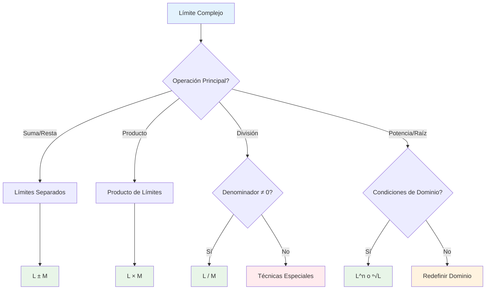
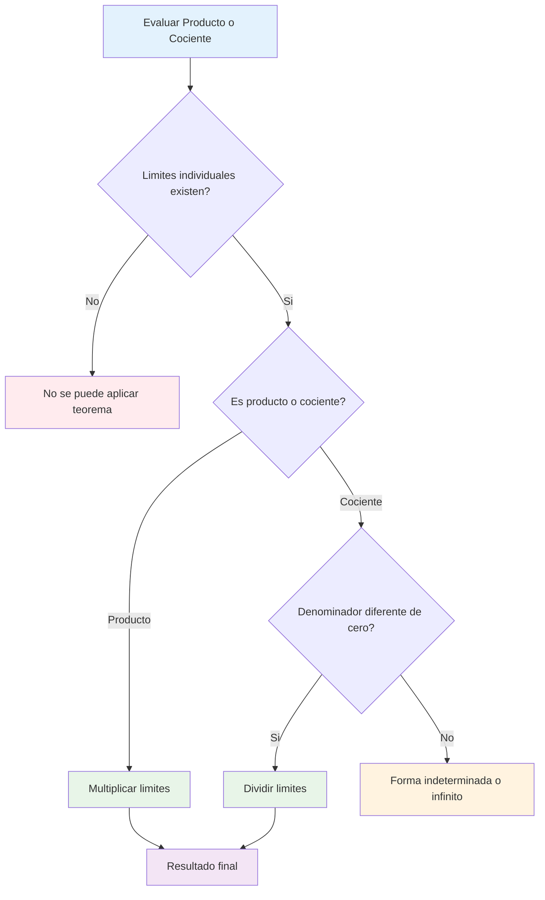
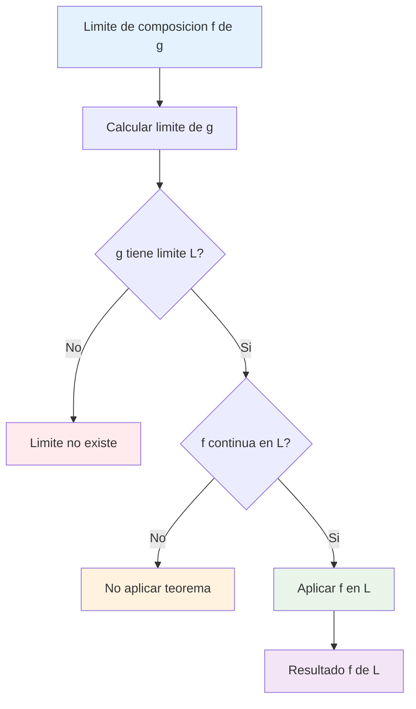
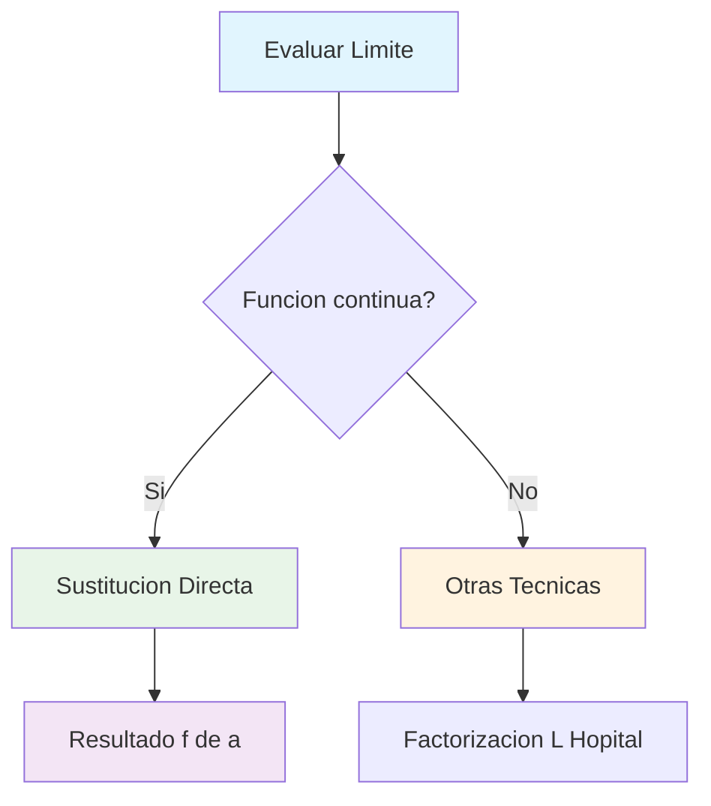
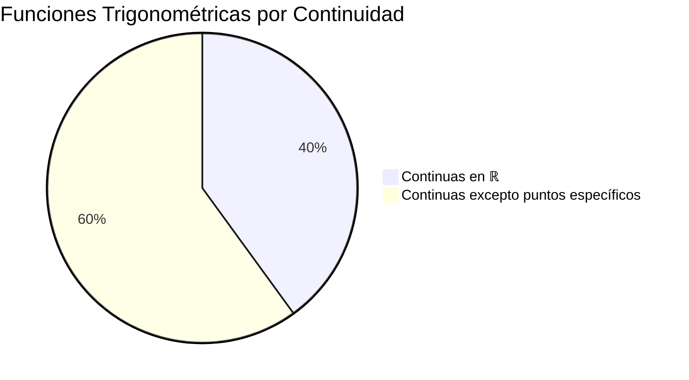
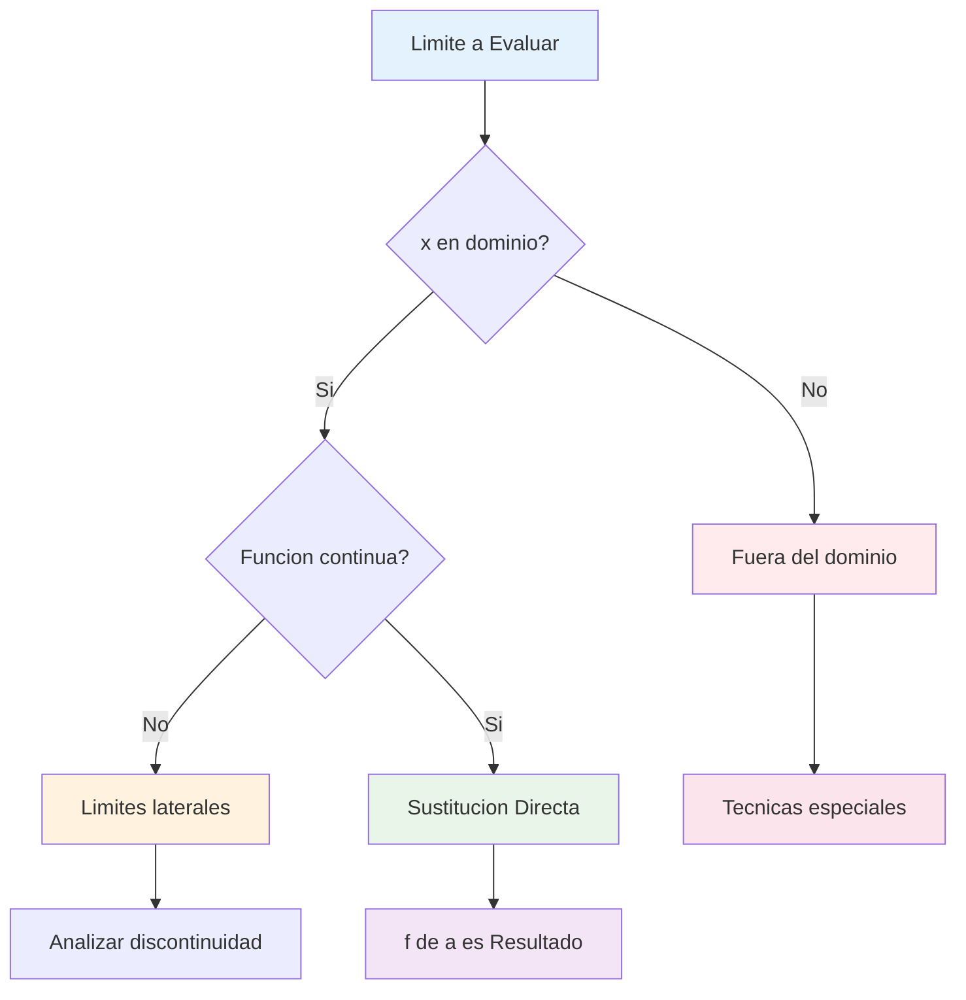

# ⚖️ Propiedades de los Límites

## 🎯 Álgebra de Límites

> [!info]- 💡 Definición Fundamental Las **propiedades de los límites** (también llamadas **álgebra de límites**) son reglas que nos permiten calcular límites de funciones complejas a partir de límites más simples.
> 
> **Condición previa:** Todas las propiedades requieren que los límites individuales **existan y sean finitos**.
> 
> Si $\lim_{x \to a} f(x) = L$ y $\lim_{x \to a} g(x) = M$, donde $L$ y $M$ son números reales, entonces se cumplen las siguientes propiedades fundamentales.

### 📊 Propiedades Básicas

> [!success]- ✅ Propiedad del Límite de una Constante **Regla:** El límite de una constante es la constante misma.
> 
> $$\lim_{x \to a} k = k$$
> 
> donde $k$ es cualquier número real.
> 
> **Ejemplos:**
> 
> - $\lim_{x \to 3} 7 = 7$
> - $\lim_{x \to -2} \pi = \pi$
> - $\lim_{x \to \infty} (-5) = -5$

> [!success]- ✅ Propiedad del Límite de la Variable **Regla:** El límite de la variable independiente es el valor al que tiende.
> 
> $$\lim_{x \to a} x = a$$
> 
> **Ejemplos:**
> 
> - $\lim_{x \to 5} x = 5$
> - $\lim_{x \to -3} x = -3$
> - $\lim_{t \to 0} t = 0$

## 🧮 Propiedades Aritméticas

### ➕ Suma y Resta

> [!example]- 📊 Propiedad de la Suma **Regla:** El límite de una suma es la suma de los límites.
> 
> $$\lim_{x \to a} [f(x) + g(x)] = \lim_{x \to a} f(x) + \lim_{x \to a} g(x) = L + M$$
> 
> **Extensión:** Para múltiples funciones: $$\lim_{x \to a} [f_1(x) + f_2(x) + \cdots + f_n(x)] = \lim_{x \to a} f_1(x) + \lim_{x \to a} f_2(x) + \cdots + \lim_{x \to a} f_n(x)$$
> 
> **Ejemplos:**
> 
> - $\lim_{x \to 2} (x^2 + 3x) = \lim_{x \to 2} x^2 + \lim_{x \to 2} 3x = 4 + 6 = 10$
> - $\lim_{x \to 1} (2x + 5 + \sin x) = 2 + 5 + \sin(1) = 7 + \sin(1)$

> [!example]- 📊 Propiedad de la Resta **Regla:** El límite de una diferencia es la diferencia de los límites.
> 
> $$\lim_{x \to a} [f(x) - g(x)] = \lim_{x \to a} f(x) - \lim_{x \to a} g(x) = L - M$$
> 
> **Ejemplos:**
> 
> - $\lim_{x \to 3} (x^2 - 2x) = \lim_{x \to 3} x^2 - \lim_{x \to 3} 2x = 9 - 6 = 3$
> - $\lim_{x \to 0} (\cos x - 1) = \cos(0) - 1 = 1 - 1 = 0$

### ✖️ Multiplicación

> [!example]- 📊 Propiedad del Producto **Regla:** El límite de un producto es el producto de los límites.
> 
> $$\lim_{x \to a} [f(x) \cdot g(x)] = \lim_{x \to a} f(x) \cdot \lim_{x \to a} g(x) = L \cdot M$$
> 
> **Caso especial - Múltiple constante:** $$\lim_{x \to a} [k \cdot f(x)] = k \cdot \lim_{x \to a} f(x) = k \cdot L$$
> 
> **Ejemplos:**
> 
> - $\lim_{x \to 2} (x \cdot x^2) = \lim_{x \to 2} x \cdot \lim_{x \to 2} x^2 = 2 \cdot 4 = 8$
> - $\lim_{x \to 1} (5 \cdot x^3) = 5 \cdot \lim_{x \to 1} x^3 = 5 \cdot 1 = 5$
> - $\lim_{x \to 0} (x \sin x) = \lim_{x \to 0} x \cdot \lim_{x \to 0} \sin x = 0 \cdot 0 = 0$

### ➗ División

> [!example]- 📊 Propiedad del Cociente **Regla:** El límite de un cociente es el cociente de los límites, **siempre que el denominador no sea cero**.
> 
> $$\lim_{x \to a} \frac{f(x)}{g(x)} = \frac{\lim_{x \to a} f(x)}{\lim_{x \to a} g(x)} = \frac{L}{M}$$
> 
> **Condición crucial:** $M = \lim_{x \to a} g(x) \neq 0$
> 
> **Ejemplos:**
> 
> - $\lim_{x \to 3} \frac{x^2 + 1}{x - 1} = \frac{\lim_{x \to 3} (x^2 + 1)}{\lim_{x \to 3} (x - 1)} = \frac{10}{2} = 5$
> - $\lim_{x \to 1} \frac{2x + 3}{x^2 + 4} = \frac{5}{5} = 1$
> 
> **⚠️ Cuidado:** Si $M = 0$, la propiedad NO aplica y necesitamos otras técnicas.

## 🔢 Propiedades de Potencias y Raíces

### 📈 Potencias

> [!tip]- 🚀 Propiedad de Potencias **Regla:** El límite de una potencia es la potencia del límite.
> 
> $$\lim_{x \to a} [f(x)]^n = \left[\lim_{x \to a} f(x)\right]^n = L^n$$
> 
> donde $n$ es cualquier entero positivo.
> 
> **Casos especiales:**
> 
> - **Cuadrados:** $\lim_{x \to a} [f(x)]^2 = [L]^2$
> - **Cubos:** $\lim_{x \to a} [f(x)]^3 = [L]^3$
> - **Polinomios:** $\lim_{x \to a} x^n = a^n$
> 
> **Ejemplos:**
> 
> - $\lim_{x \to 2} x^4 = 2^4 = 16$
> - $\lim_{x \to 1} (x + 1)^3 = (1 + 1)^3 = 8$
> - $\lim_{x \to 3} (x^2 - 1)^2 = (9 - 1)^2 = 64$

### 🔍 Raíces

> [!tip]- 🌱 Propiedad de Raíces **Regla:** El límite de una raíz es la raíz del límite.
> 
> $$\lim_{x \to a} \sqrt[n]{f(x)} = \sqrt[n]{\lim_{x \to a} f(x)} = \sqrt[n]{L}$$
> 
> **Condiciones:**
> 
> - Si $n$ es par: $L \geq 0$
> - Si $n$ es impar: $L$ puede ser cualquier valor real
> 
> **Casos comunes:**
> 
> - **Raíz cuadrada:** $\lim_{x \to a} \sqrt{f(x)} = \sqrt{L}$ (si $L \geq 0$)
> - **Raíz cúbica:** $\lim_{x \to a} \sqrt[3]{f(x)} = \sqrt[3]{L}$
> 
> **Ejemplos:**
> 
> - $\lim_{x \to 4} \sqrt{x + 5} = \sqrt{4 + 5} = 3$
> - $\lim_{x \to 1} \sqrt[3]{x^3 - 1} = \sqrt[3]{0} = 0$
> - $\lim_{x \to 8} \sqrt[3]{\frac{x}{2}} = \sqrt[3]{4}$

## 📊 Tabla Resumen de Propiedades

> [!note]- 📋 Resumen Completo
> 
> |Operación|Propiedad|Condición|
> |---|---|---|
> |**Constante**|$\lim_{x \to a} k = k$|Ninguna|
> |**Variable**|$\lim_{x \to a} x = a$|Ninguna|
> |**Suma**|$\lim_{x \to a} [f(x) + g(x)] = L + M$|$L, M$ finitos|
> |**Resta**|$\lim_{x \to a} [f(x) - g(x)] = L - M$|$L, M$ finitos|
> |**Producto**|$\lim_{x \to a} [f(x) \cdot g(x)] = L \cdot M$|$L, M$ finitos|
> |**Cociente**|$\lim_{x \to a} \frac{f(x)}{g(x)} = \frac{L}{M}$|$L, M$ finitos, $M \neq 0$|
> |**Potencia**|$\lim_{x \to a} [f(x)]^n = L^n$|$L$ finito|
> |**Raíz par**|$\lim_{x \to a} \sqrt[n]{f(x)} = \sqrt[n]{L}$|$L \geq 0$|
> |**Raíz impar**|$\lim_{x \to a} \sqrt[n]{f(x)} = \sqrt[n]{L}$|$L$ finito|

## 🧠 Técnica de Estudio: Método "SCPR"

> [!tip]- 🎓 Mnemotecnia "SCPR"
> 
> **S** - **S**uma y resta directas **C** - **C**onstantes se mantienen **P** - **P**roducto de límites **R** - **R**azón cuidando el denominador
> 
> **Frase nemotécnica:** _"Siempre Calculo Propiedades Rápidamente"_
> 
> **Proceso de aplicación:**
> 
> 1. 🎯 Identificar la operación principal
> 2. ✅ Verificar que los límites individuales existan
> 3. 🔍 Comprobar condiciones especiales (denominador ≠ 0)
> 4. 🧮 Aplicar la propiedad correspondiente

## 📊 Algoritmo de Aplicación

## ⚠️ Casos Especiales y Limitaciones

### 🚫 Cuando las Propiedades NO Aplican

> [!warning]- 🛑 Limitaciones Importantes
> 
> **1. Límites no existen:**
> 
> - Si $\lim_{x \to a} f(x)$ no existe, las propiedades no aplican
> - Ejemplo: $\lim_{x \to 0} \frac{1}{x}$ no existe
> 
> **2. Límites infinitos:**
> 
> - Las propiedades básicas no aplican directamente
> - Necesitamos reglas especiales para $\pm\infty$
> 
> **3. Formas indeterminadas:**
> 
> - $\frac{0}{0}$, $\frac{\infty}{\infty}$, $0 \cdot \infty$, $\infty - \infty$
> - Requieren técnicas como L'Hôpital
> 
> **4. División por cero:**
> 
> - Si $\lim_{x \to a} g(x) = 0$, no podemos usar la propiedad del cociente directamente

### 🔄 Formas Indeterminadas Comunes

> [!danger]- ⚡ Casos Problemáticos
> 
> |Forma|Ejemplo|Técnica Alternativa|
> |---|---|---|
> |$\frac{0}{0}$|$\lim_{x \to 0} \frac{\sin x}{x}$|L'Hôpital, Emparedado|
> |$\frac{\infty}{\infty}$|$\lim_{x \to \infty} \frac{x^2}{e^x}$|L'Hôpital|
> |$0 \cdot \infty$|$\lim_{x \to 0^+} x \ln x$|Transformación|
> |$\infty - \infty$|$\lim_{x \to \infty} (x - \sqrt{x^2 + 1})$|Racionalización|
> |$1^{\infty}$|$\lim_{x \to \infty} (1 + \frac{1}{x})^x$|Logaritmos|
> |$0^0$, $\infty^0$|$\lim_{x \to 0^+} x^x$|Logaritmos|

## 🌟 Propiedades Avanzadas

### 🔗 Composición de Funciones

> [!note]- 🎭 Límite de Función Compuesta
> 
> **Teorema:** Si $\lim_{x \to a} g(x) = L$ y $f$ es continua en $L$, entonces:
> 
> $$\lim_{x \to a} f(g(x)) = f(\lim_{x \to a} g(x)) = f(L)$$
> 
> **Aplicaciones comunes:**
> 
> - $\lim_{x \to a} \sin(g(x)) = \sin(\lim_{x \to a} g(x))$
> - $\lim_{x \to a} e^{g(x)} = e^{\lim_{x \to a} g(x)}$
> - $\lim_{x \to a} \ln(g(x)) = \ln(\lim_{x \to a} g(x))$ (si $L > 0$)
> 
> **Ejemplos:**
> 
> - $\lim_{x \to 0} \sin(x^2) = \sin(0) = 0$
> - $\lim_{x \to 1} e^{x-1} = e^0 = 1$
> - $\lim_{x \to 2} \ln(x + 1) = \ln(3)$

### 📈 Límites Unilaterales

> [!note]- 🔄 Propiedades para Límites Laterales
> 
> **Todas las propiedades se extienden a límites laterales:**
> 
> - **Por la derecha:** $\lim_{x \to a^+}$
> - **Por la izquierda:** $\lim_{x \to a^-}$
> 
> **Ejemplo:** $$\lim_{x \to 2^+} [f(x) + g(x)] = \lim_{x \to 2^+} f(x) + \lim_{x \to 2^+} g(x)$$
> 
> **Condición de existencia:** Un límite existe si y solo si ambos límites laterales existen y son iguales.

## 💡 Estrategias de Resolución

### 🎯 Método de Descomposición

> [!example]- 🔧 Estrategia Paso a Paso
> 
> **Para evaluar límites complejos:**
> 
> 1. **Identificar la estructura:**
>     - ¿Suma, producto, cociente, composición?
> 2. **Descomponer en partes simples:**
>     - Separar cada operación
> 3. **Evaluar límites individuales:**
>     - Usar sustitución directa cuando sea posible
> 4. **Aplicar propiedades:**
>     - Combinar resultados según las reglas
> 
> **Ejemplo completo:** $$\lim_{x \to 2} \frac{x^3 + 2x^2 - 3x + 1}{x^2 - 1}$$
> 
> **Solución:**
> 
> - Numerador: $\lim_{x \to 2} (x^3 + 2x^2 - 3x + 1) = 8 + 8 - 6 + 1 = 11$
> - Denominador: $\lim_{x \to 2} (x^2 - 1) = 4 - 1 = 3$
> - Resultado: $\frac{11}{3}$

## 📖 Ejercicios de Práctica Progresiva

> [!example]- 💪 Secuencia de Entrenamiento
> 
> **Nivel 1 - Operaciones Básicas:** 🟢
> 
> - $\lim_{x \to 3} (x^2 + 2x - 1)$
> - $\lim_{x \to 1} (4x - 3)$
> - $\lim_{x \to 2} \sqrt{x + 7}$
> 
> **Nivel 2 - Productos y Cocientes:** 🟡
> 
> - $\lim_{x \to 4} \frac{x^2 - 16}{x - 4}$
> - $\lim_{x \to 0} x \cdot \sin(x)$
> - $\lim_{x \to 1} \frac{2x + 3}{x^2 + 5}$
> 
> **Nivel 3 - Funciones Compuestas:** 🟠
> 
> - $\lim_{x \to 0} \sin(x^2 + 2x)$
> - $\lim_{x \to 1} e^{x^2 - 1}$
> - $\lim_{x \to 4} \ln(\sqrt{x})$
> 
> **Nivel 4 - Combinaciones Complejas:** 🔴
> 
> - $\lim_{x \to 2} \frac{\sin(x-2)}{x^2-4}$
> - $\lim_{x \to 0} \frac{e^x - 1}{x}$
> - $\lim_{x \to \infty} \frac{3x^2 + 2x - 1}{x^2 - 5}$

## 🎨 Ejemplos Trabajados Completos

### 📊 Ejemplo Integral: Función Racional

> [!example]- 📝 Problema Resuelto
> 
> **Problema:** Evaluar $\lim_{x \to 3} \frac{2x^3 - x^2 + 4x - 7}{x^2 + 2x - 1}$
> 
> **Solución paso a paso:**
> 
> **Paso 1:** Verificar continuidad en $x = 3$
> 
> - Denominador en $x = 3$: $9 + 6 - 1 = 14 \neq 0$ ✅
> 
> **Paso 2:** Aplicar propiedad del cociente $$\lim_{x \to 3} \frac{2x^3 - x^2 + 4x - 7}{x^2 + 2x - 1} = \frac{\lim_{x \to 3} (2x^3 - x^2 + 4x - 7)}{\lim_{x \to 3} (x^2 + 2x - 1)}$$
> 
> **Paso 3:** Evaluar numerador $$\lim_{x \to 3} (2x^3 - x^2 + 4x - 7) = 2(27) - 9 + 12 - 7 = 54 - 9 + 12 - 7 = 50$$
> 
> **Paso 4:** Evaluar denominador $$\lim_{x \to 3} (x^2 + 2x - 1) = 9 + 6 - 1 = 14$$
> 
> **Paso 5:** Resultado final $$\lim_{x \to 3} \frac{2x^3 - x^2 + 4x - 7}{x^2 + 2x - 1} = \frac{50}{14} = \frac{25}{7}$$

### 🌊 Ejemplo con Funciones Trigonométricas

> [!example]- 🎯 Problema Trigonométrico
> 
> **Problema:** Evaluar $\lim_{x \to \pi/6} (\sin x \cdot \cos x + 2x)$
> 
> **Solución:**
> 
> **Paso 1:** Aplicar propiedad de suma $$\lim_{x \to \pi/6} (\sin x \cdot \cos x + 2x) = \lim_{x \to \pi/6} (\sin x \cdot \cos x) + \lim_{x \to \pi/6} (2x)$$
> 
> **Paso 2:** Evaluar primer término usando producto $$\lim_{x \to \pi/6} (\sin x \cdot \cos x) = \lim_{x \to \pi/6} \sin x \cdot \lim_{x \to \pi/6} \cos x$$ $$= \sin(\pi/6) \cdot \cos(\pi/6) = \frac{1}{2} \cdot \frac{\sqrt{3}}{2} = \frac{\sqrt{3}}{4}$$
> 
> **Paso 3:** Evaluar segundo término $$\lim_{x \to \pi/6} (2x) = 2 \cdot \frac{\pi}{6} = \frac{\pi}{3}$$
> 
> **Paso 4:** Combinar resultados $$\lim_{x \to \pi/6} (\sin x \cdot \cos x + 2x) = \frac{\sqrt{3}}{4} + \frac{\pi}{3}$$

## 🔗 Conexiones con Otros Temas

> [!quote]- 📚 Enlaces a Otras Notas
> 
> **Prerrequisitos:**
> 
> - [[01 - Propiedades y Teoremas de los Límites]] - Casos básicos
> - [[Definición de Límite]] - Fundamento teórico
> - [[Continuidad de Funciones]] - Base para aplicación
> 
> **Temas relacionados:**
> 
> - [[Límites Indeterminados]] - Casos donde las propiedades fallan
> - [[01 - Formas Indeterminadas]] - Técnica para formas indeterminadas
> - [[Teorema del Emparedado]] - Técnica alternativa
> 
> **Aplicaciones:**
> 
> - [[Derivadas]] - Límites en la definición de derivada
> - [[Continuidad]] - Criterio de continuidad
> - [[01 - Límites al Infinito y Sucesiones]] - Comportamiento asintótico
> 
> **Extensiones:**
> 
> - [[01 - Límites al Infinito y Sucesiones]] - Límites discretos
> - [[Límites Multivariables]] - Extensión a varias variables

---

**Tags:** #matemáticas #cálculo #límites #álgebra-límites #propiedades-límites #operaciones-límites #técnicas-límites #continuidad #university #calculus-fundamentals #mathematical-properties

# 📜 Teoremas de Límites

## 🎯 Límite de una suma/diferencia

> [!info] 📐 Teorema de Suma y Diferencia Si $\lim_{x \to a} f(x) = L$ y $\lim_{x \to a} g(x) = M$, entonces:
> 
> **Suma:** $\lim_{x \to a} [f(x) + g(x)] = L + M$
> 
> **Diferencia:** $\lim_{x \to a} [f(x) - g(x)] = L - M$
> 
> 🔑 **Principio:** El límite de una suma es la suma de los límites

### 📊 Propiedades de la Suma/Diferencia

> [!success] ✅ Reglas Fundamentales
> 
> **1. Límite de una constante:** $$\lim_{x \to a} c = c$$
> 
> **2. Límite del múltiplo de una constante:** $$\lim_{x \to a} [c \cdot f(x)] = c \cdot \lim_{x \to a} f(x)$$
> 
> **3. Límite de múltiples funciones:** $$\lim_{x \to a} [f_1(x) + f_2(x) + ... + f_n(x)] = \lim_{x \to a} f_1(x) + \lim_{x \to a} f_2(x) + ... + \lim_{x \to a} f_n(x)$$

|Operación|Notación|Resultado|Condición|
|---|---|---|---|
|Suma|$\lim [f + g]$|$L + M$|Ambos límites existen|
|Diferencia|$\lim [f - g]$|$L - M$|Ambos límites existen|
|Constante por función|$\lim [c \cdot f]$|$c \cdot L$|Límite de f existe|
|Suma múltiple|$\lim [f_1 + f_2 + ... + f_n]$|$L_1 + L_2 + ... + L_n$|Todos los límites existen|

> [!example] 💡 Ejemplos Prácticos
> 
> **Ejemplo 1: Suma simple** $$\lim_{x \to 2} [(x^2 + 3) + (2x - 1)]$$
> 
> **Solución:**
> 
> - $\lim_{x \to 2} (x^2 + 3) = 4 + 3 = 7$
> - $\lim_{x \to 2} (2x - 1) = 4 - 1 = 3$
> - **Resultado:** $7 + 3 = 10$
> 
> **Ejemplo 2: Diferencia con constante** $$\lim_{x \to 1} [3x^2 - 5x + 2]$$
> 
> **Solución:**
> 
> - $\lim_{x \to 1} 3x^2 = 3 \cdot 1 = 3$
> - $\lim_{x \to 1} 5x = 5 \cdot 1 = 5$
> - $\lim_{x \to 1} 2 = 2$
> - **Resultado:** $3 - 5 + 2 = 0$

## 🔢 Límite de un producto/cociente

> [!info] 🎯 Teorema de Producto y Cociente Si $\lim_{x \to a} f(x) = L$ y $\lim_{x \to a} g(x) = M$, entonces:
> 
> **Producto:** $\lim_{x \to a} [f(x) \cdot g(x)] = L \cdot M$
> 
> **Cociente:** $\lim_{x \to a} \frac{f(x)}{g(x)} = \frac{L}{M}$ (si $M ≠ 0$)

### 📈 Casos Especiales del Producto

> [!tip] ⚡ Reglas del Producto
> 
> **1. Potencia natural:** $$\lim_{x \to a} [f(x)]^n = [L]^n$$
> 
> **2. Producto de múltiples funciones:** $$\lim_{x \to a} [f_1 \cdot f_2 \cdot ... \cdot f_n] = L_1 \cdot L_2 \cdot ... \cdot L_n$$
> 
> **3. Raíz n-ésima:** $$\lim_{x \to a} \sqrt[n]{f(x)} = \sqrt[n]{L}$$ (si la raíz está definida)

### 🔄 Casos Especiales del Cociente

> [!warning] ⚠️ Precauciones del Cociente
> 
> **Condición necesaria:** $M ≠ 0$
> 
> **Casos problemáticos:**
> 
> - Si $M = 0$ y $L ≠ 0$ → Límite no existe (∞)
> - Si $M = 0$ y $L = 0$ → Forma indeterminada $\frac{0}{0}$
> - Si $L = ∞$ y $M = ∞$ → Forma indeterminada $\frac{∞}{∞}$

|Situación|$\lim f(x)$|$\lim g(x)$|$\lim \frac{f(x)}{g(x)}$|Observación|
|---|---|---|---|---|
|Normal|$L$|$M ≠ 0$|$\frac{L}{M}$|✅ Aplicar teorema|
|Infinito|$L ≠ 0$|$0$|$±∞$|❌ Límite no existe|
|Indeterminada|$0$|$0$|?|🔧 Usar otras técnicas|
|Indeterminada|$∞$|$∞$|?|🔧 Usar L'Hôpital|

> [!example] 📝 Ejemplos de Producto y Cociente
> 
> **Ejemplo 1: Producto** $$\lim_{x \to 3} [(x + 1)(2x - 1)]$$
> 
> **Solución:**
> 
> - $\lim_{x \to 3} (x + 1) = 4$
> - $\lim_{x \to 3} (2x - 1) = 5$
> - **Resultado:** $4 \cdot 5 = 20$
> 
> **Ejemplo 2: Cociente válido** $$\lim_{x \to 2} \frac{x^2 - 1}{x + 3}$$
> 
> **Solución:**
> 
> - $\lim_{x \to 2} (x^2 - 1) = 3$
> - $\lim_{x \to 2} (x + 3) = 5 ≠ 0$ ✅
> - **Resultado:** $\frac{3}{5}$

## 📊 Límite de una potencia

> [!info] 🚀 Teorema de la Potencia Si $\lim_{x \to a} f(x) = L$ existe, entonces:
> 
> **Potencia entera:** $\lim_{x \to a} [f(x)]^n = L^n$ (para $n \in \mathbb{Z}$)
> 
> **Raíz n-ésima:** $\lim_{x \to a} \sqrt[n]{f(x)} = \sqrt[n]{L}$ (si la raíz está definida)

### 🔢 Tipos de Potencias

> [!success] 📈 Clasificación por Exponente
> 
> **1. Exponente entero positivo:** $$\lim_{x \to a} [f(x)]^n = L^n, \quad n \in \mathbb{N}$$
> 
> **2. Exponente entero negativo:** $$\lim_{x \to a} [f(x)]^{-n} = \frac{1}{L^n}, \quad L ≠ 0$$
> 
> **3. Exponente racional:** $$\lim_{x \to a} [f(x)]^{p/q} = L^{p/q}, \quad \text{si } L^{p/q} \text{ está definida}$$

|Tipo de Potencia|Condiciones|Ejemplo|Resultado|
|---|---|---|---|
|Cuadrado|$L$ cualquier|$\lim_{x \to 2} (x-1)^2$|$(2-1)^2 = 1$|
|Cubo|$L$ cualquier|$\lim_{x \to 3} (x+1)^3$|$(3+1)^3 = 64$|
|Raíz cuadrada|$L \geq 0$|$\lim_{x \to 4} \sqrt{x-3}$|$\sqrt{4-3} = 1$|
|Raíz cúbica|$L$ cualquier|$\lim_{x \to -1} \sqrt[3]{x+9}$|$\sqrt[3]{-1+9} = 2$|
|Potencia negativa|$L ≠ 0$|$\lim_{x \to 1} (x+1)^{-2}$|$(1+1)^{-2} = \frac{1}{4}$|

### ⚠️ Casos Especiales y Restricciones

> [!warning] 🚨 Condiciones Importantes
> 
> **Para raíces pares:** $L \geq 0$ (en números reales) **Para raíces impares:** $L$ puede ser cualquier número real **Para exponentes negativos:** $L ≠ 0$ **Para exponentes fraccionarios:** Verificar dominio y restricciones

> [!example] 🎯 Ejemplos de Potencias
> 
> **Ejemplo 1: Potencia positiva** $$\lim_{x \to 2} (x^2 - 1)^3$$
> 
> **Solución:**
> 
> - $\lim_{x \to 2} (x^2 - 1) = 4 - 1 = 3$
> - **Resultado:** $3^3 = 27$
> 
> **Ejemplo 2: Raíz cuadrada** $$\lim_{x \to 5} \sqrt{2x - 1}$$
> 
> **Solución:**
> 
> - $\lim_{x \to 5} (2x - 1) = 10 - 1 = 9$
> - Verificar: $9 \geq 0$ ✅
> - **Resultado:** $\sqrt{9} = 3$
> 
> **Ejemplo 3: Potencia negativa** $$\lim_{x \to 1} \frac{1}{(x + 2)^2}$$
> 
> **Solución:**
> 
> - $\lim_{x \to 1} (x + 2) = 3 ≠ 0$ ✅
> - **Resultado:** $\frac{1}{3^2} = \frac{1}{9}$

## 🔗 Límite de composición de funciones

> [!info] 🎭 Teorema de Composición Si $\lim_{x \to a} g(x) = L$ y $f$ es continua en $L$, entonces: $$\lim_{x \to a} f(g(x)) = f\left(\lim_{x \to a} g(x)\right) = f(L)$$
> 
> **Condición clave:** $f$ debe ser continua en el punto $L$

### 🔄 Proceso de Evaluación

> [!tip] 📋 Algoritmo para Composiciones
> 
> **Paso 1:** Calcular $\lim_{x \to a} g(x) = L$
> 
> **Paso 2:** Verificar que $f$ es continua en $L$
> 
> **Paso 3:** Aplicar $\lim_{x \to a} f(g(x)) = f(L)$

### 📊 Tipos Comunes de Composiciones

> [!success] 🎯 Ejemplos Típicos
> 
> **1. Función dentro de trigonométrica:** $$\lim_{x \to a} \sin(g(x)) = \sin\left(\lim_{x \to a} g(x)\right)$$
> 
> **2. Función dentro de exponencial:** $$\lim_{x \to a} e^{g(x)} = e^{\lim_{x \to a} g(x)}$$
> 
> **3. Función dentro de logaritmo:** $$\lim_{x \to a} \ln(g(x)) = \ln\left(\lim_{x \to a} g(x)\right)$$ (si $\lim g(x) > 0$)

|Función Externa $f$|Condición en $L$|Ejemplo|Evaluación|
|---|---|---|---|
|$\sin(u)$|Siempre continua|$\lim_{x \to 0} \sin(x^2)$|$\sin(0) = 0$|
|$e^u$|Siempre continua|$\lim_{x \to 1} e^{2x-2}$|$e^{0} = 1$|
|$\ln(u)$|$L > 0$|$\lim_{x \to 2} \ln(x^2)$|$\ln(4)$|
|$\sqrt{u}$|$L \geq 0$|$\lim_{x \to 3} \sqrt{x+1}$|$\sqrt{4} = 2$|
|$\frac{1}{u}$|$L ≠ 0$|$\lim_{x \to 1} \frac{1}{x+2}$|$\frac{1}{3}$|

> [!example] 🎨 Ejemplos de Composición
> 
> **Ejemplo 1: Trigonométrica compuesta** $$\lim_{x \to \pi/4} \cos(2x)$$
> 
> **Solución:**
> 
> - Sea $g(x) = 2x$, entonces $\lim_{x \to \pi/4} g(x) = \pi/2$
> - $f(u) = \cos(u)$ es continua en $\pi/2$
> - **Resultado:** $\cos(\pi/2) = 0$
> 
> **Ejemplo 2: Exponencial compuesta** $$\lim_{x \to 0} e^{x^2 + 2x}$$
> 
> **Solución:**
> 
> - Sea $g(x) = x^2 + 2x$, entonces $\lim_{x \to 0} g(x) = 0$
> - $f(u) = e^u$ es continua en $0$
> - **Resultado:** $e^0 = 1$
> 
> **Ejemplo 3: Logaritmo compuesto** $$\lim_{x \to 2} \ln(x^2 - 3)$$
> 
> **Solución:**
> 
> - Sea $g(x) = x^2 - 3$, entonces $\lim_{x \to 2} g(x) = 1$
> - Verificar: $1 > 0$ ✅
> - $f(u) = \ln(u)$ es continua en $1$
> - **Resultado:** $\ln(1) = 0$

## 🧠 Técnica de Estudio: Mnemotecnia "SPCP"

> [!tip] 🎓 Método "SPCP" para Teoremas de Límites
> 
> **S** - **S**uma: límite de suma = suma de límites **P** - **P**roducto: límite de producto = producto de límites  
> **C** - **C**ociente: límite de cociente = cociente de límites (denominador ≠ 0) **P** - **P**otencia: límite de potencia = potencia del límite
> 
> **Frase nemotécnica:** _"Suma, Producto, Cociente, Potencia - Siempre Preservan Cálculos Precisos"_
> 
> **Regla adicional para composición:** _"Componer Funciones: Límite interno + Continuidad externa"_

## 📊 Tabla Resumen de Teoremas

> [!info] 📋 Referencia Rápida
> 
> |Operación|Teorema|Condiciones|Ejemplo|
> |---|---|---|---|
> |**Suma**|$\lim [f ± g] = \lim f ± \lim g$|Ambos límites existen|$\lim (x+1) + \lim (2x) = 3+4 = 7$|
> |**Producto**|$\lim [f \cdot g] = \lim f \cdot \lim g$|Ambos límites existen|$\lim (x) \cdot \lim (x+1) = 2 \cdot 3 = 6$|
> |**Cociente**|$\lim [f/g] = \frac{\lim f}{\lim g}$|Ambos existen, $\lim g ≠ 0$|$\frac{\lim (x+1)}{\lim (x-1)} = \frac{3}{1} = 3$|
> |**Potencia**|$\lim [f^n] = (\lim f)^n$|Límite existe, potencia definida|$\lim (x+1)^2 = 3^2 = 9$|
> |**Composición**|$\lim f(g(x)) = f(\lim g(x))$|$\lim g$ existe, $f$ continua|$\lim \sin(x) = \sin(0) = 0$|

## 📚 Referencias y Conexiones

> [!quote] 🔗 Enlaces a Otras Notas
> 
> - [[01 - Propiedades y Teoremas de los Límites]] - Aplicación práctica de los teoremas
> - [[Continuidad de Funciones]] - Requisito para composición
> - [[Límites Indeterminados]] - Casos donde los teoremas no aplican directamente
> - [[Álgebra de Funciones]] - Operaciones básicas entre funciones
> - [[Funciones Compuestas]] - Teoría de composición de funciones

## 📖 Notas Recomendadas para Estudio Complementario

> [!info] 📝 Secuencia de Aprendizaje Óptima
> 
> **Fundamentos:**
> 
> 1. **[[01 - Concepto y Definición Formal del Límite]]** - Base conceptual
> 2. **[[Propiedades de los Números Reales]]** - Operaciones algebraicas
> 
> **Aplicaciones:** 3. **[[Técnicas de Factorización]]** - Para casos indeterminados 4. **[[01 - Formas Indeterminadas]]** - Alternativa para formas indeterminadas
> 
> **Extensiones:** 5. **[[01 - Límites al Infinito y Sucesiones]]** - Comportamiento asintótico 6. **[[01 - Derivada y Definición Formal]]** - Aplicación práctica de límites

## 🎯 Ejercicios Progresivos

> [!example] 💪 Práctica Estructurada
> 
> **Nivel 1 - Operaciones Básicas:** 🟢
> 
> - $\lim_{x \to 2} [(x^2 + 1) + (3x - 1)]$
> - $\lim_{x \to 1} [(2x + 3)(x - 1)]$
> - $\lim_{x \to 3} \frac{x^2 - 1}{x + 1}$
> 
> **Nivel 2 - Potencias y Raíces:** 🟡
> 
> - $\lim_{x \to 4} (x - 3)^3$
> - $\lim_{x \to 8} \sqrt[3]{x + 1}$
> - $\lim_{x \to 2} \frac{1}{(x + 1)^2}$
> 
> **Nivel 3 - Composiciones:** 🟠
> 
> - $\lim_{x \to 0} \sin(x^2 + x)$
> - $\lim_{x \to 1} e^{2x - 2}$
> - $\lim_{x \to 3} \ln(x^2 - 8)$
> 
> **Nivel 4 - Combinados:** 🔴
> 
> - $\lim_{x \to 2} \frac{(x+1)^2 \cdot \sin(x-2)}{e^{x-2} - 1}$
> - $\lim_{x \to 0} \sqrt{1 + x^2} \cdot \cos(2x)$

## 🔍 Casos Especiales y Advertencias

> [!warning] ⚠️ Situaciones Problemáticas Comunes
> 
> **1. División por cero:**
> 
> - Verificar siempre que el denominador no sea cero
> - Si es cero, usar técnicas especiales
> 
> **2. Raíces de números negativos:**
> 
> - Para raíces pares: verificar que el argumento sea ≥ 0
> - Para raíces impares: sin restricciones
> 
> **3. Logaritmos de números no positivos:**
> 
> - Verificar que el argumento sea > 0
> - Si no, el límite puede no existir
> 
> **4. Composiciones discontinuas:**
> 
> - La función externa debe ser continua en el límite interno
> - Si no, no se puede aplicar el teorema

---

**Tags:** #matemáticas #cálculo #límites #teoremas #álgebra-límites #suma #producto #cociente #potencia #composición #técnicas-estudio #university #calculus-theorems #análisis-matemático

# 📈 Límites Básicos y Directos

## 🎯 Límites por Sustitución Directa

> [!info] 💡 Definición Fundamental Los **límites por sustitución directa** se pueden calcular cuando la función es **continua** en el punto de aproximación. En estos casos: $$\lim_{x \to a} f(x) = f(a)$$
> 
> Simplemente **sustituimos** el valor de $a$ directamente en la función.

### 📊 Funciones Continuas

> [!success] ✅ Características de Continuidad Una función $f(x)$ es **continua** en $x = a$ si:
> 
> 1. $f(a)$ está definida
> 2. $\lim_{x \to a} f(x)$ existe
> 3. $\lim_{x \to a} f(x) = f(a)$
> 
> **Condición clave:** Si la función es continua → Aplicamos sustitución directa

### 🔢 Polinomios y Funciones Racionales

> [!example] 📝 Polinomios Los **polinomios** son continuos en todos los números reales: $$P(x) = a_nx^n + a_{n-1}x^{n-1} + ... + a_1x + a_0$$
> 
> **Ejemplo:** $$\lim_{x \to 2} (3x^3 - 2x^2 + x - 5)$$
> 
> **Solución:** $P(2) = 3(8) - 2(4) + 2 - 5 = 24 - 8 + 2 - 5 = 13$

> [!example] 🔄 Funciones Racionales Para funciones racionales $f(x) = \frac{P(x)}{Q(x)}$:
> 
> - **Continuas** cuando $Q(a) ≠ 0$
> - **Discontinuas** cuando $Q(a) = 0$
> 
> **Ejemplo:** $$\lim_{x \to 3} \frac{x^2 + 2x - 1}{x - 1}$$
> 
> **Verificación:** $Q(3) = 3 - 1 = 2 ≠ 0$ ✅ **Solución:** $\frac{9 + 6 - 1}{2} = \frac{14}{2} = 7$

|Tipo de Función|Dominio de Continuidad|Ejemplo|Límite en x = 1|
|---|---|---|---|
|Polinomial|$\mathbb{R}$ (todos los reales)|$x^2 + 3x - 2$|$1 + 3 - 2 = 2$|
|Racional|$\mathbb{R}$ excepto donde denominador = 0|$\frac{x+2}{x-3}$|$\frac{3}{-2} = -\frac{3}{2}$|

### 📐 Funciones Trigonométricas

> [!tip] 🌊 Continuidad Trigonométrica Las funciones trigonométricas básicas tienen dominios específicos de continuidad:

|Función|Dominio de Continuidad|Puntos de Discontinuidad|
|---|---|---|
|$\sin(x)$|$\mathbb{R}$|Ninguno|
|$\cos(x)$|$\mathbb{R}$|Ninguno|
|$\tan(x)$|$\mathbb{R} - {\frac{\pi}{2} + n\pi}$|$x = \frac{\pi}{2} + n\pi$|
|$\cot(x)$|$\mathbb{R} - {n\pi}$|$x = n\pi$|

> [!example] 📊 Ejemplos Trigonométricos **Ejemplo 1:** $\lim_{x \to \pi/6} \sin(x) = \sin(\pi/6) = \frac{1}{2}$
> 
> **Ejemplo 2:** $\lim_{x \to \pi/4} \cos(x) = \cos(\pi/4) = \frac{\sqrt{2}}{2}$
> 
> **Ejemplo 3:** $\lim_{x \to \pi/3} \tan(x) = \tan(\pi/3) = \sqrt{3}$

### 📈 Funciones Exponenciales y Logarítmicas

> [!success] 🚀 Exponenciales Las funciones exponenciales $f(x) = a^x$ donde $a > 0, a ≠ 1$:
> 
> - **Continuas** en todos los números reales
> - **Dominio:** $\mathbb{R}$
> - **Rango:** $(0, +∞)$

> [!success] 📊 Logarítmicas  
> Las funciones logarítmicas $f(x) = \log_a(x)$ donde $a > 0, a ≠ 1$:
> 
> - **Continuas** para $x > 0$
> - **Dominio:** $(0, +∞)$
> - **Rango:** $\mathbb{R}$

|Función|Ejemplo de Límite|Sustitución|Resultado|
|---|---|---|---|
|Exponencial|$\lim_{x \to 2} e^x$|$e^2$|$≈ 7.39$|
|Exponencial|$\lim_{x \to 0} 2^x$|$2^0$|$1$|
|Logarítmica|$\lim_{x \to 1} \ln(x)$|$\ln(1)$|$0$|
|Logarítmica|$\lim_{x \to e} \ln(x)$|$\ln(e)$|$1$|

> [!warning] ⚠️ Casos Problemáticos **NO usar sustitución directa cuando:**
> 
> - La función no está definida en el punto
> - Resulta en formas indeterminadas: $\frac{0}{0}$, $\frac{∞}{∞}$, $0 \cdot ∞$
> - Hay discontinuidades en el punto de evaluación
> 
> **En estos casos:** Usar factorización, racionalización, L'Hôpital, etc.

## 🧠 Técnica de Estudio: Mnemotecnia "CESD"

> [!tip] 🎓 Método "CESD" para Límites Directos
> 
> **C** - **C**ontinuidad verificada **E** - **E**valuación posible  
> **S** - **S**ustitución directa **D** - **D**irecto al resultado
> 
> **Frase nemotécnica:** _"Cuando Es Seguro, Directamente"_
> 
> **Proceso:**
> 
> 1. ✅ Verificar continuidad en el punto
> 2. 🎯 Sustituir el valor directamente
> 3. 📊 Obtener el resultado

## 📊 Algoritmo de Decisión

## 📚 Referencias y Conexiones

> [!quote] 🔗 Enlaces a Otras Notas
> 
> - [[Continuidad de Funciones]] - Fundamento teórico para sustitución directa
> - [[Límites Indeterminados]] - Casos donde NO aplicar sustitución
> - [[Dominio y Rango]] - Verificación previa a la evaluación
> - [[Funciones Elementales]] - Catálogo de funciones continuas
> - [[Gráficas de Funciones]] - Interpretación visual de continuidad

## 📖 Notas Recomendadas para Estudio Complementario

> [!info] 📝 Ruta de Aprendizaje Sugerida
> 
> **Prerrequisitos:**
> 
> 1. **[[Definición de Función]]** - Conceptos básicos
> 2. **[[Definición Informal de Límite]]** - Intuición geométrica
> 
> **Temas Paralelos:** 3. **[[Álgebra de Límites]]** - Operaciones con límites 4. **[[03 - Límites en Gráficas]]** - Visualización de límites
> 
> **Siguientes Pasos:** 5. **[[02 - Límites Laterales]]** - Extensión del concepto 6. **[[Formas Indeterminadas]]** - Casos complejos

## 🎯 Ejercicios de Práctica Progresiva

> [!example] 💪 Secuencia de Entrenamiento
> 
> **Nivel 1 - Funciones Básicas:** 🟢
> 
> - $\lim_{x \to 2} (x^2 + 3x - 1)$
> - $\lim_{x \to -1} (2x^3 - x + 4)$
> 
> **Nivel 2 - Funciones Racionales:** 🟡
> 
> - $\lim_{x \to 3} \frac{x^2 - 1}{x + 2}$
> - $\lim_{x \to 0} \frac{2x + 1}{x^2 + 4}$
> 
> **Nivel 3 - Trigonométricas:** 🟠
> 
> - $\lim_{x \to \pi/2} \cos(x)$
> - $\lim_{x \to \pi/6} (2\sin(x) + 1)$
> 
> **Nivel 4 - Exponenciales:** 🔴
> 
> - $\lim_{x \to 1} e^{2x-1}$
> - $\lim_{x \to 2} \ln(x^2 - 3)$

---

**Tags:** #matemáticas #cálculo #límites #continuidad #sustitución-directa #funciones-continuas #polinomios #trigonométricas #exponenciales #logarítmicas #técnicas-estudio #university #calculus-fundamentals