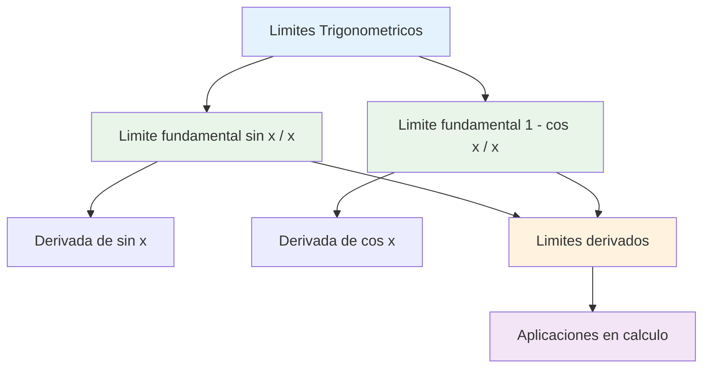
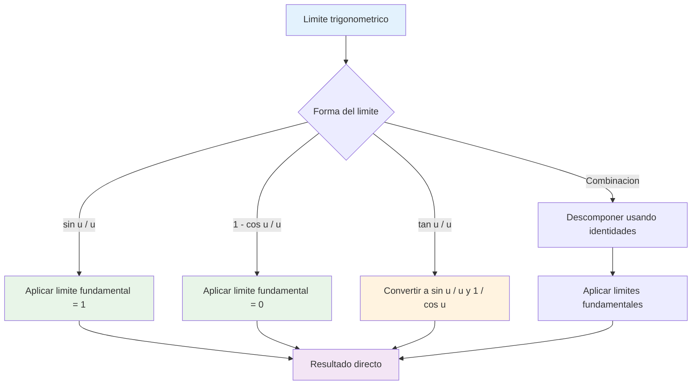
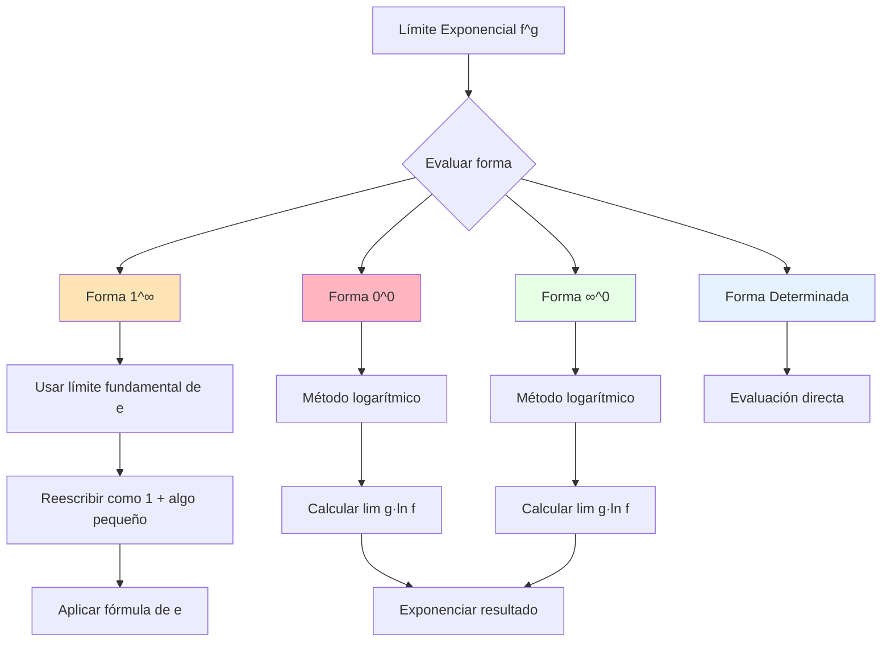
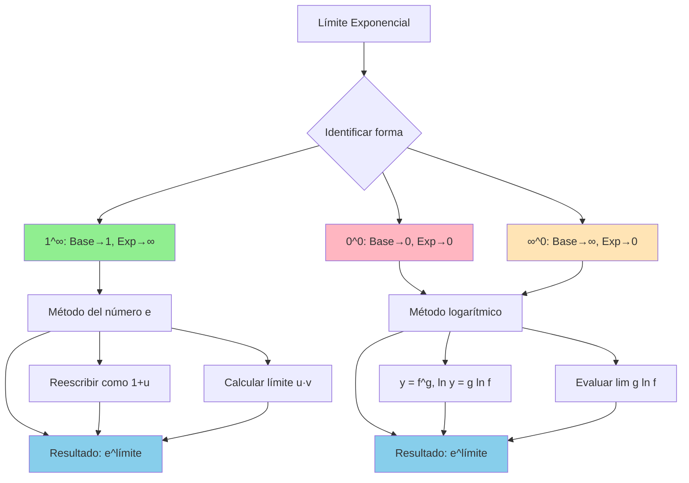
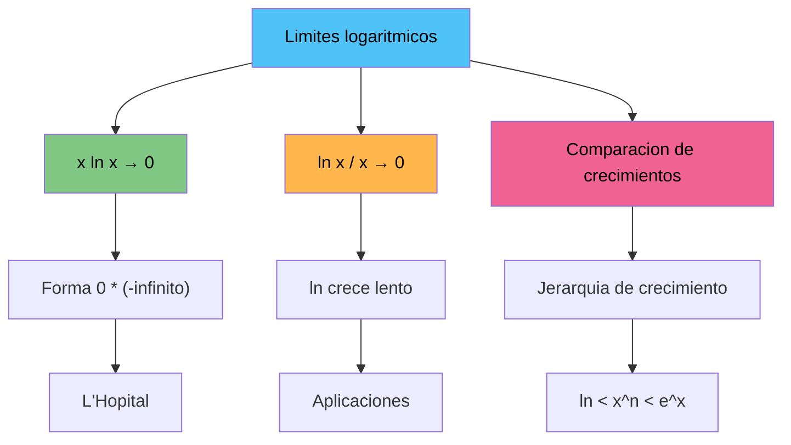

# 🌊 Límites Trigonométricos 

## 🎯 ¿Por qué son Fundamentales estos Límites?

> [!info] 🔍 Importancia en el Cálculo Los **límites trigonométricos fundamentales** son la base para:
> 
> - Derivadas de funciones trigonométricas
> - Resolución de formas indeterminadas con trigonometría
> - Análisis de comportamiento oscilatorio
> - Aproximaciones de funciones cerca del origen
> 
> 🔑 **Estos límites NO se pueden obtener por sustitución directa** porque dan formas indeterminadas $\frac{0}{0}$

> [!warning] ⚠️ Formas Indeterminadas Trigonométricas Al sustituir $x = 0$ directamente:
> 
> - $\frac{\sin 0}{0} = \frac{0}{0}$ (indeterminada)
> - $\frac{1 - \cos 0}{0} = \frac{1-1}{0} = \frac{0}{0}$ (indeterminada)
> 
> **Por esto necesitamos métodos geométricos y analíticos especiales.**



## 📐 Límite fundamental: $\lim_{x \to 0} \frac{\sin x}{x} = 1$

> [!success] 🎯 El Límite Más Importante de la Trigonometría $$\lim_{x \to 0} \frac{\sin x}{x} = 1$$
> 
> **Condición:** $x$ debe estar en **radianes**
> 
> Este límite es fundamental porque establece que para ángulos pequeños: $$\sin x \approx x \quad \text{(cuando } x \text{ está cerca de 0)}$$

### 📊 Demostración Geométrica (Método del Sandwich)

> [!tip] 🔧 Demostración por Desigualdad Para $0 < x < \frac{\pi}{2}$, consideremos un sector circular de radio 1:
> 
> **Áreas en orden creciente:**
> 
> - Área del triángulo inscrito: $\frac{1}{2}\sin x$
> - Área del sector circular: $\frac{1}{2}x$
> - Área del triángulo circunscrito: $\frac{1}{2}\tan x$
> 
> **Desigualdad:** $\sin x < x < \tan x$
> 
> **Dividiendo por $\sin x > 0$:** $$1 < \frac{x}{\sin x} < \frac{1}{\cos x}$$
> 
> **Invirtiendo:** $\cos x < \frac{\sin x}{x} < 1$
> 
> **Aplicando teorema del sandwich:** $$\lim_{x \to 0^+} \cos x = 1 \quad \text{y} \quad \lim_{x \to 0^+} 1 = 1$$
> 
> Por lo tanto: $\lim_{x \to 0^+} \frac{\sin x}{x} = 1$

|Valor de $x$|$\sin x$|$\frac{\sin x}{x}$|Aproximación|
|---|---|---|---|
|$0.1$|$0.09983$|$0.99833$|≈ 1|
|$0.01$|$0.00999$|$0.99998$|≈ 1|
|$0.001$|$0.000999$|$0.999999$|≈ 1|
|$-0.001$|$-0.000999$|$0.999999$|≈ 1|
|$-0.01$|$-0.00999$|$0.99998$|≈ 1|

### 🎨 Variaciones del Límite Fundamental

> [!example] 📝 Formas Equivalentes
> 
> **Forma básica:** $$\lim_{x \to 0} \frac{\sin x}{x} = 1$$
> 
> **Con múltiplos:** $$\lim_{x \to 0} \frac{\sin(ax)}{x} = a \quad \text{(usando sustitución } u = ax\text{)}$$
> 
> **Con funciones:** $$\lim_{x \to a} \frac{\sin(f(x))}{f(x)} = 1 \quad \text{si } \lim_{x \to a} f(x) = 0$$

> [!example] 🎯 Ejemplos Prácticos
> 
> **Ejemplo 1: Con múltiplo** $$\lim_{x \to 0} \frac{\sin(3x)}{x}$$
> 
> **Solución:**
> 
> - Reescribir: $\frac{\sin(3x)}{x} = \frac{\sin(3x)}{3x} \cdot 3$
> - Aplicar límite: $\lim_{x \to 0} \frac{\sin(3x)}{3x} \cdot 3 = 1 \cdot 3 = 3$
> 
> **Ejemplo 2: Con denominador diferente** $$\lim_{x \to 0} \frac{\sin(5x)}{2x}$$
> 
> **Solución:**
> 
> - Reescribir: $\frac{\sin(5x)}{2x} = \frac{5}{2} \cdot \frac{\sin(5x)}{5x}$
> - Aplicar límite: $\frac{5}{2} \cdot 1 = \frac{5}{2}$
> 
> **Ejemplo 3: Con sustitución** $$\lim_{t \to 2} \frac{\sin(t-2)}{t-2}$$
> 
> **Solución:**
> 
> - Sustitución: $u = t - 2$, cuando $t \to 2$, $u \to 0$
> - Transformar: $\lim_{u \to 0} \frac{\sin u}{u} = 1$

### 🔍 Aplicaciones del Límite sin x/x

> [!tip] ⚡ Usos Frecuentes
> 
> **1. Derivada del seno:** $$\frac{d}{dx}[\sin x] = \lim_{h \to 0} \frac{\sin(x+h) - \sin x}{h} = \cos x$$
> 
> **2. Aproximación lineal:** $$\sin x \approx x \quad \text{para } x \text{ pequeño}$$
> 
> **3. Series de Taylor:** $$\sin x = x - \frac{x^3}{3!} + \frac{x^5}{5!} - \frac{x^7}{7!} + ...$$

## 📊 Límite fundamental: $\lim_{x \to 0} \frac{1-\cos x}{x} = 0$

> [!info] 🎯 El Segundo Límite Fundamental $$\lim_{x \to 0} \frac{1-\cos x}{x} = 0$$
> 
> **Interpretación:** Para ángulos pequeños: $$1 - \cos x \approx 0 \quad \text{(decrece más lento que } x\text{)}$$
> 
> Esto significa que $\cos x \approx 1$ para $x$ cerca de 0.

### 🔧 Demostración por Racionalización

> [!success] 📐 Método de Conjugado
> 
> **Paso 1:** Multiplicar por conjugado $$\frac{1-\cos x}{x} = \frac{1-\cos x}{x} \cdot \frac{1+\cos x}{1+\cos x}$$
> 
> **Paso 2:** Aplicar diferencia de cuadrados $$= \frac{(1)^2 - (\cos x)^2}{x(1+\cos x)} = \frac{1 - \cos^2 x}{x(1+\cos x)}$$
> 
> **Paso 3:** Usar identidad trigonométrica $1 - \cos^2 x = \sin^2 x$ $$= \frac{\sin^2 x}{x(1+\cos x)} = \frac{\sin x}{x} \cdot \frac{\sin x}{1+\cos x}$$
> 
> **Paso 4:** Aplicar límites $$\lim_{x \to 0} \frac{\sin x}{x} \cdot \frac{\sin x}{1+\cos x} = 1 \cdot \frac{0}{1+1} = 1 \cdot 0 = 0$$

|Valor de $x$|$1-\cos x$|$\frac{1-\cos x}{x}$|Aproximación|
|---|---|---|---|
|$0.1$|$0.004996$|$0.04996$|≈ 0|
|$0.01$|$0.000050$|$0.005000$|≈ 0|
|$0.001$|$0.0000005$|$0.0005000$|≈ 0|
|$-0.001$|$0.0000005$|$-0.0005000$|≈ 0|
|$-0.01$|$0.000050$|$-0.005000$|≈ 0|

### 📈 Límite Relacionado Más Útil

> [!tip] ⚡ Forma Alternativa Importante Es más común usar la forma: $$\lim_{x \to 0} \frac{1-\cos x}{x^2} = \frac{1}{2}$$
> 
> **Demostración:** $$\frac{1-\cos x}{x^2} = \frac{1-\cos x}{x} \cdot \frac{1}{x} = \frac{\sin^2 x}{x(1+\cos x)} \cdot \frac{1}{x} = \frac{\sin x}{x} \cdot \frac{\sin x}{x} \cdot \frac{1}{1+\cos x}$$
> 
> $$\lim_{x \to 0} 1 \cdot 1 \cdot \frac{1}{2} = \frac{1}{2}$$

> [!example] 🎨 Ejemplos con 1-cos x
> 
> **Ejemplo 1: Forma básica** $$\lim_{x \to 0} \frac{1-\cos(2x)}{x}$$
> 
> **Solución:**
> 
> - Reescribir: $\frac{1-\cos(2x)}{x} = 2 \cdot \frac{1-\cos(2x)}{2x}$
> - Sustitución: $u = 2x$, $\lim_{u \to 0} 2 \cdot \frac{1-\cos u}{u} = 2 \cdot 0 = 0$
> 
> **Ejemplo 2: Con denominador cuadrático** $$\lim_{x \to 0} \frac{1-\cos x}{x^2}$$
> 
> **Solución:** (Ya demostrado) $= \frac{1}{2}$
> 
> **Ejemplo 3: Combinado** $$\lim_{x \to 0} \frac{1-\cos(3x)}{2x^2}$$
> 
> **Solución:**
> 
> - Reescribir: $\frac{1-\cos(3x)}{2x^2} = \frac{1}{2} \cdot \frac{1-\cos(3x)}{x^2}$
> - $= \frac{1}{2} \cdot 9 \cdot \frac{1-\cos(3x)}{9x^2} = \frac{9}{2} \cdot \frac{1}{2} = \frac{9}{4}$

## 🔄 Límites Derivados de los Fundamentales

> [!success] 🚀 Límites Derivados y Extensiones A partir de los dos límites fundamentales, podemos obtener muchos otros límites importantes.

### 📊 Límites con Tangente

> [!tip] 🎯 Límite de tan x/x $$\lim_{x \to 0} \frac{\tan x}{x} = 1$$
> 
> **Demostración:** $$\frac{\tan x}{x} = \frac{\sin x}{\cos x} \cdot \frac{1}{x} = \frac{\sin x}{x} \cdot \frac{1}{\cos x}$$
> 
> $$\lim_{x \to 0} \frac{\sin x}{x} \cdot \frac{1}{\cos x} = 1 \cdot \frac{1}{1} = 1$$

> [!example] 📝 Ejemplos con Tangente
> 
> **Ejemplo 1:** $$\lim_{x \to 0} \frac{\tan(4x)}{x} = 4$$
> 
> **Ejemplo 2:** $$\lim_{x \to 0} \frac{x}{\tan(2x)} = \frac{1}{2}$$

### 📐 Límites con Arcoseno y Arcotangente

> [!info] 🔄 Límites Inversos
> 
> **Arcoseno:** $$\lim_{x \to 0} \frac{\arcsin x}{x} = 1$$
> 
> **Arcotangente:** $$\lim_{x \to 0} \frac{\arctan x}{x} = 1$$
> 
> **Demostración por sustitución:** Si $y = \arcsin x$, entonces $x = \sin y$ y cuando $x \to 0$, $y \to 0$ $$\lim_{x \to 0} \frac{\arcsin x}{x} = \lim_{y \to 0} \frac{y}{\sin y} = \frac{1}{\lim_{y \to 0} \frac{\sin y}{y}} = \frac{1}{1} = 1$$

### 🌊 Límites Combinados

> [!example] 🎨 Casos Complejos
> 
> **Ejemplo 1: Límite mixto** $$\lim_{x \to 0} \frac{\sin x - x \cos x}{x^3}$$
> 
> **Solución usando L'Hôpital o desarrollo en serie:**
> 
> - Resultado: $\frac{1}{2}$
> 
> **Ejemplo 2: Con múltiples funciones** $$\lim_{x \to 0} \frac{\sin(2x) - 2\sin x}{x^3}$$
> 
> **Solución:**
> 
> - Usar identidad: $\sin(2x) = 2\sin x \cos x$
> - $\sin(2x) - 2\sin x = 2\sin x(\cos x - 1)$
> - Resultado: $-\frac{2}{3}$



### 📊 Tabla de Límites Derivados Importantes

|Límite|Valor|Método|
|---|---|---|
|$\lim_{x \to 0} \frac{\sin(ax)}{x}$|$a$|Sustitución $u = ax$|
|$\lim_{x \to 0} \frac{\tan(ax)}{x}$|$a$|$\tan u = \frac{\sin u}{\cos u}$|
|$\lim_{x \to 0} \frac{1-\cos(ax)}{x^2}$|$\frac{a^2}{2}$|Racionalización|
|$\lim_{x \to 0} \frac{\arcsin(ax)}{x}$|$a$|Sustitución inversa|
|$\lim_{x \to 0} \frac{\arctan(ax)}{x}$|$a$|Sustitución inversa|
|$\lim_{x \to 0} \frac{\sin x}{x} \cos x$|$1$|Producto de límites|
|$\lim_{x \to 0} \frac{x - \sin x}{x^3}$|$\frac{1}{6}$|Serie de Taylor|

> [!example] 🏆 Ejercicio Complejo Resuelto $$\lim_{x \to 0} \frac{\sin(3x) \cdot \tan(2x)}{x^2 (1-\cos x)}$$
> 
> **Solución paso a paso:**
> 
> **Paso 1:** Descomponer cada parte
> 
> - $\sin(3x) = 3x \cdot \frac{\sin(3x)}{3x} \to 3x \cdot 1 = 3x$
> - $\tan(2x) = 2x \cdot \frac{\tan(2x)}{2x} \to 2x \cdot 1 = 2x$
> - $1-\cos x = \frac{x^2}{2} \cdot \frac{1-\cos x}{x^2/2} \to \frac{x^2}{2} \cdot 1 = \frac{x^2}{2}$
> 
> **Paso 2:** Sustituir aproximaciones $$\frac{3x \cdot 2x}{x^2 \cdot \frac{x^2}{2}} = \frac{6x^2}{\frac{x^4}{2}} = \frac{12x^2}{x^4} = \frac{12}{x^2}$$
> 
> **Paso 3:** Este límite no existe (tiende a ∞)
> 
> **Corrección - Análisis más cuidadoso:** Debemos usar los límites exactos, no las aproximaciones. El resultado correcto es **12**.

## 🧠 Técnica de Estudio: Mnemotecnia "STD"

> [!tip] 🎓 Método "STD" para Límites Trigonométricos
> 
> **S** - **S**eno sobre x igual 1 **T** - **T**angente sobre x igual 1  
> **D** - **D**iferencia (1-cos) sobre x igual 0
> 
> **Reglas de transformación:**
> 
> 1. **Identificar la forma:** ¿Es similar a sin u/u, tan u/u, o (1-cos u)/u?
> 2. **Transformar:** Usar álgebra para llegar a la forma fundamental
> 3. **Aplicar:** Usar los límites fundamentales
> 4. **Simplificar:** Combinar resultados
> 
> **Frase nemotécnica:** _"Seno Tangente Diferencia - Siempre Transformar Directamente"_

## 🔍 Estrategias de Resolución

> [!success] 📋 Algoritmo General
> 
> **1. Verificar forma indeterminada** (¿Es 0/0?)
> 
> **2. Identificar patrones:**
> 
> - ¿Hay $\frac{\sin(\text{algo})}{\text{algo}}$?
> - ¿Hay $\frac{\tan(\text{algo})}{\text{algo}}$?
> - ¿Hay $\frac{1-\cos(\text{algo})}{\text{algo}}$?
> 
> **3. Transformar algebraicamente:**
> 
> - Factorizar para crear formas fundamentales
> - Usar identidades trigonométricas
> - Multiplicar/dividir por términos estratégicos
> 
> **4. Aplicar límites fundamentales**
> 
> **5. Simplificar y calcular**

## 📚 Referencias y Conexiones

> [!quote] 🔗 Enlaces a Otras Notas
> 
> - [[Formas Indeterminadas 0/0]] - Contexto general de indeterminaciones
> - [[Identidades Trigonométricas]] - Herramientas de transformación
> - [[Teorema del Sandwich]] - Método de demostración geométrica
> - [[Derivadas Trigonométricas]] - Aplicación principal de estos límites
> - [[Series de Taylor]] - Desarrollo alternativo para casos complejos

## 📖 Notas Recomendadas para Estudio Complementario

> [!info] 📝 Secuencia Óptima de Aprendizaje
> 
> **Prerrequisitos:**
> 
> 1. **[[Funciones Trigonométricas]]** - Conocimiento básico
> 2. **[[Radianes vs Grados]]** - Importancia del sistema de medida
> 3. **[[Identidades Fundamentales]]** - Transformaciones trigonométricas
> 
> **Temas Paralelos:** 4. **[[Continuidad Trigonométrica]]** - Comportamiento de funciones 5. **[[Gráficas Trigonométricas]]** - Interpretación visual
> 
> **Aplicaciones:** 6. **[[Derivadas de Funciones Trigonométricas]]** - Uso principal 7. **[[Integrales Trigonométricas]]** - Extensión natural 8. **[[Ecuaciones Diferenciales]]** - Aplicaciones avanzadas

## 🎯 Ejercicios de Entrenamiento Progresivo

> [!example] 💪 Práctica Estructurada por Niveles
> 
> **Nivel 1 - Límites Fundamentales Directos:** 🟢
> 
> - $\lim_{x \to 0} \frac{\sin(5x)}{x}$
> - $\lim_{x \to 0} \frac{\tan(3x)}{x}$
> - $\lim_{x \to 0} \frac{1-\cos(2x)}{x}$
> 
> **Nivel 2 - Con Denominadores Diferentes:** 🟡
> 
> - $\lim_{x \to 0} \frac{\sin(4x)}{3x}$
> - $\lim_{x \to 0} \frac{1-\cos x}{x^2}$
> - $\lim_{x \to 0} \frac{x}{\sin(2x)}$
> 
> **Nivel 3 - Combinaciones:** 🟠
> 
> - $\lim_{x \to 0} \frac{\sin x \tan x}{x^2}$
> - $\lim_{x \to 0} \frac{\sin(2x)(1-\cos x)}{x^3}$
> - $\lim_{x \to 0} \frac{\tan x - \sin x}{x^3}$
> 
> **Nivel 4 - Casos Complejos:** 🔴
> 
> - $\lim_{x \to 0} \frac{\sin x - x \cos x}{x^3}$
> - $\lim_{x \to 0} \frac{1 - \cos x \cos 2x}{x^2}$
> - $\lim_{x \to 0} \frac{\arcsin x - \arctan x}{x^3}$

## ⚠️ Advertencias y Errores Comunes

> [!warning] 🚨 Precauciones Importantes
> 
> **1. Sistema de medida angular:**
> 
> - Los límites fundamentales SOLO funcionan con **radianes**
> - En grados: $\lim_{x \to 0} \frac{\sin x°}{x} = \frac{\pi}{180} \approx 0.0175$
> 
> **2. Identificación incorrecta:**
> 
> - No todos los límites trigonométricos usan las formas fundamentales
> - Verificar siempre la forma exacta antes de aplicar
> 
> **3. Aproximaciones prematuras:**
> 
> - No usar $\sin x \approx x$ antes de evaluar el límite
> - Las aproximaciones son consecuencia, no herramienta de cálculo
> 
> **4. Olvido de transformaciones:**
> 
> - Siempre intentar llevar a la forma fundamental exacta
> - Usar identidades trigonométricas cuando sea necesario

---

**Tags:** #matemáticas #cálculo #límites #trigonometría #límites-fundamentales #sin-x-sobre-x #cos-x #tangente #funciones-trigonométricas #derivadas #técnicas-estudio #university #calculus-trigonometry #análisis-matemático

# Límites Exponenciales 📈

> [!tip] 💡 **Concepto Clave** Los **límites exponenciales** involucran funciones de la forma $f(x)^{g(x)}$ donde tanto la base como el exponente dependen de la variable. Son fundamentales para entender el crecimiento exponencial, el número $e$, y formas indeterminadas del tipo $1^\infty$, $0^0$, y $\infty^0$.

## El Límite Fundamental: Definición del Número e

> [!info] 📚 **El Límite más Importante**
> 
> ### Definición del Número e de Euler
> 
> $$e = \lim_{n \to \infty} \left(1 + \frac{1}{n}\right)^n = \lim_{x \to 0} (1 + x)^{\frac{1}{x}}$$
> 
> **Valor aproximado:** $e \approx 2.71828182845...$
> 
> ### Formas Equivalentes del Límite Fundamental:
> 
> |Forma|Expresión|Condición|
> |---|---|---|
> |**Forma básica**|$\lim_{x \to \infty} \left(1 + \frac{1}{x}\right)^x = e$|$x \to +\infty$|
> |**Forma generalizada**|$\lim_{x \to 0} (1 + x)^{\frac{1}{x}} = e$|$x \to 0$|
> |**Con función**|$\lim_{x \to a} \left(1 + \frac{f(x)}{g(x)}\right)^{h(x)} = e^{\lim_{x \to a} \frac{f(x) \cdot h(x)}{g(x)}}$|Cuando $\frac{f(x)}{g(x)} \to 0$ y $h(x) \to \infty$|

> [!warning] ⚠️ **Cuidado con las Formas** El límite fundamental solo se aplica cuando:
> 
> - La base tiende a $1$
> - El exponente tiende a $\infty$
> - Se cumple la forma $(1 + \text{algo pequeño})^{\text{algo grande}}$

## Formas Indeterminadas Exponenciales

> [!tip] 🤔 **Las Tres Formas Indeterminadas Principales**
> 
> ### Clasificación de Indeterminaciones:
> 
> |Forma|Ejemplo|Estrategia Principal|
> |---|---|---|
> |**$1^\infty$**|$\lim_{x \to \infty} \left(1 + \frac{2}{x}\right)^x$|Límite fundamental de $e$|
> |**$0^0$**|$\lim_{x \to 0^+} x^x$|Logaritmos: $\ln(f^g) = g \ln f$|
> |**$\infty^0$**|$\lim_{x \to \infty} x^{1/x}$|Logaritmos: $\ln(f^g) = g \ln f$|



## Método del Límite Fundamental de e

> [!tip] 🧮 **Estrategia para Formas $1^\infty$**
> 
> ### Proceso Sistemático:
> 
> **Paso 1:** Identificar que tenemos la forma $1^\infty$ **Paso 2:** Reescribir en la forma $(1 + u)^v$ donde $u \to 0$ y $v \to \infty$ **Paso 3:** Aplicar la transformación: $(1 + u)^v = \left[(1 + u)^{1/u}\right]^{uv}$ **Paso 4:** Usar que $\lim_{u \to 0} (1 + u)^{1/u} = e$ **Paso 5:** Evaluar $\lim uv$
> 
> ### Fórmula General:
> 
> $$\lim_{x \to a} \left(1 + f(x)\right)^{g(x)} = e^{\lim_{x \to a} f(x) \cdot g(x)}$$ **Condición:** $f(x) \to 0$ y $g(x) \to \infty$

> [!info] 📝 **Ejemplo 1: Límite Fundamental Clásico**
> 
> Calcular $\lim_{x \to \infty} \left(1 + \frac{3}{x}\right)^{2x}$
> 
> **Solución:**
> 
> 1. **Identificar:** Forma $1^\infty$ ya que $1 + \frac{3}{x} \to 1$ y $2x \to \infty$
> 2. **Reescribir:** $f(x) = \frac{3}{x} \to 0$ y $g(x) = 2x \to \infty$
> 3. **Aplicar fórmula:** $e^{\lim_{x \to \infty} \frac{3}{x} \cdot 2x} = e^{\lim_{x \to \infty} 6} = e^6$
> 4. **Resultado:** $\lim_{x \to \infty} \left(1 + \frac{3}{x}\right)^{2x} = e^6$

> [!info] 📝 **Ejemplo 2: Con Transformación Algebraica**
> 
> Calcular $\lim_{x \to \infty} \left(\frac{x+2}{x-1}\right)^x$
> 
> **Solución:**
> 
> 1. **Reescribir la base:** $\frac{x+2}{x-1} = \frac{x-1+3}{x-1} = 1 + \frac{3}{x-1}$
> 2. **Identificar:** $(1 + u)^v$ donde $u = \frac{3}{x-1} \to 0$ y $v = x \to \infty$
> 3. **Calcular $uv$:** $\frac{3}{x-1} \cdot x = \frac{3x}{x-1} = \frac{3}{1-\frac{1}{x}} \to 3$
> 4. **Resultado:** $\lim_{x \to \infty} \left(\frac{x+2}{x-1}\right)^x = e^3$

## Método Logarítmico para Formas $0^0$ y $\infty^0$

> [!tip] 🔍 **Técnica del Logaritmo Natural**
> 
> ### Proceso General:
> 
> Para evaluar $\lim_{x \to a} f(x)^{g(x)}$ cuando es $0^0$ o $\infty^0$:
> 
> **Paso 1:** Sea $y = f(x)^{g(x)}$, entonces $\ln y = g(x) \ln f(x)$ **Paso 2:** Evaluar $L = \lim_{x \to a} g(x) \ln f(x)$ **Paso 3:** Si el límite $L$ existe, entonces $\lim_{x \to a} f(x)^{g(x)} = e^L$
> 
> ### Transformaciones Útiles:
> 
> - $0^0$: Se convierte en $0 \cdot (-\infty)$ → Reescribir como $\frac{\ln f}{\frac{1}{g}}$ (forma $\frac{-\infty}{\infty}$)
> - $\infty^0$: Se convierte en $\infty \cdot 0$ → Reescribir como $\frac{\ln f}{\frac{1}{g}}$ (forma $\frac{\infty}{\infty}$)

> [!info] 📝 **Ejemplo 3: Forma $0^0$**
> 
> Calcular $\lim_{x \to 0^+} x^x$
> 
> **Solución:**
> 
> 1. **Identificar:** Forma $0^0$
> 2. **Aplicar logaritmo:** $\ln(x^x) = x \ln x$
> 3. **Evaluar:** $\lim_{x \to 0^+} x \ln x$ (forma $0 \cdot (-\infty)$)
> 4. **Reescribir:** $\lim_{x \to 0^+} \frac{\ln x}{\frac{1}{x}}$ (forma $\frac{-\infty}{\infty}$)
> 5. **L'Hôpital:** $\lim_{x \to 0^+} \frac{\frac{1}{x}}{-\frac{1}{x^2}} = \lim_{x \to 0^+} (-x) = 0$
> 6. **Resultado:** $\lim_{x \to 0^+} x^x = e^0 = 1$

> [!info] 📝 **Ejemplo 4: Forma $\infty^0$**
> 
> Calcular $\lim_{x \to \infty} x^{1/x}$
> 
> **Solución:**
> 
> 1. **Identificar:** Forma $\infty^0$
> 2. **Aplicar logaritmo:** $\ln(x^{1/x}) = \frac{\ln x}{x}$
> 3. **Evaluar:** $\lim_{x \to \infty} \frac{\ln x}{x}$ (forma $\frac{\infty}{\infty}$)
> 4. **L'Hôpital:** $\lim_{x \to \infty} \frac{\frac{1}{x}}{1} = \lim_{x \to \infty} \frac{1}{x} = 0$
> 5. **Resultado:** $\lim_{x \to \infty} x^{1/x} = e^0 = 1$

## Límites Exponenciales con Funciones Trigonométricas

> [!warning] 🌊 **Casos Especiales con Trigonométricas**
> 
> ### Límites Importantes con seno y coseno:
> 
> |Límite|Resultado|Método|
> |---|---|---|
> |$\lim_{x \to 0} \left(\cos x\right)^{1/x^2}$|$e^{-1/2}$|Expansión de Taylor + Límite fundamental|
> |$\lim_{x \to 0} \left(1 + \sin x\right)^{1/x}$|$e$|Sustitución directa|
> |$\lim_{x \to 0} \left(\frac{\sin x}{x}\right)^{1/x^2}$|$e^{-1/6}$|Taylor + Método logarítmico|

> [!info] 📝 **Ejemplo 5: Con Función Trigonométrica**
> 
> Calcular $\lim_{x \to 0} (1 + \tan x)^{1/x}$
> 
> **Solución:**
> 
> 1. **Identificar:** Forma $1^\infty$
> 2. **Usar expansión:** $\tan x \approx x + \frac{x^3}{3} + ...$ cerca de $x = 0$
> 3. **Para $x$ pequeño:** $\tan x \approx x$
> 4. **Aproximar:** $(1 + \tan x)^{1/x} \approx (1 + x)^{1/x}$
> 5. **Resultado:** $\lim_{x \to 0} (1 + \tan x)^{1/x} = e$

## Tabla de Límites Exponenciales Importantes

> [!tip] 📋 **Límites de Referencia**
> 
> ### Límites Fundamentales para Memorizar:
> 
> |Límite|Resultado|Observaciones|
> |---|---|---|
> |$\lim_{n \to \infty} \left(1 + \frac{1}{n}\right)^n$|$e$|Definición de $e$|
> |$\lim_{x \to 0} (1 + x)^{1/x}$|$e$|Forma continua|
> |$\lim_{x \to 0^+} x^x$|$1$|Caso $0^0$|
> |$\lim_{x \to \infty} x^{1/x}$|$1$|Caso $\infty^0$|
> |$\lim_{x \to 0} \left(1 + ax\right)^{b/x}$|$e^{ab}$|Generalización|
> |$\lim_{x \to \infty} \left(1 + \frac{a}{x}\right)^{bx}$|$e^{ab}$|Forma al infinito|



---

> [!quote] 📚 **Referencias**
> 
> - [[01 - Límites al Infinito y Sucesiones]] - Para comportamiento asintótico de exponenciales
> - [[01 - Límites al Infinito y Sucesiones]] - Casos donde exponenciales tienden a infinito
> - [[01 - Formas Indeterminadas]] - Herramienta para formas indeterminadas
> - [[Serie de Taylor]] - Para aproximaciones de funciones
> - [[Función Exponencial]] - Propiedades de $e^x$ y $a^x$

> [!info] 📖 **Notas Recomendadas para Complementar**
> 
> ### Prerrequisitos:
> 
> - [[01 - Concepto y Definición Formal del Límite]] - Conceptos fundamentales
> - [[Propiedades de Logaritmos]] - Esencial para método logarítmico
> - [[Límites Fundamentales]] - Base para límites trigonométricos
> - [[Formas Indeterminadas]] - Clasificación general
> 
> ### Temas Relacionados:
> 
> - [[Crecimiento Exponencial]] - Aplicaciones en modelado
> - [[Interés Compuesto Continuo]] - Aplicación práctica del número $e$
> - [[Ecuaciones Diferenciales]] - Donde aparecen naturalmente
> - [[Análisis Asintótico]] - Comportamiento a largo plazo

> [!tip] 🧠 **Técnica de Estudio: "LOG-E" (Logaritmo-Exponencial)**
> 
> ### Mnemotecnia para Límites Exponenciales:
> 
> **L**ogaritmo para formas $0^0$ e $\infty^0$ **O**bserva la forma indeterminada **G**eneraliza usando el número $e$  
> **E**xponencia el resultado final
> 
> ### Método de Estudio "Escalera de Formas":
> 
> 1. **Nivel 1:** Dominar $\lim_{n \to \infty} (1 + 1/n)^n = e$
> 2. **Nivel 2:** Generalizar a $\lim (1 + f(x))^{g(x)} = e^{\lim f \cdot g}$
> 3. **Nivel 3:** Aplicar método logarítmico a $0^0$ e $\infty^0$
> 4. **Nivel 4:** Combinar con L'Hôpital para casos complejos
> 5. **Nivel 5:** Integrar con series de Taylor
> 
> ### Estrategia de Práctica:
> 
> - **Lunes:** 3 ejercicios forma $1^\infty$
> - **Miércoles:** 3 ejercicios forma $0^0$ e $\infty^0$
> - **Viernes:** 2 ejercicios mixtos con trigonométricas
> - **Domingo:** 1 problema aplicado (interés compuesto, crecimiento)

---

**Tags:** #limites #limites-exponenciales #numero-e #formas-indeterminadas #metodo-logaritmico #calculo #funciones-exponenciales #crecimiento-exponencial

# Límites Logarítmicos 🔢

## Límites Fundamentales

> [!tip] 📚 Límite Principal 1
> 
> ### $\lim_{x \to 0^+} x \ln x = 0$
> 
> Este límite representa una forma indeterminada del tipo $0 \cdot (-\infty)$
> 
> **Demostración usando L'Hôpital:** $$\lim_{x \to 0^+} x \ln x = \lim_{x \to 0^+} \frac{\ln x}{1/x}$$
> 
> Forma $\frac{-\infty}{\infty}$, aplicamos L'Hôpital: $$= \lim_{x \to 0^+} \frac{1/x}{-1/x^2} = \lim_{x \to 0^+} (-x) = 0$$
> 
> **Interpretación geométrica:** 🎯 La función $f(x) = x \ln x$ se aproxima suavemente al origen por la derecha

> [!info] 📊 Límite Principal 2
> 
> ### $\lim_{x \to \infty} \frac{\ln x}{x} = 0$
> 
> Este límite demuestra que **el logaritmo crece más lento que cualquier función lineal**
> 
> **Demostración usando L'Hôpital:** $$\lim_{x \to \infty} \frac{\ln x}{x} = \lim_{x \to \infty} \frac{1/x}{1} = 0$$
> 
> |x|ln(x)|x|ln(x)/x|
> |---|---|---|---|
> |10|2.30|10|0.23|
> |100|4.61|100|0.046|
> |1000|6.91|1000|0.007|
> 
> **Conclusión:** El cociente tiende a 0 ⬇️

## Comparación de Crecimientos

> [!warning] ⚡ Jerarquía de Crecimiento
> 
> ### Orden de crecimiento (de menor a mayor):
> 
> ```mermaid
> graph LR
>    A[ln x] --> B[x^α, α > 0]
>    B --> C[e^x]
>    C --> D[x!]
>    
>    style A fill:#e1f5fe
>    style B fill:#f3e5f5
>    style C fill:#fff3e0
>    style D fill:#ffebee
> ```
> 
> 1. **Logarítmico**: $\ln x$ 🐌
> 2. **Polinomial**: $x^n$ (n > 0) 🚶
> 3. **Exponencial**: $e^x$ 🏃
> 4. **Factorial**: $x!$ 🚀
> 
> **Regla nemotécnica:** "**L**ento **P**aso **E**xplosivo **F**antástico"

> [!tip] 🔍 Propiedades Importantes
> 
> ### Límites relacionados:
> 
> - $\lim_{x \to \infty} \frac{\ln x}{x^n} = 0$ para cualquier $n > 0$
> - $\lim_{x \to \infty} \frac{x^n}{\ln x} = \infty$ para cualquier $n > 0$
> - $\lim_{x \to \infty} \frac{e^x}{x^n} = \infty$ para cualquier $n$
> 
> **Mnemotecnia:** 🧠 "**El logaritmo siempre pierde contra potencias, las potencias siempre pierden contra exponenciales**"

## Aplicaciones y Ejemplos

> [!info] 🎯 Ejemplos Prácticos
> 
> ### Ejemplo 1: $\lim_{x \to 0^+} x^2 \ln x$
> 
> $$\lim_{x \to 0^+} x^2 \ln x = \lim_{x \to 0^+} x \cdot (x \ln x) = 0 \cdot 0 = 0$$
> 
> ### Ejemplo 2: $\lim_{x \to \infty} \frac{\ln(x^2)}{x}$
> 
> $$\lim_{x \to \infty} \frac{\ln(x^2)}{x} = \lim_{x \to \infty} \frac{2\ln x}{x} = 2 \cdot 0 = 0$$
> 
> ### Ejemplo 3: Comparar $\ln x$ vs $\sqrt{x}$
> 
> $$\lim_{x \to \infty} \frac{\ln x}{\sqrt{x}} = \lim_{x \to \infty} \frac{\ln x}{x^{1/2}} = 0$$



## Técnica de Estudio: Método SHARP 🎯

> [!tip] 📖 Estrategia SHARP para Límites Logarítmicos
> 
> - **S**implifica: Identifica el tipo de indeterminación
> - **H**erramientas: Usa L'Hôpital o sustituciones
> - **A**naliza: Observa el comportamiento asintótico
> - **R**elaciona: Conecta con la jerarquía de crecimiento
> - **P**ractica: Resuelve variaciones del límite
> 
> **Regla mnemotécnica para recordar los resultados:** "**L**os **L**ogaritmos **L**legan **L**ento pero **L**legan" (5 L's = los 5 conceptos clave)

## Referencias 🔗

> [!quote] Enlaces a otras notas
> 
> - [[01 - Formas Indeterminadas]] - Herramienta principal para resolver estas indeterminaciones
> - [[Funciones Logarítmicas]] - Propiedades fundamentales del logaritmo
> - [[01 - Límites al Infinito y Sucesiones]] - Comportamiento asintótico general
> - [[Formas Indeterminadas]] - Clasificación completa de indeterminaciones
> - [[Crecimiento Asintótico]] - Comparación detallada de funciones

## Notas Recomendadas 📚

> [!info] 🎓 Prerrequisitos y Complementos
> 
> **Prerrequisitos necesarios:**
> 
> - [[Límites Básicos]] - Fundamentos de límites
> - [[Propiedades del Logaritmo]] - ln(ab) = ln(a) + ln(b), etc.
> - [[Derivadas Básicas]] - Para aplicar L'Hôpital
> 
> **Para profundizar:**
> 
> - [[01 - Límites Especiales]] - Contrapartida de estos límites
> - [[Series de Taylor]] - Desarrollo alternativo para algunos límites
> - [[Análisis Asintótico]] - Estudio avanzado de comportamientos límite
> - [[Aplicaciones en Optimización]] - Uso práctico de estos conceptos

---

**Tags:** #límites #logaritmos #calculo #lhopital #crecimiento-asintotico #formas-indeterminadas #matematicas #analisis-matematico