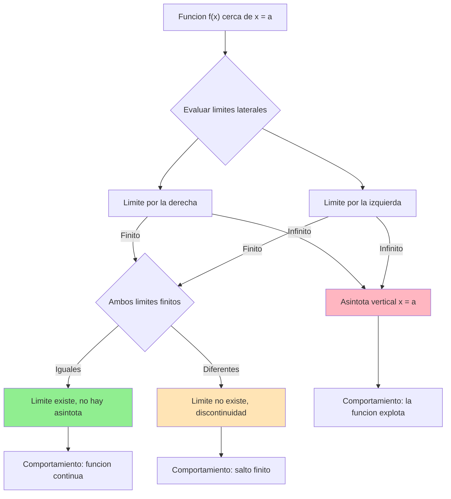
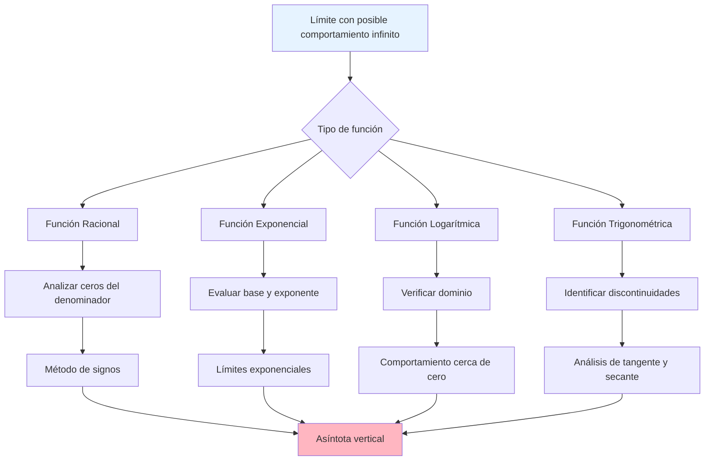
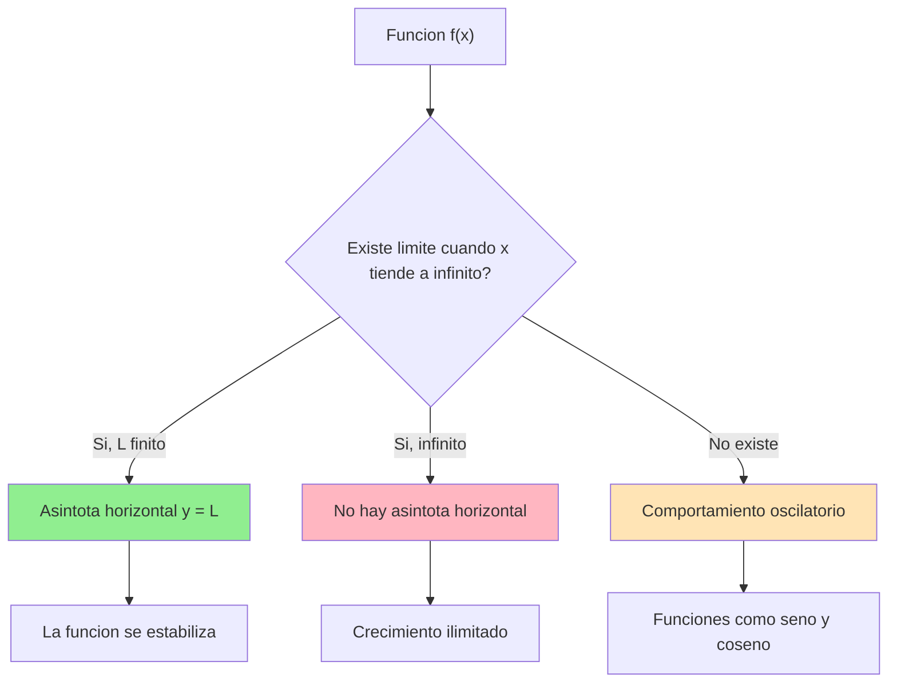
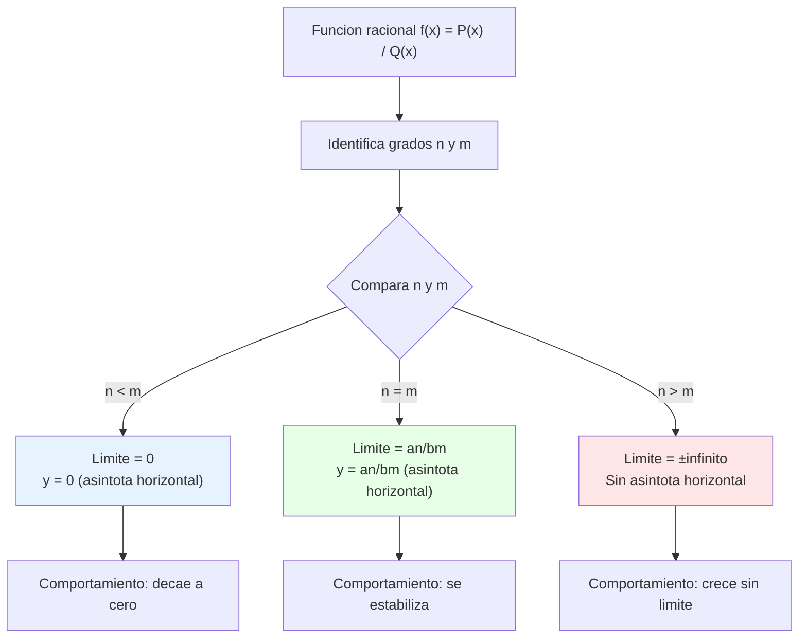
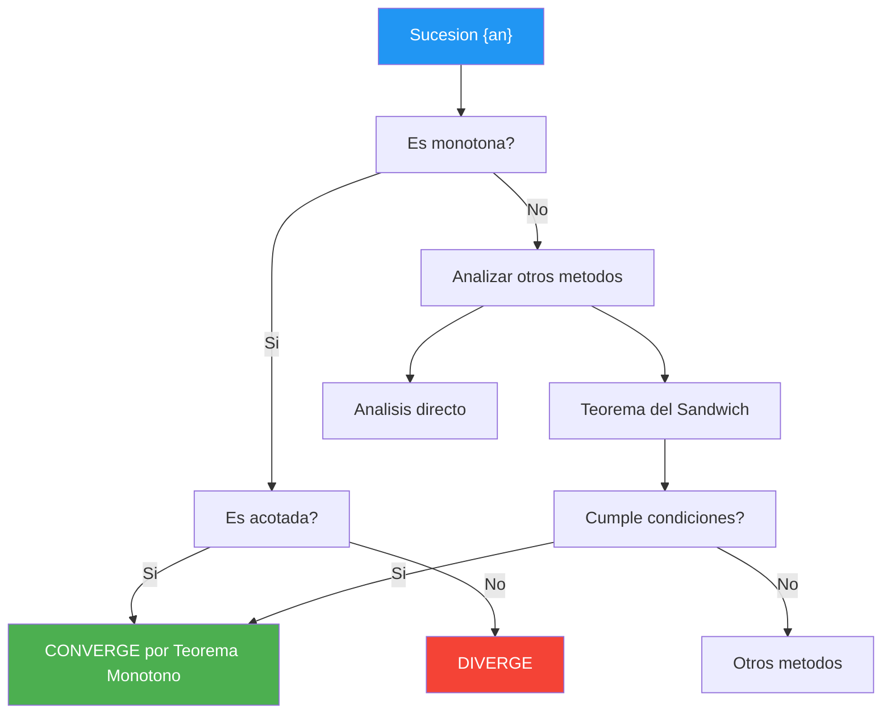

# Límites Infinitos ∞

> [!tip] 💡 **Concepto Clave** Los **límites infinitos** ocurren cuando una función crece o decrece sin límite cuando la variable independiente se aproxima a un valor específico. A diferencia de los límites al infinito, aquí **x se acerca a un punto finito**, pero **f(x) tiende a infinito**.

## Definición y Notación de Límites Infinitos

> [!info] 📚 **Definición Formal**
> 
> ### Límite Infinito Positivo
> 
> Decimos que $\lim_{x \to a} f(x) = +\infty$ si para todo número $M > 0$, existe $\delta > 0$ tal que: $$f(x) > M \text{ siempre que } 0 < |x - a| < \delta$$
> 
> ### Límite Infinito Negativo
> 
> Decimos que $\lim_{x \to a} f(x) = -\infty$ si para todo número $M > 0$, existe $\delta > 0$ tal que: $$f(x) < -M \text{ siempre que } 0 < |x - a| < \delta$$

> [!warning] ⚠️ **Importante: Los Límites Infinitos NO EXISTEN** Cuando escribimos $\lim_{x \to a} f(x) = \infty$, estamos describiendo un **comportamiento específico** de la función, pero técnicamente **el límite no existe** porque infinito no es un número real.
> 
> **Notación correcta:**
> 
> - ✅ $\lim_{x \to a} f(x) = +\infty$ (comportamiento específico)
> - ❌ "El límite existe y vale infinito" (incorrecto conceptualmente)

### Tabla de Comportamientos

|Tipo de Límite|Notación|Comportamiento de f(x)|Interpretación Gráfica|
|---|---|---|---|
|**Infinito positivo**|$\lim_{x \to a} f(x) = +\infty$|Crece sin límite|Asíntota vertical, función sube|
|**Infinito negativo**|$\lim_{x \to a} f(x) = -\infty$|Decrece sin límite|Asíntota vertical, función baja|
|**Límites laterales diferentes**|$\lim_{x \to a^+} f(x) = +\infty$, $\lim_{x \to a^-} f(x) = -\infty$|Comportamientos opuestos|Asíntota vertical con salto|

## Asíntotas Verticales

> [!tip] 📈 **Definición de Asíntota Vertical** La recta vertical $x = a$ es una **asíntota vertical** de la función $f(x)$ si al menos uno de los siguientes límites es infinito:
> 
> - $\lim_{x \to a^+} f(x) = \pm\infty$ (límite lateral derecho)
> - $\lim_{x \to a^-} f(x) = \pm\infty$ (límite lateral izquierdo)



> [!info] 🎯 **Tipos de Asíntotas Verticales**
> 
> ### Según el comportamiento lateral:
> 
> |Comportamiento|Límites Laterales|Ejemplo Visual|
> |---|---|---|
> |**Tipo I**|$\lim_{x \to a^-} f(x) = +\infty$ y $\lim_{x \to a^+} f(x) = +\infty$|Ambos lados suben|
> |**Tipo II**|$\lim_{x \to a^-} f(x) = -\infty$ y $\lim_{x \to a^+} f(x) = -\infty$|Ambos lados bajan|
> |**Tipo III**|$\lim_{x \to a^-} f(x) = +\infty$ y $\lim_{x \to a^+} f(x) = -\infty$|Un lado sube, otro baja|
> |**Tipo IV**|$\lim_{x \to a^-} f(x) = -\infty$ y $\lim_{x \to a^+} f(x) = +\infty$|Un lado baja, otro sube|

## Determinación de Límites Infinitos

> [!tip] 🧮 **Estrategias para Encontrar Límites Infinitos**
> 
> ### 1. Funciones Racionales $f(x) = \frac{P(x)}{Q(x)}$
> 
> **Regla fundamental:** Si $Q(a) = 0$ pero $P(a) \neq 0$, entonces existe asíntota vertical en $x = a$.
> 
> **Proceso de análisis:**
> 
> 1. **Factoriza** numerador y denominador
> 2. **Identifica** puntos donde el denominador se anula
> 3. **Evalúa** el signo del numerador en esos puntos
> 4. **Analiza** el comportamiento lateral del denominador

> [!warning] 🔍 **Método del Análisis de Signos**
> 
> ### Para $f(x) = \frac{P(x)}{Q(x)}$ cerca de $x = a$ donde $Q(a) = 0$:
> 
> **Paso 1:** Determina el signo de $P(a)$ **Paso 2:** Analiza el signo de $Q(x)$ en intervalos $(a-\delta, a)$ y $(a, a+\delta)$ **Paso 3:** Aplica la regla de signos para cocientes
> 
> |$P(a)$|$Q(x)$ cerca de $a^-$|$Q(x)$ cerca de $a^+$|Límite por izquierda|Límite por derecha|
> |---|---|---|---|---|
> |$+$|$+$|$+$|$+\infty$|$+\infty$|
> |$+$|$+$|$-$|$+\infty$|$-\infty$|
> |$+$|$-$|$+$|$-\infty$|$+\infty$|
> |$+$|$-$|$-$|$-\infty$|$-\infty$|
> |$-$|$+$|$+$|$-\infty$|$-\infty$|
> |$-$|$+$|$-$|$-\infty$|$+\infty$|
> |$-$|$-$|$+$|$+\infty$|$-\infty$|
> |$-$|$-$|$-$|$+\infty$|$+\infty$|

### Ejemplos Trabajados

> [!info] 📝 **Ejemplo 1: Función Racional Simple**
> 
> Encontrar $\lim_{x \to 2} \frac{x+1}{x-2}$
> 
> **Solución:**
> 
> 1. **Identificar:** $Q(2) = 2-2 = 0$, $P(2) = 2+1 = 3 > 0$
> 2. **Análizar signos de $Q(x) = x-2$:**
> 
> - Para $x < 2$: $x-2 < 0$ (negativo)
> - Para $x > 2$: $x-2 > 0$ (positivo)
> 
> 3. **Aplicar regla de signos:**
> 
> - $\lim_{x \to 2^-} \frac{x+1}{x-2} = \frac{(+)}{(-)} = -\infty$
> - $\lim_{x \to 2^+} \frac{x+1}{x-2} = \frac{(+)}{(+)} = +\infty$
> 
> 4. **Conclusión:** $x = 2$ es asíntota vertical tipo IV

> [!info] 📝 **Ejemplo 2: Con Factorización**
> 
> Encontrar $\lim_{x \to 3} \frac{x^2-9}{(x-3)^2}$
> 
> **Solución:**
> 
> 5. **Factorizar:** $\frac{x^2-9}{(x-3)^2} = \frac{(x-3)(x+3)}{(x-3)^2} = \frac{x+3}{x-3}$ (para $x \neq 3$)
> 6. **Evaluar:** $\lim_{x \to 3} \frac{x+3}{x-3}$
> 7. **Análizar:** $P(3) = 6 > 0$, $Q(x) = x-3$ cambia de signo en $x = 3$
> 8. **Resultado:**
> 
> - $\lim_{x \to 3^-} \frac{x+3}{x-3} = -\infty$
> - $\lim_{x \to 3^+} \frac{x+3}{x-3} = +\infty$

## Propiedades y Álgebra de Límites Infinitos

> [!tip] ⚖️ **Reglas Algebraicas**
> 
> ### Operaciones con Límites Infinitos
> 
> |Operación|Resultado|Condición|
> |---|---|---|
> |$\infty + \infty$|$\infty$|Mismo signo|
> |$\infty - \infty$|**Indeterminada**|Requiere análisis especial|
> |$\infty \cdot c$|$\infty$ si $c > 0$, $-\infty$ si $c < 0$|$c \neq 0$|
> |$\frac{\infty}{\infty}$|**Indeterminada**|Requiere L'Hôpital o factorización|
> |$\frac{c}{\infty}$|$0$|$c$ finito|
> |$\frac{c}{0}$|$\pm\infty$|Depende del signo de $c$ y aproximación a $0$|

> [!warning] 🚨 **Formas Indeterminadas Relacionadas**
> 
> ### Casos que requieren técnicas especiales:
> 
> - $\infty - \infty$: Factorización o racionalización
> - $\frac{\infty}{\infty}$: L'Hôpital o comparación de grados
> - $0 \cdot \infty$: Reescribir como cociente
> - $\frac{0}{0}$ que puede llevar a $\infty$: Factorización y simplificación



---

> [!quote] 📚 **Referencias**
> 
> - [[01 - Límites al Infinito y Sucesiones]] - Comportamiento cuando x tiende a infinito
> - [[Asíntotas]] - Estudio completo de comportamiento asintótico
> - [[Continuidad]] - Relación con discontinuidades infinitas
> - [[02 - Límites Laterales]] - Herramienta fundamental para el análisis
> - [[Funciones Racionales]] - Casos más comunes de límites infinitos

> [!info] 📖 **Notas Recomendadas para Complementar**
> 
> ### Prerrequisitos:
> 
> - [[Definición de Límite]] - Conceptos fundamentales
> - [[Factorización de Polinomios]] - Técnica algebraica esencial
> - [[Análisis de Signos]] - Para determinar comportamiento
> - [[02 - Límites Laterales]] - Base para límites infinitos
> 
> ### Temas Relacionados:
> 
> - [[01 - Formas Indeterminadas]] - Para formas indeterminadas
> - [[Discontinuidades]] - Clasificación completa
> - [[Gráficas de Funciones]] - Interpretación visual
> - [[Comportamiento Asintótico]] - Análisis avanzado

> [!tip] 🧠 **Técnica de Estudio: "FASE" (Factoriza-Analiza-Signos-Evalúa)**
> 
> ### Mnemotecnia para Límites Infinitos:
> 
> **F**actoriza numerador y denominador **A**naliza dónde se anula el denominador  
> **S**ignos: determina el signo en cada lado **E**valúa el comportamiento lateral
> 
> ### Método de Estudio Activo - "Tabla de Signos Sistemática":
> 
> 1. **Dibuja** una tabla con columnas: $x$, $P(x)$, $Q(x)$, $\frac{P(x)}{Q(x)}$
> 2. **Marca** valores críticos y puntos de prueba
> 3. **Practica** 5 ejemplos diarios variando complejidad
> 4. **Visualiza** cada función con software gráfico
> 5. **Conecta** con aplicaciones: crecimiento poblacional, circuitos RC, etc.
> 
> ### Tarjetas de Memorización:
> 
> - **Anverso:** Función con denominador que se anula
> - **Reverso:** Tabla de signos y límites laterales completos

---

**Tags:** #limites #limites-infinitos #asintotas-verticales #funciones-racionales #calculo #discontinuidades #comportamiento-asintotico #analisis-signos

# Límites al Infinito 🚀

> [!tip] 💡 **Concepto Clave** Los límites al infinito nos permiten estudiar el **comportamiento de funciones cuando la variable independiente crece o decrece sin límite**. Son fundamentales para entender el comportamiento asintótico y las tendencias a largo plazo de las funciones.

## $\lim_{x \to \infty} f(x)$ - Definición y Notación

> [!info] 📚 **Definición Formal** Decimos que $\lim_{x \to \infty} f(x) = L$ si para todo $\varepsilon > 0$, existe un número $M > 0$ tal que:
> 
> $$|f(x) - L| < \varepsilon \text{ siempre que } x > M$$
> 
> **Tipos de límites al infinito:**
> 
> - $\lim_{x \to +\infty} f(x) = L$ (límite cuando x tiende a $+\infty$)
> - $\lim_{x \to -\infty} f(x) = L$ (límite cuando x tiende a $-\infty$)
> - $\lim_{x \to \infty} f(x) = \infty$ (límite infinito)

> [!warning] ⚠️ **Cuidado con la Notación**
> 
> - $x \to \infty$ significa que x crece sin límite
> - $x \to -\infty$ significa que x decrece sin límite
> - El símbolo $\infty$ **no es un número**, es una notación para expresar comportamiento

### Casos Especiales

|Caso|Notación|Significado|
|---|---|---|
|**Límite finito**|$\lim_{x \to \infty} f(x) = L$|La función se aproxima a un valor L|
|**Límite infinito positivo**|$\lim_{x \to \infty} f(x) = +\infty$|La función crece sin límite|
|**Límite infinito negativo**|$\lim_{x \to \infty} f(x) = -\infty$|La función decrece sin límite|
|**No existe**|$\lim_{x \to \infty} f(x) = \nexists$|La función oscila o no tiene comportamiento definido|

## Comportamiento Asintótico Horizontal

> [!tip] 📈 **Asíntotas Horizontales** Una **asíntota horizontal** es una recta horizontal $y = L$ tal que la gráfica de la función se aproxima a esta recta cuando $x \to \pm\infty$.
> 
> **Condición:** $y = L$ es asíntota horizontal si:
> 
> - $\lim_{x \to +\infty} f(x) = L$ y/o
> - $\lim_{x \to -\infty} f(x) = L$



> [!info] 🎯 **Interpretación Geométrica**
> 
> ### Características del Comportamiento Asintótico:
> 
> - **Aproximación gradual**: La función se acerca cada vez más a la asíntota
> - **Nunca se toca**: La función puede acercarse indefinidamente sin tocar la asíntota
> - **Estabilidad**: Para valores grandes de x, f(x) ≈ L
> 
> ### Ejemplos Visuales:
> 
> - $f(x) = \frac{1}{x}$ tiene asíntota horizontal $y = 0$
> - $f(x) = e^{-x}$ tiene asíntota horizontal $y = 0$ cuando $x \to +\infty$
> - $f(x) = \arctan(x)$ tiene asíntotas horizontales $y = \pm\frac{\pi}{2}$

## Límites de Funciones Racionales

> [!tip] 🧮 **Regla Fundamental para Funciones Racionales** Para una función racional $f(x) = \frac{P(x)}{Q(x)}$ donde $P(x)$ y $Q(x)$ son polinomios:
> 
> $$f(x) = \frac{a_n x^n + a_{n-1}x^{n-1} + \cdots + a_0}{b_m x^m + b_{m-1}x^{m-1} + \cdots + b_0}$$
> 
> El límite cuando $x \to \infty$ depende de los **grados** de los polinomios:

### Tabla de Casos para Funciones Racionales

|Relación de Grados|Resultado del Límite|Ejemplo|
|---|---|---|
|$n < m$ (grado numerador < denominador)|$\lim_{x \to \infty} f(x) = 0$|$\frac{x^2}{x^3 + 1} \to 0$|
|$n = m$ (grados iguales)|$\lim_{x \to \infty} f(x) = \frac{a_n}{b_m}$|$\frac{3x^2 + 1}{2x^2 - 5} \to \frac{3}{2}$|
|$n > m$ (grado numerador > denominador)|$\lim_{x \to \infty} f(x) = \pm\infty$|$\frac{x^3 + 2}{x^2 - 1} \to \infty$|

> [!warning] 🔍 **Método de Resolución**
> 
> ### Estrategia "Dividir por la Mayor Potencia":
> 
> 1. **Identifica** la mayor potencia de x en denominador
> 2. **Divide** numerador y denominador por esa potencia
> 3. **Evalúa** el límite usando que $\lim_{x \to \infty} \frac{1}{x^k} = 0$ para $k > 0$
> 
> **Ejemplo:** $$\lim_{x \to \infty} \frac{3x^2 - 5x + 2}{2x^2 + x - 1}$$
> 
> Dividimos por $x^2$: $$\lim_{x \to \infty} \frac{3 - \frac{5}{x} + \frac{2}{x^2}}{2 + \frac{1}{x} - \frac{1}{x^2}} = \frac{3 - 0 + 0}{2 + 0 - 0} = \frac{3}{2}$$

### Casos Especiales y Formas Indeterminadas

> [!info] 🤔 **Formas Indeterminadas Comunes**
> 
> |Forma|Ejemplo|Estrategia de Resolución|
> |---|---|---|
> |$\frac{\infty}{\infty}$|$\lim_{x \to \infty} \frac{x^2}{x^2 + 1}$|Dividir por mayor potencia|
> |$\infty - \infty$|$\lim_{x \to \infty} (x^2 - x^2)$|Factorizar o racionalizar|
> |$1^\infty$|$\lim_{x \to \infty} \left(1 + \frac{1}{x}\right)^x$|Usar límites exponenciales|



---

> [!quote] 📚 **Referencias**
> 
> - [[01 - Concepto y Definición Formal del Límite]] - Fundamentos teóricos
> - [[02 - Límites Laterales]] - Para casos puntuales
> - [[Asíntotas]] - Comportamiento gráfico completo
> - [[Continuidad]] - Relación con límites
> - [[01 - Derivada y Definición Formal]] - Aplicación en tasas de cambio

> [!info] 📖 **Notas Recomendadas para Complementar**
> 
> ### Prerrequisitos:
> 
> - [[Funciones Polinómicas]] - Base algebraica necesaria
> - [[Álgebra de Límites]] - Propiedades operacionales
> - [[Función Racional]] - Características específicas
> 
> ### Temas Relacionados:
> 
> - [[Límites Indeterminados]] - Casos complejos
> - [[01 - Formas Indeterminadas]] - Herramienta avanzada
> - [[Series Infinitas]] - Comportamiento asintótico avanzado

> [!tip] 🧠 **Técnica de Estudio: Mnemotecnia "GMD"**
> 
> ### Para recordar el comportamiento de funciones racionales:
> 
> **G**rado **M**ayor **D**etermina:
> 
> - **G**rado mayor arriba (numerador) → Límite **∞**
> - **G**rado mayor abajo (denominador) → Límite **0**
> - **G**rados iguales → Límite = **coeficientes principales**
> 
> ### Método de Estudio Activo:
> 
> 1. **Practica** con 3 ejemplos diarios de cada tipo
> 2. **Dibuja** las gráficas para visualizar comportamiento
> 3. **Verifica** siempre dividiendo por la mayor potencia
> 4. **Conecta** con aplicaciones físicas (velocidad límite, concentraciones)

---

**Tags:** #limites #infinito #asíntotas #funciones-racionales #calculo #matematicas #comportamiento-asintótico

# Límites de Sucesiones 📊

## Definición Fundamental

> [!tip] 🎯 Concepto de Convergencia
> 
> ### Definición formal de límite de sucesión
> 
> Una sucesión $(a_n)$ **converge** al límite $L$ si: $$\forall \varepsilon > 0, \exists N \in \mathbb{N} : n > N \Rightarrow |a_n - L| < \varepsilon$$
> 
> **Notación:** $\lim_{n \to \infty} a_n = L$ o $a_n \to L$
> 
> **Interpretación geométrica:** 🎪 A partir de cierto término $N$, todos los términos de la sucesión están dentro de una "banda" de anchura $2\varepsilon$ alrededor de $L$
> 
> ```mermaid
> graph LR
>    A[a₁] --> B[a₂] --> C[a₃] --> D[...] --> E[aₙ] --> F[L]
>    
>    style F fill:#4caf50,color:#fff
>    style E fill:#81c784,color:#000
>    style A fill:#ffcdd2,color:#000
> ```

## Convergencia de Sucesiones

> [!info] 📈 Tipos de Comportamiento
> 
> ### Clasificación de sucesiones
> 
> |Tipo|Definición|Ejemplo|Comportamiento|
> |---|---|---|---|
> |**Convergente**|$\lim_{n \to \infty} a_n = L \in \mathbb{R}$|$\frac{1}{n} \to 0$|Se acerca a un valor finito 🎯|
> |**Divergente a ∞**|$\lim_{n \to \infty} a_n = +\infty$|$n^2 \to +\infty$|Crece sin límite ⬆️|
> |**Divergente a -∞**|$\lim_{n \to \infty} a_n = -\infty$|$-n \to -\infty$|Decrece sin límite ⬇️|
> |**Oscilante**|No tiene límite|$(-1)^n$|Alterna entre valores 〰️|
> 
> **Mnemotecnia:** "**C**onverge **C**erca, **D**iverge **D**istante, **O**scila **O**nda"

> [!tip] 🧮 Propiedades de Límites
> 
> ### Álgebra de límites
> 
> Si $\lim_{n \to \infty} a_n = A$ y $\lim_{n \to \infty} b_n = B$, entonces:
> 
> - **Suma:** $\lim_{n \to \infty} (a_n + b_n) = A + B$
> - **Producto:** $\lim_{n \to \infty} (a_n \cdot b_n) = A \cdot B$
> - **Cociente:** $\lim_{n \to \infty} \frac{a_n}{b_n} = \frac{A}{B}$ (si $B \neq 0$)
> - **Potencia:** $\lim_{n \to \infty} a_n^k = A^k$
> 
> **⚠️ Formas indeterminadas:** $\frac{0}{0}$, $\frac{\infty}{\infty}$, $0 \cdot \infty$, $\infty - \infty$

## Teorema del Sandwich 🥪

> [!warning] 🔒 Teorema de Compresión (Sandwich)
> 
> ### Enunciado del teorema
> 
> Si $(a_n)$, $(b_n)$ y $(c_n)$ son sucesiones tales que:
> 
> 1. $a_n \leq b_n \leq c_n$ para todo $n$ suficientemente grande
> 2. $\lim_{n \to \infty} a_n = \lim_{n \to \infty} c_n = L$
> 
> **Entonces:** $\lim_{n \to \infty} b_n = L$
> 
> ```mermaid
> graph TD
>    A[Sucesión aₙ] --> D[Límite L]
>    B[Sucesión bₙ] --> D
>    C[Sucesión cₙ] --> D
>    
>    A -.->|"≤"| B
>    B -.->|"≤"| C
>    
>    style D fill:#4caf50,color:#fff
>    style B fill:#ffeb3b,color:#000
>    style A fill:#2196f3,color:#fff
>    style C fill:#f44336,color:#fff
> ```
> 
> **Visualización:** La sucesión $b_n$ está "atrapada" entre dos sucesiones que convergen al mismo límite 🎯

> [!info] 🎲 Ejemplos del Teorema del Sandwich
> 
> ### Ejemplo 1: $\lim_{n \to \infty} \frac{\sin n}{n}$
> 
> Como $-1 \leq \sin n \leq 1$, entonces: $$-\frac{1}{n} \leq \frac{\sin n}{n} \leq \frac{1}{n}$$
> 
> Dado que $\lim_{n \to \infty} \left(-\frac{1}{n}\right) = \lim_{n \to \infty} \frac{1}{n} = 0$
> 
> **Por el teorema del sandwich:** $\lim_{n \to \infty} \frac{\sin n}{n} = 0$ ✅
> 
> ### Ejemplo 2: $\lim_{n \to \infty} \frac{1}{n} \cos(n^2)$
> 
> Como $-1 \leq \cos(n^2) \leq 1$: $$-\frac{1}{n} \leq \frac{\cos(n^2)}{n} \leq \frac{1}{n}$$
> 
> **Resultado:** $\lim_{n \to \infty} \frac{\cos(n^2)}{n} = 0$ ✅

## Sucesiones Monótonas Acotadas 📈

> [!tip] 🎢 Teorema de Convergencia Monótona
> 
> ### Teorema fundamental
> 
> **Toda sucesión monótona y acotada es convergente**
> 
> **Casos específicos:**
> 
> - **Creciente y acotada superiormente** → converge al **supremo**
> - **Decreciente y acotada inferiormente** → converge al **ínfimo**
> 
> |Tipo|Definición|Convergencia|Ejemplo|
> |---|---|---|---|
> |**Monótona creciente**|$a_n \leq a_{n+1}$|Converge si acotada superiormente 📈|$a_n = 1 - \frac{1}{n}$|
> |**Monótona decreciente**|$a_n \geq a_{n+1}$|Converge si acotada inferiormente 📉|$a_n = \frac{1}{n}$|
> |**Estrictamente creciente**|$a_n < a_{n+1}$|Mismas condiciones ⬆️|$a_n = n$ (no acotada)|
> |**Estrictamente decreciente**|$a_n > a_{n+1}$|Mismas condiciones ⬇️|$a_n = -n$ (no acotada)|

> [!warning] 🔍 Criterios de Monotonía
> 
> ### Métodos para determinar monotonía
> 
> **1. Diferencia de términos consecutivos:**
> 
> - Si $a_{n+1} - a_n \geq 0$ → creciente
> - Si $a_{n+1} - a_n \leq 0$ → decreciente
> 
> **2. Cociente de términos consecutivos:**
> 
> - Si $\frac{a_{n+1}}{a_n} \geq 1$ (y $a_n > 0$) → creciente
> - Si $\frac{a_{n+1}}{a_n} \leq 1$ (y $a_n > 0$) → decreciente
> 
> **3. Función asociada:**
> 
> - Si $f(x) = a_x$ y $f'(x) \geq 0$ → creciente
> - Si $f(x) = a_x$ y $f'(x) \leq 0$ → decreciente

> [!info] 🎯 Ejemplos Clásicos
> 
> ### Ejemplo 1: Sucesión $a_n = \frac{2n + 1}{n + 3}$
> 
> **Análisis de monotonía:** $$a_{n+1} - a_n = \frac{2(n+1) + 1}{(n+1) + 3} - \frac{2n + 1}{n + 3}$$ $$= \frac{(2n + 3)(n + 3) - (2n + 1)(n + 4)}{(n + 4)(n + 3)} = \frac{5}{(n + 4)(n + 3)} > 0$$
> 
> **Conclusión:** Estrictamente creciente ⬆️
> 
> **Acotación:** $a_n = 2 - \frac{5}{n + 3} < 2$
> 
> **Resultado:** Converge a $\lim_{n \to \infty} a_n = 2$ ✅
> 
> ### Ejemplo 2: Sucesión de Fibonacci normalizada
> 
> $$a_n = \frac{F_{n+1}}{F_n}$$ donde $F_n$ es la n-ésima término de Fibonacci
> 
> **Resultado:** Converge al **número áureo** $\phi = \frac{1 + \sqrt{5}}{2} \approx 1.618$ 🌟



## Técnica de Estudio: Método CLIMB 🧗

> [!tip] 📚 Estrategia CLIMB para Sucesiones
> 
> - **C**onvergencia: Determina si la sucesión converge
> - **L**ímite: Calcula el valor límite si existe
> - **I**dentifica: El tipo de sucesión (monótona, oscilante, etc.)
> - **M**étodo: Elige la herramienta apropiada (sandwich, monotonía, etc.)
> - **B**ound: Verifica las cotas si es necesario
> 
> **Regla mnemotécnica para recordar criterios:** "**M**onótona **A**cotada **S**iempre **C**onverge" (MASC)

## Referencias 🔗

> [!quote] Enlaces a otras notas
> 
> - [[Límites de Funciones]] - Relación entre límites funcionales y sucesiones
> - [[Series Numéricas]] - Aplicación de sucesiones en series
> - [[Continuidad]] - Caracterización secuencial de continuidad
> - [[Topología de los Reales]] - Conceptos de supremo e ínfimo
> - [[Criterios de Convergencia]] - Herramientas avanzadas para series

## Notas Recomendadas 📚

> [!info] 🎓 Prerrequisitos y Complementos
> 
> **Prerrequisitos necesarios:**
> 
> - [[Números Reales]] - Propiedades de completitud
> - [[Desigualdades]] - Manipulación de inecuaciones
> - [[Límites Básicos]] - Conceptos fundamentales
> - [[Funciones Elementales]] - Para sucesiones definidas por funciones
> 
> **Para profundizar:**
> 
> - [[Sucesiones de Cauchy]] - Caracterización alternativa de convergencia
> - [[Límites Superior e Inferior]] - Conceptos avanzados
> - [[Compacidad]] - Teorema de Bolzano-Weierstrass
> - [[Espacios Métricos]] - Generalización de conceptos
> - [[Análisis Real Avanzado]] - Teoría completa de sucesiones

---

**Tags:** #sucesiones #limites #convergencia #teorema-sandwich #monotonia #analisis-real #calculo #matematicas #acotacion #supremo-infimo