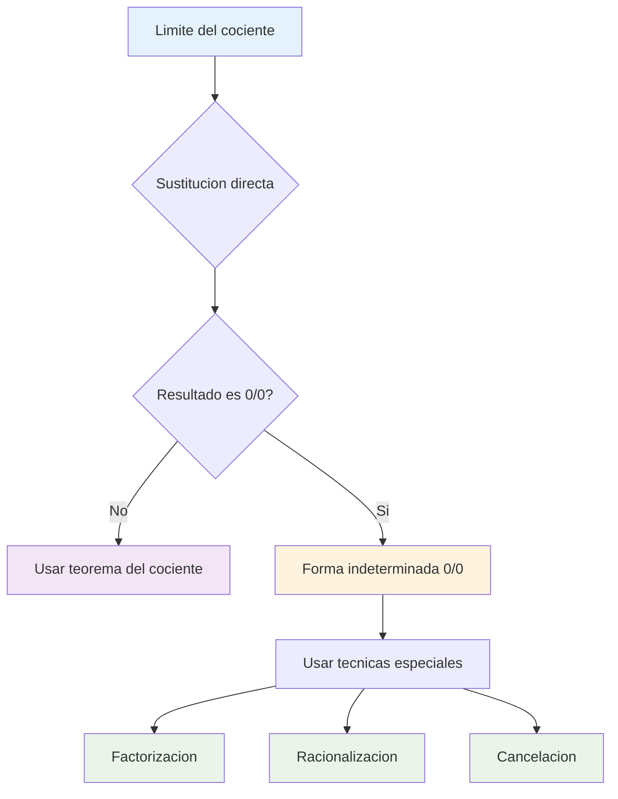
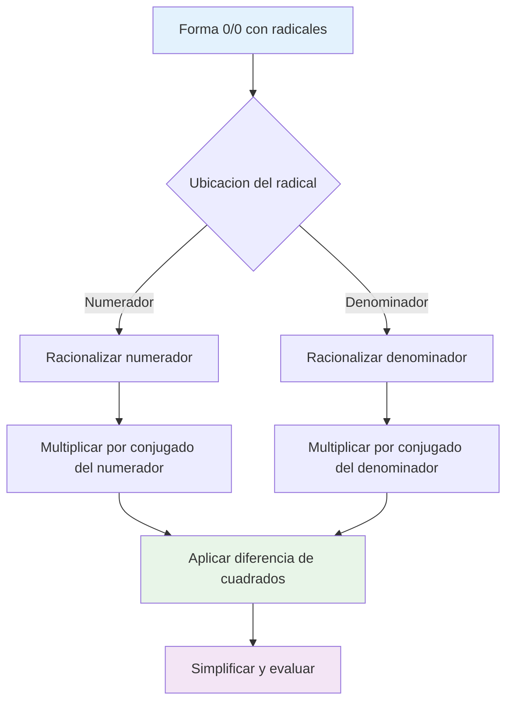
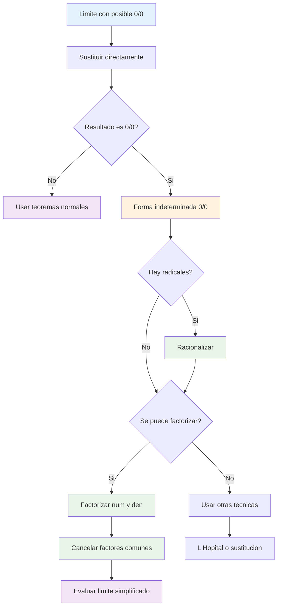
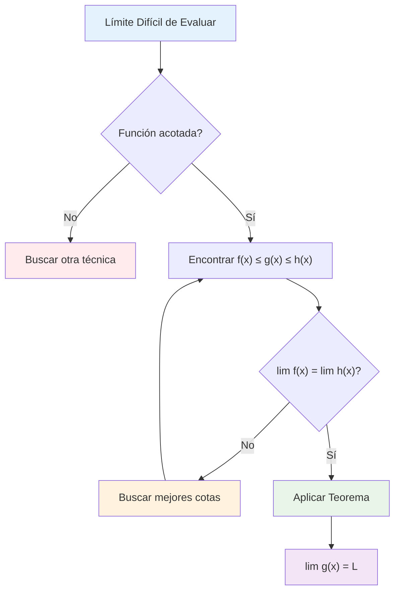
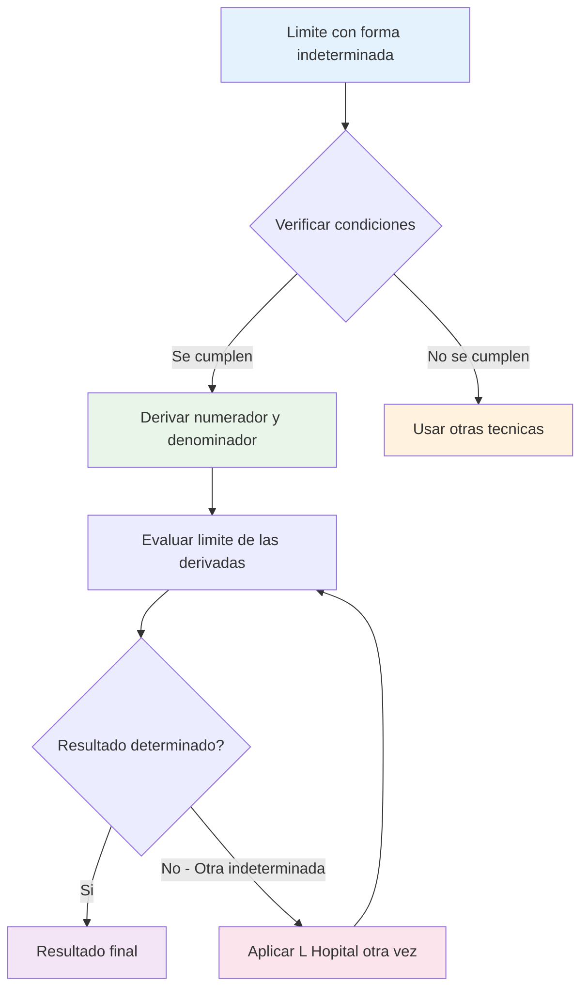
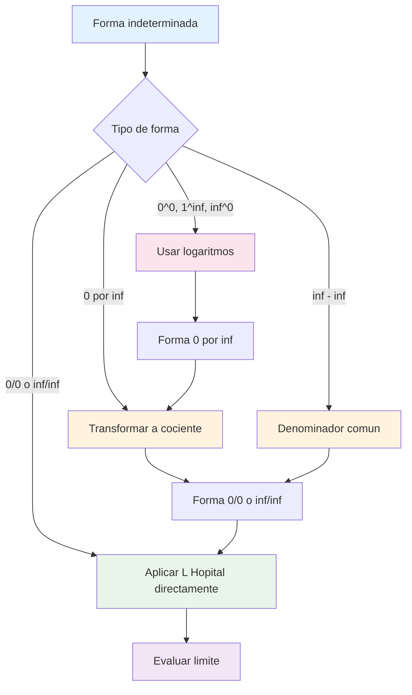

# ❓ Formas Indeterminadas 0/0

## 🎯 ¿Qué es una Forma Indeterminada 0/0?

> [!info] 🔍 Definición Fundamental Una **forma indeterminada** $\frac{0}{0}$ surge cuando: $$\lim_{x \to a} \frac{f(x)}{g(x)}$$ donde $\lim_{x \to a} f(x) = 0$ y $\lim_{x \to a} g(x) = 0$
> 
> 🚫 **No podemos aplicar** el teorema del cociente de límites porque obtendríamos $\frac{0}{0}$, que **no está definido**.

> [!warning] ⚠️ Por qué es "Indeterminada" La forma $\frac{0}{0}$ es indeterminada porque **puede tomar cualquier valor** dependiendo de cómo las funciones se aproximen a cero.
> 
> **Ejemplos:**
> 
> - $\lim_{x \to 0} \frac{x}{x} = 1$ (ambos tienden a 0, resultado = 1)
> - $\lim_{x \to 0} \frac{2x}{x} = 2$ (ambos tienden a 0, resultado = 2)
> - $\lim_{x \to 0} \frac{x^2}{x} = 0$ (ambos tienden a 0, resultado = 0)



## 🔢 Factorización Algebraica

> [!success] 🎯 Estrategia de Factorización **Objetivo:** Factorizar numerador y denominador para **cancelar factores comunes** que causan la indeterminación.
> 
> **Proceso:**
> 
> 1. Factorizar completamente el numerador
> 2. Factorizar completamente el denominador
> 3. Cancelar factores comunes
> 4. Evaluar el límite resultante

### 📊 Técnicas de Factorización Principales

> [!tip] 🔧 Métodos de Factorización
> 
> **1. Diferencia de cuadrados:** $$a^2 - b^2 = (a+b)(a-b)$$
> 
> **2. Trinomio cuadrado perfecto:** $$a^2 + 2ab + b^2 = (a+b)^2$$ $$a^2 - 2ab + b^2 = (a-b)^2$$
> 
> **3. Factor común:** $$ax + bx = x(a + b)$$
> 
> **4. Trinomio de segundo grado:** $$ax^2 + bx + c = (px + q)(rx + s)$$

|Tipo de Factorización|Patrón|Ejemplo|Factorizado|
|---|---|---|---|
|Diferencia de cuadrados|$a^2 - b^2$|$x^2 - 4$|$(x+2)(x-2)$|
|Cuadrado perfecto|$(a \pm b)^2$|$x^2 + 6x + 9$|$(x+3)^2$|
|Factor común|$x(a + b)$|$3x^2 + 6x$|$3x(x+2)$|
|Trinomio general|$ax^2 + bx + c$|$2x^2 + 7x + 3$|$(2x+1)(x+3)$|
|Diferencia de cubos|$a^3 - b^3$|$x^3 - 8$|$(x-2)(x^2+2x+4)$|

> [!example] 📝 Ejemplos de Factorización
> 
> **Ejemplo 1: Diferencia de cuadrados** $$\lim_{x \to 2} \frac{x^2 - 4}{x - 2}$$
> 
> **Solución:**
> 
> - Verificar: $\frac{2^2 - 4}{2 - 2} = \frac{0}{0}$ ✓ (Forma indeterminada)
> - Factorizar: $x^2 - 4 = (x+2)(x-2)$
> - Simplificar: $\frac{(x+2)(x-2)}{x-2} = x+2$ (para $x ≠ 2$)
> - Evaluar: $\lim_{x \to 2} (x+2) = 4$
> 
> **Ejemplo 2: Trinomio cuadrático** $$\lim_{x \to -1} \frac{x^2 + 3x + 2}{x^2 - 1}$$
> 
> **Solución:**
> 
> - Verificar: $\frac{1 - 3 + 2}{1 - 1} = \frac{0}{0}$ ✓
> - Factorizar numerador: $x^2 + 3x + 2 = (x+1)(x+2)$
> - Factorizar denominador: $x^2 - 1 = (x+1)(x-1)$
> - Simplificar: $\frac{(x+1)(x+2)}{(x+1)(x-1)} = \frac{x+2}{x-1}$ (para $x ≠ -1$)
> - Evaluar: $\lim_{x \to -1} \frac{x+2}{x-1} = \frac{1}{-2} = -\frac{1}{2}$

### 🎲 Casos Especiales de Factorización

> [!tip] ⚡ Factorizaciones Avanzadas
> 
> **Suma y diferencia de cubos:**
> 
> - $a^3 + b^3 = (a+b)(a^2 - ab + b^2)$
> - $a^3 - b^3 = (a-b)(a^2 + ab + b^2)$
> 
> **Factorización por agrupación:**
> 
> - $ax + ay + bx + by = a(x+y) + b(x+y) = (a+b)(x+y)$
> 
> **Sustitución trigonométrica:**
> 
> - Usar identidades como $\sin^2 x + \cos^2 x = 1$

> [!example] 🎯 Ejemplo Avanzado $$\lim_{x \to 2} \frac{x^3 - 8}{x^2 - 4}$$
> 
> **Solución:**
> 
> - Verificar: $\frac{8 - 8}{4 - 4} = \frac{0}{0}$ ✓
> - Factorizar numerador: $x^3 - 8 = (x-2)(x^2 + 2x + 4)$
> - Factorizar denominador: $x^2 - 4 = (x-2)(x+2)$
> - Simplificar: $\frac{(x-2)(x^2 + 2x + 4)}{(x-2)(x+2)} = \frac{x^2 + 2x + 4}{x+2}$
> - Evaluar: $\lim_{x \to 2} \frac{4 + 4 + 4}{4} = \frac{12}{4} = 3$

## 📐 Racionalización

> [!info] 🔄 Técnica de Racionalización **Objetivo:** Eliminar **radicales del denominador** o numerador multiplicando por el **conjugado**.
> 
> **Conjugado:** Si tenemos $\sqrt{a} + \sqrt{b}$, su conjugado es $\sqrt{a} - \sqrt{b}$
> 
> **Propiedad clave:** $(\sqrt{a} + \sqrt{b})(\sqrt{a} - \sqrt{b}) = a - b$

### 🌊 Tipos de Racionalización

> [!success] 🎯 Estrategias de Racionalización
> 
> **1. Racionalización simple:** $$\frac{1}{\sqrt{a}} \cdot \frac{\sqrt{a}}{\sqrt{a}} = \frac{\sqrt{a}}{a}$$
> 
> **2. Racionalización con conjugado:** $$\frac{1}{\sqrt{a} + \sqrt{b}} \cdot \frac{\sqrt{a} - \sqrt{b}}{\sqrt{a} - \sqrt{b}} = \frac{\sqrt{a} - \sqrt{b}}{a - b}$$
> 
> **3. Racionalización del numerador:** $$\frac{\sqrt{a} - \sqrt{b}}{c} \cdot \frac{\sqrt{a} + \sqrt{b}}{\sqrt{a} + \sqrt{b}} = \frac{a - b}{c(\sqrt{a} + \sqrt{b})}$$

|Situación|Multiplicar por|Resultado|Uso típico|
|---|---|---|---|
|$\frac{A}{\sqrt{x}}$|$\frac{\sqrt{x}}{\sqrt{x}}$|$\frac{A\sqrt{x}}{x}$|Denominador con una raíz|
|$\frac{A}{\sqrt{x} + \sqrt{y}}$|$\frac{\sqrt{x} - \sqrt{y}}{\sqrt{x} - \sqrt{y}}$|$\frac{A(\sqrt{x} - \sqrt{y})}{x - y}$|Suma de raíces en denominador|
|$\frac{\sqrt{x} - \sqrt{y}}{A}$|$\frac{\sqrt{x} + \sqrt{y}}{\sqrt{x} + \sqrt{y}}$|$\frac{x - y}{A(\sqrt{x} + \sqrt{y})}$|Resta de raíces en numerador|

> [!example] 📊 Ejemplos de Racionalización
> 
> **Ejemplo 1: Racionalización básica** $$\lim_{x \to 0} \frac{\sqrt{x + 1} - 1}{x}$$
> 
> **Solución:**
> 
> - Verificar: $\frac{\sqrt{1} - 1}{0} = \frac{0}{0}$ ✓
> - Multiplicar por conjugado: $\frac{\sqrt{x + 1} - 1}{x} \cdot \frac{\sqrt{x + 1} + 1}{\sqrt{x + 1} + 1}$
> - Aplicar diferencia de cuadrados: $\frac{(x + 1) - 1}{x(\sqrt{x + 1} + 1)} = \frac{x}{x(\sqrt{x + 1} + 1)}$
> - Simplificar: $\frac{1}{\sqrt{x + 1} + 1}$ (para $x ≠ 0$)
> - Evaluar: $\lim_{x \to 0} \frac{1}{\sqrt{1} + 1} = \frac{1}{2}$
> 
> **Ejemplo 2: Racionalización compleja** $$\lim_{x \to 4} \frac{\sqrt{x} - 2}{x - 4}$$
> 
> **Solución:**
> 
> - Verificar: $\frac{2 - 2}{4 - 4} = \frac{0}{0}$ ✓
> - Multiplicar por conjugado: $\frac{\sqrt{x} - 2}{x - 4} \cdot \frac{\sqrt{x} + 2}{\sqrt{x} + 2}$
> - Simplificar numerador: $\frac{x - 4}{(x - 4)(\sqrt{x} + 2)}$
> - Cancelar: $\frac{1}{\sqrt{x} + 2}$ (para $x ≠ 4$)
> - Evaluar: $\lim_{x \to 4} \frac{1}{\sqrt{4} + 2} = \frac{1}{4}$

### 🔍 Patrones Comunes en Racionalización



> [!tip] 🎯 Identificación Rápida **¿Cuándo racionalizar?**
> 
> - Hay raíces cuadradas en numerador o denominador
> - La sustitución directa da $\frac{0}{0}$
> - Se pueden formar conjugados útiles
> 
> **¿Qué conjugado usar?**
> 
> - Para $\sqrt{a} + b$ usar $\sqrt{a} - b$
> - Para $\sqrt{a} - \sqrt{b}$ usar $\sqrt{a} + \sqrt{b}$
> - Para $a + \sqrt{b}$ usar $a - \sqrt{b}$

## ✂️ Cancelación de Factores Comunes

> [!success] 🎯 Proceso de Cancelación **Objetivo:** Eliminar los **factores que causan la indeterminación** mediante cancelación algebraica.
> 
> **Pasos fundamentales:**
> 
> 1. **Identificar** el factor problemático
> 2. **Factorizar** tanto numerador como denominador
> 3. **Cancelar** factores comunes
> 4. **Evaluar** el límite simplificado

### 🔄 Tipos de Cancelación

> [!tip] ⚡ Métodos de Cancelación
> 
> **1. Cancelación directa:** $$\frac{(x-a) \cdot P(x)}{(x-a) \cdot Q(x)} = \frac{P(x)}{Q(x)} \quad (x ≠ a)$$
> 
> **2. Cancelación múltiple:** $$\frac{(x-a)^2 \cdot P(x)}{(x-a) \cdot Q(x)} = \frac{(x-a) \cdot P(x)}{Q(x)} \quad (x ≠ a)$$
> 
> **3. Cancelación con factorización previa:** $$\frac{f(x)}{g(x)} \to \frac{A(x)(x-a)}{B(x)(x-a)} = \frac{A(x)}{B(x)}$$

|Situación|Antes de Cancelar|Después de Cancelar|Factor Cancelado|
|---|---|---|---|
|Factor lineal|$\frac{(x-2)(x+1)}{(x-2)(x+3)}$|$\frac{x+1}{x+3}$|$(x-2)$|
|Factor cuadrático|$\frac{(x^2-1)(x+2)}{(x^2-1)(x-3)}$|$\frac{x+2}{x-3}$|$(x^2-1)$|
|Múltiples factores|$\frac{(x-1)^2(x+2)}{(x-1)(x+5)}$|$\frac{(x-1)(x+2)}{x+5}$|$(x-1)$|
|Con constantes|$\frac{2(x-3)(x+1)}{4(x-3)}$|$\frac{(x+1)}{2}$|$2(x-3)$|

> [!example] 🎨 Ejemplos de Cancelación
> 
> **Ejemplo 1: Cancelación simple** $$\lim_{x \to 3} \frac{x^2 - 9}{x - 3}$$
> 
> **Solución:**
> 
> - Verificar: $\frac{9 - 9}{3 - 3} = \frac{0}{0}$ ✓
> - Factorizar: $\frac{(x+3)(x-3)}{x-3}$
> - Cancelar: $\frac{(x+3)\cancel{(x-3)}}{\cancel{x-3}} = x+3$ (para $x ≠ 3$)
> - Evaluar: $\lim_{x \to 3} (x+3) = 6$
> 
> **Ejemplo 2: Cancelación múltiple** $$\lim_{x \to -2} \frac{x^3 + 8}{x^2 + 4x + 4}$$
> 
> **Solución:**
> 
> - Verificar: $\frac{-8 + 8}{4 - 8 + 4} = \frac{0}{0}$ ✓
> - Factorizar numerador: $x^3 + 8 = (x+2)(x^2 - 2x + 4)$
> - Factorizar denominador: $x^2 + 4x + 4 = (x+2)^2$
> - Cancelar: $\frac{(x+2)(x^2 - 2x + 4)}{(x+2)^2} = \frac{x^2 - 2x + 4}{x+2}$ (para $x ≠ -2$)
> - Evaluar: $\lim_{x \to -2} \frac{4 + 4 + 4}{0}$ → Límite no existe (∞)

### 🚨 Precauciones en la Cancelación

> [!warning] ⚠️ Cuidados Importantes
> 
> **1. Verificar la indeterminación:**
> 
> - Siempre confirmar que se obtiene $\frac{0}{0}$ antes de cancelar
> 
> **2. Restricción de dominio:**
> 
> - Recordar que $x ≠ a$ después de la cancelación
> - El límite evalúa el comportamiento cerca de $a$, no en $a$
> 
> **3. Cancelación completa:**
> 
> - Asegurar que todos los factores problemáticos se cancelen
> - Si queda un factor $(x-a)$ en denominador → límite infinito
> 
> **4. Factorización correcta:**
> 
> - Verificar cada factorización antes de cancelar

> [!example] 🔍 Ejemplo con Múltiples Técnicas $$\lim_{x \to 1} \frac{\sqrt{x+3} - 2}{x^2 - 1}$$
> 
> **Solución combinada:**
> 
> - Verificar: $\frac{\sqrt{4} - 2}{1 - 1} = \frac{0}{0}$ ✓
> - **Racionalizar numerador:** Multiplicar por $\frac{\sqrt{x+3} + 2}{\sqrt{x+3} + 2}$
> - Numerador: $(\sqrt{x+3})^2 - 4 = x + 3 - 4 = x - 1$
> - **Factorizar denominador:** $x^2 - 1 = (x-1)(x+1)$
> - **Cancelar factor común:** $\frac{x-1}{(x-1)(x+1)(\sqrt{x+3} + 2)} = \frac{1}{(x+1)(\sqrt{x+3} + 2)}$
> - **Evaluar:** $\lim_{x \to 1} \frac{1}{(2)(\sqrt{4} + 2)} = \frac{1}{2 \cdot 4} = \frac{1}{8}$

## 🧠 Técnica de Estudio: Mnemotecnia "FRC"

> [!tip] 🎓 Método "FRC" para Formas Indeterminadas 0/0
> 
> **F** - **F**actorizar (buscar factores comunes) **R** - **R**acionalizar (si hay radicales) **C** - **C**ancelar (eliminar factores problemáticos)
> 
> **Algoritmo de decisión:**
> 
> 1. **Verificar** si es forma $\frac{0}{0}$
> 2. **¿Hay radicales?** → Racionalizar primero
> 3. **¿Se puede factorizar?** → Factorizar
> 4. **¿Hay factores comunes?** → Cancelar
> 5. **Evaluar** el límite simplificado
> 
> **Frase nemotécnica:** _"Factoriza, Racionaliza, Cancela"_

## 📊 Diagrama de Flujo Completo



## 📚 Referencias y Conexiones

> [!quote] 🔗 Enlaces a Otras Notas
> 
> - [[01 - Propiedades y Teoremas de los Límites]] - Base teórica para entender por qué fallan
> - [[Técnicas de Factorización]] - Herramientas algebraicas fundamentales
> - [[Conjugados y Racionalización]] - Técnicas específicas para radicales
> - [[01 - Formas Indeterminadas]] - Método alternativo para formas indeterminadas
> - [[01 - Límites Especiales]] - Casos especiales con funciones trigonométricas

## 📖 Notas Recomendadas para Estudio Complementario

> [!info] 📝 Secuencia de Aprendizaje Progresiva
> 
> **Prerrequisitos:**
> 
> 1. **[[Álgebra de Polinomios]]** - Factorización básica
> 2. **[[Productos Notables]]** - Patrones algebraicos
> 3. **[[Radicales y Conjugados]]** - Operaciones con raíces
> 
> **Temas Paralelos:** 4. **[[Gráficas y Discontinuidades]]** - Interpretación visual 5. **[[Simplificación Algebraica]]** - Técnicas de reducción
> 
> **Siguientes Pasos:** 6. **[[Otras Formas Indeterminadas]]** - ∞/∞, 0·∞, etc. 7. **[[01 - Formas Indeterminadas]]** - Método sistemático 8. **[[Límites Trigonométricos Especiales]]** - Casos avanzados

## 🎯 Ejercicios de Práctica Estructurada

> [!example] 💪 Entrenamiento por Técnicas
> 
> **Nivel 1 - Factorización Básica:** 🟢
> 
> - $\lim_{x \to 3} \frac{x^2 - 9}{x - 3}$
> - $\lim_{x \to -2} \frac{x^2 + 4x + 4}{x + 2}$
> - $\lim_{x \to 1} \frac{x^3 - 1}{x^2 - 1}$
> 
> **Nivel 2 - Racionalización Simple:** 🟡
> 
> - $\lim_{x \to 0} \frac{\sqrt{x + 4} - 2}{x}$
> - $\lim_{x \to 9} \frac{\sqrt{x} - 3}{x - 9}$
> - $\lim_{x \to 1} \frac{x - 1}{\sqrt{x} - 1}$
> 
> **Nivel 3 - Técnicas Combinadas:** 🟠
> 
> - $\lim_{x \to 4} \frac{x^2 - 16}{\sqrt{x + 5} - 3}$
> - $\lim_{x \to 2} \frac{\sqrt{x + 7} - 3}{x^2 - 4}$
> - $\lim_{x \to 0} \frac{(1 + x)^2 - 1}{x}$
> 
> **Nivel 4 - Casos Complejos:** 🔴
> 
> - $\lim_{x \to 1} \frac{x^4 - 1}{x^3 - 1}$
> - $\lim_{x \to 8} \frac{\sqrt[3]{x} - 2}{x - 8}$
> - $\lim_{x \to 0} \frac{\sqrt{1 + 2x} - \sqrt{1 - 2x}}{x}$

## 🔍 Casos Especiales y Patrones Frecuentes

> [!tip] 📊 Patrones Comunes a Reconocer
> 
> **1. Diferencia de cuadrados en numerador:** $$\frac{x^2 - a^2}{x - a} = x + a$$
> 
> **2. Cuadrado perfecto en denominador:** $$\frac{f(x)}{(x-a)^2} \text{ después de cancelar } (x-a)$$
> 
> **3. Radical menos constante:** $$\frac{\sqrt{x + c} - \sqrt{c}}{x} = \frac{1}{\sqrt{x + c} + \sqrt{c}}$$
> 
> **4. Diferencia de cubos:** $$\frac{x^3 - a^3}{x - a} = x^2 + ax + a^2$$

> [!warning] 🚨 Errores Comunes a Evitar
> 
> **1. No verificar la forma indeterminada:**
> 
> - Siempre sustituir primero para confirmar $\frac{0}{0}$
> 
> **2. Factorización incorrecta:**
> 
> - Verificar cada paso de factorización
> 
> **3. Cancelación prematura:**
> 
> - No cancelar antes de factorizar completamente
> 
> **4. Olvidar restricciones de dominio:**
> 
> - Recordar que $x ≠ a$ en la expresión simplificada

---

**Tags:** #matemáticas #cálculo #límites #formas-indeterminadas #factorización #racionalización #cancelación #algebra #técnicas-estudio #university #calculus-advanced #análisis-matemático #resolución-problemas

# 🥪 Teorema del Emparedado (Sándwich/Squeeze)

## 🎯 Definición del Teorema del Emparedado

> [!info]- 💡 Definición Fundamental El **Teorema del Emparedado** (también conocido como **Teorema del Sandwich** o **Squeeze Theorem**) establece que:
> 
> Si tenemos tres funciones $f(x)$, $g(x)$ y $h(x)$ tales que:
> 
> 1. $f(x) \leq g(x) \leq h(x)$ para todos los $x$ en un intervalo que contiene $a$ (excepto posiblemente en $a$)
> 2. $\lim_{x \to a} f(x) = \lim_{x \to a} h(x) = L$
> 
> Entonces: $$\lim_{x \to a} g(x) = L$$
> 
> **Intuición:** Si una función está "emparedada" entre otras dos que tienden al mismo límite, entonces ella también debe tender a ese límite.

### 📊 Visualización Geométrica

> [!success]- ✅ Interpretación Gráfica
> 
> ```mermaid
> graph TD
>     A["Función Superior h(x)"] --> B["Función Emparedada g(x)"]
>     B --> C["Función Inferior f(x)"]
>     D[Límite Común L] --> E[Todas convergen a L]
>     
>     style A fill:#ffcdd2
>     style B fill:#e8f5e8
>     style C fill:#bbdefb
>     style D fill:#f3e5f5
>     style E fill:#fff3e0
> ```
> 
> **Características visuales:**
> 
> - $h(x)$ es la función "techo" (superior)
> - $g(x)$ está atrapada en el medio
> - $f(x)$ es la función "piso" (inferior)
> - Todas convergen al mismo punto $L$ cuando $x \to a$

### 🔢 Condiciones de Aplicación

> [!example]- 🎨 Condiciones Necesarias Para aplicar el teorema necesitamos verificar:
> 
> **Condición 1: Desigualdad** $$f(x) \leq g(x) \leq h(x)$$
> 
> **Condición 2: Límites iguales** $$\lim_{x \to a} f(x) = \lim_{x \to a} h(x) = L$$
> 
> **Condición 3: Vecindad** Las desigualdades deben cumplirse en una vecindad de $a$ (excepto posiblemente en $a$ mismo)
> 
> |Verificación|Símbolo|Descripción|
> |---|---|---|
> |Orden|$f \leq g \leq h$|Función emparedada|
> |Límites|$\lim f = \lim h$|Convergencia común|
> |Dominio|Vecindad de $a$|Validez local|

## 🧮 Ejemplos Clásicos

### 📐 Ejemplo 1: Límite Trigonométrico Fundamental

> [!example]- 📊 Límite $\lim_{x \to 0} \frac{\sin x}{x} = 1$
> 
> **Problema:** Demostrar que $\lim_{x \to 0} \frac{\sin x}{x} = 1$
> 
> **Solución usando emparedado:**
> 
> Para $0 < |x| < \frac{\pi}{2}$, se puede demostrar geométricamente que: $$\cos x < \frac{\sin x}{x} < 1$$
> 
> **Paso 1:** Definir las funciones
> 
> - $f(x) = \cos x$ (función inferior)
> - $g(x) = \frac{\sin x}{x}$ (función emparedada)
> - $h(x) = 1$ (función superior)
> 
> **Paso 2:** Verificar límites $$\lim_{x \to 0} \cos x = \cos(0) = 1$$ $$\lim_{x \to 0} 1 = 1$$
> 
> **Paso 3:** Aplicar teorema Como $\cos x \leq \frac{\sin x}{x} \leq 1$ y ambos extremos tienden a $1$: $$\lim_{x \to 0} \frac{\sin x}{x} = 1$$

### 🔢 Ejemplo 2: Función Oscilante Acotada

> [!example]- 🌊 Límite $\lim_{x \to 0} x^2 \sin(\frac{1}{x}) = 0$
> 
> **Problema:** Evaluar $\lim_{x \to 0} x^2 \sin(\frac{1}{x})$
> 
> **Análisis:** La función $\sin(\frac{1}{x})$ oscila infinitamente cerca de $x = 0$
> 
> **Solución:**
> 
> **Paso 1:** Usar la propiedad $-1 \leq \sin(\frac{1}{x}) \leq 1$
> 
> **Paso 2:** Multiplicar por $x^2$ (asumiendo $x \neq 0$): $$-x^2 \leq x^2 \sin(\frac{1}{x}) \leq x^2$$
> 
> **Paso 3:** Definir funciones
> 
> - $f(x) = -x^2$
> - $g(x) = x^2 \sin(\frac{1}{x})$
> - $h(x) = x^2$
> 
> **Paso 4:** Calcular límites extremos $$\lim_{x \to 0} (-x^2) = 0$$ $$\lim_{x \to 0} x^2 = 0$$
> 
> **Conclusión:** $\lim_{x \to 0} x^2 \sin(\frac{1}{x}) = 0$

### 💫 Ejemplo 3: Función Exponencial con Oscilación

> [!example]- 🚀 Límite con Exponencial
> 
> **Problema:** Evaluar $\lim_{x \to +\infty} \frac{\sin x}{e^x}$
> 
> **Solución:**
> 
> **Paso 1:** Acotar el seno: $-1 \leq \sin x \leq 1$
> 
> **Paso 2:** Dividir por $e^x > 0$: $$\frac{-1}{e^x} \leq \frac{\sin x}{e^x} \leq \frac{1}{e^x}$$
> 
> **Paso 3:** Evaluar límites extremos: $$\lim_{x \to +\infty} \frac{-1}{e^x} = 0$$ $$\lim_{x \to +\infty} \frac{1}{e^x} = 0$$
> 
> **Conclusión:** $\lim_{x \to +\infty} \frac{\sin x}{e^x} = 0$

## 🎪 Variantes del Teorema

### 📈 Límites Laterales

> [!tip]- 🔄 Aplicación a Límites Laterales
> 
> El teorema también se aplica a límites laterales:
> 
> **Límite por la derecha:** Si $f(x) \leq g(x) \leq h(x)$ para $x > a$ cerca de $a$, y $\lim_{x \to a^+} f(x) = \lim_{x \to a^+} h(x) = L$
> 
> Entonces: $\lim_{x \to a^+} g(x) = L$
> 
> **Límite por la izquierda:** Análogamente para $x \to a^-$

### ∞ Límites al Infinito

> [!tip]- 🌌 Límites en el Infinito
> 
> **Para $x \to +\infty$:** Si $f(x) \leq g(x) \leq h(x)$ para $x$ suficientemente grande, y $\lim_{x \to +\infty} f(x) = \lim_{x \to +\infty} h(x) = L$
> 
> Entonces: $\lim_{x \to +\infty} g(x) = L$
> 
> **Para $x \to -\infty$:** Análogamente

## 🧠 Técnica de Estudio: Método "DAVE"

> [!tip]- 🎓 Mnemotecnia "DAVE"
> 
> **D** - **D**esigualdad establecida **A** - **A**cotar la función problema **V** - **V**erificar límites extremos **E** - **E**mparedar y concluir
> 
> **Frase nemotécnica:** _"Dave Atrapa Valores Exactos"_
> 
> **Proceso paso a paso:**
> 
> 1. 🎯 Identificar función a emparedar
> 2. 📏 Encontrar cotas superior e inferior
> 3. ✅ Verificar que las cotas tienen el mismo límite
> 4. 🏆 Aplicar el teorema para concluir

## 📊 Algoritmo de Aplicación



## 🚫 Errores Comunes

> [!warning]- ⚠️ Errores Frecuentes
> 
> **Error 1: Desigualdades incorrectas**
> 
> - ❌ No verificar que $f(x) \leq g(x) \leq h(x)$
> - ✅ Siempre comprobar el orden correcto
> 
> **Error 2: Límites diferentes**
> 
> - ❌ Asumir que si $\lim f \neq \lim h$, no se puede aplicar
> - ✅ Los límites extremos DEBEN ser iguales
> 
> **Error 3: Dominio insuficiente**
> 
> - ❌ Las desigualdades solo en puntos aislados
> - ✅ Deben cumplirse en una vecindad de $a$
> 
> **Error 4: Confundir dirección**
> 
> - ❌ Intercambiar funciones superior e inferior
> - ✅ Mantener consistencia en las desigualdades

## 🎯 Cuándo NO Usar el Teorema

> [!danger]- 🛑 Limitaciones del Teorema
> 
> **Casos donde NO aplica:**
> 
> 1. **Límites extremos diferentes:**
>     - Si $\lim_{x \to a} f(x) \neq \lim_{x \to a} h(x)$
> 2. **Desigualdades no mantenidas:**
>     - Si las cotas no se mantienen cerca de $a$
> 3. **Función no acotada:**
>     - Si $g(x)$ no está entre dos funciones conocidas
> 4. **Alternativas más simples:**
>     - Si el límite se puede calcular directamente
> 
> |Situación|¿Usar Emparedado?|Alternativa|
> |---|---|---|
> |Función continua|❌|Sustitución directa|
> |Forma 0/0|❌|L'Hôpital|
> |Función oscilante acotada|✅|-|
> |Límites infinitos|❌|Análisis asintótico|

## 📚 Aplicaciones Importantes

### 🌟 En Análisis Real

> [!note]- 🔬 Aplicaciones Teóricas
> 
> **1. Demostración de límites trigonométricos:**
> 
> - $\lim_{x \to 0} \frac{\sin x}{x} = 1$
> - $\lim_{x \to 0} \frac{1 - \cos x}{x^2} = \frac{1}{2}$
> 
> **2. Estudio de funciones oscilantes:**
> 
> - Productos de funciones acotadas por funciones que tienden a cero
> 
> **3. Criterios de convergencia:**
> 
> - Series y sucesiones con términos acotados

### 🧮 En Cálculo Aplicado

> [!note]- 🔧 Aplicaciones Prácticas
> 
> **1. Análisis de errores:**
> 
> - Acotar errores de aproximación
> 
> **2. Estabilidad numérica:**
> 
> - Análisis de algoritmos con perturbaciones
> 
> **3. Física matemática:**
> 
> - Comportamiento de sistemas oscilantes con amortiguamiento

## 📖 Ejercicios de Práctica Progresiva

> [!example]- 💪 Secuencia de Entrenamiento
> 
> **Nivel 1 - Básicos:** 🟢
> 
> - $\lim_{x \to 0} x \sin(\frac{1}{x})$
> - $\lim_{x \to 0} x^2 \cos(\frac{2}{x})$
> 
> **Nivel 2 - Intermedios:** 🟡
> 
> - $\lim_{x \to 0} \frac{x \sin(x)}{x^2 + 1}$
> - $\lim_{x \to \infty} \frac{\sin(x^2)}{x}$
> 
> **Nivel 3 - Avanzados:** 🟠
> 
> - $\lim_{x \to 0} \frac{\sin x - x \cos x}{x^3}$
> - $\lim_{x \to 0} x^{3/2} \sin(\frac{1}{\sqrt{x}})$
> 
> **Nivel 4 - Experto:** 🔴
> 
> - $\lim_{x \to 0^+} x^x$
> - $\lim_{x \to 0} \frac{e^x - 1 - x - \frac{x^2}{2}}{x^3}$

## 🔗 Conexiones con Otros Temas

> [!quote]- 📚 Enlaces a Otras Notas
> 
> **Prerrequisitos:**
> 
> - [[01 - Propiedades y Teoremas de los Límites]] - Base para casos simples
> - [[01 - Concepto y Definición Formal del Límite]] - Fundamento teórico
> - [[Desigualdades]] - Herramienta para acotar
> 
> **Temas relacionados:**
> 
> - [[01 - Límites Especiales]] - Aplicaciones específicas
> - [[01 - Continuidad y Límites]] - Conexión con funciones continuas
> - [[01 - Límites al Infinito y Sucesiones]] - Extensión del teorema
> 
> **Aplicaciones:**
> 
> - [[01 - Formas Indeterminadas]] - Técnica alternativa
> - [[Series de Taylor]] - Desarrollo y acotaciones
> - [[01 - Integrales Impropias]] - Criterios de convergencia

---

**Tags:** #matemáticas #cálculo #límites #teorema-emparedado #squeeze-theorem #funciones-trigonométricas #funciones-oscilantes #técnicas-límites #análisis-real #university #calculus-advanced #mathematical-proofs

# 🎯 Regla de L'Hôpital

## 🎯 ¿Qué es la Regla de L'Hôpital?

> [!info] 🔍 Definición y Propósito La **Regla de L'Hôpital** es una técnica sistemática para evaluar límites que resultan en **formas indeterminadas**.
> 
> **Principio fundamental:** Si tenemos una forma indeterminada, podemos reemplazar las funciones por sus derivadas y el límite se mantiene.
> 
> $$\text{Si } \lim_{x \to a} \frac{f(x)}{g(x)} \text{ es indeterminada, entonces } \lim_{x \to a} \frac{f(x)}{g(x)} = \lim_{x \to a} \frac{f'(x)}{g'(x)}$$

> [!warning] ⚠️ Importancia Histórica Aunque se llama "Regla de L'Hôpital" por Guillaume de l'Hôpital (1661-1704), **fue desarrollada por Johann Bernoulli**. L'Hôpital la publicó en el primer libro de cálculo de la historia.



## ✅ Condiciones de Aplicación

> [!success] 🎯 Requisitos Obligatorios La Regla de L'Hôpital **SOLO** se puede aplicar cuando se cumplen **TODAS** estas condiciones:
> 
> **1. Forma indeterminada:** El límite debe ser de la forma $\frac{0}{0}$ o $\frac{∞}{∞}$
> 
> **2. Funciones diferenciables:** $f(x)$ y $g(x)$ deben ser diferenciables en un intervalo alrededor de $a$
> 
> **3. Denominador derivado no cero:** $g'(x) ≠ 0$ en un intervalo alrededor de $a$ (excepto posiblemente en $a$)
> 
> **4. Límite de derivadas existe:** $\lim_{x \to a} \frac{f'(x)}{g'(x)}$ debe existir (finito o infinito)

### 📊 Verificación de Condiciones

|Condición|¿Cómo verificar?|Ejemplo|✓/✗|
|---|---|---|---|
|Forma indeterminada|Sustituir directamente|$\lim_{x \to 0} \frac{\sin x}{x} = \frac{0}{0}$|✓|
|Diferenciabilidad|Verificar que existen $f'(x)$ y $g'(x)$|$f(x) = \sin x$, $f'(x) = \cos x$|✓|
|$g'(x) ≠ 0$|Calcular $g'(x)$ y verificar|$g(x) = x$, $g'(x) = 1 ≠ 0$|✓|
|Límite existe|Evaluar $\lim \frac{f'(x)}{g'(x)}$|$\lim_{x \to 0} \frac{\cos x}{1} = 1$|✓|

> [!example] 📝 Verificación Paso a Paso $$\lim_{x \to 0} \frac{e^x - 1}{x}$$
> 
> **Verificación:**
> 
> 1. **Forma:** $\frac{e^0 - 1}{0} = \frac{0}{0}$ ✓
> 2. **Diferenciables:** $f'(x) = e^x$, $g'(x) = 1$ ✓
> 3. **$g'(x) ≠ 0$:** $g'(x) = 1 ≠ 0$ ✓
> 4. **Límite existe:** $\lim_{x \to 0} \frac{e^x}{1} = 1$ ✓
> 
> **Aplicación:** $\lim_{x \to 0} \frac{e^x - 1}{x} = \lim_{x \to 0} \frac{e^x}{1} = 1$

## 🔢 Formas Indeterminadas 0/0

> [!info] 📐 Casos Típicos de 0/0 La forma $\frac{0}{0}$ es la más común y directa para aplicar L'Hôpital.
> 
> **Patrón general:** $$\lim_{x \to a} \frac{f(x)}{g(x)} = \frac{0}{0} \Rightarrow \lim_{x \to a} \frac{f'(x)}{g'(x)}$$

### 📊 Ejemplos Básicos con 0/0

> [!example] 🎯 Casos Fundamentales
> 
> **Ejemplo 1: Polinomios** $$\lim_{x \to 2} \frac{x^2 - 4}{x - 2}$$
> 
> **Solución:**
> 
> - Verificar: $\frac{4-4}{2-2} = \frac{0}{0}$ ✓
> - Derivar: $\frac{d}{dx}(x^2-4) = 2x$, $\frac{d}{dx}(x-2) = 1$
> - Aplicar: $\lim_{x \to 2} \frac{2x}{1} = 4$
> 
> **Ejemplo 2: Exponenciales** $$\lim_{x \to 0} \frac{e^{2x} - 1}{x}$$
> 
> **Solución:**
> 
> - Verificar: $\frac{1-1}{0} = \frac{0}{0}$ ✓
> - Derivar: $\frac{d}{dx}(e^{2x}-1) = 2e^{2x}$, $\frac{d}{dx}(x) = 1$
> - Aplicar: $\lim_{x \to 0} \frac{2e^{2x}}{1} = 2$
> 
> **Ejemplo 3: Trigonométricas** $$\lim_{x \to 0} \frac{\sin(3x)}{\tan(2x)}$$
> 
> **Solución:**
> 
> - Verificar: $\frac{0}{0}$ ✓
> - Derivar: $\frac{d}{dx}\sin(3x) = 3\cos(3x)$, $\frac{d}{dx}\tan(2x) = 2\sec^2(2x)$
> - Aplicar: $\lim_{x \to 0} \frac{3\cos(3x)}{2\sec^2(2x)} = \frac{3 \cdot 1}{2 \cdot 1} = \frac{3}{2}$

### 🔄 Aplicaciones Múltiples de L'Hôpital

> [!tip] ⚡ Cuando Aplicar Varias Veces Si después de aplicar L'Hôpital una vez obtenemos otra forma indeterminada, podemos aplicarlo de nuevo.
> 
> **Regla:** Continuar aplicando hasta obtener un resultado determinado o concluir que el límite no existe.

> [!example] 🎨 Ejemplo con Aplicación Múltiple $$\lim_{x \to 0} \frac{1 - \cos x - \frac{x^2}{2}}{x^4}$$
> 
> **Primera aplicación:**
> 
> - Verificar: $\frac{1-1-0}{0} = \frac{0}{0}$ ✓
> - Derivar: $\frac{d}{dx}(1-\cos x - \frac{x^2}{2}) = \sin x - x$, $\frac{d}{dx}(x^4) = 4x^3$
> - Resultado: $\lim_{x \to 0} \frac{\sin x - x}{4x^3} = \frac{0}{0}$ (otra indeterminada)
> 
> **Segunda aplicación:**
> 
> - Derivar: $\frac{d}{dx}(\sin x - x) = \cos x - 1$, $\frac{d}{dx}(4x^3) = 12x^2$
> - Resultado: $\lim_{x \to 0} \frac{\cos x - 1}{12x^2} = \frac{0}{0}$ (otra indeterminada)
> 
> **Tercera aplicación:**
> 
> - Derivar: $\frac{d}{dx}(\cos x - 1) = -\sin x$, $\frac{d}{dx}(12x^2) = 24x$
> - Resultado: $\lim_{x \to 0} \frac{-\sin x}{24x} = \frac{0}{0}$ (otra indeterminada)
> 
> **Cuarta aplicación:**
> 
> - Derivar: $\frac{d}{dx}(-\sin x) = -\cos x$, $\frac{d}{dx}(24x) = 24$
> - Resultado: $\lim_{x \to 0} \frac{-\cos x}{24} = \frac{-1}{24}$ ✓

## ♾️ Formas Indeterminadas ∞/∞

> [!info] 🚀 Casos con Infinitos La forma $\frac{∞}{∞}$ aparece frecuentemente con:
> 
> - Polinomios de alto grado
> - Funciones exponenciales
> - Límites al infinito
> 
> **L'Hôpital es especialmente útil** para estos casos.

### 📈 Ejemplos con ∞/∞

> [!example] 📊 Casos Típicos
> 
> **Ejemplo 1: Polinomios al infinito** $$\lim_{x \to ∞} \frac{3x^2 + 2x}{2x^2 - x + 1}$$
> 
> **Solución:**
> 
> - Verificar: $\frac{∞}{∞}$ ✓
> - Derivar: $\frac{d}{dx}(3x^2+2x) = 6x+2$, $\frac{d}{dx}(2x^2-x+1) = 4x-1$
> - Aplicar: $\lim_{x \to ∞} \frac{6x+2}{4x-1} = \frac{∞}{∞}$ (otra indeterminada)
> - Segunda aplicación: $\lim_{x \to ∞} \frac{6}{4} = \frac{3}{2}$
> 
> **Ejemplo 2: Exponencial vs Polinomial** $$\lim_{x \to ∞} \frac{e^x}{x^3}$$
> 
> **Solución:**
> 
> - Verificar: $\frac{∞}{∞}$ ✓
> - Primera aplicación: $\lim_{x \to ∞} \frac{e^x}{3x^2} = \frac{∞}{∞}$
> - Segunda aplicación: $\lim_{x \to ∞} \frac{e^x}{6x} = \frac{∞}{∞}$
> - Tercera aplicación: $\lim_{x \to ∞} \frac{e^x}{6} = ∞$
> 
> **Ejemplo 3: Logaritmo vs Polinomial** $$\lim_{x \to ∞} \frac{\ln x}{x}$$
> 
> **Solución:**
> 
> - Verificar: $\frac{∞}{∞}$ ✓
> - Aplicar: $\lim_{x \to ∞} \frac{1/x}{1} = \lim_{x \to ∞} \frac{1}{x} = 0$

### 🔍 Jerarquía de Infinitos

> [!tip] 📊 Orden de Crecimiento (de menor a mayor) $$\ln x \ll x^a \ll e^{bx} \ll x! \ll x^x$$
> 
> **Regla práctica:** Las funciones de la derecha "ganan" sobre las de la izquierda cuando $x \to ∞$

## 🔄 Otras Formas Indeterminadas

> [!warning] 📐 Formas que Requieren Transformación L'Hôpital **NO se aplica directamente** a estas formas. Primero debemos transformarlas a $\frac{0}{0}$ o $\frac{∞}{∞}$.

### 🎭 Formas Indeterminadas Principales

|Forma|Transformación|Método|
|---|---|---|
|$0 \cdot ∞$|$\frac{0}{1/∞}$ o $\frac{∞}{1/0}$|Reescribir como cociente|
|$∞ - ∞$|$∞(1 - \frac{∞}{∞})$|Factor común o denominador común|
|$0^0$|$e^{0 \cdot \ln 0}$|Logaritmo → forma $0 \cdot ∞$|
|$1^∞$|$e^{∞ \cdot \ln 1}$|Logaritmo → forma $∞ \cdot 0$|
|$∞^0$|$e^{0 \cdot \ln ∞}$|Logaritmo → forma $0 \cdot ∞$|

> [!example] 🎯 Ejemplos de Transformación
> 
> **Ejemplo 1: Forma 0 · ∞** $$\lim_{x \to 0^+} x \ln x$$
> 
> **Transformación:** $x \ln x = \frac{\ln x}{1/x}$ (forma $\frac{-∞}{∞}$) **Aplicar L'Hôpital:** $\lim_{x \to 0^+} \frac{1/x}{-1/x^2} = \lim_{x \to 0^+} \frac{x^2}{-x} = \lim_{x \to 0^+} (-x) = 0$
> 
> **Ejemplo 2: Forma ∞ - ∞** $$\lim_{x \to 0^+} \left(\frac{1}{x} - \frac{1}{\sin x}\right)$$
> 
> **Transformación:** $\frac{1}{x} - \frac{1}{\sin x} = \frac{\sin x - x}{x \sin x}$ (forma $\frac{0}{0}$) **Aplicar L'Hôpital:** $\lim_{x \to 0^+} \frac{\cos x - 1}{x \cos x + \sin x} = \frac{-1+1}{0+0} = \frac{0}{0}$ (Requiere más aplicaciones)
> 
> **Ejemplo 3: Forma 1^∞** $$\lim_{x \to ∞} \left(1 + \frac{1}{x}\right)^x$$
> 
> **Transformación:** Sea $y = \left(1 + \frac{1}{x}\right)^x$, entonces $\ln y = x \ln\left(1 + \frac{1}{x}\right)$ **Evaluar:** $\lim_{x \to ∞} x \ln\left(1 + \frac{1}{x}\right)$ (forma $∞ \cdot 0$) **Reescribir:** $\lim_{x \to ∞} \frac{\ln(1 + 1/x)}{1/x}$ (forma $\frac{0}{0}$) **L'Hôpital:** Resultado = 1, por tanto $\lim y = e^1 = e$



## ⚠️ Limitaciones y Precauciones

> [!warning] 🚨 Cuándo NO Usar L'Hôpital
> 
> **1. Forma no indeterminada:** $$\lim_{x \to 0} \frac{\sin x}{1} = \frac{0}{1} = 0$$ (NO necesita L'Hôpital)
> 
> **2. Funciones no diferenciables:** $$\lim_{x \to 0} \frac{|x|}{x}$$ (NO existe derivada en $x = 0$)
> 
> **3. Límite de derivadas no existe:** $$\lim_{x \to ∞} \frac{x + \sin x}{x}$$ (derivadas oscilan sin límite)

### 🔍 Errores Comunes

> [!danger] 🚫 Errores Frecuentes a Evitar
> 
> **1. No verificar condiciones:**
> 
> ```
> INCORRECTO: lim(x→1) (x²)/(x) = lim(x→1) (2x)/(1) = 2
> CORRECTO: lim(x→1) (x²)/(x) = 1²/1 = 1 (sustitucion directa)
> ```
> 
> **2. Aplicar regla del cociente por error:**
> 
> ```
> INCORRECTO: d/dx[f(x)/g(x)] = f'(x)/g'(x)
> CORRECTO: d/dx[f(x)/g(x)] = [f'(x)g(x) - f(x)g'(x)]/[g(x)]²
> ```
> 
> **3. No simplificar antes de derivar:**
> 
> ```
> ANTES: lim(x→0) (sin 2x)/(2x) puede simplificarse sin L'Hôpital
> DESPUÉS: Reconocer como limite fundamental = 1
> ```

### 📊 Cuándo Usar Métodos Alternativos

|Situación|Método Alternativo|Ejemplo|
|---|---|---|
|Límite trigonométrico básico|Límites fundamentales|$\lim_{x \to 0} \frac{\sin x}{x} = 1$|
|Factorización posible|Cancelación algebraica|$\lim_{x \to 2} \frac{x^2-4}{x-2}$|
|Racionalización aplicable|Conjugados|$\lim_{x \to 0} \frac{\sqrt{1+x}-1}{x}$|
|Sustitución trigonométrica|Identidades|$\lim_{x \to 0} \frac{1-\cos x}{x^2}$|

> [!tip] 🎯 Estrategia Óptima **Orden de preferencia:**
> 
> 1. **Sustitución directa** (si no es indeterminada)
> 2. **Técnicas algebraicas** (factorización, racionalización)
> 3. **Límites fundamentales** conocidos
> 4. **L'Hôpital** como último recurso para casos complejos

## 🧠 Técnica de Estudio: Mnemotecnia "VDAE"

> [!tip] 🎓 Método "VDAE" para L'Hôpital
> 
> **V** - **V**erificar forma indeterminada (0/0 o ∞/∞) **D** - **D**erivar numerador y denominador por separado **A** - **A**plicar el límite a las derivadas **E** - **E**valuar o repetir si es necesario
> 
> **Checklist antes de aplicar:**
> 
> - [ ] ¿Es forma 0/0 o ∞/∞?
> - [ ] ¿Son diferenciables f(x) y g(x)?
> - [ ] ¿g'(x) ≠ 0 cerca de a?
> - [ ] ¿Existe el límite de las derivadas?
> 
> **Frase nemotécnica:** _"Verificar, Derivar, Aplicar, Evaluar"_

## 📚 Referencias y Conexiones

> [!quote] 🔗 Enlaces a Otras Notas
> 
> - [[01 - Formas Indeterminadas]] - Métodos alternativos
> - [[01 - Derivada y Definición Formal]] - Herramienta fundamental para L'Hôpital
> - [[01 - Límites Especiales]] - Casos donde L'Hôpital no es necesario
> - [[01 - Límites al Infinito y Sucesiones]] - Contexto para formas ∞/∞
> - [[Logaritmos y Exponenciales]] - Para formas 0^0, 1^∞, ∞^0
> - [[Series de Taylor]] - Método alternativo para casos complejos

## 📖 Notas Recomendadas para Estudio Complementario

> [!info] 📝 Ruta de Aprendizaje Estructurada
> 
> **Prerrequisitos esenciales:**
> 
> 1. **[[Derivadas Básicas]]** - Técnicas de derivación
> 2. **[[Reglas de Derivación]]** - Regla de la cadena, producto, cociente
> 3. **[[Formas Indeterminadas]]** - Conceptos previos
> 
> **Temas paralelos:** 4. **[[Límites Fundamentales]]** - Cuándo NO usar L'Hôpital 5. **[[03 - Derivabilidad y Continuidad]]** - Condiciones de aplicación
> 
> **Aplicaciones avanzadas:** 6. **[[Análisis de Funciones]]** - Comportamiento asintótico 7. **[[Optimización]]** - Máximos y mínimos 8. **[[Series Infinitas]]** - Criterios de convergencia

## 🎯 Ejercicios de Práctica Progresiva

> [!example] 💪 Entrenamiento por Tipos de Indeterminación
> 
> **Nivel 1 - Formas 0/0 Básicas:** 🟢
> 
> - $\lim_{x \to 0} \frac{e^x - 1}{x}$
> - $\lim_{x \to 0} \frac{\ln(1+x)}{x}$
> - $\lim_{x \to 1} \frac{x^2 - 1}{x - 1}$
> 
> **Nivel 2 - Formas ∞/∞:** 🟡
> 
> - $\lim_{x \to ∞} \frac{x^2}{e^x}$
> - $\lim_{x \to ∞} \frac{\ln x}{x}$
> - $\lim_{x \to ∞} \frac{x^3 + 2x}{2x^3 - x^2}$
> 
> **Nivel 3 - Aplicaciones Múltiples:** 🟠
> 
> - $\lim_{x \to 0} \frac{x - \sin x}{x^3}$
> - $\lim_{x \to 0} \frac{e^x - 1 - x}{x^2}$
> - $\lim_{x \to ∞} \frac{x^2 e^{-x}}{1}$ (forma 0 · ∞)
> 
> **Nivel 4 - Formas Complejas:** 🔴
> 
> - $\lim_{x \to 0^+} x^x$ (forma 0^0)
> - $\lim_{x \to ∞} \left(\frac{x}{x+1}\right)^x$ (forma 1^∞)
> - $\lim_{x \to 0^+} \left(\frac{1}{x} - \frac{1}{\sin x}\right)$ (forma ∞ - ∞)
> 
> **Nivel 5 - Casos Especiales:** 🔥
> 
> - $\lim_{x \to 0} \frac{\sin x - x \cos x}{x^3}$
> - $\lim_{x \to ∞} x(\ln(x+1) - \ln x)$
> - $\lim_{x \to 1} \frac{x^{1/(x-1)} - e}{x-1}$

## 🔍 Casos Especiales y Patrones Avanzados

> [!tip] 📊 Reconocimiento de Patrones
> 
> **Patrón 1: Exponenciales vs Polinomios**
> 
> - $e^x$ siempre "gana" sobre $x^n$ cuando $x \to ∞$
> - Requiere $n$ aplicaciones de L'Hôpital para $\frac{e^x}{x^n}$
> 
> **Patrón 2: Logaritmos vs Polinomios**
> 
> - $x^n$ siempre "gana" sobre $\ln x$ cuando $x \to ∞$
> - Una sola aplicación resuelve $\frac{\ln x}{x^n}$
> 
> **Patrón 3: Funciones trigonométricas**
> 
> - Verificar si se pueden usar límites fundamentales antes
> - L'Hôpital útil para combinaciones complejas

---

**Tags:** #matemáticas #cálculo #límites #lhopital #formas-indeterminadas #derivadas #técnicas-avanzadas #análisis-matemático #university #calculus-advanced #resolución-problemas #bernoulli